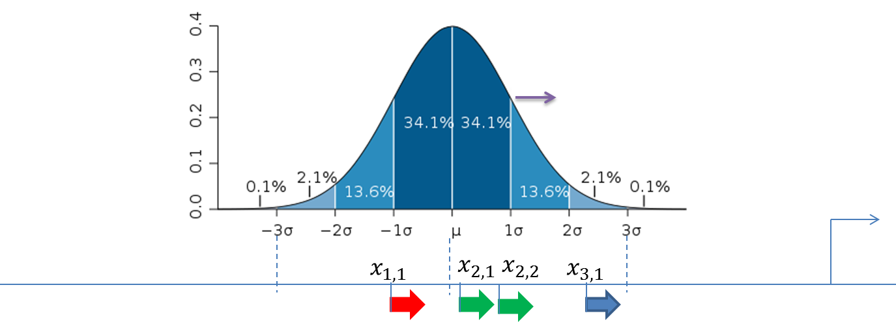

# Description of analysis methods

## Sequence analysis methods

## SNP matching

NGS DNA sequencing is a powerful analytical method to discover novel SNPs and
detect known SNPs. The geneXplain platform provides a unique analysis method
termed SNP matching. Using this method and an SNP table (derived after sequencing) as input, the corresponding SNP loci are mapped to Ensembl genes so that you can get an annotated SNP table as output.

By default the SNP matching tool looks as shown below:

Example:

An example data file to be used as an input table for SNP matching may look like
this:

In this table, ID is the SNP identifier, CHR is the chromosome, P is some
p-value, and POS_B36 is the genomic position of a given SNP in NCBI-build36
human genome.

You can save this table in the repository and input the saved table in the SNP
matching tool. The tool yields three output files as shown below:

Output table 1 (ALC_SNPs_annotated)

Output table 2 (ALC_SNPs_genes)

Output table 3 (ALC_SNPs_track)

The output tables can be further used for any other analysis of the geneXplain
platform.

## Site search on gene set

This feature provides you with an option to search for putative transcription
factor binding sites (TFBS) in a set of genes. As input for the analysis you are
supposed to indicate two gene sets, Yes (e.g. differentially expressed in an
experiment, test set) and No (set of background genes, control set) as well as
positional range relative to the TSS and a collection of predefined weight
matrices with a particular threshold (profile).

The initial form of this analysis looks as it is shown below:

To perform this analysis you have to input two datasets:

**Yes set**:  This is the set of genes that you want to analyze, for example
these can be genes the expression of which has changed in an experiment (test
set). Tables with Ensembl gene IDs can be used as input in this column. In case
you have a file with different identifiers, you can first use the Convert table
function in the Data manipulation folder.

**No set**: This is the set of background genes (control set). This again should
be a gene table with Ensembl gene IDs as input.

These two datasets might be taken from the output tables of previous analyses;
see, e.g., Detect differentially expressed genes as described previously. 

**Species**: A pull down menu allows you to select the biological species
according to the species of your Yes and No gene sets. Currently, the analysis
can be done for human, mouse and rat genes.

**From**: You can indicate the gene region where the search for putative TFBS
should be done. Here, you enter the 5’ border of the region, relative to the
transcription start site (TSS) as it is annotated in the current version of
Ensembl.

**To**: Here, you enter the 3’ border of the region relative to the TSS.

**Profile**:  This is a predefined set of positional weight matrices with a
particular threshold. By default, the TRANSFAC® profile
*vertebrate_non_redundant_minSUM* is applied.  You can use other available TRANSFAC® profiles. Alternatively, you can apply
profiles in the GTRD database. Currently, there are three profiles included in the GTRD database; they depend on the threshold for matrices: strong threshold (with an Individual Probability Score (IPS) higher than 6), moderate threshold
(with IPS higher than 5), and weak threshold (with IPS higher than 4).

You also have the option to import matrices and profiles into the geneXplain platform and use them for your further analysis.

To perform site search following steps are recommended:

**Step 1.** Input Yes set from the tree

Here, the set of genes from the Example folder is used as input Yes set :

https://platform.genexplain.com/bioumlweb/#de=data/Examples/Brain%20Tumor%20GSE1825%2C%20Affymetrix%20HG-U133A%20microarray/Data/Ewing%20Family%20Tumor%20versus%20Neuroblastoma/Upregulated%20Ensembl%20genes%20filtered%20(log%20FC%3E1.5)

**Step 2.** Input pre-saved No set. You can drag-and-drop as usual. Here, the
set of human housekeeping genes from the Example folder is used as input No set,
highlighted blue on the screenshot below:

**Step 3.** Select the species and the promoter length. By default the promoter
length is set as -1000 to +100 relative to the TSS. In this example, the range  
-500 to 100 is selected.

**Step 4.** Select the TRANSFAC® or GTRD profile from the pre-saved profiles in
the tool. In this example the default TRANSFAC® profile
*vertebrate_non_redundant_minSUM* is used:

**Step 5.** Identify the output path. Define where the folder with the results
should be located in your project tree. You can do so by clicking on the pink
field “select element” in the field Output path, and a new window will be
opened, where you can select the location of the results folder and define its
name.

Important: please define the output path within one of your Project folders.

Press [Run].

The analysis will start as shown below:

Wait until the analysis is complete as shown by the progress bar. The output of
Site search on gene set contains one table and six tracks:

summary table (), yes promoters (), no promoters (), yes sites (), no sites (), yes sites optimized () and no sites optimized ()

**The summary table** is automatically opened in a new tab of the geneXplain
platform when the analysis is completed. An example of the summary table is
shown below:

Each row summarizes the information for one PWM. For each selected matrix, the
columns Yes density per 1000bp and No density per 1000bp show the number of
matches normalized per 1000 bp length for the sequences in the input Yes set and
input No set, respectively. The Column Yes-No ratio is the ratio of the first
two columns. Only matrices with a Yes-No ratio higher than 1 are included in the
summary table. The higher the Yes-No ratio, the higher is the enrichment of
matches for the respective matrix in the Yes set. The matrix cutoff values as
they are calculated by the program at the optimization step are shown in the
column Model cutoff, and the last column shows the p-value of the corresponding
event.

### Tracks Yes promoters and No promoters

These two files resulting from the “Site search on gene set” analysis represent
promoters of the corresponding set, as a track (). The track files might be used for site visualization or for further analyses,  e.g. Construct Composite Modules, Construct IPS CisModule.

The track file *Yes promoters* when opened in the work space is shown below. The track file *No promoters* has a similar structure.

This table lists the positions of the promoter areas selected for the analysis
on particular chromosomes, as shown in the columns From and To. The column
Strand shows the strand on which each particular promoter is located. This track
can be dragged and dropped on a particular chromosome opened in the genome
browser to visualize the localizations of the promoters. 

**Yes (No) sites optimized track**: The file *Yes sites* visualizes those
putative sites that are over-represented in the promoters of the Yes set versus
the No set as they are located in the promoters of the Yes set. Putative TFBSs
are shown as a track

Scores of the putative sites are optimized by the algorithm.

This track is a list of all putative TFBS found in one analysis. Each row
presents details for each individual match for every PWM. The columns Sequence
(chromosome) name, From, To, Length and Strand show, correspondingly, genomic
location of the match including chromosome number, start and end positions,
strand and length of the match. The column Type contains information about the
type of the elements, in this case all matches are considered as “TF binding
site”. Further columns keep information about PWM producing each match (column
Property: matrix) as well as score for the whole matrix (column Property:
score). The column Property: siteModel contains the identifier for the
corresponding site model, which is the matrix together with a cutoff applied
(and in the example shown is identical to the matrix identifier).

*Yes (No) sites* **tracks** are very similar in structure. The major difference
is that these tracks include putative binding sites before the cutoff
optimization, and thus they contain more sites.

These track files can be used as an input for other functions, for example sites
can be visualized on chromosomes. For visualization details please refer to the
tip in the Section sites visualization. 

### Visualization of TFBS for individual genes and for individual matrices

Having the summary table opened in the work space, you can select different rows
and apply a couple of different functions with the help of the buttons on the
top menu bar. These five buttons are marked by red oval in the figure below.

To get a visualization of TFBS for individual genes, the button  should be applied on the selected matrices. After click on this button, two new files will be saved in the tree area, 
a table  and a track , as shown below. The table is automatically opened in the Work Space.

Let’s consider this table in more detail. Each row corresponds to one individual
gene.

The column ID presents the Ensembl ID for each gene, and the gene symbol is
shown in the column Symbol. The column Sites view shows a schematic
representation for each gene, where blue bars correspond to gene starts and
coding regions, and TFBSs for different matrices are shown by arrows of
different colors. The column Total count shows the number of TFBSs for all
matrices together in the promoter of each particular gene. The next columns are
named as matrices in the summary table and represent the number of TFBSs for
each matrix in each particular gene.

On the picture above the table is sorted by the column Total count, and on the
top we can see those genes that contain the highest total number of sites. This
table can be sorted by different columns corresponding to individual matrices,
and then on the top you will see those genes that contain the highest number of
sites for the matrix in focus.

The TFBS color schema can be customized. For this, open the tab „Site colors“ in
the Operation Field in the bottom right area of the tool (figure below). You can
see the default colors for different matrices, and can adjust them by clicking
on each color box.

This table can be exported in tab-separated format (txt) or comma-separated format (csv).

The second file, a track  has the same structure as described above for other track files. For visualization details please refer to the tip in Section visualization of sites. 

## Creation of customized profiles

"Profile" is a term used for a collection of positional weight matrices (PWMs)
with a particular threshold (or cutoff), also referred to as “site models”. The
geneXplain platform provides an option to create profiles from a table of site
models or from any gene table that contains some transcription factor genes. The
newly created customized profiles can be further used for analyses of regulatory
regions.

There are two possibilities to create a user-specific profile.

**Create profile from gene table**  This option supports you in creating a new profile from any gene table. The resulting profile contains site models linked to the genes encoding the corresponding transcription factors in the input gene set. This option can be accessed via the URL: <https://platform.genexplain.com/bioumlweb/#de=analyses/Methods/Site%20analysis/Create%20profile%20from%20gene%20table>

**Create profile from table**  Here you can create a profile from a table of matrices. This option can be accessed via the URL:
<https://platform.genexplain.com/bioumlweb/#de=analyses/Methods/Site%20analysis/Create%20profile%20from%20site%20model%20table>

### Create profile from gene table

This function creates a new profile from any gene table. The resulting profile
contains site models linked to the transcription factors in the input gene set.

The input form when opened in the work space is shown below:

In the following, we will consider each of the input fields.

**Gene set**:  Input any gene table here for which you intend to design a profile.
The algorithm automatically identifies transcription factor genes in the input
table and the matrices linked to these factors in the TRANSFAC® database. These
matrices will be put into the newly created profile.

Further steps are demonstrated with the table of genes available in one of the
platform examples present in the Tree Area. The example file can be accessed
using the URL:

https://platform.genexplain.com/bioumlweb/#de=data/Examples/Brain%20Tumor%20GSE1825%2C%20Affymetrix%20HG-U133A%20microarray/Data/Ewing%20Family%20Tumor%20versus%20Neuroblastoma/Experiment%20normalized%20(RMA)%20(Differentially%20expressed%20genes%20Affy)/Genes%2C%20fold%20change%20and%20p-value%2C%20non-filtered

**Species:** Select the biological species corresponding to the input gene set from
the drop-down menu.

**Reference profile:** Specify one of the TRANSFAC® profiles available. Cutoffs for
the corresponding matrices will be copied from the selected reference TRANSFAC®
profile into the newly created profile.

To select the reference profile click on the box of this field and a new window
will be opened. Scroll towards the desired profile and click on it so that the
name of the selected profile is displayed in the field “Name”. When the
selection is done, press [Ok].

Please note that this analysis method works only for the TRANSFAC® profiles.

**Output path:** Specify the path to store the result and indicate the name for the
new profile.

Having filled all the input fields, launch the analysis with the [Run] button.
The process will start as shown below:

After completion of the analysis the output profile is opened automatically as
shown below:

Let us now have a look into the newly created profile.

Each row presents the information for one site model. In the column Name the
name of the site model is given which here is the same as for the matrix. In the
column Matrix name the name for the positional weight matrix is present. For
each site model, a cutoff adapted from the “Reference profile” is shown in the
column Cutoff.  
According to the TRANSFAC® standard, the core part is specified for each matrix.
The core is represented by the 5 consecutive most conserved nucleotides. The
columns Core cutoff, Core start and Core length provide details about the core
of each matrix. In the last column the matrix logo is shown.

In the Tree Area, the newly created profile has the symbol  , the same symbol as for all other profiles, and is ready to use for the analysis of regulatory regions.

#### Suggestion when to use “Create profile from gene table”

If you plan to do a promoter analysis for differentially expressed genes from a
particular experiment, you might be interested in creating a profile from a
table of genes expressed under the same conditions. For example, you might take
one of the tables resulting from the workflows “Detect differentially expressed
genes…” as input gene table for profile creation.

The example table is a list of non-filtered genes from the workflow “Detect
differentially expressed genes…”:

[https://platform.genexplain.com/bioumlweb/\#de=data/Examples/Brain%20Tumor%20GSE1825%2C%20Affymetrix%20HG-U133A%20microarray/Data/Ewing%20Family%20Tumor%20versus%20Neuroblastoma_new/Experiment%20normalized%20(RMA)%20(Differentially%20expressed%20genes%20Affy)/Genes%2C%20fold%20change%20and%20p-value%2C%20non-filtered](https://platform.genexplain.com/bioumlweb/#de=data/Examples/Brain%20Tumor%20GSE1825%2C%20Affymetrix%20HG-U133A%20microarray/Data/Ewing%20Family%20Tumor%20versus%20Neuroblastoma_new/Experiment%20normalized%20(RMA)%20(Differentially%20expressed%20genes%20Affy)/Genes%2C%20fold%20change%20and%20p-valu)

A profile created from this gene table can be found here:

<https://platform.genexplain.com/bioumlweb/#de=data/Examples/Brain%20Tumor%20GSE1825%2C%20Affymetrix%20HG-U133A%20microarray/Data/Ewing%20Family%20Tumor%20versus%20Neuroblastoma_new/Genes%2C%20fold%20change%20and%20p-value%2C%20non-filtered%20profile>

Such a profile contains matrices for the transcription factors expressed under
the same experimental conditions, and thus it might be reasonable to apply it
for the promoter analysis of genes up-regulated or down-regulated in this
experiment.

### Create profile from site model table

This function creates a profile from the table of site models. For example, a
new profile can be created from the *summary* table resulting from the workflow
“Analyze promoters (TRANSFAC®)” or “Upstream analysis (TRANSFAC® and TRANSPATH®)”.

The analysis input form can be found in the Tree Area, under the Analyses tab,
in the folder Methods/Site analysis. The opened input form is shown below.

Let us consider the individual input fields:

**Input table:** Input a table with matrices for which you intend to design a
profile. The input table should contain TRANSFAC® matrix IDs as row names. Such
a table can be the result of a site search analysis.

In the following, further steps are demonstrated with a table of site models
from one of the examples. The example file can be accessed using the URL:

https://platform.genexplain.com/bioumlweb/#de=data/Examples/Brain%20Tumor%20GSE1825%2C%20Affymetrix%20HG-U133A%20microarray/Data/Ewing%20Family%20Tumor%20versus%20Neuroblastoma/Upregulated%20Ensembl%20genes%20filtered%20(log%20FC%3E1.5)%20site%20search/summary

**Reference profile:** In this field, you indicate the profile where the cutoffs for
the new profile should be taken from. It is filled automatically if the input
table is a result of a site search analysis or derived from it, and it
corresponds to the profile used for site search. You also have an option to
manually select the reference profile from the available TRANSFAC® profiles.

**Cutoffs column:** In this field you specify which column of the input table should
be considered for the cutoff values. It is filled automatically if the input
table is the result of a site search optimization analysis. It is advisable to
use "(none)" to leave the cutoffs as in the reference profile.

**Output profile:** Specify the path to store the result and indicate the name for
the new profile.

To launch the analysis, fill the input fields and press [Run]. The process will
start as shown below:

After completion of the analysis the output profile is opened automatically as
shown below:

An example profile created from this gene table can be found here:

https://platform.genexplain.com/bioumlweb/#de=data/Examples/Brain%20Tumor%20GSE1825%2C%20Affymetrix%20HG-U133A%20microarray/Data/Ewing%20Family%20Tumor%20versus%20Neuroblastoma/summary%20profile

Each row summarizes the information for one site model. In the column Name the
name of the site model is given, which in the majority of cases is the same as
for the matrix. In the column Matrix name the name for the positional weight
matrix is present. For each site model, cutoff is shown in the column Cutoff.
According to the TRANSFAC® standard, the core part is specified for each matrix.
The core is represented by the 5 consecutive most conserved nucleotides. The
columns Core cutoff, Core start and Core length give details about the core of
each matrix. In the last column the matrix logo of each matrix is shown.

The new created profile has the symbol , the same symbol as for all other profiles, and is ready to use for the analysis of regulatory regions.

#### Suggestion when to use “Create profile from table”

Creating a new profile from a table of site models (matrices) might be very
useful e.g. if you plan to focus the analysis on those matrices shown to be
over-represented upon the first run of promoter analysis and plan further to
construct composite promoter models.

For this, you first run a site search with optimization, e.g. the workflow
“Analyze promoters (TRANSFAC®)” or “Upstream analysis (TRANSFAC® and
TRANSPATH®)”. Then, you can use the table *summary* as an input to construct
your specific profile.

It will contain only those site models (matrices) for which hits are
over-represented in your genes of interest versus the background set, which is a
specific subset of the TRANSFAC® matrix library. Having such a profile specific
for your genes of interest, you can run it on the same set of genes without
optimization, and then use the results as input to construct composite promoter
models.

### Create profile from matrix library

This tool can set score cutoffs for an entire matrix library and store a
corresponding profile, which in turn can be applied binding site analyses.

The figure below shows the default input mask. There are two general ways of
setting score cutoffs, either by P-value (the default) or as one cutoff value
that will be applied to all matrices.

The input parameters are as follows.

**Input matrix library:** Selection of the matrix library. All matrices of the
library will be present in the profile (“Output profile”).

**Core-cutoff:** The cutoff for the matrix core, which is the five consecutive
matrix position which are most selective for certain nucleotides. When the
matrix cutoff is defined by a P-value, the core cutoff will be 0 for all
matrices.

**Template for cutoffs:** The P-value threshold according to which the score cutoff
for each matrix will be set. Selecting the “Custom…” option presents a new field
to set one common cutoff for all matrices of the library.

**Nucleotide distribution template:** The distribution of nucleotides on which
P-value calculations are based. Selecting the “Custom…” option enables custom
setting of individual base frequencies.

**Output profile:** The path for the output profile.

An profile can be created as follows.

**Step 1.** Input the matrix library. As usual, you can drag-and-drop. Here we
use the TRANSFAC® 2017.1 library:

**Step 2.** Edit other input parameters as shown in the figure above. The output
profile path needs to be chosen in a writable directory, e.g. one of your
projects.

Clicking the [Run] button will invoke the analysis. A part of the resulting
profile is shown below: Resulting profile can be accessed using the URL:

### Search for enriched TFBSs

The platform comprises tools that are dedicated to discovering types of binding
sites enriched in a set of sequences. They are named “Search for enriched TFBSs
(genes)” and “Search for enriched TFBSs (tracks)”. Both apply a common core
algorithm to gene promoters or tracks, respectively. The “Search for enriched
TFBSs”-tools are accessible in the “Analysis” tab under “analyses/Methods/Site
Analysis”.

Dedication to discovering enriched types of binding sites means that these
methods won’t bother with storing predicted binding sites and they also do not
require predictions as input. Their sole output is a relatively small table
summarizing the enrichment detected for PWM models in a sequence set of
interest. As a result, the *“Search for enriched TFBSs”*-tools are often
considerably faster than solutions that have to read and write binding site
information. In addition, their outputs consume only the disk space needed to
present the results of analyzing binding site enrichment. Hence, a “Search for
enriched TFBSs” is for you if you wish to gain insight into enriched binding
sites quickly and in an uncomplicated way.

#### Search for enriched TFBSs (genes)

Let us begin with the analysis for gene promoters. The figure below depicts the
input mask of the analysis tool. The parameters are similar to those used by
“Site search on gene set” and are described in the following.

**Yes set**: This is the set of genes that you want to analyze, for example these
can be genes with altered expression. The program accepts genes specified by
Ensembl gene identifiers. Note that the “Convert table” functionality in the
“Data manipulation” folder can map other identifiers to the required Ensembl
genes.

**No set**: This is the set of background genes (control set), which also need to be
specified by Ensemble gene IDs.

These two datasets might be taken from the output tables of previous analyses;
see, e.g., “Detect differentially expressed genes” 

**Species**: This option specifies the biological species of Yes and No gene sets.
Currently, the method is applicable to human, mouse or rat genes.

**From and To**: These values define the length and location of promoter regions
(upstream and downstream) relative to the transcription start site (TSS).
Respective sequence regions are extracted for each Yes and No gene according to
Ensembl annotation.

**Input motif profile**: The profile lists the PWMs (motifs) to be used for binding
site prediction together with a score cutoff. By default, this field is set to
the last profiled set in your workspace. Note that cutoffs in the profile are
ignored, because the “Search for enriched TFBSs” determines a starting threshold
specified in the Initial cutoff field.

**Output path**: In this field you select a path in the workspace to store the
output table.

**Initial cutoff**: This cutoff determines the starting point of the analysis with
respect to the score threshold to predict binding sites. The choice is expressed
as frequency of predicted sites per base. By default, the analysis begins with a
frequency of 5 sites in 100 bases (0.05). From the initial cutoff the algorithm
iterates over higher cutoffs and eventually reports the one that resulted in
optimal enrichment of binding sites in the Yes set. This is done separately for
each PWM.

The steps of an analysis can be described as follows:

**Step 1.** Input Yes set from the tree. As usual, you can drag-and-drop. Here,
the set of genes from the Example folder is used as input Yes set, can be
accessed using the URL:

https://platform.genexplain.com/bioumlweb/#de=data/Examples/Brain%20Tumor%20GSE1825%2C%20Affymetrix%20HG-U133A%20microarray/Data/Ewing%20Family%20Tumor%20versus%20Neuroblastoma/Experiment%20normalized%20(RMA)%20(Differentially%20expressed%20genes%20Affy)/Upregulated%20Ensembl%20genes

**Step 2.** Input No set (drag-and-drop). Our example uses the set of
“Non-changed Ensembl genes”

https://platform.genexplain.com/bioumlweb/#de=data/Examples/Brain%20Tumor%20GSE1825%2C%20Affymetrix%20HG-U133A%20microarray/Data/Ewing%20Family%20Tumor%20versus%20Neuroblastoma/Experiment%20normalized%20(RMA)%20(Differentially%20expressed%20genes%20Affy)/Non-changed%20Ensembl%20genes

**Step 3.** Select the TRANSFAC® or GTRD profile from the available profiles. In
this example, we select the TRANSFAC® 2017.2 profile named “vertebrates”:

**Step 4.** Edit the output path (highlighted green in the figure above). After
setting the Yes gene set, a default output path is suggested. The Example folder
may however not be writable for your account requiring selection of an
alternative such as one of your own projects. A different selection can be made
easily by clicking on the field.

We keep the defaults for promoter range (starting from 1000th base upstream to
the 100th base downstream of the TSS) and initial cutoff.

Clicking the [Run] button will invoke the analysis. The *summary* table

is automatically opened in a new tab when the analysis is completed. Here is a
part of the output from our example:

Each row of the output table represents the result for one PWM from the input
profile. Fold enrichment (FE) values quantify the enrichment of binding sites in
the Yes sequence set as a whole (Adj. site FE) and of Yes sequences with at
least one binding site (Adj. seq FE). The FE is an odds ratio that compares the
ratio of Yes sites to No sites with the ratio of Yes sequences to No sequences.
Unlike in other tools the FE values are statistically corrected (adjusted)
quantities that report a value below the actually observed ratio according to
the 99% confidence interval. This correction takes into account the underlying
site numbers and sequence numbers and penalizes enrichment values that are based
on only few binding site occurrences, e.g. at a high score threshold. The output
table is sorted by the adjusted Site FE by default.

The statistical significance of enrichment is further assessed by one-tailed
binomial test and Fisher tests P-values, for which False Discovery Rates (FDRs)
are reported. The Site FDR is based on binomial test P-values calculated for the
number of binding site in Yes and No set. The Seq FDR column contains FDRs for
Fisher test P-values for the number of sequences with at one site in Yes and No
sets.

Additional columns are available via the “Columns” tab of the lower-right panel.
Each column is also accompanied by a concise description and can be included
into the table presentation upon demand.

### Search for enriched TFBSs (tracks)

The “tracks” variant of the “Search for enriched TFBSs” can be applied to
sequence tracks signified by the symbol (). For instance, a track may contain genomic intervals identified by a ChIP-seq experiment.

The analysis uses the following parameters:

**Yes set:** This is the track that you want to analyze, for example these can be
ChIP-seq intervals bound a transcription factor.

**No set:** This is the set of background intervals (control set).

**Sequence source:** Both Yes and No track need to refer to a common source, such as
a genome, as specified by this parameter. Note that you can apply a custom
source, e.g. a specifically uploaded genome. Clicking on the “Custom” option
will open a new field to choose the custom sequence source.

**Input motif profile:** The profile lists the PWMs (motifs) to be used for binding
site prediction together with a score cutoff. By default, this field is set to
the last profiled set in your workspace. Note that cutoffs in the profile are
ignored, because the “Search for enriched TFBSs” determines a starting threshold
specified in the Initial cutoff field.

**Output path:** In this field you select a path in the workspace to store the
output table.

**Initial cutoff:** This cutoff determines the starting point of the analysis with
respect to the score threshold to predict binding sites. The choice is expressed
as frequency of predicted sites per base. By default, the analysis begins with a
frequency of 5 sites in 100 bases (0.05). From the initial cutoff the algorithm
iterates over higher cutoffs and eventually reports the one that resulted in
optimal enrichment of binding sites in the Yes set. This is done separately for
each PWM.

The platform is provides an out-of-the-box example for this tool under
“*data/Examples/ Encode TFBS CEBPB in H1-hESC cells*”. The ChIP-seq experiment
targeted CEBPB binding sites in H1-hESC cells. The steps of an analysis can be
described as follows:

**Step 1.** Input the Yes set from the tree. As usual, you can drag-and-drop.
The YES set contains the 500 most significant peaks:

**Step 2.** Input the No set (drag-and-drop). The NO set contains 1000 random
intervals from promoter regions with the same length distribution as the 500 YES
intervals:

**Step 3.**

Select the TRANSFAC® or GTRD profile from the available profiles. In this
example, we select the TRANSFAC® 2017.2 profile named “vertebrates”:

**Step 4.** Edit the output path. After setting the Yes gene set, a default
output path is suggested. The Example folder may however not be writable for
your account requiring selection of an alternative such as one of your own
projects. A different selection can be made easily by clicking on the field.

Clicking the [Run] button will invoke the analysis. The *summary* table

is automatically opened in a new tab when the analysis is completed. A part of
the output for our example is shown below. Please refer to “Search for enriched
TFBSs (genes)” for further description.

## Construct composite modules

Composite modules are combinations of several TFBSs that are found together in a
set of regulatory sequences. We search for such combinations of TF binding sites
that are overrepresented in the regulatory sequences under study compared to a
background set of sequences. The search for composite modules is performed using
an in-house implementation of a genetic algorithm. As input for the genetic
algorithm we take the output of a site search analysis.

There are two individual analysis functions available with the same symbol ; they are different with respect to the type of sequences where the search for composite modules is done, and correspondingly with respect to the format of the input data.

-   Construct composite modules analysis works on the promoter sequences
    specified relative to TSS in the set of genes. As input, it takes the
    results of the Site search on gene set analysis function.

-   Construct composite modules on tracks works with any DNA sequences specified
    by their absolute genomic positions, and is very often applied for the
    analysis of ChIP-seq fragments. As input, it takes the results of the Site
    search on track analysis function.

Both analysis functions can be found in the geneXplain platform online under the
path

<https://platform.genexplain.com/bioumlweb/#de=analyses/Methods/Site%20analysis/>

### Construct composite modules

This analysis function enables the identification of combinations of several
TFBSs in the promoters of the genes under study (Yes-set). The resulting
composite module differentiates the Yes-set from a background set (No-set).

Before starting this analysis, you need to perform *Site search on gene set*
with your selected Yes-set, No-set and a specified profile of matrices. If you
are interested in finding site models for particular TFs, and see them
eventually in the resulting composite modules, you need to be sure that such
matrices are present in the selected profile. You can use one of the available
TRANSFAC® profiles, or alternatively you can construct a customized profile as described earlier. 
The input form for this analysis is shown below:

**Step 1**. Specify Site search result. This is the input field for the
analysis, where you specify the results of the site search. The input field is
marked by the symbol

, which means that the input data set should have the same symbol.

In the example below, we will use an input data set, which you can find in the
geneXplain platform online under the following path:

https://platform.genexplain.com/bioumlweb/#de=data/Examples/Brain%20Tumor%20GSE1825%2C%20Affymetrix%20HG-U133A%20microarray/Data/Ewing%20Family%20Tumor%20versus%20Neuroblastoma/Upregulated%20Ensembl%20genes%20filtered%20(log%20FC%3E1.5)%20(Upstream%20analysis%20Transfac%20and%20Geneways)/Site%20search%20-1000%20%2B100/summary

As you can see, this is a folder with the results of the Site search on gene
set. If you single-click on this folder in the tree area it will be highlighted
in blue, and in the Info box you can find a description of all the details about
Yes-set, No-set, profile, promoter regions applied to get these results (cf.
screenshot below).

You can drag & drop the name of the folder *Upregulated Ensembl genes
LogFoldChange \>1.2 sites -500..100, profile 0.001* into the input field, or you
can select it in the tree in the pop-up window if you click on the pink box of
the input field.

**Step 2.** Specify Model parameters. You can specify the number of elements in
the hierarchical structure of the desired composite module. Details and
explanations on how to do this are explained  in the section *Hierarchical structure of the composite modules*.

**Step 3.** Specify Output path. Specify a location for the results in your
project in the tree area. The resulting folder will be marked by the same icon
as the analysis, 

.

Results are described below.

### Construct composite modules on tracks

This analysis is designed for identifiying combinations of several TFBSs in DNA
sequences specified by their genomic positions (tracks). An example of a track
that is very often used is a set of the ChIP-seq data. The resulting composite
module differentiates between a Yes-track and a background (No-track).

Before starting this analysis, you need to perform *Site search on track* with
your selected Yes-set, No-set and specified profile of matrices. If you are
interested in seeing the site models for particular TFs in the resulting
composite modules, you have to make sure that such matrices are present in the
selected profile. You can use one of the available TRANSFAC® profiles, or
alternatively you can construct a customized profile. 

The input form for this analysis is shown below:

**Step 1**. Experiment track is the input field for the Yes-track, or track
under study.

**Step 2**. Control track is the input field for the No-track, or background
track.

**Step 3.** Model parameters. You can specify the number of elements in the
hierarchical structure of the desired composite module. You may find details and
explanations on how to do this below in Section 9.5.3 “Hierarchical structure of
the composite modules”.

**Step 4.** Output path. Specify a location for the results in your project in
the tree area. The resulting folder will be marked by the same icon as the
analysis:

.

Results are described below . 

**Note.** This analysis is the central part the workflow ChIP-Seq - Identify
composite modules on peaks (TRANSFAC®), and it might be more convenient to use
the workflow instead of the individual analysis.

#### Hierarchical structure of the composite modules

Composite modules may have a complex hierarchical structure consisting of two
levels: site models and modules. The highest hierarchical level contains several
modules and corresponds to the promoter model.

The first level, **site model**, corresponds to the individual site model, often
based on one PWM. Names of the site models are often the same as the matrix
names (in case the site models are based on a library of matrices). The site
models are taken from the profile that was used in the site search. In the
resulting schemas the site models are shown by blue boxes, for instance:

Within these boxes, there are two values below the site model. The first value
is the threshold value for the score of the respective site model, which is
determined by the genetic algorithm during the optimization process (here it is
equal to 0.81); in some cases this value is equal to 0.0, which means that the
original threshold value given in the profile was found by the algorithm to be
the optimal one. The second value, in this example N=2, is the maximum number of
best found individual matches (sites) for this site model which are taken into
account for calculating the score of the module.

The next level, **module**, may contain several site models, shown within the
light brown boxes:

The module is characterized by its width, the average length of DNA window
containing matches for the mentioned site models. In the example, the module
width is 237 bp. In the resulting schemas modules are shown in green boxes, and
they are numbered, e.g. Module 1, Module 2, ….

In the input form you can define the complexity of *the promoter model* to be
constructed by specifying the number of units of each level: number of modules,
number of site models, and also the minimum and maximum numbers of individual
sites to be considered. In order to illustrate how to specify these parameters,
let’s consider three examples of resulting modules depending on the input
parameters.

**Example 1**:

In the picture below (left part) you can see the composite module resulting from
the performed analysis. On the right side of the picture the input form with
specified parameters is shown.

We can see that Min modules (minimum number of modules) and Max modules (maximum
number of modules) is 1, and correspondingly there is just one module in the
resulting picture, Module 1, highlighted by the red circle on both the resulting
schema and the input parameters.

The blue circle highlights the parameters Min models (minimum number of site
models within one module) and Max models (maximum number of site models within
one module) in the input form. As we can see, the number of site models is set
to vary from 4 to 12. Correspondingly, in the resulting schema (left part above)
there are 11 site models (blue boxes) identified by the algorithm.

The third parameter, Min sites to accoun**t** (minimum number of individual
sites for each site model to be considered) and Max sites to account (maximum
number of individual sites for each site model to be considered), is highlighted
by a green circle. As we can see, this parameter is set to vary from 1 to 3, and
correspondingly in the resulting schema, for the different matrices we can see
N=1 or N=2 or N=3.

**Example 2**

In this example, the number of modules (red circles) is specified from 2 to 3,
and correspondingly the resulting promoter model contains three modules, Module
1, Module 2, and Module 3 (picture below, left part, red circles).

The number of site models is specified in the input form as from 2 to 2, which
means that we are going to search for pairs of individual site models. In
agreement with the input parameters, in the resulting schema we can see each
module containing two site models highlighted by blue circles.

**Example 3**

In this example, the number of modules (red circles) is specified from 2 to 5,
and correspondingly the resulting promoter model consists of four modules
selected by the algorithm, Module 1, Module 2, Module 3 and Module 4 (picture
below, left part, red circles).

The number of site models is specified in the input form as from 2 to 3, which
means that we would like to find either pairs or triplets of individual site
models. In agreement with the input parameters, three out of four modules
contain three site models (highlighted by blue circles within Module 1), and one
module, Module 3, contains two site models.

Based on these three examples you can specify input parameters for the number of
modules, site models, and individual sites, depending on what resulting promoter
model you would like to get.

#### Site models in focus

There are situations when researchers would like to focus on particular TFs and
would like to find out with what other TFs they may form composite modules. Site
models that must be present in the resulting modules, are referred to as site
models in focus. In the *expert options* menu, under *Score calculation
parameters*, there is a field Site models in focus. As soon as the site search
results are submitted to the input field, all site models from the profile used
before for site search are now available for selection via the drop-down menu,
as shown on the screenshot below.

In this example, we can see that V\$AP1_Q2_01 is selected. Using the Ctrl
button, several matrices from the list can be selected.

As soon as the site model is selected, two new fields will appear just below the
field Site models in focus (screenshot below).

All modules contain site model in focus. When this box is checked, all the
resulting modules must contain specified site models. When it is unchecked, at
least one of the resulting modules must have a specified site model, and other
may have them too, but not necessarily.

Focused sequences percent. In the drop-down menu, you can specify the minimum
percentage of the Yes sequences (genes, promoters) that must contain modules
with the specified site models in focus.

### Visualization and interpretation of the results

Let us consider the results of the *Construct composite module* analysis
obtained for the following input data set, which you can find in the geneXplain
platform online under the following path:

[https://platform.genexplain.com/bioumlweb/\#de=data/Examples/Brain%20Tumor%20GSE1825%2C%20Affymetrix%20HG-U133A%20microarray/Data/Ewing%20Family%20Tumor%20versus%20Neuroblastoma_new/Upregulated%20Ensembl%20genes%20filtered%20(log%20FC%3E1.5)%20sites%20-1000..100/CMA%202%20to%205%20modules%20(Upregulated%20Ensembl%20genes%20filtered%20(log%20FC%3E1.5)%20sites%20-500..100)/Model%20visualization%20on%20Yes%20set](https://platform.genexplain.com/bioumlweb/#de=data/Examples/Brain%20Tumor%20GSE1825%2C%20Affymetrix%20HG-U133A%20microarray/Data/Ewing%20Family%20Tumor%20versus%20Neuroblastoma_new/Upregulated%20Ensembl%20genes%20filtered%20(log%20FC%3E1.5)%20sites%20-1000..100/CMA%202%20to%205%20modules%20(Upregu)

Input parameters used were the following:

As result, a new folder is generated containing two tables, two tracks, and one
histogram, as shown below.

#### Model visualization in Yes set

This table represents the primary results of the analysis, and shows the
visualization of the identified composite modules in the promoters of the Yes
set.

Each row in this table corresponds to one gene of the Yes set, and for each gene
the Ensembl ID and the gene symbol are shown in the two first columns. The
column Model displays a symbolic map of the gene promoter taken for the
analysis, in this case -500/+100 relative to the TSS. Arrows of different colors
correspond to individual TFBSs, and a gradient in grey corresponds to the
statistical density of the identified composite modules. The most intensive grey
color corresponds to the center of a composite module. Each individual TFBS on
this map is clickable, and upon a click information is displayed in the Info box
(bottom left corner in the tool). As an example, one blue arrow is selected on
the promoter of the top gene in the screenshot above, and for this selected TFBS
the following details are shown in Info box:

The last column in the table, Score, shows a score calculated for each promoter
depending on the number of modules, site models, sites, their scores and other
statistical parameters. The higher the score for a promoter, the better the
differentiation of this promoter from the promoters of the No set. The column
Score is used for default sorting of the table, with the highest scores on top.

Having opened the table Model visualization on Yes set, you can see the
schematic representation of the hierarchical structure of the identified
composite module as well as a comprehensive set of its statistical
characteristics at the bottom part of the tool, under *My description* tab, as
shown on the screenshot below.

Yes track

The Yes track provides essential information about the regulation of individual
promoters and is therefore important to be included in the visualization of
individual promoters by the genome browser.

The schematic visualization can be comfortably extended to a more detailed
visualization for each individual promoter.

To do this, open the table *Model visualization on Yes set*, select one row in
the table with a mouse click, and open the tab *Genome browser* in the
*Operation Field* (bottom right part of the tool),.

For a selected promoter, you can see a more detailed map, including the names of
the matrices and the numbers of individual modules, M1 through M4. Each element
of this interactive map has a corresponding check box. Unchecked elements will
not be displayed on the map. De-selection is applied simultaneously to both the
detailed view of one promoter, and the table with the schematic representation
of all promoters.

To adjust colors for individual matrices, you can open the next tab to the
right, called *Site colors*, and change the colors to your liking by clicking on
the individual colored box, as shown below.

#### Model visualization on No set and No track

The table *Model visualization on No set* shows a visualization of the
identified composite modules in the promoters of the No set.

The structure of this table is the same as that of the *Model visualization on
Yes set* table, described above.

The function of the **No track** is to provide a possibility for a detailed
visualization of no promoters in a way similar to that of the **Yes track**.

#### Histogram

The distribution of scores for individual promoters is shown as a histogram,
where the promoter score value is shown on X axis and the percentage of
promoters (% sequences) having this score is shown on the Y axis.

This histogram can be further interpreted applying the statistical
characteristics described above.

The center, a vertical grey line, corresponds to the average score value and is
equal to 3.44 in this example. Promoters from the No set with a score above 3.44
are shown in the histogram as blue bars to the right of the center, and they are
referred to as false positives. In this example, the false positive rate is
16.82 %.

Promoters from the Yes set with a score below 3.44 are shown in the histogram as
red bars to the left of the center, and they are referred to as false negatives.
In this example, the false negative rate is 23.42 %.

A visual analysis of the histogram suggests that the Yes promoters with a score
above 4.5 are very well separated from the No promoters, which means that for
this part of the promoters the composite model constructed is most suitable. In
this example there are 38 promoters with the score value \>4.5; they can be
saved as a separate gene set, and for them the model obtained works best.

#### Score calculation of the composite models

The figure below demonstrates the calculation of the score value for the
composite modules in the promoter sequences. The TSS is shown as a thin arrow on
the right side of the figure. Four thick arrows exemplify four sites found in
this promoter. The color of the arrows exemplifies the site model which these
sites belong to (three site models – red, green and blue).

A promoter model consists of *K* modules. The score of each module *Mk*
(*Score(Mk)*, *k* = 1, …, *K*) is calculated according to this formula:

Here, *Site Score (t,i)* is the site score for the sites found in the promoter, which
is calculated by the Match algorithm.

*mt* – the number of sites of the site model *t* found in the promoter.

*Tk* – the number of site models in the module *Mk*, and

The final promoter score is calculated as the sum of the module scores *Mk*.

Standard deviation (*σ*) of the normal distribution is subject of optimization
by the genetic algorithm and represents the width of the module in the output of
the composite module analysis.

## About the GSEA analysis and the interpretation of the results

### Schematic description of the GSEA algorithm

The Gene Set Enrichment Analysis (GSEA) is a method that determines whether an
independently defined set of genes shows a statistically significant enrichment
either in up-regulated or down-regulated genes
<http://www.broadinstitute.org/gsea/doc/GSEAUserGuideFrame.html>

Independently defined sets of genes might be groups of genes linked to Gene
Ontology terms, or to TRANSPATH® pathways, or to Reactome pathways, etc.

As input for the GSEA, we can use either normalized tables after normalization
of the microarray raw data, or a table with genes that contains a column with
pre-calculated expression values. The algorithm of the GSEA can be schematically
presented in three steps:

All genes are sorted by Fold Change, from highly up-regulated to highly
down-regulated. In such a sorted table, each gene is given a rank, which is just
the number of the line where this gene is located in the sorted table. The most
highly up-regulated gene has the rank “1”, and so on.

The algorithm takes a set of genes linked to one biological term (e.g. to a
particular GO category) and maps each gene in this set to the sorted (ranked)
table. Genes in some categories might be distributed randomly over the ranked
table; some are among the up-regulated, some among the down-regulated, and some
among the non-changed genes. For some of the GO categories, a majority of the
genes are among the up-regulated. These GO categories are the most interesting
for a biological interpretation.

Several statistical parameters, ES (Enrichment Score), NES (Normalized
Enrichment Score), Rank at max, nominal p-value, FDR, for each GO category are
calculated. ES and NES reflect how significantly genes in each particular GO
category are enriched (over-represented) among up-regulated genes.

### Structure of the resulting tables with enriched ontological terms

The resulting tables with enriched ontological categories contain twelve
columns. Here, to have a better resolution of the screenshots, one table is
shown in two parts. This is the result of a GSEA using the PROTEOME™ biological
process.

Each row presents details about one enriched ontological term. The column **ID**
comprises the identifier of the ontological category, here identifiers of Gene
Ontology biological process terms. These identifiers are hyperlinked to the page
http://www.ebi.ac.uk/QuickGO/ where you can get further information about this
ontological term. In case of enrichment by HumanPSD™ diseases the disease
identifiers are hyperlinked to http://ctdbase.org/

The columns **Title** and **Group size** contain further details about the
ontological terms, the title and the number of genes linked to this term in the
corresponding database, here in HumanPSD™.

The column **Expected hits** shows the number of genes expected to fall into
this category by random chance, based on the size of the input set and the size
of the category.

Five columns, Nominal P-value, ES (Enrichment Score), Rank at max, NES
(Normalized Enrichment Score), and FDR, show corresponding statistics of the
results. For more details about each of these statistics, please refer to
<http://www.broadinstitute.org/gsea/doc/GSEAUserGuideFrame.html>, under the
section *Interpreting GSEA results/GSEA statistics*.

The column Number of hits shows how many genes from the input set fall into the
enrichment group; these genes are explicitly listed in the column Hit names. As
the lists can get quite long, only a few genes are shown by default in each row.
To get the full list, press (more). The column Plot and View diagrams are
described in detail in a separate sub-section below.

### Further possible actions with the enrichment results.

The tables with the GSEA results can be exported in txt, csv or html formats. To
export, you can apply the *Export* button in the top control menu, highlighted
by the dark-blue oval.

One or several rows of the table can be selected with shift-click , shown in
blue color in the screenshot below. Having selected one or several rows in this
way, you can save hits of these rows in a separate gene table, with the button
*Save hits* in the top control menu, highlighted by the red oval. Such genes
tables can be analyzed further, e.g. to find master regulatory molecules in the
networks, and to identify transcription factors that might commonly regulate
these genes.

You can save the selected rows in a separate table, with the button *Save
selected rows as…* in the top control menu, highlighted by the green oval.

### Enrichment plots

As described above, there is a column **Plot** with the buttons **View** in each
row in the GSEA resulting tables.

Let’s open a visualization plot for the category defense response.

X-axis

On this line, all (human in this example) genes present in the input table are
ranked from 1 to approximately 23,000 according to their LogFoldChange. The
numbers we see on the X-axis, 2,500; 5,000 etc., are the ranks of the genes.

At the left end of the line X, up-regulated genes are located, and
down-regulated genes at the right end . The smaller the rank of a gene is, the
higher is its up-regulation.

Y-axis, right

This axis shows the values of the LogFoldChange. Positive values correspond to
up-regulated genes, negative values to down-regulated genes.

Blue plot

This is a distribution of LogFoldChange values among all (human) genes.

Y-axis, left

This axis shows the values of the ES parameter (also known in statistics as
Kolmogorov-Smirnov score). Positive values correspond to up-regulated genes,
negative values to down-regulated genes.

Red plot

This is a distribution of ES values for a particular GO category over all
(human) genes. ES is calculated by summing up on the previous values, so the
most interesting parts for us are those where the plot is coming up.

### Interpretation of the plots

For interpretation, let’s look at the red plot. The most interesting parts are
those where the red line is ascending. In this example plot, let’s follow the
red line from its left end to its maximum.

The starting point for the red line is 0 on the Kolmogorov-Smirnov score axis.  
Next, the algorithm takes each gene within the category "defense response", and
looks what the LogFoldChange for this gene is. If gene is up-regulated, the red
line grows.Then the algorithm takes the next gene from "GDP binding" and again
looks what the LogFoldChange for the 2d gene is. If it is also up-regulated, the
red line grows further. This is called incremental growth: the closer the next
gene is to the previous one on the X-axis, the more pronounced is the growth of
the red line.

Let’s add an auxiliary line (here, the green dotted line) from the maximum point
of the red plot down to the X-axis. The intersection of the green dotted line
with X-axis corresponds to the rank of the gene at maximum enrichment. This
value is exactly what in statistics is called Rank at max, and it is shown in a
dedicated column in the tables with the GSEA results. In the plot shown above,
the green line crosses the X-axis at approximately 4,500. To know this value
exactly, look at the table, and in the column Rank at max for this category, you
can find the number 4328.

To describe this plot, we can say:

“Genes belonging to the GO category *defense response* are enriched among the
top 4328 up-regulated genes”.
