1.  Analyze regulatory regions

This set of workflows helps to find putative TF binding sites in the DNA
sequences under study. There are several workflows in this group that perform
searches in different genomic regions, either in promoters, in the peaks
calculated from ChIP-seq data, or in any input DNA sequences. This group of
workflows is designed using the core functionality of a “site search on gene
set” analysis as described in Section 20.1.2.

1.  Motif quality analysis

This tool analyzes the quality of a motif model. The “Motif quality analysis”
item is located in the NGS folder of the analysis methods
([analyses/Methods/Site analysis/Motif quality
analysis](http://genexplain-platform.com/bioumlweb/#de=analyses/Methods/NGS/Mutation%20effect%20on%20sites))
and in the start page group ‘Microarrays’ under section ‘Analyze regulatory
regions’.

**Step 1.** Open the analysis form from the Start page. It will open in the main
Work Space and looks as shown below:

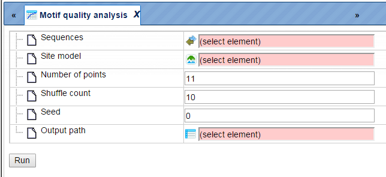

**Step 2**. The Sequences input is a track file with sequences containing the
motif.

The following link directs to an example input:

<https://platform.genexplain.com/bioumlweb/#de=data/Examples/Encode%20TFBS%20CEBPB%20in%20H1-hESC%20cells/Data/CEBP%20in%20H1-hESC%20cells%20YES>

**Step 3**. Select a Site model from a profile which can be used to compare the
input motif. The model can result from a workflow generated ‘Profile’, can be
selected from the TRANSFAC® database or can be built from the ‘[Create profile
from matrix library](https://platform.genexplain.com/bioumlweb/)’ method (input
is ChIPHorde or DiChIPHorde motif).

For this example we selected the profile:

<https://platform.genexplain.com/bioumlweb/#de=data/Examples/Encode%20TFBS%20CEBPB%20in%20H1-hESC%20cells/Data/ChIPMunk/CEBP%20H1-hESC%20cells%20motif%20profile>

CEBP H1-hESC cells motif profile

**Step 4**. Specify the total **Number of points** for sensitivity and FDR
calculation. By default, the analysis uses 11 points. For the example we use 50
points.

**Step 5**. Specify the number of **Shuffle counts**. This is the number of
times sequence characters are shuffled to generate random sequences for FDR
estimation. By default this number is 10.

**Step 6**. Select a **Seed** for the random number generator or keep the
default of 0.

**Step 7**. Declare the **Output path** to store results in the tree area.

After entering the input parameters, press ‘RUN’. The method starts as shown
below:

Post completion the output table is opened in the work space in a new tab and
consists of a table like the one shown below. Path to the examples is here:

https://platform.genexplain.com/bioumlweb/\#de=data/Examples/Encode%20TFBS%20CEBPB%20in%20H1-hESC%20cells/Data/ChIPMunk/CEBP%20H1-hESC%20cells%20motif%20profile%20CEBP%20in%20H1-hESC%20cells%20YES%20roc%2050

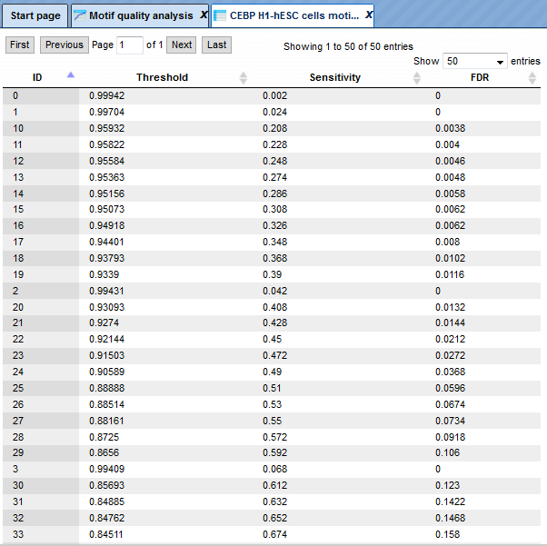

The output table can be used to create a ROC curve for the visualization of the
motif quality and for comparison of different motifs.

1.  Create matrix logo

This tool creates logo representations for position weight or frequency matrices
of transcription factor binding sites.

The input can be a profile with a set of matrices or a single matrix.

The input form is as shown below:

Each individual parameter is described below:

PWM (profile or matrix) – Specify the input profile or a single matrix. You can
drag it from your project within the tree area and drop it in the pink box of
the field PWM. Alternatively, you may click on the pink field “select element”
and a new window will be opened, where you can select the input gene set as
shown below.

Logo size – The method gives an option to select one of four different sizes for
the Matrix logo image. It ranges from small to extra-large.

Reverse – Check this box to create logos for the reverse orientation. By default
this box is unchecked.

Adjust height to information –Check this box to adjust total height of bases to
information content of position.

Sort bases –Check this box to sort bases, the most important on top.

Plot lines - Checked this box to draw lines behind bases partitioning plot
region into four sections.

Output folder – Specify the name and path of the output folder for the created
logos.

Here, we take a profile created by the workflow ‘[Identify enriched composite
modules in promoters
(TRANSFAC®)](http://platform.genexplain.com/bioumlweb/#de=analyses/Workflows/TRANSFAC/Identify
enriched composite modules in promoters (TRANSFAC(R))&fromDE=data/Examples/Brain
Tumor GSE1825, Affymetrix HG-U133A microarray/Data/Ewing Family Tumor versus
Neuroblastoma/Upregulated Ensembl genes filtered (LogFC>1)’ as input can be
accessed using the URL

<https://platform.genexplain.com/bioumlweb/#de=data/Examples/Brain%20Tumor%20GSE1825%2C%20Affymetrix%20HG-U133A%20microarray/Data/Ewing%20Family%20Tumor%20versus%20Neuroblastoma/Downregulated%20Ensembl%20genes%20filtered%20(log%20FC%3C-2)%20(enriched%20motifs%20and%20CMA)/Profile>

Keeping all other parameters as default, the method runs as shown below:

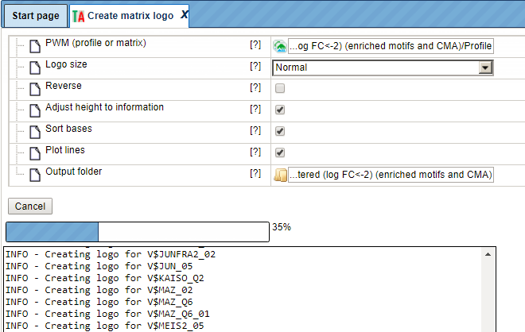

The output folder contains one PNG image for each matrix of the specified input.
Existing files in the output folder are not overwritten. In case of name
conflicts the tool suffixes a number to the file name as shown below:

:

The matrix logo output image is as shown below:

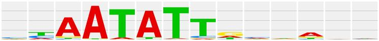

Each matrix image can be exported in either .jpeg, .png, or .bmp file formats
using the ‘Export document’ button.

1.  Identify enriched TF sites in promoters

2.  Version 2.0 (Adjusted p-values)

TRANSFAC®

This workflow is designed to find individual motifs enriched in the promoters of
the input gene set as compared with a background set (No set). In the first part
of the workflow, the enriched motifs are identified by the method
*analyses/Methods/Site analysis/Search for enriched TFBSs (genes)*, icon

. Please refer to section 20.1.4 for details on this particular analysis method.
Filtered enriched motifs serve as a basis to construct a specific profile, and
this profile is run on the promoters of the input gene set, method
*analyses/Methods/Site analysis/Site search on gene set*, icon

. Details about this individual method are given in section 6.1.2.

To launch the workflow, follow these steps:

**Step1.** Open the workflow input form from the Start page. It will open in the
main Work Space and looks as shown below:

**Step 2**. Input the Yes set from the tree. You can either drag-and-drop or
select the Yes set from the Tree area. Here, the set of up-regulated genes from
the following *Examples* folder is used:

<https://platform.genexplain.com/bioumlweb/#de=data/Examples/HCV%20infection%20in%20liver%20GSE31193%2C%20Affymetrix%20U133%20Plus%202.0%20microarray/Data/IFN%206h%20vs%20Control/IFN%206hours%20vs%20Control%20UP%20LogFC%3E1.5%2C%20125%20genes>

The Yes set in this example contains 125 genes up-regulated in human liver cells
treated with interferon-γ (IFNγ) as compared with non-treated cells.

**Step 3**. Similarly input the NO set from the tree area. By default the
workflow uses a subset fo 300 genes randomly taken out of the human housekeeping
genes. The default NO set can be found here:

<https://platofrm.genexplain.com/bioumlweb/#de=data/Public/Data%20sets/Data/Housekeeping%20genes%20(Human)%20300>

**Step 4**. Select the profile. This profile will be applied at the first part
of the workflow for identification of the enriched motifs. The default profile
is *vertebrate_human_p0.001* from the most recent TRANSFAC® release available.
It can be found here:

https://platform.genexplain.com/bioumlweb/\#de=databases/TRANSFAC(R)%202018.1/Data/profiles/vertebrate_human_p0.001

The number of matrices in the profile shown here is 5114

Any other TRANSFAC® profile or user-specific profile can be selected. With a
mouse click on the field **Profile**, a pop-up window will open, where a profile
can be selected.

**Step 5.** After input of the Yes and No sets, the species (human, mouse or
rat) is adjusted automatically. Verify the species shown in the species field.

**Step 6.** Filter by TFBS enrichment fold: In this field you can specify the
enrichment fold (FE) to filter the motifs. By default it is 1.0, which means all
motifs with FE\>1.0 will be reported in the resulting table and the same motifs
will serve to create a specific profile. If you want to use highly-enriched
motifs, you can specify higher thresholds, e.g. 1.1, 1.2 etc, or even 2.0 or 3.0
depending on your Yes and No sets. It is recommended that you run it with
default parameters first, check the results, and then run again with the desired
filter value.

**Step 7**. Specify the promoter region relative to TSS as they are annotated in
Ensembl. The default promoter region is -1000 to +100 relative to the TSS. You
can edit the fields *Start promoter* and *End promoter* as required.

**Step 8**. Specify the result folder location and name and Press the button
[Run workflow]. Wait till the workflow is completed.

**Results.**  
The results folder consists of several files and folders as shown below:

It can be accessed in the Examples folder using the path shown below:

data/Examples/HCV infection in liver GSE31193, Affymetrix U133 Plus 2.0
microarray/Data/IFN 6h vs Control/IFN 6hours vs Control UP LogFC\>1.5, 125 genes
(enriched motifs_TRANSFAC(R))

The table **Enriched Motifs** (

) contains those site models, here TRANSFAC® matrices, which are enriched in the
Yes set in comparison with the No set as shown below.

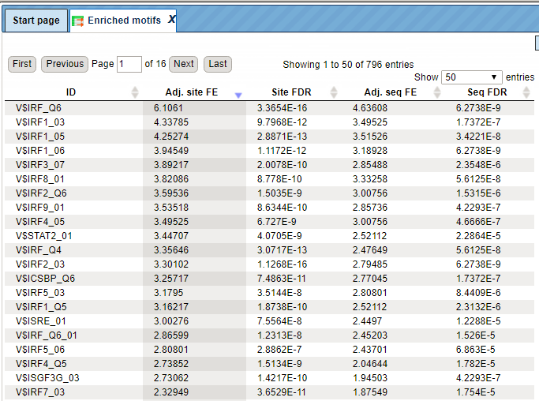

Each row of the output table represents the result for one PWM from the input
profile. Only those PWMs with adj. site FE \>1 are included in the output. For
details on the output columns please refer to section 20.1.4.1. Recommended
sorting, as shown on the screenshot above, is by column *Adj. site FE* (adjusted
fold enrichment for sites) with the highest values on top.

Please note that out of 5114 matrices in the initial profile, hits for 796
matrices are enriched with adj. site FE \>1. These matrices are considered to
create profiles specific for the input Yes and No sets.

Motifs for IRF, STAT, ICSBP transcription factors are highly enriched, with adj.
site FE \>2, as shown in the screenshot above. This is a very relevant result
considering that here the effect of IFNγ on liver cells is studied.

The table **Profile** (

) presents details for PWMs with *adj. site FE \>1*.

This profile is an intermediate result of the workflow and is used further for
*Site search on gene set* analysis.

**Site search analysis output** (

) serves to visualize enriched motifs in the promoters. This folder contains
four tracks (

):

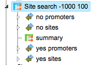

Each track can be opened in the genome browser by double-clicking. A
visualization of the track *yes sites* is shown below:

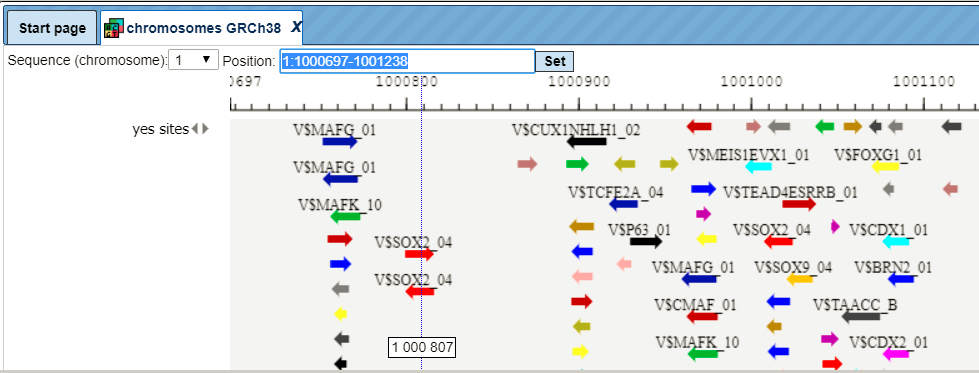

The same track can be opened as a table; for this use right mouse click on the
track name in the tree area or Ctrl +mouse click for Mac users.

With the same menu, you can apply other functions to the selected track, e.g.
export it in available formats or delete.

Table view on the track *yes sites* is the following:

Sites table

, gives the list of Transcription Factor matrcies linked to the enriched motifs.
For Each Transcription factor Yes-No ratio is calculated along with the P-value
and Matrix logo. Detailed report on selected matrices can be obtained while
selecting each transcription factor and pressing the report on selected matrices
button

on the control panel.

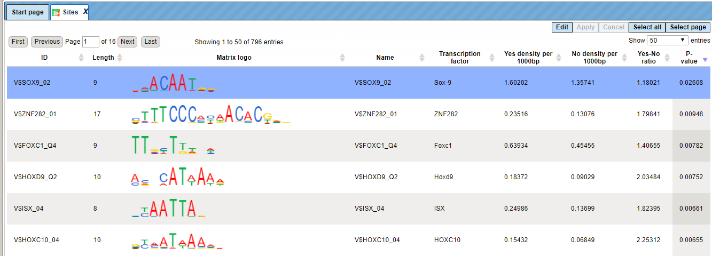

The output table *TOP 3 TFBS*

gives the binding site, and binding positions of top three transcription factors
enriched in the promoters.

Here, top 3 Transcription Factors PDX5, SOX2, nad SOX3 are shown binding to the
gene.

This table can be further annotated to add a column with expression values, as
shown below. Details for annotation of the tables are given in the section
16.1.1.

Twelve TFs are found to be highly up-regulated under the same conditions, all
members of Ets, STAT, IRF, MEF2 families. The role of these TFs in regulation of
the input *Yes genes* is suggested by two independent lines of evidence: first,
genes encoding these TFs are highly up-regulated, and second, their binding
motifs are significantly enriched in the promoters of Yes genes.

A HTML report is generated at the end that summarizes the workflow results in a
page as shown below:

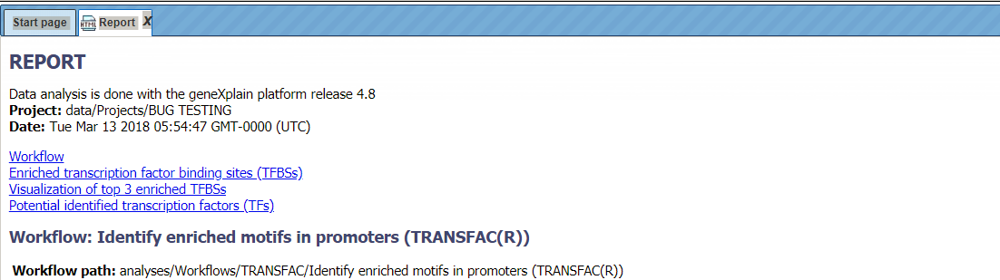

This report can be exported in HTML format for further use.

**Note***.* This workflow is available together with a valid TRANSFAC® license.  
Please, feel free to ask for details (info\@genexplain.com).

GTRD

This workflow is designed to search for putative transcription factor binding
sites, TFBS, in the promoters of an input gene set. It is very similar to the
workflow described above in Section 10.4. The only difference is in the PWM
library applied. Here, site search is done with the help of the GTRD library
(see 19.8 for further details about this library).

For the input form and description of the results folder, please refer to
Section 10.4.

1.  Version 1.2 (Classical)

TRANSFAC®

This workflow is designed to search for putative transcription factor binding
sites, TFBS, in the promoters of an input gene set. Site search is done with the
help of the TRANSFAC® library of positional weight matrices, PWMs, namely with
the profile vertebrate_non_redundant_minSUM.

To launch the workflow, follow these steps:

**Step 1.** Open the workflow input form from the Start page. It will open in
the main Work Space and looks as shown below:

**Step 2.** Specify input gene or protein set in the field Input gene set.  
The input table contains the genes under study, and it is also called the 'Yes'
set. To specify a gene set, you can drag & drop it from your project within the
Tree Area, and drop it in the pink box of the field Input gene set.
Alternatively, you may click on the pink field “select element”, and a new
window will open, where you can select the input gene set as shown below. After
you have selected the gene set, press [Ok].

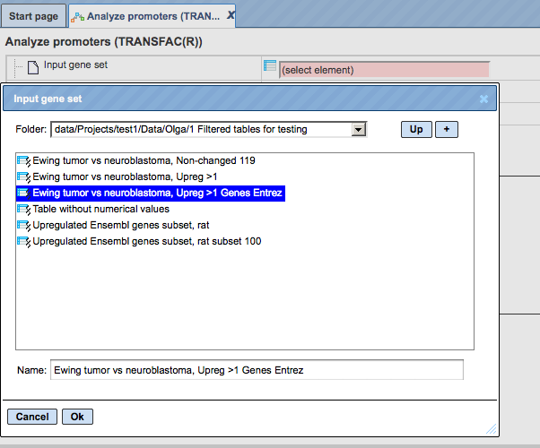

Step 3. Specify the biological species of the input set in the field Species by
selecting the required species from the drop-down menu.

Step 4. Define where the folder with the results should be located in the tree.
You can do so by clicking on the pink field “select element” in the field
Results folder, and a new window will open where you can select the location of
the results folder and define its name as shown below.

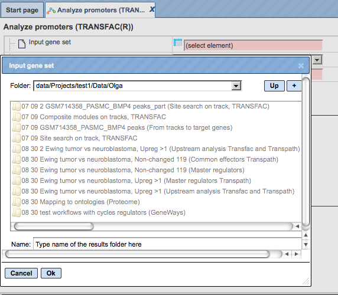

**Step 5.** Press the [Run workflow] button.

Wait until the workflow is completed, which is shown below:

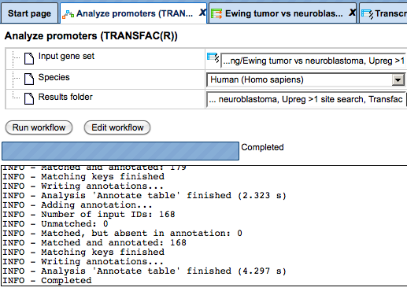

The results folder contains several files and can be accessed using the path

data/Examples/Brain Tumor GSE1825, Affymetrix HG-U133A microarray/Data/Ewing
Family Tumor versus Neuroblastoma/Upregulated Ensembl genes filtered (log
FC\>1.5) site search

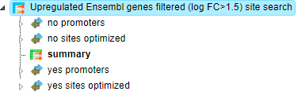

The tables called *summary* (

), *TF Ensembl genes*, and *TF Entrez genes* are opened automatically in the
work area as soon as the workflow is completed.

For more details about the results, please refer to Section 20.1.4.

**Tip.** You can easily create a similar workflow with parameter values adjusted
to your needs. For example, you can select another profile from the list of
available TRANSFAC® profiles, or specify different promoter positions relative
to the TSS (default is -1000 to +100).

To do this, you need first to open the workflow in the “Edit workflow” mode, and
save a copy in your project area. The [Edit workflow] button is located near the
button [Run workflow] (see above, Step 1). Upon clicking on [Edit workflow], the
workflow diagram will open in the Work Space, and you can select one of the
analyses you would like to modify. For the screenshot below the "Site search on
gene set" analysis was selected, and in the Operations Field, on the tab
"Workflow", all the parameters are visible. Under this mode, you can either
check what the default parameters are, or modify them according to your needs.

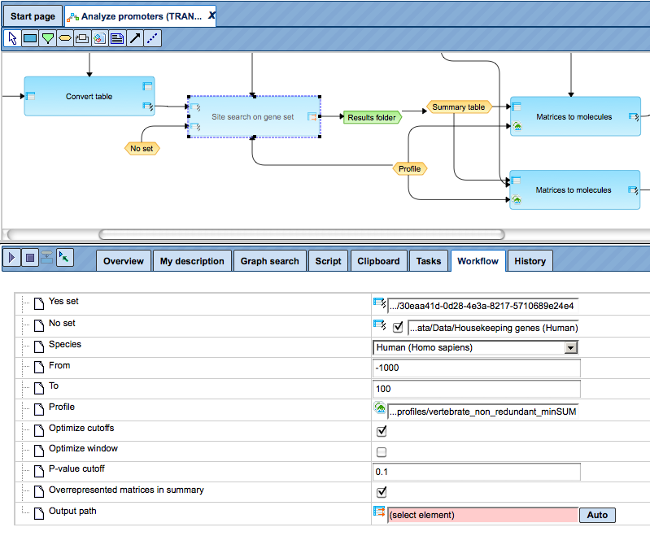

**Note.** This workflow is available together with a valid TRANSFAC® license.  
Please, feel free to ask for details (info\@genexplain.com).

GTRD

This workflow is designed to search for putative transcription factor binding
sites, TFBS, in the promoters of an input gene set. It is very similar to the
workflow described above in Section 10.4. The only difference is in the PWM
library applied. Here, site search is done with the help of the GTRD library
(see 19.8 for further details about this library).

For the input form and description of the results folder, please refer to
Section 10.4.

1.  Identify composite modules in promoters

2.  Version 2.0 (Adjusted p-values) with TRANSFAC®

This workflow is designed to find pairs of sites in the promoters of the input
gene set. This workflow enables the identification of combinations of several
enriched TFBSs in the promoters of the genes under study (Yes-set). The
resulting composite module differentiates the Yes-set from a background set
(No-set).

In the first part of the workflow, the enriched motifs are identified by the
method *analyses/Methods/Site analysis/Search for enriched TFBSs (genes)*, icon

. Please refer to Section 20.1.4.1 for details on this individual analysis
method.

Motifs with an enrichment of \>1.0 fold serve as a basis for constructing a
specific profile, and this profile is run on the promoters of the input gene
set, method *analyses/Methods/Site analysis/Site search on gene set*, icon

. Details about this individual method are given in the section 20.1.2. In the
second part of this workflow, composite modules are identified based on the
enriched TFBSs. For more details about CMA analysis refer to section 20.1.5.

To launch the workflow, follow these steps:

**Step1.** Open the workflow input form from the Start page. It will open in the
main Work Space and looks as shown below:

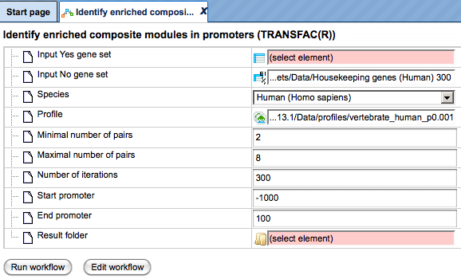

**Step 2**. Input the Yes set from the tree. You can either drag-and-drop or
select the Yes set from the Tree area. Here, the set of up-regulated genes from
the following *Examples* folder is used:

https://platform.genexplain.com/bioumlweb/\#de=data/Examples/HCV%20infection%20in%20liver%20GSE31193%2C%20Affymetrix%20U133%20Plus%202.0%20microarray/Data/IFN%206h%20vs%20Control/IFN%206hours%20vs%20Control%20UP%20LogFC%3E1.5%2C%20125%20genes

The Yes set in this example contains 125 genes up-regulated in human liver cells
treated with interferon-γ (IFNγ) as compared with non-treated cells.

**Step 3**. Similarly input the NO set from the tree area. By default the
workflow uses a subset of 300 genes randomly taken out of the human housekeeping
genes. **Step 4**. After input of the Yes and No sets, the species (human, mouse
or rat) is adjusted automatically. Verify the species shown in the species
field.

**Step 5**. Select the profile. The selected profile will be applied at the
first part of the workflow for identification of enriched motifs. The default
profile is *vertebrate_human_p0.001* from the most recent TRANSFAC® release
available. Any other TRANSFAC® profile or user-specific profile can be chosen.
With a mouse click on the field *Profile*, a pop-up window will open, where a
profile can be selected. The number of matrices in the default profile, which is
used here, is 4961.

**Step 6**. Set up parameters for the composite module search. This workflow
identifies pairs of sites. By default, the minimum and maximum numbers of pairs
are given as 2 and 8. You can change these parameters according to the number of
pairs you aim to identify. The number of iterations of the genetic algorithm is
300 by default, and can be adapted as required.

**Step 7**. Specify the promoter region relative to TSS as they are annotated in
Ensembl. The default promoter region is -1000 to +100 relative to the TSS. You
can edit the fields *Start promoter* and *End promoter* as required.

**Step 8**. Specify the result folder location and name and Press the button
[Run workflow]. Wait till the workflow is completed.

**Note***.* This workflow may take more time depending on the size of the Yes
and No sets and on the number of iterations. The recommended size of the Yes set
is 150 genes maximum, and the recommended size of the No set is 300 genes
maximum. The maximum recommended number of iterations is 300.

**Results**  
The results folder consists of several folders and files as shown below and can
be accessed using the path

 data/Examples/HCV infection in liver GSE31193, Affymetrix U133 Plus 2.0
microarray/Data/IFN 6h vs Control/IFN 6hours vs Control UP LogFC\>1.5, 125 genes
(enriched motifs and CMA)

The table **Enriched Motifs** (

) contains those site models, here TRANSFAC® matrices, which are enriched in the
Yes set as compared to the No set as shown below.

Each row of the output table represents the result for one PWM from the input
profile. Only those PWMs with adj. site FE \>1 are included in the output. For
details on the output columns please refer to section 9.5.1. Recommended
sorting, as shown in the screenshot above, is done by highest *Adj. site FE*
(adjusted fold enrichment for sites).

Please note that out of 4961 matrices in the initial profile, hits for 773
matrices are enriched with adj. site FE \>1. These matrices are considered to
create profiles specific for the input Yes and No sets.

Motifs for IRF, ISRE, ICSBP transcription factors are highly enriched, with adj.
site FE \>2, as shown in the screenshot above. This is a very relevant result
considering that here the effect of IFNγ on liver cells is studied.

The table **Profile** (

) presents details for PWMs with *adj. site FE \>1*.

This profile is an intermediate result of the workflow, and it is used further
for *Site search on gene set* analysis.

**Site search analysis output** (

) is an intermediate result of the workflow, and its results are used further
for the identification of composite modules. Details about the individual output
files in this folder can be found in Section 20.1.4.

The **Modules** folder (

) is a result of the analysis *Construct composite modules*. It contains two
tables, two tracks, one histogram, and one model view as shown below:

The Model View is a graphical summary for the hierarchically organized composite
elements generated as a result of the CMA analysis. As mentioned above, this
workflow is designed to identify pairs of sites, and we asked to identify 2 to 6
pairs. The Model view presents four pairs, and we can see by exactly which site
models (matrices) these pairs are formed as well as statistical parameters of
the overall model.

Each track can be opened in the genome browser by double-clicking. Visualization
of the composite modules on the promoter of ISG15, one of the *Yes set* genes,
is shown below.

For more details on the individual output tables and tracks as well as for
**visualization** of the identified composite modules in the genome browser
please refer to Section 20.1.4.

The output table *Transcription factors Ensembl genes*

is a list of transcription factors linked to the site models in the composite
module identified by the workflow. For each transcription factor, the Ensembl
gene ID is provided, as well as a gene description, the HGNC gene symbol,
species, and site model (TRANSFAC® PWM name).

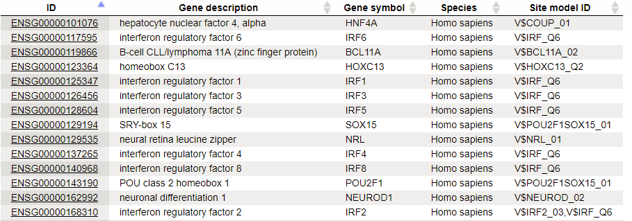

seventeen transcription factors shown in the table above are candidate
regulators of genes in the input *Yes set*. They are suggested to regulate
transcription of Yes-genes via the identified composite elements. This table can
be further annotated to add a column with expression values, as shown below.
Details for annotation of the tables are given in Section 16.1.1.

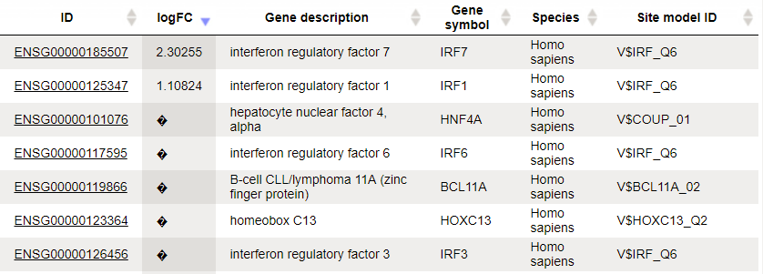

Three TFs are found to be highly up-regulated under the same conditions, IRF1, 6
and 7. The role of these TFs in regulation of the input *Yes genes* is suggested
by two independent lines of evidence: genes encoding these TFs are highly
up-regulated, and their motifs are parts of the identified enriched composite
modules.

**Note***.* This workflow is available together with a valid TRANSFAC® license.  
Please, feel free to ask for details (info\@genexplain.com).

1.  Version 1.2 (Classical) with TRANSFAC®

This workflow enables the identification of combinations of several TFBSs in the
promoters of the genes under study (Yes-set). Such combinations of sites are
referred to as composite modules. The resulting composite module differentiates
the Yes-set from a background set (No-set).

In the first part of the workflow a *Site search on gene set (*

*)* is performed with your selected Yes-set, No-set and a specified profile of
matrices. You can refer to section 9.3 for details of this method. In the second
part of this workflow, composite modules are identified (

) based on the identified single sites in the Yes and No sets. For more details
about the hierarchical structure of the composite modules, search for composite
modules, visualization and interpretation of the results refer to section
20.1.5.4.

To launch the workflow, follow these steps:

Step1. Open the workflow input form from the Start page. It opens in the main
Work Space and looks as shown below:

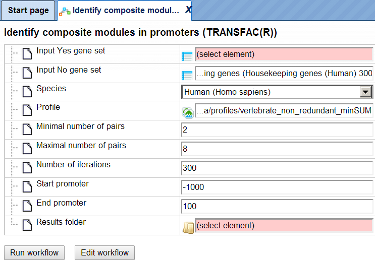

Step 2. Input the Yes set from the tree. You can either drag-and-drop or select
the Yes set from the Tree area. Here, the set of genes from the Example folder
is used as input Yes set. It can be accessed using the URL:

https://platform.genexplain.com/bioumlweb/\#de=data/Examples/Brain%20Tumor%20GSE1825%2C%20Affymetrix%20HG-U133A%20microarray/Data/Ewing%20Family%20Tumor%20versus%20Neuroblastoma/Upregulated%20Ensembl%20genes%20filtered%20(log%20FC%3E1.5)

Step 3. Similarly input the No set from the tree area. By default the workflow
uses a subset fo 300 genes randomly taken out of the human housekeeping genes.
The default NO set can be found here:

https://platform.genexplain.com/bioumlweb/\#de=data/Public/Data%20sets/Data/Housekeeping%20genes%20(Human)%20300

Step 4. After input of the Yes and No sets, the species (human, mouse or rat) is
adjusted automatically. Verify the species shown in the species field.

Step 5. Select the profile. This profile will be applied in the first part of
the workflow for identification of TFBSs. The default profile is
*vertebrate_non_redundant_minSUM* from the most recent TRANSFAC® release
available. Any other TRANSFAC® profile or user-specific profile created with
TRANSFAC® matrices can be chosen. With a mouse click on the field Profile, a
pop-up window opens, where a profile can be selected. The profile used in this
example is:

<https://platform.genexplain.com/bioumlweb/#de=databases/TRANSFAC(R)%202017.2/Data/profiles/vertebrate_human_p0.001>

Tip If you are interested in finding site models for particular TFs, and see
them eventually in the resulting composite modules, you need to be sure that
such matrices are present in the selected profile.

Step 6. Set up parameters for the composite module search. This workflow
identifies pairs of sites. By default, the minimum and maximum number of pairs
are fixed as 2 and 8, respectively. You can change these parameters according to
the number of pairs you want to identify. The number of iterations of the
genetic algorithm is 300 by default, and can be adapted as required.

Step 7. Specify promoter regions relative to the TSS as they are annotated in
Ensembl. The default promoter region is -1000 to +100 relative to the TSS. You
can edit the fields Start promoter and End promoter as required.

Step 8. Specify the result folder location and name and press the button [Run
workflow].

**Note***.* This workflow may take more time depending on the size of the Yes
and No sets and on the number of iterations. The recommended size of the Yes set
is 150 genes maximum, and the recommended size of the No set is 300 genes
maximum.

Results

The results folder consists of two folders and one table as shown below:

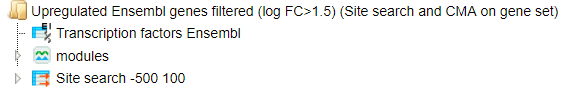

Site search analysis output (

) The summary table of the site search is shown below. Identified TFBSs are used
further for the identification of composite modules. Details about the
individual output files can be found in Section 20.1.2.

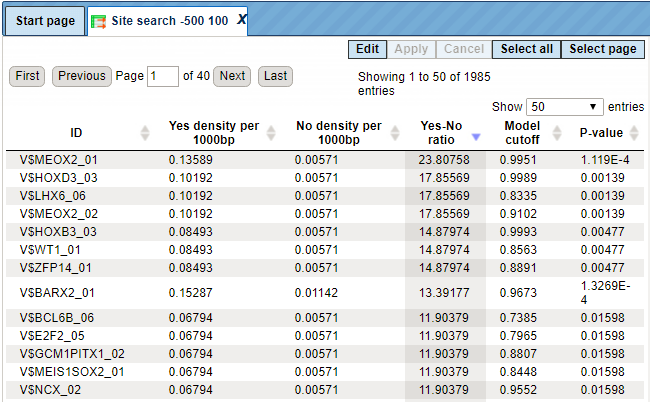

With a double-click on the folder modules, the visualization of the composite
modules in the promoters of the *Yes* set will be opened in the work space.
Simultaneously, in the operations field, under the tab My description, a plot
with a schematic representation of the composite modules and statistical
parameters are shown. In the Info box you can see the list of parameters this
particular run of the workflow was done with.

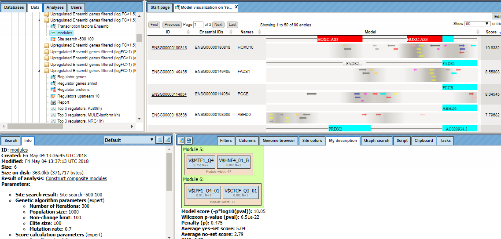

The **modules**

folder can be expanded in the tree area. It contains two tables (

), two tracks (

), and two plots (

):

The plot **Model View** is a graphical summary for all composite modules
generated as a result of the CMA analysis, and it can be opened in the work
space.

The plot **Histogram** is a distribution of scores for individual promoters:

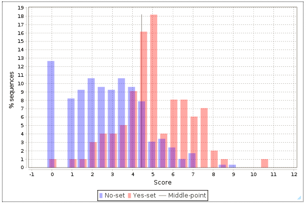

For a detailed interpretation of the histogram as well as for a visualization of
the identified composite modules in the genome browser, please refer to section
20.1.5.5.

The output table Transcription factors Ensembl genes is a list of transcription
factors linked to the site models in the composite module. For each
transcription factor, the Ensembl gene ID is provided, as well a gene
description, HGNC gene symbol, species, and site model (TRANSFAC® PMW name):

**Note***.* This workflow is available together with a valid TRANSPATH® license.  
Please, feel free to ask for details (info\@genexplain.com).

1.  Cross-species identification of enriched motifs in promoters using ortholog
    information (TRANSFAC®)

This workflow is designed to find individual motifs enriched in the promoters of
the input gene set as compared with a background set (No set). It is very
similar to the workflow described in section 10.4.3.1 except that here you can
use an input table for any species and get the output for the desired species.

The workflow can be accessed from the start page here:

analyses/Workflows/TRANSFAC/Cross-species identification of enriched motifs in
promoters, using ortholog information (TRANSFAC(R))

In the first part of the workflow, enriched motifs are identified by the method
*analyses/Methods/Site analysis/Search for enriched TFBSs (genes)*, icon

. Please refer to section 20.1.4 for details on this particular analysis method.
Filtered enriched motifs serve as a basis to construct a specific profile, and
this profile is applied to the promoters of the input gene set, method
*analyses/Methods/Site analysis/Site search on gene set*. Details about this
individual method are given in section 6.1.2. The last step is a conversion to
homology transcription factors.

The input form looks as shown below:

Step 1: Select an Input Yes gene set from the tree. You can either drag-and-drop
or select the Yes set from the Tree area.

Here, the set of up-regulated genes from the following *Examples* folder is
used:

data/Examples/Transcriptional biomarkers to predict mouse liver tumors,
GSE18858/Data/Normalized (RMA) DEGs with EBarrays/Naphthalene_20ppm upreg
Ensembl

Step 2: Specify the Species of the input set and the Species of the output set.
In this case Input is Mouse and Output species selected is human.

Step 3: Select Input No gene set from the tree area. By default, the workflow
uses a subset from 300 genes randomly taken out of the human housekeeping genes.

For this example the NO set used is:

https://platform.genexplain.com/bioumlweb/\#de=data/Public/Data%20sets/Data/Housekeeping%20genes%20(Mouse)%20300

Step 4: The profile will be applied in the first part of the workflow for the
identification of enriched motifs. The default profile is
*vertebrate_human_p0.001* from the most recent TRANSFAC® release available. Any
other TRANSFAC® profile or user-specific profile can be selected. With a mouse
click on the field **Profile**, a pop-up window will open, where a profile can
be selected.

Step 5: Filter by TFBS enrichment fold: In this field you can specify the
enrichment fold (FE) to filter the motifs. By default, it is 1.0, which means
all motifs with FE\>1.0 will be reported in the resulting table and the same
motifs will serve to create a specific profile. If you want to use
highly-enriched motifs, you can specify higher thresholds, e.g. 1.1, 1.2 etc.,
or even 2.0 or 3.0 depending on your Yes and No sets. It is recommended that you
run it with default parameters first, check the results, and then repeat with
the desired filter value.

Step 6: Specify the promoter region relative to TSS as they are annotated in
Ensembl. The default promoter region is -1000 to +100 relative to the TSS. You
can edit the fields Start promoter and End promoter as required.

Step 7: Specify the Result folder location and name and Press the button [Run
workflow]. Wait till the workflow is completed.

The result folder consists of several files as shown below and can be accessed
using the URL

data/Examples/Transcriptional biomarkers to predict mouse liver tumors,
GSE18858/Data/Naphthalene_20ppm upreg Ensembl (enriched motifs_TRANSFAC(R))

The table **Enriched Motifs** (

) contains those site models, here TRANSFAC® matrices, which are enriched in the
Yes set in comparison with the No set. More details on the result can be found
in section 10.4.3.1.

The table Molecules Orthologs have a list of molecules from the input gene set
with their site search results as shown below:

Every gene is linked to the corresponding matrix molecule by the Yes-No ratio.
More details on each column of the above results can be found in section 6.1.2.

The table Molecules_human contain the site models of the converted input table.
In this case the output species is Human hence this table is Molecules_human
with mapping to human Ensembl genes with corresponding matrices. If the output
species is mouse, then this table will have mouse Ensembl genes.

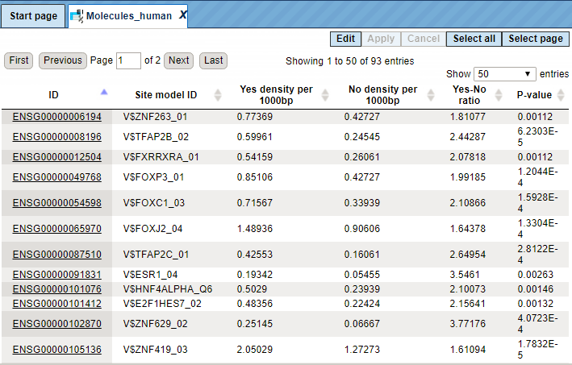

The output table Transcription factors Ensembl genes is a list of transcription
factors linked to the enriched motifs. For each transcription factor, the
Ensembl gene ID is provided, as well as gene description, HGNC gene symbol,
species, and site model (TRANSFAC® PWM name). This table can be further
annotated to add a column with expression values, as shown below. Details for
annotation of the tables are given in the section 16.1.1.

1.  Visualization of site search results

This method visualizes results of the site search analyses. It can be found
under the tab *Analyses*, in the folder Methods/Site analysis/Site search report
(

). Here the default input form is shown:

In the following, we will consider the input fields one by one.

Result of site search analysis. You can drag & drop the site search result (must
contain summary table with p-value column) from your project within the tree
area. Alternatively, you may click on the pink field “select element”, and a new
window will open, where you select the site search result. After having selected
the result, press the [Ok] button.

For this example, all further steps are demonstrated with the following input
set:

data/Examples/Transcriptional biomarkers to predict mouse liver tumors,
GSE18858/Data/Naphthalene_20ppm upreg Ensembl (enriched motifs_TRANSFAC(R))/Site
search -1000 100

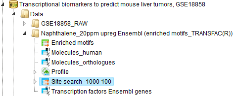

Number of best models. Choose the number of best models (according to p-value)
to include in the report. The default value are the three top models.

Add columns with site positions. If you are interested in the promoter positions
of the single sites, please check the appropriate box.

Target report path. Define where the table with the results should be located in
your project tree. You can do so by clicking on the pink box (select element) in
the field, and a new window will open, where you can select the location of the
resulting table and define its name.

Press the [Run] button and wait until the method is completed. The result opens
automatically and looks like this:

Can be accessed using the URL:

https://platform.genexplain.com/bioumlweb/\#de=data/Examples/Transcriptional%20biomarkers%20to%20predict%20mouse%20liver%20tumors%2C%20GSE18858/Data/Naphthalene_20ppm%20upreg%20Ensembl%20(enriched%20motifs_TRANSFAC(R))/Site%20search%20-1000%20100/Top%203

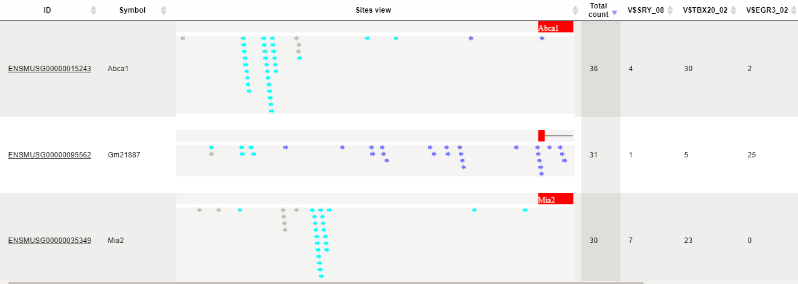

We see a visualization of two promoters from the genes Abca1, Gm2887, and mia2.
The TSS is on the right side, where the blue box is located. All arrows are
identified sites of the best models and marked with different colors. Also the
orientation of the individual sites is shown by the arrow head. The number Total
count gives the number of all sites according to the three best models. The
numbers of sites for every model (1-3) are given in the next three columns. As
an example, model V\$TBX20_02 finds 30 sites in the promoter of Abca1. The
column V\$TBX20_02 positions contains all single site positions for the first
model in the promoter of Abca1, e.g. -516 from TSS.
