# ChIP-seq

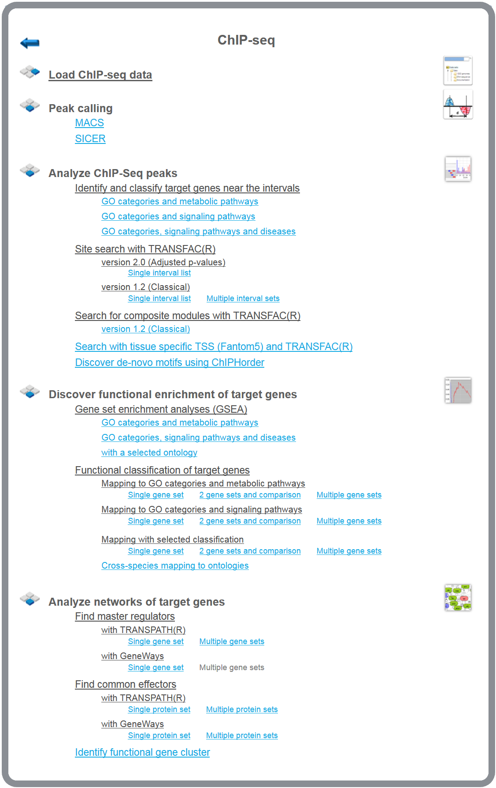

## Peak calling
### MACS

[MACS](http://genomebiology.com/2008/9/9/R137) is a tool to identify peaks,
regions likely bound by targeted protein, in ChIP-seq data. It empirically
models the length of the sequenced ChIP fragments, which tends to be shorter
than sonication or library construction size estimates, and uses it to improve
the spatial resolution of predicted binding sites. Details about the MACS method
can also be found [here](http://liulab.dfci.harvard.edu/MACS/).

The platform provides two versions of the MACS algorithms, 1_3_7 and 1_4_0,
whose parameters are explained in the following.

### MACS 1_3_7

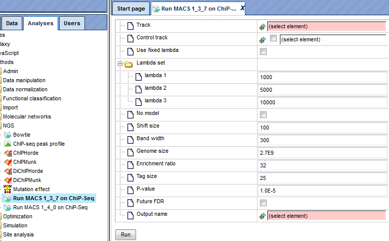

Parameters have the following meanings:

**Track**: Input track to search for peaks enriched with sequencing tags

**Control track**: A track that can be used as background (optional)

**Use fixed lambda**: Use a fixed local lambda for all peak regions

**Lambda set**: Three scopes of surrounding base pairs to calculate dynamic
lambda

lambda 1: close surrounding region

lambda 2: medium width surrounding region

lambda 3: wide surrounding region

**No model**: Do not build the shifting model. In this mode (no model) a fixed
shift size parameter is used.

**Shift size**: The custom shift size in bp. Used in “no model” mode.

**Band width**: Expected size of sonicated DNA fragments

**Genome size**: Effective genome size

**Enrichment ratio**: Cutoff for the high-confidence enrichment ratio against
background

**Tag size**: Size of sequence tags / read length

**P-value**: P-value cutoff for peak detection

**Future FDR**: Adopt the new peak detection method. The default method only
considers the peak location in the 1k, 5k, or 10kb regions of the control data.
In contrast, the new method also considers the 5k or 10k regions of the test
data to calculate the local bias.

**Output name**: Name of the output track with MACS peaks.

### MACS 1_4_0

This is an advanced version of MACS 1.3.7. During model building, the new
algorithm selects regions within a certain range of enrichment. By default,
permissible enrichment values range from 10 to 30. If MACS fails to build the
model, it will use resort to “no model”-settings with a shift size=100bps, to
shift and extend each tags.

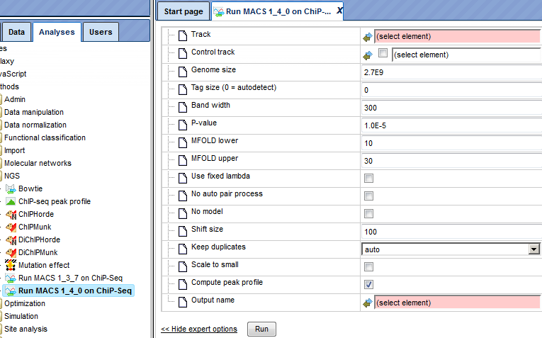

**Track**: Input track to search for peaks enriched with sequencing tags

**Control track**: A track that can be used as background (optional)

**Genome size**: Effective genome size

**Tag size (0 = autodetect) (expert)**: Length of the tag sequences / read
length in bp. If set to 0, it will be inferred from average read lengths over
several first reads.

**Band width**: Expected size of sonicated DNA fragments

**P-value**: P-value cutoff for peak detection

**MFOLD lower**: Lower bound for high-confidence enrichment ratio used in
building the paired-peak model

**MFOLD upper**: Upper bound for high-confidence enrichment ratio used in
building the paired-peak model

**Use fixed lambda (expert)**: Use a fixed local lambda for all peak regions

**Small region for dynamic lambda**: The close surrounding region (in base
pairs) to calculate dynamic lambda. This is used to capture the bias near the
peak summit region. Only applied with control data.

**Large region for dynamic lambda**: The large nearby region (in base pairs) to
calculate dynamic lambda. Only applied with control data.

**No auto pair process (expert)**: Whether to turn off the auto pair model
process. If marked MACS will exit with an error message if the model building
fails. If not marked, it will resourt to “no model”-settings

**No model (expert)**: Do not build the shifting model. In this mode (no model)
a fixed shift size parameter is used.

**Shift size (expert)**: The custom shift size in bp. Used in “no model” mode.

**Keep duplicates (expert)**: Consideration of replication tags which were
assigned to the same genomic location.

Auto: value will be calculated based on binomial distribution using 1e-5 as
p-value cutoff

All: Consider all tags

Number: Consider tags at most the specified number of replicated tags

**Scale to small**: Mark to scale larger dataset down to smaller one

**Compute peak profile (expert)**: Mark to compute a peak profile

**Output name**: Name of the output track with MACS peaks

### SICER

The Galaxy tool SICER fulfills two main purposes:

1. Delineation of significantly ChIP-enriched regions, which can be used to
associate with other genomic landmarks.

2. Identification of reads on the ChIP-enriched regions, which can be used for
profiling and other quantitative analysis.

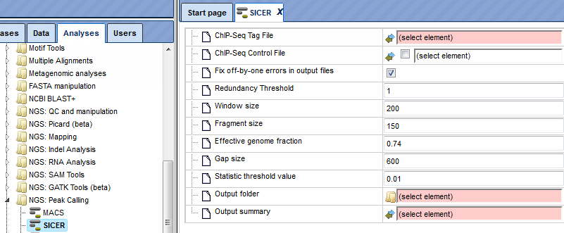

Parameters for SICER should be set as described in the following.

**ChIP-Seq Tag File**: Input track to search for peaks

**ChIP-Seq Control File**: A track that can be used as background (optional)

**Fix off-by-one errors in output files**: SICER creates non-standard output
files, this option will fix these coordinates

**Redundancy Threshold**: The number of copies of identical reads allowed in a
library

**Window size**: Resolution of SICER algorithm. For histone modifications, one
can use 200 bp.

**Fragment size**: For determination of the amount of shift from the beginning
of a read to the center of the DNA fragment represented by the read.
FRAGMENT_SIZE=150 means the shift is 75.

**Effective genome fraction**: Effective Genome as fraction of the genome size.
It depends on read length.

**Gap size**: Needs to be multiples of window size. Namely if the window size is
200, the gap size should be 0, 200, 400, 600, ...

**Statistic threshold value**: FDR (with control) or E-value (without control)

**Output folder**: The output folder contains

-   “Output summary” table with the fields ChIP_island_read_count,
    CONTROL_island_read_count, p_value, fold_change and FDR_threshold

-   A non-redundant version of the input track

-   A non-redundant version of the control track

-   A summary file in bedgraph format

-   A normalized output in Wig format

-   A track with significant islands

-   A normalized Wig file with islands

-   A track with island scores

**Output summary**: A summary output track with islands

## Analyze ChIP-seq peaks

## Identify and classify target genes near the peaks

This group of workflows helps to identify genes located near the ChIP-seq peaks
or near other genomic intervals. The input can be any track, and the output
contains a table of genes overlapping with the fragments of the input track. By
default, the gene bound extensions are 10,000 bp 5’ relative to TSS and 10,000
bp 3’ relative to the last exon.

The three workflows in this group have a very similar structure. In the first
step, the input track () is converted into a gene set using the *Track to gene set* analysis , The resulting Ensembl gene list is then submitted to *Functional classification* by several ontologies. In parallel, the same Ensembl gene list is subjected to *Cluster by shortest path* analysis. 

The difference between the workflows within this group is in the ontologies applied for functional classification as well as in a
database used to find gene/protein clusters, either TRANSPATH® or GeneWays. In the three sections below, three individual workflows are demonstrated for the same input track available in one of the pre-prepared examples present in the *Examples* folder:  

<http://platform.genexplain.com/bioumlweb/#de=data/Examples/E2F1%20binding%20regions%20in%20HeLa%20cells%2C%20ChIP-Seq/Data/GSM558469_E2F1_hg19%20filtered%20chr%201>

The results for each of the three workflows can be found in the folder data/Examples/E2F1 binding regions in HeLa cells, ChIP-Seq/Data

### Classification by GO categories and metabolic pathways

In this workflow, the functional classification is done using the following
ontologies: GO biological processes, GO cellular components, GO molecular
function, TF classification, Reactome pathways, and HumanCyc pathways. In
parallel, the same Ensembl gene list is subjected to *Cluster by shortest path*
analysis. Gene/protein clusters are calculated based on the GeneWays interaction
network.

For details, how to launch this workflow, please refer to description of the section classification by GO categories, signaling pathways and diseases.  The results folder looks like this:

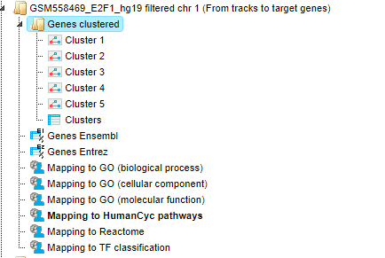

The input track contains 1889 in vivo binding fragments for E2F1 transcription
factor. These fragments are found to overlap with 2187 Ensembl genes that are
shown in the resulting table *Genes Ensembl* (). 

Functional classification by the HumanCyc pathways has found 8 metabolic
pathways:

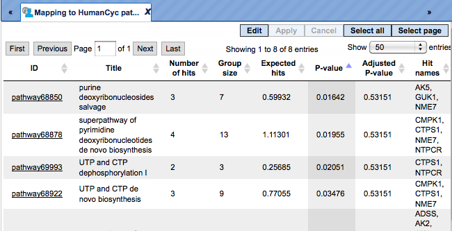

The top pathway visualization diagram can be opened in the work space upon a
mouse click to the pathway ID:

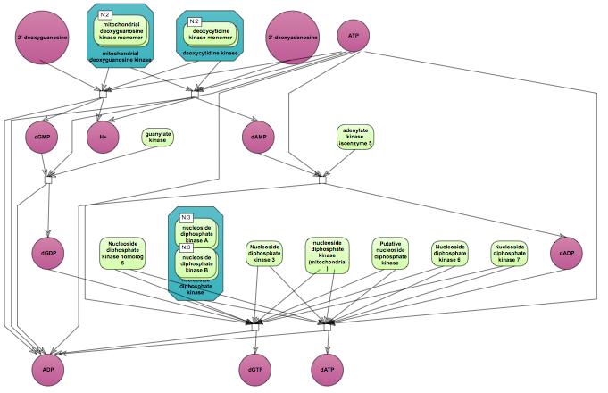

The GeneWays clusters are calculated considering upstream direction from the
identified with the maximal radius of 2 steps. The following GeneWays clusters
are identified:

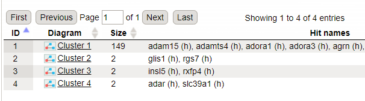

The picture below presents the fragment of the cluster 1.

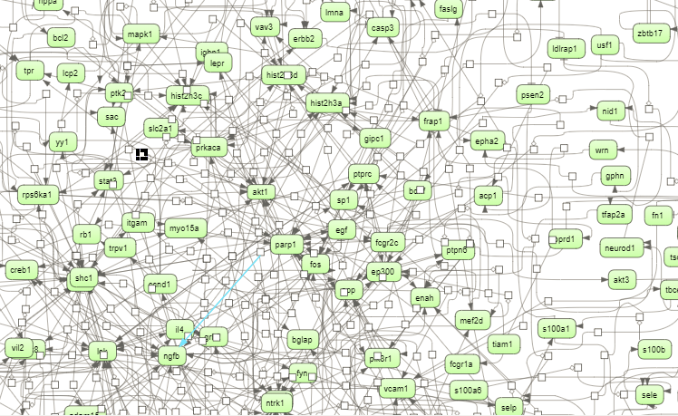

Molecules shown in blue color are coming from the input protein list, and those
in green are added by the algorithm when necessary for the connectivity between
the elements of the cluster.

### Classification by GO categories and signaling pathways

In this workflow, the functional classification is done using the following
ontologies: GO biological processes, GO cellular components, GO molecular
function, TF classification, Reactome pathways, and TRANSPATH® pathways. In
parallel, the same Ensembl gene list is subjected to *Cluster by shortest path*
analysis. Gene/protein clusters are calculated based on the TRANSPATH® signaling
network.

For details, how to launch this workflow and look into the results, please refer
to the description in section Classification by GO categories and metabolic pathways. In our example Functional classification by the TRANSPATH® pathways has found 43 signaling pathways and chains:

The pathway visualization diagrams can be opened in the work space upon a mouse
click to the pathway ID. The fragment of the second top pathway, leptin signaling, is shown in force directed layout on the picture below. Important to mention, you can see protein complexes and modified forms on the TRANSPATH® diagrams.

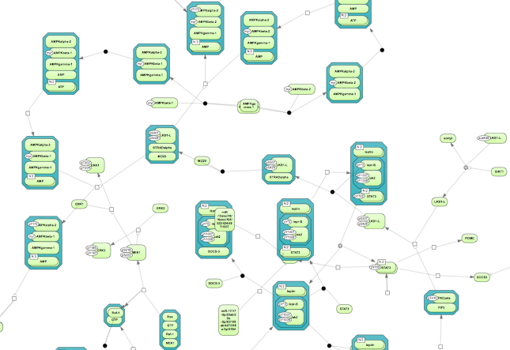

**Note***.* This workflow is available together with a valid TRANSPATH® license. Please, feel free to ask for details (info\@genexplain.com).

### Classification by GO categories, signaling pathway, and diseases

In the first step of this workflow, the input track () is converted into a gene set using the *Track to gene set* analysis (), The resulting Ensembl gene list is then submitted to
*Functional classification* using the following ontologies: HumanPSD™ GO biological processes, HumanPSD™ GO cellular components, HumanPSD™ GO molecular function, HumanPSD™ disease, TRANSPATH® pathways, TF classification, Reactome pathways, and HumanCyc pathways. In parallel, the same Ensembl gene list is subjected to *Cluster by shortest path* analysis. Gene/protein clusters are calculated based on the TRANSPATH® network.

The input form when opened in the work space is shown below:

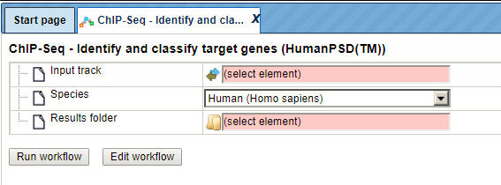

**Step 1**. Specify input track in BED format in the field **Input track**.

You can drag & drop it from your project within the tree area. Alternatively,
you may click on the pink field *select element* and a new window will be
opened, where you can select the input track.

Here, further steps are demonstrated with the track available in one of the
pre-prepared examples present in the Tree Area:  

<http://platform.genexplain.com/bioumlweb/#de=data/Examples/E2F1%20binding%20regions%20in%20HeLa%20cells%2C%20ChIP-Seq/Data/GSM558469_E2F1_hg19%20filtered%20chr%201>

**Step 2**. After input of the track, the species (human, mouse or rat) is
adjusted automatically. Verify the species shown in the **Species** field.

**Step 3**. Specify the path to store the results and the name of the output
folder.

**Step 4**. Having filled in the input form, launch the analysis with the [Run]
button. Wait till the workflow is completed.

Results

The results folder contains several files as shown below. All tables with the
resulting classifications as well as the table with clusters and the diagram of
the largest cluster are opened by default in the work space.

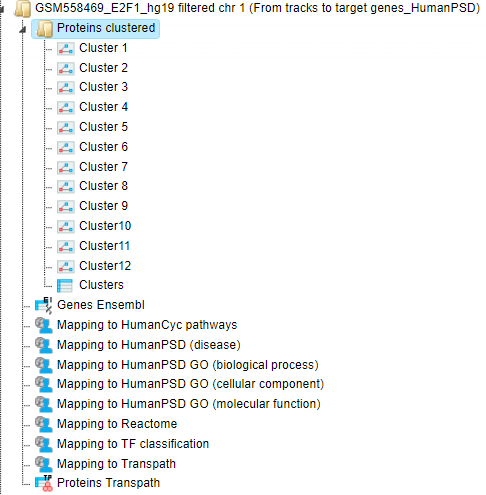

The table *Genes Ensembl* () contains those genes that are identified as located in the regions around the input peaks or fragments. By default this workflow considers the following
regions around Ensembl genes: 10000 bp in 5’ direction from TSS and 10000 bp in
3’ direction from the last exon. The positions of each fragment on the input
track are compared with positions of the extended gene regions. Genes
overlapping with at least one input fragment are considered as resulting target
genes. For the input track in this example, 2187 Ensembl genes are identified.
The resulting table *Genes Ensembl* is shown below, sorted by the column
*Count*. 

Each row in this table contains information about one identified gene including
Ensembl gene ID, chromosome, exact genomic positions and strand (1 or -1), gene
symbol, and description. The column **Count** shows how many fragments on the
input track are overlapping with each gene.

These genes are then converted into TRANSPATH® proteins, the output table
Proteins Transpath (

), shown below.

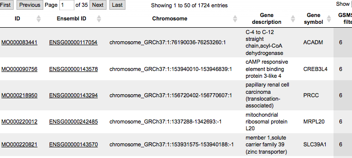

The structure of this table is very similar to that of Genes Ensembl, the
critical difference is the column **ID**, which represents TRANSPATH® molecule
IDs; Ensembl gene IDs are given in the second column. Here, 2187 Ensembl genes
are converted into 1724 TRANSPATH® proteins.

Resulting TRANSPATH® proteins are clustered to get functional connections
between the gene products. By default, the workflow considers upstream direction
from the input TRANSPATH® proteins with a radius of 3. Resulting clusters are
present in the folder *Proteins clustered*, shown below.

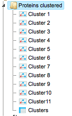

The table *Clusters* (

) contains a list of all identified clusters, here 11. Each row shows details
for one cluster. The clusters are sorted by their size with the largest cluster
on top. Symbol

next to each cluster name in the column **Diagram**, can be used for
visualization. The column **Hit names** contains names of TRANSPATH® proteins in
each cluster.

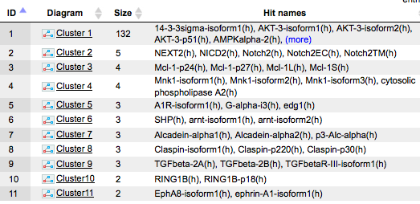

A visualization of the largest cluster, *Cluster 1*, is opened automatically
when the workflow is completed. The visualization of *Cluster 1* in orthogonal
layout is shown below:

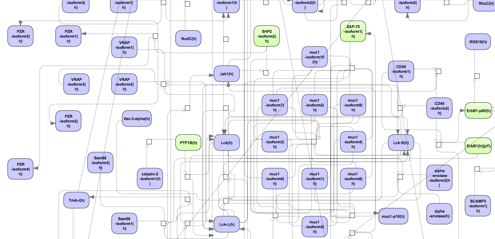

Molecules shown in blue color are coming from the input protein list, and those
in green are added by the algorithm when necessary for the connectivity between
the elements of the cluster.

In parallel with clustering, the table Genes Ensembl undergoes to *Functional
classification.* The results are shown in eight tables with the icon

. Each table corresponds to a separate ontological category used for the
classification in this workflow.

The resulting table, e.g. *Mapping to Proteome GO (disease)*, looks like this:

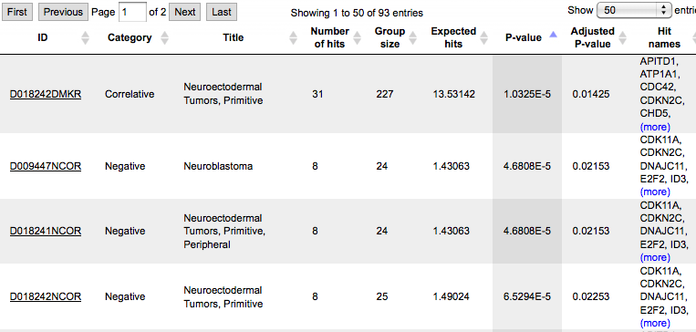

Each row corresponds to one ontological category, which in this case is one of
the diseases as they are annotated in the PROTEOME™ database*.* Commonly
accepted disease identifiers are shown in the **ID** column. The disease names
are shown in the column **Title**. The column **Group size** represents the
number of genes linked to this disease in PROTEOME™, and the column **Category**
demonstrates the functional type of the link between genes and disease; it can
be causal, correlative or negative. For each row several parameters are
calculated, the expected number of hits (**Expected hits**), the actual number
of hits (**Number of hits**), **P-value**, as well as **Hit names**. IDs are
hyperlinked to an external web page of CTD, the Comparative Toxicogenomics
Database. With a click on each ID, a new tab will be opened displaying
additional information about the disease.

**Note***.* This workflow is available together with a valid PROTEOME™ license.  
Please, feel free to ask for details (info\@genexplain.com).

### Site search with TRANSFAC®

Version 2.0 (Adjusted p-values, site search on track)

#### Single interval list

This workflow “Identify enriched motifs in tracks (TRANSFAC®)” is designed to
map putative enriched TFBSs on peaks calculated from your ChIP-seq data (Yes
set) as compared to a random background set (No set). Importantly, the No set is
created automatically and contains by default 1000 intervals. In the first part
of the workflow, the enriched motifs are identified by our proprietary MEALR
approach (*analyses/Methods/Site analysis/MEALR (tracks)*, icon ().

Enriched motifs serve as a basis to construct a specific profile. At the next
step this newly generated profile is run on the same list of input peaks
applying the method *analyses/Methods/Site analysis/Search for enriched TFBSs
(tracks)*, icon (

The workflow can be found under the section “Analyze ChIP-seq peaks” →
Site search with TRANSFAC(R) → version 2.0 (Adjusted p-values).

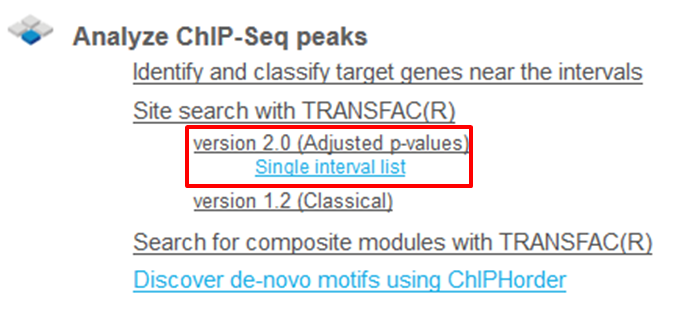

To launch the workflow, follow these steps:

**Step 1.** Open the workflow input form from the Start page. It will open in
the main Work Space and looks as shown below:

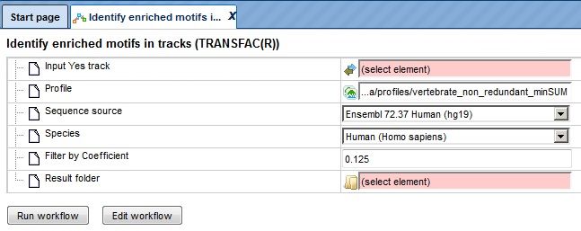

**Step 2.** Specify the input track in BED format in the field **Input Yes
track**.  
The input Yes track contains peaks from your ChIP-seq study. To specify the Yes
track, you can drag & drop it from your project within the tree area.
Alternatively, you may click on the pink field “select element” and a new window
will open, where you select the input track. After having selected the track,
press the [Ok] button.

**Step 3**. Select the profile. This profile will be applied at the first part
of the workflow for identification of the enriched motifs. The default profile
is *vertebrate_non_redundant_minSUM* from the most recent [TRANSFAC®
release](http://platform.genexplain.com/bioumlweb/#de=databases/TRANSFAC(R)
2019.1/Data/profiles/) available.

Any other TRANSFAC® profile or user-specific profile can be selected. With a
mouse click on the field **Profile**, a pop-up window will open, where a profile
can be selected.

**Step 4**. Specify the sequence source from the drop-down menu. Several human,
mouse and rat sequence builds are available in the platform, as shown below. By
default, the most recent Ensembl human genome, hg19, is specified. Make sure you
selected the sequence source (species and the genome build) that corresponds to
your input set, to get correct and meaningful results.

**Step 5**. Specify the biological species of the input set in the field
**Species** by selecting it from the drop-down menu.

**Step 6**. Select a filter for the coefficient of the MEALR method. The default
filter is set as \>0.125 to have 75% or more of true discovery rate, TDR. For
90% TDR, you can type 0.270 in this field and for 50% TDR - 0.05593. The
filtered motifs are included in the output as *enriched motifs*. At the later
step, PWMs corresponding to the enriched motifs are used to make a new profile.

**Step 7.** Define where the folder with the results should be located in your
project tree. You can do so by clicking on the pink field “select element” in
the field **Result folder**, and a new window will be opened, where you can
select the location of the results folder and define its name.

**Step 8.** Press the [Run workflow] button.

Wait until the workflow is completed.

The **Result folder** contains several tables and three tracks; for this
example, let’s consider the results folder located under
[Examples](http://platform.genexplain.com/bioumlweb/#de=data/Examples/E2F1
binding regions in HeLa cells%2C ChIP-Seq/Data/GSM558469_E2F1_hg19 filtered
exp1000 dist1000 (enriched motifs 2.0_TRANSFAC(R))/). It is highlighted in blue
in the figure below:

The tables *Enriched motifs MEALR* (

) and *Transcription factors* (

) are opened automatically in the Work Space as soon as the workflow is
completed.

The table **Enriched motifs MEALR** includes enriched motifs in the Yes track
*versus* the No track, filtered by the coefficient as specified.

Please note that by default only the matrices with a **Coefficient** \>0.125
(75% **T**rue **D**iscovery **R**ate) are included in this output table. These
motifs can be interpreted as the best discriminating motifs between the Yes and
NO sets.

The table **Enriched motifs MEALR** shown below has been sorted by the values in
the **Coefficient** column. The larger the coefficient, the more important the
corresponding motif was for discriminating between Yes and No sequences.

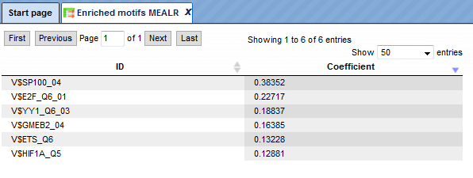

The table **Profile** is opened automatically and is an input-specific profile,
based on the filtered *enriched motifs MEALR* from the first part of the
workflow.

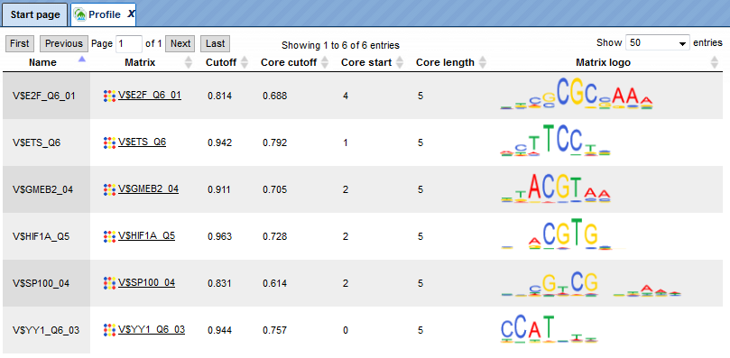

This profile is an intermediate result of the workflow and is used further for
*Site search on gene set* analysis in the second part of the workflow.

### Table Transcription factors Ensembl:

This table includes transcription factors (TFs) that are associated with the
PWMs listed in the table *Site search summary*. Each row shows details for one
TF, including its Ensembl gene ID (column **ID**), gene symbol, gene description
and biological species of the corresponding TF (columns **Gene description**,
**Gene symbol**, and **Species**). The column **Site model ID** shows the
identifier of the PWM associated with this TF, and several further columns
repeat information that is also shown in the table *Site search summary*.

For further visualization of resulting *Yes sites opt* track please refer to
the description of the workflow "Search for discriminative sites with TRANSFAC® (MEALR)"

**Note***.* This workflow is available together with a valid TRANSFAC® license.  
Please, feel free to ask for details (info\@genexplain.com).

## Version 1.2 (Classical)

### Single interval list

This workflow helps to map putative TFBSs on peaks calculated from your  
ChIP-seq data. Site search is done with the help of the TRANSFAC® library of
positional weight matrices, PWMs, using the pre-computed profile
vertebrate_non_redundant_minSUM.

The few steps to launch the workflow are described in the following.

**Step 1**. Open workflow input form from the Start page, it will be opened in
the main Work Space and looks as it is shown below:

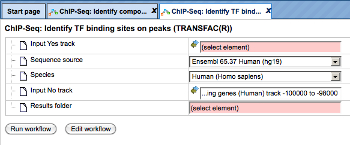

**Step 2.** Specify the input track in BED format in the field **Input Yes
track**.  
The input Yes track contains peaks from your ChIP-seq study. To specify the Yes
track, you can drag & drop it from your project within the tree area.
Alternatively, you may click on the pink field “select element” and a new window
will open, where you select the input track. After having selected the track,
press the [Ok] button.

**Step 3.** Specify the sequence source from the drop-down menu. Several human,
mouse and rat sequence builds are available in the platform, as shown below. By
default, the most recent Ensembl human genome, hg19, is specified. Make sure you
selected the sequence source (the genome build) that corresponds to your input
set, to get correct and meaningful results.

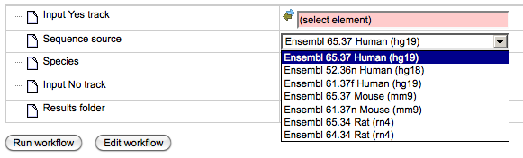

**Step 4.** Specify the biological species of the input set in the field
**Species** by selecting the required species from the drop-down menu.

**Step 5.** Specify No track in BED format in the field **Input No track**. Upon
clicking on this field, a supplementary window will open, where you can select
the No track from your project tree, or use one of our default No tracks for
human, mouse or rat, respectively.

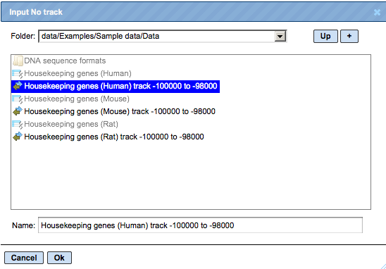

**Step 6.** Define where the folder with the results should be located in your
project tree. You can do so by clicking on the pink field “select element” in
the field **Results folder**, and a new window will be opened, where you can
select the location of the results folder and define its name.

**Step 7.** Press the [Run workflow] button.

Ready!

Wait until the workflow is completed.

**The results folder** contains two tables and two tracks; for this example,
let’s consider the results folder located under “Examples”. It is highlighted by
blue in the figure below:

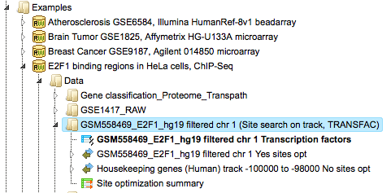

The tables *Site optimization summary* (

) and *Transcription factors* (

) are opened automatically in the Work Space as soon as the workflow is
completed.

**The table Site optimization summary** includes the matrices the hits of which
are over-represented in the Yes track *versus* the No track.

Please note that only the matrices with Yes-No ratio higher than 1 are included
in this output table. The hits of these matrices can be interpreted as
over-represented in the Yes set *versus* No set.

The table *Site optimization summary* shown below has been sorted by the values
in the **Yes-No ratio** column.

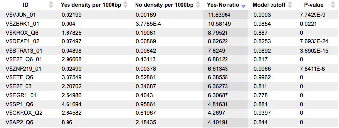

Each row summarizes the information for one PWM. For each selected matrix, the
columns **Yes density per 1000bp** and **No density per 1000bp** show the number
of matches normalized per 1000 bp length for the sequences in the input Yes set
and input No set, respectively. The Column **Yes-No ratio** is the ratio of the
first two columns. Only matrices with a Yes-No ratio higher than 1 are included
in the *summary* table. The higher the Yes-No ratio, the higher is the
enrichment of matches for the respective matrix in the Yes set. The matrix
cutoff values as they are calculated by the program at the optimization step are
shown in the column **Model cutoff**, and the last column shows the **P-value**
of the corresponding event.

### Table Transcription factors:

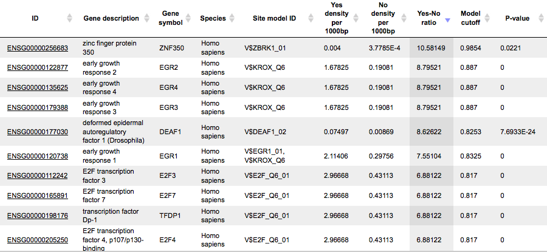

This table includes transcription factors (TFs) that are associated with the
PWMs that are listed in the table *Site optimization summary*, and each row
shows details for one TF, including its Ensembl gene ID (column **ID**), gene
symbol, gene description and biological species of the corresponding TF (columns
**Gene description**, **Gene symbol**, and **Species**). The column **Site model
ID** shows the identifier of the PWM associated with this TF, and several
further columns repeat information that is also shown in the table *Site
optimization summary*.

Tracks “Yes sites opt” and “No sites opt” ().

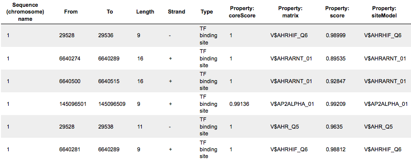

Each row presents details for each individual match for every PWM. Columns
**Sequence (chromosome) name**, **From**, **To**, **Length** and **Strand** show
the genomic location of the match including chromosome number, start and end
positions, strand and length of the match, respectively. The column **Type**
contains information about the type of the elements; in this case all matches
are considered as “TF binding site”. Further columns keep information about PWM
producing each match (column **Property:matrix**) as well as a score of the core
(column **Property:coreScore**) and a score for the whole matrix (column
**Property:score**). The column **Property: siteModel** contains an identifier
for the site model, which is the matrix together with the cutoff applied (for
details about these scores, please see Kel et al., Nucleic Acids Res.
31:3576-3579, 2003).

**Tip**. Further visualization of track files in the genome browser:  
Having tracks “Yes sites opt” and “No sites opt” opened in the Work Space, the
menu button

can be applied to get a visualization. First, a supplementary window is opened
where you can select one chromosome and press [Ok], as shown below.

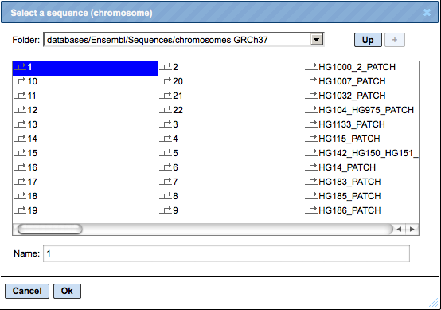

In the second pop-up window, you can select tracks that can be visualized
together with your track, e.g. “Yes sites opt” (see above), and press [Ok].

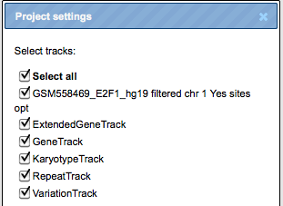

The resulting visualization, after applying the “zoom in” button

, looks like it is shown below. Matches for different matrices are shown in
colors, and the color schema can be customized.

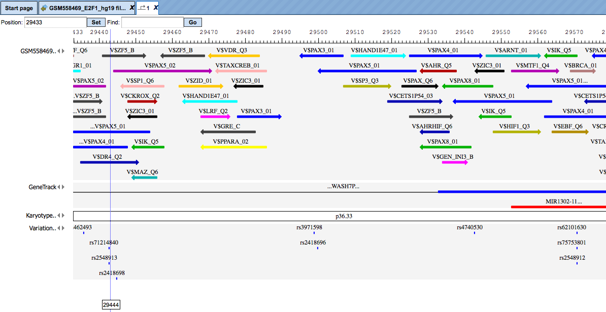

Such a view may help to visually co-localize information on different tracks,
e.g. putative TFBS with variations, repeats and genes. In the figure above, the
cursor shows position 29444, and two variations are located at this position.
You can immediately recognize that these variations are located within
particular putative binding sites in the intron region of the WASH7P gene.

The same information is available not just as a picture, but also as a table
under the tab “Sites” (shown below). For each element information is shown on
chromosome, positions, length, strand, type of the track, and name of the
element.

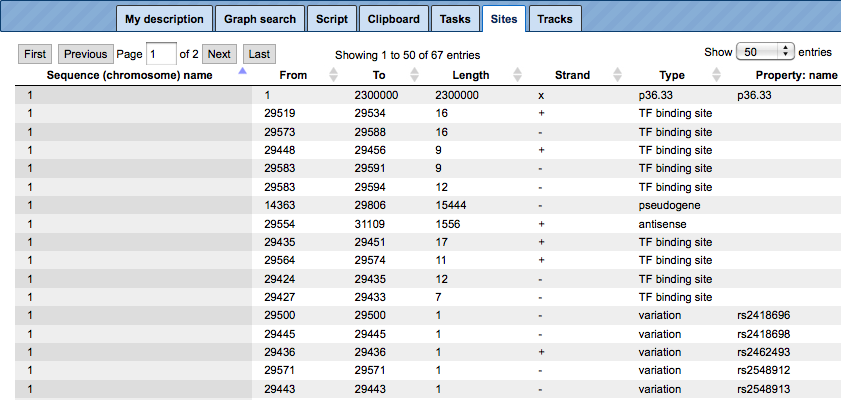

This table can be exported as a track, in several different formats including
intervals, bed, wig, gff, gtf and more.

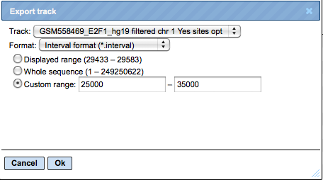

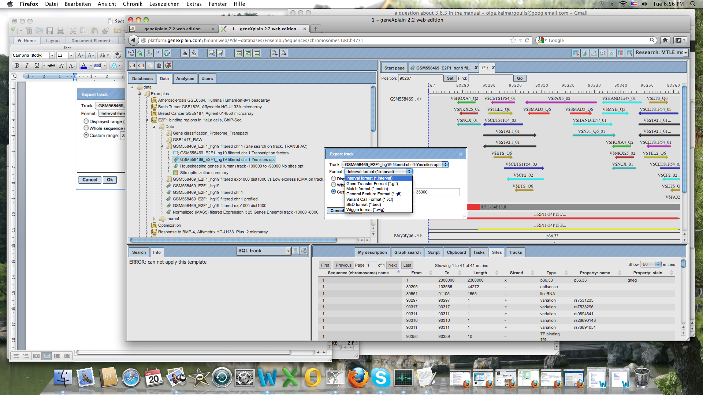

**Note.** This workflow is available together with a valid TRANSFAC® license.  
Please, feel free to ask for details (info\@genexplain.com).

### Multiple interval sets

This workflow is designed to search for TFBSs in DNA sequences identified by the
ChIP-seq approach, for multiple datasets.

In the field **Input Yes tracks**, several different tracks can be
simultaneously submitted. The same background dataset, **Input No track**, is
used for comparison with each of the submitted Yes tracks. The default No track
corresponds to far upstream regions of the house keeping genes, where no
functional TFBSs are expected.

The steps of this workflow for a single input Yes track are described in the
previous section. In this workflow, the same steps are performed next time for
the 2nd Yes track, and so on iteratively for each of the input Yes tracks.

This workflow helps to save time and efforts, especially when you have several
sets of ChIP-seq data, e.g. the peaks for a number of different TFs.

**Note***.* This workflow is available together with a valid TRANSFAC® license.  
Please, feel free to ask for details (info\@genexplain.com).

### Search for composite modules with TRANSFAC®

This workflow finds pairs of TFBSs that discriminate between two tracks, the
*Yes* and the *No* tracks. As the Yes track, the ChIP-seq peaks identified as
binding profiles for particular transcription factors can be considered.

The ChIP-seq experimental technology is widely applied to a variety of
biological problems, in particular to study genome-wide histone modification
profiles, e.g. histone methylation and histone acetylation profiles.
Correspondingly, the same workflow in the platform can be used to analyze
histone modification profiles as well. The example of such an application to
histone acetylation peaks in SAHA-treated human vascular endothelial cells is
described in Section 6.1.3. Please refer to this section for details how to
launch the workflow.

Here, let’s consider the results of the workflow application to find composite
modules in the ChIP-seq peaks identified for in-vivo-bound fragments of
transcription factor E2F1 in HeLa cells, published in Gene Expression Omnibus,
*GSM558469*.

**Input Yes track**. The original track of genome-wide E2F1 binding fragments
was filtered by the length shorter than 600 bp, which resulted in 249 fragments.
This track of 249 fragments is used as the input Yes track. It can be found in
the *Examples* folder under:

data/Examples/E2F1 binding regions in HeLa cells,
ChIP-Seq/Data/GSM558469_E2F1_hg19 filtered exp1000 dist1000 L\<600

**Input No track**. A track of the far upstream fragments of the human
housekeeping genes located on chromosome 1 is taken as the No track. It can be
found in the *Examples* folder under:

data/Examples/E2F1 binding regions in HeLa cells, ChIP-Seq/Data/ Housekeeping
genes (Human) track -100000 to -98000, chr 1

The workflow input form is completed and the run is in progress:

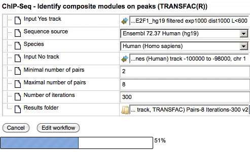

The resulting folder can be found under:

data/Examples/E2F1 binding regions in HeLa cells,
ChIP-Seq/Data/GSM558469_E2F1_hg19 filtered exp1000 dist1000 L\<600 (CMA on
track, TRANSFAC) Pairs-8 Iterations-300 v2

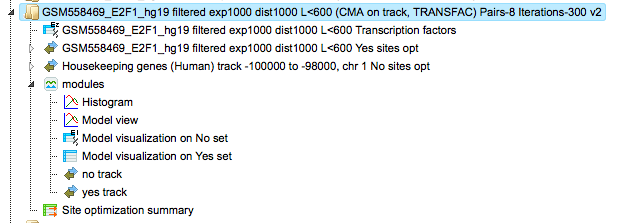

The table **Site optimization summary** (

) contains those site models, here TRANSFAC® matrices, that are over-represented
in the Yes track as compared to the No track.

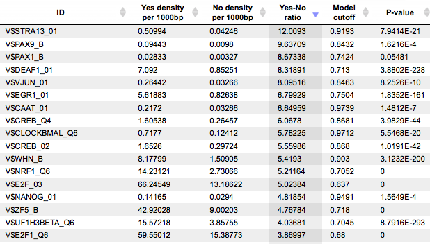

Each row of the table represents the result for one PWM from the input profile.
Only those PWMs with Yes-No ratio \>1 are included in the output. Upon sorting
by the Yes-No ratio, matrices for E2F factors are among top 20 lines. Please
note that the p-values of E2F matrices are extremely low, which demonstrates
highest statistical significance of the results.

The **Modules** folder (

). The composite module found contains two pairs, and we can see by exactly
which site models (matrices) these pairs are formed as well as the statistical
parameters of the overall model.

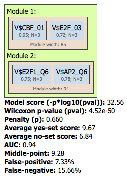

Both pairs contain matrices for E2F factors.

For more details on the individual output tables and tracks as well as for
**visualization** of the identified composite modules in the genome browser
please refer to the description of the method Identify composite modules.

**Note***.* This workflow is available together with a valid TRANSFAC® license.  
Please, feel free to ask for details (info\@genexplain.com).

### Identify enriched motifs in tissue specific promoters

This workflow searches for enriched transcription factor binding sites (TFBSs)
in a set of gene promoters versus a random promoter set. The input gene set is
used to extract promoter regions by mapping it against the TSS locations defined
in CAGE data in the Fantom5 ([Nature 507:462–470](http://www.nature.com/nature/journal/v507/n7493/full/nature13182.html))
database . The over-represented sites identified with the MEALR
method are converted into a profile, which is used for a second round of site
search, and ends up with the identification of transcription factors. To launch
the workflow, open the workflow input form from the Start page:

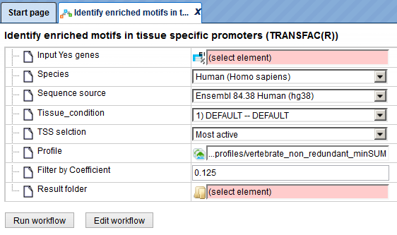

**Step 1**: To specify the **Input Yes genes**, you can drag & drop it from your
project within the tree area. Alternatively, you may click on the pink field
“select element” and a new window will open, where you select the input gene
list. After having selected the list, press the [Ok] button.

For this example, all further steps are demonstrated with the following input
set:

[http://platform.genexplain.com/bioumlweb/\#de=data/Examples/Brain%20Tumor%20GSE1825%2C%20Affymetrix%20HG-U133A%20microarray/Data/Ewing%20Family%20Tumor%20versus%20Neuroblastoma/Experiment%20normalized%20(RMA)%20(Differentially%20expressed%20genes%20Affy)/Upregulated%20Ensembl%20genes%20filtered%20(LogFC%3E1)]
(http://platform.genexplain.com/bioumlweb/#de=data/Examples/Brain%20Tumor%20GSE1825%2C%20Affymetrix%20HG-U133A%20microarray/Data/Ewing%20Family%20Tumor%20versus%20Neuroblastoma/Experiment%20normalized%20(RMA)%20(Differentially%20expressed%20genes%20Affy)/Upregulated%20Ensembl%20genes%20filtered%20)

**Step 2**: Specify the biological species of the input set in the field
**Species** by selecting the desired species from the drop-down menu.

**Step 3**: Specify the **Sequence source** from the drop-down menu. Several
human, mouse and rat sequence builds are available in the platform, as shown
below. By default, the most recent Ensembl human genome, hg38, is specified.
Make sure you select the sequence source (the genome build) that corresponds to
your input set in order to get correct and meaningful results.

**Step 4**: Select the **Tissue condition**, select the tissue for which you
want to create the promoter track from the drop-down menu.

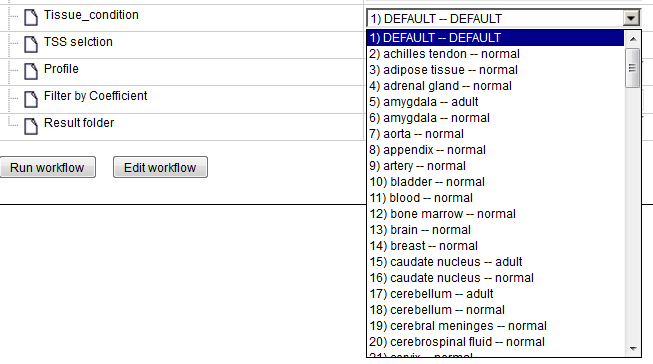

**Step 5**: The **TSS selection** should be performed if there are multiple
transcription start sites. By default, the most active site is considered as
TSS. You can select between most active, 5’ active, 3’ active and all (see
below) from the drop-down menu.

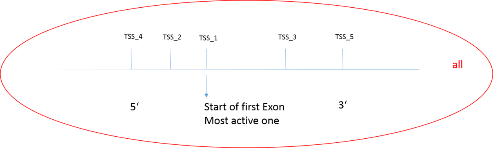

**Step 6**: Define a TRANSFAC® profile. The default profile is
vertebrate_non_redundant_minSUM. Any other TRANSFAC® profile or user-specific
profile can be chosen. With a mouse click on the field **Profile**, a pop-up
window will open, where a profile can be selected.

**Step 7:** Select a filter for the coefficient of the MEALR method. The default
filter is set as \>0.125 to have 75% or more of true discovery rate, TDR. For a
90% TDR, you can type 0.270 in this field and for 50% TDR - 0.05593. The
filtered motifs are included in the output as *enriched motifs*. At the later
step, PWMs corresponding to the enriched motifs are used to create a new
profile.

**Step 8**: Define where the folder with the results should be located in your
project tree. You can do so by clicking on the pink box (select element) in the
field **Results folder**, and a new window will open, where you can select the
location of the results folder and define its name.

**Step 9**: Press the [Run workflow] button. Wait until the workflow is
completed, and take a look at the results.

#### Interpretation of results

The result folder contains several files and one profile (collection of
matrices):

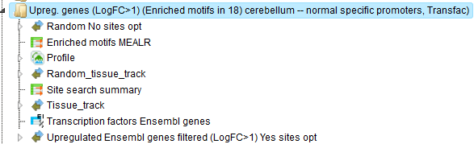

Tracks

The input gene list is used to create tissue-specific promoter sequences as well
as a random track. The random track includes 1000 random promoter sequences from
the same sequence source as the input gene set. The resulting tracks are
*Tissue_track* (from Input Yes genes) and *Random_tissue_track*.

Enriched motifs

The list of motifs, which were found during the first part of the workflow, and
were filtered by the coefficient \> 0.125, can be found in the table
*Enriched_motifs MEALR* (

). It contains those site models, here TRANSFAC® matrices, which are enriched in
the *Tissue_track* in comparison with the *Random_tissue_track*. The example has
2 detected motifs with a coefficient \> 0.125. The *Profile* contains the matrix
collection of converted and filtered site models. The table *Transcription
factors Ensembl genes* includes the corresponding 35 TFs from the second S*ite
search summary* and is shown below:

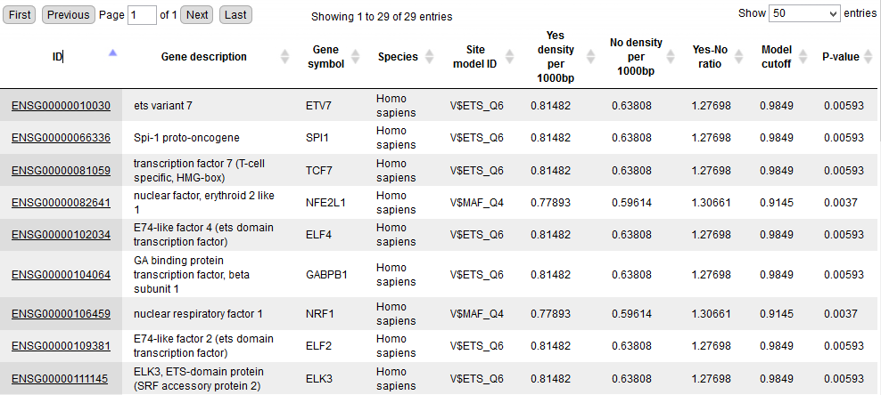

**Note***.* This workflow is available together with valid TRANSFAC® and
TRANSPATH® licenses. Please feel free to ask for details (info\@genexplain.com).

### Discover de-novo motifs using ChIPHorde and DiChIPHorde

ChIPHorde uses the fast heuristic of
[ChIPMunk](http://bioinformatics.oxfordjournals.org/content/26/20/2622.abstract),
which is based on a greedy approach accompanied by bootstrapping, to search for
multiple significant motifs in a given dataset using two independent filtering
strategies. DiChIPHorde searches for di-nucleotide motifs that capture
dependencies between neighboring motif positions.

The image below shows the ChIPHorde interface. The input mask of DiChIPHorde
features only slight differences as pointed out in the section describing input
parameters.

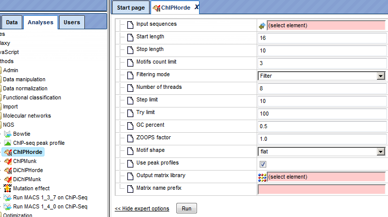

The parameters are described in the following. For further details, please also
refer to the [ChIPMunk manual](http://autosome.ru/smbsm/librettos/libretto_chipmunk/chipmunk_v3_manual.txt).

**Input sequences**: Track with input reads

**Start length**: Start length of the matrix

**Stop length**: Stop length of the matrix

**Motifs count limit**: Maximum number of motifs to discover

**Filtering mode**: Whether to mask polyN ("Mask") or to drop entire sequence
("Filter")

**Number of threads (expert)**: Number of concurrent threads when processing

**Step limit (expert)**: The number of bootstrapping runs. With a large data set
or if unsure which computational time to expect, try a small number, e.g. 10.

**Try limit (expert)**: This is a number of general optimization runs. For a
random seeding this is equal to the number of seeds. As with “step limit”, apply
the parameter with the size of your data set in mind. It is always advisable to
test with a small number first.

**Local background (expert)**: **\*DiChIPHorde only\*** If checked, local
background estimation is used. Otherwise uniform background estimation is used

**GC percent (expert)**: **\*ChIPHorde only\*** Relative GC content to be used
as nucleotide background (0..1). Set to -1 to use the observed GC content.

**ZOOPS factor (expert)**: Sets the preference for ZOOPS (Zero-or-one[-motif
occurrences]-per-sequence) versus OOPS (Only-one-per-sequence) mode.

**Motif shape (expert)**: The type of motif shape prior to use. The parameter
corresponds a prior on the number of informative regions within the motif.

**Use peak profiles (expert)**: Whether to apply peak profiles (if available).

**Output matrix library**: Path to the matrix library to be extended or created.

**Matrix name prefix**: Prefix for matrix names. It will be appended with a
number.
