# Overview of all available tools inside the geneXplain platform

## Data manipulation
### Annotate diagram
### Annotate table
The analysis method [**Annotate table**] can be found in the Tree Area, under the Analyses tab in the folder *Methods*, subfolder *Data manipulation*.

[**Annotate table**]: https://platform.genexplain.com/bioumlweb/#de=analyses/Methods/Data%20manipulation/Annotate%20table

Applying the *Annotate table* method, you can add columns to any gene or protein table in the tree. The source for annotation columns can be a database or any other table.

The input table will not be changed. As a result of the analysis, a new table with additional columns will be created.

The input form of this method, when opened in the Work Space, is shown below:

![Input_Annotate_table]

[Input_Annotate_table]: images/Annotate_table.PNG

In the following, we will consider the input fields one by one:

*Experiment* – Input a table for which you wish to add annotation. In order for this analysis to work properly, the ID column of this table should contain recognizable biological identifiers that can be mapped to the annotation source identifiers.

*Species* - Species corresponding to the input table. By default, human is selected. If your input table corresponds to a mouse or rat dataset, please specify it.

*Annotation source* – Select the data collection, a database or any table in the tree area, which you plan to use as a source of additional columns. Below two examples are given, with the Ensembl database and with a user-specific table as possible annotation sources.

*Annotation Columns* - As soon as the annotation source is specified, all columns of this table are visible in the drop-down menu. There you can select one or several columns from the drop-down menu, which will be added to the input table.

*Output table* – Select the location in the tree area where the resulting table will be stored, and define a name for the new table. If a table with the same name already exists at the same location, it will be replaced.

This is an [example input] table of up-regulated Ensembl genes, which will get addional information from Ensembl database. The Annotate table method will add gene description and gene symbol information from Ensembl database.

[example input]: https://platform.genexplain.com/bioumlweb/#de=data/Examples/User%20Guide/Data/Examples%20of%20methods/Data%20manipulation/Up-regulated_genes_Ensembl

In the field Species *Human* is selected, because the input table corresponds to a human dataset.

By default, the Ensembl database, namely its *gene* table, is selected in the field *Annotation source*. All columns present in this table are available in the drop-down menu of the field *Annotation columns*. As shown in the screenshot below, two columns are selected, Gene description and Gene symbol:

![Annotation_columns]

[Annotation_columns]: images/Annotate_table_2.png

Last step is to define the *Output table* path. Now you can press the [Run] key to start the Annotate table tool.

When the analysis is complete, the [output annotate table] is automatically opened in the Work Space:

![Output table][Output_table]

[Output_table]: images/Annotate_table_result_2.PNG

[output annotate table]: https://platform.genexplain.com/bioumlweb/#de=data/Examples/User%20Guide/Data/Examples%20of%20methods/Data%20manipulation/Up-regulated_genes_Ensembl%20annotated

In this result table two new columns are added, Gene description and Gene symbol, to the right of the ID column. The ID column itself, and all the other columns are exactly the same as they were in the input table.

### Annotate track with genes

The analysis method [Annotate track]  can be found in the Tree Area, under the Analyses tab in the folder *Methods*, subfolder *Data manipulation*. 

[Annotate track]: https://platform.genexplain.com/bioumlweb/#de=analyses/Methods/Data%20manipulation/Annotate%20track%20with%20genes

The method *Annotate track with genes* () helps to add information about nearby located genes to each fragment. 
The input form of this method, when opened in the Work Space, is shown below:

![Input form Annotate track with genes][Input_Annotate_track_with_genes]

[Input_Annotate_track_with_genes]: images/Annotate_track_with_genes.PNG

**Input track**. Specify the input track. You can drag & drop it from your data project within the Tree Area into the input form. Alternatively, you may click on the pink field of *Input track* and a new window will be opened, where you can select the input track.

This is an [example_input_track], which will get information about the nearby located genes to each fragment.

[example_input_track]:https://platform.genexplain.com/bioumlweb/#de=data/Examples/User%20Guide/Data/Examples%20of%20methods/Data%20manipulation/CEBP%20in%20H1-hESC%20cells%20YES

This track contains 500 in-vivo binding fragments for the C/EBP transcription factor (Encode project).

**Species**. Choose human, mouse or rat from the drop-down menu.

**5’ region size** and **3’ region size**. By default this method considers the following regions around Ensembl genes: 1000 bp in 5’ direction from TSS and 100 bp in 3’ direction from the last exon. The positions of each fragment on the input track are compared with the positions of the extended gene regions. Genes overlapping with an input fragment are considered for annotation of this fragment.

**Output track**. Last step is to define the *Output track* path. Now you can press the [Run] key to start the Annotate track with genes tool.

When the analysis is complete, the [Annotate track output] is automatically opened in the genome browser in the Work Space:

![Output track][Output_track]

[Output_track]: images/Annotate_track_genes.PNG

[Annotate track output]: 
https://platform.genexplain.com/bioumlweb/#de=data/Examples/User%20Guide/Data/Examples%20of%20methods/Data%20manipulation/CEBP%20in%20H1-hESC%20cells%20YES%20annotated

When opened as a table, it looks like this:

![Output track][Output_track_table]

[Output_track_table]: media/Annotate_track_genes_2.PNG

As shown in the output above, all columns of the input track are present in the output table also and additionally a new column is added, called **Property:Genes**. This newly added column is a result of an annotation of the input track with genes, and for each fragment it contains gene symbols of overlapping genes. 
As you can see, some of the fragments are not overlapping with any genes, and some of the fragments may be overlapping with two or even more genes. It depends on the particular fragments, their length and location as well as on the length of the gene-bound extension regions specified in the input form. Next to each gene symbol there are gene regions specified, for example *MFHAS1 (exons + 2 introns)*. This means, a particular fragment overlaps one exon and two introns of the MFHAS1 gene.

**Tip** If you would like to annotate overlapping genes for all fragments in the input track, you might be interested to increase the gene-bound extension regions in the input form, and run the analysis again.

### CR cluster selector
The analysis method [CR cluster selector] can be found in the Tree Area, under the Analyses tab in the folder Methods, subfolder Data manipulation.

[CR cluster selector]: https://platform.genexplain.com/bioumlweb/#de=analyses/Methods/Data%20manipulation/CR%20cluster%20selector

This method uses the result of a CRC (Chinese Restaurant Clustering) analysis and extracts most
centered cluster items into a separate table. The input form is as shown below:

In the following, we will consider the input fields one by one:
**Input clusters** – Input the table of clusters produced as an output by CRC Analysis

**Maximum number of clusters to use** – Enter the maximum number of clusters to use for the analysis method. The value is set to 2 by default. 

**Max items per cluster** – Enter the Maximum items per cluster for the method. The value is set to 300 by default. 

**Min items per cluster** – Enter the Minimum items per cluster for the method. The value is set to 10 by default. 

**Output folder** – Select the location in the tree area where the resulting folder
will be stored, and define a name for the new output folder. 

This is an [CR_cluster_input] table, the table is an output of the method CRC cluster analysis. As shown in the screenshot below the method will create 5 clusters with maximum of 300 items in one cluster and minimun of 10 items in one cluster. 

[CR_cluster_input]: https://platform.genexplain.com/bioumlweb/#de=data/Examples/User%20Guide/Data/Examples%20of%20methods/Data%20manipulation/CRC_clustering_output

When the analysis is complete, the [CR_cluster_output_file] is automatically opened in the Work Space. As shown below, the input table clusters are divided into 5 clusters which are sorted by size. The method takes top Maximum number of clusters to use with size greater than Min items per cluster and extracts Max items per cluster items closest to the center of cluster.

[CR_cluster_output_file]: https://platform.genexplain.com/bioumlweb/#de=data/Examples/User%20Guide/Data/Examples%20of%20methods/Data%20manipulation/CR_Cluster_Selector/cluster1

### Calculate weighted mutation score
The analysis method [Calculate weighted mutation score] can be found in the tree area, on the Analyses tab in the folder Methods, subfolder Data manipulation. This Analysis can be applied to the results of the [Mutations to genes with weights] analysis.

This method is applied to the result of "Mutations to genes with weights" analysis, that converts mutation track to gene set and calculates weights based on mutation positions. This method calculates the weighted mutation score using the following formula:

Weighted score = In_disease * In_transpath * Gene mutation weight, where

In_disease = 2.0 for genes assigned to selected diseases,
In_transpath = 1.5 for genes mapped to Transpath pathways,
and In_disease = In_transpath = 1.0 in all other cases.
Gene mutation weight is taken from Column with total count or weight in case of Use simple weigth is checked. Otherwise it is calculated as follows:

W = 1.0 * (Count_total - Count_in_promoters - Count_in_exons) + 1.3 * Count_in_promoters + 0.7 * Count_in_exons

Input form of the method is as shown below: 

**Parameters**:
Input table – Enter the Input table which is the output from the method Mutations to genes with weights.  
Use simple weight – Selecting this parameter allows the method to use weight from selected column, we can choose to not select based on our input table type, No selection will lead to selection of additional columns with exone count and promoter count.  
Column with total count or weight – Select the column with total count or weight from the drop down menu
Species – Select the Species for the input table 
Diseases list – Select the Diseases list from the drop down menu
Result table – Specify the output path and name of the output table 

As shown below, we used the [Input_mutated_table], a sample table from colorectal neoplasms analysis as input for the method, selected the column use simple weight and then selected the corresponding weight column from the drop down menu, since the table is from colorectal neoplasms analyis, the disease list is selected accordingly.

The [Output_ranked_table] is opened in the work space, which calculates the weighted score for each every gene.

[Calculate weighted mutation score]: https://platform.genexplain.com/bioumlweb/#de=analyses/Methods/Data%20manipulation/Calculate%20weighted%20mutation%20score
[Mutations to genes with weights]: https://platform.genexplain.com/bioumlweb/#de=analyses/Methods/Data%20manipulation/Mutations%20to%20genes%20with%20weights
[Input_mutated_table]: https://platform.genexplain.com/bioumlweb/#de=data/Examples/User%20Guide/Data/Examples%20of%20methods/Data%20manipulation/mutation_gene_table
[Output_ranked_table]: https://platform.genexplain.com/bioumlweb/#de=data/Examples/User%20Guide/Data/Examples%20of%20methods/Data%20manipulation/mutation_gene_table%20ranked

### Check quotas
This method checks project disk space usage and corrects it with deleting temporary used disc space if necessary. The input form provides user an option to select the projects to check the quotas. Select the project and press run. 

### Composite module to proteins
The analysis method [Composite module to proteins] can be found in the tree area, on the Analyses tab in the folder Methods, subfolder Data manipulation. This Analysis can be applied to the results of the [Construct composite modules] analysis.

[Composite module to proteins]: https://platform.genexplain.com/bioumlweb/#de=analyses/Methods/Data%20manipulation/Composite%20module%20to%20proteins

[Construct composite modules]:
https://platform.genexplain.com/bioumlweb/#de=analyses/Methods/Site%20analysis/Construct%20composite%20modules

It is designed to convert site models that are part of a composite module into transcription factors. For this conversion, the links between transcription factors and site models as they are curated in the corresponding database are used. The database is selected based on the profile you choose when you construct a composite module, which should be a step prior to this analysis. The input form is as shown below:

![Composite module to protein][CM_protein_01]

[CM_protein_01]:images/CM_protein_01.PNG

**Parameters:**

**CMA result table** – Select the results of the "Construct composite module" analysis
**Profile** – Select the profile that was used for site search. In most of the cases, profile is selected automatically.
**Species** – Select the species of the input table
**Output type** – Select type of identifiers for the resulting table
**Ignore empty values** – check this box to ignore empty values during aggregator work
**Output table** – select the path and name of the output table

For demonstration the following [input file] is selected as shown in the screen below, the profile from CMA run is selected by default by the analysis. As output type here Uniprot proteins is selected

[input file]: https://platform.genexplain.com/bioumlweb/#de=data/Examples/User%20Guide/Data/Examples%20of%20methods/Data%20manipulation/CMA%202%20to%204%20modules%20(Site%20search%20-1000%20100)/Model%20visualization%20on%20Yes%20set

[Output_Proteins] table is opened automatically after completion of the method run as shown below:

This table is a list of transcription factors as a gene set. This table can be used as input for the Regulator search as well as for other analyses.

[Output_Proteins]: https://platform.genexplain.com/bioumlweb/#de=data/Examples/User%20Guide/Data/Examples%20of%20methods/Data%20manipulation/CMA%202%20to%204%20modules%20(Site%20search%20-1000%20100)/Model%20TFs

### Convert table
The analysis method [Convert table] can be found in the tree area, on the Analyses tab in the folder Methods, subfolder Data manipulation. 

[Convert table]: https://platform.genexplain.com/bioumlweb/#de=analyses/Methods/Data%20manipulation/Convert%20table

This method changes the type of identifiers using the internal chain of BioHubs. BioHubs is an internal, proprietary database that maps the IDs of a wealth of data source to each other. For example, this method converts the Genes: Ensembl type of identifiers into Proteins: Ensembl. If a direct conversion between two selected types is impossible, this analysis will create an optimal chain of several BioHubs and use them subsequently.

The analysis input form when opened in the work space is shown below:

![Convert_table][Convert_table]

[Convert_table]: images/Convert_table_01.PNG

In the following, we will consider the input fields one by one:

**Input table**: Input the data table for which you wish to convert the identifiers.

**Input type**: Type of identifiers in the input table. This is automatically detected in the majority of cases. However, if there are two columns with different identifiers in the input table, you can manually select the identifier you wish to convert.

**Output type**: Type of identifiers into which you wish to convert the input type.

**Species**: Select human, mouse or rat, corresponding to the input table.

Numerical value treatment rule: Select one of the rules for treating the values in the numerical columns of the input table. Rule selection is important, when several rows are merged into a single one. We have to take into account that one identifier of a given type may correspond to several identifiers of another type, each of which is associated with a numerical value in the Leading Column (for this, see below). To choose which of these numerical values has to be taken into the merged row, a rule has to be defined. It is to be chosen from a drop-down menu. By default the “extreme” rule is selected, which is equivalent to the maximal value in case of positive numbers, but corresponds to the minimal value in case of negative numbers. In cases of “average”, “average w/o 20% outliers” and “sum”, the selected rule is applied to all numerical columns of the table.

In case of the “minimum”, “maximum” and “extreme” rules a new option appears below which requests the user to select a Leading column. The chosen rule is applied then to the values in the selected Leading column (e.g. in the Leading column the maximum value is computed among all merged rows). All other numerical values of the table will be taken from that row which corresponds to the selected value in the leading column.

**Output table**: Path to store the resulting table in the tree.

**Note**: Several non-trivial situations might occur during conversion:

- A single source ID matches to several target IDs. In this case the source row will be copied several times, one copy per target ID.
- A source ID doesn’t match to any target ID. In this case the source row will be removed from the result.
- Several source IDs match to a single target ID. In this case two options are available:
a) If you have specified the leading column, only one out of all suitable source rows will be shown in the resulting table, based on the specified rule. For example, if you specified ‘maximum’ as a rule, the source row with maximal value in the main column will be selected from suitable rows.
b) If you have not specified a leading column, all the corresponding source rows will be merged together using merging rules. Non-trivial columns like ‘Graph’ will not be shown in the resulting table. Text columns will have all values joined into a sorted comma-separated list with duplicates removed. Numerical columns will be merged based on the selected rule. For example, if you select ‘average’ as a rule, then the mean value will appear in the resulting table. If your source column has an integer type, it might be changed into float.

**Example**: Conversion of Ensembl gene IDs to UniProt IDs

The [input table] is selected and the corresponding parameters are filled as shown in the screen shot below: 

![Convert_table][Convert_table_input]

[input table]: https://platform.genexplain.com/bioumlweb/#de=data/Examples/User%20Guide/Data/Examples%20of%20methods/Data%20manipulation/Upregulated%20Ensembl%20genes%20filtered%20(logFC%3E1)

[Convert_table_input]: images/Convert_table_02.PNG

Upon completion of the analysis the [convert_table_output_file] is opened by default.

[convert_table_output_file]: https://platform.genexplain.com/bioumlweb/#de=data/Examples/User%20Guide/Data/Examples%20of%20methods/Data%20manipulation/Upregulated%20Ensembl%20genes%20filtered%20(logFC%3E1)%20Proteins%20UniProt

As shown above the column ID now contains UniProt IDs. The column Ensembl ID, which was the ID column in the input table, is also present in the output table, as the second column to the right of the new ID column.

All the other columns of the input table are included in the output table as well. Numerical values are calculated according to the selected rule.

Similarly, any other table in the tree area with gene or protein identifiers can be converted into the desired type of identifiers.

### Convert table to track
The analysis method [Convert table to track] can be found in the Tree Area, under the Analyses tab in the folder Methods, subfolder Data manipulation

[Convert table to track]: https://platform.genexplain.com/bioumlweb/#de=analyses/Methods/Data%20manipulation/Convert%20table%20to%20track

This analysis method converts a table to a track. The table should essentially have chromosome/sequence location and positions for converstion to track. The algorithm matches the position of chromosomes to the sequence collection selected in the input form to convert the table to a track which can be visualized in the genome browser. 

Input form of the method looks as shown below:
![Convert_table_to_track][input_form]

[input_form]: images/convert_track_input_01.PNG

The parameters are explained below:
**Input table** – Table to convert to the track
**Chromosome (sequence) column**– Column where chromosome number is located (either like 'chr1', 'chr:1', 'chr.1' or simply '1')
**From column** – Column where site start coordinate is located
**To column** – Column where site end coordinate is located
**Strand column** – Column where site strand is located (+ or -)
**Sequence collection** – select the relevant Ensembl sequence for visualization of binding sites
**Genome ID string** – Something like 'hg18' or 'mm6'
**Output track** – Define the path and name of the output track

Example: The input table [Convert_table_track_input] with all pre-requisite columns  needed to convert to a track is selected and the corresponding parameters are filled as shown below:

![Convert_table _to_track][Convert_table _to_track]

[Convert_table _to_track]: images/convert_table_track_01.PNG

[Convert_table_track_input]: https://platform.genexplain.com/bioumlweb/#de=data/Examples/User%20Guide/Data/Examples%20of%20methods/Data%20manipulation/Convert_table_track_input

Output track opens in the genome browser post completion of the method. For this example 21 sites were created in the [output track converted from the table] as shown below:

[output track converted from the table]: https://platform.genexplain.com/bioumlweb/#de=data/Examples/User%20Guide/Data/Examples%20of%20methods/Data%20manipulation/Convert_table_track_output_track

### Convert table via homology
The analysis method [Convert table via homology] can be found in the Tree Area, under the Analyses tab in the folder Methods, subfolder Data manipulation.
This analysis is pretty similar to [Convert table] analysis, but allows to map identifiers from one species to another using the data from Ensembl Compara database. Thus you need to specify Input and Output data type and species in the input form.

[Convert table via homology]: https://platform.genexplain.com/bioumlweb/#de=analyses/Methods/Data%20manipulation/Convert%20table%20via%20homology
[Convert table]: 
https://platform.genexplain.com/bioumlweb/#de=analyses/Methods/Data%20manipulation/Convert%20table

### Create Random track
The analysis method [Create Random track] can be found in the Tree Area, under the Analyses tab in the folder Methods, subfolder Data manipulation.

[Create Random track]: https://platform.genexplain.com/bioumlweb/#de=analyses/Methods/Data%20manipulation/Create%20random%20track

This method creates a track of randomly sampled sequence regions, also denoted as intervals, segments or subsequences. Upstream regions of genes serve as source for the random segments.
Sampling can take into account an input track in two ways. First, the lengths of output regions are sampled from lengths observed in the input track, so that the output track has a similar length distribution. This functionality can be overridden by specifying a common sequence length, in which case all sampled sequences will have the same length. Second, gene upstream regions that overlap with segments in the input track can be omitted from the sampling. Omission of overlapping upstream regions is active by default and can be switched off (see parameter description).

Specification of an input track is optional. Random seed and sequence length arguments with values less than or equal to 0 are ignored. However, if no input track is provided, the sequence length argument is required.

![create_random_track][create_random_track]

[create_random_track]: images/Create_randon_track_input.PNG

The input mask of the tool is shown above. The parameters are described in the following:

**Input track**: This is argument is optional. The input track can be supplied to obtain a random track with a similar length distribution and/or void of segments overlapping with input intervals.

**Sequence source**: The sequence source specifies which sequences are associated with intervals. Note that you can apply a custom source, e.g. a specifically uploaded genome. Clicking on the “Custom” option will open a new field to choose the custom sequence source.

**Species**: Upstream regions of genes will be compiled from the annotation for the specified species.

**Standard chromosomes**: If marked (default), sampling will only take into account standard chromosomes. As non-standard chromosomes, this analysis considers for instance haplotype segments.

**Sequence number**: This is the number of sequence regions to sample.

**Sequence length**: If greater than 0, this value specifies one length for all sampled sequence regions. Otherwise, an input track must be provided and random interval length will be sampled from length observed in the input track.

**Allow overlap**: If marked, sampled intervals are allowed to overlap with input intervals.

**Output track**: The path of the track with random track to be created.

**Random number seed**: If greater than 0, this number will be supplied as seed for the random number generator in order to be able to reproduce the sampling result.

Example: An [Input_track] is selected to run the method, the track is mapped to hg19 build and hence hg19 is selected in the input form as shown below:

[Input_track]: https://platform.genexplain.com/bioumlweb/#de=data/Examples/User%20Guide/Data/Examples%20of%20methods/Data%20manipulation/GSM558469_E2F1_hg19%20filtered%20chr%201

[Output Random track] opens automatically in the genome browser post completion of the method run as shown below:

[Output Random track]: https://platform.genexplain.com/bioumlweb/#de=data/Examples/User%20Guide/Data/Examples%20of%20methods/Data%20manipulation/Random_track_hg19

### Create tissue-specific promoter track
The analysis method [Create tissue-specific promoter track] can be found in the tree area, on the Analyses tab in the folder Methods, subfolder Data manipulation.

[Create tissue-specific promoter track]: https://platform.genexplain.com/bioumlweb/#de=analyses/Methods/Data%20manipulation/Create%20tissue-specific%20promoter%20track

This method uses a set of Ensembl genes as input and extracts promoter regions by mapping it against the TSS locations defined in CAGE data in the Fantom5 (Nature 507:462–470) database 

The input form is as shown below:

![][Create_tissue_specific_promoter_track]

[Create_tissue_specific_promoter_track]: images/tissue_specific_promoter_track_01.PNG

**Input genes**: Enter the set of genes or a gene table to extract transcription start sites (TSSs).

**CAGE TSS database**: Specify the path of the Fantom database.

**Cell/Tissue condition**: Once you specify the database, select the cells/tissues for which you want to create the promoter track from the drop-down menu.

**From/To**- Specify the promoter length relative to the TSS; by default the promoter length is from -1000 to +100 bp

**TSS selection**: The TSS should be selected if there are multiple TSS. By default the most active site is considered as TSS.

**Substitute default**: By default this box is unchecked. If checked it will substitute the gene promoter by default, if the promoter is missing in the selected condition.

**Output path**: Define the output file name and path in the tree area where you wish to save the Fantom5 promoter track.

For example: the method is run using a set of [upregulated genes] from brain tumor as input, specifying brain: normal as cell tissue condition, and keeping all other conditions as default.

[upregulated genes]: https://platform.genexplain.com/bioumlweb/#de=data/Examples/User%20Guide/Data/Examples%20of%20methods/Data%20manipulation/Upregulated%20Ensembl%20genes%20filtered%20(logFC%3E1)

Upon completion the [output_promoter_track] is opened in the work space :

[output_promoter_track]: https://platform.genexplain.com/bioumlweb/#de=data/Examples/User%20Guide/Data/Examples%20of%20methods/Data%20manipulation/Upregulated%20Ensembl%20genes%20filtered%20(logFC%3E1)%20Fantom5%20promoters

These set of promoters can be used as an input for other site analysis workflows.

### Create transcript region track
The analysis method [Create transcript region track] can be found in the tree area, on the Analyses tab in the folder Methods, subfolder Data manipulation.

[Create transcript region track]: https://platform.genexplain.com/bioumlweb/#de=analyses/Methods/Data%20manipulation/Create%20transcript%20region%20track

This method allows for creating tracks specific for particular transcript regions, e.g. promoters, 5’ UTRs, 3’ UTRs, exons, introns. Input form is as shown below:

In the following, the input fields are shown one by one:

**Input transcripts** - Enter a table of Ensemble transcripts in this field. You can either drag and drop the file from the tree area or select it from the drop-down menu. In case your gene table does not have transcript information, use the **convert table** function to convert any gene or protein table into Ensembl transcripts.

**Species** – Select the species of the input transcripts.

**Transcript region** – You can select the part of a transcript region which you wish to include in the output track. The region can be selected from 3’ UTR, 5’ UTR, promoter, intron, and exon.

Here it is shown how to create a track with 5’ UTR sequences starting from input transcripts. The input should be a table with Ensemble transcripts.

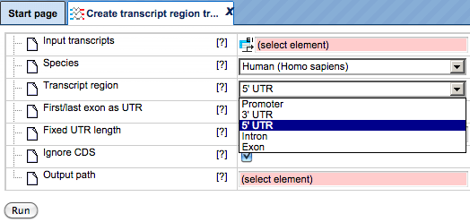
 
As soon as you have chosen a transcript region from the drop-down menu, the following input fields are adjusted. If Promoter is selected as the transcript region, the input form becomes the following:

![][input_form_01]

[input_form_01]:media/6a7d701940cc104fbde69c8526e1311e.png

**Promoter start** – You should specify the first base of the promoter relative to the TSS.

**Promoter end** – Here you should specify the last base of the promoter relative to the TSS.

If 3’ UTR or 5’ UTR are selected as the transcript region, the input form looks as follows.

![][input_form_02]

[input_form_02]:media/317c35b68eb912d09a09835de83e9063.png

*First/last exon as UTR* - This check box can be used to select the first or last exon as UTR if it is not defined in the input transcript. By default this box is unchecked.

*Fixed UTR length* – The column can be used to create UTRs of fixed length. By default the method uses 300bp as the track length. Please note that actual UTRs can be very long.

*Ignore CDS information* – This box is checked to ignore CDS information and create fixed length UTRs. By default this box is checked.

*Output path* - Specify the path to store the result and indicate the name of the output track or sequences.

If Exon or Intron are selected as the transcript region, the input form is adjusted as follows:

![][input_form_03]

[input_form_03]: media/93743502c91d37d5d7ff0d04fe34b797.png

*Exon/Intron number* - This field becomes active when you select Intron or Exon as the transcript region. You should specify 1, 2 … for first, second, … exon/intron, or -1, -2, … for last, second last, … exon/intron.

**Output path** - Specify the path to store the result and indicate the name of the output track or sequences.

Below it is shown how to create a track with *intron* transcript regions starting from the input transcripts. The [**input**] is a table with Ensemble transcripts. As shown below the input is selected and 'intron' is selected as the transcript region. With other parameters as default, press 'Run'

[**input**]: https://platform.genexplain.com/bioumlweb/#de=data/Examples/User%20Guide/Data/Examples%20of%20methods/Data%20manipulation/Ensembl%20transcripts

After the run is completed, the [output_transcript_track] is opened automatically in the work space as shown below:

[output_transcript_track]: https://platform.genexplain.com/bioumlweb/#de=data/Examples/User%20Guide/Data/Examples%20of%20methods/Data%20manipulation/Ensembl%20transcripts%20transcript%20region

You can select the sequence (chromosome) number from the drop-down arrow menu and view the corresponding track file.
The resulting tracks file can be used as input for various other workflows, for example to search for TF binding sites, enriched motifs and composite modules, and others.

### Filter duplicate rows
The analysis method [Filter duplicate rows] can be found in the tree area, on the Analyses tab in the folder Methods, subfolder Data manipulation.

[Filter duplicate rows]:https://platform.genexplain.com/bioumlweb/#de=analyses/Methods/Data%20manipulation/Filter%20duplicate%20rows

This method filters duplicate rows from the input table and gives a non-redundant output. The rows which have same score value are removed from the output table.
Input mask of the tool is as shown below:
![][Filter_duplicate_01]

[Filter_duplicate_01]: images/Filter_duplicate_rows.PNG

parameters are described as follows:
**Input table**: Input the table to filter duplicate rows
**Primary column** – Select the column which have duplicate entries 
**score column** – Selection of this column is optional. It is used to select row among duplicates
**Output table** – The path and name of the filtered output table 

For demonstration consider an [input regulator table] with duplicate rank sum values. To remove rows with all duplicate values, you can select the respective duplicate row in the input form and press 'run' as shown below:

[input regulator table]: https://platform.genexplain.com/bioumlweb/#de=data/Examples/User%20Guide/Data/Examples%20of%20methods/Data%20manipulation/Filter_duplicate_rows_input

[Filtered output table] is opened by default in the workspace.

[Filtered output table]: https://platform.genexplain.com/bioumlweb/#de=data/Examples/User%20Guide/Data/Examples%20of%20methods/Data%20manipulation/Filter_duplicate_rows_input%20no%20dup

### Filter one track by another
The analysis method [Filter one track by another] can be found in the tree area, on the Analyses tab in the folder Methods, subfolder Data manipulation.

[Filter one track by another]: https://platform.genexplain.com/bioumlweb/#de=analyses/Methods/Data%20manipulation/Filter%20one%20track%20by%20another
This analysis filters out those sites which are present or absent in another track. The input form is shown below:

![][Filter_track_input]

[Filter_track_input]: images/Filter_one_track_01.PNG

Parameters:
**Input track** – Input the track which you want to filter
**Filter track** – Input the Track which you want to use as a filter
**Max distance** – Maximal difference between site starts and ends to consider sites equal, by default the value assigned is 0
**Fields to compare** – Select the fields which you want to compare and filter.  aside from sites position and strand
**Filtering mode** – Specify how to perform the filtering by selecting from the three options, Intersect -> select this option if you want to 
Intersect (leave both sites)
Subtract
**Output track** – Specify the path and name of the output filtered track.
For demonstration we use two test tracks as input
[Test_track_1] and [Test_track_2]

[Test_track_1]:https://platform.genexplain.com/bioumlweb/#de=data/Examples/User%20Guide/Data/Examples%20of%20methods/Data%20manipulation/Test_track_1
[Test_track_2]: https://platform.genexplain.com/bioumlweb/#de=data/Examples/User%20Guide/Data/Examples%20of%20methods/Data%20manipulation/Test_track_2

keeping all other parameters as default, different filtering modes were selected as shown below:
![][Filter_one_track_02]

[Filter_one_track_02]: images/Filter_one_track_02.PNG

Filtering mode 'intersect' gives an [output_track_01] with only common sites between the two tracks. Filtering mode'intersect (leave both sites)' gives an [output_track_02] that leaves all sites from both tracks  which are not in the same position. Filtering mode 'subtract' gives an [output_track_03] with only Track 01 unique sites. All the filtered tracks can be visualized in the genome browser. 

[output_track_01]: https://platform.genexplain.com/bioumlweb/#de=data/Examples/User%20Guide/Data/Examples%20of%20methods/Data%20manipulation/Test_track_1%20filtered_intersect

[output_track_02]: https://platform.genexplain.com/bioumlweb/#de=data/Examples/User%20Guide/Data/Examples%20of%20methods/Data%20manipulation/Test_track_1%20filtered_intersect_leave_both_sites

[output_track_03]: https://platform.genexplain.com/bioumlweb/#de=data/Examples/User%20Guide/Data/Examples%20of%20methods/Data%20manipulation/Test_track_1%20filtered_subtract

### Filter table
The analysis method [Filter table] can be found in the tree area, on the Analyses tab in the folder Methods, subfolder Data manipulation.

[Filter table]: https://platform.genexplain.com/bioumlweb/#de=analyses/Methods/Data%20manipulation/Filter%20table

This analysis filters a table (that is, to remove rows which don't fulfill given condition). It doesn't modify the original table. The analysis is functionally equivalent to the 'Filters' tab which you can find under the opened table document.
Input form looks as shown below:

![Filter table][Filter_table_01]

[Filter_table_01]: images/Filter_table_01.PNG

**Parameters**:
**Input table** – Table to filter
**Filtering expression** – Expression must be written in JavaScript language to sort out filtered and non-filtered rows. Inside it you may use column names and various operations supported by JavaScript. Note that non-alphanumeric symbols in column names should be replaced with underscores ('_'). To determine exactly how to refer to columns in your table, you may open the table as the document, select 'Filters' tab below and check 'Columns' list. Alternatively you may use $ object to access columns by original name. For example, if you have the column named "Fold change", you may refer to it either as Fold_change or as $["Fold change"]. Some of useful JavaScript operations are listed below:

== – check equality (don't mix with single '=').
!= – check inequality. 
>; <; >=; <=; greater than, lesser than, greater or equal, lesser or equal.
+; −; *; / – standard math operations.
&&; || – logical 'and' and 'or' operations.
Math.sqrt(x); Math.sin(x); Math.pow(x,y); etc. – math functions.
Math.min(x,y); Math.max(x,y) – minimal and maximal value of two arguments.
Simple condition example (select all rows where value in column Log(Fold Change) is greater than 2):
Log_Fold_Change_ > 2
Complex condition example (select all rows where either Score1 or Score2 has absolute value more than 10 and non-empty GeneSymbol):
Math.max(Math.abs(Score1),Math.abs(Score2)) > 10 && GeneSymbol != ""

**Filtering mode** – Select the options to specify how to perform the filtering

**Output table** – Select the Path and name of the output filtered table

here we consider upregulated genes as an input table for demonstration [input_filter_table]. We want to filter all genes with logfoldchange>1

[input_filter_table]: https://platform.genexplain.com/bioumlweb/#de=data/Examples/User%20Guide/Data/Examples%20of%20methods/Data%20manipulation/Upregulated%20Ensembl%20genes

Filtering expression is written as LogFoldChange > 1 as shown below, keeping all other conditions as default, press 'Run'

[Output_filtered_table] is opened automatically after the method run completes.

[Output_filtered_table]: https://platform.genexplain.com/bioumlweb/#de=data/Examples/User%20Guide/Data/Examples%20of%20methods/Data%20manipulation/Upregulated%20Ensembl%20genes%20filtered

### Filter track by condition
The analysis method [Filter track by condition] can be found in the tree area, on the Analyses tab in the folder Methods, subfolder Data manipulation. This analysis leaves only those sites which satisfy a given JavaScript condition. Each site from the track is tested against the condition.

[Filter track by condition]: https://platform.genexplain.com/bioumlweb/#de=analyses/Methods/Data%20manipulation/Filter%20track%20by%20condition

Input form is as shown below:
![][Filter_track_condition]

[Filter_track_condition]: images/Filter_track_condition_01.PNG

Parameters:
**Input track** – track you want to filter
**Condition** – JavaScript expression which must return true if condition passed or false otherwise. The following variables are available:
seq – sequence or chromosome name,
from – site start position,
to – site end position,
length – site length,
strand – site strand (0 = unknown, 1 = n/a, 2 = +, 3 = −, 4 = both),
type – site type,
properties – additional track-specific properties
**Output track** – specify the path where to store the result
Here we consider an example input track [filter track by condition input] for demonstration and filter it to get all sites on Chromosome 1

[filter track by condition input]: https://platform.genexplain.com/bioumlweb/#de=data/Examples/User%20Guide/Data/Examples%20of%20methods/Data%20manipulation/GSM3999730_H1hESC_SMAD1_untreated_ChIP_peaks

Condition is specified as seq==1

After specifying the output path when we press 'run' the [output_filtered_track] opens automatically. The track when opened as a table is shown below, the output track now contains all sites only for chromosome 1

[output_filtered_track]: https://platform.genexplain.com/bioumlweb/#de=data/Examples/User%20Guide/Data/Examples%20of%20methods/Data%20manipulation/GSM3999730_H1hESC_SMAD1_untreated_ChIP_peaks%20filtered

### Gene set to track

The method *Gene set to track* () aims at creating a track corresponding to any table with Ensembl gene IDs. As with the fragments of the output track, this method takes the gene regions
around TSS (transcription start sites). It is a useful method to create a track
of gene promoters or upstream regions for any input gene table. The input form
is shown below:

**Input table**. Specify the input table with Ensembl gene IDs. If your table
has different IDs, you need to convert it first. You can drag & drop the table
from your project within the tree area. Alternatively, you may click on the pink
field *select element* and a new window will be opened, where you can select the
table. Here, we take a list of Ensembl genes as [Input]

[Input]: https://platform.genexplain.com/bioumlweb/#de=data/Examples/User%20Guide/Data/Examples%20of%20methods/Data%20manipulation/Upregulated%20Ensembl%20genes%20filtered%20(logFC%3E1)

You can see Ensembl gene IDs in the column **ID**. Such a table may contain any
number of additional columns. Here, three additional columns are present, **Gene
description**, **Gene symbol** and **Affymetrix ID**.

**Species**. After input of the table, the species (human, mouse or rat) is
adjusted automatically. Verify the species shown in the species field.

**From** and **To**. By default this method considers the following regions
around the TSS of the input genes: 1000 bp in 5’ direction and 100 bp in 3’
direction.

**Output track**. Specify the path and name to store the output track.

Having filled in the input form, launch the analysis with the [Run] button. Wait
till the analysis is completed. The resulting [output_geneset_track] is automatically opened in
genome browser in your work space.

[output_geneset_track]: https://platform.genexplain.com/bioumlweb/#de=data/Examples/User%20Guide/Data/Examples%20of%20methods/Data%20manipulation/Upregulated%20Ensembl%20genes%20filtered%20(logFC%3E1)%20track

The [output_geneset_track] when opened as a table  contains exactly the same number of the fragments (rows) as the number of Ensembl genes in the input table. There are columns for **chromosome**, positions **From** and **To**, **Length**, **Strand**, and **Type**. The type of the fragments after this conversion is automatically assigned as *misc_feature*. Other columns present in the input table are all added on the right side of this table, e.g. here **Affymetrix ID** column.

### Group table rows
The analysis method [Group table rows] can be found in the tree area, on the Analyses tab in the folder Methods, subfolder Data manipulation. This method helps to group selected rows from the input table. Output will contain a table with the number of counts of the identical rows in a specified column.

[Group table rows]: https://platform.genexplain.com/bioumlweb/#de=analyses/Methods/Data%20manipulation/Group%20table%20rows
Input form is as shown below:
![Group table rows][Group_table_rows_01]

[Group_table_rows_01]: images/Group_table_rows_01.PNG
**Parameters:**
**Input table** – Select the Input table with duplicate rows
**Group column** – Select the column in the row, Rows will be grouped by this column
**Output table** – Select the path and name of the Output table

For demonstration a gene table is used as [Input_Group_table_Rows] for this method. The group column selected is -log(P-value). The [Output_grouped_table] opens by automatically as soon as the analyses complete. The table gives the 'count' of the selected group column, in this case -log(P-value)

[Input_Group_table_Rows]: https://platform.genexplain.com/bioumlweb/#de=data/Examples/User%20Guide/Data/Examples%20of%20methods/Data%20manipulation/Genes%2C%20fold%20change%20and%20p-value%2C%20non-filtered
[Output_grouped_table]:
https://platform.genexplain.com/bioumlweb/#de=data/Examples/User%20Guide/Data/Examples%20of%20methods/Data%20manipulation/Genes%2C%20fold%20change%20and%20p-value%2C%20non-filtered%20grouped

### Intersect table
The analysis method [Intersect tables] () can be found in the Tree Area, under the Analyses tab in the folder *Methods*, subfolder *Data manipulation*. 

[Intersect tables]: https://platform.genexplain.com/bioumlweb/#de=analyses/Methods/Data%20manipulation/Intersect%20tables

This function allows for the identification of common rows between two tables. The intersection is performed according to IDs matching from "left" table to "right". The result is a single table that contains rows common for both input tables.

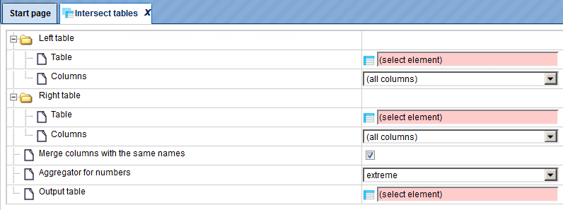

In the following, we will consider the input fields one by one:

Left Table – left (first table) for intersection.

Right Table – right (second table) for intersection.

Aggregator for numbers (expert) – Function to be used for numerical columns when
several rows are merged into a single one if merge columns option is selected.

Output table - Name of the table where the results will be saved. If a table with that name already exists it will be replaced.

Let us consider two input tables [Table_1] and [Table_2] which need to be intersected. Input the two tables as Left and Right table respectively, keeping all other parameters as deafult, press 'Run'

[Table_1]: https://platform.genexplain.com/bioumlweb/#de=data/Examples/User%20Guide/Data/Examples%20of%20methods/Data%20manipulation/Gene_table_1%20subset

[Table_2]: https://platform.genexplain.com/bioumlweb/#de=data/Examples/User%20Guide/Data/Examples%20of%20methods/Data%20manipulation/Gene_table_2

[Intersect_Output_table] is opened by default which contains genes which are common to both the tables. 

[Intersect_Output_table]: 
https://platform.genexplain.com/bioumlweb/#de=data/Examples/User%20Guide/Data/Examples%20of%20methods/Data%20manipulation/Joined

### Intersect Tracks
The analysis method [Intersect tracks]  can be found in the Tree Area, under the Analyses tab in the folder *Methods*, subfolder *Data manipulation*

[Intersect tracks]: https://platform.genexplain.com/bioumlweb/#de=analyses/Methods/Data%20manipulation/Intersect%20tracks

Track intersection provides two types of operations whose results are either the intersection itself or the difference of two tracks. In the first case, the output track consists of intervals two tracks have in common (which overlap). In the second, the output contains those intervals uniquely found in the input track.

This analysis can be used, for instance, to filter predicted binding sites for conserved regions.

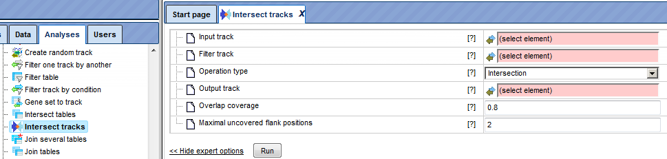

The parameters can be described as follows: 

*Input track:* The input track contains the intervals which will be available in or omitted from the output track if they overlap with intervals of the filter track.

*Filter track:* The filter track contains the intervals against which input intervals are tested for overlap.

*Operation type:* Here one can select the desired input intervals, intersection or difference.
intersection consists of intervals two tracks have in common (which overlap), whereas difference contains those intervals uniquely found in the input track.

*Output track:* The output track will contain the input intervals contained in the intersection of difference set.

*Overlap coverage:* The overlap coverage is the relative proportion of an input interval that needs to overlap with a filter interval.

Maximal uncovered flank positions: This parameter limits the number uncovered positions (sometimes called "overhanging ends"). Note that this limit is applied to each side of an input interval, not to the total number of uncovered end positions.

Let us consider [sample_track_1] and [Sample_track_2] as inputs for the method, input the tracks in the input form as 'input track' and 'Filter track' respectively. 
First, we consider the operation type as intersection, keeping all other parameters as default, press 'Run'. [Output_intersected_track] is opened in the genome browser by default. As shown below, it contains only the common elements from both the tracks.

[sample_track_1]: https://platform.genexplain.com/bioumlweb/#de=data/Examples/User%20Guide/Data/Examples%20of%20methods/Data%20manipulation/Test_track_3
[Sample_track_2]: https://platform.genexplain.com/bioumlweb/#de=data/Examples/User%20Guide/Data/Examples%20of%20methods/Data%20manipulation/Test_track_2
[Output_intersected_track]: https://platform.genexplain.com/bioumlweb/#de=data/Examples/User%20Guide/Data/Examples%20of%20methods/Data%20manipulation/Test_track_3%20filtered

Using the same inputs, we now select the operation type as 'difference', [Output intersected track with difference] contains only the unique elements of the input track and removes the common elements of the filtered track as output. 

[Output intersected track with difference]:https://platform.genexplain.com/bioumlweb/#de=data/Examples/User%20Guide/Data/Examples%20of%20methods/Data%20manipulation/Test_track_3_difference

### Join tables
The analysis method [Join tables] () can be found in the Tree Area under the Analyses tab in the folder *Methods*, subfolder *Data manipulation*. 

[Join tables]: https://platform.genexplain.com/bioumlweb/\#de=analyses/Methods/Data%20manipulation/Join%20tables

Applying the *Join table* method, you can join two tables together in one new table containing selected columns. Joining is performed according to ID matching from left and right tables. The result table will contain IDs present in at least one table.

The input form of this method, when opened in the work space, is shown below:

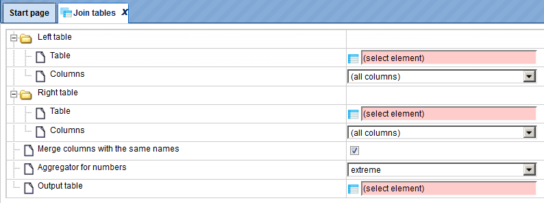

In the following, we will consider the input fields one by one:

Left Table – left (first table) for join.

Right Table – right (second table) for join.

Aggregator for numbers (expert) – Function to be used for numerical columns when
several rows are merged into a single one, if the merge columns option is
selected.

Output table - Name of the table where results will be saved. If a table with that name already exists it will be replaced.

for example, we consider two tables as input for the explanation of the method:
[Join table input 1] and [Join table input 2], considering all other parameters as default press 'Run'.

[Output joined table] opens by default and includes the rows from both the tables.

[Join table input 1]: https://platform.genexplain.com/bioumlweb/#de=data/Examples/User%20Guide/Data/Input%20for%20examples/Transcription%20factors%20Ensembl%20genes
[Join table input 2]: https://platform.genexplain.com/bioumlweb/#de=data/Examples/User%20Guide/Data/Input%20for%20examples/Transcription%20factors%20Ensembl%20genes_1
[Output joined table]: https://platform.genexplain.com/bioumlweb/#de=data/Examples/User%20Guide/Data/Input%20for%20examples/Joined
If you like to join more than two tables, please see method [Join several tables] and [Join full tables]

[Join several tables]: https://platform.genexplain.com/bioumlweb/#de=analyses/Methods/Data%20manipulation/Join%20several%20tables
[Join full tables]: https://platform.genexplain.com/bioumlweb/#de=analyses/Methods/Data%20manipulation/Join%20full%20tables

### Join Tracks
The analysis method [Join Tracks] can be found in the Tree Area under the Analyses tab in the folder *Methods*, subfolder *Data manipulation*. 

[Join Tracks]: https://platform.genexplain.com/bioumlweb/#de=analyses/Methods/Data%20manipulation/Join%20tracks
The method Join several tracks into one. All sites from input tracks will be simply added to the output.

Input form is as shown below:

As input we can add as many tracks as needed, and output will be a single track with all sites added. For demonstation we consider [Test_track_1] and [Test_track_2] as inputs, when we press'Run' [output joined track] opens by default in the genome browser and contains all sites from the input tracks. In this case Test_track_1 have 7 sites and Test_track_2 have 8 sites and the output joined track have a total of 15 sites. The common sites are also displayed twice and not filtered. 

[output joined track]: https://platform.genexplain.com/bioumlweb/#de=data/Examples/User%20Guide/Data/Examples%20of%20methods/Data%20manipulation/output%20joined%20track

### Matrices to molecules
The analysis method [Matrices to molecules]  can be found in the Tree Area under the Analyses tab in the folder *Methods*, subfolder *Data manipulation*. 

[Matrices to molecules]: https://platform.genexplain.com/bioumlweb/#de=analyses/Methods/Data%20manipulation/Matrices%20to%20molecules

This analysis is designed to convert site model IDs (e.g. matrices) into transcription factors.

As input, any table with site model IDs (e.g. matrices) can be taken. Such tables may result from several analyses including "Site search on gene set" and "Site search on track".

For this conversion, the links between transcription factors and matrices, as they are curated in the corresponding database, are used. The database is selected based on the profile you choose. Currently you can choose either TRANSFAC or GTRD profiles. Output from "Matrices to molecules" is a list of transcription factors as a gene set. Type of identifiers for the resulting table can be selected in the field "Output type". Table of transcription factors resulting from this analysis can be used as input for other analyses, for example, as input for master regulator search.

Input form is as shown below:

Input Parameters are described below: 
*Sites table* – Select table with the results of "Site search on gene set". Such table contains site model ID in each row.
*Profile* – Select the profile that was used for site search. In most of the cases, profile is selected automatically.
*Species* – Select arabidopsis, nematoda, zebrafish, fruit fly, human, mouse, rat, baker's yeast or fission yeast species
*Output type* – Select type of identifiers for the resulting table
*Ignore empty values* – Ignore empty values during aggregator work
*Numerical value treatment rule* – Select one of the rules to treat values in the numerical columns of the table when several rows are merged into a single one.
In cases of "average", "average w/o 20% outliers" and "sum", the selected rule is applied to all numerical columns of the table. In cases of "minimum", "maximum" and "extreme" a new option appears bellow which request user to select a "Leading column". The chosen rule is applied then to the values in the selected Leading column (e.g. in the Leading column the maximum value is computed among all the merged rows). All other numerical values of the table will be taken from that row which corresponds to the selected value in the leading column.
Leading column – Select the column with numerical values to apply one of the rules described above

*Output table* – Path to store the resulting table in the tree

Example: As shown below select the [input sites table] and [vert_non_minsum] Transfac profile in the input form, Select 'Proteins:Uniprot' as output type, and keeping all other parameters as default, press 'Run'

[input sites table]: https://platform.genexplain.com/bioumlweb/#de=data/Examples/User%20Guide/Data/Examples%20of%20methods/Data%20manipulation/summary
[vert_non_minsum]: https://platform.genexplain.com/bioumlweb/#de=databases/TRANSFAC(R)%202021.1/Data/profiles/vertebrate_non_redundant_minSUM

[Output_transcription_factor_table] opens by default on completion of the method run.Method converted the list of matrices to transcription factors with Uniprot ID, since we seleccted Uniprot as an output type as shown below:

[Output_transcription_factor_table]: https://platform.genexplain.com/bioumlweb/#de=data/Examples/User%20Guide/Data/Examples%20of%20methods/Data%20manipulation/summary%20TFs%20Proteins%20UniProt

### Merge table columns
The analysis method [Merge table columns] can be found in the Tree Area under the Analyses tab in the folder Methods, subfolder Data manipulation.

[Merge table columns]: https://platform.genexplain.com/bioumlweb/#de=analyses/Methods/Data%20manipulation/Merge%20table%20columns
The method merge several columns of a table into one column. Input form is as shown below:

Parameters:

Table – Input the Table and select the columns which need to be merged. 
Ignore empty values – Ignore empty values during aggregator work aggregator – aggregator
Merged column name – The name of merged column in output table
Output table – Output table

### Mutations to genes with weights
The analysis method [Mutations to genes with weights] can be found in the Tree Area under the Analyses tab in the folder Methods, subfolder Data manipulation.
The method convert mutations to genes and calculates specific mutation weight (w) for each variation depending on it’s location in gene body and gene flanking regions (5' region size upstream and 3' region size downstream of the gene body).

w = 0.7 for variations in exon area
w = 1.3 for variations in promoter region (-1000bp upstream and 100bp downstream of TSS),
w = 1.0 for variations in other locations.

The input form is as shown below:

we discuss the input parameters one by one

Input track – Input the track with mutations
Species – Select the species to which analysis should be confined 
5' region size – Define the size of the 5' region (promoter) which should be included in the analysis, by default it is set as -1000 bp
3' region size – Define the size of the 3' region (promoter) which should be included in the analysis, by default it is set as 1000 bp
Promoter from – Define the distance of the promoter from the TSS,
Promoter to – Define the distance of the promoter to the TSS
Types of resulting column – Select the types of resulting columns required in the output file
Output track – Enter the output track with mutations and weight column
Output table – Enter the output table with genes mapped from mutations

for explanation, we consider the an [input_vcf_track] with mutations, We selected type of resulting columns as 'Structures' and 'count' and kept all other parameters as default.

Output track and [Output table with genes mapped from mutations] is opened by default in the work space. 

The output table can be used as an input for the method calculate weighted mutation score.

[input_vcf_track]: https://platform.genexplain.com/bioumlweb/#de=data/Examples/User%20Guide/Data/Examples%20of%20methods/Data%20manipulation/CRC_variants%20filtered

[Output table with genes mapped from mutations]: 
https://platform.genexplain.com/bioumlweb/#de=data/Examples/User%20Guide/Data/Examples%20of%20methods/Data%20manipulation/mutation_gene_table

### PSD pharmaceutical compounds analysis
The analysis method [PSD pharmaceutical compounds analysis] can be found in the Tree Area, under the Analyses tab in the folder Methods, subfolder Data manipulation.

This method seeks for the optimal combination of molecular targets among input genes that potentially interact with pharmaceutical compounds from a library of known drugs, using information from HumanPSD™ database.

Input form is as shown below:

**Parameters** are explained as below:
*Genes table* – Input the path to table with genes
*Weight column (expert)* – Genes' weight column name
*Weight as rank (expert)* – Use weight column as rank column
*Diseases names* – Input the names of the diseases for which we intend to analyze the input.
*False positive target weight (expert)* – Weight of false positive targets in target activity score formula. False positive targets are known targets of the drug that are not included in input targets list. By default the value is set to 1.0
*Output table with structures* – Output table with structures
*Output table with targets* – Output table with targets

We consider an [Input table for PSD pharmaceutical compound] analysis, the table is a result from colorectal neoplasms analysis. As shown below the input parameters were entered with total rank as weight column and False positive target rate as 0.3

Method is executed when we press 'run' and output table with structure and targets is opened by default. 

Output table : Need explanation from Daria

[PSD pharmaceutical compounds analysis]: https://platform.genexplain.com/bioumlweb/#de=analyses/Methods/Data%20manipulation/PSD%20pharmaceutical%20compounds%20analysis

[Input table for PSD pharmaceutical compound]:
https://platform.genexplain.com/bioumlweb/#de=data/Examples/User%20Guide/Data/Examples%20of%20methods/Data%20manipulation/PSD_pharmaceutical_input

### Plot bar chart
The analysis method [Plot bar chart] can be found in the Tree Area, under the Analyses tab in the folder Methods, subfolder Data manipulation.

It creates a bar chart from the data values of the input table. Input form is as shown below:

[Plot bar chart]: https://platform.genexplain.com/bioumlweb/#de=analyses/Methods/Data%20manipulation/Plot%20bar%20chart

**Parameters**:
*Input table* – Enter the Input table with data values to plot the bar chart. 
*Category column* – Category column is the column which is selected to be the 'y' axis of the graph from the input table
*Labels column* – Labels column is the column which is selected to be the 'x' axis of the graph from the input table
Max pieces – Enter the maximum pieces of the bars, by default the value is set as 10
Add remaining elements as one category – check this box if all elements should be compiled in one category, by default this is unchecked
Color palette – select the color palette which should be used to draw the graphs
Use selected columns as axis labels – Use selected columns as axis labels
Category axis label (x-axis) – This parameter is auto-selected from the labels column
Values axis label (y-axis) – This parameter is auto-selected from the Category column
Output chart – Enter the name and path of the output chart

For example we consider the [functional classification output table] as input for the method plot bar chart

[functional classification output table]: https://platform.genexplain.com/bioumlweb/#de=data/Examples/User%20Guide/Data/Examples%20of%20methods/Data%20manipulation/Functional_classification_diseases

as shown below, the input parameters are filled and bar graph is plotted between Number of hits and title with max pieces defined as 15

[Output bar graph] is opened by default in the work space

[Output bar graph]: https://platform.genexplain.com/bioumlweb/#de=data/Examples/User%20Guide/Data/Examples%20of%20methods/Data%20manipulation/Plot%20bar%20chart

### Plot pie chart
The analysis method [Plot pie chart] can be found in the Tree Area, under the Analyses tab in the folder Methods, subfolder Data manipulation.

[Plot pie chart]: https://platform.genexplain.com/bioumlweb/#de=analyses/Methods/Data%20manipulation/Plot%20pie%20chart

It creates a pie chart from the data values of the input table. Input form is as shown below:

**Parameters**:
*Input table* – Enter the Input table with data values to plot the pie chart. 
*Category column* – Category column is the column which should be selected to illustrate numerical proportion from the input table
*Labels column* – Labels column is the column which is selected to be name of the sliced propotion from the input table
Max pieces – Enter the maximum pieces of the bars, by default the value is set as 10
Add remaining elements as one category – check this box if all elements should be compiled in one category, by default this is unchecked
Color palette – select the color palette which should be used to draw the graphs
Use selected columns as axis labels – Use selected columns as axis labels
Category axis label (x-axis) – This parameter is auto-selected from the labels column
Values axis label (y-axis) – This parameter is auto-selected from the Category column
Output chart – Enter the name and path of the output chart

For example we consider the [functional classification output table] as input for the method plot bar chart

[functional classification output table]: https://platform.genexplain.com/bioumlweb/#de=data/Examples/User%20Guide/Data/Examples%20of%20methods/Data%20manipulation/Functional_classification_pathways

as shown below, the input parameters are filled and bar graph is plotted between Number of hits and title with max pieces defined as 15

[Output pie_chart] is opened by default in the work space

[Output pie_chart]: https://platform.genexplain.com/bioumlweb/#de=data/Examples/User%20Guide/Data/Examples%20of%20methods/Data%20manipulation/pie_chart

### Process track with sites
The analysis method [Process track with sites] can be found in the Tree Area, under the Analyses tab in the folder Methods, subfolder Data manipulation

In general, a track is a set of intervals where positions are specified that we can map on a chromosome. These track files can be visualized in a genome browser and can be used as input for various site analysis functions.

The geneXplain platform provides you with an option to modify these track files. Process track with Sites method enables the user to enlarge/shrink sites on the track, merge overlapping sites or remove too short sites. For example an already saved track in the repository can be processed by adding sequences from Ensembl or some other database.

[Process track with Sites]: https://platform.genexplain.com/bioumlweb/#de=analyses/Methods/Data%20manipulation/Process%20track%20with%20sites

The initial form of this analysis looks as shown below:

**Source track:** Track you want to process  
**Sequences:** Sequences to use  
**Enlarge sites at start:** Use positive numbers to enlarge and negative to shrink  
**Enlarge sites at end:** Use positive numbers to enlarge and negative to shrink  
**Merge overlapping:** Checking this box merges overlapping sites into a single
site. Site annotations will be lost!  
**Remove small sites:** If checked, sites smaller then Minimal site size will be
removed, otherwise they will be expanded to Minimal site size  
**Minimal site size:** Sites shorter than the specified size will be removed from
output  
**Output track:** You should specify the path for the processed track here.

An [example source track file] saved in the repository to which you want to add
sequences may look like this:

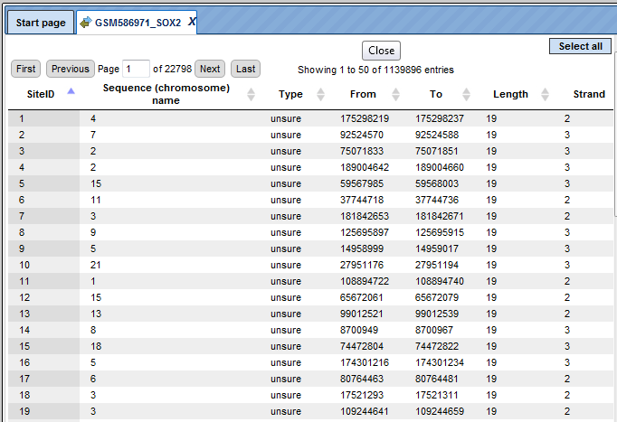

The track file shown provides you with the positions of promoter areas selected for analysis, as shown in columns From and To. The column Strand shows the strand of the chromosome where these promoters are located, where 1 means strand not applicable, 2 means forward strand, 3 means reverse strand, 4 means both strands. This file can be dragged and dropped on a particular chromosome opened in the genome browser to visualize its positions.

This Source track file can be selected as an input to “Process track with Sites”. Selected all sequences from chromosome GRCh37 from the Ensembl database and Using default conditions for the other parameters you can now press [Run].

The [output processed track] looks like shown below:

For comparison of the results you can click on individual chromosome sequences
from both the original track and the Processed track from the Tree Area as shown
below:

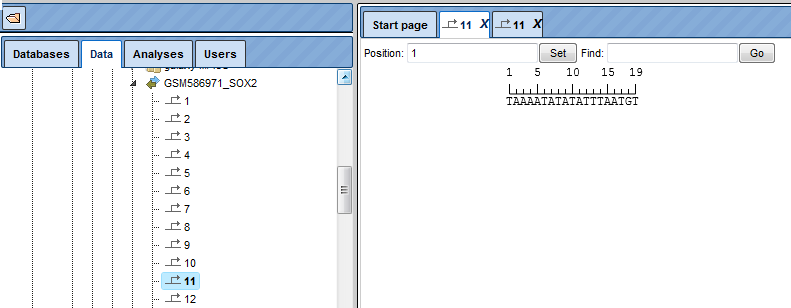

The detailed view of the processed track is as shown below:

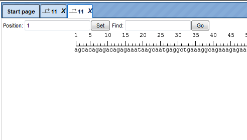

100bp are added to both the sides and thus from original 19bp track, you now
have a track with 219bp. This processed track can be used further for other site
analysis functions.

[example source track file]: https://platform.genexplain.com/bioumlweb/#de=data/Examples/User%20Guide/Data/Examples%20of%20methods/Data%20manipulation/GSE23795_RAW/GSM586971_SOX2
[output processed track]:
https://platform.genexplain.com/bioumlweb/#de=data/Examples/User%20Guide/Data/Examples%20of%20methods/Data%20manipulation/GSM586971_SOX2%20processed

### Remove overlapping sites

Mmethod [Remove overlapping sites] removes overlapping sites from any track and constructs a subset of the input track with no sites overlap in the output track. It can be found under the tab *Analyses*, in the folder Methods/Data manipulation/Remove overlappingsites. Here the default input form is shown:

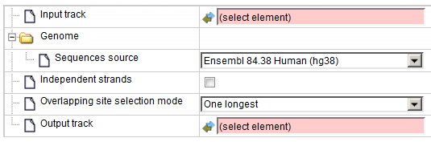

In the following, we will consider the input fields one by one.

**Input track** You can drag & drop the input track from your project within the
tree area. Alternatively, you may click on the pink field “select element” and a
new window will open, where you can select the track.

**Sequence source** Specify the reference genome or select *Custom* to specify the
sequences location manually.

**Independent strands** Select whether you want to handle sites from different
strands independently; by default it is unchecked, and strands are not handled
independently.

**Overlapping site selection mode** Choose one mode from the drop-down menu for the
selection of sites.

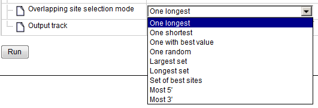

The *One longest*, *One shortest*, *One with best value* and *One random* modes
will select a single site from the set of overlapping sites. Other modes can
select more than one site from the set of overlapping sites, but the resulting
sites will not overlap with each other. The *Largest set* mode constructs a
non-overlapping set of sites with the maximum number of sites. The *Longest set*
mode constructs a non-overlapping set with the largest total length of sites.
The *Set of best sites* mode iteratively selects the best site and removes sites
that overlap with the best site, then selects the best from the remaining sites
and removes those which overlap with the best site, and so on until no sites
remain. The *Most 5’* and *Most 3’* select the site located at the 5’ or 3’ end.

**Output track** Define where the track with the result should be located in your
project tree. You can do so by clicking on the pink box (select element) in the
field, and a new window will open, where you can select the location of the
resulting track and define its name.

Press the [Run] button and wait until the method is completed.

For this example, all further steps are demonstrated using [an input track] :

[an input track]: https://platform.genexplain.com/bioumlweb/#de=data/Examples/User%20Guide/Data/Examples%20of%20methods/Data%20manipulation/example%20overlaps

The track looks as shown below:

We perform several runs with different site selection modes. All different possible output track [Largest_output_track], [Longest_set], [Most 3prime], [Most 5prime], [one longest], [one shortest], [set of best values ] are shown below:

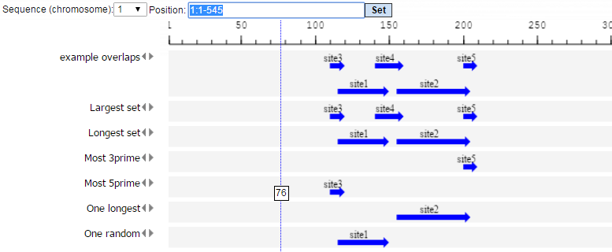

[Remove overlapping sites]: https://platform.genexplain.com/bioumlweb/#de=analyses/Methods/Data%20manipulation/Remove%20overlapping%20sites
[Largest_output_track]: https://platform.genexplain.com/bioumlweb/#de=data/Examples/User%20Guide/Data/Examples%20of%20methods/Data%20manipulation/Overlapping%20sites/Largest%20set
[Longest_set]: https://platform.genexplain.com/bioumlweb/#de=data/Examples/User%20Guide/Data/Examples%20of%20methods/Data%20manipulation/Overlapping%20sites/Longest%20set
[Most 3prime]: https://platform.genexplain.com/bioumlweb/#de=data/Examples/User%20Guide/Data/Examples%20of%20methods/Data%20manipulation/Overlapping%20sites/Most%203prime
[Most 5prime]: https://platform.genexplain.com/bioumlweb/#de=data/Examples/User%20Guide/Data/Examples%20of%20methods/Data%20manipulation/Overlapping%20sites/Most%205prime
[one longest]: https://platform.genexplain.com/bioumlweb/#de=data/Examples/User%20Guide/Data/Examples%20of%20methods/Data%20manipulation/Overlapping%20sites/One%20longest
[one shortest]: https://platform.genexplain.com/bioumlweb/#de=data/Examples/User%20Guide/Data/Examples%20of%20methods/Data%20manipulation/Overlapping%20sites/One%20shortest
[set of best values ]: https://platform.genexplain.com/bioumlweb/#de=data/Examples/User%20Guide/Data/Examples%20of%20methods/Data%20manipulation/Overlapping%20sites/Set%20of%20best%20values

### SNP matching

NGS DNA sequencing is a powerful analytical method to discover novel SNPs and detect known SNPs. The geneXplain platform provides a unique analysis method termed [SNP matching]. Using this method and an SNP table (derived after sequencing) as input, the corresponding SNP loci are mapped to Ensembl genes so that you can get an annotated SNP table as output.

By default the SNP matching tool looks as shown below:

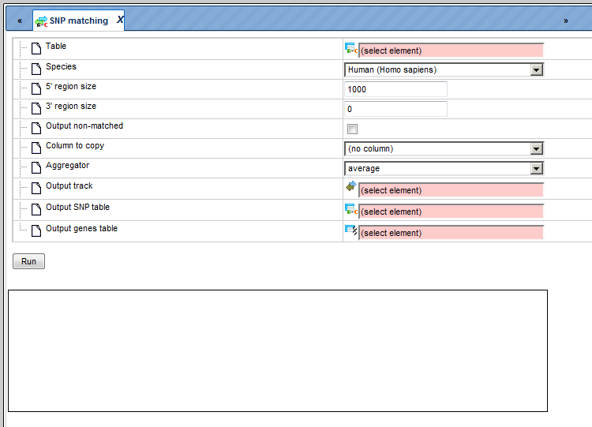

[SNP matching]: https://platform.genexplain.com/bioumlweb/#de=analyses/Methods/Data%20manipulation/SNP%20matching

Example:

An [example data file] to be used as an input table for SNP matching may look like
this:

[example data file]: https://platform.genexplain.com/bioumlweb/#de=data/Examples/User%20Guide/Data/Examples%20of%20methods/Data%20manipulation/SNP_height_hg19

In this table, ID is the SNP identifier, CHR is the chromosome, BETA_stage is some p-value, and POS is the genomic position of a given SNP in hg19 build.

You can save this table in the repository and input the saved table in the SNP matching tool. The tool yields three output files as shown below:

Output table 1 [SNP_height_hg19 annotated]

Output table 2 [SNP_height_hg19 genes]

Output table 3 [SNP_height_track]

The output tables can be further used for any other analysis of the geneXplain
platform.

[SNP_height_hg19 annotated]: https://platform.genexplain.com/bioumlweb/#de=data/Examples/User%20Guide/Data/Examples%20of%20methods/Data%20manipulation/SNP_height_hg19%20annotated

[SNP_height_hg19 genes]: https://platform.genexplain.com/bioumlweb/#de=data/Examples/User%20Guide/Data/Examples%20of%20methods/Data%20manipulation/SNP_height_hg19%20genes

[SNP_height_track]: https://platform.genexplain.com/bioumlweb/#de=data/Examples/User%20Guide/Data/Examples%20of%20methods/Data%20manipulation/SNP_height_hg19%20track

### Track to gene set
The method [Track to gene set] () aims at identifying genes located close to the fragments in the input track.

Genes overlapping with at least one input fragment are considered resulting
target genes. The input form is shown below:

[Track to gene set]: https://platform.genexplain.com/bioumlweb/#de=analyses/Methods/Data%20manipulation/Track%20to%20gene%20set

**Input track**. Specify input track. You can drag & drop it from your project
within the tree area. Alternatively, you may click on the pink field *select
element* and a new window will be opened, where you can select the input track.
With the [track Plus] button (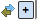)
you can add another track to have several tracks analyzed together.

**Species**. Choose human, mouse or rat species from the drop-down menu.

**5’ region size** and **3’ region size**. By default this method considers the
following regions around Ensembl genes: 1000 bp in 5’ direction from the TSS and
100 bp in 3’ direction from the last exon. The positions of each fragment on the
input track are compared with the positions of the extended gene regions. Genes
overlapping with at least one input fragment are considered resulting target
genes.

**Types of resulting columns**. This analysis specifies the overlap between the
extended gene regions and the fragments; such a specification can be given in
several different waysanda desirable way of representation can be specified in
this field. Let’s consider the options available in the drop-down list:

*+ or -.* This option shows the presence or absence of overlap between any of
the input tracks and the specified gene regions.

*Count*. Returns the number of fragments overlapping with each gene.

*Count in exons, Count in introns, Count in 5’, Count in 3’*. When any of these
options is chosen, the number of fragments overlapping with the corresponding
gene regions is shown for each gene in the resulting table.

*Structure*. This option returns the names of gene regions overlapping with the
fragment(s).

*Positions*. With this option, you can see the position of the 5’ end of the
fragment relative to the TSS of the overlapping gene.

*Schematic*. The gene structure is shown schematically with exons and introns,
and the overlapping fragments are displayed.

The resulting tables with all available types of representation are shown below.

**Output name**. Specify the path and name to store the output table with
Ensembl genes.

Having filled in the input form, launch the analysis with the [Run] button. Wait
till the analysis is completed. The resulting table is opened automatically in
the work space. Let’s consider different variants of the resulting gene tables
depending on the selected option in the input field **Types of resulting
column**.

\+ or -

This option is especially useful when two or more tracks are added as input. In
the resulting table (below) you can see the columns corresponding to each of the
input tracks, here two columns.

Each row corresponds to one gene overlapping with at least one fragment in at
least one of the input tracks. For example, in the table above, the gene SCYL3
is overlapping with at least one fragment in the track *GSM558469_E2F1_hg19
filtered chr 1*, and is not overlapping with any fragment in the track *CEBP in
H1-hESC cells YES*.

Tip If you would like to find overlapping genes for all fragments in the input
track(s), you might be interested in increasing the gene-bound extension regions
on the input form, and run the analysis again.

To learn more details, e.g. how many fragments are overlapping with gene regions
and with exactly which parts of particular genes, you might be interested to
choose other types of the output, as shown below.

**Count**

For each gene, a gene symbol is given, and in the column **Count** you can see a
number of the fragments overlapping with each gene. Here, the sorting is done by
this column.

**Structure**

The column **Structure** contains the names of gene regions overlapping with the
fragment(s). The table can be sorted by this column to get all genes where the
fragments overlap the gene regions in focus.

**Positions**

The column **Positions** presents positions at the 5’ end of the fragment
overlapping with this gene. Positions are shown relative to the TSS of the gene
in each row.

**Schematic**

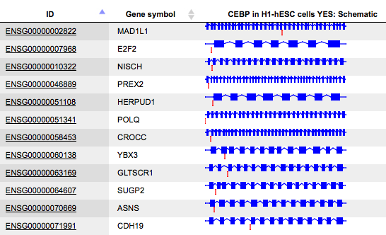

The column **Schematic** presents a gene schema with depicted as blue boxes.
Introns, 5’ regions and 3’ regions are represented by blue lines, and the
fragments on the input track by red short vertical lines. The length of the
introns is calculated in logarithmic scale relative to the length of the exons,
to allow for a reasonable schematic representation.

All Ensembl gene IDs are hyperlinked, and upon click on them the corresponding
Ensembl gene page is opened in a new tab of the browser.
