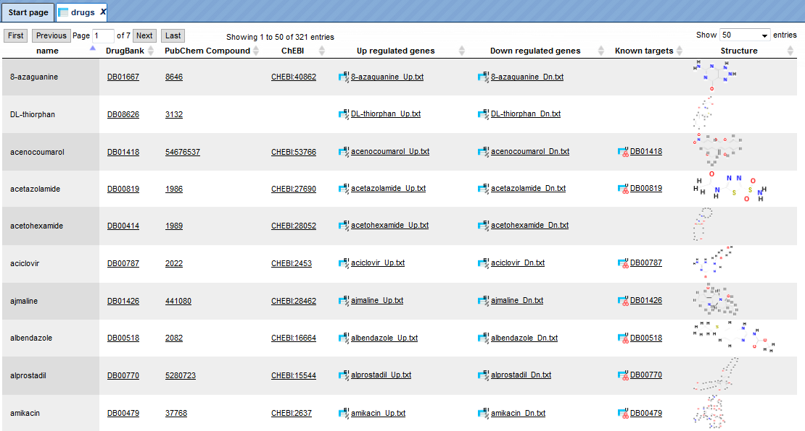

# Working with the different databases

Working with one of the databases listed in the Tree Area involves several,
frequently all four areas of your screen. In this chapter, we will briefly
demonstrate how to operate the individual databases.

## Biomodels

Biomodels is a source of mathematical models suitable for simulating biological
processes. They have been compiled by the BioModels.Net project
(<http://www.biomodels.net/>). These models are stored in the geneXplain
platform as database Biomodels, subdirectory Diagrams, along with their
graphical representations, parameters, simulation default values, etc. The
present version is release 25, comprising 426 curated and 522 non-curated
diagrams

You can access the Biomodels contents by browsing or searching. When you browse
the list of models in the Tree Area (Databases \> Biomodels \> Diagrams), please
note that only 50 of either 421 curated or 433 non-curated diagrams are
displayed at once. Selecting one of the models is by double-clicking on the
respective name.

Searching for a model starts from the Search tab in the Info Box. You may enter,
for instance, *glycolysis* and start the search with the button 

You will get back 75 entries, the contents displayed under the tab Search
result in the Operations Field, the information given being essentially
self-explaining: A short description of the model including references is given.
You may open any model by a click on the corresponding Accession number in the
last column.

Having opened one of the diagrams by either method, the network schema will
appear in the Work Space as well as in the Operations Field, tab Overview. The tab Layout provides a number of
options for changing the layout style of the diagram (see description of the method Diagram layouts); none of these options will change the diagram contents.
Clicking on an individual node will show information about this component and
its role in this model within the Info Box (tab Info).

Many Biomodels have been optimized for dynamic simulation. Open, for instance,
the subdirectory Diagrams and double-click 
*Goldbeter1991_MinMitOscil_ExplInact*. The diagram will open in the Work Space,
the tab Info in the Info Box will show some details about the model, database
links for the individual components. In the Operations Field, under the tab “My
description”, a detailed description of the model is given; it shows the
original reference, its abstract and the PubMed link. Further information about
how the model was constructed is added.

Under the tabs Simulation, you will find the default settings for the
simulation, which can be changed before launching the simulation (). The simulation results will be graphically displayed in a new window, which can be saved as image using the Export button () in the Control Panel . For this, a number of formats are available.

## Biopath

Biopath is a collection of molecular pathways, manually annotated from original
scientific publications and comprising biological models and diagrams. A more
detailed description can be found in the Info Box, tab Info, after clicking on
the term Biopath in the Tree Area, Databases.

User accessible entities are stored in the subdirectory *Diagrams* (presently
571).

This way, you may browse the database contents, receiving information about the
individual entities in the Info Box, after a single click with the left mouse
button on the corresponding entity. The Diagrams can be opened by double-click
with the left mouse button, or by opening a context menu with the right mouse
button and selecting “Open diagram”. These diagrams contain their components
listed underneath as nodes () and edges (![edge.gif] media/9c3855c990a6f0e4e296a150586f0ed9.gif)), for which additional information can be retrieved in the same way as for the
whole diagram. Many of them may be assigned to a hierarchy of compartments ().

If you select the Biopath database for a search, you may enter a gene name into
the field of the Search tab in the Info Box (try, for instance, AKT1). In the
Operations Field, under the tab Search result, you will find the following hit: 

It shows the molecule encoded by the gene AKT1 being involved in the insulin
pathway. The hyperlinked Accession number here opens a pathway diagram from the
Biopath database, which includes insulin and AKT1 as well as the path between
them. The pathway is shown in full in the Work Space; an overview is depicted
under the “Overview” tab of the Operations Field: 

The part of the diagram that is displayed in the Work Space is framed by the
dotted blue line in the Overview, which can be shifted with the mouse, the Work
Space adapting accordingly. You may also shift your mouse pointer over the Work
Space: It turns into a hand, indicating that you can now shift the diagram
section in the display by pressing the left mouse button and moving the mouse
accordingly. The dotted blue rectangle in the “Overview” tab of the Operations
Field will move accordingly.

Information about an individual node can be obtained in the Info Box after
double-click on the corresponding symbol in the Work Space.

In the diagram, green arrows represent conversions, magenta edges catalytic
effects. To facilitate overview in complex diagrams, individual edges are
highlighted in light blue on mouse-over.

## Ensembl

The Ensembl database provides annotation of genes from the Ensembl genome
databases (<http://www.ensembl.org/index.html>). Presently, there are human, mouse and rat Ensembl data included in the
geneXplain platform, separately listed on the Databases tab. The following
versions are provided:

**Human**:

-   Genome build hg38, version 84.38

-   Genome build hg19, version 72.37

-   Genome build hg19, version 65.37

-   Genome build hg18, version 61.37f

**Mouse:**

-   Genome build mm10, version 72.38

-   Genome build mm10, version 84.38

-   Genome build mm9, version 65.37

**Rat:**

-   Genome build rn5, version 71.5

-   Genome build rn4, version 65.34

-   Genome build rn6, version 84.6

In the subdirectories “Sequences/Chromosomes …” the individual chromosomes of
the corresponding genome are stored. A double-click on an individual chromosome
symbol opens the corresponding object with its annotation in the genome browser
of the geneXplain platform. Here, you can move the mouse pointer along the
sequence to select a certain position. With the buttons  and 
 (zoom-out and zoom-in, resp.), you can go up to a level where you have the whole
chromosome displayed or down to a level where you see the individual nucleotides. The most extreme views can also be directly selected with the buttons  (overview) and  (detail; see below). A moderate view is provided as “default” ( ).

At an intermediate resolution of, e.g., human chromosome 1, you see individual
genes highlighted in the Work Space: 

The alignment of genes and other genomic data against a reference genome can be
viewed as data tracks in genome browser. The GeneTrack shows the localization of
primary transcripts including intron/exon structure and direction of
transcription. Scrolling backwards and forward through the genome can be done
using the arrowheads next to the track name, or with the buttons “Page backward”
() and “Page forward”  (), respectively.

Information about individual genes is displayed in the Info Box after clicking
on the respective gene symbol in the Work Space; on the Sites tab of the
Operations Field, a detailed list of all functional sites

The KaryotypeTrack shows on which arm and in which karyotypic band(s) of the
chromosome the present view is located.

RepeatTrack and VariationTrack comprise large numbers of sites scattered all
over the chromosome. In a resolution like the one given above, only summarizing
figures can be given. When zooming in, at a certain level of resolution,
localization of individual repeats and their names will appear, and similarly
sequence variations will show up in the Work Space, and they are listed in the
Operations Field, under the Sites tab. Note that information about individual
sites can be invoked in the Info Box only after a resolution has been adjusted
that allows the display of their names in the Work Space, since the names are
the clickable items.

The color scheme for the display in the Work Space can be changed in the
Operations Field; here, on the Tracks tab, you can adjust the settings of the
genome browser:

Individual tracks can be removed from the display in the Work Space (e.g. by
de-selecting them on this tab). The same way, they can be brought back. Another
possibility is to open the subdirectory Tracks in the Tree Area, where all
available tracks are listed with the symbol

Just drag-and-drop the track of interest to the Work Space will render the
corresponding data amenable to the browser.

The Ensembl database sections are searchable in the same way as described
before: Just click on the name of the respective database in the Tree Area, so
that it receives a light-blue background and its path appears on the Search tab
of the Info Box. Enter your search term, launch the search by pressing  and find your Search results on the respective tab on the Operations Field.
Among the multiple hits, the one with the perfect match will be highlighted in
bold.

## Gene Ontology (GO)

Contents from Gene Ontology are imported into the geneXplain platform and are
updated regularly. The present version is 06.2015. 
GO is searchable in the same way as described before: Just click on the name GO
in the Tree Area, so that it receives a light-blue background and its path
appears on the Search tab of the Info Box. Enter your search term, launch the
search by pressing , and find your Search results on the respective tab on the Operations Field. When clicking on linked descriptions, additional information will appear in the
Info Box, Info tab.

## GeneWays

GeneWays is a database about genes and their functional interactions. The
underlying data (version 7.0) have been retrieved from the original scientific
literature by a sophisticated text mining system applied to more than 360,000
full text papers and of more than eight million publication abstracts [Iossifov
I., Rodriguez-Esteban R., Mayzus I., Millen K.J., and Rzhetsky A. Looking at
cerebellar malformations through text-mined interactomes of mice and humans.
PLoS Comput Biol. 2009, 5:e1000559. PubMed PMID: 19893633].

The directory GeneWays/Data has two subdirectories: Genes and Reactions. When
you click on any gene entry, information about the gene will be retrieved from
the Entrez database. When you click on any reaction entry, you will find
reaction title, links to Entrez for both incoming and outgoing molecules and the
link to the PubMed entries of the corresponding publication in the Info Box.

A single click on the term GeneWays in the Tree Area / Databases suffices to
indicate this data source in the Info Box, tab Search. You can insert your
search term (e.g., a gene symbol) into the field underneath. Clicking on the
icon  launches the search. The search routine scans for exact matches, but use of
wildcards is possible. Thus, searching for elk\* returns results for elk1,
elk2p1, elk3, and elk4. 

The results will be shown in the Operations Field, under the tab Search result.
For instance, when searching in GeneWays for JAG1, the following result table
will be displayed:

The search term is highlighted in bold.

You may recognize that the numbers in the last column (**Accession**) are
hyperlinked. When you click on them, information about the gene will be
retrieved from the Entrez database at NCBI, displayed in a new window or tab,
depending on your browser settings. Rows referring to reactions show a different
type of accession number, they are linked to a PubMed entry of the corresponding
publication.

## Reactome

Reactome is a database that provides information on biological objects such as
proteins, protein complexes, reactions etc. It is an open-source, open access,
manually curated and peer-reviewed pathway database. Pathway annotations are
authored by expert biologists in collaboration with the Reactome editorial
staff, and cross-referenced to many bioinformatics databases. The contents of
Reactome are copyright © 2003-2010 Cold Spring Harbor Laboratory (CSHL), Ontario
Institute for Cancer Research (OICR) and the European Bioinformatics Institute
(EBI).

So far 6387 diagrams have been imported from version 57 of this database into
the geneXplain platform. They can be used as graphical and editable schemata. In
the Tree Area, all components are listed in each diagram subdirectory.

## TRANSPATH®

TRANSPATH® is BIOBASE’s database about signal transduction and metabolic
pathways in human and the most important model organisms, mouse and rat. Its
particular structure, which models signaling components and reactions in
multiple hierarchical ways, makes TRANSPATH® a unique resource for both
encyclopedic and modeling purposes.

Under the geneXplain platform, the TRANSPATH directory contains the following
folders:

-   Data

-   Diagrams

-   Dictionaries

-   Layouts

Under “Data”, browsable lists of objects, like genes and molecules, and of
processes, like reactions and pathways, are stored. As usual, detailed database
contents are displayed in the Info Box upon selecting individual entities from
the lists by mouse click.

As for other databases, the Search tab in the Info Box provides an easy search
function to retrieve individual entities from the resource. The search results
are displayed in the Operations Field, amenable to further activities.

## GTRD

GTRD (Gene Transcription Regulation Database) is a database of weight matrices
to recognize transcription factor binding sites. The GTRD library of weight
matrices consists of new matrices derived from ChIP-seq data by applying our
multiple alignment method IPSmatrix. The IPSmatrix represents a modification of
the previously published alignment method [Ananko E.A. *et al.* Recognition of
interferon-inducible sites, promoters, and enhancers. BMC Bioinformatics 2007,
8:56. PMID: 17309789]. Each individual matrix is derived from an analysis of the
corresponding set of TF-binding regions obtained from a set of raw ChIP-seq
data. It is assumed that:

some TF-binding regions do not contain TF-binding sites; strand orientation and
exact location of TF-binding sites in TF-binding regions are unknown.

The IPSmatrix relies on the Gibbs sampling principle and our conception of the
Individual Probability Score (IPS) where IPS represents the extension of the
common matrix score. In addition to the cores of TF-binding sites, the IPSs take
advantage of nucleotide contents of both flanks of site cores.

When several ChIP-seq datasets are available for a single TF, several matrices
were calculated from which the optimal matrix was selected by comparing the
corresponding Receiver Operator Characteristic (ROC) curves.

In the GTRD directory of the geneXplain platform, the folder “matrices” provides
the list of matrices generated in the way described. You may also wish to
include at this point a matrix collection provided by the UniProbe database.

Under “profiles”, the matrices are stored along with thresholds that are to be
applied when using the matrices for TFBS recognition. All these “profiles” are
grouped according to three different thresholds (strong, moderate and weak).

The directory “tracks” provides ChIP-seq (or ChIP-chip) data, e.g. from GEO
(Gene Expression Omnibus database at NCBI) in a format that renders them
suitable for visualization in the Genome Browser.

Under “views”, available matrices (PWMs), underlying ChIP-seq experiments or the
TFs themselves can be browsed. They are arranged according to the most recent
classification of human TFs
(<http://www.edgar-wingender.de/huTF_classification.html>) and extended to mouse
and rat homologs.

In cases where several ChIP-seq experiments are available to deduce matrices,
all respective logo plots are given when navigating down to the level of
individual TFs.

## TRANSFAC®

TRANSFAC® is the most comprehensive database on eukaryotic transcription factors
(TFs), their genomic DNA-binding sites and DNA-binding profiles. It is a
commercial database, maintained and distributed by BIOBASE GmbH as well as, in
most countries, also offered for licensing by geneXplain. A valid license is
thus required to access the contents of this database.

In the TRANSFAC folder labeled according to the respective release, there is the
data subdirectory with the areas “classifications”, “factor”, “gene”, “matrix”,
“profiles” and “site”:

Under “classifications”, the class definitions of DNA-binding domains of
eukaryotic TFs are listed with their accession numbers (such as C0001 for “zinc
finger”). Clicking on any item invokes further information in the Info Box. The
same holds for taxa (of biological species), and for the TF classification as it
was basically established in 1999.

By clicking on the folder “factor”, you can browse all TF accession numbers,
with detailed information about any selected TF appearing in the Info Box. The
same applies to the folder “matrix”, which lists all PWMs available in the
actual database release, and the Info Box displaying the matrix and the
corresponding logo plot.

Under “profiles”, matrix collections are given for TFs that are known to play a
role in a certain biological context, as defined by the profile name.

The TRANSFAC folder “Dictionaries” contains mostly files with links to other
databases for internal use of the program.

### Fantom5 cell-type and tissue-specific transcription start sites

The Fantom5 databases (Fantom5-Cell and Fantom5-Tissue) provide cell- and
tissue-type specific transcription start site (TSS) annotations derived from
CAGE measurements of the functional annotation of the mammalian genome 5
(FANTOM5) project (FANTOM Consortium, Nature 507:462-470, 2014). The databases
cover 171 cell types and 121 tissue types (plus one type of *default TSSs* from
Ensembl), respectively.

TSSs were inferred by a two-step process. The data for inference were the number
of Cage TSSs (CTSSs) that had been mapped experimentally to genomic locations.
First, a set of CTSS clusters was obtained by a sliding-window method similar to
the one described by Strbenac et al. (BMC Genomics 5:S9, 2013). As illustrated
in the figure below, this method used estimates of the rate of CTSS “hits” per
nucleotide to calculate a statistical significance for the putative TSS (red
line) on the basis of the Poisson distribution. For this, local background CTSS
rates were calculated from flanking regions (blue areas) of a putative TSS (red
line), excluding its direct vicinity (red area).

In the second step, we further refined the initial CTSS clusters using a Hidden
Markov Model (HMM). The HMM modelled CTSS hits in TSS regions as well as in the
genomic background by negative binomial distributions whose parameters, as well
as their transitions, were estimated from the first set of CTSS clusters.

The HMM-based CTSS clusters from corresponding cell or tissue samples (the
Fantom5 project collected tissue or cell samples from several donors) were
eventually grouped into sets of overlapping clusters and annotated with high
CTSS mark as consensus TSS.

The derived databases are now available in the geneXplain platform denoted as
Fantom5-Cell and Fantom5-Tissue. Condition-specific TSSs can be extracted for
gene sets using the tool named “Create tissue-specific promoter track”.

## Other data sets

In addition to databases, there are several datasets available within the
platform that might be interesting to make use of in particular analyses. The
datasets are available under the tab *Data* in the folder *Public*, within the
project *Data sets*.

## DrugExpress – genome-wide transcriptional signatures of drug response

The folder DrugExpress contains sets of genes that significantly change their
expression in response to treatment by different drugs. It originates from the
Connectivity Map (also known as cmap) project developed at the Broad Institute,
USA, http://www.broadinstitute.org/cmap/.

In this collection, we identified 321 compounds that could be mapped to Drugbank
(<http://www.drugbank.ca/>), and also have known target genes in Drugbank. The
following steps were performed:

-   Data normalization with affy package in R with parameters:
    method="quantiles", bgcorrect.method="rma", pmcorrect.method="pmonly",
    summary.method="liwong".

-   Gene IDs were converted into Ensembl IDs using Convert table analysis.

-   Up- and down-regulated genes were identified applying the following
    criteria: (LogFoldChange \>= 0.7) and (p_value \<= 0.05) for up-regulated
    genes, and (LogFoldChange \<= -0.7) and (p_value \<= 0.05) for
    down-regulated genes. LogFoldChange is a logarithm of fold change with base
    2 of gene expression in treated versus untreated cells.

The DrugExpress folder contains 321 gene tables for up-regulated and 321 gene
tables for down-regulated genes for each chemical compound or drug, altogether
642 gene tables. The names of the files correspond to the names of the chemical
compounds. Along with the individual files, there are 17 subfolders, in which
the files are grouped according to the classification of the respective drugs
(for example, “adrenergic antagonist”).

### Search with DrugExpress Database

To search within the DrugExpress database you have to switch from Default mode
to DrugExpress, mode using the drop-down menu at the top right corner (see
picture below). The input mask of the search page appears automatically in the
main Workspace.

Browsing the summary drug table can be done by clicking the link “Browse summary
table”. The table with 321 entries, corresponding to the represented drugs, will
be automatically opened as shown below. The columns of the table are sorted
alphabetically. The links to the following external databases are provided:

**Drug Bank** (<http://www.drugbank.ca/drugs>),  
**PubChem Compound** (<https://www.ncbi.nlm.nih.gov/pccompound>),  
**ChEBI** (<http://www.ebi.ac.uk/chebi/init.do>).

The next columns provide links to the gene lists of all **up-** and
**down-regulated genes** in response to drug treatment. The **Known targets**
for every drug is shown in the next column. A **Structure** of the drug is
visible in the last column of the table.

Let’s close the summary table to return to the search form of the DrugExpress
database. To search by the drug name, you can type in your search term and press 

Let’s consider this example. Searching for “acid” returns 15 search results in
the database with all columns described above.

To search within the DrugExpress database by the gene name please type in your
search term and press  button.

Example. Searching for Caspase10 (casp10) returns 5 entries. The resulting table
contains the following columns, the Accession numbers of the linked drug, Drug
Name, ENSEMBL Gene Id, Gene Symbol, Affymetrix Id, P_value and the Fold Change
of gene expression in the drug treatment experiment.

To find out which other genes are regulated in response to the same drug, follow
the link from the drug accession number. This opens the whole table with genes
that significantly change their expression in response to the treatment.

### Functional analysis applying DrugExpress, the input form

The classification of drugs can be also applied to any gene signatures, for
example to the genes differentially expressed under certain disease conditions.
Mapping of disease-specific gene signatures to the gene signatures of drug
responses and the similarities identified may result in intriguing suggestions
which drugs can be potentially used for disease treatment.

The DrugExpress dataset can be used by two methods, *Functional classification*
and *Enrichment analysis*, as a user-specific ontology, the so-called Repository
folder. Any input gene or protein table will be classified using the DrugExpress
data. 17 subfolders and 642 gene tables will be used as categories for the
classification of the input table. We will exemplify this in the following.

**Step 1**. Open Functional classification analysis (), under the tab Analyses, folder Methods, subfolder Functional classification.

**Step 2**. Select your input gene table with Ensembl IDs and the corresponding
species in the input fields, Source data set and Species, respectively.

Please note that if the table you plan to classify has other IDs, you first need
to convert it into a table with Ensembl IDs. This can be done using the *Convert
table* () function located at analyses/Methods/Data manipulation/Convert table.

For this example, the following input table is used:

https://platform.genexplain.com/bioumlweb/#de=data/Examples/Brain%20Tumor%20GSE1825%2C%20Affymetrix%20HG-U133A%20microarray/Data/Ewing%20Family%20Tumor%20versus%20Neuroblastoma/Experiment%20normalized%20(RMA)%20(Differentially%20expressed%20genes%20Affy)/Upregulated%20Ensembl%20genes

**Step 3**. In the Classification field, select the option Repository folder
from the drop-down menu, as shown below.

**Step 4**. As soon as the option Repository folder is selected, two additional
fields will automatically appear in the input form, Path to classification root
and Reference collection. The input form with the added fields is shown below.

**Step 5**. Mark the DrugExpress folder in the field Path to classification
root.

**Step 6**. Leave the fields Minimal hits to group and P-value threshold as per
default, and specify location and name for the output table in the field Result
name.

**Step 7**. Press the [Run] button and wait till the analysis is completed.

### Results of the functional classification using DrugExpress

As a result, a table is generated with all columns as usual for *Functional
classification* results, shown below. You can find the resulting table at:

https://platform.genexplain.com/bioumlweb/#de=data/Examples/Brain%20Tumor%20GSE1825%2C%20Affymetrix%20HG-U133A%20microarray/Data/Ewing%20Family%20Tumor%20versus%20Neuroblastoma/Upregulated%20Ensembl%20genes%20DrugExpress

Each row corresponds to one ontological category, which in this case is one of
the subfolders or tables from the DrugExpress folder*.* The names of the tables
and subfolders are shown in the ID column. For each row several parameters are
calculated, including the expected number of hits, actual number of hits,
p-values, as well as hit names.

All IDs are internally hyperlinked, and with a click on each name the
corresponding gene table will be opened.

For this example, we classified genes up-regulated in the Ewing brain tumor
versus neuroblastoma, using DrugExpress gene signatures. Each resulting line
identifies a statistically significant similarity of genes up-regulated in Ewing
brain tumor versus neuroblastoma, with the gene signature in response to a given
drug or chemical substance. For example, 52 genes from the input list are
classified into the group *metronidazole Dn*, which means that these 52 genes
are known to be down-regulated by metronidazole; the p-value of this
classification is 6.2862E-12. In the next lines, 9 genes from the input list are
classified into the group *resveratrol Up*, which means these 9 genes are known
to be up-regulated by resveratrol; the p-value of this classification is
4.7654E-4 This might be an interesting hint, because resveratrol has a potential
anticancer activity.

 
 
 **Tip.** Any user-created ontology or collection of tables can be used for the classification of input gene lists, in a similar way as it has been shown for DrugExpress. To do this, you need to create a corresponding folder in your project, which can contain a hierarchy of subfolders as well. Importantly, each table in such a folder should have Ensembl IDs. Each subfolder and individual table will be used as a separate classification category, and will result in a separate line in the resulting table. |
                                                                                                                                                                                                                                                                                                                                                                                                                |
