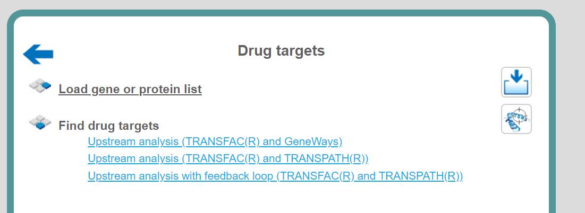
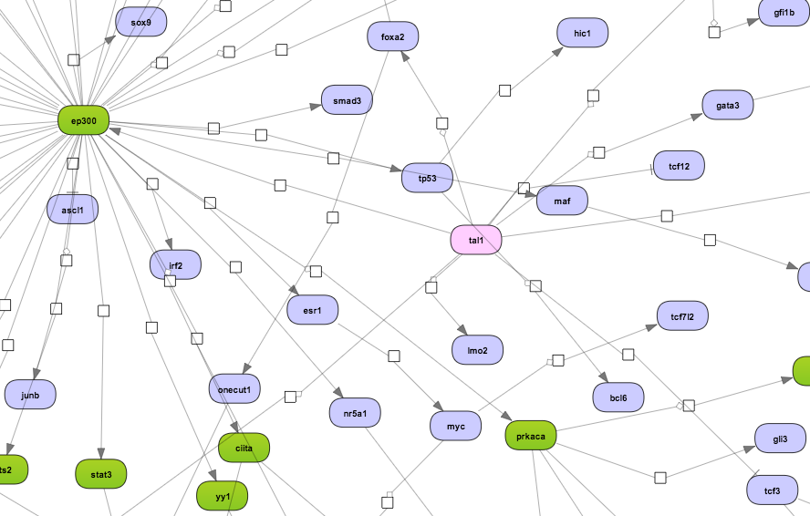
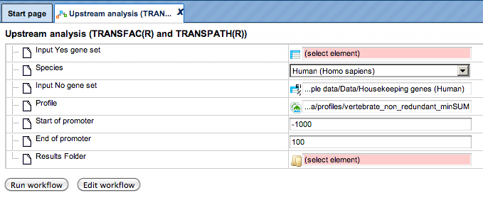
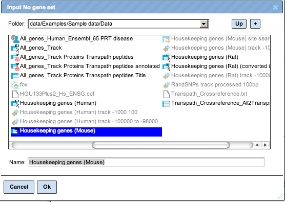
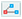
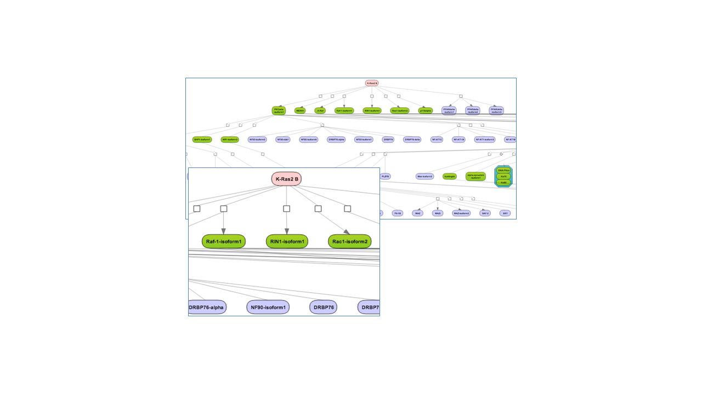
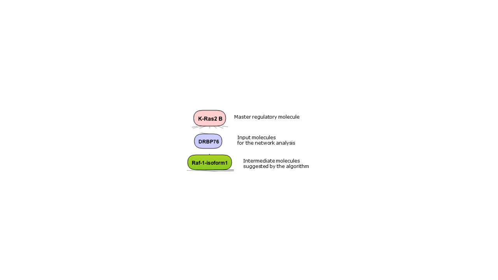
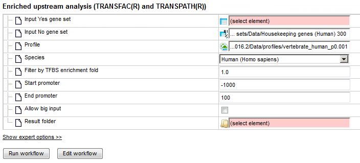
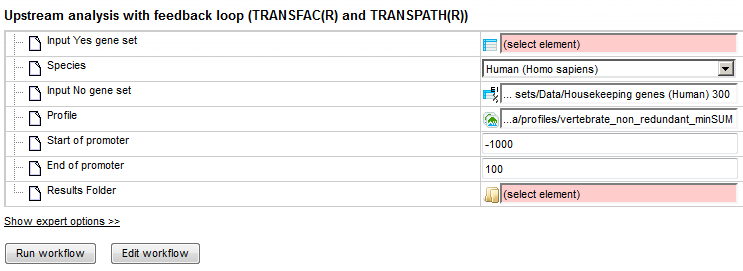

# Drug targets

## Find drug targets with TRANSFAC® and GeneWays

This is very similar to the workflow described in greater detail below with the only difference being the pathway database applied for network analysis. Here the search for master regulatory molecules is performed with the protein-protein interaction network of the GeneWays database. Because of the high connectivity between molecules in GeneWays, by default 4 steps upstream of the input list of TFs are considered for the search for master regulators, as compared with 10 steps when applying the TRANSPATH® database. A diagram for the top master regulator as suggested from a GeneWays-based analysis is shown below in a force-directed layout: 

For the input form of this workflow and for the description of the corresponding results folder, please refer to the description of the workflow Find drug targets with TRANSFAC and TRANSPATH.

**Note***.* This workflow is available together with a valid TRANSFAC® license.   Please feel free to ask for details (info\@genexplain.com).

## Find drug targets with TRANSFAC® and TRANSPATH®

The geneXplain upstream analysis is an integrated promoter (TRANSFAC®) and pathway (TRANSPATH®) analysis to discover unanticipated causal relationships in your data.

### Upstream analysis (TRANSFAC® and TRANSPATH®)

To launch the workflow, open the workflow input form from the Start page:

**Step 1**: Specify a gene set under study, e.g. a list of differentially
regulated genes, as the Input Yes gene set. You can drag & drop it from your
project within the Tree Area and drop in the pink box of the field **Input gene
set**.

For this example, the further steps are demonstrated with the following input
set:
<https://platform.genexplain.com/bioumlweb/#de=data/Examples/User%20Guide/Data/Input%20for%20examples/workflows/Upregulated_top100>

**Step 2**: Specify the biological species of the input set in the field
**Species** by selecting the required species from the drop-down menu.

**Step 3**: Input a No gene set. This is the set of background genes or control
set. The default No set used for this workflow is data/Examples/Sample
data/Data/Housekeeping genes (Human). If your Yes set is from mouse or rat, you may wish to adjust the No set accordingly. With a mouse click on the field
**Input No gene set**, a pop-up window will be opened as shown below. You can select mouse or rat housekeeping genes from these pre-compiled sample sets, or you can alternatively select any of your specific gene sets from your project. When selection is done, press [Ok].

**Step 4**: Define a TRANSFAC® profile. The default profile is
vertebrate_non_redundant_minSUM. Any other TRANSFAC® profile or user-specific profile can be chosen. With a mouse click on the field **Profile**, a pop-up window will open, where a profile can be selected.

**Step 5**: Define the promoter regions to be analyzed. The default promoter
region is from-1000 to 100 relative to the TSS as annotated in the Ensembl
database. You can adjust **Start of promoter** and **End of promoter** by typing
in the corresponding fields.

**Step 6**: Define where the folder with the results should be located in your
project tree. You can do so by clicking on the pink box (select element) in the
field **Results folder**, and a new window will open, where you can select the
location of the results folder and define its name.

**Step 7**: Press the [Run workflow] button. Wait until the workflow is
completed, and take a look at the [Upstream Analysis results]

[Upstream Analysis results]: https://platform.genexplain.com/bioumlweb/#de=data/Examples/User%20Guide/Data/Examples%20of%20workflows/Transfac%20and%20Transpath/Upregulated_top100%20(Upstream%20analysis%20Transfac%20and%20Transpath)/Site%20search%20-1000%20%2B100/summary

**Visualization and interpretation of results**

**Master regulators**

The primary result table [*Master regulators upstream 10*]() is a list of master regulatory molecules that were identified at a distance of up to 10 steps upstream of the input TFs. Each master regulatory molecule is
characterized by a Score, Z-score, FDR, and Ranks Sum.

[*Master regulators upstream 10*]: https://platform.genexplain.com/bioumlweb/#de=data/Examples/User%20Guide/Data/Examples%20of%20workflows/Transfac%20and%20Transpath/Upregulated_top100%20(Upstream%20analysis%20Transfac%20and%20Transpath)/Master%20regulators%20upstream%2010

The selection of the best master regulatory molecules based on Score, Z-score and Ranks sum is explained in there under
“Interpretation of the results”.

The three *Top 3 regulators* diagrams ()visualize the networks for each of the three top master regulators. By default, the top regulators are identified upon sorting the *Master regulators upstream
10* table () by the column **Ranks sum** with the lowest rank on top.

**Tip for working with the diagrams**

By default, network diagrams are shown in the vertical hierarchical layout. The layout can be interactively changed into horizontal hierarchical, or force
directed, or orthogonal layouts as described in diagram layouts. Expression data can be mapped on the diagrams as described in the expression mapping section.

**Results of the promoter analysis**

Along with the master regulatory molecules, this workflow returns the results of the [**promoter analysis**], including TFBSs enriched in the promoters of the Yes set as compared with the No set, see *summary* (). The tracks with the Yes and No promoters and with the TF binding sites () are also included in the output. 

[**promoter analysis**]: https://platform.genexplain.com/bioumlweb/#de=data/Examples/User%20Guide/Data/Examples%20of%20workflows/Transfac%20and%20Transpath/Upregulated_top100%20(Upstream%20analysis%20Transfac%20and%20Transpath)/Site%20search%20-1000%20%2B100/summary

**Note***.* This workflow is available together with valid TRANSFAC® and TRANSPATH® licenses. Please feel free to ask for details (info\@genexplain.com).

### Enriched upstream analysis

This workflow enables a complete upstream analysis using the newest algorithm to detect enriched transcription factor binding sites (version 2.0), resulting in the identification of master regulators upstream from the transcriptional key molecules. To launch the workflow, open the workflow input form from the Start page:

**Step 1**: Specify a gene set under study, e.g. a list of differentially
regulated genes, as the Input Yes gene set. You can drag & drop it from your
project within the Tree Area and drop in the pink box of the field **Input gene
set**.
[Input gene set used for example]

[Input gene set used for example]:
https://platform.genexplain.com/bioumlweb/#de=data/Examples/User%20Guide/Data/Input%20for%20examples/Upregulated%20Ensembl%20genes%20filtered%20(logFC%3E1)%20subsetTop100

**Step 2**: Input a No gene set. This is the set of background genes or control set. The default No set used for this workflow is data/Examples/Sample
data/Data/Housekeeping genes (Human). If your Yes set is from mouse or rat, you may wish to adjust the No set accordingly.

**Step 3**: Define a TRANSFAC® profile. The default profile is vertebrate_human_p0.001. Any other TRANSFAC® profile or user-specific profile can be chosen. With a mouse click on the field **Profile**, a pop-up window will open, where a profile can be selected.

**Step 4**: Specify the biological species of the input set in the field **Species** by selecting the required species from the drop-down menu.

**Step 5:** Filter by TFBS enrichment fold: In this field you can specify the
enrichment fold (FE) to filter the motifs. By default, FE is 1.0, which means
all motifs with FE\>1.0 will be reported in the resulting table and the same
motifs will serve to create a specific profile. If you want to use
highly-enriched motifs, you can specify higher thresholds, e.g. 1.1, 1.2, or
even 2.0 or 3.0 depending on your Yes and No sets. It is recommended that you
run the workflow with default parameters first, check the results, and then run
again with the desired filter value.

**Step 6**: Define the length of the promoter regions to be analyzed. The
default promoter region is from-1000 to 100 relative to the TSS as annotated in the Ensembl database. You can adjust **Start of promoter** and **End of
promoter** by typing in the corresponding fields.

**Step 7**: Checking **Allow big input** enables analysis of more than 500
promoters.

**Step 8**: Define where the folder with the results should be located in your
project tree. You can do so by clicking on the pink box (select element) in the
field **Results folder**, and a new window will open, where you can select the
location of the results folder and define its name.

**Step 9**: Press the [Run workflow] button. Wait until the workflow is
completed, and take a look at the results.

**Visualization and interpretation of results**

The [Enriched Upstream Analysis result] folder contains several files. 

[Enriched Upstream Analysis result]: https://platform.genexplain.com/bioumlweb/#de=data/Examples/User%20Guide/Data/Examples%20of%20workflows/Transfac%20and%20Transpath/Upregulated%20Ensembl%20genes%20filtered%20(logFC%3E1)%20subsetTop100%20(enriched%20upstream%20analysis_TF%20and%20TP)/Enriched%20motifs

**Enriched motifs**

The list of motifs, which were identified during the first part of the workflow
and filtered with enrichment fold \>1 can be found in the table
**Enriched_motifs** (). It contains those site models, here TRANSFAC® matrices, which are enriched in the Yes set in comparison with the No set as shown below:

The table **Profile** () presents details for PWMs with *adj. site FE \>1*. This profile is an intermediate result of the workflow and is used further for *Site search on gene
set* analysis.

**Site search analysis output** () serves to visualize enriched motifs in the promoters. This folder contains four tracks (). The output table *Transcription factors Ensembl genes* 

is a list of transcription factors linked to the enriched motifs. For each transcription factor, the Ensembl gene ID is provided, as well gene description,
HGNC gene symbol, species, and site model (TRANSFAC® PWM name).

This list of transcription factors is the input for the second part of the workflow, the master regulator search.

**Master regulators**

The primary result table [*Enriched Master regulators upstream 10*] () is a list of master regulatory molecules that were identified at a distance of up to 10 steps upstream of the input TFs. Each master regulatory molecule is
characterized by a Score, Z-score, FDR, and Ranks Sum. 

[*Enriched Master regulators upstream 10*]: https://platform.genexplain.com/bioumlweb/#de=data/Examples/User%20Guide/Data/Examples%20of%20workflows/Transfac%20and%20Transpath/Upregulated%20Ensembl%20genes%20filtered%20(logFC%3E1)%20subsetTop100%20(enriched%20upstream%20analysis_TF%20and%20TP)/Master%20regulators%20upstream%2010

The selection of the best master regulatory molecules based on Score, Z-score and Ranks sum is explained therein under “Interpretation of the results”.

The three *Top 3 regulators* diagrams () visualize the networks for each of the three top master regulators. By default, the top regulators are identified upon sorting the *Master regulators upstream 10* table 
() by the column **Ranks sum** with the lowest rank on top.

**Note***.* This workflow is available together with valid TRANSFAC® and TRANSPATH® licenses. Please feel free to ask for details (info\@genexplain.com).

### Upstream analysis with feedback loop

This workflow enables a complete upstream analysis, detecting enriched
transcription factor binding sites and resulting in the identification of master
regulators upstream from the transcriptional regulators. Some master regulators with expression values (fold changes) from the input set are identified (with feedback loop). The results of this workflow include master regulators from all transcription factors and master regulators only with expression values from the input set (=feedback loop). To launch the workflow, open the workflow input form from the Start page:

**Step 1**: Specify a gene set under study, e.g. a list of differentially
regulated genes, as the Input Yes gene set. You can drag & drop it from your
project within the Tree Area and drop in the pink box of the field **Input gene
set**.
[Input gene set used for example]

[Input gene set used for example]:
https://platform.genexplain.com/bioumlweb/#de=data/Examples/User%20Guide/Data/Input%20for%20examples/Upregulated%20Ensembl%20genes%20filtered%20(logFC%3E1)%20subsetTop100

**Step 2**: Specify the biological species of the input set in the field
**Species** by selecting the required species from the drop-down menu.

**Step 3**: Input a No gene set. This is the set of background genes or control
set. The default No set used for this workflow is data/Examples/Sample
data/Data/Housekeeping genes (Human). If your Yes set is from mouse or rat, you may wish to adjust the No set accordingly.

**Step 4**: Define a TRANSFAC® profile. The default profile is
vertebrate_non_redundant_minSUM. Any other TRANSFAC® profile or user-specific profile can be chosen. With a mouse click on the field **Profile**, a pop-up window will open, where a profile can be selected.

**Step 5**: Define the promoter regions to be analyzed. The default promoter
region is from -1000 to 100 relative to the TSS as annotated in the Ensembl
database. You can adjust **Start of promoter** and **End of promoter** by typing in the corresponding fields.

**Step 6**: Define where the folder with the results should be located in your
project tree. You can do so by clicking on the pink box (select element) in the
field **Results folder**, and a new window will open, where you can select the
location of the results folder and define its name.

**Step 7**: Press the [Run workflow] button. Wait until the workflow is
completed, and take a look at the results.

**Visualization and interpretation of results**

The Output folder for Upstream Analysis with feedback loop contains several files and can be accessed from the link below:

<https://platform.genexplain.com/bioumlweb/#de=data/Examples/User%20Guide/Data/Examples%20of%20workflows/Transfac%20and%20Transpath/Upregulated%20Ensembl%20genes%20filtered%20(logFC%3E1)%20subsetTop100%20(Upstream%20analysis%20with%20feedback%20Transfac%20and%20Transpath)>

**Master regulators**

The primary result table *Master regulators upstream 10* () is a list of master regulatory molecules that were identified at a distance of up to 10 steps upstream of the input TFs. Each master regulatory molecule is
characterized by a Score, Z-score, FDR, and Ranks Sum.

 The selection of the best master regulatory molecules based on Score, Z-score and Ranks sum is explained therein under “Interpretation of the results”.

The three *Top 3 regulators* diagrams ()visualize the networks for each of the three top master regulators. By default, the top regulators are identified upon sorting the *Master regulators upstream
10* table () by the column **Ranks sum** with the lowest rank on top.

The three *Top 3 regulators* diagrams with Expression () visualize the networks for each of the three top master regulators, which have expression values from the input table. These master regulators with expression values are the results of a feedback loop; they are regulated by themselves. By default, the top regulators with expression values are identified upon sorting the *Master regulators with input expression_filtered* () by the column **Ranks sum** with the lowest rank on top.

The output of the workflow shows the top master regulator huntingtin, which was found as a feedback-loop regulated molecule according to the input parameters.

**Note***.* This workflow is available together with valid TRANSFAC® and
TRANSPATH® licenses. Please feel free to ask for details (info\@genexplain.com).
