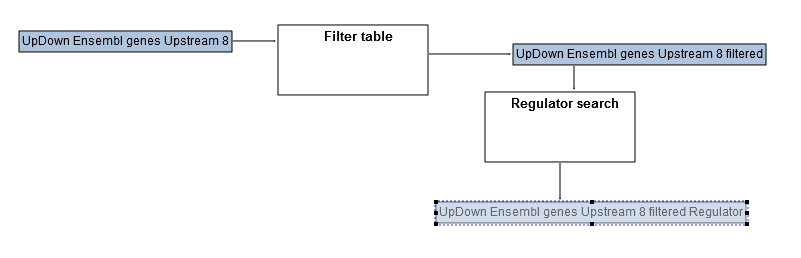
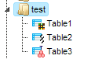

1.  Editing and creating workflows

    1.  Edit a pre-existing workflow

Tip for the workflow editing

You can easily create a similar workflow with parameter values adjusted to your
needs. For example, you might be interested to change the number of steps used
for the regulator search. By default, 10 steps are applied.

To make a change, you need first to open the workflow under the “Edit workflow”
mode, and save its copy in your project area. The [Edit workflow] button is
located near the button [Run workflow]. Upon clicking on "Edit workflow", the
workflow diagram will be opened in the Work Space, and you can select the
analysis box you would like to modify. On the screenshot below "Regulator
search" analysis was selected, and in the Operations Field, on the tab
"Workflow", all the parameters are visible. Under this mode, you can modify
default parameters and then save the workflow.

In this way you will get a customized workflow, with the parameters specified
according to your needs.

1.  Create a new workflow

To create your own workflow, please go to the Start page and click “Create your
own workflow” under the list of pre-defined workflow groups. You will be asked
to specify the name of the new workflow.

In this example, an entry *New workflow* (default name) will be created.

You will see now a new tab being opened in the Work Space, where you can design
a new workflow diagram. The workflow diagram represents different analysis
functions being connected by input and output files. The resulting directed
graph visualizes the sequence of analysis steps in the workflow. The diagram
also may contain parameters, which are to be defined by the user.

Below you can see an example of one step of a new workflow. At the top of the
Work Space there is a toolbox (1) to create all the elements of the workflow.
The light blue rectangle in the center (2) is the analysis function (Filter
table) to be used in this step. The green box at the left (3) stands for an
input table, the right yellow box (4) for the output table of this analysis
function. The yellow box above (5) represents a parameter of the analysis
function, which in this case (Filter table function) defines a filtering
condition.

Upon clicking on any component of the workflow you can see the information about
this particular element in the Operations Field. For instance, in the figure
below, we can see the content of the parameter “Filtering condition”, which was
set as “Score \> 2” (so the input table will be filtered by this condition in
the table column “Score”).

1.  Six steps to create a simple workflow

Let us go now through the steps of creating this workflow.

**Step 1.** The elements of the workflow can be placed into the Work Space by
using the toolbar or by drag and drop from the Tree Area. Let us place the
Filter table function by drag and drop from the subdirectory Methods/Data
manipulation on the “Analysis” tab of the Tree Area:

**Step 2.** For creating the input table you should click on the green element
in the tool bar, locate the cursor in the Work Space where you would like to put
this element and click. A new window “Create new node” will pop up, where you
can define the parameters of the element as will be explained in the following.

**Name** field: the title of the element; Type: please, select “Data element”,
for any objects like tables. In the field Default value you can type a full
folder path where the table is located. You can also use some global variables,
like “\$project\$” that already contain the full path (by clicking on the “…”
button you can access all the global variables defined for this workflow. Rank
(sort order): this number gives the position of this input element in the list
of all elements upon starting the workflow. Role: Input, since we are using this
element for inputting a table into the workflow.

We have created now an input table element:

**Step 3.** Connecting elements on the diagram is done by clicking on the arrow
symbol in the toolbar. A new window “Create new edge” will pop up. By clicking
on the “Table” element in the Work Space you select it as Input node for this
edge. Similarly, you click on the left table symbol in the “Filter table”
element to select it as an Output node of this new edge.

After pressing “OK” a new connection is created:

**Step 4.** The same way you can create now an output table element on the
diagram by selecting the yellow element in the tool bar (since it is going to be
an intermediate table for further use in the next steps of the workflow) and
connecting it with the output icon of the “Filter table” element.

In the field “Expression” you can now use a new global variable “\$Table\$”
which will contain, during the run of the workflow, the name of the table which
you have entered. So in this case we are creating a new name for the future
output table “\$Table\$ filtered” by adding to the name of the input table an
ending “filtered”.

As a result, we have now created one step of the workflow.

**Step 5.** To filter data, we have to define a filtering condition. To do this
we have to create a new element “Filtering condition” (yellow element in the
tool bar), which will be now of simple “String” type and which contains a
filtering condition “Score \> 2” in the field Expression.

A new element “Filtering condition” is created. This element should now be
connected to the analysis function “Filter table” in order to define the
filtering condition that is going to be applied in this step of the workflow. To
do that, please click first on the “Filter table” element and open the
parameters of this element in the Operations Field. After that, click on the
field “Filtering condition” (1) in the parameter list and select it (a blue
background color indicates that the field is selected). Click on the “Bind
property to variable” button (2) in the toolbar of the Operations Field. And
after that, move the cursor to the Work Space and click on the “Filtering
condition” element on the diagram (3).

So, a filtering condition parameter is now connected to the corresponding field
in the “Filter table” function.

**Step 6.** The workflow is now ready to be executed. To start the workflow
please click on the “Run workflow” button (

) in the toolbar of the Operations Field.

In the pop-up menu “Workflow parameters” you should specify the input table.
Please navigate to the folder with your tables and select a table which has a
column Score and press [Ok]. The workflow will be executed and a new table with
a new name and the appendix “filtered” will be created in the same folder as the
input table.

1.  Complex workflows

More complex workflows are created by adding further workflow steps and by
connecting them through a common data element. As in the example below, the
output element “Table filtered” of the first step is used as an input element of
the second step of the workflow, “Regulator search”. You can also see that we
have added a new input parameter “Species”, which appears now among the workflow
parameters upon starting the workflow. With this, you can select a taxonomic
species (presently human, mouse or rat) for the table you are going to run
through the workflow.

**Note:** During execution of the workflow a *research diagram* is saved (you
can specify the name of this diagram before starting of the workflow). The
research diagram (see figure below for an example) contains the history of the
workflow execution with the names of all input and output files. It also
contains all the links to these tables, so that you can easily open them by
clicking on the respective element in the diagram.

1.  Cycles and scripts

One more element available in the workflow is *cycle*. It can be created using
the “cycle” button in the tool bar. It is necessary to specify the Name of the
cycle (the “cycle variable”), and to choose the appropriate Type and Cycle type.

The option “All elements in collection” (Cycle type) together with the Type
“Data element” and some folder name in the field Expression means that all data
elements from that folder will be taken one by one as cycle variable values.
E.g., when selecting Cycle type “Table columns”, Expression should specify the
name of this table. Or when choosing Cycle type “Range (from ...to)” for Type
“Integer number” and Expression as “2 ... 6”, the cycle will be executed by
assigning the values 2,3,4,5 and 6 to the cycle variable.

The *Script* workflow element represents a code written in JavaScript, which can
be executed during the workflow run. To add a script the user should press the
tool bar button “analysis-script”, click the proper place in the workflow
diagram area and type the JavaScript code in the Script source field.

Another way to add a script to the workflow is to drag and drop some script data
element right from the project tree.

All variables defined in a workflow (green and orange boxes) are available
inside the script as JavaScript variables. If the name doesn’t contain spaces,
it can be used as is, the name should be put into \$[“…”] otherwise. For
example, the variable “TableColumn” can be accessed from a script by name
TableColumn, but “Table column N1” should be called as \$[“Table column N1”].

Example 1. Print column names

In the example below the data element parameter InputTable (green box) is first
added to the workflow. Then a cycle with the following settings is added:

,

Note that expression is set to \$InputTable\$ for a cycle.

Then a script element with the following code will be created inside a cycle:

print(TableColumn);

When the [Run] button is pressed, the workflow will ask for a table path, and
then will print all column names into the workflow output log.

Example 2. Run GO classification for all tables in a folder

This workflow contains 3 input elements: InputFolder, where one or more Tables
should be placed; ResultFolder that will be created by the method “Create
folder”, and the data element Species, required for table conversion and
functional classification.

The cycle has following settings:

Here the cycle variable named Table will adopt the names of the tables in the
InputFolder. Then it goes to the method “Convert table”, and identifiers are
converted to Ensembl genes, according to the analysis settings below:

The conversion result is taken as input set in the Functional classification
analysis:

The output of the functional classification is a data element named *GOres* with
Expression \$ResultsFolder\$/\$Table/name\$ GO.

When the [Run] button is pressed, the workflow will start. If, for instance, the
folder *test* with some tables is defined as input, and the result folder name
is *test result GO*, we get after completion of the workflow:

