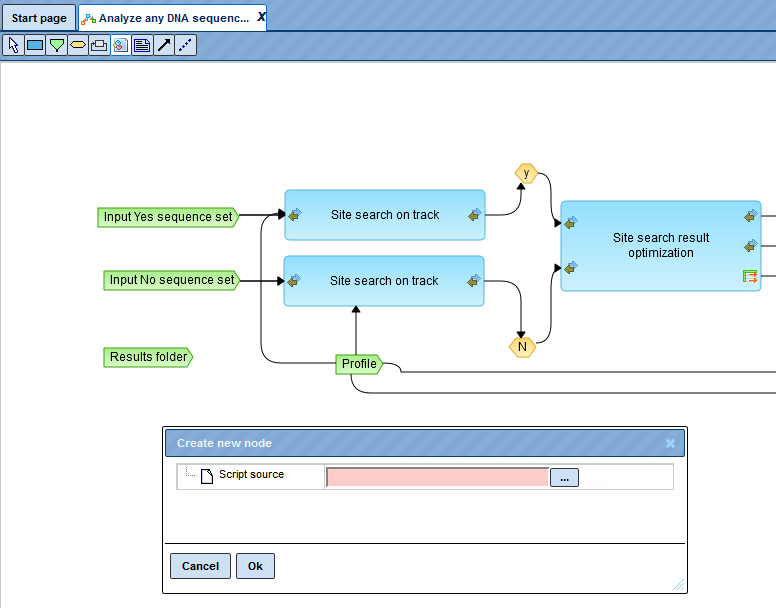

# Editing and creating JS scripts

User-specific scripts in JavaScript (JS) can be added directly into the
platform, and immediately executed. They can be combined with pre-existing
analyses and can be part of the workflows; existing codes in workflows can be
edited.

## Creating new JS scripts

For writing a new JS script, go to any of your data folder (blue marked) and
click on the “New JS script” button () in the toolbar. After pressing a new tab “New script.js**”** opens in the Workspace. You can write your script and save it for later execution or
incorporation into a workflow.

## Executing JS scripts

To execute a JS code directly, click the “Script” tab in the Operation Field.
Simply write or copy and paste your script code in the box. To run the script,
press the button [Execute].

After pressing [Execute] the new tab “Script log” opens in the Workspace. Here
you can find information about the success and the output of the script.

To familiarize yourself with the handling of JavaScript, you may use the
following example script:

<http://platform.genexplain.com/bioumlweb/#de=data/Examples/Scripts/Data/mergeTables.js>

## Editing JS scripts in workflows

To edit a JavaScript code in an existing workflow, you have to open the workflow
in Edit mode and copy it in your data folder. An example is given by the
following workflow:

<http://platform.genexplain.com/bioumlweb/#de=analyses/Workflows/GTRD/Analyze%20promoters%20%28GTRD%29>

To change the JavaScript code, the grey **ScriptBox** must be clicked in the
workflow overview (1), whereupon the **Script source** appears in the “Workflow”
tab of the Operation field (2). Press the button [ ... ] to open the
**JavaScript editor** (3). In this window, the code can now be changed directly.
The confirmation of the editing is done using the [Ok] button.

## Inserting JS scripts in workflows

To insert a script in an existing or self-created workflow, press the “Analysis
–script” button () in the toolbar. After clicking on button [...] of the **Script source**, the **JavaScript editor** opens. The script can be inserted.

