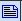
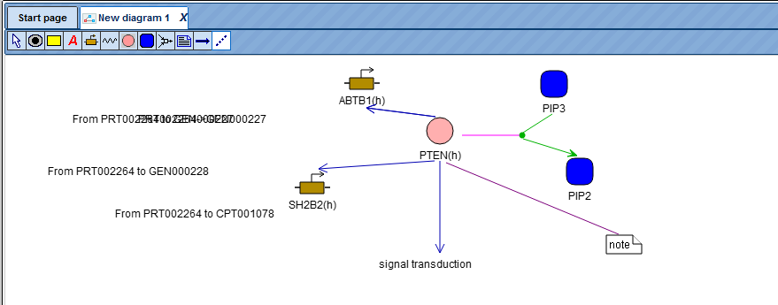

# Editing and creating diagrams

## Diagram types

Diagram types are hierarchically organized as shown in the following scheme:

There are 5 types of diagrams in the geneXplain platform:

-   Pathway diagram

-   Pathway simulation

-   Composite diagram

-   Pathway simulation (SBGN)

-   SBML simulation (SBGN)

You find them listed for selection when pressing the button

to create a new diagram. This button appears on top of the Tree Area when you go
into the Data folder of your project directory (usually under your user name).

The *Pathway type* diagram is used for formalized description of biological
pathway structure (metabolic pathway, gene network, etc).

The *Pathway simulation* type diagram is an extension of pathway type, where
variables are associated with graph nodes and differential equations with graph
edges. This allows automatic generation of the mathematical model of the system
and simulation of its dynamics.

The *Composite diagram* may contain several pathway simulation diagrams as well
as some types of links between them to join separate simulation modules into one
composite model.

The *Pathway simulation SBGN* diagram type is the same as pathway simulation,
and visualized according to the rules of System Biology Graphic Notation.

*SBML-SBGN* is a specific type to wrap an SBML diagram in the SBGN view.

Please note that diagrams of Semantic type can’t be constructed under general
user account.

Entity types and proteins are represented as follows:

The following relations can be defined:

When you choose the option “Pathway simulation”, additional functions are
available which you can see from the extended series of icons on top of the Work
Space:

The seven new icons on the right (red frame) are specifically introduced for
simulation functions, the one on the left replaces the icon with the capital A
in the “Pathway diagram” option.

## Creation of a new diagram

A new diagram can be made in the Work Space by two methods:

You can edit pre-composed diagrams and create a new diagram by saving it in your
own project area. 

You can start a new diagram in the work space by using graph search. The details
of this method are further described below.

To start with the creation of a new diagram, please select the correct folder in
your project area and press the  icon in the Control Panel. The tool will ask you to select the type of diagram you want to create in the work space. In the following, the creation of a new
“Pathway diagram” will be described.

The description for diagram types has been mentioned above. Upon selecting the
type of a diagram and clicking [Ok] a new node *New Diagram* will appear in the
Tree and the corresponding tab is opened in the Work Space to start the diagram
creation.

A pathway diagram opened in the work space has a tool bar as shown below:

Using these icons, you can manually add a node that represents a cell (), a cellular compartment (), a gene (), an RNA (), a protein () or a substance (or small metabolite, ). It may also something as abstract as a concept (
![]media/0fff8b043592ef5a407f5b121a63d362.emf)). These nodes may be related to each other with any kind of link 
(), or , more specifically and if you wish to model your network as a bipartite
diagram, with a reaction ().

In case you wish to link two already existing nodes by a new edge, click on the
icon , which will open a new mask where you can define the input and the output node.
Just move the mouse cursor into the respective field and click on the node that
should serve as input or output node, respectively. The corresponding name or
accession number will appear in the field. The same works for linking a note (to be defined before with 
) to a node by introducing an edge of the type 

.### To add an element to the diagram, several ways are available:

i) Search for the element using the search tab in the databases folder and then add this element to the diagram using
the icon 

.
ii) Drag and drop the element from the Tree Area to the Work Space as shown
below:

Please note that double clicking on the gene gives the information about that
gene in the Info box.

iii) You can then use the Graph search option as described in Section 21.4 to
further search for other elements upstream or downstream of those that are
already included in the diagram. You can add elements to the new diagram as per
your requirement as shown below.

You can specify a layout for the extended diagram, details of the layouts are
described under “Changing the layout”.

iv) To create an entirely new node on the same diagram, click on the

icon on the pathway diagram menu bar and click on the diagram where you want to
add a node. You will get a message as shown below:

You can add the node/Name and press [Ok]; the node will be added to the diagram.

You can also link this node to another element by clicking on the

icon in the pathway diagram menu bar. The tool asks the user to select input and
output nodes.

You can select input and output nodes easily by clicking first on the element
you want to select as input node, and second on the element you want to be the
output node. The diagram after adding the node and linking it to a protein looks
like shown below.

### Editing a pre-composed diagram

Diagrams saved in the tree area can be edited in several ways. For this, please
first copy one of the diagrams, e.g. located in the Examples folder, in your own
project area. For this, you open the diagram in work space by double-clicking on
its name. On the picture below, the diagram which is opened in the work space,
highlighted blue.

Then choose the option “Save as” (button

in the Control Panel). A new mask opens (“Save document as”), where you will
find your project and a folder labeled “data”; you should save this copy under
any new name.

Changing location, color and title of the nodes on a diagram

When you open a diagram saved in your project, you can change color and edit the
title of the nodes, shift one node relative to others, remove or add nodes.
Adding new nodes to a diagram is described in the previous section, Section
23.2.

To edit a node, first, select it by a mouse click. Below, the molecule bard1 is
selected.

Apply the Edit button

at the top right corner of the Info box to open the form for editing the
selected node. The Edit button is highlighted by a red oval on the picture
below.

The Edit form is opened as shown below.

In the Title field you can edit the name of the selected node. In the ShapeColor
field the current color of the selected node is shown. By clicking into this
field you can open the Select color form and change the color.

After editing is done, press Save on the Edit form.

To remove a node from the diagram, first select this node and then right-click
(see figure below).

To shift a node relative to other nodes, select it and drag to a desired
position.

Saving changes and undo & redo functions.

After editing of a diagram is complete, you can either save changes or undo
them. Saving a diagram under the same path and name is done by the button

on the top menu. If you would like to save a diagram to a different folder or
project, or under different name, use the Save button

In case you would like to return to the previous variant, use the Undo button

.
**Important**: undo and redo functions work for one previous step, you need to
click the same button again to undo or redo the next previous step. Please note,
undo and redo functions work only before saving.

To return to the previously saved version of a diagram, use the Revert button

Further editing of diagrams includes mapping available expression data on the
molecules and adding interactions around the selected molecules. For details on
these two functions please refer to “Expression mapping” and  “Graph search”.
