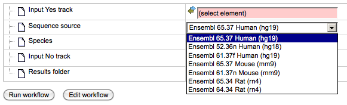
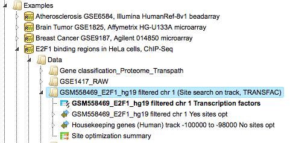
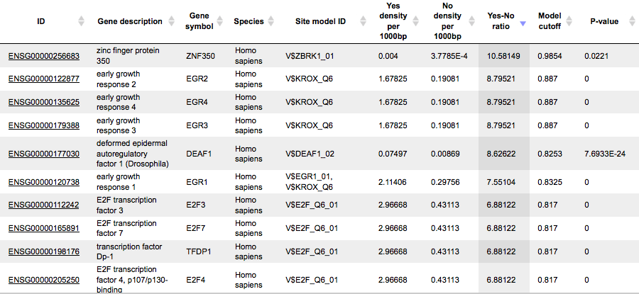
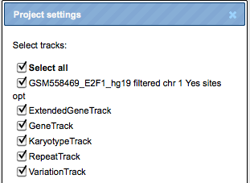
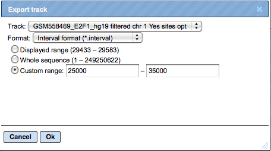

# Epigenomics

## Site search with TRANSFAC(R)
### Site search in a single interval list

This workflow helps to map putative TFBSs on peaks calculated from your  
ChIP-seq data. Site search is done with the help of the TRANSFAC® library of
positional weight matrices, PWMs, using the pre-computed profile
vertebrate_non_redundant_minSUM.

The few steps to launch the workflow are described in the following.

**Step 1**. Open workflow input form from the Start page, it will be opened in
the main Work Space and looks as it is shown below:

**Step 2.** Specify the input track in BED format in the field **Input Yes
track**.  
The input Yes track contains peaks from your ChIP-seq study. To specify the Yes
track, you can drag & drop it from your project within the tree area.
Alternatively, you may click on the pink field “select element” and a new window
will open, where you select the input track. After having selected the track,
press the [Ok] button.

**Step 3.** Specify the sequence source from the drop-down menu. Several human,
mouse and rat sequence builds are available in the platform, as shown below. By
default, the most recent Ensembl human genome, hg19, is specified. Make sure you
selected the sequence source (the genome build) that corresponds to your input
set, to get correct and meaningful results.

**Step 4.** Specify the biological species of the input set in the field
**Species** by selecting the required species from the drop-down menu.

**Step 5.** Specify No track in BED format in the field **Input No track**. Upon
clicking on this field, a supplementary window will open, where you can select
the No track from your project tree, or use one of our default No tracks for
human, mouse or rat, respectively.

**Step 6.** Define where the folder with the results should be located in your
project tree. You can do so by clicking on the pink field “select element” in
the field **Results folder**, and a new window will be opened, where you can
select the location of the results folder and define its name.

**Step 7.** Press the [Run workflow] button.

Ready!

Wait until the workflow is completed.

**The results folder** contains two tables and two tracks; for this example,
let’s consider the results folder located under “Examples”. It is highlighted by
blue in the figure below:

The tables *Site optimization summary* (

) and *Transcription factors* (

) are opened automatically in the Work Space as soon as the workflow is
completed.

**The table Site optimization summary** includes the matrices the hits of which
are over-represented in the Yes track *versus* the No track.

Please note that only the matrices with Yes-No ratio higher than 1 are included
in this output table. The hits of these matrices can be interpreted as
over-represented in the Yes set *versus* No set.

The table *Site optimization summary* shown below has been sorted by the values
in the **Yes-No ratio** column.

Each row summarizes the information for one PWM. For each selected matrix, the
columns **Yes density per 1000bp** and **No density per 1000bp** show the number
of matches normalized per 1000 bp length for the sequences in the input Yes set
and input No set, respectively. The Column **Yes-No ratio** is the ratio of the
first two columns. Only matrices with a Yes-No ratio higher than 1 are included
in the *summary* table. The higher the Yes-No ratio, the higher is the
enrichment of matches for the respective matrix in the Yes set. The matrix
cutoff values as they are calculated by the program at the optimization step are
shown in the column **Model cutoff**, and the last column shows the **P-value**
of the corresponding event.

#### Table Transcription factors:

This table includes transcription factors (TFs) that are associated with the
PWMs that are listed in the table *Site optimization summary*, and each row
shows details for one TF, including its Ensembl gene ID (column **ID**), gene
symbol, gene description and biological species of the corresponding TF (columns
**Gene description**, **Gene symbol**, and **Species**). The column **Site model
ID** shows the identifier of the PWM associated with this TF, and several
further columns repeat information that is also shown in the table *Site
optimization summary*.

Tracks “Yes sites opt” and “No sites opt” (

).

Each row presents details for each individual match for every PWM. Columns
**Sequence (chromosome) name**, **From**, **To**, **Length** and **Strand** show
the genomic location of the match including chromosome number, start and end
positions, strand and length of the match, respectively. The column **Type**
contains information about the type of the elements; in this case all matches
are considered as “TF binding site”. Further columns keep information about PWM
producing each match (column **Property:matrix**) as well as a score of the core
(column **Property:coreScore**) and a score for the whole matrix (column
**Property:score**). The column **Property: siteModel** contains an identifier
for the site model, which is the matrix together with the cutoff applied (for
details about these scores, please see Kel et al., Nucleic Acids Res.
31:3576-3579, 2003).

**Tip**. Further visualization of track files in the genome browser:  
Having tracks “Yes sites opt” and “No sites opt” opened in the Work Space, the
menu button

can be applied to get a visualization. First, a supplementary window is opened
where you can select one chromosome and press [Ok], as shown below.

In the second pop-up window, you can select tracks that can be visualized
together with your track, e.g. “Yes sites opt” (see above), and press [Ok].

The resulting visualization, after applying the “zoom in” button

, looks like it is shown below. Matches for different matrices are shown in
colors, and the color schema can be customized.

Such a view may help to visually co-localize information on different tracks,
e.g. putative TFBS with variations, repeats and genes. In the figure above, the
cursor shows position 29444, and two variations are located at this position.
You can immediately recognize that these variations are located within
particular putative binding sites in the intron region of the WASH7P gene.

The same information is available not just as a picture, but also as a table
under the tab “Sites” (shown below). For each element information is shown on
chromosome, positions, length, strand, type of the track, and name of the
element.

This table can be exported as a track, in several different formats including
intervals, bed, wig, gff, gtf and more.

**Note.** This workflow is available together with a valid TRANSFAC® license.  
Please, feel free to ask for details (info\@genexplain.com).

#### Site search in multiple interval sets

This workflow is designed to search for TFBSs in DNA sequences identified by the
ChIP-seq approach, for multiple datasets.

In the field **Input Yes tracks**, several different tracks can be
simultaneously submitted. The same background dataset, **Input No track**, is
used for comparison with each of the submitted Yes tracks. The default No track
corresponds to far upstream regions of the house keeping genes, where no
functional TFBSs are expected.

The steps of this workflow for a single input Yes track are described in Section
6.1.2.1. In this workflow, the same steps are performed next time for the 2nd
Yes track, and so on iteratively for each of the input Yes tracks.

This workflow helps to save time and efforts, especially when you have several
sets of ChIP-seq data, e.g. the peaks for a number of different TFs.

**Note**:  *This workflow is available together with a valid TRANSFAC® license.  
Please, feel free to ask for details (info\@genexplain.com)*

### Search for composite modules

#### Search for composite modules with TRANSFAC®

This workflow finds pairs of TFBSs that discriminate between two tracks, the
*Yes* and the *No* track. As the Yes track, ChIP-seq peaks or intervals
identified in analyses for histone modifications, or any other genomic
fragments, can be considered.

In the first part of the workflow, the overrepresented TFBSs are identified by
the method *analyses/Methods/Site analysis/Site search on gene set* (

). Details about this individual method are given in Section 20.1.2. In the
second part of this workflow, composite modules are identified by a genetic
algorithm based on over-represented TFBSs. For more details about this CMA
analysis refer to Section 20.1.5.

To launch the workflow, follow these steps:

**Step1.** Open the workflow input form. It will open in the main Work Space and
looks as shown below:

**Step 2**. Input the Yes track (the track under study) from the tree. You can
either drag-and-drop or select it from the Tree Area. Here the track published
in the Gene Expression Omnibus, *GSE54909*, is used as an example.

In this study the HDAC inhibitors TSA and SAHA were used to treat primary human
vascular endothelial cells. The effects on genome-wide histone acetylation were
studied applying chromatin immunoprecipitation (ChIP) and then deep sequencing
(ChIP-seq). Histone acetylation ChIP-seq profiles in SAHA-treated versus control
samples were calculated and the peaks were published. The published track
contains over 10000 fragments.

Please consider that such huge tracks cannot be submitted into the workflow. One
cannot expect to find common composite modules in 10000 fragments.

**Tip** We recommend to filter the original track by several conditions, for
example by the score of the calculated peaks, by the length of the fragments, by
genes located near the peaks, etc. The recommended optimal number of the
fragments in the input track is 200-400. Please consider that the time required
for the workflow run directly depends on the size of the input tracks.

Here, the original published track was first filtered by the length of the
fragments 500-600 bp, which resulted in 816 fragments. These fragments were
sorted by the score of the peaks, and the top 200 fragments were selected.

The resulting track of 200 fragments is used as the input Yes track.

**Step 3**. From the drop-down menu in the field Sequence source choose the
Ensembl species and build corresponding to your input track, here hg19.

**Step 4**. Input the No track from the tree area.

**Tip** for creating a No track specific for your track under study:

We recommend to apply the method *Create random track* as described in Section
16.2.6. This method helps to create a track with the same number of fragments
and similar distribution of the fragment’s length. Important especially for the
purposes of this workflow: The method *Create random track* ensures that the
fragments in the No track are not overlapping with the fragments in the Yes
track.

Here, a random track comprising 300 fragments was created and used as the No
track.

**Step 5**. After input of the Yes and No sets, verify the species shown in the
species field.

**Step 6**. Set up parameters for the composite module search. This workflow
identifies pairs of sites. By default, the minimum and maximum numbers of pairs
are given as 2 and 8. You can change these parameters according to the number of
pairs you aim to identify. The number of iterations of the genetic algorithm is
300 by default, and can be adapted as required.

**Step 8**. Specify the result folder location and name and Press the button
[Run workflow]. Wait till the workflow is completed.

**Note***.* This workflow may take time depending on the size of the Yes and No
tracks and on the number of iterations. The recommended size of the input tracks
is 200-400 fragments with the length of the individual fragments not exceeding
1000 bp. The maximum recommended number of iterations is 300.

### Results

The results folder contains the tables Transcription factors () and Site optimization summary (), the tracks Yes sites opt and no sites opt (), and the folder modules ().

The table **Site optimization summary** () contains those site models, here TRANSFAC® matrices, that are over-represented in the Yes track as compared to the No track.

Each row of the table represents the result for one PWM from the input profile.
Only those PWMs with Yes-No ratio \>1 are included in the output. For details of
the output columns please refer to Section 20.1.2.

The **Modules** folder () is a result of the analysis *Construct composite modules*. It contains two tables, two tracks, one histogram, and one model view as shown below:

The Model View is a graphical summary for the hierarchically organized composite
elements generated as a result of the CMA analysis. As mentioned above, this
workflow is designed to identify pairs of sites, and we asked to identify 2 to 8
pairs. The composite module found here contains three pairs, and we can see by
exactly which site models (matrices) these pairs are formed as well as the
statistical parameters of the overall model.

Each of the tracks, **yes track** and **no track**, can be directly opened in
the genome browser by double-clicking. Visualization of the composite module
within one fragment of the input *Yes track*, is shown below.

Upon simultaneous visualization of this track together with default tracks
provided by the platform, you can see that this composite module is actually
located in the promoter region of MMP23B gene.

For more details on the individual output tables and tracks as well as for
**visualization** of the identified composite modules in the genome browser
please refer to the chapter Construct Composite modules

The output table **Transcription factors**

is a list of transcription factors linked to the site models in the composite
module identified by the workflow. For each transcription factor, the Ensembl
gene ID is provided, as well as a gene description, the HGNC gene symbol,
species, and site model (TRANSFAC® PWM name).

Four TFs are found to be candidates to specifically bind the fragments in the
input track of histone acetylation peaks in SAHA-treated human vascular
endothelial cells. The binding motifs for these transcription factors are parts
of the identified enriched composite modules.

The same workflow can be applied to find composite modules in the ChIP-seq peaks
identified as binding profiles for particular transcription factors. The example
of such application for E2F1 binding peaks is described in Chip-seq workflow descriptions.

**Note***.* This workflow is available together with a valid TRANSFAC® license.  
Please, feel free to ask for details (info\@genexplain.com).

### Search for discriminative sites with TRANSFAC® (MEALR)

The tool MEALR finds combinations of TFBS matrices that discriminate between two
sets of sequences (denoted as *Yes* and *No* sets). The *Yes* set may consist of
genomic regions identified in a ChIP-seq experiment. *No* sequences are often
other non-coding genomic regions not overlapping with the peaks.

MEALR differs from other tools in the following points.

>   No cutoff or threshold is used on matrix scores to determine potential
>   binding sites. Instead, MEALR calculates threshold-free sequence scores.

>   MEALR builds a discriminative model for classification which is
>   well-established and widely applied in statistical analysis called Sparse
>   Logistic Regression. The model consists of a linear model that estimates the
>   probability that a sequence belongs to the Yes set based on its binding site
>   features.

>   The sparseness constraint enables MEALR to select a subset of matrices
>   relevant for classification of Yes and No sequences from a possibly large
>   matrix library. Therefore MEALR’s output differs from other tools by
>   presenting a focused set of matrices.

>   While other site enrichment tools provided in the platform evaluate
>   enrichment separately for each matrix, the model used in MEALR assesses the
>   importance of matrices for discrimination in combination with other matrices
>   of the library. Therefore, MEALR suggests (linear) combinations of
>   transcription factor motifs.

MEALR calculates the score x of the ith sequence according to the kth matrix as
$$x_{\text{ik}} = \log(\frac{1}{{\ L}}_{i}\sum_{w_{i}^{}{\ \exp}}\left( S_{w}
\right))\$$, where Sw is the log-odds score of the wth window of matrix length.
Each sequence is therefore associated with a vector of scores, one from each
matrix, and a class (Yes, No).

Let us present an example analysis for a ChIP-seq data set consisting of 500
peak regions and 1000 sequences randomly sampled from regulatory regions across
the human genome. The figure below depicts the input mask of the analysis tool.

**Yes set**: This is the set of sequence intervals that you want to analyze, for
example these can be ChIP-seq peak regions.

**No set**: This is the set of background intervals (control set).

**Sequence source**: Both Yes and No track need to refer to a common source,
such as a genome, as specified by this parameter. Note that you can apply a
custom source, e.g. a specifically uploaded genome. Clicking on the “Custom”
option will open a new field to choose the custom sequence source.

**Input motif profile**: The profile lists the PWMs (motifs) that are used to
assign scores to Yes and No sequences. By default, this field is set to the
profile last applied in your workspace. Note that cutoffs in the profile are
ignored, because MEALR calculates whole sequence scores.

**Output path**: In this field you select a path in the workspace to store the
output table.

The steps of an analysis can be described as follows:

**Step 1.** Input Yes set from the tree. As usual, you can drag-and-drop. Here,
the set of YES intervals from the Example folder is used as input, highlighted
blue on the screenshot below:

**Step 2.** Input No set (drag-and-drop). Our example uses the set of NO
intervals:

**Step 3.** The sequence source should be set automatically upon specifying the
interval sets. If not select the corresponding sequence source from the
pull-down list:

**Step 4.** Select the TRANSFAC® or GTRD profile from the available profiles. In
this example, we select the TRANSFAC® 2013.1 profile named
“vertebrate_non_redundant”:

**Step 5.** Edit the output path (highlighted green in the figure above). After
setting the Yes set, a default output path is suggested. The Example folder may
not be writable for your account requiring selection of an alternative such as
one of your own projects. A different selection can be made easily by clicking
on the field.

Clicking the [Run] button will invoke the analysis. The *summary* table

is automatically opened in a new tab when the analysis is completed. Here is a
part of the output for our example:

A row of the output table contains matrix identifier and its logistic regression
coefficient. The larger the coefficient value, the more important the
corresponding matrix was for discriminating between Yes and No sequences. In our
example, three of the five top matrices represent members of the transcription
factor subfamily C/EBP.
