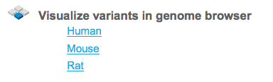
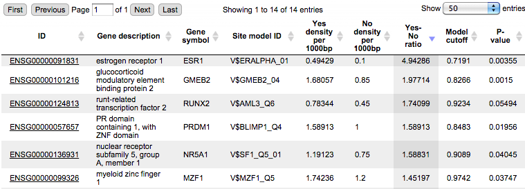
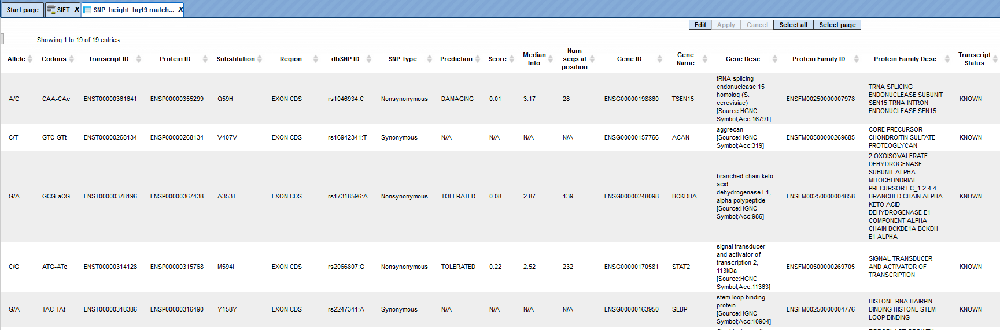

# Genomic variants

Genomic variants can be uploaded in the platform in different formats. The files
uploaded in *bed* format are shown in the tree area as tracks (). Genomic variants can be also uploaded as a table, where the ID column contains standard SNP IDs (e.g. rs10010325). When imported into the platform,
the tables with this type of ID have a special icon () in the tree area. An example of such a table can be found in the *Examples* folder:

<http://platform.genexplain.com/bioumlweb/#de=data/Examples/SNPs%20linked%20to%20human%20height/Data/SNP_height_hg19>

## Find genome variants and indels from full-genome NGS

This workflow is based on a framework to discover genotype variations in
full-genome NGS data by De Pristo et al., [Nature Genetics](http://www.ncbi.nlm.nih.gov/pmc/articles/PMC3083463/) 43:491-498,
2011. The process includes initial read mapping, local realignment around
indels, base quality score recalibration, SNP discovery and genotyping to find
all potential variants.

In the first part of the workflow the input sequences are mapped using the [BWA tool](http://platform.genexplain.com/bioumlweb/#de=analyses/Galaxy/solexa_tools/bwa_wrapper)
(Galaxy). BWA is a fast light-weight tool that aligns relatively short sequences
to a sequence database, such as the human reference genome (published by Li &
Durbin, [Bioinformatics](http://bioinformatics.oxfordjournals.org/content/25/14/1754.long) 25:1754-1760, 2009).

The second part includes local realignment around indels, base quality score
recalibration, SNP discovery and genotyping to find all potential variants.
After the first part, and after identification of duplicates and covariates, the
workflow creates a first output as a new BAM file. Then the recalibrated BAM
file is used as an input for SNP discovery and genotyping to find all potential
variants by [GATK](http://platform.genexplain.com/bioumlweb/#de=analyses/Galaxy/gatk)
(Genome Analysis Toolkit).

To launch the workflow, follow these steps:

**Step 1**. Open the workflow input form from the Start page. It will open in
the main Work Space and looks as shown below:

**Step 2**. Input the **Forward** and **Reverse** fastq files. You can either
drag&drop or select the files from the Tree area. Here, a set of files from the
Example folder is used as input.

[data/Examples/Chronic Myeloid Leukemia Patient Genotyping/Data/SRR944150 forward.fastq]

[data/Examples/Chronic Myeloid Leukemia Patient Genotyping/Data/SRR944150 reverse.fastq]

**Step 3**. Specify the **OutputFolder** location and name and press the button
[Run workflow].

#### All results are saved in the result folder: 

data/Examples/Chronic Myeloid Leukemia Patient Genotyping/Data/SRR944150 forward.fastq (Genome variants and indels from RNA-seq)

In the first step the input fastq sequences are subjected to the BWA method from
Illumina. BWA is a software package for mapping low-divergent sequences against
a large reference genome, such as the human genome. It consists of three
algorithms: BWA-backtrack, BWA-SW and BWA-MEM. The first algorithm is designed
for Illumina sequence reads up to 100bp, while the other two algorithms are
designed for longer sequences ranging from 70bp to 1Mbp. BWA-MEM and BWA-SW
share similar features such as long-read support and split alignment, but
BWA-MEM, which is the latest, is generally recommended for high-quality queries
as it is faster and more accurate. BWA-MEM also has better performance than
BWA-backtrack for 70-100bp Illumina reads.

In the next step the sorted files are subjected to the [Mark Duplicates](http://platform.genexplain.com/bioumlweb/#de=analyses/Galaxy/picard_beta/picard_MarkDuplicates) method.

This method removes duplicates. The purpose is to mitigate the effects of PCR
amplification bias introduced during library construction. Two read pairs are
considered duplicate if they align to the same genomic position. The resulting
MarkDuplikates1.log file is stored in the log folder and the MarkDuplikates1.stat file is stored in the stat folder.

The next step is a local realignment. Read mapping algorithms operate on each read independently, locally realigning reads such that the number of mismatching bases is minimized across all reads. Output files are Realigner.log and
TargetCreator.log in the log folder, ddup1.bam, Realigned.bam and
realigner.intervals in the tmp folder.

The realigned BAM file is used again to remove duplicates (output
MarkDuplicates2.log and MarkDuplicates2.stat), because realignment may change
genomic positions of read pairs, after this step additional duplicates can be
identified. The next step is a recalibration of base quality values. For each
base in each read the method calculates various covariates (such as reported
quality score, position in read, dinucleotide, read GC-content). Using these
values it builds the model that predicts sequencing errors. Then it applies this
model to calculate an empirical base quality score and overwrites the phred
quality score in the read. Output is a new BAM file (Good.bam).

The user can view the Good.bam files in the genome browser by double-clicking on
it. The browser shows each aligned read and also shows nucleotides mismatching
between the reads and the reference genome sequence.

This file is used then for the unified GATK (Genome Analysis Toolkit) [genotyper method](http://platform.genexplain.com/bioumlweb/#de=analyses/Galaxy/gatk/gatk_unified_genotyper)
to detect the SNP-indels. It generates a table in VCF format, which can be
viewed either as a table or as a track in the genome browser (right mouse button
click and select either “Open track” or “Open table”).

In the track visualization the information about each variation (either a base
substitution or an indel) is shown in the info box when clicking on each
variation.

### Visualize variants in genome browser

The genomic variants shown in the tree area as tracks () can be directly visualized in the genome browser. Tables with SNP IDs () should be first processed into the tracks. For this, you can apply the method called SNP matching (); 

for details please refer to the indiviual description of the method. 

A mouse click on the links Human, Mouse or Rat immediately opens up a genome
browser for the corresponding species in the work space, and the corresponding
Ensembl database appears in the tree area.

### Human

When *Human* is selected, the genome browser opens up the latest Ensembl build,
hg19 chromosomes GRCh37, highlighted by the red oval.

In the pop-up window *Add tracks to genome browser* you can select which tracks
among those available in Ensembl should be opened together with your track of
the genomic variants. Two tracks are selected by default, *GC-content* and
*Genes*. When the selection is ready, push the [Ok] to get the following view:

Now you can drag & drop your track with the genomic variants on the genome
browser to add it to the default tracks. As an example, the following track is
shown here, in the screenshot below:

<http://platform.genexplain.com/bioumlweb/#de=data/Examples/SNPs%20linked%20to%20human%20height/Data/SNP_height_hg19%20(Analyse%20SNP%20list%20(TRANSFAC))/All%20SNPs/SNP_height_hg19%20track>

For further details regarding visualizations, please refer to the basic operations with tracks

### Mouse

When *Mouse* is selected, the genome browser opens up the latest Ensembl build
for mouse, mm10 chromosomes GRCm38

The further steps of the visualization are similar to the human tracks.

### Rat

When *Rat* is selected, the genome browser opens up the latest Ensembl build for
rat, rn5 chromosomes Rnor_5.0

The further steps of the visualization are similar to the human tracks.

## Identify and classify genes with genomic variants

Genomic variants are represented in the same format as genome intervals or
ChIP-seq peaks, i.e. with their absolute chromosomal positional locations.
Therefore, please apply correspondingly the workflows explained in detail under Epigenomics and Chip_Seq sections.

## Identify TFBS affected by genomic variations

### Enriched TF sites around regulatory SNPs and SIFT analysis

### Analysis with TRANSFAC®

The input form of this workflow, when opened form the Start page, is the
following:

**Step 1**. Specify an input table in the field **Input SNP table**. A table
with standard SNP IDs in the format like *rs10010325* can be used as an input.
The tables with this type of IDs have a special icon () in the tree area. In this example the following input table with 180 SNPs is used:

<http://platform.genexplain.com/bioumlweb/#de=data/Examples/SNPs%20linked%20to%20human%20height/Data/SNP_height_hg19>

**Step 2**. Specify the region around each SNP in the field **5’ and 3’ gene
bound extension**. By default this region is 10000 bp long. Genes located within
the region of 10000 bp around each SNP in the input list will be considered as
SNP target genes.

**Step 3**. Specify a TRANSFAC® profile in the field **Profile**. The workflow
uses the default profile vertebrate_non_redundant_minFN from the TRANSFAC®
library, but another TRANSFAC profile can be chosen as needed.

**Step 4**. Specify the region around each SNP that will be analyzed for
potential TFBSs in the field **SNP surrounding region.** The default length of
this region is 30 bp on each flank.

**Step 5**. Select a species corresponding to your input table from the
drop-down menu in the field **Species**.

**Step 6**. Specify the path to store the results and the name of the output
folder in the field **Results folder**.

**Step 7**. Having filled the input form, launch the analysis with the [Run]
button. Wait till the workflow is completed.

**Results**

The output is a result folder with three subfolders named *all SNPs*, *SNPs in
exons* and *SNPs regulatory*, respectively, containing all resulting tables and
tracks:

The results shown here can be found in the trea area: data/Examples/SNPs linked
to human height/Data/SNP_height_hg19 (Analyze SNP list (TRANSFAC))

#### Subfolder *All SNPs*

This folder includes one gene table and one track.

The table *SNPs on genes, schematic map* () contains all genes that were identified in the region of 10000 bp on both flanks around each SNP, in this example 119 genes.

Each row of this table corresponds to one gene; the column **ID** presents
Ensembl gene IDs, and HGNC gene symbols are listed in the column **Gene
symbol**. The title of the last column **Schematic** also contains the name of
the input table. This column represents a schematic view for each gene, where
blue boxes correspond to exons, and the lines between exons symbolize introns,
drawn in logarithmic scale. SNPs are shown by vertical red lines. This schema
provides an overview of SNP location within genes.

A track () represents the results of the SNP mapping to genomic positions. In this
example, out of 180 input SNPs 148 were mapped to the genome, and for them the
following information is shown:

For each SNP the tabulated view of the track contains information about
chromosomal location, absolute positions, length, and strand. In the column
**Type** the value *variation* is shown for all SNPs, and in the column
**Property: name** SNP IDs are shown.

#### Subfolder SNPs in exons

This folder includes two tables, both present information for those SNPs that
are located in exons. In our example, 19 out of 148 SNPs mapped to the genome
are located in exons.

One of the tables contains standard SNP IDs in the **ID** column, and has the
same icon as the input SNP table ().

This table contains general information about SNPs that are located in exons.
Each row in this table corresponds to one SNP. The columns **Ensembl ID** and
**Gene symbol** refer to the gene in which this particular SNP is located. The
column **Location** confirms that all SNPs are located in exons. The absolute
genomic positions of the SNPs are shown in the columns
**SNP_matching-Chromosome, SNP_matching-Position** and **SNP_matching-Strand**.
The column **SNP_matching-Allele** shows which nucleotide exactly varies at the
listed position.

If your input SNP table contains more columns in addition to IDs, all these
columns will be preserved and will be added to the right side of this table.

The other table in this subfolder results from the *SIFT analysis,* and is
represented by an icon for a general table. 

SIFT is a widely accepted method to check whether a particular variation is 
synonymous or non-synonymous, and in case of a non-synonymous variation whether
it is damaging or tolerated. More details about SIFT can be found under
<http://sift.jcvi.org/www/SIFT_help.html>.

This table also has 19 rows according to the number of SNPs identified in exons.
There are many columns in this table, we will consider the most important ones
in the following.

The columns **Codons** and **Substitution** show which nucleotide in a codon
varies and which amino acid is substituted by which. The column **SNP Type**
shows if it is a synonymous or a non-synonymous variation, and in case of
non-synonymous variations the column **Prediction** shows if it is damaging or
tolerated. An extension of this table to its right side is shown below, starting
with the column **Prediction**:

The columns **Gene ID**, **Gene Name**, **Gene Desc** show information about
which genes and gene products are affected and might be even damaged by a given
variation.

#### Subfolder SNPs regulatory

This subfolder contains three tables and one track.

In this example, 129 out of 148 SNPs mapped to the genome are located in introns
or gene flanking regions. The table contains standard SNP IDs in the **ID** column, and has the same icon as the input SNP table, and as the table with SNPs in exons. The structure of the latter was described above in detail, under the subheading *Subfolder SNPs in
exons*.

The other two tables and one track in this subfolder present the results of the
TFBS search in the SNP surrounding regions.

The table *Summary: TFBSs around regulatory SNPs* () shown below has been sorted by the values in the **Yes-No ratio** column.

Each row summarizes the information for one PWM. The columns **Yes density per
1000bp** and **No density per 1000bp** show the number of matches normalized per
1000 bp length for the sequences around SNPs and in the sequences around random
genomic positions, respectively. The column **Yes-No ratio** is the ratio of the
first two columns. Only matrices with a Yes-No ratio higher than 1 are included
in the *Summary* table. The higher the Yes-No ratio, the higher the enrichment
of matches is for the respective matrix in the sequences around regulatory SNPs.
The matrix cutoff values calculated by the program at the optimization step are
shown in the column **Model cutoff**, and the last column shows the **P-value**
of the corresponding event.

The table *TFs binding around regulatory SNPs* () 
includes transcription factors (TFs) that are associated with the PWMs listed
in the table above, and each row shows details for one TF, including its Ensembl
gene ID (column **ID**), gene symbol, gene description of the corresponding TF
(columns **Gene description**, **Gene symbol**). The column **Site model ID**
shows the identifier of the PWM associated with this TF, and several further
columns repeat information that is also shown in the table above.

These TFs are suggested to have their binding sites in close proximity or even
overlapping with SNPs, and their binding might be affected by a given SNP.

The track *TFBSs around regulatory SNPs* () gives information about the genomic positions of the identified TFBSs.

Each row presents details for an individual TFBS. The columns **Sequence
(chromosome) name**, **From**, **To**, **Length** and **Strand** show the
genomic location of the match including chromosome number, start and end
positions, strand, and length of the match. The column **Type** contains
information about the type of the elements; in this case all matches are
assigned the type *TF binding site*. Further columns keep information about the
site model producing each match (column **Property:siteModel**) as well as a
score of the core (column **Property:coreScore**), and a score for the whole
site model (column **Property:score**).

**Tip. Further visualization of tracks in the genome browser:**  
When having tracks opened in the Work Space, the menu button

on the top panel can be applied to visualize it. A supplementary window *Add
tracks to genome browser* will open. Here you can select tracks that can be
visualized together with your track (shown below).

After pressing [Ok] you will get the picture shown below with your track in
focus at the top position.

A number of options are available to navigate the browser and get the desired
view. You can use several buttons at the top panel to zoom in and out, and to
shift the visible part of the map left or right.

With the help of the small triangles next to the track names you can jump to the
next or previous element of this track.

With the drop-down menu shown below, you can jump between different chromosomes,
or specify exact positions in the *Position* window.

When having a track opened in the genome browser, you can drag & drop any other
track over the same picture to add it to the browser, where you can find it
below the bottom-most track. You can drag & drop it then to any track into
desired position.

For example, you can add the track with all input SNPs from the folder *All
SNPs*, and shift it to the top position, and then jump to the position of the
1st SNP along the chromosome. The resulting picture is shown below.

Next, you can zoom in down to the nucleotide level, and get the following
picture, where one of the identified regulatory SNPs, rs2284746, is overlapping
with several TFBSs, e.g. with the binding sites for c-Maf and PPARγ.

**Note.** This workflow is available together with a valid TRANSFAC® license.  
Please feel free to ask for details (info\@genexplain.com).

### Analysis with GTRD

This workflow is similar to the one described above. The difference is in the
database applied for the TFBS search; in this workflow it is the GTRD database.
Correspondingly, the results for regulatory SNPs overlapping with TFBSs might be
different.

The results of this workflow can be found under:

data/Examples/SNPs linked to human height/Data/SNP_height_hg19 (Analyze SNP list (GTRD))

### Find enriched TF binding sites in variation sites

This workflow is designed to study variations (mutations) located especially
within promoter regions. It helps to address the questions, which TFBSs are
enriched around the variations, and which TFs are responsible for the regulation
of the corresponding promoters.

As input, you submit two tracks, one track in vcf format with variations
(mutations), and another track with the promoters in focus; by default all
promoters from Ensembl 65.37 are used. You also need to specify a profile (a set
of PWMs), and a window (region) around each variation point, e.g. 10-20 bp,
where TFBS analysis is to be performed.

As output you get a summary table with enriched TFBSs, a table with
transcription factors as well as a track with the enriched TFBSs, which can be
used for visualization in the genome browser.

The workflow can be found on the Start page, in the section “Genomic variants”.

**Step 1.** Open the workflow input form from the Start page. It will open in
the main Work Space and looks as shown below:

**Step 2**. Specify the **Input Variation track** in vcf format.  
To specify the track, you can drag & drop it from your project within the tree
area. Alternatively, you may click on the pink field “select element” and a new
window will open, where you can select the input track. After having selected
the track, press the [Ok] button.  

You can use either a newly imported track in vcf format, or a track that has
been calculated within the platform, e.g. as a result of the workflow *Find
genome variants and indels from RNA-seq* or the workflow *Find genome variants
and indels from full-genome NGS*. Both workflows can be found under
<http://platform.genexplain.com/bioumlweb/#de=analyses/Workflows/Common/>

In the following example we took as input the track SNP_indels.vcf, which can be
found at: [data/Examples/Chronic Myeloid Leukemia Patient Genotyping/Data/SNP_indels.vcf](http://platform.genexplain.com/bioumlweb/#de=data/Examples/Chronic%20Myeloid%20Leukemia%20Patient%20Genotyping/Data/SNP_indels.vcf)

This vcf file was produced by the workflow *Find genome variants and indels from full-genome NGS*.

**Step 3**. Specify the **Gene promoters**. By default all promoters -1000 to
+100 bp relative to the TSS from Ensembl 65.37 genome version are used.

**Step 4**. Select the **Profile**. This profile will be applied for the
identification of the enriched motifs around variation sites. The default
profile is *vertebrate_non_redundant_minSUM* from the most recent [TRANSFAC® release](http://platform.genexplain.com/bioumlweb/#de=databases/TRANSFAC(R)
2019.1/Data/profiles/) available.

**Step 5**. Specify the **Variation surrounding region** in base pairs. By
default 15 bp are used. Within these region/window the search for enriched TFBSs
will be performed.

**Step 6.** Define where the folder with the results should be located in your
project tree. You can do so by clicking on the pink field “select element” in
the field **Results Folder**, and a new window will be opened, where you can
select the location of the results folder and define its name.

Start the workflow by pressing the [Run workflow] button.

Below you can see the result folder for the example: [data/Examples/Chronic
Myeloid Leukemia Patient Genotyping/Data/SNP_indels.vcf (Enriched TF binding
sites(TRANSFAC))/](http://platform.genexplain.com/bioumlweb/#de=data/Examples/Chronic
Myeloid Leukemia Patient Genotyping/Data/SNP_indels.vcf (Enriched TF binding
sites (TRANSFAC))/)

The output folder contains on sub-folder with a track and two tables.

The Summary table: This table contains a list of site models (PWMs)
over-represented around variation (mutation) sites in promoters, in this case 14
site models. By default this table is sorted by the Yes-No ratio, with the most
over-represented model on top.

For a visualization of the over-represented TF binding sites in the variation
sites you can open the *SNP_indels.vcf TFBS around regulatory Variations* track
in the genome browser.

The table *SNP_indels.vcf TFBS around regulatory Variations* presents the list
of TFs corresponding to the over-represented site models, in this case 14 TFs.
This table contains the **Site model IDs** of over-represented binding sites, as
well as the **Gene description** and **Gene symbol** for each transcription
factor. The results can be sorted by **Yes-No ratio**, as it is shown on the
screenshot below.

### Mutation effect on sites analysis

This method allows to find transcription factor binding sites (TFBSs) affected
by variations or mutations.

The analysis “Mutation effect on sites” can be found in the NGS folder of the
analysis methods ([analyses/Methods/NGS/Mutation effect on sites](http://platform.genexplain.com/bioumlweb/#de=analyses/Methods/NGS/Mutation%20effect%20on%20sites))
or under the start page button ‘Genomic variants’ under section ‘Identify TFBS
affected by genomic variations’.

**Step 1.** Open the analysis form from the Start page. It will open in the main
Work Space and looks as shown below:

**Step 2**. The Input **VCF track** is a track file with mutations and should be
in vcf format.

One input example is here on the platform:

<http://platform.genexplain.com/bioumlweb/#de=data/Examples/Chronic%20Myeloid%20Leukemia%20Patient%20Genotyping/Data/SNP_indels.vcf>

Open the track file as a table, and for each variation point you can see several
columns with genomic position, chromosome, alternative nucleotide, etc., as
shown below.

**Step 3**. Verify the **Sequences source** and use the drop-down menu for
different Ensembl genome annotations of human, mouse and rat, as shown below.

Alternatively, you can choose 'Custom' from the same menu, if you would like
specify another genome, e.g. a particular patient genome imported into the
platform before. As soon as the option 'Custom' is chosen, an additional field,
Sequence collection, automatically appears on the input form (screenshot below),
and you can specify the sequences location manually.

**Step 4**. Select the **Profile**. This profile will be applied for the
identification of transcription factor binding sites overlapping with the
variation positions. The default profile is *vertebrate_non_redundant_minSUM*
from the most recent [TRANSFAC® release] available.

**Step 5**. The **Score difference** from unaffected to affected site is per
default 5.0. This parameter is a threshold for the difference between the TFBS
score in the reference genome and the TFBS score at the same position with a
variation in the alternative sequence. For TRANSFAC matrices adjust this
parameter between 0.1 and 0.5.

All TFBSs with score differences above this specified value will be reported in
the output track.

The lower this value, the more TFBS will be reported as the result, because even
a small change in the score will be considered. If you are interested in those
TFBSs that are more strongly affected by a variation, set this parameter to 0.5
(see also example output with score difference = 0.5).

**Step 5**. Specify the path and name of the **Output track**.

After completion the output track file ([SNP_indels.vcf affected sites]<http://platform.genexplain.com/bioumlweb/#de=data/Examples/Chronic%20Myeloid%20Leukemia%20Patient%20Genotyping/Data/SNP_indels.vcf%20affected%20sites>

is opened by default in the work space. One example of the affected identified
site is shown in the red box (V\$EBOX_Q6_01).

This resulting track can be found in the Examples folder under the URL:
<http://platform.genexplain.com/bioumlweb/#de=data/Examples/Chronic%20Myeloid%20Leukemia%20Patient%20Genotyping/Data/Affected%20binding%20sites>

Opening the track as a table shows all affected TFBSs in table format.

The upper example highlighted by the red box has ID=1 in the table. The columns
**From** and **To** define the positions of the affected site within the genome
on chromosome 1 (**Sequence (chromosome) name**). The column **Length** shows
the length of the binding motif, here 10. The **Type** TF binding site shows
that a transcription factor binding site is affected with a score difference of
0.90404.

The column **Property: Score difference** shows the arithmetical difference
between TFBS score in the reference genome and the TFBS score at the same
position with a variation (in the alternative sequence). The score difference
can be positive or negative. A positive score indicates a disrupted site and a
negative score predicts a new site (site appears).

A positive score difference means that the given TFBS had a better score in the
reference sequence, and it was decreased by the variation. In the other words,
the given variation disrupted a TFBS which occurred in the reference sequence.

A negative score means that the given TFBS has a better score in the sequence
with the variation as compared to the reference sequence. A given TFBS became
stronger or even appears after the variation. The conclusion can be made that a
given variation created or enhanced corresponding TFBS.

The last column **Property: siteModel** gives a link to the matrix model and can
be opened in the workspace to view the matrix logo.

### SIFT (Sorting Tolerant From Intolerant) analysis

The SIFT analysis tool predicts whether a single amino acid substitution (AAS)
affects protein function, based on sequence homology and the physical properties
of amino acids. SIFT can be applied to naturally occurring non-synonymous single
nucleotide polymorphisms (nsSNP) and laboratory-induced missense mutations. This
tool uses a SQLite databases containing pre-computed SIFT scores and annotations
for all possible nucleotide substitutions at each position in the human exome.
Allele frequency data are from the HapMap frequency database, and additional
transcript and gene-level data are from Ensembl BioMart. The updated version of
SIFT is published in [Nat Protoc. 4:1073-1081,
2009](http://www.nature.com/nprot/journal/v4/n7/abs/nprot.2009.86.html).

The tool can be found in the Galaxy section of the geneXplain platform
([analyses/Galaxy/Human Genome Variation/SIFT](http://platform.genexplain.com/bioumlweb/#de=analyses/Galaxy/hgv/hgv_sift))
or on the start page button ‘Genomic variants’ under section ‘Identify TFBS
affected by genomic variations’.

**Step 1.** Open the analysis form from the Start page. It will open in the main
Work Space and looks as shown below:

**Step 2**. The input **Dataset** must contain columns for the chromosome,
position, and alleles. The alleles must be two nucleotides separated by '/',
usually the reference allele and the allele of interest. The strand must either
be in another column.

Input example format:

chr3 81780820 + T/C  
chr2 230341630 + G/A  
chr2 43881517 + A/T  
chr2 43857514 + T/C  
chr6 88375602 + G/A  
chr22 29307353 - T/A  
chr10 115912482 - G/T  
chr10 115900918 - C/T  
chr16 69875502 + G/T

One example input table can be found here on the platform: [data/Examples/SNPs
linked to human height/Data/SNP_height_hg19 (Analyse SNP list (TRANSFAC))/SNPs
in exons/SNP_height_hg19 matched SNPs in exons]

<http://platform.genexplain.com/bioumlweb/#de=data/Examples/SNPs%20linked%20to%20human%20height/Data/SNP_height_hg19%20%28Analyse%20SNP%20list%20%28TRANSFAC%29%29/SNPs%20in%20exons/SNP_height_hg19%20matched%20SNPs%20in%20exons>

**Step 3**. Determine the **Genome ID**. The tool currently works only for
genome builds hg18 or hg19.

**Step 4.** Define the **Column with chromosome**. In our example above it is
column 5 (SNP_matching-Chromosome).

**Step 5.** Define the **Column with position**. In our example above it is
column 6 (SNP_matching-Position).

**Step 6.** Selection if **Position coordinates are** one-based (default) or
zero-based counted.

**Step 7.** Define the **Column with allele**. In our example above it is column
7 (SNP_matching-Allele).

**Step 8.** Define whether the **Strand info** is a column in the dataset
(default).

**Step 9.** Define the **Column with strand**. In our example above it is column
8 (SNP_matching-Strand).

**Step 10.** Select **Include comment column** for additional comments.

**Step 11.** Possibility to select multiple output columns and **Include the
following additional fields in the output** table.

**Step 12** Define where the output table should be located in your project
tree. You can do so by clicking on the pink field “select element” in the field
**Output**, and a new window will be opened, where you can select the location
of the table and define its name.

Start the SIFT analysis by pressing the [Run workflow] button.

An example output table can be found here: [data/Examples/SNPs linked to human height/Data/SNP_height_hg19 (Analyse SNP list (TRANSFAC))/SNPs in exons/SNP_height_hg19 matched SNPs in exons SIFT](http://platform.genexplain.com/bioumlweb/#de=data/Examples/SNPs%20linked%20to%20human%20height/Data/SNP_height_hg19%20%28Analyse%20SNP%20list%20%28TRANSFAC%29%29/SNPs%20in%20exons/SNP_height_hg19%20matched%20SNPs%20in%20exons%20SIFT)

The column **Codons** in the output table shows the originally and changed codon
of the input position coordinates. The **Transcript ID** and **Protein ID** give
information about the affected gene/protein. If the **SNP Type** is
Nonsynonymous, the **Prediction** of the protein function is DAMAGING, which
means that the functionality of the protein is predicted as being compromised.

Selected additional fields like Gene ID, Gene Name and others are shown in the
output table.
