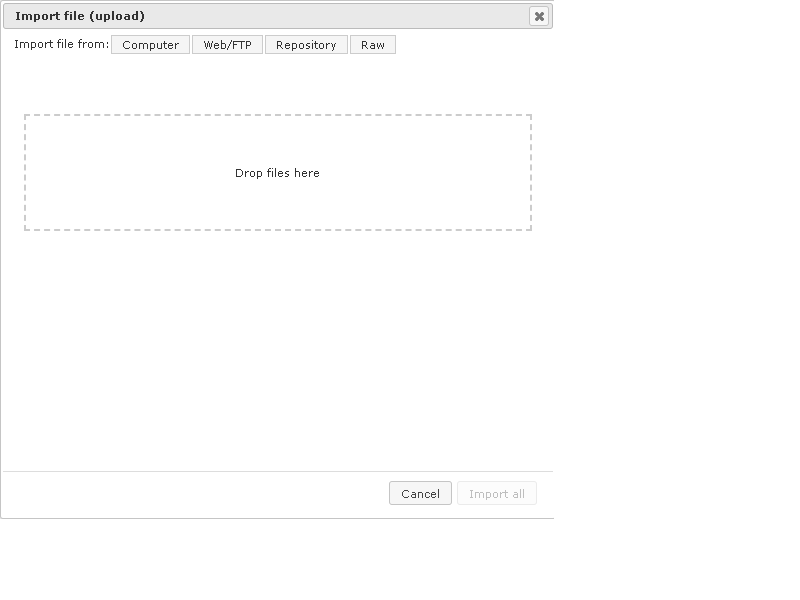
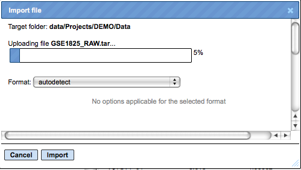
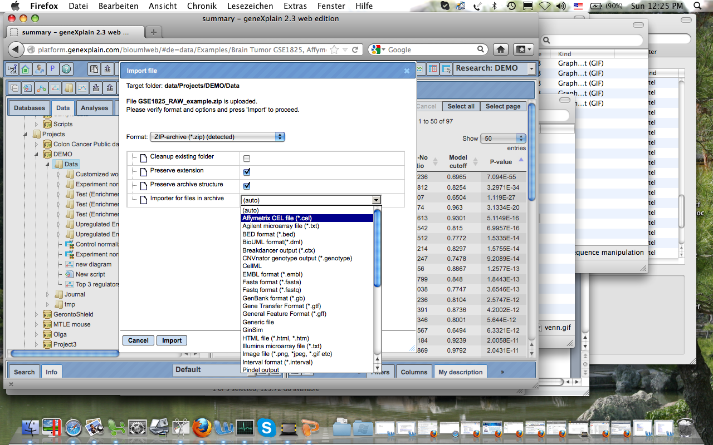
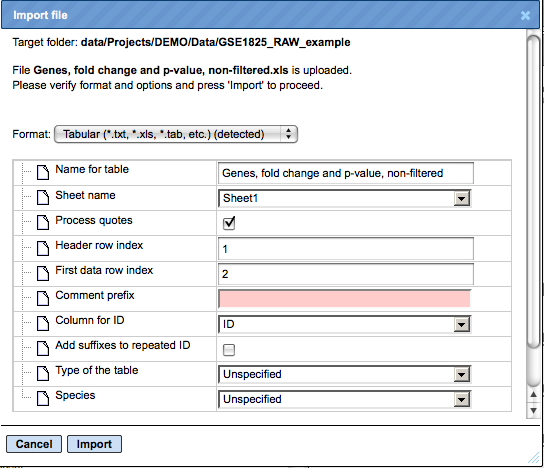
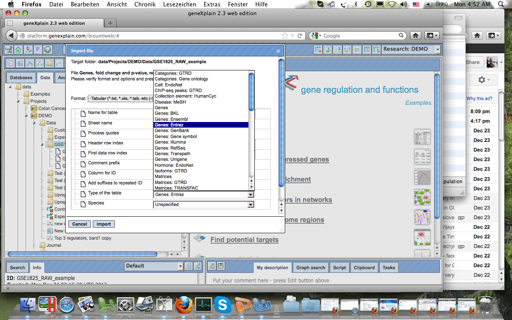
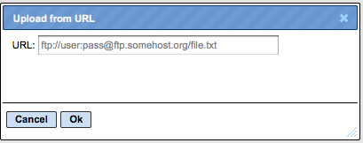
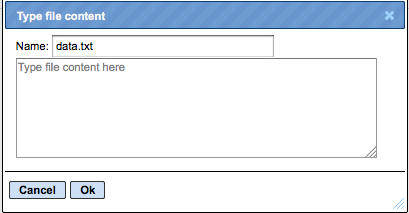

# Load data

The first step is to load your data into the system. This is facilitated by the
first topic listed on the Start page. When you click on the term “Load data”,
another window with the title “Import file” is opened asking you for the file to
upload. By clicking into the topmost field (Target folder), you can select the
place where you want to save the file that you are going to upload. This file
you can select by several options: upload from your computer, import directly
from an FTP address, choose an item from the tree in the geneXplain platform, or
paste data, e.g. a DNA sequence. Use one of the buttons [Computer], [Web/FTP],
[Repository] or [Raw] to start the import.

## Import a file from a local computer

Let us assume you wish to detect differentially expressed genes in your
microarray experiments, which is one of the following workflow groups on the
Start page. In this case, you might be interested to upload an archive (ZIP,
TAR, GZ,…) of several CEL files (when you worked with an Affymetrix platform).
In case of importing raw microarray results, we recommend to create a single ZIP
archive of all files that you plan to normalize together. Please note that
uploading is a lengthy process, and it may take some time. However, if in the
uploading bar you see no progress and just 0% for about 10-15 minutes, please
cancel and start again, it might be that the server was overloaded at that
moment. Wait till the progress bar is completed. The picture below shows an
ongoing uploading.

The uploading step is similar for all file formats. After the uploading step has
been completed, the next step is specific for the file format, and different
forms are displayed for different formats. Here, let’s consider two examples,
loading a ZIP archive with Affymetrix CEL files and loading an Excel table.

### Loading a ZIP archive with Affymetrix CEL files

When the uploading step is complete, additional options will be displayed, as
shown below. The format of the imported file is detected automatically and will
be indicated in field “Format”, in the example below it is ZIP-archive. Verify
the automatic detection and if necessary refine it manually using the drop-down
menu. Next, verify four fields as follows.

In case that here exists already a folder with the same name as the imported
file, it will be replaced by imported data if you activate the check box
“Cleanup existing folder”. Checking the box “Preserve extension” means that
individual CEL files will keep the extension ”.CEL” after importing.

Checking the box “Preserve archive structure” allows you to keep the archive
structure (folders and subfolders) after importing. Next, choose the type of the
files within the imported archive (if an archive is imported), here “Affymetrix
CEL files” row is selected, indicated by the dark blue background in the picture
below. Finally, press the [Import] button.

Each imported archive or individual file will appear in the Data tree of the
Tree Area when import is complete.

### Loading an Excel table

After the uploading step of an Excel table is completed, the following
additional options will be displayed as shown below:

The format of the imported file is detected automatically and is indicated in
the field “Format”. In the figure above it is the Tabular format, which includes
the XLS format among others. Verify the automatically detected format and, if
necessary, refine it manually using the drop-down menu. Next, verify the
following fields.

**Name for table**  – the name of the uploaded Excel table is shown automatically;
you can modify it, and under this name the table will be shown in the tree after
import is completed. “Sheet name” – with the help of the drop-down menu specify
which page of the Excel file should be imported (for Excel files with multiple
pages).

**Header row index** – the number of header rows in the Excel table is detected
automatically, in this example there is one header row. Verify automatic
detection and if necessary correct the number. “First data row index” – the
number of the row where the data start is detected automatically, in this
example the data start in the second row and in the field figure “2” is shown.
Verify automatic detection and, if necessary, correct the number.

**Column for ID** – use the drop-down menu to indicate which column in the
imported table contains unique identifiers. The column “ID” is suggested
automatically. Verify automatic suggestion and refine it as necessary.

**Type of the table** – this field aims to specify what type of IDs are used as
identifiers in the imported Excel table. Use the drop-down menu to specify. In
this example IDs in the Excel table correspond to Entrez gene IDs, and
correspondingly in the figure below “Genes: Entrez” is specified.

**Species** – use the drop down menu to specify the biological species that
corresponds to the IDs.

After that, press the [Import] button, and you can find the imported table in
the tree, under the location specified in the “Import file” form in the field
“Target folder”.

A number of file formats can be defined for import. You find them listed when
opening the “Format” selection list. If you can’t find the required format
explicitly listed, select “Generic file”.

## Uploading data from URL

This option allows you to upload data directly from the web, e.g. by indicating
an FTP address, which is significantly faster in comparison with downloading to
a local computer and then uploading into the geneXplain platform. If your data
are located on a web server, this would be a preferable way of importing.

First, press [Web/FTP] button on the “Import file” form, and indicate the ftp
address in the newly opened form as shown below:

## Paste plain DNA sequence

If you would like to import a plain DNA sequence, not saved in any file before,
first, choose the button [Raw] on the form “Import file”, and a new form will be
opened as shown below:

Paste the DNA sequence in the window “Type file content here”, and in the field
“Name” specify a name as it should appear in the tree after importing.

## Upload SRA files by SRR ID
If you would like to upload data from the Sequence Read Archive (SRA) you can do it directly using the SRR IDs of the respective samples. For this, choose the button [Raw] on the form “Import file”, and paste the SRR IDs of the sample(s) of your interest in one row as shown below:

When you will click on [OK], you will see that the platform has automatically detected the type of your file(s) as Sequence Read Archive files:

Click on [Start] to launch the import.

The Cleanup existing option ticked by default will rewrite any existing SRR files with the same names as the ones being loaded via the current import in your target folder.

When import will be finished, the newly loaded SRR files will appear in the target folder that you have specified in the Target folder field of the form presented above (by default, it will be the Data folder of your project).
