# Metabolism

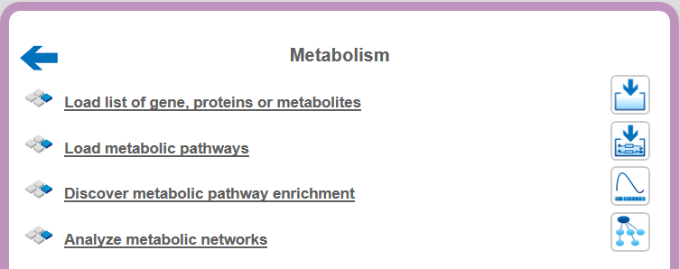

## Analyze metabolic networks

### Find longest metabolic chain

The goal of this analysis is to find longest chains which contain as many
elements from the input collection as possible. Here chain means a path which
starts and ends with the elements from the input collection. In this path the
length between two elements from the input collection is limited by the maximum
search radius. 

This method can be found under the analyses tab using the path
analyses/Methods/Molecular networks/Find longest connected chains.

The input form of the method looks as shown below:

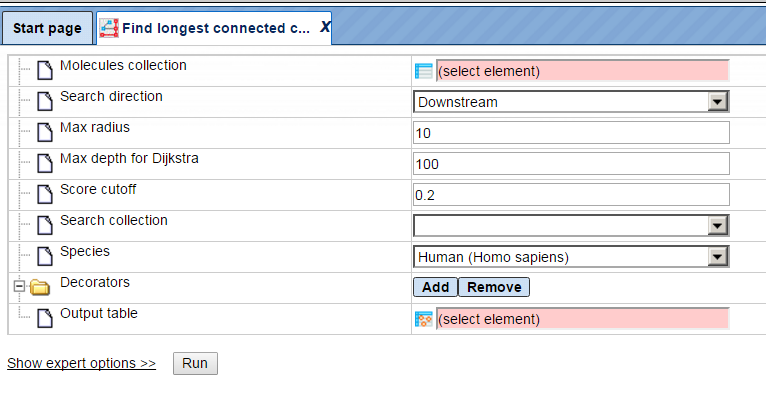

**Step 1**: Specify the **Molecules collection**, which can be any molecule,
protein or gene list.

To specify the input table, you can drag & drop it from your project within the
tree area.

**Step 2**: Specify the **Search direction**, either upstream, downstream
reactions or both directions.

**Step 3**: Selection of **Max**imal search **radius**, the default is 10.

**Step 4**: Selection of **Max**imal **depth** which will be used **by the Dijkstra** search algorithm, the default is 100.

**Step 5**: Specify the **Score cutoff** – Molecules with a Score lower than specified will be excluded from the result.

**Step 6**: Specify the **Search collection**, which can be one of the drop-down menu shown below.

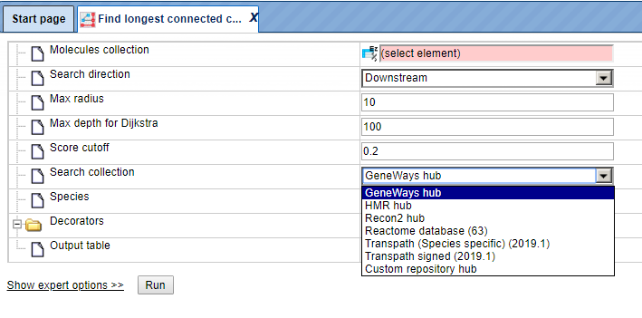

**Step 7**: Specify the biological species of the input set in the field
**Species** by selecting the desired species from the drop-down menu.

**Step 8**: Define where the folder with the results should be located in your
project tree. You can do so by clicking on the pink box (select element) in the
field **Output name**, and a new window will open, where you can select the
location of the results folder and define its name.

**Example:**

data/Examples/Brain Tumor GSE1825, Affymetrix HG-U133A microarray/Data/Ewing
Family Tumor versus Neuroblastoma/Find Master
regulator_Transpath/Upregulated_Ensembl/Regulators upstream 10 Proteins
Transpath peptides

Using all other default parameters, press run and wait for the method to
complete.

The result is a table which opens by default as shown below:

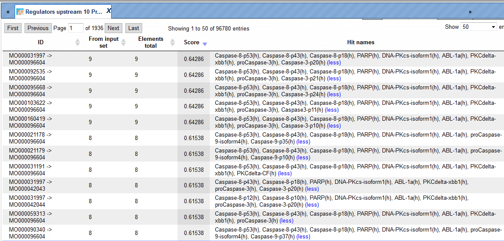

All chains within the radius 10 are included in the results. You can click on
each row and visualize the results as shown below:

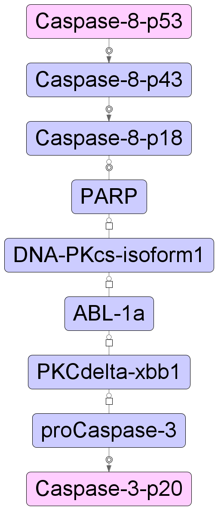

Similarly, other long chains can be visualized from the result table.

### Find metabolic clusters by shortest path

Please refer to the description of the method cluster by shortest path and apply the steps explained there correspondingly.

### Find metabolic clusters by all path

This analysis allows you to generate a cluster of genes/molecules upstream or
downstream or both by taking reactions and all intermediate molecules from a
specified search collection. To launch the analysis, open the method form from
the Start page:

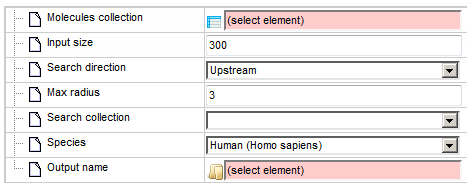

**Step 1**: Specify the **Molecules collection**, which can be any molecule,
protein or gene list.

To specify the input table, you can drag & drop it from your project within the
tree area.

**Step 2**: Select the maximum **Input size** (expert modus).

**Step 3**: Specify the **Search direction**, either upstream, downstream
reactions or both directions.

**Step 4**: Selection of **Maximal search radius**, the default is 3.

**Step 5**: Specify the **Search collection**, which can be one of the drop-down
menu shown below.

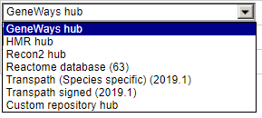

**Step 6**: Specify the biological species of the input set in the field
**Species** by selecting the desired species from the drop-down menu.

**Step 7**: Define where the folder with the results should be located in your
project tree. You can do so by clicking on the pink box (select element) in the
field **Output name**, and a new window will open, where you can select the
location of the results folder and define its name.

### Flux Balance Analysis

To launch this workflow, open the workflow input form from the Start page:

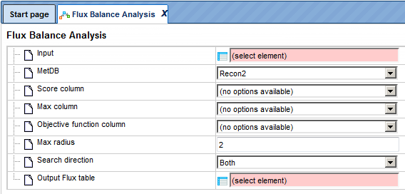

**Step 1**: Specify a gene set under study, e.g. a list of differentially
regulated genes, as the Input Yes gene set. You can drag & drop it from your
project within the Tree Area and drop in the pink box of the field **Input gene
set**.

For this example, all further steps are demonstrated with the following input
set:

(http://platform.genexplain.com/bioumlweb/#de=data/Examples/Brain%20Tumor%20GSE1825%2C%20Affymetrix%20HG-U133A%20microarray/Data/Ewing%20Family%20Tumor%20versus%20Neuroblastoma/Experiment%20normalized%20(RMA)%20(Differentially%20expressed%20genes%20Affy)/Upregulated%20Ensembl%20genes%20filtered%20)

**Step 2**: Specify the metabolism database (**MetDB**) by selecting Recon2 or
HMR from the drop-down menu. As default the Recon2 database is selected.

**Step 3**: Define the **Score column, Max column** and **Objective function
column** by selecting one numerical column from your input table from the drop
down menu.

**Step 4**: Define the **Max radius**, which is the maximal number of steps
within the selected metabolism database. The default value is 2.

**Step 5**: Specify the **Search direction** by selecting from the drop-down
menu; default is both.

**Step 6**: Define where the output table should be located in your project
tree. You can do so by clicking on the pink box (select element) in the field
**Output flux table**, and a new window will open, where you can select the
location of the results table and define its name.

**Step 7**: Press the [Run workflow] button. Wait until the workflow is
completed, and take a look at the results.

### Visualization and interpretation of results

The results consist of several files and one folder:

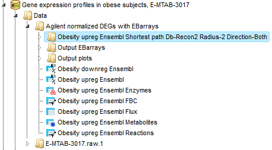

The first step of the workflow is to convert the input genes into enzymes
(output example: Obesity upreg Ensembl Enzymes). Next step is to match the
enzymes with metabolites (output example: Obesity upreg Ensembl Metabolites).
The 634 metabolites are listed in table format with Recon2 IDs.

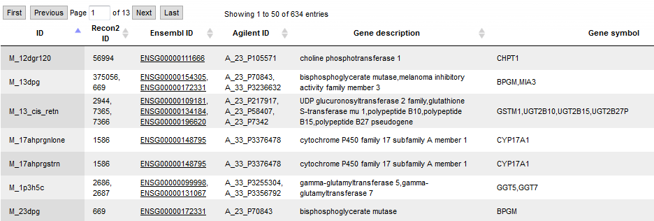

Parallel to the described conversion and match steps, the enzyme list is
converted into an enzyme reaction table (output example: *Obesity upreg Ensembl
Reactions*), and 663 reactions are listed in table format with Recon2 IDs. Then
a Flux Balance Table (*Obesity upreg Ensembl FBC*) is calculated, where the
input parameters **Score column, Max column and Objective function column** are
used. After that, a table with flux data is constructed. From this *Obesity
upreg Ensembl Flux* table, together with the first cluster, a new diagram
(*Cluster 1 flux*) is created, which shows the input proteins from cluster 1
with added and calculated flux information. A screen from the output is shown
below:

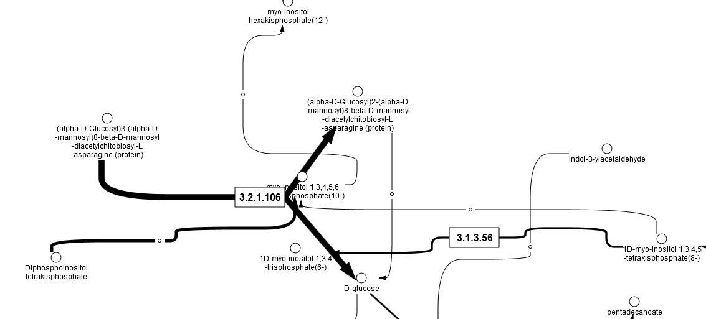

The folder *Obesity upreg Ensembl Shortest path Db-Recon2 Radius-2
Direction-Both* contains all results from the cluster analysis within the
workflow.
