# Microarrays

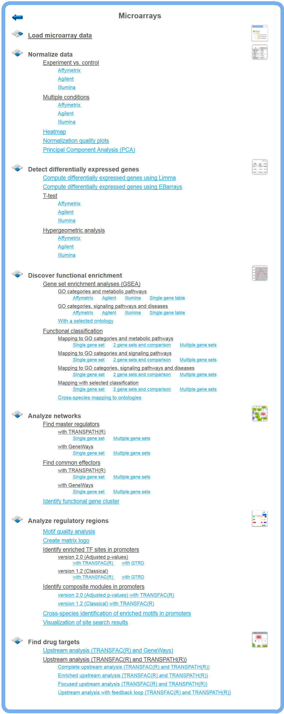

## Normalize data

### Experiment vs. control or multiple conditions

If your expression data haven’t been normalized yet, as we assume in this
example, you have to go now to the second group of options, “Normalize data”.
Make your choice according to the experimental platform you have used
(Affymetrix, Agilent or Illumina). The next form will ask you to define the data
file(s). For this, you have two options:

When you click in either field, a window with the title “Select data element”
opens allowing you to select a file or, more likely at this step, a number of
files by mouse click or by typing their names. Selection by mouse click works as
usual for a range of files (keep the Shift key pressed when selecting the last
file of the range), or for a number of distinct files (keep the Ctrl key pressed
when selecting the second and further files from the list).

Make sure that all hybridizations (i.e., all CEL files) of your experiment are
included into one normalization procedure. It should comprise all CEL files,
including all multiple repetitions, of all conditions to be compared with each
other at a later step, i.e. all tests and controls, at least those that you want
to compare later on.

If your readings were from a dual-channel experiment, please tick the checkbox
(Agilent only).

In the field Output name, you find a suggested name for the output file. The
default name is “Normalized (\<*Normalization_method*\>)”, which you can edit
(just click into this field and change the default name). An accordingly named
file will appear in the Tree Area after the procedure run successfully.

You may also have noticed that some further information about the analyses to be
employed is displayed in both the Info Box as well as in the Operations Field
(“My description” tab). Sometimes, they are identical by default, but in the
latter field, you can edit the contents and add your own comments.

Now launch the normalization routine by pressing the [Run] button. The program
will now normalize all your data across all experiments done, i.e. through all
CEL files selected. The results will be stored in two different tables, one with
the experimental, the other with the control values.

To have a closer look into the full content of one of the results tables, just
click with the right mouse button onto the respective file name in the Tree
Area, and choose “Open table” from the little menu that appears, or double-click
on the file name. The table will open under a new tab in the Work Space. It
should look like this, with the probeset IDs in the first and the normalized
expression values from the different CEL files in the following columns, each
hybridization being represented in one column (picture below).

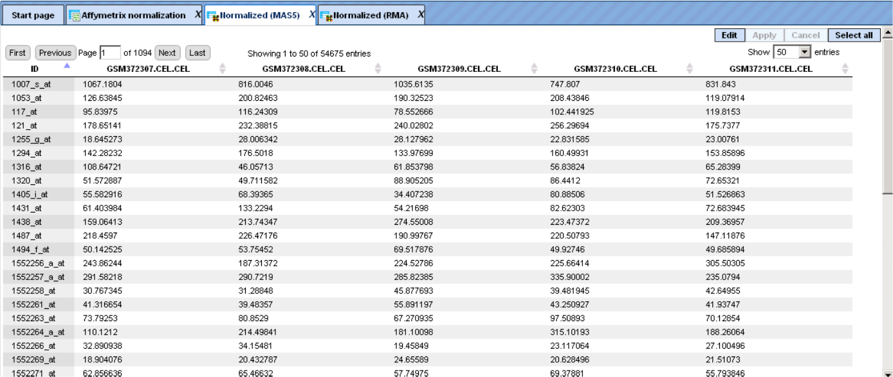

**Important note.** In the geneXplain platform, the probeset IDs are mapped to
genes based on the Ensembl database. If some of the probeset IDs are not
annotated in Ensembl, they cannot be mapped to genes and cannot be used for
further analysis. That means, you can normalize data and calculate
differentially expressed probes. These steps can be done on the probeset ID
level, before conversion to genes. The step of converting probeset IDs into
genes is depending on the annotation provided by the Ensembl database.

### Heatmap

This tool creates a heatmap for the numerical data matrix provided with the
input data table. The heatmap is limited to input tables with at most 5000 input
rows. It is a graphical representation of data where the individual values
contained in a matrix are represented as colors. The output folder contains a
TIFF image of the heatmap as well as the ordered lists of row ids (e.g. RNA or
gene ids) and column ids. The output tables can be used to extract subsets of
correlated rows or columns revealed by the hierarchical clustering and/or the
heatmap presentation.

An example can be found here: 

http://platform.genexplain.com/bioumlweb/#de=data/Examples/Brain%20Tumor%20GSE1825,%20Affymetrix%20HG-U133A%20microarray/Data/Ewing%20Family%20Tumor%20versus%20Neuroblastoma/Normalized%20(RMA)%20subset_heatmap

**Step 1**: Open the workflow input form from the Start page. It will open in
the main Work Space and looks as shown below:

**Step 2**: Specify the **Input table** with e.g. normalized data for different
experimental conditions. To specify the input table, you can drag & drop it from
your project within the tree area.

**Step 3**: Specify the Transformation to be applied to data values from the
drop-down menu. Possible transformations are Log or Rank; the default is None.

**Step 4**: Select **Width** and **Height** as well the **Resolution** of the
output image.

**Step 5**: Specify layout heights (Lhei). This should be a list of 2 (when no
column groups are specified) or 3 (with column groups) float values separated by
comma that adjust the heights of the layout parts. Please refer to the
documentation of R's heatmap.2
{[gplots](https://cran.r-project.org/web/packages/gplots/)} tool for details.

**Step 6**: Please check Row dendrogram and/or Column dendrogram if you want to
have a raw dendogram and/or a dendrogram with column in the output image.

**Step 7**: Specify the conditions/groups names for up to five groups (expert
level).

**Step 8**: Specify the conditions/groups. They are shown as columns of the
input table. You can select the column names for each condition/group via the
drop-down menu.

**Step 9**: Define where the folder with the results should be located in your
project tree. You can do so by clicking on the pink field “select element” in
the field **Output folder**, and a new window will open, where you can select
the location of the results folder and define its name.

Start the method by pressing the [Run workflow] button.

Output are two tables (heatmap_columns and heatmap_genes) and one image file in
.tiff format. This image file needs to be downloaded and can be used in any
graphical program/presentation.

### Normalization quality plots

This tool can be applied plot densities of columns of a data table. As its name
implies the intended use case is to inspect the quality of results of
normalization as conducted in microarray experiments.

Example outputs, a box plot and a density plot, are shown at the end of this
section. Colors were automatically assigned to selected columns.

The input parameters are described in the following.

**Input table**: This table contains the numerical columns to analyze.

**Column subset**: Here you can select the set of columns to show in plots.

Input log-base: Densities and box plots will be computed for data on the log2
scale. Here you can specify the actual scale of the input data. If the log-base
is log2, the tool will use the data values as is.

**Output folder**: The output folder will contain a density plot and a box plot
for the specified columns.

### Principal Component Analysis (PCA)

PCA is a statistical method that transforms data in a way, so that a maximum
amount of variance within the data can be expressed in fewer or, at most, as
many dimensions as the original data. The new dimensions onto which data are
projected are the principal components. They capture the original variance in
decreasing order, so that the first principal component presents most of the
variance. PCA is often used reduce the complexity of (to compress) or to
identify groups in high-dimensional data.

This tool applies PCA to a table of numerical data, e.g. to normalized
microarray measurements. For visualization purposes one can assign columns to
one of up to five groups, which will be differentially colored in the generated
output (scatter plot).

The output is stored in a specified folder and consists of three files. The
**PCA Scatter plot** shows the items of specified groups at their transformed
coordinates according to the first two principal components. The entire set of
coordinates is available in **PCA Transformed coordinates**. Finally, the table
**PCA Component importance** provides information about the relative importance
of each principal component with respect to the proportion of explained
variance.

The input parameters for PCA are described in the following.

**Input table**: This table contains the numerical columns to analyze.

**1-5. Condition / group name**: One can specify up to five groups of columns.
These fields contain the names that will be shown in outputs. Please note that
unnamed groups are not considered, a name is not assigned automatically.

**1-5. Columns**: These fields contain the selected columns. Please note that
column selections are not considered without a corresponding name. Columns can
only be specified once.

**Output folder**: The output folder will contain the described output files.

## Detect differentially expressed genes

After the microarray results are normalized, the next step is to compute
differentially expressed genes (DEG).There are four different statistical
methods provided for DEG calculation in the platform: T-test, hypergeometric
analysis, Limma, and EBarrays. For DEG calculation by T-test and hypergeometric
analysis, there are predefined workflows, which take as input two tables with
the normalized data, for two different conditions, referred to as *Experiment
normalized* and *Control normalized*. The methods Limma and EBarrays require one
input table with all the conditions, and you can specify up to five different
conditions for one run of each of these two methods.

If you applied the normalization method “Experiment vs. control”, you can detect
DEGs applying T-test and/or hypergeometric analysis to the workflows,
highlighted in green in the picture above. If you applied the normalization
method “Multiple conditions”, you can detect DEGs with Limma and/or EBarrays,
highlighted in red.

In this chapter, the predefined workflows for DEG calculation with T-test and
with hypergeometric analysis are described in detail.

### Detect differentially expressed genes with T-test

This workflow is designed to find the set of up-regulated and down-regulated
genes applying Student’s T-test. There are three workflows designed for
different experimental platforms (Affymetrix, Agilent and Illumina).

In the first step p-values for normalized files are calculated for all
probes using the “Up and Down Identification” analysis. This analysis applies
Student’s T-test for p-value calculation, thus the number of data points should
be at least three for each experiment and control.

To launch the workflow, follow these steps:

**Step1.** Open the workflow input form from the Start page. It looks as shown
below:

**Step 2.** Specify the tables with normalized data in the fields **Experiment
normalized** and **Control normalized**. You can drag it from your project
within the tree area and drop it in the pink box of the fields. Alternatively,
you may click on the pink field *(select element)* and a new window will be
opened, where you can select the input tables.

The further steps of the workflow are demonstrated by means of the tables in one
of the pre-prepared examples. You can find these tables in the *Examples*
folder, under data/Examples/Brain Tumor GSE1825, Affymetrix HG-U133A
microarray/Data/Ewing Family Tumor versus Neuroblastoma

**Step 3.** Specify the biological species of the input sets in the field
**Species** by selecting the required biological species from the drop-down
menu.

**Step 4.** Define where the folder with the results should be located in the
tree. You can do so by clicking on the pink field *(select element)* in the
field **Results folder**, and a new window will be opened, where you can select
the location of the results folder and define its name.

After entering all input fields press [Run workflow] and wait till the workflow
is completed.

The output is a folder with several files as shown below: It can be located in the Examples folder by the URL:
[https://platform.genexplain.com/bioumlweb/#de=data/Examples/Brain%20Tumor%20GSE1825%2C%20Affymetrix%20HG-U133A%20microarray/Data/Ewing%20Family%20Tumor%20versus%20Neuroblastoma
/Experiment%20normalized%20(RMA)%20(Differentially%20expressed%20genes%20Affy)]

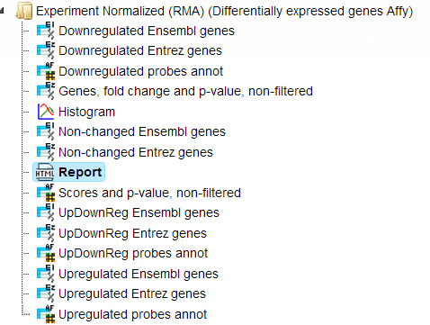

The table **Genes, fold change and P-value, non-filtered**. This table contains
all genes with LogFoldChange and p-value calculated; each row corresponds to one
gene.

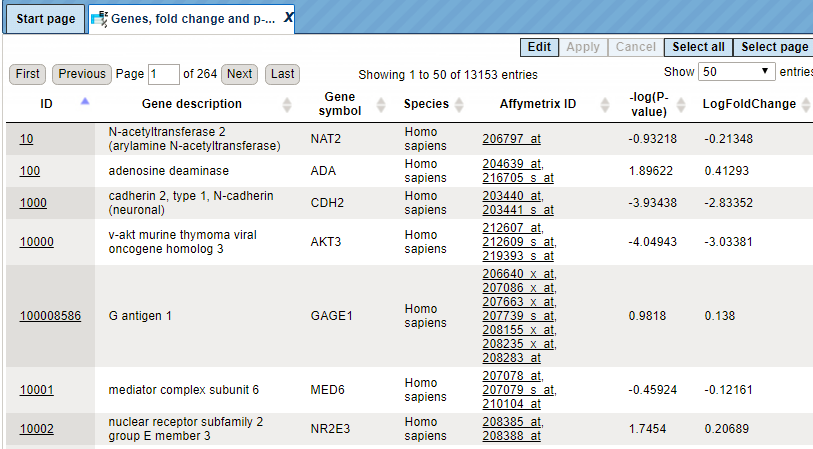

The columns **ID, Gene description** and **Gene symbol** present Entrez
identifiers for the genes, a full name for each gene, and a standard gene
symbol, respectively. The column **Species** shows the corresponding taxonomic
species. The column **AffymetrixID** contains the probe set IDs corresponding to
each gene, and you can see sometimes more than one Affymetrix probe
corresponding to one gene. The column **LogFoldChange** shows the base 2
logarithm of the ratio between expression value in experiment vs. control. The
column **–log(P-value)** shows the negative base 10 logarithm of the *p*-value.

Please note that the column **–log(P-value)**, according to a widely accepted
convention, has algebraic signs according to being up- (positive values) or
down-regulated (negative values).

In the course of worklow progression, this table has been filtered by several
conditions in parallel to identify up-regulated, down-regulated, and non-changed
Affymetrix probeset IDs and genes.

The filtering criteria used are:

-   For up-regulated probes: LogFoldChange\>0.5 and -log_P_value_\>3

-   For down- regulated probes: LogFoldChange\<-0.5 and -log_P_value_\<-3

-   For non-changed genes : LogFoldChange\<0.002 and LogFoldChange\>-0.002

The table **Upregulated Ensembl genes**. You can find the number of the
resulting up-regulated genes written on top of each output table (highlighted by
the red circle):

The table **Downregulated Ensembl genes**. The structure and the meaning of the
columns in the tables are the same as in the Upregulated Ensembl genes table.

The table **Non-changed Ensembl genes**.

In this example the number of up-regulated, down-regulated and non-changed genes
are 503, 241, and 99, respectively.

These individual output files can be used further as input for running other
workflows as described in the following sections.

The plot () contains a histogram of the log fold change distribution for all genes:

**The Report.** The workflow summarizes all results and automatically produces a
report. In addition you can have a look at the list of both up-regulated and
down-regulated genes.

This report can be exported in html format.

### Detect differentially expressed genes by hypergeometric analysis

This workflow is very similar to the workflow Detect differentially expressed genes by T-test.  The principal difference is in the statistical method for calculation of thep-value. In this workflow, the p-value is calculated by hypergeometric analysis
(Y.V.Kondrakhin, R.N.Sharipov, A.E.Kel, F.A.Kolpakov. (2008) Identification of
Differentially Expressed Genes by Meta-Analysis of Microarray Data on Breast
Cancer, *In Silico Biology*, 8: 383-411).

Tip If you have just two or even one data point in each experiment and control
(e.g. one CEL file in experiment and one CEL file in control), you can apply
hypergeometric analysis to calculate DEGs. In contrast to the T-test which
requires at least three data points, hypergeometric analysis can make
calculations for two and even one data point in each normalized experiment and
normalized control files. This allows to calculate DEGs to compare, for
instance, one patient data set with one healthy data set.

The workflow input form looks as shown below:

The output folder and the structure of the individual tables, as well as the
report, are similar to those described Detect differentially expressed genes throught T-test.

### Detect differentially expressed genes with Limma

This workflow is designed to find sets of up-regulated and down-regulated genes
starting with the normalized table of your expression data. Please refer to
method description to know about LIMMA.  This workflow is
designed for different experimental platforms (Affymetrix, Agilent and
Illumina).

In the first step this workflow computes the differential expression between up
to five conditions / groups. Each group corresponds to one experimental
condition (time point, treatment, cell type, etc.) or control. You can specify 2
to 5 conditions. An input table is a data table that contains several columns
with normalized measurement values, e.g. from a normalized microarray
experiment. All possible contrasts between groups are considered and their
output is stored in a common folder. Conditions are compared in the specified
order from first to fifth; e.g. for the given conditions named 1, 2 and 3, the
output will contain the contrasts “Condition 1 versus Condition 2”, Condition 1
versus Condition 3” and “Condition 2 versus Condition 3”. ”. The workflow can be
found on the Start page, under the button Microarrays, under the section “Detect
differentially expressed genes”.

**Step1.** Open the workflow input form from the Start page. It looks as shown
below:

**Step 2.** Specify the table with normalized data in the field **Input table**.
You can drag it from your project within the tree area and drop it in the pink
box of the fields. Alternatively, you may click on the pink field *(select
element)* and a new window will be opened, where you can select the input table.

For this example the input used can be found here:
[https://platform.genexplain.com/bioumlweb/#de=data/Examples/Cytokine-triggered%20gene%20expression%20in%20cell%20cycle%20stages%2C%20GSE52465%2C%20Agilent-014850%20microarray/Data/GSE52465_RAW/Agilent%20normalized]

**Step 3.** Specify the biological species of the input table in the field
**Species** by selecting it from the drop-down menu.

**Step 4.** Specify the conditions / groups. They are shown as columns of the
input table. You can select the column names for each condition/group via
drop-down menu.

**Step 5.** Define where the folder with the results should be located in the
tree. You can do so by clicking on the pink field (select element) in the field
**Results folder,** and a new window will be opened, where you can select the
location of the results folder and define its name.

After entering all input fields press [Run workflow] and wait till the workflow
is completed. The output is a folder with 10 result folders (e.g. *Condition_1
vs. Condition_2* for DEG calculation), a folder for each individual comparison
(*Output limma*) and one *Output plots* folder, as shown below:

[https://platform.genexplain.com/bioumlweb/#de=data/Examples/Cytokine-triggered%20gene%20expression%20in%20cell%20cycle%20stages,%20GSE52465,%20Agilent-014850%20microarray/Data/Agilent%20normalized%20DEGs%20with%20limma]

The **Normalized density boxplot** and the **Normalized density plot** in the
folder *Output plots* show a quality control of the input normalized data table.

The tables in the folder *Output limma* are the output tables from the limma
method, sorted via adjusted p-values.

The 10 output folders for each comparison e.g. Condition_1 vs. Condition_5
contain the results of the identified up-, down- and non-regulated Ensembl
genes.

The table **UpDown reg genes Ensembl** in the Folder *Condition_1 vs.
Condition_5* contains all differentially expressed genes filtered by
LogFoldChange and p-value for up- and down-regulated genes; each row corresponds
to one gene.

The columns **ID, Gene description** and **Gene symbol** represent Ensembl
identifiers for the genes, a full name for each gene, and a standard gene
symbol, respectively. The column **Species** shows the corresponding taxonomic
species. The column **AffymetrixID** contains the probe set IDs corresponding to
each gene, and you can see sometimes more than one Affymetrix probe
corresponding to one gene. The column **logFC** shows the base 2 logarithm of
the ratio between expression values in experiment vs. control. The column
**adj.P.Val** shows the adjusted *p*-value (Benjamini-Hochberg).

In the course of workflow progression, this table has been filtered by several
conditions in parallel to identify up-regulated, down-regulated, and non-changed
probeset IDs that were then converted into Ensembl gene identifiers.

The filtering criteria used are:

-   For up-regulated genes: logFC \>0.5 and adj.P.Val \<0.05

-   For down- regulated genes: logFC \<-0.5 and adj.P.Val \<0.05

-   For non-changed genes :logFC \<0.002 and logFC \>-0.002

### Detect differentially expressed genes with EBarrays

Similarly to the workflow described above, this workflow is designed to find the
set of up-regulated and down-regulated genes starting with a normalized table of
your expression data, but using a different statistical method, EBarrays. Please
refer to method description for description of this method. This
workflow is designed for different experimental platforms (Affymetrix, Agilent
and Illumina).

In the first step the workflow computes the differential expression between up
to five conditions/groups. Each group corresponds to one experimental condition
(time point, treatment, cell type, etc.) or control. You can specify 2 to 5
conditions. An input table is a data table that contains normalized measurement
values, e.g. from a normalized microarray experiment. All possible contrasts
between groups are considered and their output is stored in a common folder.
Conditions are compared in the specified order from first to fifth. E.g. given
conditions named 1, 2 and 3, the output will contain the contrasts “Condition 1
versus Condition 2”, Condition 1 versus Condition 3” and “Condition 2 versus
Condition 3”.

The workflow can be found on the Start page, under the button Microarrays, under
the section “Detect differentially expressed genes”.

**Step1.** Open the workflow input form from the Start page. It looks as shown
below:

**Step 2.** Specify the table with normalized data in the field **Input table**.
You can drag it from your project within the tree area and drop it in the pink
box of the fields. Alternatively, you may click on the pink field *(select
element)* and a new window will be opened, where you can select the input table.

Input used for this Example can be found here:
[https://platform.genexplain.com/bioumlweb/#de=data/Examples/Cytokine-triggered%20gene%20expression%20in%20cell%20cycle%20stages%2C%20GSE52465%2C%20Agilent-014850%20microarray/Data/GSE52465_RAW/Agilent%20normalized]

**Step 3.** Specify the biological species of the input table in the field
**Species** by selecting it from the drop-down menu.

**Step 4.** Specify the conditions/groups of the input table. You can select the
column names for each condition/group via drop-down menu.

**Step 5.** Define where the folder with the results should be located in the
tree. You can do so by clicking on the pink field *(select element)* in the
field **Results folder**, and a new window will be opened, where you can select
the location of the results folder and define its name.

After entering all input fields press [Run workflow] and wait till the workflow
is completed.

The output is a folder with several result folders and files as shown below:

[https://platform.genexplain.com/bioumlweb/#de=data/Examples/Cytokine-triggered%20gene%20expression%20in%20cell%20cycle%20stages,%20GSE52465,%20Agilent-014850%20microarray/Data/Agilent%20normalized%20DEGs%20with%20EBarrays]

The **Normalized density boxplot** and the **Normalized density plot** in the
folder *Output plots* show a quality control of the input normalized data table.

The table EBarrays result and two plots in the folder *Output EBarrays* are the
output table and plots from the EBarrays method.

The tables for each condition (except control) e.g. **Condition_2 downreg
Ensembl** and **Condition_2 upreg Ensembl** contain all differentially expressed
genes with filtered LogFoldChange and p-value for up- and down-regulated genes;
each row corresponds to one gene.

The columns **ID, Gene description** and **Gene symbol** present Ensembl
identifiers for the genes, a full name for each gene, and a standard gene
symbol, respectively. The column **Species** shows the corresponding taxonomic
species. The column **Agilent ID** contains the probe set IDs corresponding to
each gene, and you can see sometimes more than one Affymetrix probe
corresponding to one gene. The direction of differential expression can be
derived from the fold change column e.g. **Condition_2 FC**, which contains the
log2-fold changes. The EBarrays method estimates a critical posterior
probability cutoff for the given FDR level on the basis of the fitted mixture
model. Probes / genes exceeding this cutoff in some treatment are indicated by a
value of 1 (instead of -1) in the output column named e.g. **Condition_2 Sig**.

In the course of workflow progression, this table has been filtered by several
conditions in parallel to identify up-regulated and down-regulated genes.

The filtering criteria used are:

-   For up-regulated genes: Condition_x FC \>0.5 and Condition_x Sig = 1

-   For down- regulated genes: Condition_x FC \<-0.5 and Condition_x Sig = 1

In the folder *Output plots* there are two diagnostic plots named **EBarrays
CCV** and **EBarrays Marginal fit**. These plots enable a judgment about whether
the assumptions of the approach hold and how well the fitted model represents
the data (please refer to the documentation of the EBarrays Bioconductor package
for further details).

**Note.** In the input field Condition 1 always the control condition should be
specified. Each of the input conditions 2, 3, 4, and 5 are compared with
condition 1.

## Discover functional enrichment

This set of workflows helps to identify certain functional groups in your input
list of genes or proteins, namely those that are particularly affected in a
statistically significant manner.

The first approach to do this is the Gene Set Enrichment Analysis (GSEA).
Applying this method to genes/protein in focus, the workflows will find out
whether any category of Gene Ontology (GO), Reactome pathways, TRANSPATH®
pathways or HumanPSD™ disease terms are statistically overrepresented among
them, and if so, whether this overrepresentation is valid for the up- or
down-regulated genes if expression values are present in your input table.

An alternative approach to GSEA is Functional classification, or mapping to
ontologies. As input, you can use a table of genes/proteins. The difference of
this option to GSEA is that no enrichment of the categories is calculated, but
that all genes in the list are mapped to GO categories or other ontologies. For
example, you can use tables with up-regulated or down-regulated genes coming
from the previous analysis steps of microarray or RNA-seq experiments, or
proteins identified in proteomics experiments, the lists of genes located nearby
of ChIP_seq peaks, etc.

### Gene Set Enrichment Analysis (GSEA)

There are two types of workflows, depending on the format of the input tables.
You can start the GSEA with the normalized microarray tables, before calculating
DEGs. The program first computes fold changes, which are then used to
dynamically detect functional groups of genes that are differentially affected
by the experimental conditions.

Alternatively, you can start the GSEA with any gene or protein table having a
numerical column that can be used for enrichment calculations, e.g. expression
fold change after calculating DEGs.

#### GSEA by GO categories and metabolic pathways

Gene set enrichment analysis (GSEA) with GO categories or with metabolic pathway
annotation in REACTOME can be done by either starting from raw data of any of
the widely used experimental platforms (Affymetrix, Agilent, or Illumina), or
from a single gene table that you may have composed yourself.

##### Affymetrix, Agilent, or Illumina data sets

The three workflows under this category are designed to perform the GSEA by the
three branches of Gene Ontology, biological process, molecular function and
cellular component as well as by the Reactome pathways:

-   Gene Set Enrichment Analysis (Affymetrix probes),

-   Gene Set Enrichment Analysis (Agilent probes),

-   Gene Set Enrichment Analysis (Illumina probes).

Each of the three workflows differs in the format of the input data, for
Affymetrix, Agilent or Illumina microarray platforms, respectively. The analysis
performed by these workflows and the interpretation of the results are the same.
As an example, let’s consider an Affymetrix-specific workflow.

To launch the workflow, follow these steps:

Step1. Open the workflow input form from the Start page. It opens in the main
Work Space and looks as shown below:

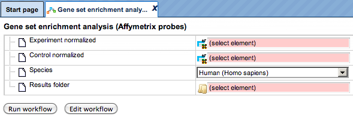

Step 2. Input the Experiment normalized and Control normalized tables from the
tree. You can either drag-and-drop or click on the select element box to specify
the tables in the Tree area. Here, the tables from the Example folder/ HCV
infection in liver GSE31193, Affymetrix U133 Plus 2.0 are used. We aim to find
out the enriched functional categories of gene expression upon treatment with
IFN type III after 24 hours versus non-treated cells. Below are the links to the
input files:

[https://platform.genexplain.com/bioumlweb/#de=data/Examples/HCV%20infection%20in%20liver%20GSE31193%2C%20Affymetrix%20U133%20Plus%202.0%20microarray/Data/GSE31193_RAW/Experiment%20normalized%20(RMA)]

[https://platform.genexplain.com/bioumlweb/#de=data/Examples/HCV%20infection%20in%20liver%20GSE31193%2C%20Affymetrix%20U133%20Plus%202.0%20microarray/Data/GSE31193_RAW/Control%20normalized%20(RMA)]

It is important to note that for this workflow, the input tables should have
Affymetrix probeset IDs in the ID column. Such tables have an () icon in the tree area and look like:

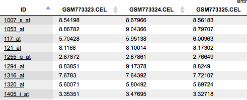

You can see Affymetrix probeset IDs in the ID column, and several columns with
the normalized values; each column corresponds to one CEL file.

Step 3. Choose human, mouse, or rat species from the drop-down menu.

Step 4. Specify location and name of the Results folder. Important: the results
folder should be located in your *Project* in the tree.

Step 5. Press the button [Run workflow] and wait till the workflow is completed.

**Results**

The results folder contains four tables with the results of the enrichment
analysis divided by the three branches of Gene Ontology, biological process, molecular
function and cellular component, as well as by the Reactome pathways. Path to
the current output folder is:

data/Examples/HCV infection in liver GSE31193, Affymetrix U133 Plus 2.0
microarray/Data/Experiment normalized (RMA) vs Control normalized (RMA)
(Enrichment analysis Affy)

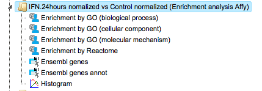

The tables with the enriched categories look like:

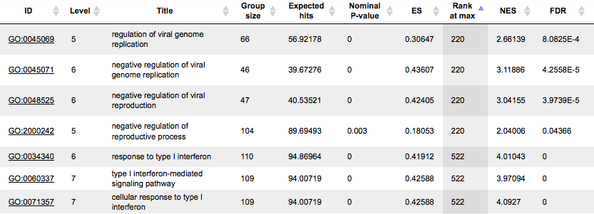

The GSEA results are described in details in a separate section below.

The table *Ensembl genes annot* contains Ensembl genes as a result of Affymetrix
IDs convertion into Ensembl gene IDs:

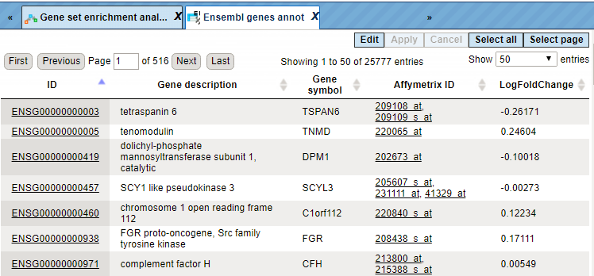

For each gene, gene symbol, gene description, and Affymetrix probeset ID are
shown. Additionally, the LogFoldChange value is calculated for each gene.

The distribution of LogFoldChange values is shown in the Histogram:

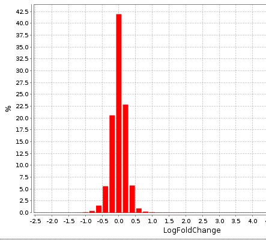

##### GSEA by GO categories and metabolic pathways for a single gene table

This workflow performs the GSEA divided by the three branches of Gene Ontology,
biological process, molecular function and cellular component, as well as by the
Reactome pathways, for any input gene or protein table. It is important to note
that such a table should have a column which can be used as a weight column for
enrichment, e.g. expression value.

To launch the workflow, follow these steps:

Step1. Open the workflow input form from the Start page. It opens in the main
Work Space and looks as shown below:

Step 2. Input a gene table with FoldChange (LogFoldChange) calculated. You can
either drag-and-drop or click on the select element box to specify the table in
the Tree area. Here, the table from the Example folder/HCV infection in liver
GSE31193, Affymetrix U133 Plus 2.0 is used. We aim to find out the enriched
functional categories of gene expression upon treatment with IFN type III after
24 hours versus non-treated cells.

The input table may look like the one shown below. This table contains the
column logFC (LogFoldChange). This table is an output of the Limma method. Input
table used for this example can be accessed using the URL:

<https://platform.genexplain.com/bioumlweb/#de=data/Examples/HCV%20infection%20in%20liver%20GSE31193%2C%20Affymetrix%20U133%20Plus%202.0%20microarray/Data/IFN%2024h%20vs%20Control/IFN.24hours%20vs%20Control%20Genes%20Ensembl>

For best GSEA results, input the table with all genes analyzed, e.g. all genes
present on the chip in the microarray experiment.

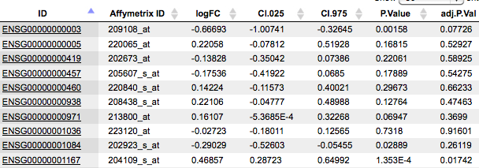

Step 3. As soon as you specified the input table, the drop-down menu in the
field Enrichment Weight Column becomes active. It presents all numerical columns
in the input table. Select which column should be used for enrichment
calculations. Here, the column *logFC* is selected.

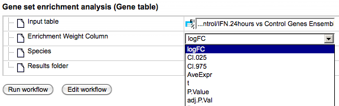

Step 4. Choose human, mouse, or rat **species** from the drop-down menu.

Step 5. Specify location and name of the **Results folder**. It is important to
note that the results folder should be located in your *Project* in the tree.

Step 5. Press the button [Run workflow] and wait till the workflow is completed.

**Results**

The results folder contains four tables with the results of the enrichment
analysis corresponding to the three branches of Gene Ontology, biological process,
molecular function and cellular component as well as by the Reactome pathways.

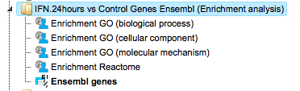

The GSEA results are described in detail in a separate section “**About the GSEA
analysis and the interpretation of the results**”. The output folder can be
accessed through the path:

data/Examples/HCV infection in liver GSE31193, Affymetrix U133 Plus 2.0
microarray/Data/IFN 24h vs Control/IFN.24hours vs Control Genes Ensembl

#### GSEA by GO categories, signaling pathways and diseases

Also, this type of gene set enrichment analysis (GSEA) can be done by either
starting from raw data of any of the widely used experimental platforms
(Affymetrix, Agilent, or Illumina), or from a single gene table that you may
have composed yourself.

##### Affymetrix, Agilent and Illumina microarrays

The three workflows under this category are similar to the workflows described
above in the 1st part, requiring exactly the same two normalized input tables,
and the same steps to launch these workflows. The difference is in the
ontologies applied. The three workflows under this category are designed to
perform a GSEA utilizing the three branches of the HumanPSD™-curated gene
ontology, HumanPSD™ biological process, HumanPSD™ molecular function and
HumanPSD™ cellular component as well as the TRANSPATH® pathways:

-   Gene Set Enrichment Analysis HumanPSD (Affymetrix probes),

-   Gene Set Enrichment Analysis HumanPSD (Agilent probes),

-   Gene Set Enrichment Analysis HumanPSD (Illumina probes).

The GSEA results are described in detail in a separate section “About the GSEA
analysis and the interpretation of the results”.

**Note.** This workflow is available together with a valid HumanPSD™/TRANSPATH®
license. Please feel free to ask for details (info\@genexplain.com).

##### Single gene table

This workflow is similar to the GSEA by GO categories workflow, it requires
exactly the same format of the input table, and the steps to launch this
workflow are the same. The difference is in the ontologies applied. This
workflow is designed to perform a GSEA utilizing the three branches of the
HumanPSD™-curated gene ontology, HumanPSD™ biological process, HumanPSD™
molecular function and HumanPSD™ cellular component, as well as the TRANSPATH®
pathways.

The GSEA results are described in detail in a separate section “**About the GSEA
analysis and the interpretation of the results”.**

**Note.** This workflow is available together with a valid HumanPSD™/TRANSPATH®
license. Please feel free to ask for details (info\@genexplain.com).

#### GSEA with a selected ontology

This workflow performs a GSEA with one selected ontology for an input gene or
protein table. It is important to note that such a table should have a numerical
column which can be used as a weight column for enrichment, e.g. expression
value or fold change.

To launch the workflow, follow these steps:

**Step1.** Open the workflow input form from the Start page. It opens in the
main Work Space and looks as shown below:

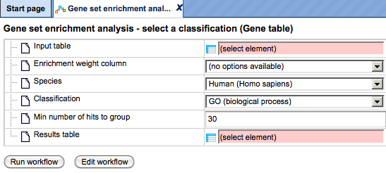

**Step 2**. Input a gene table with FoldChange (LogFoldChange) calculated. You
can either drag-and-drop or click on the select element box to specify the table
in the Tree area. Here, the table from the Example folder/ HCV infection in
liver GSE31193, Affymetrix U133 Plus 2.0 is used. We aim to find out the
enriched functional categories of gene expression upon treatment with IFN type
III after 24 hours versus non-treated cells.

The input table may look like the one shown below. This table contains the
column logFC (LogFoldChange). This table is an output of the Limma method.

For the best GSEA results, input the table with all genes analyzed, e.g. all
genes present on the chip in the microarray experiment.

Step 3. As soon as you specified the input table, the drop-down menu in the
field Enrichment Weight Column becomes active. It presents all numerical columns
in the input table. Select which column should be used for enrichment
calculations. Here, the column *logFC* is selected.

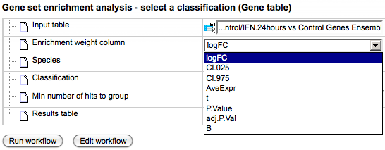

Step 4. Choose human, mouse, or rat species from the drop-down menu.

Step 5. In the field Classification, choose the ontology from the drop-down
menu. Here, GO biological process is selected.

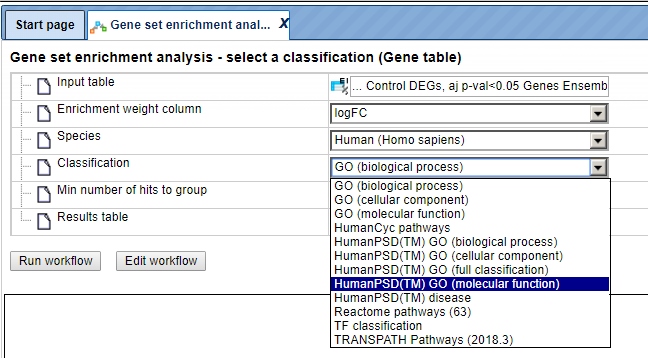

Step 6. Define a minimal number of hits in one group which you would like to
consider in the field Min number of hits to group. By default it is 30.

Step 7. Specify location and name of the Results folder. Please note that the
results folder should be located in your *Project* in the tree.

Step 5. Press the button [Run workflow] and wait till the workflow is completed.

**Results**

The results folder contains one table with the results of the enrichment
analysis () by the selected ontology. It can be accessed using the URL:

<https://platform.genexplain.com/bioumlweb/#de=data/Examples/HCV%20infection%20in%20liver%20GSE31193%2C%20Affymetrix%20U133%20Plus%202.0%20microarray/Data/IFN%2024h%20vs%20Control/IFN%2024h%20vs%20Control%20DEGs%2C%20aj%20p-val%3C0.05%20Genes%20Ensembl%20(Enrichment%20analysis%20GO%20(biological%20process))>

The GSEA results are described in detail in a separate section “**About the GSEA
analysis and the interpretation of the results”.**

### Functional classification

An alternative approach to GSEA is another group of workflows, Functional
classification, which comprises several “Mapping to ontologies” workflows. The
difference of this option to GSEA is that no enrichment of the categories is
calculated, but that all genes in the list are mapped to GO categories or other
ontologies. For example, you can use tables with pre-calculated up-regulated or
down-regulated genes, as they are obtained as output of the workflow “Detect
differentially expressed genes”, and use these as input into the workflows
„Mapping to ontologies “.

The output tabulates which and how many genes from your list (“hits”) fall into
which category, how many known genes are in this category, how many hits would
have been expected by chance, and what the P-value for the found number of hits
being obtained by chance is.

The difference between the workflows within this group is in the ontologies
applied as well as in the number of input tables.

#### Mapping to GO categories and metabolic pathways

##### Single gene or protein table

This workflow is designed to classify an input gene set based on several
ontologies, and to identify terms hits for which are overrepresented in the
input set. The input file can be any gene or protein table. There is only one
obligatory column, the column with gene or protein IDs; all other columns are
optional.  In the first step, the input table is converted into a table with Ensembl Gene
IDs. This table with Ensembl Gene IDs is subjected to a functional
classification.

To launch the workflow, follow these steps:

Step 1. Open the workflow input form from the Start page. It looks as shown
below:

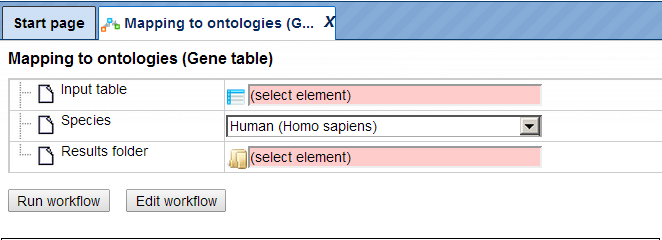

Step 2. Specify the input table. The input gene set might be a list of
differentially regulated genes or any gene or protein list of interest. You can
drag it from your project within the tree area and drop it in the pink box of
the field Input table. Alternatively, you may click on the pink field “select
element” and a new window will be opened, where you can select the input gene
set as shown below.

The further steps of the workflow are demonstrated for the genes shown to be
up-regulated in one of the pre-prepared examples. The pertinent example file can
be found in the geneXplain platform under:

<https://platform.genexplain.com/bioumlweb/#de=data/Examples/Brain%20Tumor%20GSE1825%2C%20Affymetrix%20HG-U133A%20microarray/Data/Ewing%20Family%20Tumor%20versus%20Neuroblastoma/Experiment%20normalized%20(RMA)%20(Differentially%20expressed%20genes%20Affy)/Upregulated%20Ensembl%20genes>

Step 3. Specify the biological species of the input set in the field Species by
selecting the required biological species from the drop-down menu.

Step 4. Define where the folder with the results should be located in the tree.
You can do so by clicking on the pink field *select element* in the field
Results folder, and a new window will be opened, where you can select the
location of the results folder and define its name.

Step 5. Press the [Run workflow] button.

The workflow is running as shown below, wait till it is completed.

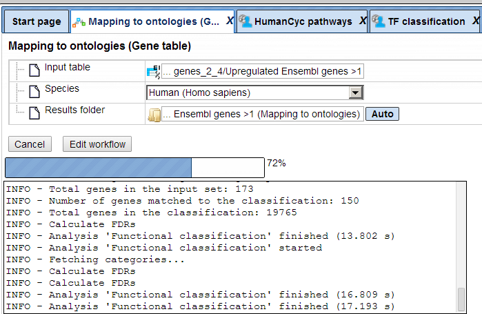

The results folder can be found in the examples folder under the path :

 data/Examples/Brain Tumor GSE1825, Affymetrix HG-U133A microarray/Data/Ewing
Family Tumor versus Neuroblastoma/Upregulated Ensembl genes (Mapping to
ontologies)

It contains several tables with the resulting mapping, one table each for the
applied ontological groups (), as well as one gene table
() as shown below.

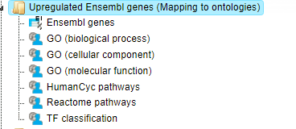

When the workflow is completed, all output tables are opened by default.

Let’s consider the output tables.

Mapping to the three GO branches, biological processes, cellular components, and
molecular functions (). The tables with the enriched categories look like:

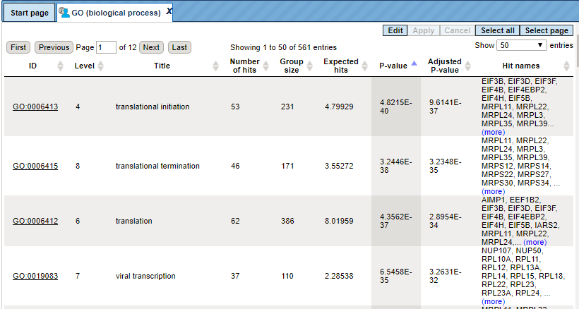

Each row presents details about one ontological term. The column ID comprises
the identifier of the ontological category, here identifiers of Gene Ontology
biological process terms. These identifiers are hyperlinked to the page
http://www.ebi.ac.uk/QuickGO/ where you can get further information about this
ontological term.

The columns Title and Group size contain further details about the ontological
terms, its title and the number of genes linked to this term in the
corresponding database, here in GO. The column Expected hits shows the number of
genes expected to fall into this category by random chance, based on the size of
the input set and the size of the category. The column Number of hits shows how
many genes from the input table fall into this category. **P-**value and
Adjusted p-value are calculated for the difference between expected and real
numbers of hits. The genes mapped to each category are explicitly listed in the
column Hit names. As the lists can get quite long, only a few genes are shown by
default in each row. To get the full list, press [more].

Tip The hits for one or several selected rows can be saved as a separate gene
table. This can be done with the button *Save hits* in the top control menu.
Such genes tables can be analyzed further, e.g. to find master regulatory
molecules in the networks, and to identify transcription factors that might
commonly regulate these genes.

The table HumanCyc pathways (). In the column ID the identifiers of the HumanCyc pathways are given. Upon a mouse click, a diagram of the corresponding metabolic pathway opens in the
workspace:

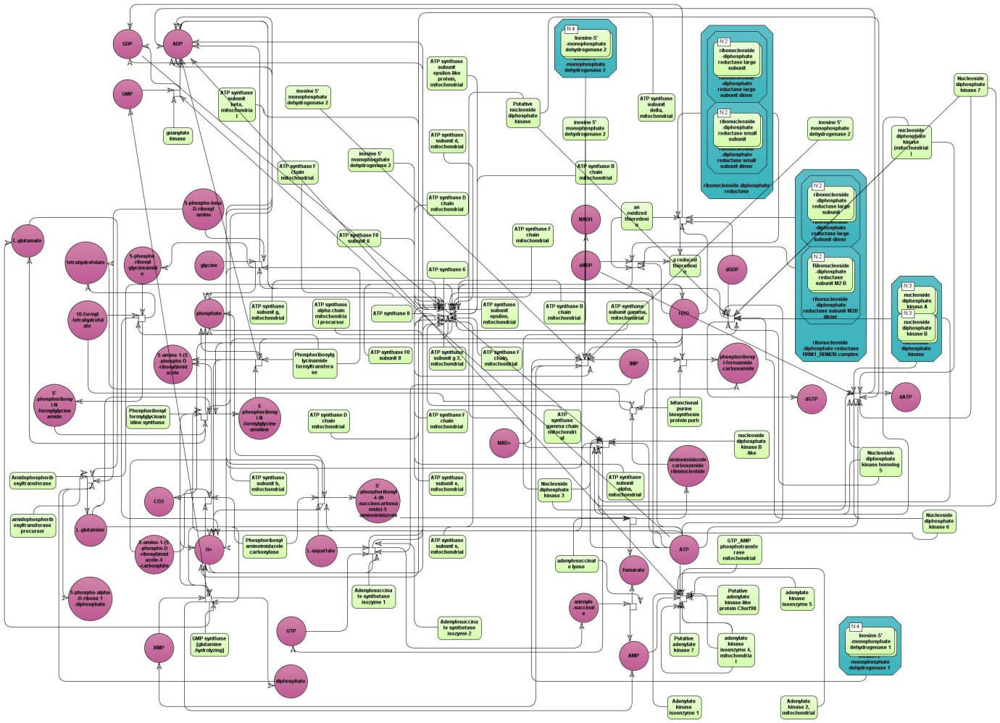

The table Reactome pathways (). In the column ID you can find the identifiers of the Reactome pathways.

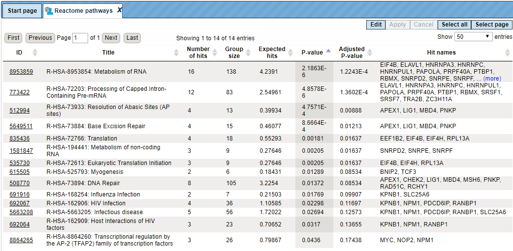

Upon a mouse click, a diagram of the corresponding pathway opens in the
workspace.

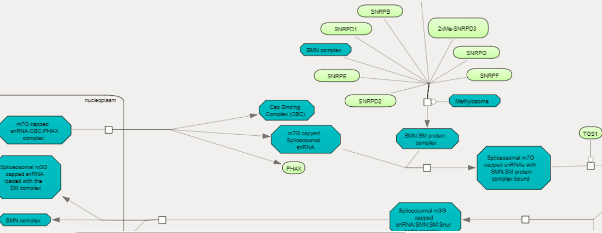

The table TF classification (). Your input table is mapped to the classification of Transcription factors (*Nucleic Acids Res. 41, D165-D170 (2013)*), which is also integrated in the
platform. In the column ID the identifiers of the TF classification are shown.
They are hyperlinked to the corresponding classification categories.

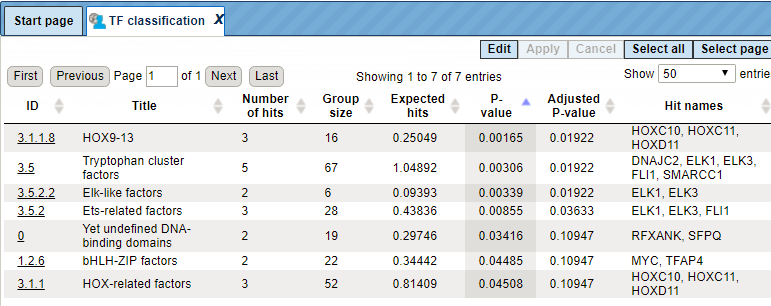

**The table Ensembl genes** (

). The input gene or protein table is converted to a table with Ensembl gene
IDs, and the result is shown in this table. For example, if your input was a
table with UniProt IDs, it is converted into Ensembl gene IDs and included in
the results folder of this workflow.

##### Gene sets and comparison

This workflow is designed to map two input tables to all Gene Ontology
categories (*biological process*, *molecular function* and *cellular component*)
to identify terms hits and to compare the results. While the workflow described
above allows for selecting one particular ontology, this workflow runs three
branches of the GO ontology in parallel, and the comparison between two gene
sets is done regarding all three GO branches at once. The input files can be any
gene or protein table. In the first step, the input tables are converted into
two tables with Ensembl Gene IDs. These new tables are subjected to a Gene
Ontology mapping. As result two mapped tables (for each GO category) are stored
and further compared via P-values. This last comparison step is based on the
method *analyses/Methods/Statistical analysis/Compare analysis results*. The
comparison can help to reveal items that show different enrichment across
certain conditions.

To launch the workflow, follow these steps:

**Step 1.** Open the workflow input form from the Start page. It looks as shown
below:

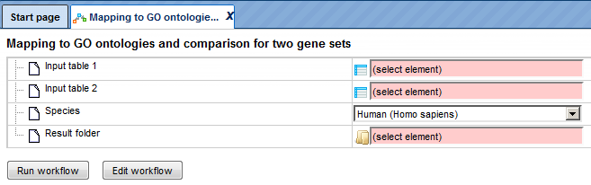

**Step 2.** Specify the input tables 1 and 2. The input gene sets might be lists
of differentially regulated genes or any gene or protein list of interest. You
can drag it from your project within the tree area and drop it in the pink box
of the field Input table. Alternatively, you may click on the pink field “select
element” and a new window will be opened, where you can select the input gene
set as shown below.

The further steps of the workflow are demonstrated for the genes shown to be
up-regulated (Top100) and down-regulated (Top100) in one of the pre-prepared
examples. The pertinent example file can be found in the geneXplain platform
under:

data/Examples/Brain Tumor GSE1825, Affymetrix HG-U133A microarray/Data/Ewing
Family Tumor versus Neuroblastoma/Upregulated Ensembl genes filtered (logFC\>1)

data/Examples/Brain Tumor GSE1825, Affymetrix HG-U133A microarray/Data/Ewing
Family Tumor versus Neuroblastoma/Downregulated Ensembl genes filtered (log
FC\<-2)

**Step 3.** Specify the biological species of the input set in the field Species
by selecting it from the drop-down menu.

**Step 4.** Define where the folder with the results should be located in the
tree. You can do so by clicking on the pink field *select element* in the field
Result folder, and a new window will be opened, where you can select the
location of the result folder and define its name.

**Step 5.** Press the [Run workflow] button.

When the workflow is completed, the result folder is opened by default. Path to
access this result folder is:

data/Examples/Brain Tumor GSE1825, Affymetrix HG-U133A microarray/Data/Ewing
Family Tumor versus Neuroblastoma/Upregulated Ensembl genes filtered (log
FC\>1.5)_Downregulated Ensembl genes filtered (log FC\<-2) (Mapping to
ontologies and compare)

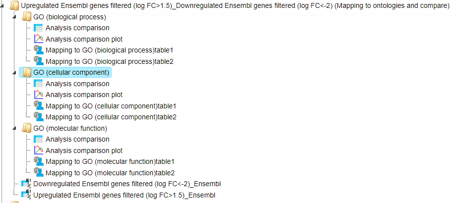

The result folder contains the three subfolders *GO* for all three GO categories
applied in this workflow and two tables (

). The two tables correspond to the input tables with the identifiers converted
into Ensembl gene IDs. Each subfolder contains two tables () with the mapped ontology results, one table () with the analysis comparison result and one plot ()

##### Multiple gene sets

This workflow is designed to classify several sets of genes or proteins based on
the three GO branches, Reactome and HumanCyc pathways and TF classification.
Several input gene or protein tables should be located in one folder.

The input is a folder with several gene or protein tables. The steps of this
workflow for each individual gene or protein table are the same as described in
the section above. The same steps are performed iteratively for each of the gene
or protein tables in the input folder.

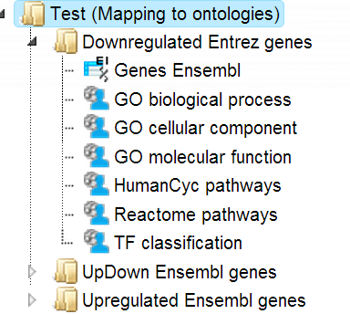

The output is a folder which contains subfolders with the results for each
individual input table. The subfolders are automatically given the same names as
the input tables.

#### Mapping to GO categories and signaling pathways

##### Single gene or protein table

The steps of this workflow are the same as described above, only difference is
in the ontologies applied. In this workflow, your input table is mapped to GO
biological processes, GO cellular components, GO molecular functions, Reactome,
HumanCyc, TF classification and TRANSPATH® pathways.

The genes in the input table are mapped to the TRANSPATH® pathways using the
latest TRANSPATH® release available in the platform. The columns ID, Title and
Group size present information about the TRANSPATH® pathways significantly
enriched among your input genes. Results Folder in the Examples can be accessed
using the path:

 data/Examples/Brain Tumor GSE1825, Affymetrix HG-U133A microarray/Data/Ewing
Family Tumor versus Neuroblastoma/Upregulated Ensembl genes (Mapping to
ontologies Transpath)

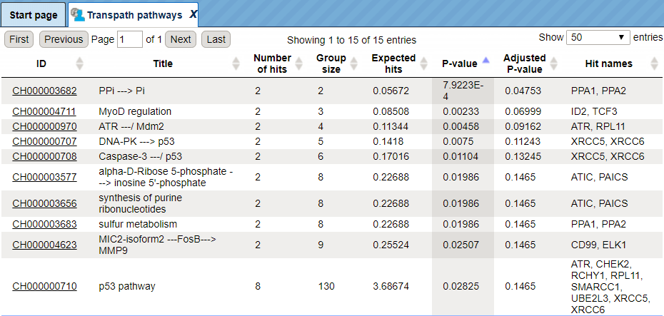

The pathway identifiers provide a link to open the corresponding pathway as a
diagram in the work space. In the screenshot below a fragment of the IFN
alpha/beta pathway is opened.

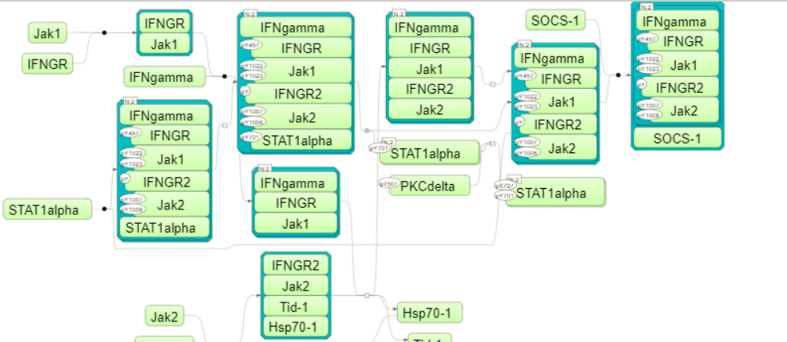

**Tip** You can work with the pathway diagrams as with other diagrams in the
platform. For example, you can map expression data, save a copy, and export in a
number of different formats. To save all genes linked to this diagram as a
separate gene table, you need to select the corresponding row in the table with
the classification results and apply the *Save hits* button from the top control
menu.

**Note***.* This workflow is available together with a valid TRANSPATH® license.  
Please feel free to ask for details (info\@genexplain.com).

#### Gene sets and comparison

##### Mapping to GO ontologies and comparison for two gene sets (HumanPSD™):

The overall idea of this workflow is similar to that the one described above.
However, this workflow is designed to map two input tables, to identify hits and
to compare the results according to the eight particular ontologies. These are
five proprietary ontologies (BIOBASE GmbH), namely the HumanPSD™-curated Gene
Ontology categories (HumanPSD™ biological process, HumanPSD™ molecular function
and HumanPSD™ cellular component), HumanPSD™ disease and TRANSPATH® pathways, as
well as three public ontologies, Reactome pathways, HumanCyc metabolic pathways
and the transcription factor classification.

Similarly to the workflows described above, the input can be any gene or protein
tables. In the first step, the input tables are converted into two tables with
Ensembl Gene IDs. These tables are then subjected to a functional mapping to the
eight listed ontologies in parallel. The last comparison step is based on the
method *analyses/Methods/Statistical analysis/Compare analysis results*, icon

. Please refer to Section 16.3.1 for details on this particular analysis method.
The comparison helps to reveal ontological categories that are different between
two input data sets. To launch the workflow, follow these steps:

**Step 1.** Open the workflow input form from the Start page. It looks as shown
below:

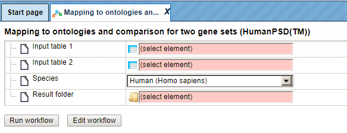

**Step 2.** Specify the input tables 1 and 2. The input gene sets might be lists
of differentially regulated genes or any gene or protein list of interest. You
can drag it from your project within the tree area and drop it in the pink box
of the field Input table. Alternatively, you may click on the pink field “select
element” and a new window will be opened, where you can select the input gene
set as shown below.

The further steps of the workflow are demonstrated for the genes shown to be
up-regulated (Top100) and down-regulated (Top100) in one of the pre-prepared
examples. The pertinent example file can be found in the geneXplain platform
under:

<https://platform.genexplain.com/bioumlweb/#de=data/Examples/Brain%20Tumor%20GSE1825%2C%20Affymetrix%20HG-U133A%20microarray/Data/Ewing%20Family%20Tumor%20versus%20Neuroblastoma/Upregulated%20Ensembl%20genes%20filtered%20(logFC%3E1)>

https://platform.genexplain.com/bioumlweb/\#de=data/Examples/Brain%20Tumor%20GSE1825%2C%20Affymetrix%20HG-U133A%20microarray/Data/Ewing%20Family%20Tumor%20versus%20Neuroblastoma/Downregulated%20Ensembl%20genes%20filtered%20(log%20FC%3C-2)

**Step 3.** Specify the biological species of the input set in the field Species
by selecting it from the drop-down menu.

**Step 4.** Define where the folder with the results should be located in the
tree. You can do so by clicking on the pink field *select element* in the field
Result folder, and a new window will be opened, where you can select the
location of the result folder and define its name.

**Step 5.** Press the [Run workflow] button.

When the workflow is completed, the result folder is opened by default.

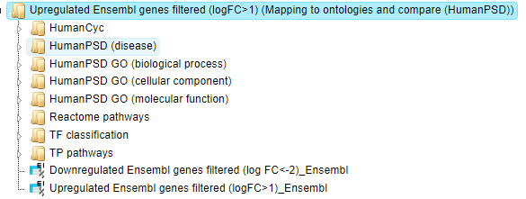

The result folder contains eight subfolders; one subfolder for each applied
ontology and two tables (

). The two tables correspond to the input tables with the identifiers converted
into Ensembl gene IDs. Each subfolder contains two tables () with the mapped ontology/pathway/classification results, one table () with the analysis comparison result and one plot ().

Note**.** This workflow is available together with a valid HumanPSD™ license.
Please, feel free to ask for details (info\@genexplain.com).

##### Multiple gene sets

This workflow is designed to classify several sets of genes or proteins based on
the three GO branches, Reactome and HumanCyc pathways, TF classification, and
TRANSPATH® pathways. Several input gene or protein tables should be located in
one folder.

The input is a folder with several gene or protein tables. The steps of this
workflow for each individual gene or protein table are the same as described
above. The same steps are performed iteratively for each of the gene or protein
tables in the input folder.

The output is a folder which contains subfolders with the results for each
individual input table. The subfolders are automatically given the same names as
the input tables.

**Note***.* This workflow is available together with a valid TRANSPATH® license.  
Please, feel free to ask for details (info\@genexplain.com).

### Mapping to GO categories, signaling pathways and diseases

#### Single gene or protein table

The steps of this workflow are the same as described for other mapping to
ontologies workflow. The difference is in the ontologies applied. In this
workflow, your input table is mapped to HumanPSD™ biological processes,
HumanPSD™ cellular components, HumanPSD™ molecular functions, HumanPSD™ disease,
Reactome, HumanCyc, TF classification and TRANSPATH® pathways.

The results folder contains several tables with the resulting mapping, one table
each for each applied ontological group (

), as well as one gene table (

) as shown below.

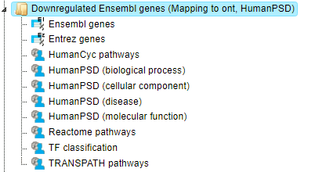

When the workflow is completed, all the output files are opened by default. The
output file HumanPSD (disease) when opened in the work space looks is shown
here:

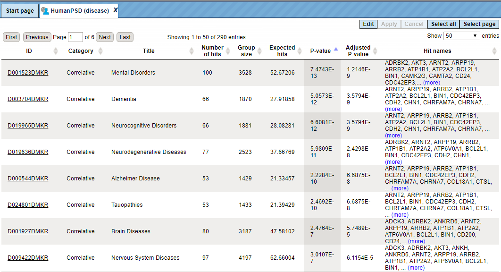

The columns ID, Category, Title and Group size present information about the
diseases, as they are curated in the HumanPSD™ database, significantly enriched
among your input genes.

Each disease identifier is hyperlinked to an external web page, the Comparative
Toxicogenomic Database, where you can find more details about this disease:

<http://ctdbase.org/>

**Note***.* This workflow is available together with a valid
HumanPSD™/TRANSPATH® license. Please, feel free to ask for details
(info\@genexplain.com).

#### Gene sets and comparison

##### Mapping to ontologies and comparison for two gene sets (TRANSPATH®)**

The specialty of this workflow in comparison with the one described above is in
the ontologies applied. This workflow is designed to map two input tables to the
seven following ontologies, the public Gene Ontology categories (*biological
process*, *molecular function* and *cellular component*), TRANSPATH®, Reactome
and HumanCyc pathways as well as transcription factor classification to identify
hits and to compare the results. Similar to the workflows described above, the
input can be any gene or protein tables. In the first step, the input tables are
converted into two tables with Ensembl Gene IDs. These tables are subjected to a
functional mapping. The last comparison step is based on the method
*analyses/Methods/Statistical analysis/Compare analysis results*, icon

. The comparison can help to reveal items that show different enrichment across
certain conditions.

To launch the workflow, follow these steps:

**Step 1.** Open the workflow input form from the Start page. It looks as shown
below:

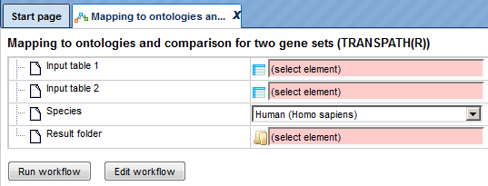

**Step 2.** Specify the input tables 1 and 2. The input gene sets might be lists
of differentially regulated genes or any gene or protein list of interest. You
can drag it from your project within the tree area and drop it in the pink box
of the field Input table. Alternatively, you may click on the pink field “select
element” and a new window will be opened, where you can select the input gene
set as shown below.

The further steps of the workflow are demonstrated for the genes shown to be
up-regulated (Top100) and down-regulated (Top100) in one of the pre-prepared
examples. The pertinent example file can be found in the geneXplain platform
under:

data/Examples/Brain Tumor GSE1825, Affymetrix HG-U133A microarray/Data/Ewing
Family Tumor versus Neuroblastoma/Upregulated Ensembl genes filtered (logFC\>1)

data/Examples/Brain Tumor GSE1825, Affymetrix HG-U133A microarray/Data/Ewing
Family Tumor versus Neuroblastoma/Downregulated Ensembl genes filtered (log
FC\<-2)

**Step 3.** Specify the biological species of the input set in the field Species
by selecting it from the drop-down menu.

**Step 4.** Define where the folder with the results should be located in the
tree. You can do so by clicking on the pink field *select element* in the field
Result folder, and a new window will be opened, where you can select the
location of the result folder and define its name.

**Step 5.** Press the [Run workflow] button.

When the workflow is completed, the result folder is opened by default.

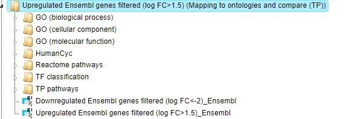

The result folder contains the seven subfolders; one subfolder for each applied
ontology and two tables (

). The two tables correspond to the input tables with the identifiers converted
into Ensembl gene IDs. Each subfolder contains two tables () with the mapped ontology/pathway/classification results, one table () with the analysis comparison result and one plot (). Individual tables are described in the previous sections.

**Note.** This workflow is available together with a valid TRANSPATH® license.Please, feel free to ask for details (info\@genexplain.com).

### Mapping with selected classification

#### Single gene set

This workflow is designed to map one input tables to one selected ontology
classification. The input can be any gene or protein table. In the first step,
the input table is converted into one table with Ensembl Gene IDs. The table
with Ensembl Gene ID is subjected to a functional classification. As result the
mapped table is stored.

To launch the workflow, follow these steps:

**Step 1.** Open the workflow input form from the Start page. It looks as shown
below:

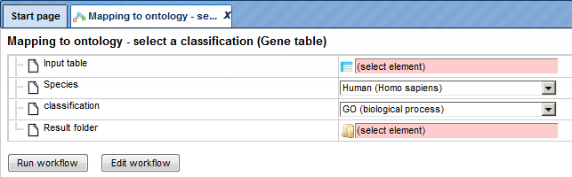

**Step 2.** Specify the input table. The input gene set might be the list of
differentially regulated genes or any gene or protein list of interest. You can
drag it from your project within the tree area and drop it in the pink box of
the field Input table. Alternatively, you may click on the pink field “select
element” and a new window will be opened, where you can select the input gene
set as shown below.

The pertinent example file can be found in the geneXplain platform under:

<https://platform.genexplain.com/bioumlweb/#de=data/Examples/Brain%20Tumor%20GSE1825%2C%20Affymetrix%20HG-U133A%20microarray/Data/Ewing%20Family%20Tumor%20versus%20Neuroblastoma/Experiment%20normalized%20(RMA)%20(Differentially%20expressed%20genes%20Affy)/Downregulated%20Ensembl%20genes>

**Step 3.** Specify the biological species of the input set in the field Species
by selecting it from the drop-down menu.

**Step 4.** In the field Classification, choose the ontology from the drop-down
menu. Here, GO biological process is selected.

**Step 5.** Define where the folder with the results should be located in the
tree. You can do so by clicking on the pink field *select element* in the field
Result folder, and a new window will be opened, where you can select the
location of the result folder and define its name.

**Step 6.** Press the [Run workflow] button.

When the workflow is completed, the result folder is opened by default.

The result folder contains 1 table () with the converted Ensembl table and one table (

) with the mapped ontology results.

data/Examples/Brain Tumor GSE1825, Affymetrix HG-U133A microarray/Data/Ewing
Family Tumor versus Neuroblastoma/Downregulated Ensembl genes (Reactome pathways
(63))

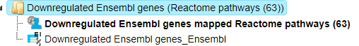

Let’s consider the output table with the mapping results. The tables with the
mapped selected category () look like:

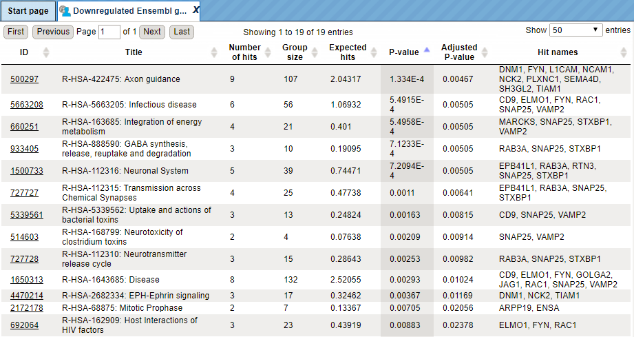

Each row presents details about one ontological term. The column ID comprises
the identifiers of the ontological categories, here identifiers of Gene Ontology
biological process terms. These identifiers are hyperlinked to the page
http://www.ebi.ac.uk/QuickGO/ where you can get further information about this
ontological term.

The columns Title and Group size contain further details about the ontological
terms, its title and the number of genes linked to this term in the
corresponding database, here in GO. The column Expected hits shows the number of
genes expected to fall into this category by random chance, based on the size of
the input set and the size of the category. The column Number of hits shows how
many genes from the input table fall into this category. **P-**value and
Adjusted P-value are calculated for the difference between expected and real
numbers of hits. The genes mapped to each category are explicitly listed in the
column Hit names. As the lists can get quite long, only a few genes are shown by
default in each row. To get the full list, press [more].

#### Mapping to ontology - select a classification (2 Gene tables)

This workflow is designed to map each of the two input tables to one selected
ontology classification, to identify term hits and to compare the results. The
input can be any gene or protein table. In the first step, the input tables are
converted into two tables with Ensembl Gene IDs. These tables with Ensembl Gene
IDs are subjected to a functional classification. As result two mapped tables
are stored and further compared via P-values. This final comparison step is
based on the method *analyses/Methods/Statistical analysis/Compare analysis
results*, icon

Please refer to section 13.3 for details on this particular analysis method.
The comparison can help to reveal terms that show different enrichment across
certain conditions.

To launch the workflow, follow these steps:

**Step 1.** Open the workflow input form from the Start page. It looks as shown
below:

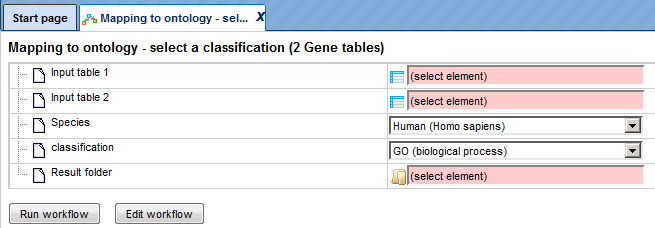

**Step 2.** Specify the input tables 1 and 2. The input gene sets might be the
lists of differentially regulated genes or any gene or protein list of interest.
You can drag it from your project within the tree area and drop it in the pink
box of the field Input table. Alternatively, you may click on the pink field
“select element” and a new window will be opened, where you can select the input
gene set as shown below.

The further steps of the workflow are demonstrated for the genes shown to be
up-regulated (Top100) and down-regulated (Top100) in one of the pre-prepared
examples. The pertinent example file can be found in the geneXplain platform
under:

<https://platform.genexplain.com/bioumlweb/#de=data/Examples/Brain%20Tumor%20GSE1825%2C%20Affymetrix%20HG-U133A%20microarray/Data/Ewing%20Family%20Tumor%20versus%20Neuroblastoma/Upregulated%20Ensembl%20genes%20Top%20100>

<https://platform.genexplain.com/bioumlweb/#de=data/Examples/Brain%20Tumor%20GSE1825%2C%20Affymetrix%20HG-U133A%20microarray/Data/Ewing%20Family%20Tumor%20versus%20Neuroblastoma/Downregulated%20Ensembl%20genes%20Top%20100>

**Step 3.** Specify the biological species of the input set in the field Species
by selecting it from the drop-down menu.

**Step 4.** In the field Classification, choose the ontology from the drop-down
menu. Here, GO biological process is selected.

**Step 5.** Define where the folder with the results should be located in the
tree. You can do so by clicking on the pink field *select element* in the field
Result folder, and a new window will be opened, where you can select the
location of the result folder and define its name.

**Step 6.** Press the [Run workflow] button.

When the workflow is completed, the result folder is opened by default. Result
folder can be accessed using the path:

data/Examples/Brain Tumor GSE1825, Affymetrix HG-U133A microarray/Data/Ewing
Family Tumor versus Neuroblastoma/Upregulated Ensembl genes Top 100 Mapping to
ontology and compare

The result folder contains 2 tables (

) with the converted Ensembl tables, two tables

with the mapped ontology results, two tables (

) with the analysis comparison result annotated and one plot (

).

Let’s consider the output tables. The tables with the mapped selected category (

) look like:

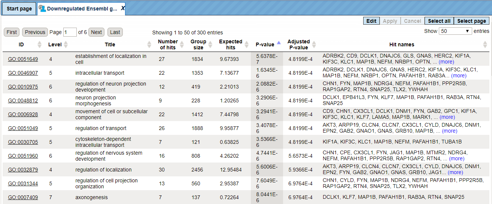

Each row presents details about one ontological term. The column ID comprises
the identifiers of the ontological categories, here identifiers of Gene Ontology
biological process terms. These identifiers are hyperlinked to the page
http://www.ebi.ac.uk/QuickGO/ where you can get further information about this
ontological term.

The columns Title and Group size contain further details about the ontological
terms, its title and the number of genes linked to this term in the
corresponding database, here in GO. The column Expected hits shows the number of
genes expected to fall into this category by random chance, based on the size of
the input set and the size of the category. The column Number of hits shows how
many genes from the input table fall into this category. **P-**value and
Adjusted P-value are calculated for the difference between expected and real
numbers of hits. The genes mapped to each category are explicitly listed in the
column Hit names. As the lists can get quite long, only a few genes are shown by
default in each row. To get the full list, press [more].

The Analysis comparison annot table lists identifiers, annotation of
identifiers, P-values for the first input set of genes and P-values for the
second input set of genes (-log). The column Difference shows the absolute
difference between two P-values. The columns Difference P-value and Difference
FDR show the statistical significance of the absolute difference and upon
sorting by one of these two columns on top you can see those ontology terms that
are statistically most significantly different between two input gene sets. The
comparison reveals GO terms that show different enrichment across the two input
gene lists.

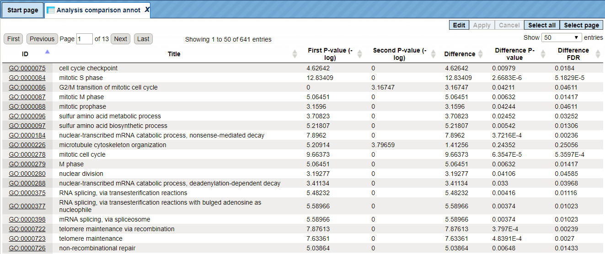

The Analysis comparison plot is a scatter plot of P-values on the log-scale
together with the diagonal and the difference cutoffs at FDR \< 0.05. Every dot
corresponds to one particular GO term. On the X-axis, the –log(p-value) for this
GO term in the first input table is shown, and on the Y-axis, the –log(p-value)
for the same GO term in the second input table is shown. The red dots correspond
to those GO terms that are statistically significantly different between two
input tables, with FDR\<0.05. The black dots located close to the diagonal,
between two dotted lines, are not significantly different between two input
datasets.

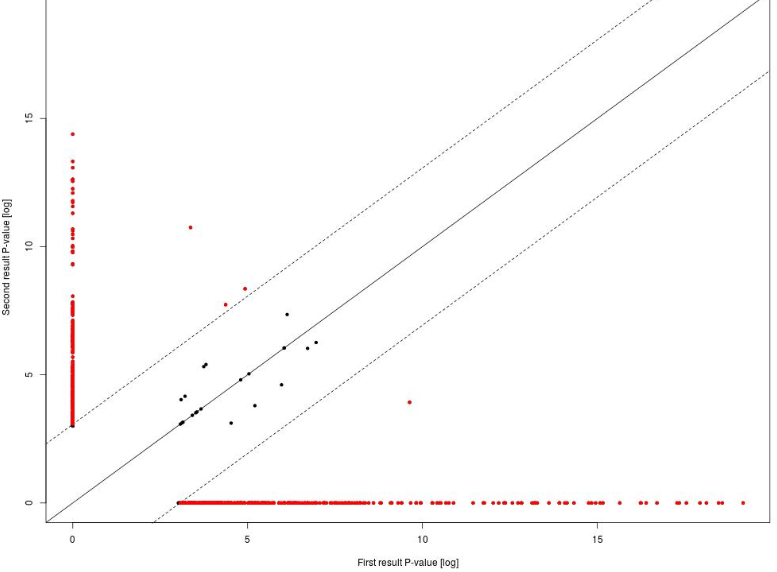

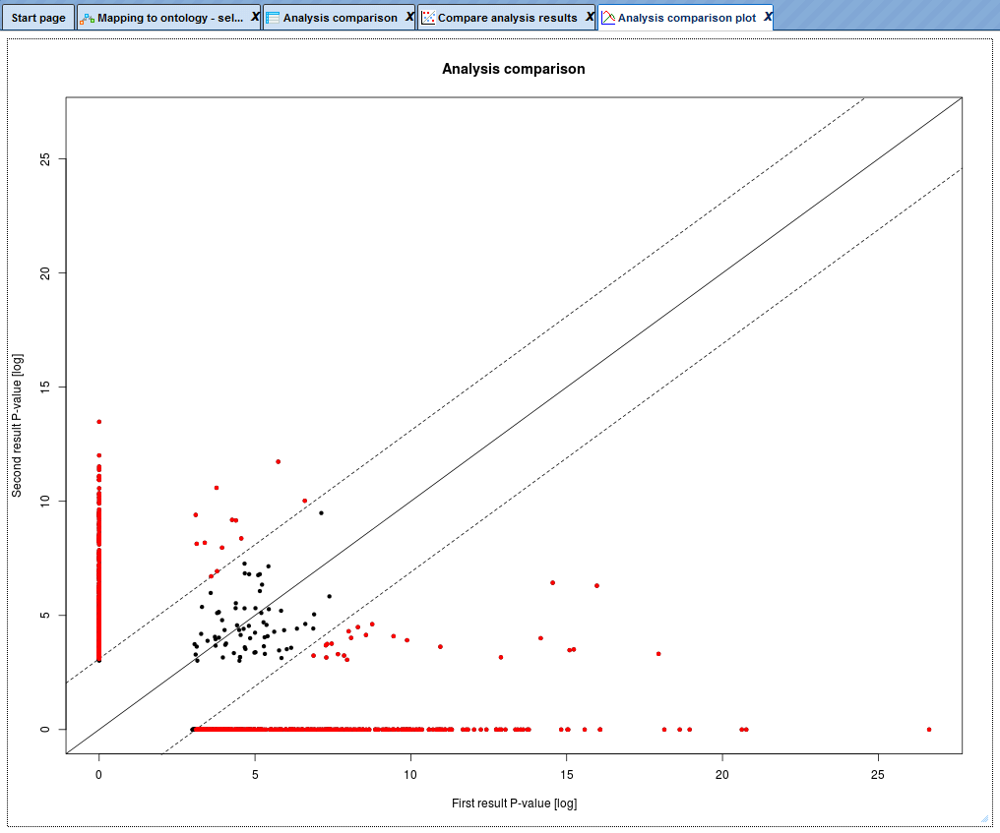

#### Multiple gene sets

This workflow is designed to classify a multiple set of genes by enrichment
analysis using GO, Reactome, HumanCyc and TF classification databases. Gene sets
should be located in one folder.   
The input table is converted into one table with Ensembl Gene IDs.

The table with Ensembl Gene ID is subjected to functional classification based
on the classification option selected in the input field.

The output consists of a folder which stores the mapped classification table.
Each output table consists of many columns. The column ID comprises the
identifiers of the ontological categories, here identifiers of Gene Ontology
biological process terms. These identifiers are hyperlinked to the page
http://www.ebi.ac.uk/QuickGO/ where you can get further information about this
ontological term.

The columns Title and Group size contain further details about the ontological
terms, its title and the number of genes linked to this term in the
corresponding database, here in GO. The column Expected hits shows the number of
genes expected to fall into this category by random chance, based on the size of
the input set and the size of the category. The column Number of hits shows how
many genes from the input table fall into this category. P-value and Adjusted
P-value are calculated for the difference between expected and real numbers of
hits. The genes mapped to each category are explicitly listed in the column Hit
names.

The same steps are repeated for the next input table, and several cycles are
performed automatically corresponding to the number of tables in the input
folder.

#### Cross-species mapping to ontologies, using ortholog information (HumanPSD™)

The Input can be any gene or protein table for mouse or rat. The workflow will
convert the list to desired species output and map it to various ontologies. In
this workflow, your input table is mapped to HumanPSD™ biological processes,
HumanPSD™ cellular components, HumanPSD™ molecular functions, HumanPSD™ disease,
Reactome, HumanCyc, TF classification and TRANSPATH® pathways. It can be found
under the tab Workflows, in the folder HumanPSD™/Cross-species mapping to
ontologies, using ortholog information (HumanPSD™). The input form of the
workflow looks as shown below:

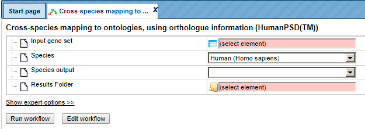

**Step 1**: Input the gene or protein table of any species for which you wish to
map gene ontologies. You can drag & drop it from your project within the tree
area. Alternatively, you may click on the pink field “select element” and a new
window will open, where you can select the input table.

Here further steps are demonstrated with the track available in one of the
pre-prepared examples present in the Tree Area:

data/Examples/Transcriptional biomarkers to predict mouse liver tumors,
GSE18858/Data/Normalized (RMA) DEGs with EBarrays/Naphthalene_20ppm upreg
Ensembl Select the species of the input table

**Step 2**: Select the desired species of the output table.

Specify the path to store the results and the name of the output folder.

Having filled in the input form, launch the workflow with the [Run] button. Wait
till the workflow is completed.

Here the input mouse data is functionally classified and mapped to human data.

In the first step of the workflow, the input gene table is converted to the
desired Ensemble gene table using the method ‚convert table via homology ‘. In
the next step the converted Ensembl gene table is functionally classified using
the HumanPSD database with a p_value threshold of 0.05. The output results
folder contains diverse files as shown below:

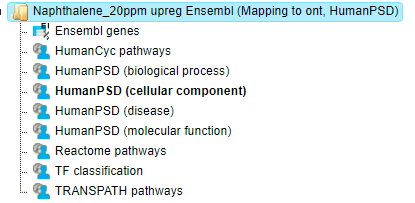

Mapping to the three GO branches, biological processes, cellular components, and
molecular functions (

). The tables with the enriched categories look like:

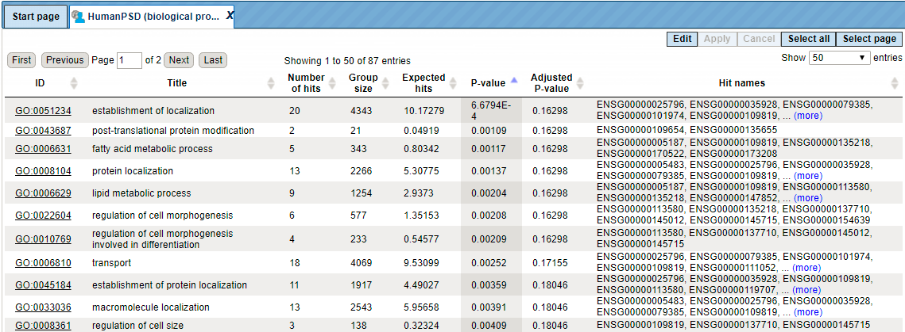

For each ontological term several parameters are calculated, including expected
number of hits, actual number of hits, p-value, as well as hit names and the
link to the corresponding ontological term. The columns Title and Group size
contain further details about the ontological terms, its title and the number of
genes linked to this term in the corresponding database, here in GO. The column
Expected hits shows the number of genes expected to fall into this category by
random chance, based on the size of the input set and the size of the category.
The column Number of hits shows how many genes from the input table fall into
this category. **P-**value and Adjusted p-value are calculated for the
difference between expected and real numbers of hits. The genes mapped to each
category are explicitly listed in the column Hit names. As the lists can get
quite long, only a few genes are shown by default in each row. To get the full
list, press [more].

The Tables Reactome pathways, Transpath pathways, and humanCyc pathways give the
results of the mapping of the input gene set to each of these pathways. Each
table has a unique identifier for the corresponding pathway; upon a mouse click,
a diagram opens in the workspace.

**The table TF classification**

().

Your input table is mapped to the classification of Transcription factors
(*Nucleic Acids Res. 41, D165-D170 (2013)*), which is also integrated in the
platform. In the column **ID** the identifiers of the TF classification are
shown. They are hyperlinked to the corresponding classification categories:

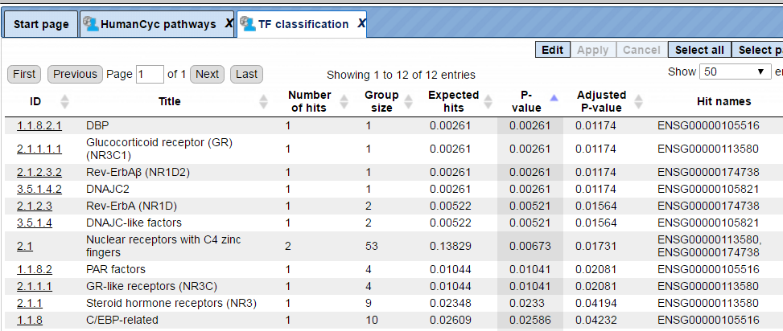
