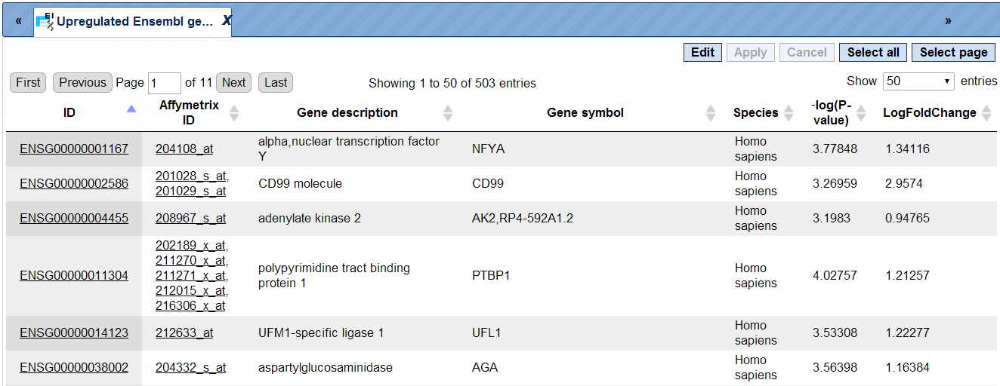

# Microarrays

## Normalize data

### Experiment vs. control or multiple conditions

If your expression data haven’t been normalized yet, as we assume in this
example, you have to go now to the second group of options, “Normalize data”.
Make your choice according to the experimental platform you have used
(Affymetrix, Agilent or Illumina). The next form will ask you to define the data
file(s). For this, you have two options:

When you click in either field, a window with the title “Select data element”
opens allowing you to select a file or, more likely at this step, a number of
files by mouse click or by typing their names. Selection by mouse click works as
usual for a range of files (keep the Shift key pressed when selecting the last
file of the range), or for a number of distinct files (keep the Ctrl key pressed
when selecting the second and further files from the list).

Make sure that all hybridizations (i.e., all CEL files) of your experiment are
included into one normalization procedure. It should comprise all CEL files,
including all multiple repetitions, of all conditions to be compared with each
other at a later step, i.e. all tests and controls, at least those that you want
to compare later on.

If your readings were from a dual-channel experiment, please tick the checkbox
(Agilent only).

In the field Output name, you find a suggested name for the output file. The
default name is “Normalized (\<*Normalization_method*\>)”, which you can edit
(just click into this field and change the default name). An accordingly named
file will appear in the Tree Area after the procedure run successfully.

You may also have noticed that some further information about the analyses to be
employed is displayed in both the Info Box as well as in the Operations Field
(“My description” tab). Sometimes, they are identical by default, but in the
latter field, you can edit the contents and add your own comments.

Now launch the normalization routine by pressing the [Run] button. The program
will now normalize all your data across all experiments done, i.e. through all
CEL files selected. The results will be stored in two different tables, one with
the experimental, the other with the control values.

To have a closer look into the full content of one of the results tables, just
click with the right mouse button onto the respective file name in the Tree
Area, and choose “Open table” from the little menu that appears, or double-click
on the file name. The table will open under a new tab in the Work Space. It
should look like this, with the probeset IDs in the first and the normalized
expression values from the different CEL files in the following columns, each
hybridization being represented in one column (picture below).

**Important note.** In the geneXplain platform, the probeset IDs are mapped to
genes based on the Ensembl database. If some of the probeset IDs are not
annotated in Ensembl, they cannot be mapped to genes and cannot be used for
further analysis. That means, you can normalize data and calculate
differentially expressed probes. These steps can be done on the probeset ID
level, before conversion to genes. The step of converting probeset IDs into
genes is depending on the annotation provided by the Ensembl database.

### Heatmap

This tool creates a heatmap for the numerical data matrix provided with the
input data table. The heatmap is limited to input tables with at most 5000 input
rows. It is a graphical representation of data where the individual values
contained in a matrix are represented as colors. The output folder contains a
TIFF image of the heatmap as well as the ordered lists of row ids (e.g. RNA or
gene ids) and column ids. The output tables can be used to extract subsets of
correlated rows or columns revealed by the hierarchical clustering and/or the
heatmap presentation.

An example can be found here: data/Examples/Brain Tumor GSE1825, Affymetrix
HG-U133A microarray/Data/Ewing Family Tumor versus Neuroblastoma/Normalized
(RMA) subset_heatmap

**Step 1**: Open the workflow input form from the Start page. It will open in
the main Work Space and looks as shown below:

**Step 2**: Specify the **Input table** with e.g. normalized data for different
experimental conditions. To specify the input table, you can drag & drop it from
your project within the tree area.

**Step 3**: Specify the Transformation to be applied to data values from the
drop-down menu. Possible transformations are Log or Rank; the default is None.

**Step 4**: Select **Width** and **Height** as well the **Resolution** of the
output image.

**Step 5**: Specify layout heights (Lhei). This should be a list of 2 (when no
column groups are specified) or 3 (with column groups) float values separated by
comma that adjust the heights of the layout parts. Please refer to the
documentation of R's heatmap.2
{[gplots](https://cran.r-project.org/web/packages/gplots/)} tool for details.

**Step 6**: Please check Row dendrogram and/or Column dendrogram if you want to
have a raw dendogram and/or a dendrogram with column in the output image.

**Step 7**: Specify the conditions/groups names for up to five groups (expert
level).

**Step 8**: Specify the conditions/groups. They are shown as columns of the
input table. You can select the column names for each condition/group via the
drop-down menu.

**Step 9**: Define where the folder with the results should be located in your
project tree. You can do so by clicking on the pink field “select element” in
the field **Output folder**, and a new window will open, where you can select
the location of the results folder and define its name.

Start the method by pressing the [Run workflow] button.

Output are two tables (heatmap_columns and heatmap_genes) and one image file in
.tiff format. This image file needs to be downloaded and can be used in any
graphical program/presentation.

### Normalization quality plots

This tool can be applied plot densities of columns of a data table. As its name
implies the intended use case is to inspect the quality of results of
normalization as conducted in microarray experiments.

Example outputs, a box plot and a density plot, are shown at the end of this
section. Colors were automatically assigned to selected columns.

The input parameters are described in the following.

**Input table**: This table contains the numerical columns to analyze.

**Column subset**: Here you can select the set of columns to show in plots.

Input log-base: Densities and box plots will be computed for data on the log2
scale. Here you can specify the actual scale of the input data. If the log-base
is log2, the tool will use the data values as is.

**Output folder**: The output folder will contain a density plot and a box plot
for the specified columns.

### Principal Component Analysis (PCA)

PCA is a statistical method that transforms data in a way, so that a maximum
amount of variance within the data can be expressed in fewer or, at most, as
many dimensions as the original data. The new dimensions onto which data are
projected are the principal components. They capture the original variance in
decreasing order, so that the first principal component presents most of the
variance. PCA is often used reduce the complexity of (to compress) or to
identify groups in high-dimensional data.

This tool applies PCA to a table of numerical data, e.g. to normalized
microarray measurements. For visualization purposes one can assign columns to
one of up to five groups, which will be differentially colored in the generated
output (scatter plot).

The output is stored in a specified folder and consists of three files. The
**PCA Scatter plot** shows the items of specified groups at their transformed
coordinates according to the first two principal components. The entire set of
coordinates is available in **PCA Transformed coordinates**. Finally, the table
**PCA Component importance** provides information about the relative importance
of each principal component with respect to the proportion of explained
variance.

The input parameters for PCA are described in the following.

**Input table**: This table contains the numerical columns to analyze.

**1-5. Condition / group name**: One can specify up to five groups of columns.
These fields contain the names that will be shown in outputs. Please note that
unnamed groups are not considered, a name is not assigned automatically.

**1-5. Columns**: These fields contain the selected columns. Please note that
column selections are not considered without a corresponding name. Columns can
only be specified once.

**Output folder**: The output folder will contain the described output files.

## Detect differentially expressed genes

After the microarray results are normalized, the next step is to compute
differentially expressed genes (DEG).There are four different statistical
methods provided for DEG calculation in the platform: T-test, hypergeometric
analysis, Limma, and EBarrays. For DEG calculation by T-test and hypergeometric
analysis, there are predefined workflows, which take as input two tables with
the normalized data, for two different conditions, referred to as *Experiment
normalized* and *Control normalized*. The methods Limma and EBarrays require one
input table with all the conditions, and you can specify up to five different
conditions for one run of each of these two methods.

If you applied the normalization method “Experiment vs. control”, you can detect
DEGs applying T-test and/or hypergeometric analysis to the workflows,
highlighted in green in the picture above. If you applied the normalization
method “Multiple conditions”, you can detect DEGs with Limma and/or EBarrays,
highlighted in red.

In this chapter, the predefined workflows for DEG calculation with T-test and
with hypergeometric analysis are described in detail. For a description of Limma
and EBarray please refer to the sections 4.2.1 and 4.2.2, respectively.

### Detect differentially expressed genes with T-test

This workflow is designed to find the set of up-regulated and down-regulated
genes applying Student’s T-test. There are three workflows designed for
different experimental platforms (Affymetrix, Agilent and Illumina).

In the first step p-values for normalized files are calculated for all
probes using the “Up and Down Identification” analysis. This analysis applies
Student’s T-test for p-value calculation, thus the number of data points should
be at least three for each experiment and control.

To launch the workflow, follow these steps:

**Step1.** Open the workflow input form from the Start page. It looks as shown
below:

**Step 2.** Specify the tables with normalized data in the fields **Experiment
normalized** and **Control normalized**. You can drag it from your project
within the tree area and drop it in the pink box of the fields. Alternatively,
you may click on the pink field *(select element)* and a new window will be
opened, where you can select the input tables.

The further steps of the workflow are demonstrated by means of the tables in one
of the pre-prepared examples. You can find these tables in the *Examples*
folder, under data/Examples/Brain Tumor GSE1825, Affymetrix HG-U133A
microarray/Data/Ewing Family Tumor versus Neuroblastoma

**Step 3.** Specify the biological species of the input sets in the field
**Species** by selecting the required biological species from the drop-down
menu.

**Step 4.** Define where the folder with the results should be located in the
tree. You can do so by clicking on the pink field *(select element)* in the
field **Results folder**, and a new window will be opened, where you can select
the location of the results folder and define its name.

After entering all input fields press [Run workflow] and wait till the workflow
is completed.

The output is a folder with several files as shown below:

The table **Genes, fold change and P-value, non-filtered**. This table contains
all genes with LogFoldChange and p-value calculated; each row corresponds to one
gene.

The columns **ID, Gene description** and **Gene symbol** present Entrez
identifiers for the genes, a full name for each gene, and a standard gene
symbol, respectively. The column **Species** shows the corresponding taxonomic
species. The column **AffymetrixID** contains the probe set IDs corresponding to
each gene, and you can see sometimes more than one Affymetrix probe
corresponding to one gene. The column **LogFoldChange** shows the base 2
logarithm of the ratio between expression value in experiment vs. control. The
column **–log(P-value)** shows the negative base 10 logarithm of the *p*-value.

Please note that the column **–log(P-value)**, according to a widely accepted
convention, has algebraic signs according to being up- (positive values) or
down-regulated (negative values).

In the course of worklow progression, this table has been filtered by several
conditions in parallel to identify up-regulated, down-regulated, and non-changed
Affymetrix probeset IDs and genes.

The filtering criteria used are:

-   For up-regulated probes: LogFoldChange\>0.5 and -log_P_value_\>3

-   For down- regulated probes: LogFoldChange\<-0.5 and -log_P_value_\<-3

-   For non-changed genes : LogFoldChange\<0.002 and LogFoldChange\>-0.002

The table **Upregulated Ensembl genes**. You can find the number of the
resulting up-regulated genes written on top of each output table (highlighted by
the red circle):

The table **Downregulated Ensembl genes**. The structure and the meaning of the
columns in the tables are the same as in the Upregulated Ensembl genes table.

The table **Non-changed Ensembl genes**.

In this example the number of up-regulated, down-regulated and non-changed genes
are 503, 241, and 99, respectively.

These individual output files can be used further as input for running other
workflows as described in the following sections.

The plot () contains a histogram of the log fold change distribution for all genes:

**The Report.** The workflow summarizes all results and automatically produces a
report. In addition you can have a look at the list of both up-regulated and
down-regulated genes.

This report can be exported in html format.

### Detect differentially expressed genes by hypergeometric analysis

This workflow is very similar to the workflow Detect differentially expressed genes by T-test.  The principal difference is in the statistical method for calculation of thep-value. In this workflow, the p-value is calculated by hypergeometric analysis
(Y.V.Kondrakhin, R.N.Sharipov, A.E.Kel, F.A.Kolpakov. (2008) Identification of
Differentially Expressed Genes by Meta-Analysis of Microarray Data on Breast
Cancer, *In Silico Biology*, 8: 383-411).

Tip If you have just two or even one data point in each experiment and control
(e.g. one CEL file in experiment and one CEL file in control), you can apply
hypergeometric analysis to calculate DEGs. In contrast to the T-test which
requires at least three data points, hypergeometric analysis can make
calculations for two and even one data point in each normalized experiment and
normalized control files. This allows to calculate DEGs to compare, for
instance, one patient data set with one healthy data set.

The workflow input form looks as shown below:

The output folder and the structure of the individual tables, as well as the
report, are similar to those described in 9.2.1.

### Detect differentially expressed genes with Limma

This workflow is designed to find sets of up-regulated and down-regulated genes
starting with the normalized table of your expression data. Please refer to
section 4.2.1 for details on this particular analysis method. This workflow is
designed for different experimental platforms (Affymetrix, Agilent and
Illumina).

In the first step this workflow computes the differential expression between up
to five conditions / groups. Each group corresponds to one experimental
condition (time point, treatment, cell type, etc.) or control. You can specify 2
to 5 conditions. An input table is a data table that contains several columns
with normalized measurement values, e.g. from a normalized microarray
experiment. All possible contrasts between groups are considered and their
output is stored in a common folder. Conditions are compared in the specified
order from first to fifth; e.g. for the given conditions named 1, 2 and 3, the
output will contain the contrasts “Condition 1 versus Condition 2”, Condition 1
versus Condition 3” and “Condition 2 versus Condition 3”. ”. The workflow can be
found on the Start page, under the button Microarrays, under the section “Detect
differentially expressed genes”.

**Step1.** Open the workflow input form from the Start page. It looks as shown
below:

**Step 2.** Specify the table with normalized data in the field **Input table**.
You can drag it from your project within the tree area and drop it in the pink
box of the fields. Alternatively, you may click on the pink field *(select
element)* and a new window will be opened, where you can select the input table.

The further steps of the workflow are demonstrated by means of the tables in one
of the pre-prepared examples. You can find these tables in the *Examples*
folder, under
[data/Examples/Cytokine-triggered gene expression in cell cycle stages,
GSE52465, Agilent-014850 microarray/Data/Agilent normalized DEGs with
limma]
(http://platform.genexplain.com/bioumlweb/#de=data/Examples/Cytokine-triggered
gene expression in cell cycle stages%2C GSE52465%2C Agilent-014850
microarray/Data/Agilent normalized DEGs with limma/)

**Step 3.** Specify the biological species of the input table in the field
**Species** by selecting it from the drop-down menu.

**Step 4.** Specify the conditions / groups. They are shown as columns of the
input table. You can select the column names for each condition/group via
drop-down menu.

**Step 5.** Define where the folder with the results should be located in the
tree. You can do so by clicking on the pink field (select element) in the field
**Results folder,** and a new window will be opened, where you can select the
location of the results folder and define its name.

After entering all input fields press [Run workflow] and wait till the workflow
is completed. The output is a folder with 10 result folders (e.g. *Condition_1
vs. Condition_2* for DEG calculation), a folder for each individual comparison
(*Output limma*) and one *Output plots* folder, as shown below:

The **Normalized density boxplot** and the **Normalized density plot** in the
folder *Output plots* show a quality control of the input normalized data table.
Please refer to section 10.1.3 for details on this particular analysis method.

The tables in the folder *Output limma* are the output tables from the limma
method, sorted via adjusted p-values.

The 10 output folders for each comparison e.g. Condition_1 vs. Condition_5
contain the results of the identified up-, down- and non-regulated Ensembl
genes.

The table **UpDown reg genes Ensembl** in the Folder *Condition_1 vs.
Condition_5* contains all differentially expressed genes filtered by
LogFoldChange and p-value for up- and down-regulated genes; each row corresponds
to one gene.

The columns **ID, Gene description** and **Gene symbol** represent Ensembl
identifiers for the genes, a full name for each gene, and a standard gene
symbol, respectively. The column **Species** shows the corresponding taxonomic
species. The column **AffymetrixID** contains the probe set IDs corresponding to
each gene, and you can see sometimes more than one Affymetrix probe
corresponding to one gene. The column **logFC** shows the base 2 logarithm of
the ratio between expression values in experiment vs. control. The column
**adj.P.Val** shows the adjusted *p*-value (Benjamini-Hochberg).

In the course of workflow progression, this table has been filtered by several
conditions in parallel to identify up-regulated, down-regulated, and non-changed
probeset IDs that were then converted into Ensembl gene identifiers.

The filtering criteria used are:

-   For up-regulated genes: logFC \>0.5 and adj.P.Val \<0.05

-   For down- regulated genes: logFC \<-0.5 and adj.P.Val \<0.05

-   For non-changed genes :logFC \<0.002 and logFC \>-0.002

    1.  Detect differentially expressed genes with EBarrays

Similarly to the workflow described above, this workflow is designed to find the
set of up-regulated and down-regulated genes starting with a normalized table of
your expression data, but using a different statistical method, EBarrays. Please
refer to section 4.2.2 for details on this particular analysis method. This
workflow is designed for different experimental platforms (Affymetrix, Agilent
and Illumina).

In the first step the workflow computes the differential expression between up
to five conditions/groups. Each group corresponds to one experimental condition
(time point, treatment, cell type, etc.) or control. You can specify 2 to 5
conditions. An input table is a data table that contains normalized measurement
values, e.g. from a normalized microarray experiment. All possible contrasts
between groups are considered and their output is stored in a common folder.
Conditions are compared in the specified order from first to fifth. E.g. given
conditions named 1, 2 and 3, the output will contain the contrasts “Condition 1
versus Condition 2”, Condition 1 versus Condition 3” and “Condition 2 versus
Condition 3”.

The workflow can be found on the Start page, under the button Microarrays, under
the section “Detect differentially expressed genes”.

**Step1.** Open the workflow input form from the Start page. It looks as shown
below:

**Step 2.** Specify the table with normalized data in the field **Input table**.
You can drag it from your project within the tree area and drop it in the pink
box of the fields. Alternatively, you may click on the pink field *(select
element)* and a new window will be opened, where you can select the input table.

The further steps of the workflow are demonstrated by means of the tables in one
of the pre-prepared examples. You can find these tables in the *Examples*
folder, under

[data/Examples/Cytokine-triggered gene expression in cell cycle stages,
GSE52465, Agilent-014850 microarray/Data/Agilent normalized DEGs with
EBarrays](http://platform.genexplain.com/bioumlweb/#de=data/Examples/Cytokine-triggered gene expression in cell cycle stages%2C GSE52465%2C Agilent-014850
microarray/Data/Agilent normalized DEGs with EBarrays/)

**Step 3.** Specify the biological species of the input table in the field
**Species** by selecting it from the drop-down menu.

**Step 4.** Specify the conditions/groups of the input table. You can select the
column names for each condition/group via drop-down menu.

**Step 5.** Define where the folder with the results should be located in the
tree. You can do so by clicking on the pink field *(select element)* in the
field **Results folder**, and a new window will be opened, where you can select
the location of the results folder and define its name.

After entering all input fields press [Run workflow] and wait till the workflow
is completed.

The output is a folder with several result folders and files as shown below:

The **Normalized density boxplot** and the **Normalized density plot** in the
folder *Output plots* show a quality control of the input normalized data table.
Please refer to section 10.1.3 for details on this particular analysis method.

The table EBarrays result and two plots in the folder *Output EBarrays* are the
output table and plots from the EBarrays method.

The tables for each condition (except control) e.g. **Condition_2 downreg
Ensembl** and **Condition_2 upreg Ensembl** contain all differentially expressed
genes with filtered LogFoldChange and p-value for up- and down-regulated genes;
each row corresponds to one gene.

The columns **ID, Gene description** and **Gene symbol** present Ensembl
identifiers for the genes, a full name for each gene, and a standard gene
symbol, respectively. The column **Species** shows the corresponding taxonomic
species. The column **Agilent ID** contains the probe set IDs corresponding to
each gene, and you can see sometimes more than one Affymetrix probe
corresponding to one gene. The direction of differential expression can be
derived from the fold change column e.g. **Condition_2 FC**, which contains the
log2-fold changes. The EBarrays method estimates a critical posterior
probability cutoff for the given FDR level on the basis of the fitted mixture
model. Probes / genes exceeding this cutoff in some treatment are indicated by a
value of 1 (instead of -1) in the output column named e.g. **Condition_2 Sig**.

In the course of workflow progression, this table has been filtered by several
conditions in parallel to identify up-regulated and down-regulated genes.

The filtering criteria used are:

-   For up-regulated genes: Condition_x FC \>0.5 and Condition_x Sig = 1

-   For down- regulated genes: Condition_x FC \<-0.5 and Condition_x Sig = 1

In the folder *Output plots* there are two diagnostic plots named **EBarrays
CCV** and **EBarrays Marginal fit**. These plots enable a judgment about whether
the assumptions of the approach hold and how well the fitted model represents
the data (please refer to the documentation of the EBarrays Bioconductor package
for further details).

**Note.** In the input field Condition 1 always the control condition should be
specified. Each of the input conditions 2, 3, 4, and 5 are compared with
condition 1.
