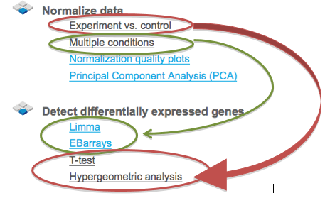
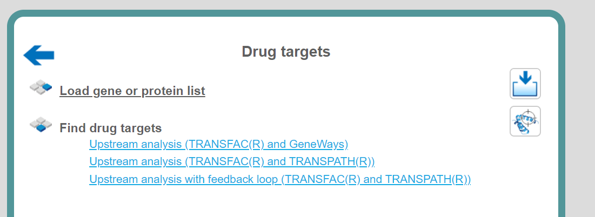
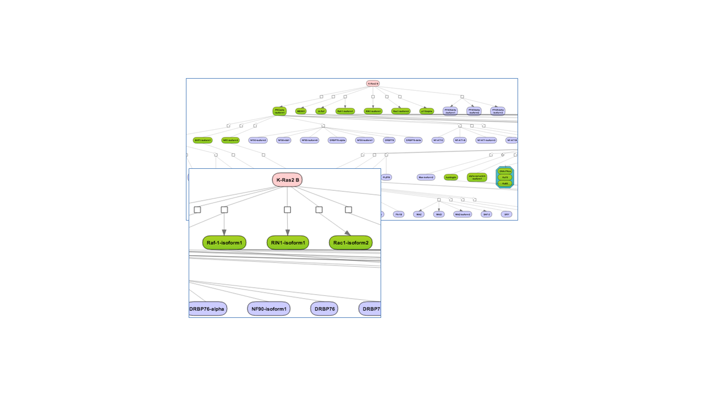
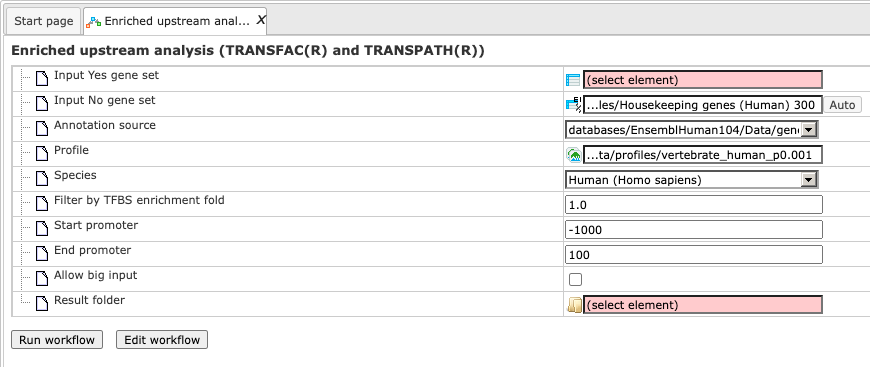

# Microarrays

## Normalize data

### Experiment vs. control or multiple conditions

If your expression data haven’t been normalized yet, as we assume in this
example, you have to go now to the second group of options, “Normalize data”.
Make your choice according to the experimental platform you have used
(Affymetrix, Agilent or Illumina). The next form will ask you to define the data
file(s). For this, you have two options:

When you click in either field, a window with the title “Select data element”
opens allowing you to select a file or, more likely at this step, a number of
files by mouse click or by typing their names. Selection by mouse click works as
usual for a range of files (keep the Shift key pressed when selecting the last
file of the range), or for a number of distinct files (keep the Ctrl key pressed
when selecting the second and further files from the list).

Make sure that all hybridizations (i.e., all CEL files) of your experiment are
included into one normalization procedure. It should comprise all CEL files,
including all multiple repetitions, of all conditions to be compared with each
other at a later step, i.e. all tests and controls, at least those that you want
to compare later on.

If your readings were from a dual-channel experiment, please tick the checkbox
(Agilent only).

In the field Output name, you find a suggested name for the output file. The
default name is “Normalized (\<*Normalization_method*\>)”, which you can edit
(just click into this field and change the default name). An accordingly named
file will appear in the Tree Area after the procedure run successfully.

You may also have noticed that some further information about the analyses to be
employed is displayed in both the Info Box as well as in the Operations Field
(“My description” tab). Sometimes, they are identical by default, but in the
latter field, you can edit the contents and add your own comments.

Now launch the normalization routine by pressing the [Run] button. The program
will now normalize all your data across all experiments done, i.e. through all
CEL files selected. The results will be stored in two different tables, one with
the experimental, the other with the control values.

To have a closer look into the full content of one of the results tables, just
click with the right mouse button onto the respective file name in the Tree
Area, and choose “Open table” from the little menu that appears, or double-click
on the file name. The table will open under a new tab in the Work Space. It
should look like this, with the probeset IDs in the first and the normalized
expression values from the different CEL files in the following columns, each
hybridization being represented in one column (picture below).

**Important note.** In the geneXplain platform, the probeset IDs are mapped to
genes based on the Ensembl database. If some of the probeset IDs are not
annotated in Ensembl, they cannot be mapped to genes and cannot be used for
further analysis. That means, you can normalize data and calculate
differentially expressed probes. These steps can be done on the probeset ID
level, before conversion to genes. The step of converting probeset IDs into
genes is depending on the annotation provided by the Ensembl database.

### Heatmap

This tool creates a heatmap for the numerical data matrix provided with the
input data table. The heatmap is limited to input tables with at most 5000 input
rows. It is a graphical representation of data where the individual values
contained in a matrix are represented as colors. The output folder contains a
TIFF image of the heatmap as well as the ordered lists of row ids (e.g. RNA or
gene ids) and column ids. The output tables can be used to extract subsets of
correlated rows or columns revealed by the hierarchical clustering and/or the
heatmap presentation.

An example can be found here: 

[http://platform.genexplain.com/bioumlweb/#de=data/Examples/Brain%20Tumor%20GSE1825,%20Affymetrix%20HG-U133A%20microarray/Data/Ewing%20Family%20Tumor%20versus%20Neuroblastoma
/Normalized%20(RMA)%20subset_heatmap]

**Step 1**: Open the workflow input form from the Start page. It will open in
the main Work Space and looks as shown below:

**Step 2**: Specify the **Input table** with e.g. normalized data for different
experimental conditions. To specify the input table, you can drag & drop it from
your project within the tree area.

**Step 3**: Specify the Transformation to be applied to data values from the
drop-down menu. Possible transformations are Log or Rank; the default is None.

**Step 4**: Select **Width** and **Height** as well the **Resolution** of the
output image.

**Step 5**: Specify layout heights (Lhei). This should be a list of 2 (when no
column groups are specified) or 3 (with column groups) float values separated by
comma that adjust the heights of the layout parts. Please refer to the
documentation of R's heatmap.2
{[gplots](https://cran.r-project.org/web/packages/gplots/)} tool for details.

**Step 6**: Please check Row dendrogram and/or Column dendrogram if you want to
have a raw dendogram and/or a dendrogram with column in the output image.

**Step 7**: Specify the conditions/groups names for up to five groups (expert
level).

**Step 8**: Specify the conditions/groups. They are shown as columns of the
input table. You can select the column names for each condition/group via the
drop-down menu.

**Step 9**: Define where the folder with the results should be located in your
project tree. You can do so by clicking on the pink field “select element” in
the field **Output folder**, and a new window will open, where you can select
the location of the results folder and define its name.

Start the method by pressing the [Run workflow] button.

Output are two tables (heatmap_columns and heatmap_genes) and one image file in
.tiff format. This image file needs to be downloaded and can be used in any
graphical program/presentation.

### Normalization quality plots

This tool can be applied plot densities of columns of a data table. As its name
implies the intended use case is to inspect the quality of results of
normalization as conducted in microarray experiments.

Example outputs, a box plot and a density plot, are shown at the end of this
section. Colors were automatically assigned to selected columns.

The input parameters are described in the following.

**Input table**: This table contains the numerical columns to analyze.

**Column subset**: Here you can select the set of columns to show in plots.

Input log-base: Densities and box plots will be computed for data on the log2
scale. Here you can specify the actual scale of the input data. If the log-base
is log2, the tool will use the data values as is.

**Output folder**: The output folder will contain a density plot and a box plot
for the specified columns.

### Principal Component Analysis (PCA)

PCA is a statistical method that transforms data in a way, so that a maximum
amount of variance within the data can be expressed in fewer or, at most, as
many dimensions as the original data. The new dimensions onto which data are
projected are the principal components. They capture the original variance in
decreasing order, so that the first principal component presents most of the
variance. PCA is often used reduce the complexity of (to compress) or to
identify groups in high-dimensional data.

This tool applies PCA to a table of numerical data, e.g. to normalized
microarray measurements. For visualization purposes one can assign columns to
one of up to five groups, which will be differentially colored in the generated
output (scatter plot).

The output is stored in a specified folder and consists of three files. The
**PCA Scatter plot** shows the items of specified groups at their transformed
coordinates according to the first two principal components. The entire set of
coordinates is available in **PCA Transformed coordinates**. Finally, the table
**PCA Component importance** provides information about the relative importance
of each principal component with respect to the proportion of explained
variance.

The input parameters for PCA are described in the following.

**Input table**: This table contains the numerical columns to analyze.

**1-5. Condition / group name**: One can specify up to five groups of columns.
These fields contain the names that will be shown in outputs. Please note that
unnamed groups are not considered, a name is not assigned automatically.

**1-5. Columns**: These fields contain the selected columns. Please note that
column selections are not considered without a corresponding name. Columns can
only be specified once.

**Output folder**: The output folder will contain the described output files.

## Detect differentially expressed genes

After the microarray results are normalized, the next step is to compute
differentially expressed genes (DEG).There are four different statistical
methods provided for DEG calculation in the platform: T-test, hypergeometric
analysis, Limma, and EBarrays. For DEG calculation by T-test and hypergeometric
analysis, there are predefined workflows, which take as input two tables with
the normalized data, for two different conditions, referred to as *Experiment
normalized* and *Control normalized*. The methods Limma and EBarrays require one
input table with all the conditions, and you can specify up to five different
conditions for one run of each of these two methods.

If you applied the normalization method “Experiment vs. control”, you can detect
DEGs applying T-test and/or hypergeometric analysis to the workflows,
highlighted in green in the picture above. If you applied the normalization
method “Multiple conditions”, you can detect DEGs with Limma and/or EBarrays,
highlighted in red.

In this chapter, the predefined workflows for DEG calculation with T-test and
with hypergeometric analysis are described in detail.

### Detect differentially expressed genes with T-test

This workflow is designed to find the set of up-regulated and down-regulated
genes applying Student’s T-test. There are three workflows designed for
different experimental platforms (Affymetrix, Agilent and Illumina).

In the first step p-values for normalized files are calculated for all
probes using the “Up and Down Identification” analysis. This analysis applies
Student’s T-test for p-value calculation, thus the number of data points should
be at least three for each experiment and control.

To launch the workflow, follow these steps:

**Step1.** Open the workflow input form from the Start page. It looks as shown
below:

**Step 2.** Specify the tables with normalized data in the fields **Experiment
normalized** and **Control normalized**. You can drag it from your project
within the tree area and drop it in the pink box of the fields. Alternatively,
you may click on the pink field *(select element)* and a new window will be
opened, where you can select the input tables.

The further steps are demonstrated using the Affymetrix files found here:
https://platform.genexplain.com/bioumlweb/#de=data/Examples/Brain%20Tumor%20GSE1825,%20Affymetrix%20HG-U133A%20microarray/Data/GSE1825_RAW

**Step 3.** Specify the biological species of the input sets in the field
**Species** by selecting the required biological species from the drop-down
menu.

**Step 4.** Define where the folder with the results should be located in the
tree. You can do so by clicking on the pink field *(select element)* in the
field **Results folder**, and a new window will be opened, where you can select
the location of the results folder and define its name.

After entering all input fields press [Run workflow] and wait till the workflow
is completed.

The output is a folder with several files as shown below:

<https://platform.genexplain.com/bioumlweb/#de=data/Examples/Brain%20Tumor%
20GSE1825%2C%20Affymetrix%20HG-U133A%20microarray/Data/Ewing%20Family%20Tumor%20versus%20Neuroblastoma
/Experiment%20normalized%20(RMA)%20(Differentially%20expressed%20genes%20Affy)>

The table **Genes, fold change and P-value, non-filtered**. This table contains
all genes with LogFoldChange and p-value calculated; each row corresponds to one
gene.

The columns **ID, Gene description** and **Gene symbol** present Entrez
identifiers for the genes, a full name for each gene, and a standard gene
symbol, respectively. The column **Species** shows the corresponding taxonomic
species. The column **AffymetrixID** contains the probe set IDs corresponding to
each gene, and you can see sometimes more than one Affymetrix probe
corresponding to one gene. The column **LogFoldChange** shows the base 2
logarithm of the ratio between expression value in experiment vs. control. The
column **–log(P-value)** shows the negative base 10 logarithm of the *p*-value.

Please note that the column **–log(P-value)**, according to a widely accepted
convention, has algebraic signs according to being up- (positive values) or
down-regulated (negative values).

In the course of worklow progression, this table has been filtered by several
conditions in parallel to identify up-regulated, down-regulated, and non-changed
Affymetrix probeset IDs and genes.

The filtering criteria used are:

-   For up-regulated probes: LogFoldChange\>0.5 and -log_P_value_\>3

-   For down- regulated probes: LogFoldChange\<-0.5 and -log_P_value_\<-3

-   For non-changed genes : LogFoldChange\<0.002 and LogFoldChange\>-0.002

The table **Upregulated Ensembl genes**. You can find the number of the
resulting up-regulated genes written on top of each output table (highlighted by
the red circle):

The table **Downregulated Ensembl genes**. The structure and the meaning of the
columns in the tables are the same as in the Upregulated Ensembl genes table.

The table **Non-changed Ensembl genes**.

In this example the number of up-regulated, down-regulated and non-changed genes
are 503, 241, and 99, respectively.

These individual output files can be used further as input for running other
workflows as described in the following sections.

The plot () contains a histogram of the log fold change distribution for all genes:

**The Report.** The workflow summarizes all results and automatically produces a
report. In addition you can have a look at the list of both up-regulated and
down-regulated genes.

This report can be exported in html format.

### Detect differentially expressed genes by hypergeometric analysis

This workflow is very similar to the workflow Detect differentially expressed genes by T-test.  The principal difference is in the statistical method for calculation of thep-value. In this workflow, the p-value is calculated by hypergeometric analysis
(Y.V.Kondrakhin, R.N.Sharipov, A.E.Kel, F.A.Kolpakov. (2008) Identification of
Differentially Expressed Genes by Meta-Analysis of Microarray Data on Breast
Cancer, *In Silico Biology*, 8: 383-411).

Tip If you have just two or even one data point in each experiment and control
(e.g. one CEL file in experiment and one CEL file in control), you can apply
hypergeometric analysis to calculate DEGs. In contrast to the T-test which
requires at least three data points, hypergeometric analysis can make
calculations for two and even one data point in each normalized experiment and
normalized control files. This allows to calculate DEGs to compare, for
instance, one patient data set with one healthy data set.

The workflow input form looks as shown below:

The output folder and the structure of the individual tables, as well as the
report, are similar to those described Detect differentially expressed genes throught T-test.

### Detect differentially expressed genes with Limma

This workflow is designed to find sets of up-regulated and down-regulated genes
starting with the normalized table of your expression data. Please refer to
method description to know about LIMMA.  This workflow is
designed for different experimental platforms (Affymetrix, Agilent and
Illumina).

In the first step this workflow computes the differential expression between up
to five conditions / groups. Each group corresponds to one experimental
condition (time point, treatment, cell type, etc.) or control. You can specify 2
to 5 conditions. An input table is a data table that contains several columns
with normalized measurement values, e.g. from a normalized microarray
experiment. All possible contrasts between groups are considered and their
output is stored in a common folder. Conditions are compared in the specified
order from first to fifth; e.g. for the given conditions named 1, 2 and 3, the
output will contain the contrasts “Condition 1 versus Condition 2”, Condition 1
versus Condition 3” and “Condition 2 versus Condition 3”. ”. The workflow can be
found on the Start page, under the button Microarrays, under the section “Detect
differentially expressed genes”.

**Step1.** Open the workflow input form from the Start page. It looks as shown
below:

**Step 2.** Specify the table with normalized data in the field **Input table**.
You can drag it from your project within the tree area and drop it in the pink
box of the fields. Alternatively, you may click on the pink field *(select
element)* and a new window will be opened, where you can select the input table.

For this example the input used can be found here:
[https://platform.genexplain.com/bioumlweb/#de=data/Examples/Cytokine-triggered%20gene%20expression%20in%20cell%20cycle%20stages%2C%20GSE52465%2C%20Agilent-014850%20microarray/Data/GSE52465_RAW/Agilent%20normalized]

**Step 3.** Specify the biological species of the input table in the field
**Species** by selecting it from the drop-down menu.

**Step 4.** Specify the conditions / groups. They are shown as columns of the
input table. You can select the column names for each condition/group via
drop-down menu.

**Step 5.** Define where the folder with the results should be located in the
tree. You can do so by clicking on the pink field (select element) in the field
**Results folder,** and a new window will be opened, where you can select the
location of the results folder and define its name.

After entering all input fields press [Run workflow] and wait till the workflow
is completed. The output is a folder with 10 result folders (e.g. *Condition_1
vs. Condition_2* for DEG calculation), a folder for each individual comparison
(*Output limma*) and one *Output plots* folder, as shown below:

[https://platform.genexplain.com/bioumlweb/#de=data/Examples/Cytokine-triggered%20gene%20expression%20in%20cell%20cycle%20stages,%20GSE52465,%20Agilent-014850%20microarray/Data/Agilent%20normalized%20DEGs%20with%20limma]

The **Normalized density boxplot** and the **Normalized density plot** in the
folder *Output plots* show a quality control of the input normalized data table.

The tables in the folder *Output limma* are the output tables from the limma
method, sorted via adjusted p-values.

The 10 output folders for each comparison e.g. Condition_1 vs. Condition_5
contain the results of the identified up-, down- and non-regulated Ensembl
genes.

The table **UpDown reg genes Ensembl** in the Folder *Condition_1 vs.
Condition_5* contains all differentially expressed genes filtered by
LogFoldChange and p-value for up- and down-regulated genes; each row corresponds
to one gene.

The columns **ID, Gene description** and **Gene symbol** represent Ensembl
identifiers for the genes, a full name for each gene, and a standard gene
symbol, respectively. The column **Species** shows the corresponding taxonomic
species. The column **AffymetrixID** contains the probe set IDs corresponding to
each gene, and you can see sometimes more than one Affymetrix probe
corresponding to one gene. The column **logFC** shows the base 2 logarithm of
the ratio between expression values in experiment vs. control. The column
**adj.P.Val** shows the adjusted *p*-value (Benjamini-Hochberg).

In the course of workflow progression, this table has been filtered by several
conditions in parallel to identify up-regulated, down-regulated, and non-changed
probeset IDs that were then converted into Ensembl gene identifiers.

The filtering criteria used are:

-   For up-regulated genes: logFC \>0.5 and adj.P.Val \<0.05

-   For down- regulated genes: logFC \<-0.5 and adj.P.Val \<0.05

-   For non-changed genes :logFC \<0.002 and logFC \>-0.002

### Detect differentially expressed genes with EBarrays

Similarly to the workflow described above, this workflow is designed to find the
set of up-regulated and down-regulated genes starting with a normalized table of
your expression data, but using a different statistical method, EBarrays. Please
refer to method description for description of this method. This
workflow is designed for different experimental platforms (Affymetrix, Agilent
and Illumina).

In the first step the workflow computes the differential expression between up
to five conditions/groups. Each group corresponds to one experimental condition
(time point, treatment, cell type, etc.) or control. You can specify 2 to 5
conditions. An input table is a data table that contains normalized measurement
values, e.g. from a normalized microarray experiment. All possible contrasts
between groups are considered and their output is stored in a common folder.
Conditions are compared in the specified order from first to fifth. E.g. given
conditions named 1, 2 and 3, the output will contain the contrasts “Condition 1
versus Condition 2”, Condition 1 versus Condition 3” and “Condition 2 versus
Condition 3”.

The workflow can be found on the Start page, under the button Microarrays, under
the section “Detect differentially expressed genes”.

**Step1.** Open the workflow input form from the Start page. It looks as shown
below:

**Step 2.** Specify the table with normalized data in the field **Input table**.
You can drag it from your project within the tree area and drop it in the pink
box of the fields. Alternatively, you may click on the pink field *(select
element)* and a new window will be opened, where you can select the input table.

Input used for this Example can be found here:
[https://platform.genexplain.com/bioumlweb/#de=data/Examples/Cytokine-triggered%20gene%20expression%20in%20cell%20cycle%20stages%2C%20GSE52465%2C%20Agilent-014850%20microarray/Data/GSE52465_RAW/Agilent%20normalized]

**Step 3.** Specify the biological species of the input table in the field
**Species** by selecting it from the drop-down menu.

**Step 4.** Specify the conditions/groups of the input table. You can select the
column names for each condition/group via drop-down menu.

**Step 5.** Define where the folder with the results should be located in the
tree. You can do so by clicking on the pink field *(select element)* in the
field **Results folder**, and a new window will be opened, where you can select
the location of the results folder and define its name.

After entering all input fields press [Run workflow] and wait till the workflow
is completed.

The output is a folder with several result folders and files as shown below:

[https://platform.genexplain.com/bioumlweb/#de=data/Examples/Cytokine-triggered%20gene%20expression%20in%20cell%20cycle%20stages,%20GSE52465,%20Agilent-014850%20microarray/Data/Agilent%20normalized%20DEGs%20with%20EBarrays]

The **Normalized density boxplot** and the **Normalized density plot** in the
folder *Output plots* show a quality control of the input normalized data table.

The table EBarrays result and two plots in the folder *Output EBarrays* are the
output table and plots from the EBarrays method.

The tables for each condition (except control) e.g. **Condition_2 downreg
Ensembl** and **Condition_2 upreg Ensembl** contain all differentially expressed
genes with filtered LogFoldChange and p-value for up- and down-regulated genes;
each row corresponds to one gene.

The columns **ID, Gene description** and **Gene symbol** present Ensembl
identifiers for the genes, a full name for each gene, and a standard gene
symbol, respectively. The column **Species** shows the corresponding taxonomic
species. The column **Agilent ID** contains the probe set IDs corresponding to
each gene, and you can see sometimes more than one Affymetrix probe
corresponding to one gene. The direction of differential expression can be
derived from the fold change column e.g. **Condition_2 FC**, which contains the
log2-fold changes. The EBarrays method estimates a critical posterior
probability cutoff for the given FDR level on the basis of the fitted mixture
model. Probes / genes exceeding this cutoff in some treatment are indicated by a
value of 1 (instead of -1) in the output column named e.g. **Condition_2 Sig**.

In the course of workflow progression, this table has been filtered by several
conditions in parallel to identify up-regulated and down-regulated genes.

The filtering criteria used are:

-   For up-regulated genes: Condition_x FC \>0.5 and Condition_x Sig = 1

-   For down- regulated genes: Condition_x FC \<-0.5 and Condition_x Sig = 1

In the folder *Output plots* there are two diagnostic plots named **EBarrays
CCV** and **EBarrays Marginal fit**. These plots enable a judgment about whether
the assumptions of the approach hold and how well the fitted model represents
the data (please refer to the documentation of the EBarrays Bioconductor package
for further details).

**Note.** In the input field Condition 1 always the control condition should be
specified. Each of the input conditions 2, 3, 4, and 5 are compared with
condition 1.

## Discover functional enrichment

This set of workflows helps to identify certain functional groups in your input
list of genes or proteins, namely those that are particularly affected in a
statistically significant manner.

The first approach to do this is the Gene Set Enrichment Analysis (GSEA).
Applying this method to genes/protein in focus, the workflows will find out
whether any category of Gene Ontology (GO), Reactome pathways, TRANSPATH®
pathways or HumanPSD™ disease terms are statistically overrepresented among
them, and if so, whether this overrepresentation is valid for the up- or
down-regulated genes if expression values are present in your input table.

An alternative approach to GSEA is Functional classification, or mapping to
ontologies. As input, you can use a table of genes/proteins. The difference of
this option to GSEA is that no enrichment of the categories is calculated, but
that all genes in the list are mapped to GO categories or other ontologies. For
example, you can use tables with up-regulated or down-regulated genes coming
from the previous analysis steps of microarray or RNA-seq experiments, or
proteins identified in proteomics experiments, the lists of genes located nearby
of ChIP_seq peaks, etc.

### Gene Set Enrichment Analysis (GSEA)

There are two types of workflows, depending on the format of the input tables.
You can start the GSEA with the normalized microarray tables, before calculating
DEGs. The program first computes fold changes, which are then used to
dynamically detect functional groups of genes that are differentially affected
by the experimental conditions.

Alternatively, you can start the GSEA with any gene or protein table having a
numerical column that can be used for enrichment calculations, e.g. expression
fold change after calculating DEGs.

#### GSEA by GO categories and metabolic pathways

Gene set enrichment analysis (GSEA) with GO categories or with metabolic pathway
annotation in REACTOME can be done by either starting from raw data of any of
the widely used experimental platforms (Affymetrix, Agilent, or Illumina), or
from a single gene table that you may have composed yourself.

##### Affymetrix, Agilent, or Illumina data sets

The three workflows under this category are designed to perform the GSEA by the
three branches of Gene Ontology, biological process, molecular function and
cellular component as well as by the Reactome pathways:

-   Gene Set Enrichment Analysis (Affymetrix probes),

-   Gene Set Enrichment Analysis (Agilent probes),

-   Gene Set Enrichment Analysis (Illumina probes).

Each of the three workflows differs in the format of the input data, for
Affymetrix, Agilent or Illumina microarray platforms, respectively. The analysis
performed by these workflows and the interpretation of the results are the same.
As an example, let’s consider an Affymetrix-specific workflow.

To launch the workflow, follow these steps:

Step1. Open the workflow input form from the Start page. It opens in the main
Work Space and looks as shown below:

Step 2. Input the Experiment normalized and Control normalized tables from the
tree. You can either drag-and-drop or click on the select element box to specify
the tables in the Tree area. Here, the tables from the Example folder/ HCV
infection in liver GSE31193, Affymetrix U133 Plus 2.0 are used. We aim to find
out the enriched functional categories of gene expression upon treatment with
IFN type III after 24 hours versus non-treated cells. Below are the links to the
input files:

[https://platform.genexplain.com/bioumlweb/#de=data/Examples/HCV%20infection%20in%20liver%20GSE31193%2C%20Affymetrix%20U133%20Plus%202.0%20microarray/Data/GSE31193_RAW/Experiment%20normalized%20(RMA)]

[https://platform.genexplain.com/bioumlweb/#de=data/Examples/HCV%20infection%20in%20liver%20GSE31193%2C%20Affymetrix%20U133%20Plus%202.0%20microarray/Data/GSE31193_RAW/Control%20normalized%20(RMA)]

It is important to note that for this workflow, the input tables should have
Affymetrix probeset IDs in the ID column. Such tables have an () icon in the tree area and look like:

You can see Affymetrix probeset IDs in the ID column, and several columns with
the normalized values; each column corresponds to one CEL file.

Step 3. Choose human, mouse, or rat species from the drop-down menu.

Step 4. Specify location and name of the Results folder. Important: the results
folder should be located in your *Project* in the tree.

Step 5. Press the button [Run workflow] and wait till the workflow is completed.

**Results**

The results folder contains four tables with the results of the enrichment
analysis divided by the three branches of Gene Ontology, biological process, molecular
function and cellular component, as well as by the Reactome pathways. Path to
the current output folder is:

data/Examples/HCV infection in liver GSE31193, Affymetrix U133 Plus 2.0
microarray/Data/Experiment normalized (RMA) vs Control normalized (RMA)
(Enrichment analysis Affy)

The tables with the enriched categories look like:

The GSEA results are described in details in a separate section below.

The table *Ensembl genes annot* contains Ensembl genes as a result of Affymetrix
IDs convertion into Ensembl gene IDs:

For each gene, gene symbol, gene description, and Affymetrix probeset ID are
shown. Additionally, the LogFoldChange value is calculated for each gene.

The distribution of LogFoldChange values is shown in the Histogram:

##### GSEA by GO categories and metabolic pathways for a single gene table

This workflow performs the GSEA divided by the three branches of Gene Ontology,
biological process, molecular function and cellular component, as well as by the
Reactome pathways, for any input gene or protein table. It is important to note
that such a table should have a column which can be used as a weight column for
enrichment, e.g. expression value.

To launch the workflow, follow these steps:

Step1. Open the workflow input form from the Start page. It opens in the main
Work Space and looks as shown below:

Step 2. Input a gene table with FoldChange (LogFoldChange) calculated. You can
either drag-and-drop or click on the select element box to specify the table in
the Tree area. Here, the table from the Example folder/HCV infection in liver
GSE31193, Affymetrix U133 Plus 2.0 is used. We aim to find out the enriched
functional categories of gene expression upon treatment with IFN type III after
24 hours versus non-treated cells.

The input table may look like the one shown below. This table contains the
column logFC (LogFoldChange). This table is an output of the Limma method. Input
table used for this example can be accessed using the URL:

[https://platform.genexplain.com/bioumlweb/#de=data/Examples/HCV%20infection%20in%20liver%20GSE31193%2C%20
Affymetrix%20U133%20Plus%202.0%20microarray/Data/IFN%2024h%20vs%20Control/IFN.24hours%20vs%20Control%20Genes%20Ensembl]

For best GSEA results, input the table with all genes analyzed, e.g. all genes
present on the chip in the microarray experiment.

Step 3. As soon as you specified the input table, the drop-down menu in the
field Enrichment Weight Column becomes active. It presents all numerical columns
in the input table. Select which column should be used for enrichment
calculations. Here, the column *logFC* is selected.

Step 4. Choose human, mouse, or rat **species** from the drop-down menu.

Step 5. Specify location and name of the **Results folder**. It is important to
note that the results folder should be located in your *Project* in the tree.

Step 5. Press the button [Run workflow] and wait till the workflow is completed.

**Results**

The results folder contains four tables with the results of the enrichment
analysis corresponding to the three branches of Gene Ontology, biological process,
molecular function and cellular component as well as by the Reactome pathways.

The GSEA results are described in detail in a separate section “**About the GSEA
analysis and the interpretation of the results**”. The output folder can be
accessed through the path:

[https://platform.genexplain.com/bioumlweb/#de=data/Examples/HCV%20infection%20in%20liver%20GSE31193,%20Affymetrix%20U133%20Plus%202.0%20microarray/Data/IFN%2024h%20vs%20Control/IFN.24hours%20vs%20Control%20Genes%20Ensembl%20(Enrichment%20analysis)]

#### GSEA by GO categories, signaling pathways and diseases

Also, this type of gene set enrichment analysis (GSEA) can be done by either
starting from raw data of any of the widely used experimental platforms
(Affymetrix, Agilent, or Illumina), or from a single gene table that you may
have composed yourself.

##### Affymetrix, Agilent and Illumina microarrays

The three workflows under this category are similar to the workflows described
above in the 1st part, requiring exactly the same two normalized input tables,
and the same steps to launch these workflows. The difference is in the
ontologies applied. The three workflows under this category are designed to
perform a GSEA utilizing the three branches of the HumanPSD™-curated gene
ontology, HumanPSD™ biological process, HumanPSD™ molecular function and
HumanPSD™ cellular component as well as the TRANSPATH® pathways:

-   Gene Set Enrichment Analysis HumanPSD (Affymetrix probes),

-   Gene Set Enrichment Analysis HumanPSD (Agilent probes),

-   Gene Set Enrichment Analysis HumanPSD (Illumina probes).

The GSEA results are described in detail in a separate section “About the GSEA
analysis and the interpretation of the results”.

**Note.** This workflow is available together with a valid HumanPSD™/TRANSPATH®
license. Please feel free to ask for details (info\@genexplain.com).

##### Single gene table

This workflow is similar to the GSEA by GO categories workflow, it requires
exactly the same format of the input table, and the steps to launch this
workflow are the same. The difference is in the ontologies applied. This
workflow is designed to perform a GSEA utilizing the three branches of the
HumanPSD™-curated gene ontology, HumanPSD™ biological process, HumanPSD™
molecular function and HumanPSD™ cellular component, as well as the TRANSPATH®
pathways.

The GSEA results are described in detail in a separate section “**About the GSEA
analysis and the interpretation of the results”.**

**Note.** This workflow is available together with a valid HumanPSD™/TRANSPATH®
license. Please feel free to ask for details (info\@genexplain.com).

#### GSEA with a selected ontology

This workflow performs a GSEA with one selected ontology for an input gene or
protein table. It is important to note that such a table should have a numerical
column which can be used as a weight column for enrichment, e.g. expression
value or fold change.

To launch the workflow, follow these steps:

**Step1.** Open the workflow input form from the Start page. It opens in the
main Work Space and looks as shown below:

**Step 2**. Input a gene table with FoldChange (LogFoldChange) calculated. You
can either drag-and-drop or click on the select element box to specify the table
in the Tree area. Here, the table from the Example folder/ HCV infection in
liver GSE31193, Affymetrix U133 Plus 2.0 is used. We aim to find out the
enriched functional categories of gene expression upon treatment with IFN type
III after 24 hours versus non-treated cells.

The input table may look like the one shown below. This table contains the
column logFC (LogFoldChange). This table is an output of the Limma method.

For the best GSEA results, input the table with all genes analyzed, e.g. all
genes present on the chip in the microarray experiment.

Step 3. As soon as you specified the input table, the drop-down menu in the
field Enrichment Weight Column becomes active. It presents all numerical columns
in the input table. Select which column should be used for enrichment
calculations. Here, the column *logFC* is selected.

Step 4. Choose human, mouse, or rat species from the drop-down menu.

Step 5. In the field Classification, choose the ontology from the drop-down
menu. Here, GO biological process is selected.

Step 6. Define a minimal number of hits in one group which you would like to
consider in the field Min number of hits to group. By default it is 30.

Step 7. Specify location and name of the Results folder. Please note that the
results folder should be located in your *Project* in the tree.

Step 5. Press the button [Run workflow] and wait till the workflow is completed.

**Results**

The results folder contains one table with the results of the enrichment
analysis by the selected ontology. It can be accessed using the URL:

[https://platform.genexplain.com/bioumlweb/#de=data/Examples/HCV%20infection%20in%20liver%20GSE31193%2C%20
Affymetrix%20U133%20Plus%202.0%20microarray/Data/IFN%2024h%20vs%20Control/IFN%2024h%20vs%20Control%20DEGs%2C%20aj%20p-val%3C0.05%20Genes%20Ensembl%20(Enrichment%20analysis%20GO%20(biological%20process))]

The GSEA results are described in detail in a separate section “**About the GSEA analysis and the interpretation of the results”.**

### Functional classification

An alternative approach to GSEA is another group of workflows, Functional
classification, which comprises several “Mapping to ontologies” workflows. The
difference of this option to GSEA is that no enrichment of the categories is
calculated, but that all genes in the list are mapped to GO categories or other
ontologies. For example, you can use tables with pre-calculated up-regulated or
down-regulated genes, as they are obtained as output of the workflow “Detect
differentially expressed genes”, and use these as input into the workflows
„Mapping to ontologies “.

The output tabulates which and how many genes from your list (“hits”) fall into
which category, how many known genes are in this category, how many hits would
have been expected by chance, and what the P-value for the found number of hits
being obtained by chance is.

The difference between the workflows within this group is in the ontologies
applied as well as in the number of input tables.

#### Mapping to GO categories and metabolic pathways

##### Single gene or protein table

This workflow is designed to classify an input gene set based on several
ontologies, and to identify terms hits for which are overrepresented in the
input set. The input file can be any gene or protein table. There is only one
obligatory column, the column with gene or protein IDs; all other columns are
optional.  In the first step, the input table is converted into a table with Ensembl Gene
IDs. This table with Ensembl Gene IDs is subjected to a functional
classification.

To launch the workflow, follow these steps:

Step 1. Open the workflow input form from the Start page. It looks as shown
below:

Step 2. Specify the input table. The input gene set might be a list of
differentially regulated genes or any gene or protein list of interest. You can
drag it from your project within the tree area and drop it in the pink box of
the field Input table. Alternatively, you may click on the pink field “select
element” and a new window will be opened, where you can select the input gene
set as shown below.

The further steps of the workflow are demonstrated for the upregulated genes shown here:

[https://platform.genexplain.com/bioumlweb/#de=data/Examples/Brain%20Tumor%20GSE1825%2C%20Affymetrix%20HG-U133A%20microarray/Data/Ewing%20Family%20Tumor%20versus%20Neuroblastoma/Experiment%20normalized%20(RMA)
%20(Differentially%20expressed%20genes%20Affy)/Upregulated%20Ensembl%20genes]

Step 3. Specify the biological species of the input set in the field Species by
selecting the required biological species from the drop-down menu.

Step 4. Define where the folder with the results should be located in the tree.
You can do so by clicking on the pink field *select element* in the field
Results folder, and a new window will be opened, where you can select the
location of the results folder and define its name.

Step 5. Press the [Run workflow] button.

The workflow is running as shown below, wait till it is completed.

The results folder can be found here:

[https://platform.genexplain.com/bioumlweb/#de=data/Examples/Brain%20Tumor%20GSE1825,%20Affymetrix%20HG-U133A%20microarray/Data/Ewing%20Family%20Tumor%20versus%20Neuroblastoma/Upregulated%20Ensembl%20genes%20
(Mapping%20to%20ontologies)]

 
It contains several tables with the resulting mapping, one table each for the
applied ontological groups, as well as one gene table () as shown below:

When the workflow is completed, all output tables are opened by default.

Let’s consider the output tables.

Mapping to the three GO branches, biological processes, cellular components, and
molecular functions (). The tables with the enriched categories look like:

Each row presents details about one ontological term. The column ID comprises
the identifier of the ontological category, here identifiers of Gene Ontology
biological process terms. These identifiers are hyperlinked to the page
http://www.ebi.ac.uk/QuickGO/ where you can get further information about this
ontological term.

The columns Title and Group size contain further details about the ontological
terms, its title and the number of genes linked to this term in the
corresponding database, here in GO. The column Expected hits shows the number of
genes expected to fall into this category by random chance, based on the size of
the input set and the size of the category. The column Number of hits shows how
many genes from the input table fall into this category. **P-**value and
Adjusted p-value are calculated for the difference between expected and real
numbers of hits. The genes mapped to each category are explicitly listed in the
column Hit names. As the lists can get quite long, only a few genes are shown by
default in each row. To get the full list, press [more].

**Tip** The hits for one or several selected rows can be saved as a separate gene
table. This can be done with the button *Save hits* in the top control menu.
Such genes tables can be analyzed further, e.g. to find master regulatory
molecules in the networks, and to identify transcription factors that might
commonly regulate these genes.

The table HumanCyc pathways (). In the column ID the identifiers of the HumanCyc pathways are given. Upon a mouse click, a diagram of the corresponding metabolic pathway opens in the
workspace:

The table Reactome pathways (). In the column ID you can find the identifiers of the Reactome pathways.

Upon a mouse click, a diagram of the corresponding pathway opens in the
workspace.

The table TF classification (). Your input table is mapped to the classification of Transcription factors (*Nucleic Acids Res. 41, D165-D170 (2013)*), which is also integrated in the
platform. In the column ID the identifiers of the TF classification are shown.
They are hyperlinked to the corresponding classification categories.

**The table Ensembl genes** (). The input gene or protein table is converted to a table with Ensembl gene IDs, and the result is shown in this table. For example, if your input was a
table with UniProt IDs, it is converted into Ensembl gene IDs and included in
the results folder of this workflow.

##### Gene sets and comparison

This workflow is designed to map two input tables to all Gene Ontology
categories (*biological process*, *molecular function* and *cellular component*)
to identify terms hits and to compare the results. While the workflow described
above allows for selecting one particular ontology, this workflow runs three
branches of the GO ontology in parallel, and the comparison between two gene
sets is done regarding all three GO branches at once. The input files can be any
gene or protein table. In the first step, the input tables are converted into
two tables with Ensembl Gene IDs. These new tables are subjected to a Gene
Ontology mapping. As result two mapped tables (for each GO category) are stored
and further compared via P-values. This last comparison step is based on the
method *analyses/Methods/Statistical analysis/Compare analysis results*. The
comparison can help to reveal items that show different enrichment across
certain conditions.

To launch the workflow, follow these steps:

**Step 1.** Open the workflow input form from the Start page. It looks as shown
below:

**Step 2.** Specify the input tables 1 and 2. The input gene sets might be lists
of differentially regulated genes or any gene or protein list of interest. You
can drag it from your project within the tree area and drop it in the pink box
of the field Input table. Alternatively, you may click on the pink field “select
element” and a new window will be opened, where you can select the input gene
set as shown below.

The further steps of the workflow are demonstrated for the genes shown to be
up-regulated (Top100) and down-regulated (Top100) in one of the pre-prepared
examples, can be found here:

[https://platform.genexplain.com/bioumlweb/#de=data/Examples/Brain%20Tumor%20GSE1825,%20Affymetrix%20HG-U133A%20microarray/Data/Ewing%20Family%20Tumor%20versus%20Neuroblastoma/Upregulated%20Ensembl%20genes%20filtered%20(log%20FC%3E1.5)]

[https://platform.genexplain.com/bioumlweb/#de=data/Examples/Brain%20Tumor%20GSE1825,%20Affymetrix%20HG-U133A%20microarray/Data/Ewing%20Family%20Tumor%20versus%20Neuroblastoma/Downregulated%20Ensembl%20genes%20filtered%20(log%20FC%3C-2)]

**Step 3.** Specify the biological species of the input set in the field Species
by selecting it from the drop-down menu.

**Step 4.** Define where the folder with the results should be located in the
tree. You can do so by clicking on the pink field *select element* in the field
Result folder, and a new window will be opened, where you can select the
location of the result folder and define its name.

**Step 5.** Press the [Run workflow] button.

When the workflow is completed, the result folder is opened by default, it is found here:
[https://platform.genexplain.com/bioumlweb/#de=data/Examples/Brain%20Tumor%20GSE1825,%20Affymetrix%20HG-U133A%20microarray/Data/Ewing%20Family%20Tumor%20versus%20Neuroblastoma/Upregulated%20Ensembl%20genes%20filtered%20
(log%20FC%3E1.5)_Downregulated%20Ensembl%20genes%20filtered%20(log%20FC%3C-2)%20(Mapping%20to%20ontologies%20and%20compare)]

The result folder contains the three subfolders *GO* for all three GO categories
applied in this workflow and two tables (). The two tables correspond to the input tables with the identifiers converted into Ensembl gene IDs. Each subfolder contains two tables with the mapped ontology results, 
one table with the analysis comparison result and one plot.

##### Multiple gene sets

This workflow is designed to classify several sets of genes or proteins based on
the three GO branches, Reactome and HumanCyc pathways and TF classification.
Several input gene or protein tables should be located in one folder.

The input is a folder with several gene or protein tables. The steps of this
workflow for each individual gene or protein table are the same as described in
the section above. The same steps are performed iteratively for each of the gene
or protein tables in the input folder.

The output is a folder which contains subfolders with the results for each
individual input table. The subfolders are automatically given the same names as
the input tables.

#### Mapping to GO categories and signaling pathways

##### Single gene or protein table

The steps of this workflow are the same as described above, only difference is
in the ontologies applied. In this workflow, your input table is mapped to GO
biological processes, GO cellular components, GO molecular functions, Reactome,
HumanCyc, TF classification and TRANSPATH® pathways.

The genes in the input table are mapped to the TRANSPATH® pathways using the
latest TRANSPATH® release available in the platform. The columns ID, Title and
Group size present information about the TRANSPATH® pathways significantly
enriched among your input genes. Results Folder is found here:

[https://platform.genexplain.com/bioumlweb/#de=data/Examples/Brain%20Tumor%20GSE1825,%20Affymetrix%20HG-U133A%20microarray/Data/Ewing%20Family%20Tumor%20versus%20Neuroblastoma/Upregulated%20Ensembl%20genes%20
(Mapping%20to%20ontologies%20Transpath)]

 

The pathway identifiers provide a link to open the corresponding pathway as a
diagram in the work space. In the screenshot below a fragment of the IFN
alpha/beta pathway is opened.

**Tip** You can work with the pathway diagrams as with other diagrams in the
platform. For example, you can map expression data, save a copy, and export in a
number of different formats. To save all genes linked to this diagram as a
separate gene table, you need to select the corresponding row in the table with
the classification results and apply the *Save hits* button from the top control
menu.

**Note***.* This workflow is available together with a valid TRANSPATH® license.  
Please feel free to ask for details (info\@genexplain.com).

##### Mapping to ontologies and comparison for two gene sets (TRANSPATH®)

The specialty of this workflow in comparison with the one described above is in
the ontologies applied. This workflow is designed to map two input tables to the
seven following ontologies, the public Gene Ontology categories (*biological
process*, *molecular function* and *cellular component*), TRANSPATH®, Reactome
and HumanCyc pathways as well as transcription factor classification to identify
hits and to compare the results. Similar to the workflows described above, the
input can be any gene or protein tables. In the first step, the input tables are
converted into two tables with Ensembl Gene IDs. These tables are subjected to a
functional mapping. The last comparison step is based on the method
*analyses/Methods/Statistical analysis/Compare analysis results*, ()

The comparison can help to reveal items that show different enrichment across
certain conditions.

To launch the workflow, follow these steps:

**Step 1.** Open the workflow input form from the Start page. It looks as shown
below:

**Step 2.** Specify the input tables 1 and 2. The input gene sets might be lists
of differentially regulated genes or any gene or protein list of interest. You
can drag it from your project within the tree area and drop it in the pink box
of the field Input table. Alternatively, you may click on the pink field “select
element” and a new window will be opened, where you can select the input gene
set as shown below.

The further steps of the workflow are demonstrated for the genes shown to be
up-regulated (Top100) and down-regulated (Top100) in one of the pre-prepared
examples. The pertinent example file can be found in the geneXplain platform
under:

https://platform.genexplain.com/bioumlweb/#de=data/Examples/Brain%20Tumor%20GSE1825,%20Affymetrix%20HG-U133A%20microarray/Data/Ewing%20Family%20Tumor%20versus%20Neuroblastoma/Upregulated%20Ensembl%20genes%20filtered%20(log%20FC%3E1.5)

https://platform.genexplain.com/bioumlweb/#de=data/Examples/Brain%20Tumor%20GSE1825,%20Affymetrix%20HG-U133A%20microarray/Data/Ewing%20Family%20Tumor%20versus%20Neuroblastoma/Downregulated%20Ensembl%20genes%20filtered%20(log%20FC%3C-2)

**Step 3.** Specify the biological species of the input set in the field Species
by selecting it from the drop-down menu.

**Step 4.** Define where the folder with the results should be located in the
tree. You can do so by clicking on the pink field *select element* in the field
Result folder, and a new window will be opened, where you can select the
location of the result folder and define its name.

**Step 5.** Press the [Run workflow] button.

When the workflow is completed, the result folder is opened by default.

The result folder contains the seven subfolders; one subfolder for each applied
ontology and two tables (). The two tables correspond to the input tables with the identifiers converted into Ensembl gene IDs. 

Each subfolder contains two tables with the mapped ontology/pathway/classification results, one table with the analysis comparison result and one plot. Individual tables are described in the previous sections.

**Note.** This workflow is available together with a valid TRANSPATH® license.Please, feel free to ask for details (info\@genexplain.com).

##### Multiple gene sets

This workflow is designed to classify several sets of genes or proteins based on
the three GO branches, Reactome and HumanCyc pathways, TF classification, and
TRANSPATH® pathways. Several input gene or protein tables should be located in
one folder.

The input is a folder with several gene or protein tables. The steps of this
workflow for each individual gene or protein table are the same as described
above. The same steps are performed iteratively for each of the gene or protein
tables in the input folder.

The output is a folder which contains subfolders with the results for each
individual input table. The subfolders are automatically given the same names as
the input tables.

**Note***.* This workflow is available together with a valid TRANSPATH® license.  
Please, feel free to ask for details (info\@genexplain.com).

#### Mapping to GO categories, signaling pathways and diseases

##### Single gene or protein table

The steps of this workflow are the same as described for other mapping to
ontologies workflow. The difference is in the ontologies applied. In this
workflow, your input table is mapped to HumanPSD™ biological processes,
HumanPSD™ cellular components, HumanPSD™ molecular functions, HumanPSD™ disease,
Reactome, HumanCyc, TF classification and TRANSPATH® pathways.

The results folder contains several tables with the resulting mapping, one table
each for each applied ontological group , as well as one gene table () as shown below.

When the workflow is completed, all the output files are opened by default. The
output file HumanPSD (disease) when opened in the work space looks is shown
here:

The columns ID, Category, Title and Group size present information about the
diseases, as they are curated in the HumanPSD™ database, significantly enriched
among your input genes.

Each disease identifier is hyperlinked to an external web page, the Comparative
Toxicogenomic Database, where you can find more details about this disease:

<http://ctdbase.org/>

**Note***.* This workflow is available together with a valid
HumanPSD™/TRANSPATH® license. Please, feel free to ask for details
(info\@genexplain.com).

##### Mapping to GO ontologies and comparison for two gene sets (HumanPSD™):

The overall idea of this workflow is similar to that the one described above.
However, this workflow is designed to map two input tables, to identify hits and
to compare the results according to the eight particular ontologies. These are
five proprietary ontologies (BIOBASE GmbH), namely the HumanPSD™-curated Gene
Ontology categories (HumanPSD™ biological process, HumanPSD™ molecular function
and HumanPSD™ cellular component), HumanPSD™ disease and TRANSPATH® pathways, as
well as three public ontologies, Reactome pathways, HumanCyc metabolic pathways
and the transcription factor classification.

Similarly to the workflows described above, the input can be any gene or protein
tables. In the first step, the input tables are converted into two tables with
Ensembl Gene IDs. These tables are then subjected to a functional mapping to the
eight listed ontologies in parallel. The last comparison step is based on the
method *analyses/Methods/Statistical analysis/Compare analysis results*,

The comparison helps to reveal ontological categories that are different between
two input data sets. To launch the workflow, follow these steps:

**Step 1.** Open the workflow input form from the Start page. It looks as shown
below:

**Step 2.** Specify the input tables 1 and 2. The input gene sets might be lists
of differentially regulated genes or any gene or protein list of interest. You
can drag it from your project within the tree area and drop it in the pink box
of the field Input table. Alternatively, you may click on the pink field “select
element” and a new window will be opened, where you can select the input gene
set as shown below.

The further steps of the workflow are demonstrated for the genes shown to be
up-regulated (Top100) and down-regulated (Top100) in one of the pre-prepared
examples. The pertinent example file can be found in the geneXplain platform
under:

[https://platform.genexplain.com/bioumlweb/#de=data/Examples/Brain%20Tumor%20GSE1825%2C%20Affymetrix%20HG-U133A%20microarray/Data/Ewing%20Family%20Tumor%20versus%20Neuroblastoma/
Upregulated%20Ensembl%20genes%20filtered%20(logFC%3E1)]

[https://platform.genexplain.com/bioumlweb/\#de=data/Examples/Brain%20Tumor%20GSE1825%2C%20Affymetrix%20HG-U133A%20microarray/Data/Ewing%20Family%20Tumor%20versus%20Neuroblastoma/
Downregulated%20Ensembl%20genes%20filtered%20(log%20FC%3C-2)]

**Step 3.** Specify the biological species of the input set in the field Species
by selecting it from the drop-down menu.

**Step 4.** Define where the folder with the results should be located in the
tree. You can do so by clicking on the pink field *select element* in the field
Result folder, and a new window will be opened, where you can select the
location of the result folder and define its name.

**Step 5.** Press the [Run workflow] button.

When the workflow is completed, the result folder is opened by default.

The result folder contains eight subfolders; one subfolder for each applied
ontology and two tables (). 

The two tables correspond to the input tables with the identifiers converted
into Ensembl gene IDs. Each subfolder contains two tables with the mapped ontology/pathway/classification results, one table with the analysis comparison result and one plot.

Note**.** This workflow is available together with a valid HumanPSD™ license.
Please, feel free to ask for details (info\@genexplain.com).

#### Mapping with selected classification

##### Single gene set

This workflow is designed to map one input tables to one selected ontology
classification. The input can be any gene or protein table. In the first step,
the input table is converted into one table with Ensembl Gene IDs. The table
with Ensembl Gene ID is subjected to a functional classification. As result the
mapped table is stored.

To launch the workflow, follow these steps:

**Step 1.** Open the workflow input form from the Start page. It looks as shown
below:

**Step 2.** Specify the input table. The input gene set might be the list of
differentially regulated genes or any gene or protein list of interest. You can
drag it from your project within the tree area and drop it in the pink box of
the field Input table. Alternatively, you may click on the pink field “select
element” and a new window will be opened, where you can select the input gene
set as shown below.

The pertinent example file can be found in the geneXplain platform under:

[https://platform.genexplain.com/bioumlweb/#de=data/Examples/Brain%20Tumor%20GSE1825%2C%20Affymetrix%20HG-U133A%20microarray/Data/Ewing%20Family%20Tumor%20versus%20Neuroblastoma/
Experiment%20normalized%20(RMA)%20(Differentially%20expressed%20genes%20Affy)/Downregulated%20Ensembl%20genes]

**Step 3.** Specify the biological species of the input set in the field Species
by selecting it from the drop-down menu.

**Step 4.** In the field Classification, choose the ontology from the drop-down
menu. Here, GO biological process is selected.

**Step 5.** Define where the folder with the results should be located in the
tree. You can do so by clicking on the pink field *select element* in the field
Result folder, and a new window will be opened, where you can select the
location of the result folder and define its name.

**Step 6.** Press the [Run workflow] button.

When the workflow is completed, the result folder is opened by default.

The result folder contains 1 table () with the converted Ensembl table and one table with the mapped ontology results.

[https://platform.genexplain.com/bioumlweb/#de=data/Examples/Brain%20Tumor%20GSE1825,%20Affymetrix%20HG-U133A%20microarray/Data/Ewing%20Family%20Tumor%20versus%20Neuroblastoma/
Downregulated%20Ensembl%20genes%20(Reactome%20pathways%20(63))]

Let’s consider the output table with the mapping results. The tables with the
mapped selected category () look like:

Each row presents details about one ontological term. The column ID comprises
the identifiers of the ontological categories, here identifiers of Gene Ontology
biological process terms. These identifiers are hyperlinked to the page
http://www.ebi.ac.uk/QuickGO/ where you can get further information about this
ontological term.

The columns Title and Group size contain further details about the ontological
terms, its title and the number of genes linked to this term in the
corresponding database, here in GO. The column Expected hits shows the number of
genes expected to fall into this category by random chance, based on the size of
the input set and the size of the category. The column Number of hits shows how
many genes from the input table fall into this category. **P-**value and
Adjusted P-value are calculated for the difference between expected and real
numbers of hits. The genes mapped to each category are explicitly listed in the
column Hit names. As the lists can get quite long, only a few genes are shown by
default in each row. To get the full list, press [more].

##### Mapping to ontology - select a classification (2 Gene tables)

This workflow is designed to map each of the two input tables to one selected
ontology classification, to identify term hits and to compare the results. The
input can be any gene or protein table. In the first step, the input tables are
converted into two tables with Ensembl Gene IDs. These tables with Ensembl Gene
IDs are subjected to a functional classification. As result two mapped tables
are stored and further compared via P-values. This final comparison step is
based on the method *analyses/Methods/Statistical analysis/Compare analysis
results*, icon 

The comparison can help to reveal terms that show different enrichment across
certain conditions.

To launch the workflow, follow these steps:

**Step 1.** Open the workflow input form from the Start page. It looks as shown
below:

**Step 2.** Specify the input tables 1 and 2. The input gene sets might be the
lists of differentially regulated genes or any gene or protein list of interest.
You can drag it from your project within the tree area and drop it in the pink
box of the field Input table. Alternatively, you may click on the pink field
“select element” and a new window will be opened, where you can select the input
gene set as shown below.

The further steps of the workflow are demonstrated for the genes shown to be
up-regulated (Top100) and down-regulated (Top100) in one of the pre-prepared
examples. The pertinent example file can be found in the geneXplain platform
under:

[https://platform.genexplain.com/bioumlweb/#de=data/Examples/Brain%20Tumor%20GSE1825%2C%20Affymetrix%20HG-U133A%20microarray/Data/Ewing%20Family%20Tumor%20versus%20Neuroblastoma
/Upregulated%20Ensembl%20genes%20Top%20100]

[https://platform.genexplain.com/bioumlweb/#de=data/Examples/Brain%20Tumor%20GSE1825%2C%20Affymetrix%20HG-U133A%20microarray/Data/Ewing%20Family%20Tumor%20versus%20Neuroblastoma
/Downregulated%20Ensembl%20genes%20Top%20100]

**Step 3.** Specify the biological species of the input set in the field Species
by selecting it from the drop-down menu.

**Step 4.** In the field Classification, choose the ontology from the drop-down
menu. Here, GO biological process is selected.

**Step 5.** Define where the folder with the results should be located in the
tree. You can do so by clicking on the pink field *select element* in the field
Result folder, and a new window will be opened, where you can select the
location of the result folder and define its name.

**Step 6.** Press the [Run workflow] button.

When the workflow is completed, the result folder is opened by default, found here:

[https://platform.genexplain.com/bioumlweb/#de=data/Examples/Brain%20Tumor%20GSE1825,%20Affymetrix%20HG-U133A%20microarray/Data/Ewing%20Family%20Tumor%20versus%20Neuroblastoma
/Upregulated%20Ensembl%20genes%20Top%20100%20Mapping%20to%20ontology%20and%20compare]

The result folder contains 2 tables () with the converted Ensembl tables, two tables
with the mapped ontology results, two tables with the analysis comparison result annotated and one plot .

Let’s consider the output tables. The tables with the mapped selected category () look like:

Each row presents details about one ontological term. The column ID comprises
the identifiers of the ontological categories, here identifiers of Gene Ontology
biological process terms. These identifiers are hyperlinked to the page
http://www.ebi.ac.uk/QuickGO/ where you can get further information about this
ontological term.

The columns Title and Group size contain further details about the ontological
terms, its title and the number of genes linked to this term in the
corresponding database, here in GO. The column Expected hits shows the number of
genes expected to fall into this category by random chance, based on the size of
the input set and the size of the category. The column Number of hits shows how
many genes from the input table fall into this category. **P-**value and
Adjusted P-value are calculated for the difference between expected and real
numbers of hits. The genes mapped to each category are explicitly listed in the
column Hit names. As the lists can get quite long, only a few genes are shown by
default in each row. To get the full list, press [more].

The Analysis comparison annot table lists identifiers, annotation of
identifiers, P-values for the first input set of genes and P-values for the
second input set of genes (-log). The column Difference shows the absolute
difference between two P-values. The columns Difference P-value and Difference
FDR show the statistical significance of the absolute difference and upon
sorting by one of these two columns on top you can see those ontology terms that
are statistically most significantly different between two input gene sets. The
comparison reveals GO terms that show different enrichment across the two input
gene lists.

The Analysis comparison plot is a scatter plot of P-values on the log-scale
together with the diagonal and the difference cutoffs at FDR \< 0.05. Every dot
corresponds to one particular GO term. On the X-axis, the –log(p-value) for this
GO term in the first input table is shown, and on the Y-axis, the –log(p-value)
for the same GO term in the second input table is shown. The red dots correspond
to those GO terms that are statistically significantly different between two
input tables, with FDR\<0.05. The black dots located close to the diagonal,
between two dotted lines, are not significantly different between two input
datasets.

##### Multiple gene sets

This workflow is designed to classify a multiple set of genes by enrichment
analysis using GO, Reactome, HumanCyc and TF classification databases. Gene sets
should be located in one folder.   
The input table is converted into one table with Ensembl Gene IDs.

The table with Ensembl Gene ID is subjected to functional classification based
on the classification option selected in the input field.

The output consists of a folder which stores the mapped classification table.
Each output table consists of many columns. The column ID comprises the
identifiers of the ontological categories, here identifiers of Gene Ontology
biological process terms. These identifiers are hyperlinked to the page
http://www.ebi.ac.uk/QuickGO/ where you can get further information about this
ontological term.

The columns Title and Group size contain further details about the ontological
terms, its title and the number of genes linked to this term in the
corresponding database, here in GO. The column Expected hits shows the number of
genes expected to fall into this category by random chance, based on the size of
the input set and the size of the category. The column Number of hits shows how
many genes from the input table fall into this category. P-value and Adjusted
P-value are calculated for the difference between expected and real numbers of
hits. The genes mapped to each category are explicitly listed in the column Hit
names.

The same steps are repeated for the next input table, and several cycles are
performed automatically corresponding to the number of tables in the input
folder.

#### Cross-species mapping to ontologies, using ortholog information (HumanPSD™)

The Input can be any gene or protein table for mouse or rat. The workflow will
convert the list to desired species output and map it to various ontologies. In
this workflow, your input table is mapped to HumanPSD™ biological processes,
HumanPSD™ cellular components, HumanPSD™ molecular functions, HumanPSD™ disease,
Reactome, HumanCyc, TF classification and TRANSPATH® pathways. It can be found
under the tab Workflows, in the folder HumanPSD™/Cross-species mapping to
ontologies, using ortholog information (HumanPSD™). The input form of the
workflow looks as shown below:

**Step 1**: Input the gene or protein table of any species for which you wish to
map gene ontologies. You can drag & drop it from your project within the tree
area. Alternatively, you may click on the pink field “select element” and a new
window will open, where you can select the input table.

Here further steps are demonstrated with a Mouse gene table found here:

https://platform.genexplain.com/bioumlweb/#de=data/Examples/Transcriptional%20biomarkers%20to%20predict%20mouse%20liver%20tumors,%20GSE18858/Data/Normalized%20(RMA)%20DEGs%20with%20EBarrays/Naphthalene_20ppm%20upreg%20Ensembl

Select the species of the input table

**Step 2**: Select the desired species of the output table.

Specify the path to store the results and the name of the output folder.

Having filled in the input form, launch the workflow with the [Run] button. Wait
till the workflow is completed.

Here the input mouse data is functionally classified and mapped to human data.

In the first step of the workflow, the input gene table is converted to the
desired Ensemble gene table using the method ‚convert table via homology ‘. In
the next step the converted Ensembl gene table is functionally classified using
the HumanPSD database with a p_value threshold of 0.05. The output results
folder contains diverse files as shown below:

Mapping to the three GO branches, biological processes, cellular components, and
molecular functions (). The tables with the enriched categories look like:

For each ontological term several parameters are calculated, including expected
number of hits, actual number of hits, p-value, as well as hit names and the
link to the corresponding ontological term. The columns Title and Group size
contain further details about the ontological terms, its title and the number of
genes linked to this term in the corresponding database, here in GO. The column
Expected hits shows the number of genes expected to fall into this category by
random chance, based on the size of the input set and the size of the category.
The column Number of hits shows how many genes from the input table fall into
this category. **P-**value and Adjusted p-value are calculated for the
difference between expected and real numbers of hits. The genes mapped to each
category are explicitly listed in the column Hit names. As the lists can get
quite long, only a few genes are shown by default in each row. To get the full
list, press [more].

The Tables Reactome pathways, Transpath pathways, and humanCyc pathways give the
results of the mapping of the input gene set to each of these pathways. Each
table has a unique identifier for the corresponding pathway; upon a mouse click,
a diagram opens in the workspace.

**The table TF classification**(). Your input table is mapped to the classification of Transcription factors

(*Nucleic Acids Res. 41, D165-D170 (2013)*), which is also integrated in the
platform. In the column **ID** the identifiers of the TF classification are
shown. They are hyperlinked to the corresponding classification categories:

## Analyze regulatory regions

This set of workflows helps to find putative TF binding sites in the DNA
sequences under study. There are several workflows in this group that perform
searches in different genomic regions, either in promoters, in the peaks
calculated from ChIP-seq data, or in any input DNA sequences. This group of
workflows is designed using the core functionality of a “site search on gene
set” analysis as described in the methods description.

### Motif quality analysis

This tool analyzes the quality of a motif model. The “Motif quality analysis”
item is located in the NGS folder of the analysis methods
([analyses/Methods/Site analysis/Motif quality
analysis]
(http://genexplain-platform.com/bioumlweb/#de=analyses/Methods/NGS/Mutation%20effect%20on%20sites))
and in the start page group ‘Microarrays’ under section ‘Analyze regulatory
regions’.

**Step 1.** Open the analysis form from the Start page. It will open in the main
Work Space and looks as shown below:

**Step 2**. The Sequences input is a track file with sequences containing the
motif.

The following link directs to an example input:

<https://platform.genexplain.com/bioumlweb/#de=data/Examples/Encode%20TFBS%20CEBPB%20in%20H1-hESC%20cells/Data/CEBP%20in%20H1-hESC%20cells%20YES>

**Step 3**. Select a Site model from a profile which can be used to compare the
input motif. The model can result from a workflow generated ‘Profile’, can be
selected from the TRANSFAC® database or can be built from the ‘[Create profile
from matrix library](https://platform.genexplain.com/bioumlweb/)’ method (input
is ChIPHorde or DiChIPHorde motif).

For this example we selected the profile:

<https://platform.genexplain.com/bioumlweb/#de=data/Examples/Encode%20TFBS%20CEBPB%20in%20H1-hESC%20cells/Data/ChIPMunk/CEBP%20H1-hESC%20cells%20motif%20profile>

CEBP H1-hESC cells motif profile

**Step 4**. Specify the total **Number of points** for sensitivity and FDR
calculation. By default, the analysis uses 11 points. For the example we use 50
points.

**Step 5**. Specify the number of **Shuffle counts**. This is the number of
times sequence characters are shuffled to generate random sequences for FDR
estimation. By default this number is 10.

**Step 6**. Select a **Seed** for the random number generator or keep the
default of 0.

**Step 7**. Declare the **Output path** to store results in the tree area.

After entering the input parameters, press ‘RUN’. The method starts as shown
below:

Post completion the output table is opened in the work space in a new tab and
consists of a table like the one shown below. Path to the examples is here:

https://platform.genexplain.com/bioumlweb/\#de=data/Examples/Encode%20TFBS%20CEBPB%20in%20H1-hESC%20cells/Data/ChIPMunk/CEBP%20H1-hESC%20cells%20motif%20profile%20CEBP%20in%20H1-hESC%20cells%20YES%20roc%2050

The output table can be used to create a ROC curve for the visualization of the
motif quality and for comparison of different motifs.

### Create matrix logo

This tool creates logo representations for position weight or frequency matrices
of transcription factor binding sites.

The input can be a profile with a set of matrices or a single matrix.

The input form is as shown below:

Each individual parameter is described below:

PWM (profile or matrix) – Specify the input profile or a single matrix. You can
drag it from your project within the tree area and drop it in the pink box of
the field PWM. Alternatively, you may click on the pink field “select element”
and a new window will be opened, where you can select the input gene set as
shown below.

Logo size – The method gives an option to select one of four different sizes for
the Matrix logo image. It ranges from small to extra-large.

Reverse – Check this box to create logos for the reverse orientation. By default
this box is unchecked.

Adjust height to information –Check this box to adjust total height of bases to
information content of position.

Sort bases –Check this box to sort bases, the most important on top.

Plot lines - Checked this box to draw lines behind bases partitioning plot
region into four sections.

Output folder – Specify the name and path of the output folder for the created
logos.

Here, we take a profile created by the workflow ‘[Identify enriched composite modules in promoters(TRANSFAC®)] 
Input can be accessed using the URL:

<https://platform.genexplain.com/bioumlweb/#de=data/Examples/Brain%20Tumor%20GSE1825%2C%20Affymetrix%20HG-U133A%20microarray/Data/Ewing%20Family%20Tumor%20versus%20Neuroblastoma/Downregulated%20Ensembl%20genes%20filtered%20(log%20FC%3C-2)%20(enriched%20motifs%20and%20CMA)/Profile>

Keeping all other parameters as default, the method runs as shown below:

The output folder contains one PNG image for each matrix of the specified input.
Existing files in the output folder are not overwritten. In case of name
conflicts the tool suffixes a number to the file name as shown below:

The matrix logo output image is as shown below:

Each matrix image can be exported in either .jpeg, .png, or .bmp file formats
using the ‘Export document’ button.

### Identify enriched TF sites in promoters

#### Version 2.0 (Adjusted p-values)

##### TRANSFAC®

This workflow is designed to find individual motifs enriched in the promoters of
the input gene set as compared with a background set (No set). In the first part
of the workflow, the enriched motifs are identified by the method
*analyses/Methods/Site analysis/Search for enriched TFBSs (genes)*, icon (

Please refer to indiviual methods description for details on this particular analysis method.
Filtered enriched motifs serve as a basis to construct a specific profile, and this profile is run on the promoters of the input gene set, method *analyses/Methods/Site analysis/Site search on gene set*, icon 

(

To launch the workflow, follow these steps:

**Step1.** Open the workflow input form from the Start page. It will open in the
main Work Space and looks as shown below:

**Step 2**. Input the Yes set from the tree. You can either drag-and-drop or
select the Yes set from the Tree area. Here, the set of up-regulated genes from
the following *Examples* folder is used:

<https://platform.genexplain.com/bioumlweb/#de=data/Examples/HCV%20infection%20in%20liver%20GSE31193%2C%20Affymetrix%20U133%20Plus%202.0%20microarray/Data/IFN%206h%20vs%20Control/IFN%206hours%20vs%20Control%20UP%20LogFC%3E1.5%2C%20125%20genes>

The Yes set in this example contains 125 genes up-regulated in human liver cells
treated with interferon-γ (IFNγ) as compared with non-treated cells.

**Step 3**. Similarly input the NO set from the tree area. By default the
workflow uses a subset fo 300 genes randomly taken out of the human housekeeping
genes. The default NO set can be found here:

<https://platofrm.genexplain.com/bioumlweb/#de=data/Public/Data%20sets/Data/Housekeeping%20genes%20(Human)%20300>

**Step 4**. Select the profile. This profile will be applied at the first part
of the workflow for identification of the enriched motifs. The default profile
is *vertebrate_human_p0.001* from the most recent TRANSFAC® release available.
It can be found here:

https://platform.genexplain.com/bioumlweb/\#de=databases/TRANSFAC(R)%202018.1/Data/profiles/vertebrate_human_p0.001

The number of matrices in the profile shown here is 5114

Any other TRANSFAC® profile or user-specific profile can be selected. With a
mouse click on the field **Profile**, a pop-up window will open, where a profile
can be selected.

**Step 5.** After input of the Yes and No sets, the species (human, mouse or
rat) is adjusted automatically. Verify the species shown in the species field.

**Step 6.** Filter by TFBS enrichment fold: In this field you can specify the
enrichment fold (FE) to filter the motifs. By default it is 1.0, which means all
motifs with FE\>1.0 will be reported in the resulting table and the same motifs
will serve to create a specific profile. If you want to use highly-enriched
motifs, you can specify higher thresholds, e.g. 1.1, 1.2 etc, or even 2.0 or 3.0
depending on your Yes and No sets. It is recommended that you run it with
default parameters first, check the results, and then run again with the desired
filter value.

**Step 7**. Specify the promoter region relative to TSS as they are annotated in
Ensembl. The default promoter region is -1000 to +100 relative to the TSS. You
can edit the fields *Start promoter* and *End promoter* as required.

**Step 8**. Specify the result folder location and name and Press the button
[Run workflow]. Wait till the workflow is completed.

**Results.**  
The results folder consists of several files and folders as shown below:

It can be accessed in the Examples folder using the path shown below:

data/Examples/HCV infection in liver GSE31193, Affymetrix U133 Plus 2.0
microarray/Data/IFN 6h vs Control/IFN 6hours vs Control UP LogFC\>1.5, 125 genes
(enriched motifs_TRANSFAC(R))

The table **Enriched Motifs** () contains those site models, here TRANSFAC® matrices, which are enriched in the Yes set in comparison with the No set as shown below:

Each row of the output table represents the result for one PWM from the input
profile. Only those PWMs with adj. site FE \>1 are included in the output. For
details on the output columns please refer to section 20.1.4.1. Recommended
sorting, as shown on the screenshot above, is by column *Adj. site FE* (adjusted
fold enrichment for sites) with the highest values on top.

Please note that out of 5114 matrices in the initial profile, hits for 796
matrices are enriched with adj. site FE \>1. These matrices are considered to
create profiles specific for the input Yes and No sets.

Motifs for IRF, STAT, ICSBP transcription factors are highly enriched, with adj.
site FE \>2, as shown in the screenshot above. This is a very relevant result
considering that here the effect of IFNγ on liver cells is studied.

The table **Profile** () presents details for PWMs with *adj. site FE \>1*.

This profile is an intermediate result of the workflow and is used further for
*Site search on gene set* analysis.

**Site search analysis output** () serves to visualize enriched motifs in the promoters. This folder contains four tracks (

):

Each track can be opened in the genome browser by double-clicking. A visualization of the track *yes sites* is shown below:

The same track can be opened as a table; for this use right mouse click on the track name in the tree area or Ctrl +mouse click for Mac users.

With the same menu, you can apply other functions to the selected track, e.g. export it in available formats or delete.

Table view on the track *yes sites* is the following:

**Sites table**

gives the list of Transcription Factor matrcies linked to the enriched motifs.
For Each Transcription factor Yes-No ratio is calculated along with the P-value
and Matrix logo. Detailed report on selected matrices can be obtained while
selecting each transcription factor and pressing the report on selected matrices
button

on the control panel.

The output table *TOP 3 TFBS*

gives the binding site, and binding positions of top three transcription factors
enriched in the promoters.

Here, top 3 Transcription Factors PDX5, SOX2, nad SOX3 are shown binding to the
gene.

This table can be further annotated to add a column with expression values, as
shown below. 

Twelve TFs are found to be highly up-regulated under the same conditions, all
members of Ets, STAT, IRF, MEF2 families. The role of these TFs in regulation of
the input *Yes genes* is suggested by two independent lines of evidence: first,
genes encoding these TFs are highly up-regulated, and second, their binding
motifs are significantly enriched in the promoters of Yes genes.

A HTML report is generated at the end that summarizes the workflow results in a
page as shown below:

This report can be exported in HTML format for further use.

**Note** This workflow is available together with a valid TRANSFAC® license.  
Please, feel free to ask for details (info\@genexplain.com).

##### GTRD

This workflow is designed to search for putative transcription factor binding
sites, TFBS, in the promoters of an input gene set. It is very similar to the
workflow described above in Section 10.4. The only difference is in the PWM
library applied. Here, site search is done with the help of the GTRD library

For the input form and description of the results folder, please refer to the description of the workflow Analyze Regulatory regions

#### Version 1.2 (Classical) 

##### TRANSFAC®

This workflow is designed to search for putative transcription factor binding
sites, TFBS, in the promoters of an input gene set. Site search is done with the
help of the TRANSFAC® library of positional weight matrices, PWMs, namely with
the profile vertebrate_non_redundant_minSUM.

To launch the workflow, follow these steps:

**Step 1.** Open the workflow input form from the Start page. It will open in
the main Work Space and looks as shown below:

**Step 2.** Specify input gene or protein set in the field Input gene set.  
The input table contains the genes under study, and it is also called the 'Yes'
set. To specify a gene set, you can drag & drop it from your project within the
Tree Area, and drop it in the pink box of the field Input gene set.
Alternatively, you may click on the pink field “select element”, and a new
window will open, where you can select the input gene set as shown below. After
you have selected the gene set, press [Ok].

Step 3. Specify the biological species of the input set in the field Species by
selecting the required species from the drop-down menu.

Step 4. Define where the folder with the results should be located in the tree.
You can do so by clicking on the pink field “select element” in the field
Results folder, and a new window will open where you can select the location of
the results folder and define its name as shown below.

**Step 5.** Press the [Run workflow] button.

Wait until the workflow is completed, which is shown below:

The results folder contains several files and can be accessed using the path

data/Examples/Brain Tumor GSE1825, Affymetrix HG-U133A microarray/Data/Ewing
Family Tumor versus Neuroblastoma/Upregulated Ensembl genes filtered (log
FC\>1.5) site search

The tables called *summary* (

), *TF Ensembl genes*, and *TF Entrez genes* are opened automatically in the
work area as soon as the workflow is completed.

For more details about the results, please refer to Section 20.1.4.

**Tip.** You can easily create a similar workflow with parameter values adjusted
to your needs. For example, you can select another profile from the list of
available TRANSFAC® profiles, or specify different promoter positions relative
to the TSS (default is -1000 to +100).

To do this, you need first to open the workflow in the “Edit workflow” mode, and
save a copy in your project area. The [Edit workflow] button is located near the
button [Run workflow] (see above, Step 1). Upon clicking on [Edit workflow], the
workflow diagram will open in the Work Space, and you can select one of the
analyses you would like to modify. For the screenshot below the "Site search on
gene set" analysis was selected, and in the Operations Field, on the tab
"Workflow", all the parameters are visible. Under this mode, you can either
check what the default parameters are, or modify them according to your needs.

**Note.** This workflow is available together with a valid TRANSFAC® license.  
Please, feel free to ask for details (info\@genexplain.com).

##### GTRD

This workflow is designed to search for putative transcription factor binding
sites, TFBS, in the promoters of an input gene set. It is very similar to the
workflow described above using TRANSFAC(R) database. The only difference is in the PWM
library applied. Here, site search is done with the help of the GTRD library

For the input form and description of the results folder, please refer to
description above. 

### Identify composite modules in promoters

#### Version 2.0 (Adjusted p-values) with TRANSFAC®

This workflow is designed to find pairs of sites in the promoters of the input
gene set. This workflow enables the identification of combinations of several
enriched TFBSs in the promoters of the genes under study (Yes-set). The
resulting composite module differentiates the Yes-set from a background set
(No-set).

In the first part of the workflow, the enriched motifs are identified by the
method *analyses/Methods/Site analysis/Search for enriched TFBSs (genes)*, icon

Please refer to the individual analysis method description for the method search for enriched TFBSs. 

Motifs with an enrichment of \>1.0 fold serve as a basis for constructing a
specific profile, and this profile is run on the promoters of the input gene
set, method *analyses/Methods/Site analysis/Site search on gene set*, icon

 In the second part of this workflow, composite modules are identified based on the
enriched TFBSs. For more details about CMA analysis refer to indiviual method description. 

To launch the workflow, follow these steps:

**Step1.** Open the workflow input form from the Start page. It will open in the
main Work Space and looks as shown below:

**Step 2**. Input the Yes set from the tree. You can either drag-and-drop or
select the Yes set from the Tree area. Here, the set of up-regulated genes from
the following *Examples* folder is used:

https://platform.genexplain.com/bioumlweb/\#de=data/Examples/HCV%20infection%20in%20liver%20GSE31193%2C%20Affymetrix%20U133%20Plus%202.0%20microarray/Data/IFN%206h%20vs%20Control/IFN%206hours%20vs%20Control%20UP%20LogFC%3E1.5%2C%20125%20genes

The Yes set in this example contains 125 genes up-regulated in human liver cells
treated with interferon-γ (IFNγ) as compared with non-treated cells.

**Step 3**. Similarly input the NO set from the tree area. By default the
workflow uses a subset of 300 genes randomly taken out of the human housekeeping
genes.

**Step 4**. After input of the Yes and No sets, the species (human, mouse
or rat) is adjusted automatically. Verify the species shown in the species
field.

**Step 5**. Select the profile. The selected profile will be applied at the
first part of the workflow for identification of enriched motifs. The default
profile is *vertebrate_human_p0.001* from the most recent TRANSFAC® release
available. Any other TRANSFAC® profile or user-specific profile can be chosen.
With a mouse click on the field *Profile*, a pop-up window will open, where a
profile can be selected. The number of matrices in the default profile, which is
used here, is 4961.

**Step 6**. Set up parameters for the composite module search. This workflow
identifies pairs of sites. By default, the minimum and maximum numbers of pairs
are given as 2 and 8. You can change these parameters according to the number of
pairs you aim to identify. The number of iterations of the genetic algorithm is
300 by default, and can be adapted as required.

**Step 7**. Specify the promoter region relative to TSS as they are annotated in
Ensembl. The default promoter region is -1000 to +100 relative to the TSS. You
can edit the fields *Start promoter* and *End promoter* as required.

**Step 8**. Specify the result folder location and name and Press the button
[Run workflow]. Wait till the workflow is completed.

**Note***.* This workflow may take more time depending on the size of the Yes
and No sets and on the number of iterations. The recommended size of the Yes set
is 150 genes maximum, and the recommended size of the No set is 300 genes
maximum. The maximum recommended number of iterations is 300.

**Results**  
The results folder consists of several folders and files as shown below and can
be accessed using the path

 data/Examples/HCV infection in liver GSE31193, Affymetrix U133 Plus 2.0
microarray/Data/IFN 6h vs Control/IFN 6hours vs Control UP LogFC\>1.5, 125 genes
(enriched motifs and CMA)

The table **Enriched Motifs** (

) contains those site models, here TRANSFAC® matrices, which are enriched in the
Yes set as compared to the No set as shown below.

Each row of the output table represents the result for one PWM from the input
profile. Only those PWMs with adj. site FE \>1 are included in the output. For
details on the output columns please refer to section 9.5.1. Recommended
sorting, as shown in the screenshot above, is done by highest *Adj. site FE*
(adjusted fold enrichment for sites).

Please note that out of 4961 matrices in the initial profile, hits for 773
matrices are enriched with adj. site FE \>1. These matrices are considered to
create profiles specific for the input Yes and No sets.

Motifs for IRF, ISRE, ICSBP transcription factors are highly enriched, with adj.
site FE \>2, as shown in the screenshot above. This is a very relevant result
considering that here the effect of IFNγ on liver cells is studied.

The table **Profile** (

) presents details for PWMs with *adj. site FE \>1*.

This profile is an intermediate result of the workflow, and it is used further
for *Site search on gene set* analysis.

**Site search analysis output** () is an intermediate result of the workflow, and its results are used further for the identification of composite modules. Details about the individual output files in this folder can be found in indiviual method description. 

The **Modules** folder () is a result of the analysis *Construct composite modules*. It contains two tables, two tracks, one histogram, and one model view as shown below:

The Model View is a graphical summary for the hierarchically organized composite
elements generated as a result of the CMA analysis. As mentioned above, this
workflow is designed to identify pairs of sites, and we asked to identify 2 to 6
pairs. The Model view presents four pairs, and we can see by exactly which site
models (matrices) these pairs are formed as well as statistical parameters of
the overall model.

Each track can be opened in the genome browser by double-clicking. Visualization
of the composite modules on the promoter of ISG15, one of the *Yes set* genes,
is shown below.

For more details on the individual output tables and tracks as well as for **visualization** of the identified composite modules in the genome browser please refer to indiviual method description. 

The output table *Transcription factors Ensembl genes*

is a list of transcription factors linked to the site models in the composite
module identified by the workflow. For each transcription factor, the Ensembl
gene ID is provided, as well as a gene description, the HGNC gene symbol,
species, and site model (TRANSFAC® PWM name).

seventeen transcription factors shown in the table above are candidate
regulators of genes in the input *Yes set*. They are suggested to regulate
transcription of Yes-genes via the identified composite elements. This table can
be further annotated to add a column with expression values, as shown below.
Details for annotation of the tables are given in description of Annotate table. 

Three TFs are found to be highly up-regulated under the same conditions, IRF1, 6
and 7. The role of these TFs in regulation of the input *Yes genes* is suggested
by two independent lines of evidence: genes encoding these TFs are highly
up-regulated, and their motifs are parts of the identified enriched composite
modules.

**Note***.* This workflow is available together with a valid TRANSFAC® license.  
Please, feel free to ask for details (info\@genexplain.com).

#### Version 1.2 (Classical) with TRANSFAC®

This workflow enables the identification of combinations of several TFBSs in the
promoters of the genes under study (Yes-set). Such combinations of sites are
referred to as composite modules. The resulting composite module differentiates
the Yes-set from a background set (No-set).

In the first part of the workflow a *Site search on gene set* () is performed with your selected Yes-set, No-set and a specified profile of matrices. You can refer to indiviual method description for the description of this method. In the second part of this workflow, composite modules are identified ()
based on the identified single sites in the Yes and No sets. For more details about the hierarchical structure of the composite modules, search for composite modules, visualization and interpretation of the results refer to the description of the method Identify Composite Modules. 

To launch the workflow, follow these steps:

Step1. Open the workflow input form from the Start page. It opens in the main
Work Space and looks as shown below:

Step 2. Input the Yes set from the tree. You can either drag-and-drop or select
the Yes set from the Tree area. Here, the set of genes from the Example folder
is used as input Yes set. It can be accessed using the URL:

https://platform.genexplain.com/bioumlweb/\#de=data/Examples/Brain%20Tumor%20GSE1825%2C%20Affymetrix%20HG-U133A%20microarray/Data/Ewing%20Family%20Tumor%20versus%20Neuroblastoma/Upregulated%20Ensembl%20genes%20filtered%20(log%20FC%3E1.5)

Step 3. Similarly input the No set from the tree area. By default the workflow
uses a subset fo 300 genes randomly taken out of the human housekeeping genes.
The default NO set can be found here:

https://platform.genexplain.com/bioumlweb/\#de=data/Public/Data%20sets/Data/Housekeeping%20genes%20(Human)%20300

Step 4. After input of the Yes and No sets, the species (human, mouse or rat) is
adjusted automatically. Verify the species shown in the species field.

Step 5. Select the profile. This profile will be applied in the first part of
the workflow for identification of TFBSs. The default profile is
*vertebrate_non_redundant_minSUM* from the most recent TRANSFAC® release
available. Any other TRANSFAC® profile or user-specific profile created with
TRANSFAC® matrices can be chosen. With a mouse click on the field Profile, a
pop-up window opens, where a profile can be selected. The profile used in this
example is:

<https://platform.genexplain.com/bioumlweb/#de=databases/TRANSFAC(R)%202017.2/Data/profiles/vertebrate_human_p0.001>

Tip If you are interested in finding site models for particular TFs, and see
them eventually in the resulting composite modules, you need to be sure that
such matrices are present in the selected profile.

Step 6. Set up parameters for the composite module search. This workflow
identifies pairs of sites. By default, the minimum and maximum number of pairs
are fixed as 2 and 8, respectively. You can change these parameters according to
the number of pairs you want to identify. The number of iterations of the
genetic algorithm is 300 by default, and can be adapted as required.

Step 7. Specify promoter regions relative to the TSS as they are annotated in
Ensembl. The default promoter region is -1000 to +100 relative to the TSS. You
can edit the fields Start promoter and End promoter as required.

Step 8. Specify the result folder location and name and press the button [Run
workflow].

**Note***.* This workflow may take more time depending on the size of the Yes
and No sets and on the number of iterations. The recommended size of the Yes set
is 150 genes maximum, and the recommended size of the No set is 300 genes
maximum.

**Results**

The results folder consists of two folders and one table as shown below:

Site search analysis output () The summary table of the site search is shown below. Identified TFBSs are used further for the identification of composite modules. 

With a double-click on the folder modules, the visualization of the composite
modules in the promoters of the *Yes* set will be opened in the work space.
Simultaneously, in the operations field, under the tab My description, a plot
with a schematic representation of the composite modules and statistical
parameters are shown. In the Info box you can see the list of parameters this
particular run of the workflow was done with.

The **modules** () folder can be expanded in the tree area. It contains 
two tables (), two tracks (), and two plots ():

The plot **Model View** is a graphical summary for all composite modules
generated as a result of the CMA analysis, and it can be opened in the work
space.

The plot **Histogram** is a distribution of scores for individual promoters:

For a detailed interpretation of the histogram as well as for a visualization of
the identified composite modules in the genome browser, please refer to description of the compostie module method. 

The output table Transcription factors Ensembl genes is a list of transcription
factors linked to the site models in the composite module. For each
transcription factor, the Ensembl gene ID is provided, as well a gene
description, HGNC gene symbol, species, and site model (TRANSFAC® PMW name):

**Note***.* This workflow is available together with a valid TRANSPATH® license.  
Please, feel free to ask for details (info\@genexplain.com).

### Cross-species identification of enriched motifs in promoters using ortholog information (TRANSFAC®)

This workflow is designed to find individual motifs enriched in the promoters of
the input gene set as compared with a background set (No set). It is very
similar to the workflow described above except that here you can
use an input table for any species and get the output for the desired species.

The workflow can be accessed from the start page here:

analyses/Workflows/TRANSFAC/Cross-species identification of enriched motifs in
promoters, using ortholog information (TRANSFAC(R))

In the first part of the workflow, enriched motifs are identified by the method
*analyses/Methods/Site analysis/Search for enriched TFBSs (genes)*, icon

Please refer details on this particular analysis method.
Filtered enriched motifs serve as a basis to construct a specific profile, and
this profile is applied to the promoters of the input gene set, method
*analyses/Methods/Site analysis/Site search on gene set*. The last step is a conversion to
homology transcription factors.

The input form looks as shown below:

Step 1: Select an Input Yes gene set from the tree. You can either drag-and-drop
or select the Yes set from the Tree area.

Here, the set of up-regulated genes from the following *Examples* folder is
used:

data/Examples/Transcriptional biomarkers to predict mouse liver tumors,
GSE18858/Data/Normalized (RMA) DEGs with EBarrays/Naphthalene_20ppm upreg
Ensembl

Step 2: Specify the Species of the input set and the Species of the output set.
In this case Input is Mouse and Output species selected is human.

Step 3: Select Input No gene set from the tree area. By default, the workflow
uses a subset from 300 genes randomly taken out of the human housekeeping genes.

For this example the NO set used is:

https://platform.genexplain.com/bioumlweb/\#de=data/Public/Data%20sets/Data/Housekeeping%20genes%20(Mouse)%20300

Step 4: The profile will be applied in the first part of the workflow for the
identification of enriched motifs. The default profile is
*vertebrate_human_p0.001* from the most recent TRANSFAC® release available. Any
other TRANSFAC® profile or user-specific profile can be selected. With a mouse
click on the field **Profile**, a pop-up window will open, where a profile can
be selected.

Step 5: Filter by TFBS enrichment fold: In this field you can specify the
enrichment fold (FE) to filter the motifs. By default, it is 1.0, which means
all motifs with FE\>1.0 will be reported in the resulting table and the same
motifs will serve to create a specific profile. If you want to use
highly-enriched motifs, you can specify higher thresholds, e.g. 1.1, 1.2 etc.,
or even 2.0 or 3.0 depending on your Yes and No sets. It is recommended that you
run it with default parameters first, check the results, and then repeat with
the desired filter value.

Step 6: Specify the promoter region relative to TSS as they are annotated in
Ensembl. The default promoter region is -1000 to +100 relative to the TSS. You
can edit the fields Start promoter and End promoter as required.

Step 7: Specify the Result folder location and name and Press the button [Run
workflow]. Wait till the workflow is completed.

The result folder consists of several files as shown below and can be accessed
using the URL

data/Examples/Transcriptional biomarkers to predict mouse liver tumors,
GSE18858/Data/Naphthalene_20ppm upreg Ensembl (enriched motifs_TRANSFAC(R))

The table **Enriched Motifs** (

) contains those site models, here TRANSFAC® matrices, which are enriched in the
Yes set in comparison with the No set. 

The table Molecules Orthologs have a list of molecules from the input gene set
with their site search results as shown below:

Every gene is linked to the corresponding matrix molecule by the Yes-No ratio.
More details on each column of the above results can be found in section 6.1.2.

The table Molecules_human contain the site models of the converted input table.
In this case the output species is Human hence this table is Molecules_human
with mapping to human Ensembl genes with corresponding matrices. If the output
species is mouse, then this table will have mouse Ensembl genes.

The output table Transcription factors Ensembl genes is a list of transcription
factors linked to the enriched motifs. For each transcription factor, the
Ensembl gene ID is provided, as well as gene description, HGNC gene symbol,
species, and site model (TRANSFAC® PWM name). This table can be further
annotated to add a column with expression values, as shown below. Details for
annotation of the tables are given in the section Annotate table 

### Visualization of site search results

This method visualizes results of the site search analyses. It can be found
under the tab *Analyses*, in the folder Methods/Site analysis/Site search report
(). Here the default input form is shown:

In the following, we will consider the input fields one by one.

Result of site search analysis. You can drag & drop the site search result (must
contain summary table with p-value column) from your project within the tree
area. Alternatively, you may click on the pink field “select element”, and a new
window will open, where you select the site search result. After having selected
the result, press the [Ok] button.

For this example, all further steps are demonstrated with the following input
set:

data/Examples/Transcriptional biomarkers to predict mouse liver tumors,
GSE18858/Data/Naphthalene_20ppm upreg Ensembl (enriched motifs_TRANSFAC(R))/Site
search -1000 100

Number of best models. Choose the number of best models (according to p-value)
to include in the report. The default value are the three top models.

Add columns with site positions. If you are interested in the promoter positions
of the single sites, please check the appropriate box.

Target report path. Define where the table with the results should be located in
your project tree. You can do so by clicking on the pink box (select element) in
the field, and a new window will open, where you can select the location of the
resulting table and define its name.

Press the [Run] button and wait until the method is completed. The result opens
automatically and looks like this:

Can be accessed using the URL:

https://platform.genexplain.com/bioumlweb/\#de=data/Examples/Transcriptional%20biomarkers%20to%20predict%20mouse%20liver%20tumors%2C%20GSE18858/Data/Naphthalene_20ppm%20upreg%20Ensembl%20(enriched%20motifs_TRANSFAC(R))/Site%20search%20-1000%20100/Top%203

We see a visualization of two promoters from the genes Abca1, Gm2887, and mia2.
The TSS is on the right side, where the blue box is located. All arrows are
identified sites of the best models and marked with different colors. Also the
orientation of the individual sites is shown by the arrow head. The number Total
count gives the number of all sites according to the three best models. The
numbers of sites for every model (1-3) are given in the next three columns. As
an example, model V\$TBX20_02 finds 30 sites in the promoter of Abca1. The
column V\$TBX20_02 positions contains all single site positions for the first
model in the promoter of Abca1, e.g. -516 from TSS.

## Drug targets

### Find drug targets with TRANSFAC® and GeneWays

This is very similar to the workflow described in greater detail below with the only difference being the pathway database applied for network analysis. Here the search for master regulatory molecules is performed with the protein-protein interaction network of the GeneWays database. Because of the high connectivity between molecules in GeneWays, by default 4 steps upstream of the input list of TFs are considered for the search for master regulators, as compared with 10 steps when applying the TRANSPATH® database. A diagram for the top master regulator as suggested from a GeneWays-based analysis is shown below in a force-directed layout: 

For the input form of this workflow and for the description of the corresponding results folder, please refer to the description of the workflow Find drug targets with TRANSFAC and TRANSPATH.

**Note***.* This workflow is available together with a valid TRANSFAC® license.   Please feel free to ask for details (info\@genexplain.com).

### Find drug targets with TRANSFAC® and TRANSPATH®

The geneXplain upstream analysis is an integrated promoter (TRANSFAC®) and pathway (TRANSPATH®) analysis to discover unanticipated causal relationships in your data.

#### Upstream analysis (TRANSFAC® and TRANSPATH®)

To launch the workflow, open the workflow input form from the Start page:

**Step 1**: Specify a gene set under study, e.g. a list of differentially
regulated genes, as the Input Yes gene set. You can drag & drop it from your
project within the Tree Area and drop in the pink box of the field **Input gene
set**.

For this example, the further steps are demonstrated with the following input
set:

<http://platform.genexplain.com/bioumlweb/#de=data/Examples/Brain%20Tumor%20GSE1825%2C%20Affymetrix%20HG-U133A%20microarray/Data/Ewing%20Family%20Tumor%20versus%20Neuroblastoma/Upregulated%20Ensembl%20genes%20filtered%20(logFC%3E1)>

**Step 2**: Specify the biological species of the input set in the field
**Species** by selecting the required species from the drop-down menu.

**Step 3**: Input a No gene set. This is the set of background genes or control
set. The default No set used for this workflow is data/Examples/Sample
data/Data/Housekeeping genes (Human). If your Yes set is from mouse or rat, you may wish to adjust the No set accordingly. With a mouse click on the field
**Input No gene set**, a pop-up window will be opened as shown below. You can select mouse or rat housekeeping genes from these pre-compiled sample sets, or you can alternatively select any of your specific gene sets from your project. When selection is done, press [Ok].

**Step 4**: Define a TRANSFAC® profile. The default profile is
vertebrate_non_redundant_minSUM. Any other TRANSFAC® profile or user-specific profile can be chosen. With a mouse click on the field **Profile**, a pop-up window will open, where a profile can be selected.

**Step 5**: Define the promoter regions to be analyzed. The default promoter
region is from-1000 to 100 relative to the TSS as annotated in the Ensembl
database. You can adjust **Start of promoter** and **End of promoter** by typing
in the corresponding fields.

**Step 6**: Define where the folder with the results should be located in your
project tree. You can do so by clicking on the pink box (select element) in the
field **Results folder**, and a new window will open, where you can select the
location of the results folder and define its name.

**Step 7**: Press the [Run workflow] button. Wait until the workflow is
completed, and take a look at the results.

**Visualization and interpretation of results**

The result folder contains several files and one subfolder:

**Master regulators**

The primary result table *Master regulators upstream 10* () is a list of master regulatory molecules that were identified at a distance of up to 10 steps upstream of the input TFs. Each master regulatory molecule is
characterized by a Score, Z-score, FDR, and Ranks Sum.

The selection of the best master regulatory molecules based on Score, Z-score and Ranks sum is explained in there under
“Interpretation of the results”.

The three *Top 3 regulators* diagrams ()visualize the networks for each of the three top master regulators. By default, the top regulators are identified upon sorting the *Master regulators upstream
10* table () by the column **Ranks sum** with the lowest rank on top.

**Tip for working with the diagrams**

By default network diagrams are shown in the vertical hierarchical layout. The
layout can be interactively changed into horizontal hierarchical, or force
directed, or orthogonal layouts as described in diagram layouts. Expression data can
be mapped on the diagrams as described in the expression mapping section.

**Results of the promoter analysis**

Along with the master regulatory molecules, this workflow returns the results of the promoter analysis, including TFBSs enriched in the promoters of the Yes set as compared with the No set, see *summary* (). The tracks with the Yes and No promoters and with the TF binding sites () are also included in the output. In the screenshot below the results of this workflow are shown with the subfolder Site search -1000 +100 opened:

**Note***.* This workflow is available together with valid TRANSFAC® and TRANSPATH® licenses. Please feel free to ask for details (info\@genexplain.com).

#### Enriched upstream analysis

This workflow enables a complete upstream analysis using the newest algorithm to detect enriched transcription factor binding sites (version 2.0), resulting in the identification of master regulators upstream from the transcriptional key molecules. To launch the workflow, open the workflow input form from the Start page:

**Step 1**: Specify a gene set under study, e.g. a list of differentially
regulated genes, as the Input Yes gene set. You can drag & drop it from your
project within the Tree Area and drop in the pink box of the field **Input gene
set**.

For this example, all further steps are demonstrated by means of the following
input set:

<http://platform.genexplain.com/bioumlweb/#de=data/Examples/Brain%20Tumor%20GSE1825%2C%20Affymetrix%20HG-U133A%20microarray/Data/Ewing%20Family%20Tumor%20versus%20Neuroblastoma/Upregulated%20Ensembl%20genes%20filtered%20(logFC%3E1)>

**Step 2**: Input a No gene set. This is the set of background genes or control
set. The default No set used for this workflow is data/Examples/Sample
data/Data/Housekeeping genes (Human). If your Yes set is from mouse or rat, you may wish to adjust the No set accordingly.

**Step 3**: Define a TRANSFAC® profile. The default profile is
vertebrate_human_p0.001. Any other TRANSFAC® profile or user-specific profile can be chosen. With a mouse click on the field **Profile**, a pop-up window will open, where a profile can be selected.

**Step 4**: Specify the biological species of the input set in the field
**Species** by selecting the required species from the drop-down menu.

**Step 5:** Filter by TFBS enrichment fold: In this field you can specify the
enrichment fold (FE) to filter the motifs. By default, FE is 1.0, which means
all motifs with FE\>1.0 will be reported in the resulting table and the same
motifs will serve to create a specific profile. If you want to use
highly-enriched motifs, you can specify higher thresholds, e.g. 1.1, 1.2, or
even 2.0 or 3.0 depending on your Yes and No sets. It is recommended that you
run the workflow with default parameters first, check the results, and then run
again with the desired filter value.

**Step 6**: Define the length of the promoter regions to be analyzed. The
default promoter region is from-1000 to 100 relative to the TSS as annotated in the Ensembl database. You can adjust **Start of promoter** and **End of
promoter** by typing in the corresponding fields.

**Step 7**: Checking **Allow big input** enables analysis of more than 500
promoters.

**Step 8**: Define where the folder with the results should be located in your
project tree. You can do so by clicking on the pink box (select element) in the
field **Results folder**, and a new window will open, where you can select the
location of the results folder and define its name.

**Step 9**: Press the [Run workflow] button. Wait until the workflow is
completed, and take a look at the results.

**Visualization and interpretation of results**

The result example folder can be found under data/Examples/Brain Tumor GSE1825, Affymetrix HG-U133A microarray/Data/Ewing Family Tumor versus Neuroblastoma/Upregulated Ensembl genes filtered (logFC>1) (enriched upstream analysis_TF and TP); it contains several files:

**Enriched motifs**

The list of motifs, which were identified during the first part of the workflow
and filtered with enrichment fold \>1 can be found in the table
**Enriched_motifs** (). It contains those site models, here TRANSFAC® matrices, which are enriched in the Yes set in comparison with the No set as shown below:

The example has 86 detected motifs with enrichment fold \>1.

The table **Profile** () presents details for PWMs with *adj. site FE \>1*. This profile is an intermediate result of the workflow and is used further for *Site search on gene
set* analysis.

**Site search analysis output** () serves to visualize enriched motifs in the promoters. This folder contains four tracks (). The output table *Transcription factors Ensembl genes* 

is a list of transcription factors linked to the enriched motifs. For each
transcription factor, the Ensembl gene ID is provided, as well gene description,
HGNC gene symbol, species, and site model (TRANSFAC® PWM name).

This list of transcription factors is the input for the second part of the
workflow, the master regulator search.

**Master regulators**

The primary result table *Master regulators upstream 10* () is a list of master regulatory molecules that were identified at a distance of up to 10 steps upstream of the input TFs. Each master regulatory molecule is
characterized by a Score, Z-score, FDR, and Ranks Sum.

The selection of the best master regulatory molecules based on Score, Z-score and Ranks sum is explained therein under
“Interpretation of the results”.

The three *Top 3 regulators* diagrams () visualize the networks for each of the three top master regulators. By default, the top regulators are identified upon sorting the *Master regulators upstream 10* table 
() by the column **Ranks sum** with the lowest rank on top.

**Note***.* This workflow is available together with valid TRANSFAC® and TRANSPATH® licenses. Please feel free to ask for details (info\@genexplain.com).

#### Upstream analysis with feedback loop

This workflow enables a complete upstream analysis, detecting enriched
transcription factor binding sites and resulting in the identification of master
regulators upstream from the transcriptional regulators. Some master regulators with expression values (fold changes) from the input set are identified (with feedback loop). The results of this workflow include master regulators from all transcription factors and master regulators only with expression values from the input set (=feedback loop). To launch the workflow, open the workflow input form from the Start page:

**Step 1**: Specify a gene set under study, e.g. a list of differentially
regulated genes, as the Input Yes gene set. You can drag & drop it from your
project within the Tree Area and drop in the pink box of the field **Input gene
set**.

For this example, all further steps are demonstrated with the following input
set:

<http://platform.genexplain.com:8080/bioumlweb/#de=data/Examples/Brain%20Tumor%20GSE1825%2C%20Affymetrix%20HG-U133A%20microarray/Data/Ewing%20Family%20Tumor%20versus%20Neuroblastoma/Experiment%20normalized%20(RMA)%20(Differentially%20expressed%20genes%20Affy)/UpDownReg%20Ensembl%20genes>

**Step 2**: Specify the biological species of the input set in the field
**Species** by selecting the required species from the drop-down menu.

**Step 3**: Input a No gene set. This is the set of background genes or control
set. The default No set used for this workflow is data/Examples/Sample
data/Data/Housekeeping genes (Human). If your Yes set is from mouse or rat, you may wish to adjust the No set accordingly.

**Step 4**: Define a TRANSFAC® profile. The default profile is
vertebrate_non_redundant_minSUM. Any other TRANSFAC® profile or user-specific profile can be chosen. With a mouse click on the field **Profile**, a pop-up window will open, where a profile can be selected.

**Step 5**: Define the promoter regions to be analyzed. The default promoter
region is from -1000 to 100 relative to the TSS as annotated in the Ensembl
database. You can adjust **Start of promoter** and **End of promoter** by typing in the corresponding fields.

**Step 6**: Define where the folder with the results should be located in your
project tree. You can do so by clicking on the pink box (select element) in the
field **Results folder**, and a new window will open, where you can select the
location of the results folder and define its name.

**Step 7**: Press the [Run workflow] button. Wait until the workflow is
completed, and take a look at the results.

**Visualization and interpretation of results**

The example result folder is here: data/Examples/Brain Tumor GSE1825, Affymetrix HG-U133A microarray/Data/Ewing Family Tumor versus Neuroblastoma/Upstream analysis with feedback loop (Transfac and Transpath) and contains several files.

**Master regulators**

The primary result table *Master regulators upstream 10* () is a list of master regulatory molecules that were identified at a distance of up to 10 steps upstream of the input TFs. Each master regulatory molecule is
characterized by a Score, Z-score, FDR, and Ranks Sum.

 The selection of the best master regulatory molecules based on Score, Z-score and Ranks sum is explained therein under
“Interpretation of the results”.

The three *Top 3 regulators* diagrams ()visualize the networks for each of the three top master regulators. By default, the top regulators are identified upon sorting the *Master regulators upstream
10* table () by the column **Ranks sum** with the lowest rank on top.

The three *Top 3 regulators* diagrams with Expression () visualize the networks for each of the three top master regulators, which have expression values from the input table. These master regulators with expression values are the results of a feedback loop; they are regulated by themselves. By default, the top regulators with expression values are identified upon sorting the *Master regulators with input expression_filtered* () by the column **Ranks sum** with the lowest rank on top.

The output of the workflow shows the top master regulator huntingtin, which was found as a feedback-loop regulated molecule according to the input parameters.

**Note***.* This workflow is available together with valid TRANSFAC® and
TRANSPATH® licenses. Please feel free to ask for details (info\@genexplain.com).
