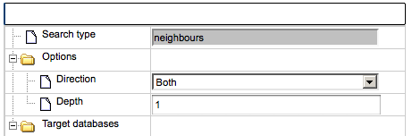

# Operations field

In the **Operations Field** (**D** in the figure described in the section organization of genexplain platform ) a number of
essential functions to operate the geneXplain platform are provided on a number
of tabs. How many and which tabs are shown depends very much on the context.

Please note that not all tabs are always visible due to space constraints. In
these cases, double arrowheads left and right of the tabs indicate that there
are additional ones, reachable by clicking on these double arrowheads  

The function of the individual tabs will be explained in more detail in those
sections where their effect is part of a certain operation. In general, the icon 

initiates the corresponding activity within the Operations Field, whereas 

applies to the results generated in the Operations Field of the Work Space.

## Changing the table structure in the Operations Field

Having opened a table in the Work Space, e.g. by double clicking on its name in
the Tree Area, it is possible to edit its structure in the Operations Field
under the tab *Columns*.

For instance, if you have opened a table with data about Enrichment GO Molecular
Mechanism (resulting from having run a GSEA), this field may look like this 

Recognizably, you can change the column headers, the data type in the column, or
its (usually hidden) descriptions. You may add an Expression, which may be a
mathematical formula, formulated in Java script; you find detailed explanations
for this when you press the Edit key () next to this field. In the last column, you can specify which columns are visible or shall be hidden (unmarking a column here does NOT delete it, it hides it from the currently displayed table).

If you hide a column by unmarking it, you have to refresh the Work Space by
pressing the button 

in the control panel right on top of the Operations Field. Here, you can also
add new () columns. Before removing a column with the button , you have to mark it by clicking somewhere in the background of the line
specifying this column; the selected item will be highlighted in blue. But be
careful: Deleting it from the table will irrevocably erase the column including
all its contents!

### Changing the layout

Under the Layout tab, you can change the layout of the diagram. First, you can
select one of the following layout schemes:

-   Hierarchical layout (default)

-   Orthogonal layout

-   Force directed layout

-   Cross cost grid layout

-   Grid layout

When you have selected another layout type, you have to press the “Prepare
layout” button (), showing the new layout at the right of the same window in the Operation Field. Pressing “Apply layout” () transfer the new layout to the Work Space.

Here are examples how the different layouts look like; the example is the Caspase 12 pathway and has been taken from the database Integrated models (*Int_casp12_module12*):

Some of the re-layouting options may take considerable time. If you want to interrupt the process, press the “Stop layout” button ().

The layout that has been applied to the Work Space can be further edited
manually. A single click on a node (component or reaction node) highlights it; it can be shifted now by mouse movement, or can be deleted (right mouse button click opens a context menu with the option “*Remove*”). The results of this
manual editing can be saved to the Operation Field () so that they will be retained for the following work.

**Please, be careful**: changes in your own diagrams are automatically saved!
You can even close the diagram in the Work Space, but still can undo your last changes with the Undo button 
(). After logout, all your changes will be automatically fixed.

Further editing of the layout schemes can be done by parameter settings in the Operation Field, Layout tab. A detailed description of these layout schemes, the underlying algorithms and parameterization can be found in the [Help texts](http://platform.genexplain.com/help/index.html?graph_layout_algorithms.htm).

## Expression Mapping

This function enables highlighting of up-regulated and down-regulated genes in
the network diagrams.

The Expression mapping tab can be found in the Operations Field after having a
network diagram opened in the work area. Initially, the expression mapping form
is empty as shown in the figure below.

First, drag and drop the table with expression data from the Tree Area over the
diagram. You might be interested to use the table with identified differentially
expressed genes and calculated fold change values for expression mapping.

**Important note.** The format of the table with expression data that can be
used depends on the format of the diagram. If the diagram was constructed based
on the TRANSPATH® database, the format of the table to drag and drop should be
“Proteins: Transpath peptides”, and the table should have the symbol 

If the diagram was constructed based on the GeneWays database, the format of
the table to drag and drop should be “Genes: Entrez”, and the table should have
the symbol 

Please check the format of the table with expression data before dragging and
dropping it over the diagram, and if necessary, convert it to the required
format with the function “Convert table” that can be found at the
analyses/Methods/Data manipulation/Convert table.

After the table with expression data is dragged and dropped, the up- and
down-regulated genes are automatically highlighted, and the expression mapping
tab looks as shown below:

Let’s consider the main options/fields of the expression mapping form.

The default type of mapping is “outside fill”, and the corresponding check-box
is checked, highlighted by the red oval below.

If the selected table contains a column **LogFoldChange**, this column is
automatically chosen in the field “Columns”, highlighted by the green oval
above. Other numerical columns in the selected table are available under the
drop-down menu, and can be chosen instead of the default column to be applied
for mapping expression data.

The fields **Minimum value** and **Maximum value** display the corresponding
values of the selected column with expression data, (see highlighted red ovals
in the figure below). These values are used to calculate the intensity of the
colors for expression.

You can select colors to indicate up- and down-regulation by mouse click over
the colored boxes, and the following toolbox will be displayed.

The expression values can be inferred by the color gradation. A more intensive
color corresponds to a bigger fold change value whereas the lighter shade
corresponds to a smaller fold change value. In this example all the up-regulated
genes are shown with a color gradient from white to red whereas down-regulated
genes are shown in with a color gradient from white to blue.

Check-in the box **Use inside fill** and check-out the box **Use outside fill**
result in the following picture.

### Graph Search

The “Graph search” option allows to extend diagrams already saved in the tree,
e.g. to add interactions around the molecules in focus. Whenever a network
diagram is opened in the Work Space, the “Graph search” tab can be found in the
Operations Field as it is shown below.

The gray fields in the graph search form cannot be edited. The user can change
the search direction (upstream of the molecule in focus, or downstream, or both
directions) and number of steps (depth) in the selected direction.

Graph search can be done in several iterations.

First iteration of a graph search.

To perform a graph search the following steps are recommended:

-   Open a diagram in the Work Space and select one element (gene or protein or
    reaction) for which you want to perform search by mouse-clicking over that
    element. On the picture below, the molecule “PAK1-isoform1” has been
    selected, marked by the red oval.

-   Use the button 

    to add the selected molecule to the elements pane. The added element is
    marked by the blue oval on the picture below.

-   Simultaneously, the database to search for additional interactions is
    automatically identified as the database based on which the network diagram
    is constructed. For the identified database the **Search engine** field is
    specified, marked by the blue oval on the picture below.

-   Next, choose the direction and depth of search.

-   Use

    

    to start the search. Once the search is finished you get the search results
    in the elements pane as shown in the screenshot below.

-   When the **Add** box is checked, the corresponding molecules will be added
    to the diagram.  
    The column with the check box **Use** means that selected molecules can be
    in turn used for searching, e.g. in the next search iteration. Direction of
    the search (up, down or both) and depth will be applied to the molecules
    with checked boxes in the **Use** column. By default, all boxes are checked.
    If you like to add to the diagram only a few molecules, you need to uncheck
    the others.

-   In the next step, found molecules can be added to the current diagram by
    using the

    

    icon. By default all found molecules are checked. The user can uncheck some
    of the molecules in the column **Add** before adding to the diagram. Only
    the molecules checked in the column **Add** are added to the diagram. Here,
    all molecules are added, as shown on the picture below.

Now, the layout for the extended diagram can be specified, details of the
layouts are described in Section “Changing the layout”.

If you would like to remove the search results and select another molecule, the
button  can be applied.

Second and next iterations of the graph search.

-   Having several molecules in the element pane at the previous iteration of a
    graph search, the user can start searching again in the specified direction
    from these molecules.

-   The user can uncheck some of the molecules in the column “Use” before
    starting the search again. Only the molecules checked-in in the column “Use”
    are used for the second search.

After the search is completed, all found molecules can be again added to the
diagram, which may result in a picture, like shown below:

