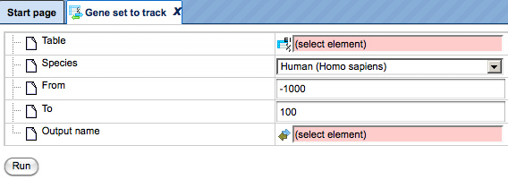

# Overview of all available tools inside the geneXplain platform

## Data manipulation
### Annotate diagram
### Annotate table

The analysis method [**Annotate table**] can be found in the Tree Area, under the Analyses tab in the folder *Methods*, subfolder *Data manipulation*

[**Annotate table**]:https://platform.genexplain.com/bioumlweb/#de=analyses/Methods/Data%20manipulation/Annotate%20table

Applying the *Annotate table* method, you can add columns to any gene or protein
table in the tree. The source for annotation columns can be a database or any
other table.

The input table will not be changed. As a result of the analysis, a new table
with additional columns will be created.

The input form of this method, when opened in the Work Space, is shown below:

![Input_Annotate_table]

[Input_Annotate_table]: images/Annotate_table.PNG

In the following, we will consider the input fields one by one:

Experiment – Input a table for which you wish to add annotation. In order for
this analysis to work properly, the ID column of this table should contain
recognizable biological identifiers that can be mapped to the annotation source
identifiers.

Species - Species corresponding to the input table. By default, human is selected. If your input table corresponds to a mouse or rat dataset, please specify it.

Annotation source – Select the data collection, a database or any table in the
tree area, which you plan to use as a source of additional columns. Below two
examples are given, with the Ensembl database and with a user-specific table as
possible annotation sources.

Annotation Columns - As soon as the annotation source is specified, all columns
of this table are visible in the drop-down menu. There you can select one or
several columns from the drop-down menu, which will be added to the input table.

Output table – Select the location in the tree area where the resulting table
will be stored, and define a name for the new table. If a table with the same
name already exists at the same location, it will be replaced.

This is an [example input] table of up-regulated Ensembl genes, which will get addional information from Ensembl database. The Annotate table method will add gene description and gene symbol information from Ensembl database.

[example input]: https://platform.genexplain.com/bioumlweb/#de=data/Examples/User%20Guide/Data/Examples%20of%20methods/Data%20manipulation/Up-regulated_genes_Ensembl

In the field Species *Human* is selected, because the input table corresponds to
a human dataset.

By default, the Ensembl database, namely its *gene* table, is selected in the
field *Annotation source*. All columns present in this table are available in the
drop-down menu of the field *Annotation columns*. As shown in the screenshot
below, two columns are selected, Gene description and Gene symbol:

![Annotation_columns]

[Annotation_columns]: images/Annotate_table_2.png

Last step is to define the *Output table* path. Now you can press the [Run] key to start the Annotate table tool.

When the analysis is complete, the output file is automatically opened in the Work Space:

![Output table][Output_table]

[Output_table]: images/Annotate_table_result_2.png

In this result table two new columns are added, Gene description and Gene
symbol, to the right of the ID column. The ID column itself, and all the other
columns are exactly the same as they were in the input table.

### Annotate track with genes

The analysis method [Annotate track]  can be found in the Tree Area, under the Analyses tab in the folder *Methods*, subfolder *Data manipulation*

[Annotate track]: https://platform.genexplain.com/bioumlweb/#de=analyses/Methods/Data%20manipulation/Annotate%20track%20with%20genes

The method *Annotate track with genes* () helps to add information about nearby located genes to each fragment. 
The input form of this method, when opened in the Work Space, is shown below:

![Input form Annotate track with genes][Input_Annotate_track_with_genes]

[Input_Annotate_track_with_genes]: images/Annotate_track_with_genes.png

**Input track**. Specify the input track. You can drag & drop it from your data project within the Tree Area into the input form. Alternatively, you may click on the pink field *select element* and a new window will be opened, where you can select the input track.

This is an [example input] track, which will get information about the nearby located genes to each fragment.

[example input]:https://platform.genexplain.com/bioumlweb/#de=data/Examples/User%20Guide/Data/Examples%20of%20methods/Data%20manipulation/CEBP%20in%20H1-hESC%20cells%20YES

This track contains 500 in-vivo binding fragments for the C/EBP transcription factor (Encode project).

**Species**. Choose human, mouse or rat from the drop-down menu.

**5’ region size** and **3’ region size**. By default this method considers the following regions around Ensembl genes: 1000 bp in 5’ direction from TSS and 100 bp in 3’ direction from the last exon. The positions of each fragment on the input track are compared with the positions of the extended gene regions. Genes overlapping with an input fragment are considered for annotation of this fragment.

**Output track**. Last step is to define the *Output track* path. Now you can press the [Run] key to start the Annotate track with genes tool.

When the analysis is complete, the output file is automatically opened in the genome browser in the Work Space:

![Output track][Output_track]

[Output_track]: images/Annotate_track_genes.PNG

When opened as a table, it looks like this:

![Output track][Output_track]

[Output_track]: images/Annotate_track_genes2.PNG

!!!!!!!!Text needs to be overworked: 
!!!!!!!!!!!!!!!!!!!!!!!!!!!!!!!!!!!
All columns of the input track are present, and one column is added, called
**Property:Genes**. This newly added column is a result of an annotation of the
input track with genes, and for each fragment it contains gene symbols of
overlapping genes. As you can see, some of the fragments are not overlapping
with any genes, and some of the fragments may be overlapping with two or even
more genes. It depends on the particular fragments, their length and location as
well as on the length of the gene-bound extension regions specified in the input
form.

Next to each gene symbol there are gene regions specified, for example *ERI1 (2
exons + intron)*. This means, a particular fragment overlaps two exons and one
intron of the ERI1 gene.

**Tip** If you would like to annotate overlapping genes for all fragments in the
input track, you might be interested to increase the gene-bound extension
regions in the input form, and run the analysis again.

### CR cluster selector
The analysis method [CR cluster selector] can be found in the Tree Area, under the Analyses tab in the folder Methods, subfolder Data manipulation.

[CR cluster selector]: https://platform.genexplain.com/bioumlweb/#de=analyses/Methods/Data%20manipulation/CR%20cluster%20selector

This method uses the result of a CRC (Chinese Restaurant Clustering) analysis and extracts most
centered cluster items into a separate table. The input form is as shown below:

![CR_Cluster_Selector] [cluster selector]

[cluster selector]: images/CR_cluster_selector_01.PNG

In the following, we will consider the input fields one by one:
Input clusters – Input the table of clusters produced as an output by CRC Analysis

Maximum number of clusters to use – Enter the maximum number of clusters to use for the analysis method. The value is set to 2 by default. 

Max items per cluster – Enter the Maximum items per cluster for the method. The value is set to 300 by default. 

Min items per cluster – Enter the Minimum items per cluster for the method. The value is set to 10 by default. 

Output folder – Select the location in the tree area where the resulting folder
will be stored, and define a name for the new output folder. 

This is an [example input] table, the table is an output of the method CRC cluster analysis. As shown in the screenshot below the method will create 5 clusters with maximum of 300 items in one cluster and minimun of 10 items in one cluster. 

![CR_Cluster_selector_processing] [CR_Cluster_selector]

[example input]: https://platform.genexplain.com/bioumlweb/#de=data/Examples/User%20Guide/Data/Examples%20of%20methods/Data%20manipulation/CRC%20clustering

[CR_Cluster_selector]: images/CR_cluster_selector_02.PNG

When the analysis is complete, the [output file] is automatically opened in the genome browser in the Work Space. As shown below, the input table clusters are divided into 5 clusters which are sorted by size. The method takes top Maximum number of clusters to use with size greater than Min items per cluster and extracts Max items per cluster items closest to the center of cluster.

![CR_Cluster_selector_output][CR_Cluster_selector_output]

[CR_Cluster_selector_output]: images/CR_cluster_selector_output_03.PNG

[output file]: https://platform.genexplain.com/bioumlweb/#de=data/Examples/User%20Guide/Data/Examples%20of%20methods/Data%20manipulation/CR%20cluster%20selector/cluster1

### Calculate weighted mutation score

### Check quotas
This method checks project disk space usage and correctsit with deleting temporary used disc space if necessary.

### Composite module to proteins
The analysis method [Composite module to proteins] can be found in the tree area, on the Analyses tab in the folder Methods, subfolder Data manipulation. This Analysis can be applied to the results of the [Construct composite modules] analysis.

[Composite module to proteins]: https://platform.genexplain.com/bioumlweb/#de=analyses/Methods/Data%20manipulation/Composite%20module%20to%20proteins

[Construct composite modules]:
https://platform.genexplain.com/bioumlweb/#de=analyses/Methods/Site%20analysis/Construct%20composite%20modules

It is designed to convert site models that are part of a composite module into transcription factors. For this conversion, the links between transcription factors and site models as they are curated in the corresponding database are used. The database is selected based on the profile you choose when you construct a composite module, which should be a step prior to this analysis. The input form is as shown below:

![Composite module to protein][CM_protein_01]

[CM_protein_01]:images/CM_protein_01.PNG
**Parameters:**
**CMA result table** – Select the results of the "Construct composite module" analysis
**Profile** – Select the profile that was used for site search. In most of the cases, profile is selected automatically.
**Species** – Select the species of the input table
**Output type** – Select type of identifiers for the resulting table
**Ignore empty values** – check this box to ignore empty values during aggregator work
**Output table** – select the path and name of the output table

For demonstration the following [input file] is selected as shown in the screen below, the profile from CMA run is selected by default by the analysis. As output type here Uniprot proteins is selected

![Composite module to protein_02][CMA_protein_02]

[input file]: https://platform.genexplain.com/bioumlweb/#de=data/Examples/User%20Guide/Data/Examples%20of%20methods/Data%20manipulation/CMA%202%20to%204%20modules%20(Site%20search%20-1000%20100)/Model%20visualization%20on%20Yes%20set
[CMA_protein_02]: images/CMA_protein_02.PNG

[Output_Proteins] table is opened automatically after completion of the method run. This table is a list of transcription factors as a gene set. This table can be used as input for the Regulator search as well as for other analyses.

[Output_Proteins]: https://platform.genexplain.com/bioumlweb/#de=data/Examples/User%20Guide/Data/Examples%20of%20methods/Data%20manipulation/CMA%202%20to%204%20modules%20(Site%20search%20-1000%20100)/Model%20TFs

### Convert table
The analysis method [Convert table] can be found in the tree area, on the Analyses tab in the folder Methods, subfolder Data manipulation. 

[Convert table]: https://platform.genexplain.com/bioumlweb/#de=analyses/Methods/Data%20manipulation/Convert%20table

This method changes the type of identifiers using the internal chain of BioHubs. BioHubs is an internal, proprietary database that maps the IDs of a wealth of data source to each other. For example, this method converts the Genes: Ensembl type of identifiers into Proteins: Ensembl. If a direct conversion between two selected types is impossible, this analysis will create an optimal chain of several BioHubs and use them subsequently.

The analysis input form when opened in the work space is shown below:

![Convert_table][Convert_table]

[Convert_table]: images/Convert_table_01.PNG

In the following, we will consider the input fields one by one:

**Input table**: Input the data table for which you wish to convert the identifiers.

**Input type**: Type of identifiers in the input table. This is automatically detected in the majority of cases. However, if there are two columns with different identifiers in the input table, you can manually select the identifier you wish to convert.

**Output type**: Type of identifiers into which you wish to convert the input type.

**Species**: Select human, mouse or rat, corresponding to the input table.

Numerical value treatment rule: Select one of the rules for treating the values in the numerical columns of the input table. Rule selection is important, when several rows are merged into a single one. We have to take into account that one identifier of a given type may correspond to several identifiers of another type, each of which is associated with a numerical value in the Leading Column (for this, see below). To choose which of these numerical values has to be taken into the merged row, a rule has to be defined. It is to be chosen from a drop-down menu. By default the “extreme” rule is selected, which is equivalent to the maximal value in case of positive numbers, but corresponds to the minimal value in case of negative numbers. In cases of “average”, “average w/o 20% outliers” and “sum”, the selected rule is applied to all numerical columns of the table.

In case of the “minimum”, “maximum” and “extreme” rules a new option appears below which requests the user to select a Leading column. The chosen rule is applied then to the values in the selected Leading column (e.g. in the Leading column the maximum value is computed among all merged rows). All other numerical values of the table will be taken from that row which corresponds to the selected value in the leading column.

**Output table**: Path to store the resulting table in the tree.

**Note**: Several non-trivial situations might occur during conversion:

- A single source ID matches to several target IDs. In this case the source row will be copied several times, one copy per target ID.
- A source ID doesn’t match to any target ID. In this case the source row will be removed from the result.
- Several source IDs match to a single target ID. In this case two options are available:
a) If you have specified the leading column, only one out of all suitable source rows will be shown in the resulting table, based on the specified rule. For example, if you specified ‘maximum’ as a rule, the source row with maximal value in the main column will be selected from suitable rows.
b) If you have not specified a leading column, all the corresponding source rows will be merged together using merging rules. Non-trivial columns like ‘Graph’ will not be shown in the resulting table. Text columns will have all values joined into a sorted comma-separated list with duplicates removed. Numerical columns will be merged based on the selected rule. For example, if you select ‘average’ as a rule, then the mean value will appear in the resulting table. If your source column has an integer type, it might be changed into float.

**Example**: Conversion of Ensembl gene IDs to UniProt IDs

The [input table] is selected and the corresponding parameters are filled as shown in the screen shot below: 

![Convert_table][Convert_table]

[input table]: https://platform.genexplain.com/bioumlweb/#de=data/Examples/User%20Guide/Data/Examples%20of%20methods/Data%20manipulation/Upregulated%20Ensembl%20genes%20filtered%20(logFC%3E1)

[Convert_table]: images/Convert_table_02.PNG

Upon completion of the analysis the [output_file] is opened by default.

[output_file]: https://platform.genexplain.com/bioumlweb/#de=data/Examples/User%20Guide/Data/Examples%20of%20methods/Data%20manipulation/Upregulated%20Ensembl%20genes%20filtered%20(logFC%3E1)%20Proteins%20UniProt

The column ID now contains UniProt IDs. The column Ensembl ID, which was the ID column in the input table, is also present in the output table, as the second column to the right of the new ID column.

All the other columns of the input table are included in the output table as well. Numerical values are calculated according to the selected rule.

Similarly, any other table in the tree area with gene or protein identifiers can be converted into the desired type of identifiers.

### Convert table to track
The analysis method [Convert table to track] can be found in the Tree Area, under the Analyses tab in the folder Methods, subfolder Data manipulation

[Convert table to track]: https://platform.genexplain.com/bioumlweb/#de=analyses/Methods/Data%20manipulation/Convert%20table%20to%20track

This analysis method converts a table to a track. The table should essentially have chromosome/sequence location and positions for converstion to track. The algorithm matches the position of chromosomes to the sequence collection selected in the input form to convert the table to a track which can be visualized in the genome browser. 

Input form of the method looks as shown below:
![Convert_table_to_track][input_form]

[input_form]: images/convert_track_input_01.PNG
The parameters are explained below:
**Input table** – Table to convert to the track
**Chromosome (sequence) column**– Column where chromosome number is located (either like 'chr1', 'chr:1', 'chr.1' or simply '1')
**From column** – Column where site start coordinate is located
**To column** – Column where site end coordinate is located
**Strand column** – Column where site strand is located (+ or -)
**Sequence collection** – select the relevant Ensembl sequence for visualization of binding sites
**Genome ID string** – Something like 'hg18' or 'mm6'
**Output track** – Define the path and name of the output track

Example: The input table [Convert_table_track_input] with all pre-requisite columns  needed to convert to a track is selected and the corresponding parameters are filled as shown below:

![Convert_table _to_track][Convert_table _to_track]

[Convert_table _to_track]: images/convert_table_track_01.PNG

[Convert_table_track_input]: https://platform.genexplain.com/bioumlweb/#de=data/Examples/User%20Guide/Data/Examples%20of%20methods/Data%20manipulation/Convert_table_track_input

Output track opens in the genome browser post completion of the method. For this example 21 sites were created in the [output track]

[output track]: https://platform.genexplain.com/bioumlweb/#de=data/Examples/User%20Guide/Data/Examples%20of%20methods/Data%20manipulation/Convert_table_track_input%20track

### Convert table via homology
The analysis method [Convert table via homology] can be found in the Tree Area, under the Analyses tab in the folder Methods, subfolder Data manipulation.
This analysis is pretty similar to [Convert table] analysis, but allows to map identifiers from one species to another using the data from Ensembl Compara database. Thus you need to specify Input and Output data type and species in the input form.

[Convert table via homology]: https://platform.genexplain.com/bioumlweb/#de=analyses/Methods/Data%20manipulation/Convert%20table%20via%20homology
[Convert table]: 
https://platform.genexplain.com/bioumlweb/#de=analyses/Methods/Data%20manipulation/Convert%20table

### Create Random track
This method creates a track of randomly sampled sequence regions, also denoted as intervals, segments or subsequences. Upstream regions of genes serve as source for the random segments.
Sampling can take into account an input track in two ways. First, the lengths of output regions are sampled from lengths observed in the input track, so that the output track has a similar length distribution. This functionality can be overridden by specifying a common sequence length, in which case all sampled sequences will have the same length. Second, gene upstream regions that overlap with segments in the input track can be omitted from the sampling. Omission of overlapping upstream regions is active by default and can be switched off (see parameter description).

Specification of an input track is optional. Random seed and sequence length arguments with values less than or equal to 0 are ignored. However, if no input track is provided, the sequence length argument is required.

![create_random_track][create_random_track]

[create_random_track]: images/create_random_track_01

The input mask of the tool is shown above. The parameters are described in the following.

**Input track**: This is argument is optional. The input track can be supplied to obtain a random track with a similar length distribution and/or void of segments overlapping with input intervals.

**Sequence source**: The sequence source specifies which sequences are associated with intervals. Note that you can apply a custom source, e.g. a specifically uploaded genome. Clicking on the “Custom” option will open a new field to choose the custom sequence source.

**Species**: Upstream regions of genes will be compiled from the annotation for the specified species.

**Standard chromosomes**: If marked (default), sampling will only take into account standard chromosomes. As non-standard chromosomes, this analysis considers for instance haplotype segments.

**Sequence number**: This is the number of sequence regions to sample.

**Sequence length**: If greater than 0, this value specifies one length for all sampled sequence regions. Otherwise, an input track must be provided and random interval length will be sampled from length observed in the input track.

**Allow overlap**: If marked, sampled intervals are allowed to overlap with input intervals.

**Output track**: The path of the track with random track to be created.

**Random number seed**: If greater than 0, this number will be supplied as seed for the random number generator in order to be able to reproduce the sampling result.

Example: An [Input_track] is selected to run the method, the track is mapped to hg19 build and hence hg19 is selected in the input form as shown below:

![Create_random_track][Create_random_track]

[Input_track]: https://platform.genexplain.com/bioumlweb/#de=data/Examples/User%20Guide/Data/Examples%20of%20methods/Data%20manipulation/GSM558469_E2F1_hg19%20filtered%20chr%201

[Create_random_track]: images/Create_Random_track_01.PNG

[Output Random track] opens automatically in the genome browser post completion of the method run. 

[Output Random track]: https://platform.genexplain.com/bioumlweb/#de=data/Examples/User%20Guide/Data/Examples%20of%20methods/Data%20manipulation/Random_track_hg19

### Create tissue-specific promoter track
The analysis method [Create tissue-specific promoter track] can be found in the tree area, on the Analyses tab in the folder Methods, subfolder Data manipulation.

[Create tissue-specific promoter track]: https://platform.genexplain.com/bioumlweb/#de=analyses/Methods/Data%20manipulation/Create%20tissue-specific%20promoter%20track

This method uses a set of Ensembl genes as input and extracts promoter regions by mapping it against the TSS locations defined in CAGE data in the Fantom5 (Nature 507:462–470) database 

The input form is as shown below:

![][Create_tissue_specific_promoter_track]

[Create_tissue_specific_promoter_track]: images/tissue_specific_promoter_track_01

**Input genes**: Enter the set of genes or a gene table to extract transcription start sites (TSSs).

**CAGE TSS database**: Specify the path of the Fantom database.

**Cell/Tissue condition**: Once you specify the database, select the cells/tissues for which you want to create the promoter track from the drop-down menu.

**From/To**- Specify the promoter length relative to the TSS; by default the promoter length is from -1000 to +100 bp

**TSS selection**: The TSS should be selected if there are multiple TSS. By default the most active site is considered as TSS.

**Substitute default**: By default this box is unchecked. If checked it will substitute the gene promoter by default, if the promoter is missing in the selected condition.

**Output path**: Define the output file name and path in the tree area where you wish to save the Fantom5 promoter track.

For example: the method is run using a set of [upregulated genes] from brain tumor as input, specifying brain: normal as cell tissue condition, and keeping all other conditions as default.

[upregulated genes]: https://platform.genexplain.com/bioumlweb/#de=data/Examples/User%20Guide/Data/Examples%20of%20methods/Data%20manipulation/Upregulated%20Ensembl%20genes%20filtered%20(logFC%3E1)

Upon completion the [output_promoter_track] is opened in the work space :

[output_promoter_track]: https://platform.genexplain.com/bioumlweb/#de=data/Examples/User%20Guide/Data/Examples%20of%20methods/Data%20manipulation/Upregulated%20Ensembl%20genes%20filtered%20(logFC%3E1)%20Fantom5%20promoters

These set of promoters can be used as an input for other site analysis workflows.

### Create transcript region track
The analysis method [Create transcript region track] can be found in the tree area, on the Analyses tab in the folder Methods, subfolder Data manipulation.

[Create transcript region track]: https://platform.genexplain.com/bioumlweb/#de=analyses/Methods/Data%20manipulation/Create%20transcript%20region%20track

This method allows for creating tracks specific for particular transcript regions, e.g. promoters, 5’ UTRs, 3’ UTRs, exons, introns. Input form is as shown below:

![Create transcript region track][Create transcript region track]

[Create transcript region track]: media/111333210c95bdb944cbafb043648e8b.png

Here it is shown how to create a track with 5’ UTR sequences starting from input transcripts. The input should be a table with Ensemble transcripts.

In the following, the input fields are shown one by one:

**Input transcripts** - Enter a table of Ensemble transcripts in this field. You can either drag and drop the file from the tree area or select it from the drop-down menu. In case your gene table does not have transcript information, use the ‘convert table’ function(section XXX) to convert any gene or protein table into Ensembl transcripts.

**Species** – Select the species of the input transcripts.

**Transcript region** – You can select the part of a transcript region which you wish to include in the output track. The region can be selected from 3’ UTR, 5’ UTR, promoter, intron, and exon.

![][input_form]

[input_form]: media/c8f7646c615500c399c6aa22fb5ecd7c.png

As soon as you have chosen a transcript region from the drop-down menu, the following input fields are adjusted. If Promoter is selected as the transcript region, the input form becomes the following:

![][input_form_01]

[input_form_01]:media/6a7d701940cc104fbde69c8526e1311e.png

**Promoter start** – You should specify the first base of the promoter relative to the TSS.

**Promoter end** – Here you should specify the last base of the promoter relative to the TSS.

If 3’ UTR or 5’ UTR are selected as the transcript region, the input form looks as follows.

![][input_form_02]

[input_form_02]:media/317c35b68eb912d09a09835de83e9063.png

*First/last exon as UTR* - This check box can be used to select the first or last exon as UTR if it is not defined in the input transcript. By default this box is unchecked.

*Fixed UTR length* – The column can be used to create UTRs of fixed length. By default the method uses 300bp as the track length. Please note that actual UTRs can be very long.

*Ignore CDS information* – This box is checked to ignore CDS information and create fixed length UTRs. By default this box is checked.

*Output path* - Specify the path to store the result and indicate the name of the output track or sequences.

If Exon or Intron are selected as the transcript region, the input form is adjusted as follows:

![][input_form_03]

[input_form_03]: media/93743502c91d37d5d7ff0d04fe34b797.png
*Exon/Intron number* - This field becomes active when you select Intron or Exon as the transcript region. You should specify 1, 2 … for first, second, … exon/intron, or -1, -2, … for last, second last, … exon/intron.

**Output path** - Specify the path to store the result and indicate the name of the output track or sequences.

Below it is shown how to create a track with 5’ UTR sequences starting from the input transcripts. The [**input**] is a table with Ensemble transcripts. 

[**input**]: https://platform.genexplain.com/bioumlweb/#de=data/Examples/User%20Guide/Data/Examples%20of%20methods/Data%20manipulation/Upregulated%20Ensembl%20genes%20filtered%20(logFC%3E1)%20Transcripts%20Ensembl

After the run is completed, the [output_transcript_track] is opened automatically in the work space.

[output_transcript_track]: https://platform.genexplain.com/bioumlweb/#de=data/Examples/User%20Guide/Data/Examples%20of%20methods/Data%20manipulation/Upregulated%20Ensembl%20genes%20Transcripts%20Ensembl%20transcript%20region

You can select the sequence (chromosome) number from the drop-down arrow menu and view the corresponding track file.

The track file when viewed as a table looks like as shown below:

![][output_01]

[output_01]: media/203c18216748f6d082d085ac6297a026.png

The resulting tracks file can be used as input for various other workflows, for example to search for TF binding sites, enriched motifs and composite modules, and others.

### Filter duplicate rows
The analysis method [Filter duplicate rows] can be found in the tree area, on the Analyses tab in the folder Methods, subfolder Data manipulation.

[Filter duplicate rows]:https://platform.genexplain.com/bioumlweb/#de=analyses/Methods/Data%20manipulation/Filter%20duplicate%20rows

This method filters duplicate rows from the input table and gives a non-redundant output. The rows which have same score value are removed from the output table.
Input mask of the tool is as shown below:
![][Filter_duplicate_01]

[Filter_duplicate_01]: images/Filter_duplicate_rows
parameters are described as follows:
**Input table**: Input the table to filter duplicate rows
**Primary column** – Select the column which have duplicate entries 
**score column** – Selection of this column is optional. It is used to select row among duplicates
**Output table** – The path and name of the filtered output table 

### Filter one track by another
The analysis method [Filter one track by another] can be found in the tree area, on the Analyses tab in the folder Methods, subfolder Data manipulation.

[Filter one track by another]: https://platform.genexplain.com/bioumlweb/#de=analyses/Methods/Data%20manipulation/Filter%20one%20track%20by%20another
This analysis filters out those sites which are present or absent in another track. The input form is shown below:

![][Filter_track_input]

[Filter_track_input]: images/Filter_one_track_01.PNG

Parameters:
**Input track** – Input the track which you want to filter
**Filter track** – Input the Track which you want to use as a filter
**Max distance** – Maximal difference between site starts and ends to consider sites equal, by default the value assigned is 0
**Fields to compare** – Select the fields which you want to compare and filter.  aside from sites position and strand
**Filtering mode** – Specify how to perform the filtering by selecting from the three options, Intersect -> select this option if you want to 
Intersect (leave both sites)
Subtract
**Output track** – Specify the path and name of the output filtered track.
For demonstration we use two test tracks as input
[Test_track_1] and [Test_track_2]

[Test_track_1]:https://platform.genexplain.com/bioumlweb/#de=data/Examples/User%20Guide/Data/Examples%20of%20methods/Data%20manipulation/Test_track_1
[Test_track_2]: https://platform.genexplain.com/bioumlweb/#de=data/Examples/User%20Guide/Data/Examples%20of%20methods/Data%20manipulation/Test_track_2

keeping all other parameters as default, different filtering modes were selected as shown below:
![][Filter_one_track_02]

[Filter_one_track_02]: images/Filter_one_track_02.PNG

Filtering mode 'intersect' gives an [output_track_01] with only common sites between the two tracks. Filtering mode'intersect (leave both sites)' gives an [output_track_02] that leaves all sites from both tracks  which are not in the same position. Filtering mode 'subtract' gives an [output_track_03] with only Track 01 unique sites. All the filtered tracks can be visualized in the genome browser. 

[output_track_01]: https://platform.genexplain.com/bioumlweb/#de=data/Examples/User%20Guide/Data/Examples%20of%20methods/Data%20manipulation/Test_track_1%20filtered_intersect

[output_track_02]: https://platform.genexplain.com/bioumlweb/#de=data/Examples/User%20Guide/Data/Examples%20of%20methods/Data%20manipulation/Test_track_1%20filtered_intersect_leave_both_sites

[output_track_03]: https://platform.genexplain.com/bioumlweb/#de=data/Examples/User%20Guide/Data/Examples%20of%20methods/Data%20manipulation/Test_track_1%20filtered_subtract

### Filter table
The analysis method [Filter table] can be found in the tree area, on the Analyses tab in the folder Methods, subfolder Data manipulation.

[Filter table]: https://platform.genexplain.com/bioumlweb/#de=analyses/Methods/Data%20manipulation/Filter%20table

This analysis filters a table (that is, to remove rows which don't fulfill given condition). It doesn't modify the original table. The analysis is functionally equivalent to the 'Filters' tab which you can find under the opened table document.
Input form looks as shown below:

![Filter table][Filter_table_01]

[Filter_table_01]: images/Filter_table_01.PNG

**Parameters**:
**Input table** – Table to filter
**Filtering expression** – Expression must be written in JavaScript language to sort out filtered and non-filtered rows. Inside it you may use column names and various operations supported by JavaScript. Note that non-alphanumeric symbols in column names should be replaced with underscores ('_'). To determine exactly how to refer to columns in your table, you may open the table as the document, select 'Filters' tab below and check 'Columns' list. Alternatively you may use $ object to access columns by original name. For example, if you have the column named "Fold change", you may refer to it either as Fold_change or as $["Fold change"]. Some of useful JavaScript operations are listed below:

== – check equality (don't mix with single '=').
!= – check inequality. 
>; <; >=; <=; greater than, lesser than, greater or equal, lesser or equal.
+; −; *; / – standard math operations.
&&; || – logical 'and' and 'or' operations.
Math.sqrt(x); Math.sin(x); Math.pow(x,y); etc. – math functions.
Math.min(x,y); Math.max(x,y) – minimal and maximal value of two arguments.
Simple condition example (select all rows where value in column Log(Fold Change) is greater than 2):
Log_Fold_Change_ > 2
Complex condition example (select all rows where either Score1 or Score2 has absolute value more than 10 and non-empty GeneSymbol):
Math.max(Math.abs(Score1),Math.abs(Score2)) > 10 && GeneSymbol != ""

**Filtering mode** – Select the options to specify how to perform the filtering

**Output table** – Select the Path and name of the output filtered table

here we consider upregulated genes as an input table for demonstration [input_filter_table]. We want to filter all genes with logfoldchange>1

[input_filter_table]: https://platform.genexplain.com/bioumlweb/#de=data/Examples/User%20Guide/Data/Examples%20of%20methods/Data%20manipulation/Upregulated%20Ensembl%20genes

Filtering expression is written as LogFoldChange > 1 as shown below:

![Filter_table][Filter_table_02]

[Filter_table_02]: images/Filter_table_02.PNG
[Output_filtered_table] is opened automatically after the method run completes. 

[Output_filtered_table]: https://platform.genexplain.com/bioumlweb/#de=data/Examples/User%20Guide/Data/Examples%20of%20methods/Data%20manipulation/Upregulated%20Ensembl%20genes%20filtered

### Filter track by condition
The analysis method [Filter track by condition] can be found in the tree area, on the Analyses tab in the folder Methods, subfolder Data manipulation. This analysis leaves only those sites which satisfy a given JavaScript condition. Each site from the track is tested against the condition.

[Filter track by condition]: https://platform.genexplain.com/bioumlweb/#de=analyses/Methods/Data%20manipulation/Filter%20track%20by%20condition

Input form is as shown below:
![][Filter_track_condition]

[Filter_track_condition]: images/Filter_track_condition_01.PNG

Parameters:
**Input track** – track you want to filter
**Condition** – JavaScript expression which must return true if condition passed or false otherwise. The following variables are available:
seq – sequence or chromosome name,
from – site start position,
to – site end position,
length – site length,
strand – site strand (0 = unknown, 1 = n/a, 2 = +, 3 = −, 4 = both),
type – site type,
properties – additional track-specific properties
**Output track** – specify the path where to store the result
Here we consider an example input track [filter_track_input] for demonstration and filter it to get all sites on Chromosome 1

[filter_track_input]:https://platform.genexplain.com/bioumlweb/#de=data/Examples/User%20Guide/Data/Examples%20of%20methods/Data%20manipulation/GSM3999730_H1hESC_SMAD1_untreated_ChIP_peaks

Condition is specified as seq==1
After specifying the output path when we press 'run' the [output_filtered_track] opens automatically.

[output_filtered_track]: https://platform.genexplain.com/bioumlweb/#de=data/Examples/User%20Guide/Data/Examples%20of%20methods/Data%20manipulation/GSM3999730_H1hESC_SMAD1_untreated_ChIP_peaks%20filtered

### Gene set to track

The method *Gene set to track* () aims at creating a track corresponding to any table with Ensembl gene IDs. As with the fragments of the output track, this method takes the gene regions
around TSS (transcription start sites). It is a useful method to create a track
of gene promoters or upstream regions for any input gene table. The input form
is shown below:

**Input table**. Specify the input table with Ensembl gene IDs. If your table
has different IDs, you need to convert it first. You can drag & drop the table
from your project within the tree area. Alternatively, you may click on the pink
field *select element* and a new window will be opened, where you can select the
table. Here, we take a list of Ensembl genes as [Input]

[Input]: https://platform.genexplain.com/bioumlweb/#de=data/Examples/User%20Guide/Data/Examples%20of%20methods/Data%20manipulation/Upregulated%20Ensembl%20genes%20filtered%20(logFC%3E1)

You can see Ensembl gene IDs in the column **ID**. Such a table may contain any
number of additional columns. Here, three additional columns are present, **Gene
description**, **Gene symbol** and **Affymetrix ID**.

**Species**. After input of the table, the species (human, mouse or rat) is
adjusted automatically. Verify the species shown in the species field.

**From** and **To**. By default this method considers the following regions
around the TSS of the input genes: 1000 bp in 5’ direction and 100 bp in 3’
direction.

**Output track**. Specify the path and name to store the output track.

Having filled in the input form, launch the analysis with the [Run] button. Wait
till the analysis is completed. The resulting [output_geneset_track] is automatically opened in
genome browser in your work space.

[output_geneset_track]: https://platform.genexplain.com/bioumlweb/#de=data/Examples/User%20Guide/Data/Examples%20of%20methods/Data%20manipulation/Upregulated%20Ensembl%20genes%20filtered%20(logFC%3E1)%20track

The [output_geneset_track] when opened as a table  contains exactly the same number of the fragments (rows) as the number of Ensembl genes in the input table. There are columns for **chromosome**, positions **From** and **To**, **Length**, **Strand**, and **Type**. The type of the fragments after this conversion is automatically assigned as *misc_feature*. Other columns present in the input table are all added on the right side of this table, e.g. here **Affymetrix ID** column.

### Group table rows
The analysis method [Group table rows] can be found in the tree area, on the Analyses tab in the folder Methods, subfolder Data manipulation. This method helps to group selected rows from the input table. Output will contain a table with the number of counts of the identical rows in a specified column.

[Group table rows]: https://platform.genexplain.com/bioumlweb/#de=analyses/Methods/Data%20manipulation/Group%20table%20rows
Input form is as shown below:
![Group table rows][Group_table_rows_01]

[Group_table_rows_01]: images/Group_table_rows_01.PNG
**Parameters:**
**Input table** – Select the Input table with duplicate rows
**Group column** – Select the column in the row, Rows will be grouped by this column
**Output table** – Select the path and name of the Output table

For demonstration a gene table is used as [Input_Group_table_Rows] for this method. The group column selected is -log(P-value). The [Output_grouped_table] opens by automatically as soon as the analyses complete. The table gives the 'count' of the selected group column, in this case -log(P-value)

[Input_Group_table_Rows]: https://platform.genexplain.com/bioumlweb/#de=data/Examples/User%20Guide/Data/Examples%20of%20methods/Data%20manipulation/Genes%2C%20fold%20change%20and%20p-value%2C%20non-filtered
[Output_grouped_table]:
https://platform.genexplain.com/bioumlweb/#de=data/Examples/User%20Guide/Data/Examples%20of%20methods/Data%20manipulation/Genes%2C%20fold%20change%20and%20p-value%2C%20non-filtered%20grouped

### Intersect tables
The analysis method [Intersect tables] () can be found in the Tree Area, under the Analyses tab in the folder *Methods*, subfolder *Data manipulation*. 