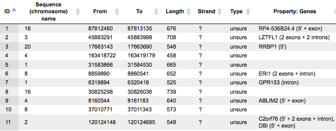
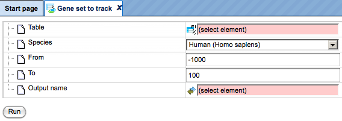
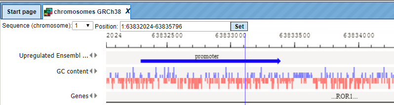
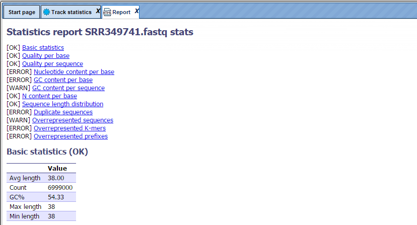

# Popular functions

## Operations with tables

Any table may be opened by double-clicking the corresponding name in the Tree
Area. It will open under a new tab in the Work Space.

The contents of the table are sorted according to the values in one of its
columns. Being opened for the first time, a default column is defined for
sorting, usually the ID column. This default column is indicated by a blue
arrowhead. If this arrowhead points upwards, the table rows are sorted in
ascending order of this column’s values. Clicking on this arrowhead will change
it into a downwards pointing one, while the values are sorted in descending
order. Correspondingly, you may sort the table according to the values of any
other column in ascending or descending order by clicking on the up- or
downwards pointing gray arrowhead on top of this column, respectively.

On top of the table, you can navigate between the individual pages of the table;
it is also shown on which page out of how many pages in total you are, and in
the right top corner, the page size in terms of number of entries (rows) is
shown and can be adjusted.

You can edit the contents of a table by pressing the [Edit] button in the right
upper corner. Now, you can manually edit the contents of each cell in the table.
With the [Apply] option, you will save this change, while [Cancel] quits it.

Even without activating the Edit function, you can select

-   individual rows with a left-mouse click,

-   several ones by keeping the Ctrl key pressed,

-   a range of rows with the Shift key pressed when clicking on the last row of
    the range to be selected, or

-   [Select all] by clicking on the corresponding button.

The selected rows can be saved as a separate file, which by default is given the
name *\<original file name\> subset*, but you can change this name.

### Changing the table structure in the Operations Field

Having opened a table in the Work Space, e.g. by double clicking on its name in
the Tree Area, it is possible to edit its structure in the Operations Field
under the tab *Columns*.

For instance, if you have opened a table with data about Enrichment GO Molecular
Mechanism (resulting from having run a GSEA), this field may look like this:

Recognizably, you can change the column headers, the data type in the column, or
its (usually hidden) descriptions. You may add an Expression, which may be a
mathematical formula, formulated in Java script; you find detailed explanations
for this when you press the Edit key (

) next to this field. In the last column, you can specify which columns are
visible or shall be hidden (unmarking a column here does NOT delete it, it hides
it from the currently displayed table).

If you hide a column by unmarking it, you have to refresh the Work Space by
pressing the button

in the control panel right on top of the Operations Field. Here, you can also
add new () columns. Before removing a column with the button

, you have to mark it by clicking somewhere in the background of the line
specifying this column; the selected item will be highlighted in blue. But be
careful: Deleting it from the table will irrevocably erase the column including
all its contents!

### Annotate table

The analysis method *Annotate table* () can be found in the Tree Area, under the Analyses tab in the folder *Methods*, subfolder *Data manipulation*. The complete path to this method is:

<https://platform.genexplain.com/bioumlweb/#de=analyses/Methods/Data%20manipulation/Annotate%20table>

Applying the *Annotate table* method, you can add columns to any gene or protein
table in the tree. The source for annotation columns can be a database or any
other table.

The input table will not be changed. As a result of the analysis, a new table
with additional columns will be created.

The input form of this method, when opened in the work space, is shown below:

In the following, we will consider the input fields one by one:

Experiment – Input a table for which you wish to add annotation. In order for
this analysis to work properly, the ID column of this table should contain
recognizable biological identifiers that can be mapped to the annotation source
identifiers.

Species - Species corresponding to the input table. By default, human is
selected. If your input table corresponds to a mouse or rat dataset, please
specify it.

Annotation source – Select the data collection, a database or any table in the
tree area, which you plan to use as a source of additional columns. Below two
examples are given, with the Ensembl database and with a user-specific table as
possible annotation sources.

Annotation Columns - As soon as the annotation source is specified, all columns
of this table are visible in the drop-down menu. There you can select one or
several columns from the drop-down menu, which will be added to the input table.

Output table – Select the location in the tree area where the resulting table
will be stored, and define a name for the new table. If a table with the same
name already exists at the same location, it will be replaced.

Annotate table of Affymetrix probe IDs with gene description and gene symbol

As input, a table with normalized Affymetrix probes is selected. This input file
can be accessed with the URL:

<https://platform.genexplain.com/bioumlweb/#de=data/Examples/Brain%20Tumor%20GSE1825%2C%20Affymetrix%20HG-U133A%20microarray/Data/Ewing%20Family%20Tumor%20versus%20Neuroblastoma/Experiment%20normalized%20(RMA)>

In the field Species *Human* is selected, because the input table corresponds to
a human dataset.

By default, the Ensembl database, namely its gene table, is selected in the
field Annotation source. All columns present in this table are available in the
drop-down menu of the field Annotation columns. As shown in the screenshot
below, two columns are selected, Gene description and Gene symbol:

Next, the output path is defined, and you can press the [Run] button.

After completion of the analysis the output file is opened automatically in the
work space as shown below:

In this result table two new columns are added, Gene description and Gene
symbol, to the right of the ID column. The ID column itself, and all the other
columns are exactly the same as they were in the input table.

### Annotate a gene or protein table with expression values

You may wish to see the expression values in any gene or protein table. In this
example, let’s consider the annotation of the master regulatory molecules table
with fold change values. Such a table can be generated, e.g. by the workflows
*Find master regulators in networks,* 

Further steps are shown with the following input table:

<https://platform.genexplain.com/bioumlweb/#de=data/Examples/Brain%20Tumor%20GSE1825%2C%20Affymetrix%20HG-U133A%20microarray/Data/Ewing%20Family%20Tumor%20versus%20Neuroblastoma/Upregulated%20Ensembl%20genes%20filtered%20(logFC%3E1)%20(Master%20regulators%20Transpath)/Regulators%20upstream%2010>

In the field Species *Human* is selected, because the input table corresponds to
a human dataset.

As Annotation source you can use a table with expression values corresponding to
this dataset. You may have such a table in your tree area, e.g. a table with
differentially expressed genes. In this example, the following table is used as
annotation source:

<https://platform.genexplain.com/bioumlweb/#de=data/Examples/Brain%20Tumor%20GSE1825%2C%20Affymetrix%20HG-U133A%20microarray/Data/Ewing%20Family%20Tumor%20versus%20Neuroblastoma/Upregulated%20Ensembl%20genes%20filtered%20(logFC%3E1)>

As soon as the annotation source table is selected in the field Annotation
source, you can see all available columns in the drop-down menu of the
Annotation columns field. The LogFoldchange column is selected as shown below:

Next, the output path is defined, and you can press the [Run] button.

After completion of the analysis the output file is opened automatically in the
work space as shown below:

In this result table one new column is added, LogFoldChange, to the right of the
ID column. The ID column, and all the other columns are exactly the same as they
were in the input table.

## Convert identifiers for a gene table

### Single gene table

The analysis method *Convert table* () can be found in the tree area, on the Analyses tab in the folder *Methods*, subfolder *Data manipulation*. The complete path to this method is:

<https://platform.genexplain.com/bioumlweb/#de=analyses/Methods/Data%20manipulation/Convert%20table>

This method changes the type of identifiers using the internal chain of BioHubs.
BioHubs is an internal, proprietary database that maps the IDs of a wealth of
data source to each other. For example, this method converts the *Genes:
Ensembl* type of identifiers into *Proteins: Ensembl*. If a direct conversion
between two selected types is impossible, this analysis will create an optimal
chain of several BioHubs and use them subsequently.

The analysis input form when opened in the work space is shown below:

In the following, we will consider the input fields one by one:

Input table: Input the data table for which you wish to convert the identifiers.

Input type: Type of identifiers in the input table. This is automatically
detected in the majority of cases. However, if there are two columns with
different identifiers in the input table, you can manually select the identifier
you wish to convert.

Output type: Type of identifiers into which you wish to convert the input type.

Species: Select human, mouse or rat, corresponding to the input table.

Numerical value treatment rule: Select one of the rules for treating the values
in the numerical columns of the input table. Rule selection is important, when
several rows are merged into a single one. We have to take into account that one
identifier of a given type may correspond to several identifiers of another
type, each of which is associated with a numerical value in the Leading Column
(for this, see below). To choose which of these numerical values has to be taken
into the merged row, a rule has to be defined. It is to be chosen from a
drop-down menu. By default the “extreme” rule is selected, which is equivalent
to the maximal value in case of positive numbers, but corresponds to the minimal
value in case of negative numbers. In cases of "average", "average w/o 20%
outliers" and "sum", the selected rule is applied to all numerical columns of
the table.

In case of the "minimum", "maximum" and "extreme" rules a new option appears
below which requests the user to select a Leading column. The chosen rule is
applied then to the values in the selected Leading column (e.g. in the Leading
column the maximum value is computed among all merged rows). All other numerical
values of the table will be taken from that row which corresponds to the
selected value in the leading column.

Output table: Path to store the resulting table in the tree.

Note that several non-trivial situations might occur during conversion:

-   A single source ID matches to several target IDs. In this case the source
    row will be copied several times, one copy per target ID.

-   A source ID doesn't match to any target ID. In this case the source row will
    be removed from the result.

-   Several source IDs match to a single target ID. In this case two options are
    available:

If you have specified the leading column, only one out of all suitable source
rows will be shown in the resulting table, based on the specified rule. For
example, if you specified 'maximum' as a rule, the source row with maximal value
in the main column will be selected from suitable rows.

If you have not specified a leading column, all the corresponding source rows
will be merged together using merging rules. Non-trivial columns like 'Graph'
will not be shown in the resulting table. Text columns will have all values
joined into a sorted comma-separated list with duplicates removed. Numerical
columns will be merged based on the selected rule. For example, if you select
'average' as a rule, then the mean value will appear in the resulting table. If
your source column has an integer type, it might be changed into float.

Example: Conversion of Ensembl gene IDs to UniProt IDs

The input table with Ensembl gene IDs can be accessed via URL:

<https://platform.genexplain.com/bioumlweb/#de=data/Examples/Brain%20Tumor%20GSE1825%2C%20Affymetrix%20HG-U133A%20microarray/Data/Ewing%20Family%20Tumor%20versus%20Neuroblastoma_new/Experiment%20normalized%20(RMA)%20(Differentially%20expressed%20genes%20Affy)/Upregulated%20Ensembl%20genes>

Fill the input fields and press [Run] as shown below:

Upon completion of the analysis the output file is opened by default as shown
below

<https://platform.genexplain.com/bioumlweb/#de=data/Examples/Brain%20Tumor%20GSE1825%2C%20Affymetrix%20HG-U133A%20microarray/Data/Ewing%20Family%20Tumor%20versus%20Neuroblastoma/Upregulated%20Ensembl%20genes%20Proteins%20UniProt>

The column ID now contains UniProt IDs. The column Ensembl ID, which was the ID
column in the input table, is also present in the output table, as the second
column to the right of the new ID column.

All the other columns of the input table are included in the output table as
well. Numerical values are calculated according to the selected rule.

Similarly, any other table in the tree area with gene or protein identifiers can
be converted into the desired type of identifiers.

### Multiple gene sets

The input is a folder with several gene tables. The steps of this workflow for
each individual gene table are the same as described in the section above. The
same steps are performed iteratively for each of the gene tables in the input
folder.

The output is a folder which contains subfolders with the results for each
individual input table. The subfolders are automatically given the same names as
the input tables.

## Join tables

The analysis method *Join tables* () can be found in the Tree Area under the Analyses tab in the folder *Methods*,

subfolder *Data manipulation*. The complete path to this method is:

https://platform.genexplain.com/bioumlweb/\#de=analyses/Methods/Data%20manipulation/Join%20tables

Applying the *Join table* method, you can join two tables together in one new
table containing selected columns. Joining is performed according to ID matching
from left and right tables. The result table will contain IDs present in at
least one table.

The input form of this method, when opened in the work space, is shown below:

In the following, we will consider the input fields one by one:

Left Table – left (first table) for join.

Right Table – right (second table) for join.

Aggregator for numbers (expert) – Function to be used for numerical columns when
several rows are merged into a single one, if the merge columns option is
selected.

Output table - Name of the table where results will be saved. If a table with
that name already exists it will be replaced.

If you like to join more than two tables, please see method *Join several
tables* ().

## Intersect tables

The analysis method *Intersect tables* () can be found in the Tree Area, under the Analyses tab in the folder *Methods*, subfolder *Data manipulation*. The complete path to this method is:

<https://platform.genexplain.com/bioumlweb/#de=analyses/Methods/Data%20manipulation/Intersect%20tables>

This function allows for the identification of common rows between two tables.
The intersection is performed according to IDs matching from "left" table to
"right". The result is a single table that contains rows common for both input
tables.

In the following, we will consider the input fields one by one:

Left Table – left (first table) for intersection.

Right Table – right (second table) for intersection.

Aggregator for numbers (expert) – Function to be used for numerical columns when
several rows are merged into a single one if merge columns option is selected.

Output table - Name of the table where the results will be saved. If a table
with that name already exists it will be replaced.

## Venn diagram

With this feature you can create VENN diagrams from the input tables as well as
to get tables of common and unique genes according to the sections of the VENN
diagrams.  VENN diagrams are images that show all possible logical relations
between the input tables. As input, two or three gene tables can be provided for
which you wish to know common and unique genes. These input tables can be in any
format (gene or protein IDs). The VENN diagram function can be found under the
tab *Analyses*, in the folder Methods/Data manipulation/Venn diagrams ().

The initial form of this analysis looks as it is shown below:

When the expert options are opened, the form looks like:

To perform this analysis you can input two or three tables.

**Left Table (T1)**, **Right Table(T2)** and **Center table (T3)**. You can drag
and drop the input tables which you wish to add to the VENN diagram.

**Left table name, Right table name,** and **Center table name**. These are
expert options. You can specify the names of the input tables as you want to see
them in the output diagram, if you want them to be different from the names of
the input tables. By default the original names of the input tables will be
shown in the resulting diagram.

The below mentioned input files are used for this example :

<https://platform.genexplain.com/bioumlweb/#de=data/Examples/HCV%20infection%20in%20liver%20GSE31193%2C%20Affymetrix%20U133%20Plus%202.0%20microarray/Data/Venn%20analysis/T1%20IFN%206hours%20vs%20Control%20DEGs%2C%20adj%20p-val%3C0.05%20genes%20annot>

<https://platform.genexplain.com/bioumlweb/#de=data/Examples/HCV%20infection%20in%20liver%20GSE31193%2C%20Affymetrix%20U133%20Plus%202.0%20microarray/Data/Venn%20analysis/T2%20IFN%2024h%20vs%20Control%20DEGs%2C%20aj%20p-val%3C0.05%20Genes%20annot>

https://platform.genexplain.com/bioumlweb/\#de=data/Examples/HCV%20infection%20in%20liver%20GSE31193%2C%20Affymetrix%20U133%20Plus%202.0%20microarray/Data/Venn%20analysis/T3%20IL28B%206%20vs%20Control%20DEGs%2C%20adj%20p-val%3C0.05%20Genes%20annot

**Left-top circle color**, **Right-top circle color**, and **Center-bottom
circle color**. These are expert options. In these fields you can specify the
colors you wish to see in the diagram. The default colors are displayed in the
input form. To change them just click on the colored boxes.

**Simple picture**. When this box is checked-, all three circles in the
resulting diagram will have the same size, no matter whether the input tables
are of the same size or not. By default this option is checked. When this box is
unchecked, the size of the circles will be proportional to the size of the input
tables in the resulting diagram.

**Output path**. Specify the output path. Define where the folder with the
results should be located in your project tree. You can do so by clicking on the
pink field “select element” in the field **Output path**, and a new window will
be opened, where you can select the location of the results folder and define
its name.

Important: please define the output path within one of your Project folders.

Press [Run].

The analysis will start as shown below:

Wait till the analysis is completed.

The output is a folder comprising several tables and one diagram as shown below:

### Results

**Diagram** opens automatically in the work space when the analysis is
completed, can be found in the Examples folder using the URL

https://platform.genexplain.com/bioumlweb/\#de=data/Examples/HCV%20infection%20in%20liver%20GSE31193%2C%20Affymetrix%20U133%20Plus%202.0%20microarray/Data/Venn%20analysis/Venn%20analysis/Diagram

This picture can be exported in png, jpg, or bmp formats with the help of the
Export () button on the top control panel.

For the same input files, if you specify the input table names under the expert
options as L1, L2, and L3 respectively, and un-check the *Simple picture* box,
the resulting diagram looks different, as shown below:

Please note that the size of the circles is proportional to the number of genes
in the input tables.

Along with the diagram, there are several tables in the output folder.

*T1, T2* and *T3* are the three original input tables.

Each individual intersection is shown as a separate gene table; correspondingly,
the following tables are displayed:

*Rows present in all three tables,*  
*Rows present in T1 and T2, but not in T3,*  
*Rows present in T2 and T3*, *but not in T1,*  
*Rows present in T1, but not in T2 and T3,*  
*Rows present in T2 and T3, but not in T1,*  
*Rows present in T2, but not in T1 and T3,*  
*Rows present in T3, but not in T1 and T2*

The tables containing rows present in all three or in two tables, also contain
columns from three or two input tables, respectively. As an example, the table
*Rows present in T2 and T3*, *but not in T1,* contains the columns from T2 and
from T3 tables*,* as shown below. If the column names are the same in two input
tables, “_1” is automatically added to the name for the second column.

Each of the resulting tables can be used for all operations with tables and
serve as input for a number of workflows, e.g. for functional classifications,
promoter analysis, pathway analysis and more.

## Operations with tracks

The folder *Data manipulation* contains several methods allowing useful
operations with tracks, among other methods. This folder can be found on the
*Analyses* tab. Track is a set of DNA fragments or intervals with obligatory
information about their chromosomal location and absolute positions of the
beginning and of the end. Optionally, any additional information about the
fragments can be included. Tracks are very often available in BED format. Within
the geneXplain platform, tracks in the tree area are shown as (). As for the basic operations with tracks, kindly refer to the previous descriptions (2.3.3).

## Annotate track with genes

The method *Annotate track with genes* () helps to add information about nearby located genes to each fragment. The input form is shown below:

**Input track**. Specify the input track. You can drag & drop it from your
project within the tree area. Alternatively, you may click on the pink field
*select element* and a new window will be opened, where you can select the input
track.

-   The input track used in this example can be found under location:

-   <https://platform.genexplain.com/bioumlweb/#de=data/Examples/Encode%20TFBS%20CEBPB%20in%20H1-hESC%20cells/Data/CEBP%20in%20H1-hESC%20cells%20YES>

-   This track contains 500 in vivo binding fragments for C/EBP transcription
    factor (Encode project).

**Species**. Choose human, mouse or rat from the drop-down menu.

**5’ region size** and **3’ region size**. By default this method considers the
following regions around Ensembl genes: 1000 bp in 5’ direction from TSS and 100
bp in 3’ direction from the last exon. The positions of each fragment on the
input track are compared with the positions of the extended gene regions. Genes
overlapping with an input fragment are considered for annotation of this
fragment.

**Output track**. Specify the path and name to store the output track.

Having filled in the input form, launch the analysis with the [Run] button. Wait
till the analysis is completed.

**Results**. The resulting track is automatically opened in genome browser in
the work space.

In the tree area, at the location specified in the input form, you can find the
resulting track, highlighted in blue on the screenshot below:

When opened as a table, it looks like this:

All columns of the input track are present, and one column is added, called
**Property:Genes**. This newly added column is a result of an annotation of the
input track with genes, and for each fragment it contains gene symbols of
overlapping genes. As you can see, some of the fragments are not overlapping
with any genes, and some of the fragments may be overlapping with two or even
more genes. It depends on the particular fragments, their length and location as
well as on the length of the gene-bound extension regions specified in the input
form.

Next to each gene symbol there are gene regions specified, for example *ERI1 (2
exons + intron)*. This means, a particular fragment overlaps two exons and one
intron of the ERI1 gene.

**Tip** If you would like to annotate overlapping genes for all fragments in the
input track, you might be interested to increase the gene-bound extension
regions in the input form, and run the analysis again.

## Intersect tracks

Track intersection provides two types of operations whose results are either the
intersection itself or the difference of two tracks. In the first case, the
output track consists of intervals two tracks have in common (which overlap). In
the second, the output contains those intervals uniquely found in the input
track.

This analysis can be used, for instance, to filter predicted binding sites for
conserved regions.

The parameters can be described as follows.

Input track: The input track contains the intervals which will be available in
or omitted from the output track if they overlap with intervals of the filter
track.

Filter track: The filter track contains the intervals against which input
intervals are tested for overlap.

Operation type: Here one can select the desired input intervals, intersection or
difference.

Output track: The output track will contain the input intervals contained in the
intersection of difference set.

Overlap coverage: The overlap coverage is the relative proportion of an input
interval that needs to overlap with a filter interval.

Maximal uncovered flank positions: This parameter limits the number uncovered
positions (sometimes called "overhanging ends"). Note that this limit is applied
to each side of an input interval, not to the total number of uncovered end
positions.

## Gene set to track

The method *Gene set to track* () aims at creating a track corresponding to any table with Ensembl gene IDs. As 
with the fragments of the output track, this method takes the gene regions
around TSS (transcription start sites). It is a useful method to create a track
of gene promoters or upstream regions for any input gene table. The input form
is shown below:

**Input table**. Specify the input table with Ensembl gene IDs. If your table
has different IDs, you need to convert it first. Details on how to convert table
identifiers are given in the *Section 11.3.3*. You can drag & drop the table
from your project within the tree area. Alternatively, you may click on the pink
field *select element* and a new window will be opened, where you can select the
table. Here, the following table is taken as input.

You can see Ensembl gene IDs in the column **ID**. Such a table may contain any
number of additional columns. Here, three additional columns are present, **Gene
description**, **Gene symbol** and **Affymetrix ID**.

**Species**. After input of the table, the species (human, mouse or rat) is
adjusted automatically. Verify the species shown in the species field.

**From** and **To**. By default this method considers the following regions
around the TSS of the input genes: 1000 bp in 5’ direction and 100 bp in 3’
direction.

**Output track**. Specify the path and name to store the output track.

Having filled in the input form, launch the analysis with the [Run] button. Wait
till the analysis is completed. The resulting track is automatically opened in
genome browser in your work space.

The output track when opened as a table, is shown below:

This table contains exactly the same number of the fragments (rows) as the
number of Ensembl genes in the input table. There are columns for
**chromosome**, positions **From** and **To**, **Length**, **Strand**, and
**Type**. The type of the fragments after this conversion is automatically
assigned as *misc_feature*. Other columns present in the input table are all
added on the right side of this table, e.g. here **Affymetrix ID** column.

## Track to gene set

The method *Track to gene set* () aims at identifying genes located close to the fragments in the input track.
Genes overlapping with at least one input fragment are considered resulting
target genes. The input form is shown below:

**Input track**. Specify input track. You can drag & drop it from your project
within the tree area. Alternatively, you may click on the pink field *select
element* and a new window will be opened, where you can select the input track.
With the [track Plus] button ()
you can add another track to have several tracks analyzed together.

**Species**. Choose human, mouse or rat species from the drop-down menu.

**5’ region size** and **3’ region size**. By default this method considers the
following regions around Ensembl genes: 1000 bp in 5’ direction from the TSS and
100 bp in 3’ direction from the last exon. The positions of each fragment on the
input track are compared with the positions of the extended gene regions. Genes
overlapping with at least one input fragment are considered resulting target
genes.

**Types of resulting columns**. This analysis specifies the overlap between the
extended gene regions and the fragments; such a specification can be given in
several different waysanda desirable way of representation can be specified in
this field. Let’s consider the options available in the drop-down list:

*+ or -.* This option shows the presence or absence of overlap between any of
the input tracks and the specified gene regions.

*Count*. Returns the number of fragments overlapping with each gene.

*Count in exons, Count in introns, Count in 5’, Count in 3’*. When any of these
options is chosen, the number of fragments overlapping with the corresponding
gene regions is shown for each gene in the resulting table.

*Structure*. This option returns the names of gene regions overlapping with the
fragment(s).

*Positions*. With this option, you can see the position of the 5’ end of the
fragment relative to the TSS of the overlapping gene.

*Schematic*. The gene structure is shown schematically with exons and introns,
and the overlapping fragments are displayed.

The resulting tables with all available types of representation are shown below.

**Output name**. Specify the path and name to store the output table with
Ensembl genes.

Having filled in the input form, launch the analysis with the [Run] button. Wait
till the analysis is completed. The resulting table is opened automatically in
the work space. Let’s consider different variants of the resulting gene tables
depending on the selected option in the input field **Types of resulting
column**.

\+ or -.

This option is especially useful when two or more tracks are added as input. In
the resulting table (below) you can see the columns corresponding to each of the
input tracks, here two columns.

Each row corresponds to one gene overlapping with at least one fragment in at
least one of the input tracks. For example, in the table above, the gene SCYL3
is overlapping with at least one fragment in the track *GSM558469_E2F1_hg19
filtered chr 1*, and is not overlapping with any fragment in the track *CEBP in
H1-hESC cells YES*.

Tip If you would like to find overlapping genes for all fragments in the input
track(s), you might be interested in increasing the gene-bound extension regions
on the input form, and run the analysis again.

To learn more details, e.g. how many fragments are overlapping with gene regions
and with exactly which parts of particular genes, you might be interested to
choose other types of the output, as shown below.

Count

For each gene, a gene symbol is given, and in the column **Count** you can see a
number of the fragments overlapping with each gene. Here, the sorting is done by
this column.

Structure

The column **Structure** contains the names of gene regions overlapping with the
fragment(s). The table can be sorted by this column to get all genes where the
fragments overlap the gene regions in focus.

Positions

The column **Positions** presents positions at the 5’ end of the fragment
overlapping with this gene. Positions are shown relative to the TSS of the gene
in each row.

Schematic

The column **Schematic** presents a gene schema with depicted as blue boxes.
Introns, 5’ regions and 3’ regions are represented by blue lines, and the
fragments on the input track by red short vertical lines. The length of the
introns is calculated in logarithmic scale relative to the length of the exons,
to allow for a reasonable schematic representation.

All Ensembl gene IDs are hyperlinked, and upon click on them the corresponding
Ensembl gene page is opened in a new tab of the browser.

## Process track with sites

In general, a track is a set of intervals where positions are specified that we
can map on a chromosome. These track files can be visualized in a genome browser
and can be used as input for various site analysis functions.

The geneXplain platform provides you with an option to modify these track files.
“Process track with Sites” is a function which enables the user to
enlarge/shrink sites on the track, merge overlapping sites or remove too short
sites. For example an already saved track in the repository can be processed by
adding sequences from Ensembl or some other database.

The initial form of this analysis looks as shown below:

Source track: Track you want to process  
Sequences: Sequences to use  
Enlarge sites at start: Use positive numbers to enlarge and negative to shrink  
Enlarge sites at end: Use positive numbers to enlarge and negative to shrink  
Merge overlapping: Checking this box merges overlapping sites into a single
site. Site annotations will be lost!  
Remove small sites: If checked, sites smaller then Minimal site size will be
removed, otherwise they will be expanded to Minimal site size  
Minimal site size: Sites shorter than the specified size will be removed from
output  
Output track: You should specify the path for the processed track here.

An example source track file saved in the repository to which you want to add
sequences may look like this:

The track file shown provides you with the positions of promoter areas selected
for analysis, as shown in columns From and To. The column Strand shows the
strand of the chromosome where these promoters are located, where 1 means strand
not applicable, 2 means forward strand, 3 means reverse strand, 4 means both
strands. This file can be dragged and dropped on a particular chromosome opened
in the genome browser to visualize its positions (see Section 16.2.3).

This Source track file can be selected as an input to “Process track with
Sites”. The sequences we want to map are selected from the Ensembl database as
shown below:

Using default conditions for the other parameters you can now press [Run].

The output track looks like shown below:

For comparison of the results you can click on individual chromosome sequences
from both the original track and the Processed track from the Tree Area as shown
below:

The detailed view of the processed track is as shown below:

100bp are added to both the sides and thus from original 19bp track, you now
have a track with 219bp. This processed track can be used further for other site
analysis functions.

## Create random track

This method creates a track of randomly sampled sequence regions, also denoted
as intervals, segments or subsequences. Upstream regions of genes serve as
source for the random segments.

Sampling can take into account an input track in two ways. First, the lengths of
output regions are sampled from lengths observed in the input track, so that the
output track has a similar length distribution. This functionality can be
overridden by specifying a common sequence length, in which case all sampled
sequences will have the same length. Second, gene upstream regions that overlap
with segments in the input track can be omitted from the sampling. Omission of
overlapping upstream regions is active by default and can be switched off (see
parameter description).

Specification of an input track is optional. Random seed and sequence length
arguments with values less than or equal to 0 are ignored. However, if no input
track is provided, the sequence length argument is required.

The input mask of the tool is shown above. The parameters are described in the
following.

Input track: This is argument is optional. The input track can be supplied to
obtain a random track with a similar length distribution and/or void of segments
overlapping with input intervals.

Sequence source: The sequence source specifies which sequences are associated
with intervals. Note that you can apply a custom source, e.g. a specifically
uploaded genome. Clicking on the “Custom” option will open a new field to choose
the custom sequence source.

Species: Upstream regions of genes will be compiled from the annotation for the
specified species.

Standard chromosomes: If marked (default), sampling will only take into account
standard chromosomes. As non-standard chromosomes, this analysis considers for
instance haplotype segments.

Sequence number: This is the number of sequence regions to sample.

Sequence length: If greater than 0, this value specifies one length for all
sampled sequence regions. Otherwise, an input track must be provided and random
interval length will be sampled from length observed in the input track.

Allow overlap: If marked, sampled intervals are allowed to overlap with input
intervals.

Output track: The path of the track with random track to be created.

Random number seed: If greater than 0, this number will be supplied as seed for
the random number generator in order to be able to reproduce the sampling
result.

## Create transcript region track

This method allows for creating tracks specific for particular transcript
regions, e.g. promoters, 5’ UTRs, 3’ UTRs, exons, introns.

The analysis method ‘Create transcript region track’ can be found on the Start
page, under the button ‘Popular functions’.

Here it is shown how to create a track with 5’ UTR sequences starting from input
transcripts. The input should be a table with Ensemble transcripts.

In the following, the input fields are shown one by one:

Input transcripts **–** Enter a table of Ensemble transcripts in this field. You
can either drag and drop the file from the tree area or select it from the
drop-down menu. In case your gene table does not have transcript information,
use the ‘*convert table’* function(section XXX) to convert any gene or protein
table into Ensembl transcripts.

Species – Select the species of the input transcripts.

Transcript region – You can select the part of a transcript region which you
wish to include in the output track. The region can be selected from 3’ UTR,
5’ UTR, promoter, intron, and exon.

As soon as you have chosen a transcript region from the drop-down menu, the
following input fields are adjusted. If Promoter is selected as the transcript
region, the input form becomes the following:

Promoter start – You should specify the first base of the promoter relative to
the TSS.

Promoter end – Here you should specify the last base of the promoter relative to
the TSS.

If 3’ UTR or 5’ UTR are selected as the transcript region, the input form looks
as follows.

First/last exon as UTR - This check box can be used to select the first or last
exon as UTR if it is not defined in the input transcript. By default this box is
unchecked.

Fixed UTR length – The column can be used to create UTRs of fixed length. By
default the method uses 300bp as the track length. Please note that actual UTRs
can be very long.

Ignore CDS information – This box is checked to ignore CDS information and
create fixed length UTRs. By default this box is checked.

Output path - Specify the path to store the result and indicate the name of the
output track or sequences.

If Exon or Intron are selected as the transcript region, the input form is
adjusted as follows:

Exon/Intron number - This field becomes active when you select Intron or Exon as
the transcript region. You should specify 1, 2 ... for first, second, ...
exon/intron, or -1, -2, ... for last, second last, ... exon/intron.

Output path - Specify the path to store the result and indicate the name of the
output track or sequences.

Below it is shown how to create a track with 5’ UTR sequences starting from the
input transcripts. The input should be a table with Ensemble transcripts.

The analysis will start as shown below:

After the run is completed, the output track is opened automatically in the work
space as shown below:

You can select the sequence (chromosome) number from the drop-down arrow menu
and view the corresponding track file.

The track file when viewed as a table looks like as shown below:

The resulting tracks file can be used as input for various other workflows, for
example to search for TF binding sites, enriched motifs and composite modules,
and others.

## Create tissue-specific promoter track

The analysis method ‘Create tissue-specific promoter track’ can be found on the
Start page, under the button ‘Popular functions’.

This method uses a set of Ensembl genes as input and extracts promoter regions
by mapping it against the TSS locations defined in CAGE data in the Fantom5
([Nature 507:462–470](http://www.nature.com/nature/journal/v507/n7493/full/nature13182.html))
database (see also 19.10).

The input form is as shown below:

Input genes: Enter the set of genes or a gene table to extract transcription
start sites (TSSs).

CAGE TSS database: Specify the path of the Fantom database.

Cell/Tissue condition: Once you specify the database, select the cells/tissues
for which you want to create the promoter track from the drop-down menu.

From/To**:** Specify the promoter length relative to the TSS; by default the
promoter length is from -1000 to +100 bp

TSS selection: The TSS should be selected if there are multiple TSS. By default
the most active site is considered as TSS.

Substitute default: By default this box is unchecked. If checked it will
substitute the gene promoter by default, if the promoter is missing in the
selected condition.

Output path: Define the output file name and path in the tree area where you
wish to save the Fantom5 promoter track.

For example:

The method is run using a set of upregulated genes from brain tumor as input,
specifying cerebellumadult as cell tissue condition, and keeping all other
conditions as default.

The input dataset can be found here:

<https://platform.genexplain.com/bioumlweb/#de=data/Examples/Brain%20Tumor%20GSE1825%2C%20Affymetrix%20HG-U133A%20microarray/Data/Ewing%20Family%20Tumor%20versus%20Neuroblastoma/Upregulated%20Ensembl%20genes%20filtered%20(log%20FC%3E1.5)>

Upon completion the output file is opened in the work space and looks as shown
below, can be located in the Examples folder using the URL

https://platform.genexplain.com/bioumlweb/\#de=data/Examples/Brain%20Tumor%20GSE1825%2C%20Affymetrix%20HG-U133A%20microarray/Data/Ewing%20Family%20Tumor%20versus%20Neuroblastoma/Upregulated%20Ensembl%20genes%20filtered%20(log%20FC%3E1.5)%20Fantom5%20promoters

These set of promoters can be used as an input for other site analysis
workflows.

## Track statistics

The analysis method *Track Statistics* can be found on the Start page, under the
button ‘Popular functions’ as shown below:

This method gathers various statistical information about any input track or
Fastq file. This information is helpful to calculate the number of reads in a
particular input file which is a pre-requisite for many workflows. The input
form is shown below:

![] (media/image71.png)

The input form parameters are as follows:

Source –Specify the type of input track that you wish to process using this
method. The source can vary from Track, FastQ, Solid and CSFastQ.

FastQ file – This is a sequence file with reads in FastQ format.

CSfastq file – This is a file containing reads in color space.

If the source is Track, you have to specify the Input track**.** Based on the
specified source, you should input the track to process using this method.

Alignment – Specify whether to align sites on the left or on the right.

In case the source is a Fastq or CSFasta file, you need to specify:

Quality encoding – This specifies how phred quality values are encoded in the
FASTQ file. In most of the cases the system detects this value automatically.
You may change it manually if the auto-detection worked incorrectly.

Alignment – Specify whether to align sites on the left or on the right.

Processors – This is a list of methods to gather diverse statistics:

Basic statistics – Gathers basic statistics like reads count and average read
length.

Quality per base – Distribution of phred quality score along the bases.

Quality per sequence – Distribution of phred quality score among the sequences.

Nucleotide content per base – Distribution of individual nucleotides along the
bases.

GC content per base – Distribution of GC along the bases.

GC content per sequence – Draws a distribution of GC content among reads.

N content per base – Distribution of 'N' along the bases.

Sequence length distribution – Calculates a distribution of read lengths and
outputs them as a table and a chart.

Duplicate sequences – Calculates the rate of sequences duplication: how many
sequences occur 2, 3 etc. times relative to unique sequences. This statistic is
based on the first 200000 reads.

Overrepresented sequences – Looks for sequences which appear in more than 0.1%
cases.

Overrepresented K-mers – Search for K-mers which are represented 3x times per
sequence or 5x times per position.

Overrepresented prefixes – Search for read prefixes (starting from the read
start) up toa length od 15 bp which are overrepresented in the set.

Output path – Specify the output file name and path in the tree where you want
to save the output file.

After pressing ‘Run’ the method runs as shown below:

After completion of the method, the output folder is created and an HTML report
opens in the workspace.

The link to an example HTML output report for an input FastQ file is here:

<https://platform.genexplain.com/bioumlweb/#de=data/Examples/RNA-Seq%20analysis%20of%20human%20esophageal%20squamous%20cell%20carcinoma%20(ESCC)%2C%20GSE32424%2C%20FASTQ%20files/Data/Output%20of%20TopHat/SRR349741.fastq%20track%202>

After pressing run, the method runs as shown below:

After completion of the method, the output folder is created and an HTML report
opens in the workspace.

The link to an example HTML output report for an input FastQ file is here:

<https://platform.genexplain.com/bioumlweb/#de=data/Examples/RNA-Seq%20analysis%20of%20human%20esophageal%20squamous%20cell%20carcinoma%20(ESCC)%2C%20GSE32424%2C%20FASTQ%20files/Data/Fastq%20files/SRR349741.fastq%20stats/Report>

The report looks as shown below:

It gives a summary of all the parameters at first glance; details can be
retrieved by clicking on the respective hyperlinks.

The tool calculates each parameter and lets you know if the particular value
looks ‘OK’ in the input sequence, else it gives a WARNING or ERROR

The link to an output HTML file using a track file as input is here:

<https://platform.genexplain.com/bioumlweb/#de=data/Examples/E2F1%20binding%20regions%20in%20HeLa%20cells%2C%20ChIP-Seq/Data/GSM558469_E2F1_hg19%20filtered%20chr%201%20stats/Report>

## Mutation effect analysis

This tool allows to find proteins affected by mutations. The mutation effect
analysis determines the effect of a certain genomic mutation on a protein, such
as synonymous, gain/loss of stop codon, frameshift or others. It accepts a list
of Single Nucleotide Variations (mutations), and determines the type for each
mutation.

The analysis “Mutation effect” can be found in the NGS folder of analysis
methods ([analyses/Methods/NGS/Mutation effect](http://genexplain-platform.com/bioumlweb/#de=analyses/Methods/NGS/Mutation%20effect))
or on the start page button ‘Popular functions’ under the section ‘Operations
with tracks’.

**Step 1.** Open the analysis form from the Start page. It will open in the main
Work Space and looks as shown below:

**Step 2**. The **Input** track is a track file with a list of single nucleotide
variations (mutations) and should be in vcf format.

One input example is here on the platform:

<https://platform.genexplain.com/bioumlweb/#de=data/Examples/Chronic%20Myeloid%20Leukemia%20Patient%20Genotyping/Data/SNP_indels.vcf>

Open the track file as a table, and for each variation point you can see several
columns with genomic position, chromosome, alternative nucleotide etc., as shown
below.

**Step 2**. Verify the Sequences source and use the drop-down menu for different
Ensembl genome annotations of human, mouse and rat, as shown below.

Alternatively, you can choose 'Custom' from the same menu if you would like to
specify another genome, e.g. a particular patient genome imported into the
platform before. As soon as the option 'Custom' is chosen, an additional field,
Sequence collection, automatically appears on the input form (screenshot below),
and you can specify the sequences location manually.

**Step 3**. Specify the path and name of the Output track.

After completion the output track file ([SNP_indels.vcf with mutation effect](http://platform.genexplain.com/bioumlweb/#de=data/Examples/Chronic%20Myeloid%20Leukemia%20Patient%20Genotyping/Data/SNP_indels.vcf%20with%20mutation%20effect)) is opened by default in the work space.

This resulting track can be found in the Examples folder under the URL:

<https://platform.genexplain.com/bioumlweb/#de=data/Examples/Chronic%20Myeloid%20Leukemia%20Patient%20Genotyping/Data/SNP_indels.vcf%20with%20mutation%20effect>

The output track is created from the input track by adding the single column
'MutationEffect' with the determined mutation type. Note that a single mutation
can affect multiple proteins with distinct consequences. In this case the
MutationEffect column contains a list of mutation types separated by comma. This
analysis uses the Ensembl database for protein genomic annotations.

The upper example highlighted by the red box has ID=1 in the track. The columns
From and To define the positions of the affected position within the genome on
chromosome 1 (Sequence (chromosome) name). The column Length shows the length of
the position, here 1. The Property:AltAllele exhibits the nucleotide in the
mutated sequence and Property:RefAllele gives the nucleotide of the reference
genome at the indicated position. The Property:MutationEffect shows
NONSYNOMYMOUS and means a single nucleotide change which will cause an amino
acid change.

Possible Mutation effect types are:

1. SYNONYNYMOUS_SNV - a single nucleotide change that does not cause an amino
acid change

2. NONSYNONYMOUS_SNV - a single nucleotide change that causes an amino acid
change

3. STOP_GAIN - a nonsynonymous SNV, frameshift insertion/deletion, nonframeshift
insertion/deletion or block substitution that leads to the creation of a stop
codon at the variant site. For frameshift mutations, the creation of a stop
codon downstream of the variant will not be counted as "stopgain"!

4. STOP_LOSS - a nonsynonymous SNV, frameshift insertion/deletion, nonframeshift
insertion/deletion or block substitution that leads to the immediate elimination
of a stop codon at the variant site

5. NONFRAMESHIFT_INSERTION - an insertion of 3 or multiples of 3 nucleotides
that does not cause frameshift changes in the protein coding sequence

6. NONFRAMESHIFT_DELETION - a deletion of 3 or mutliples of 3 nucleotides that
does not cause frameshift changes in the protein coding sequence

7. NONFRAMESHIFT_BLOCK_SUBSTITUTION - a block substitution of one or more
nucleotides that does not cause frameshift changes in the protein coding
sequence

8. FRAMESHIFT_INSERTION - an insertion of one or more nucleotides that causes
frameshift changes in the protein coding sequence

9. FRAMESHIFT_DELETION - a deletion of one or more nucleotides that causes
frameshift changes in the protein coding sequence

10. FRAMESHIFT_BLOCK_SUBSTITUTION - a block substitution of one or more
nucleotides that causes frameshift changes in the protein coding sequence

11. NOTHING - coding sequence is not changed

Tip. If you would like to not show the single nucleotide changes that do not
cause an amino acid change, use Property_MutationEffect != 'NOTHING' for
filtering.

The output track can be opened in the genome browser as shown in the picture
below.

## Remove overlapping sites

This method removes overlapping sites from any track and constructs a subset of
the input track with no sites overlap in the output track. It can be found under
the tab *Analyses*, in the folder Methods/Data manipulation/Remove overlapping
sites. Here the default input form is shown:

In the following, we will consider the input fields one by one.

Input track. You can drag & drop the input track from your project within the
tree area. Alternatively, you may click on the pink field “select element” and a
new window will open, where you can select the track.

Sequence source. Specify the reference genome or select *Custom* to specify the
sequences location manually.

Independent strands. Select whether you want to handle sites from different
strands independently; by default it is unchecked, and strands are not handled
independently.

Overlapping site selection mode. Choose one mode from the drop-down menu for the
selection of sites.

The *One longest*, *One shortest*, *One with best value* and *One random* modes
will select a single site from the set of overlapping sites. Other modes can
select more than one site from the set of overlapping sites, but the resulting
sites will not overlap with each other. The *Largest set* mode constructs a
non-overlapping set of sites with the maximum number of sites. The *Longest set*
mode constructs a non-overlapping set with the largest total length of sites.
The *Set of best sites* mode iteratively selects the best site and removes sites
that overlap with the best site, then selects the best from the remaining sites
and removes those which overlap with the best site, and so on until no sites
remain. The *Most 5’* and *Most 3’* select the site located at the 5’ or 3’ end.

Output track. Define where the track with the result should be located in your
project tree. You can do so by clicking on the pink box (select element) in the
field, and a new window will open, where you can select the location of the
resulting track and define its name.

Press the [Run] button and wait until the method is completed.

For this example, all further steps are demonstrated with the following input
track:

data/Examples/Sample data/Data/Overlapping sites/example overlaps

The track looks as shown below:

We perform several runs with different site selection modes. All different
output tracks are shown below:

## Statistical methods

Principal Component Analysis (PCA), LIMMA (Linear Models for MicroArrays), EBarrays have been described in detail in other sections, where they contribute essentially to certain workflows. Please refer to the workflow descriptions for the detailed explanation of these methods. 

### Compare analysis results

This tool compares P-values in two analysis results. Analyses of interest are,
for instance, binding sites or GO term enrichment results. The comparison can
help to reveal items that show different enrichment across certain conditions.

This analysis method can be found on the Start page under the button “Popular
functions”.

The input form looks as shown below:

In the following, the input fields are shown one by one:

First analysis result **-** Enter the first input table which you wish to
compare having a P-value column.

Note: Currently the method does not compare FDR or log (P-value) columns.

P-value column - From the drop-down menu select the P-value column which will be
used for comparison.

Second analysis result - Enter the second input table which you wish to compare
having a P-value column.

P-value column - Select the P-value column from the drop-down menu.

Output folder - Specify the path to store the result and indicate the name of
the output folder.

Here, two enrichment results are taken for comparison from the Examples folder;
the analysis will start as shown below:

The output consists of two files: the Analysis comparison plot and the Analysis
comparison Table.

The Analysis comparison table as shown below lists all P-values, absolute
differences, difference P-values and estimated FDR.

The output columns are explained below:

First P-value (-log): This column contains the –log P-values calculated from the
P-values of the first input table.

Second P-value (-log): This column contains the –log p-values calculated from
the P-values of the second input table

Difference: Column 2 – Column 1

Difference P-value: This column contains the calculated P-values for the results
in column 3 (Difference)

Difference FDR: This column contains the calculated FDR values for the results
in column 3 (Difference)

The analysis comparison plot as shown below is a scatter plot of P-values on the
log-scale together with the diagonal and the difference cutoffs at FDR \< 0.05.

