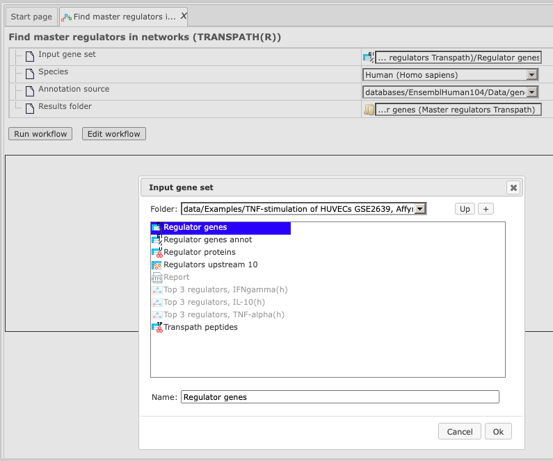
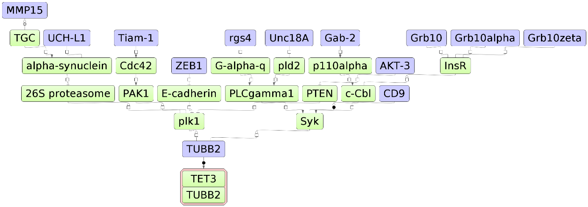

Proteomics

Analyze networks

Find master regulators

Potential master regulators of the processes analyzed in a typical proteomics
experiment can be identified with the aid of pathway databases. The geneXplain
platform support working with the TRANSPATH database (5.1.1.1; license required)
or with the public GeneWays database (5.1.1.2). More details about both these
database can be found in the corresponding Sections 19.7 and 19.5.

Find master regulators with TRANSPATH®

As elsewhere, these workflows can be used to analyze data of a **single protein
table** or to mine **multiple protein sets**. These two options will be
explained in the following, complemented by a more detailed explanation how the
**interpretation of the results** should be done.

Analyze a single gene table

This workflow is designed to find important master regulators in signal
transduction pathways. The search is done based on the network of the TRANSPATH®
database with a maximum radius of 10 steps upstream of an input gene set, a
default cutoff for Score at 0.2, for FDR at 0.05, and for Z-score at 1.0.

To launch the workflow, follow these steps:

**Step 1.** Open the workflow input form from the Start page. It looks as shown
below:

**Step2.** Specify input gene set. The input gene set might be a list of
differentially regulated genes or any gene or protein list of interest. You can
drag it from your project within the tree area and drop it in the pink box of
the field **Input gene set**. Alternatively, you may click on the pink field
“select element” and a new window will be opened, where you can select the input
gene set as shown below.

The further steps of the workflow are demonstrated by means of the genes shown
to be up-regulated in one of the pre-prepared examples. The pertinent example
file can be found in the geneXplain platform online under the path:

<https://platform.genexplain.com/bioumlweb/#de=data/Examples/Brain%20Tumor%20GSE1825%2C%20Affymetrix%20HG-U133A%20microarray/Data/Ewing%20Family%20Tumor%20versus%20Neuroblastoma/Upregulated%20Ensembl%20genes%20filtered%20(logFC%3E1)>

When you have selected the gene set, press [Ok].

**Step 3.** Specify the biological species of the input set in the field
**Species** by selecting the required biological species from the drop-down
menu.

**Step 4.** Define where the folder with the results should be located in the
tree. You can do so by clicking on the pink field “select element” in the field
“Results folder”, and a new window will be opened, where you can select the
location of the results folder and define its name (below default output name is
shown).

After you have given the name, press [Ok].

**Step5.** Press the [Run workflow] button. Wait until the workflow is
completed, which is shown below:

The results folder contains several files.

The primary result table *Regulators upstream 10* (

) is a list of master regulatory molecules that were identified at the distance
up to 10 steps upstream of the input molecules. Each master regulatory molecule
is characterized by a Score, Z-score, FDR, and Ranks Sum. Further details about
these parameters can be found below, under “Interpretation of the results”.

The column “Reached from set” shows the number of the molecules from the input
set that is reached from the respective master regulator, and these molecules
are explicitly listed in the column **Hit names**. The column **Reachable
total** presents the total number of molecules that can be reached from the
master regulator in the network, independent of the input list. Details about
Score, Z-score, FDR and Ranks sum columns are given below, under “Interpretation
of the results”.

Having this table opened in the Work Space you can find additional options
available, specific for this kind of table. Select one or several rows in the
table “Regulators upstream 10” by mouse click, and you can visualize the network
of the selected master regulators (

), save the network as a list of genes in the Tree Area (

), or save the hits of this network, listed in the column **Hit names** as a
list of genes in the Tree Area  
(

).

The table *Regulator proteins* (

) corresponds to the table *Regulators upstream 10* converted into the
UniProtKB/Swiss-Prot IDs.

The table *Regulator genes* (

) corresponds to the table *Regulators upstream 10* converted into the Ensembl
IDs and in the table *Regulator genes annot* (

) the same genes are additionally annotated with gene symbols and gene
descriptions.

The three diagrams *Top 3 regulators* (

) visualize the networks individually for each of three top master regulators.
By default, the top regulators are identified upon sorting the table *Regulators
upstream 10* (

) by the column **Ranks sum** with the lowest rank on top.

The default color code for the molecules is the following:  
blue: molecules from the input list  
red: master regulatory molecules;  
green: connecting molecules considered by the graph-analyzing algorithm to find
the path from input list to the master molecule.

If you are interested in visualizing the network for any other master regulator,
you can do this in the following way. Open the table *Regulators upstream 10*
and select the master regulator by a single mouse click, then click the button

to visualize the selected row and save the new diagram.

Tip for the workflow editing

You can easily create a similar workflow with parameter values adjusted to your
needs. For example, you might be interested to change the number of steps used
for the regulator search. By default, 10 steps are applied.

To make a change, you need first to open the workflow under the “Edit workflow”
mode, and save its copy in your project area. The [Edit workflow] button is
located near the button [Run workflow] (see above, Step 1). Upon clicking on
"Edit workflow", the workflow diagram will be opened in the Work Space, and you
can select the analysis box you would like to modify. On the screenshot below
"Regulator search" analysis was selected, and in the Operations Field, on the
tab "Workflow", all the parameters are visible. Under this mode, you can modify
default parameters and then save the workflow.

In this way you will get a customized workflow, with the parameters specified
according to your needs.

**Note***.* This workflow is available together with a valid TRANSPATH® license.  
Please, feel free to ask for details (info\@genexplain.com).

Analyze multiple gene sets

The input is a folder with several gene/protein tables. The steps of this
workflow for each individual gene/protein table are the same as described in the
section above. The same steps are performed iteratively for each of the
gene/protein tables in the input folder.

The output is a folder which contains subfolders with the results for each
individual gene/protein table.

Interpretation of the results

Score

The score value of each master regulatory molecule reflects how well this
molecule is connected with other molecules in the database, and how many
molecules from the input list are present in the network of this master
molecule. The higher the Score value, the better is this molecule connected in
the database, and the more “Hits” from the input list are present in the network
of this molecule. By default, only the molecules with Score \> 0.2 are shown in
the output.

Because molecules with high Scores are well connected in the database, they are
being suggested quite often by the tool as potential master regulators even with
different input lists, and sometimes such molecules are also expected to be
found *a priori*. It is possible to say that the molecules with the highest
Score values are a kind of “trivial” and expected solutions. At the same time,
and also because of their good connectivity, they are well studied and
published. Therefore the molecules with high Score values might be biologically
interesting as known “hubs” in a network.

Let’s have a look at the table *Regulators Upstream 10*, available in the
geneXplain platform online under the path:

<https://platform.genexplain.com/bioumlweb/#de=data/Examples/Brain%20Tumor%20GSE1825%2C%20Affymetrix%20HG-U133A%20microarray/Data/Ewing%20Family%20Tumor%20versus%20Neuroblastoma/Upregulated%20Ensembl%20genes%20filtered%20(logFC%3E1)%20(Master%20regulators%20Transpath)/Regulators%20upstream%2010>

In the screenshot below, the table has been sorted by Score, and we can see
Ku80, MULE-isoform1, NRG1 as the three top molecules with highest Score values.
These are well-studied molecules, and in many cases there is no surprise for the
researcher to find such molecules as master regulators; it is a kind of expected
result. However, master regulators with high Scores might be of interest if you
are looking for well-studied reliable molecules, and would like to see many of
the input molecules connected by such master regulators (**Hit names**).

Z-score

The Z-score value reflects how specific each master molecule is for the input
list. The higher the Z-score value for a molecule, the more specific this
molecule is for the input list, and the lesser is the probability to find such a
molecule as master regulator in another analysis. Z-score and FDR are calculated
based on 1000 random results, for which 1000 random input sets of the same size
were generated by the algorithm.

Importantly, Score and Z-score reflect different characteristics of the
suggested master regulators in the networks. Molecules with high Score values
are well connected in the database, and therefore not very specific for the
input list, and correspondingly they have quite moderate Z-score values.

Molecules with highest Z-scores are very specific for the input list, probably
because of a few connections that are specific for the input list, but generally
they are not so well connected within the database and therefore have quite low
Score values.

Sorting by Z-score and considering top molecules might be helpful if you are
interested in finding novel master regulators which are specific for your input
list and generally are not well studied yet. By default, only the molecules with
Z-score \> 1.0 are shown in the output.

On the screenshot below the same table as above is sorted here by Z-score, and
we can see different molecules on top. Even by the names of these molecules the
expert can see that they are not coming up so often in the literature, and might
represent interesting novel candidates.

Ranks sum

This column helps to suggest molecules for which both values, Score and Z-score,
are quite good. The column **Ranks sum** reflects a combination of sorting by
Score and by Z-score in the following way.

Upon sorting by Score from biggest values to the lowest, a rank is assigned to
the molecules; the molecule with the highest Score has rank 1, etc.

Upon independent sorting by Z-Score from biggest values to lowest, a rank is
assigned to the molecules; the molecule with the highest Z-score has rank 1,
etc.

Next, for each molecule, the ranks upon sorting by Score and upon sorting by
Z-Score are summed up in the column **Ranks Sum**. The lower the Ranks sum, the
more interesting the candidate molecule is, with good Score and good Z-score
values.

On the screenshot below the table from above is sorted by Ranks sum, and we can
see different molecules on top. Upon such sorting, on top there are molecules
with a good connection in the database, and simultaneously to a quite good
extent specific for the input list. In this example, Score values for the top
molecules are between 0.28 and 0.36 (moderate), Z-score values vary between 2.8
and 3.1 (good Z-score values, but not the best in this table).

By default, the table *Regulators Upstream 10* are sorted by the **Ranks sum**
column, to suggest molecules with a balance between their well-studied status
and high connectivity (reflected by Score), and novelty and specificity for the
input list (reflected by the Z-score).

Suggestion for sorting master regulatory molecules

It might be very helpful to find out which of the suggested master regulators
are expressed in your experiment, and especially which are up-regulated. Such
molecules might be promising candidates for further experimental examinations.  
To do this, you can take the table in the result folder “Regulator genes annot”
and take it as input for the analysis “Annotate table”.

As annotation source, you can select the table of genes expressed in the same
experiment, e.g. the table of all expressed genes that resulted from the
workflow “Detect differentially expressed genes”; in this example the path is:

data/Examples/Brain Tumor GSE1825, Affymetrix HG-U133A microarray/Data/Ewing
Family Tumor versus Neuroblastoma/Experiment normalized (RMA) (Differentially
expressed genes Affy)/Genes, fold change and p-value, non-filtered

As “Annotation column” you can select **LogFoldChange**, and as a result the
suggested master regulators are annotated by their expression.

If you are interested in finding reliable well-studied master regulators, e.g.
to confirm already known ones, and would like a master regulator network to
contain as many molecules from the input list as possible, you might be
interested to sort by Score, and consider master molecules with the highest
Score values.

If you are looking for novel master regulators that are very specific for your
input list, even when they are not well studied yet, you might be interested to
sort by Z-score, and consider master molecules with highest Z-score values.

If you are looking for a good balance between well-connected molecules and novel
ones specific for your input list, you might be interested to stay with the
default sorting by Ranks sum, and consider master molecules with the lowest
Ranks sum values.

Find master regulators with GeneWays

This workflow is designed to find important master regulators in the signal
transduction pathways. Here, a search for master regulators is done based on the
network of the GeneWays database with a maximum radius of 4 steps upstream of an
input gene set, a default cutoff for Score at 0.2, for FDR at 0.05, and for
Z-score at 1.0.  
The input form and the resulting tables are very similar to the workflow
described above, “Find master regulators in networks (TRANSPATH®)”, please refer
to Section 5.1.1.1.

The major difference between these two workflows is the underlying database
applied for the network analysis, either TRANSPATH® or GeneWays.

More details about the GeneWays and TRANSPATH® databases can be found in
Sections 19.5 and 19.7, respectively.

Find common effectors

Find common effectors with TRANSPATH®

This workflow is designed to find important effectors in signal transduction
pathways. With this workflow, the effector search is done based on the network
of the TRANSPATH® database with a maximum radius of 10 steps, FDR cutoff at
0.05, Score cutoff at 0.2 and a Z-score cutoff at 1.0. You have an option to
edit the default parameters using the button [Edit workflow].

To launch the workflow, follow these steps:

**Step 1.** Open the workflow input form via the Start page. It looks as shown
below:

**Step2.** Specify the input gene set. The input gene set might be a list of
differentially regulated genes or any gene or protein list of interest. You can
drag & drop it from your project within the tree area and drop it in the pink
box of the field **Input gene set**. Alternatively, you may click on the pink
field “select element” and a new window will be opened, where you can select the
input gene set as shown below.

The further steps of this workflow are demonstrated with genes shown to be
up-regulated in one of the examples. The example file can be accessed using the
URL:

<https://platform.genexplain.com/bioumlweb/#de=data/Examples/Brain%20Tumor%20GSE1825%2C%20Affymetrix%20HG-U133A%20microarray/Data/Ewing%20Family%20Tumor%20versus%20Neuroblastoma/Downregulated%20Ensembl%20genes%20filtered%20(log%20FC%3C-2)>

After you have selected the gene set, press [Ok].

**Step3.** Specify the biological species of the input set in the field
**Species** by selecting the required species from the drop-down menu.

**Step 4.** Define where the folder with the results should be located in the
tree. You can do so by clicking on the pink field “select element” in the field
**Results folder**, and a new window will be opened where you can select the
location of the results folder and define its name (below default output name is
shown).

After you have specified the name, press [Ok].

**Step 5.** Press the button [Run workflow]. Wait until the workflow is
completed, which is shown below:

The results folder contains several files; in the example given the path is:

data/Examples/Brain Tumor GSE1825, Affymetrix HG-U133A microarray/Data/Ewing
Family Tumor versus Neuroblastoma/Downregulated Ensembl genes filtered (log
FC\<-2) (Common effectors Transpath)

The primary result table *Effectors downstream 10* (

) is the list of effector molecules that were identified at the distance up to
10 steps downstream of the input molecules. Each effector molecule is
characterized by Score, Z-score, FDR, and Ranks Sum. Further details about these
parameters can be found in the Section 5.1.1.1, under “Interpretation of the
results”.

The column **Reached from set** shows the number of molecules from the input
list from which the respective effector molecule can be reached.

The column **Reachable total** gives the total number of molecules from which
the respective effector molecule can be reached, independent of the input list.

Having this table opened in the Work Space you can find additional options
available, specific for this kind of table. Select one or several rows in the
table *Effectors downstream 10* by mouse click, and you can visualize the
network of the selected Effectors (

), save the network as a list of genes in the Tree Area (

), or save hits of this network from the column **Hits** as a list of genes in
the Tree Area (

).

The table *Effector genes annot* (

) corresponds to the table *Effectors downstream 10* converted into Ensembl IDs
and additionally annotated with gene symbols and gene descriptions.

The table *Effector proteins* (

) corresponds to the table *Effectors downstream 10* converted into the UniProt
IDs.

The table *Transpath peptides* (

) corresponds to the table *Effectors downstream 10* converted into TRANSPATH®
molecule IDs, and in the table *Transpath peptides annot* they are further
annotated with gene symbols and gene descriptions.

The three diagrams *Top 3 effectors* (

) visualize networks individually for each of the three top effector molecules.
By default, the top effectors are identified upon sorting the table *Effectors
downstream 10* (

) by the column **Ranks sum** with the lowest rank on top.

The default color code for the molecules is the following:  
blue: molecules from the input list  
red: master regulatory molecules;  
green: connecting molecules considered by the graph-analyzing algorithm to find
the path from input list to the master molecule.

If you are interested in visualizing the network for any other effector
molecule, you may do so in the following way. Open the table *Effectors
downstream 10* and select a row with a single mouse click as shown below. Click
on

menu button to visualize the selected row and save the new diagram into the
tree.

Tip for the workflow editing

You can easily create a similar workflow with parameter values adjusted to your
needs. For example, you might be interested in changing the number of steps used
for the effector search. By default, 10 steps are applied.

To make a change, you need first to open the workflow in the “Edit workflow”
mode, and save its copy in your project area. The [Edit workflow] button is
located near the button [Run workflow] (see above, Step 1). Upon clicking on
[Edit workflow], the workflow diagram will be opened in the work area, and you
can select one of the analyses you would like to modify. For the screenshot
below "Effector Search" analysis was selected, and in the Operations Field, on
the tab "Workflow", all parameters are visible. Under this mode, you can modify
default parameters and then save the workflow.

In this way you will get a customized workflow, with the parameters adapted to
your needs.

**Note***.* This workflow is available together with a valid TRANSPATH® license.  
Please, feel free to ask for details (info\@genexplain.com).

Find common effectors with GeneWays

This workflow is designed to find important effector molecules in signal
transduction pathways. Here, a search for effector molecules is done based on
the network of the GeneWays database with a maximum radius of 4 steps upstream
of an input gene set, default cutoffs for Score at 0.2, for FDR at 0.05, and for
Z-score at 1.0.  
The Input form and the resulting tables are very similar to the workflow
described above, “Find common effectors in networks (TRANSPATH®)”, please refer
to Section 5.1.2.1.

The major difference between these two workflows is the underlying database
applied for the network analysis, either TRANSPATH® or GeneWays.

More details about the GeneWays and TRANSPATH® databases can be found in the
Sections 19.5 and 19.7*,* respectively.

Identify functional protein cluster by shortest path analysis

This analysis finds functional clusters in any input table of genes or proteins.
It can be found under the tab *Analyses*, in the folder Methods/Data
manipulation/ Molecular networks/Cluster by shortest path (

). Here the default input form is shown:

When the expert options are opened, an additional field *Input size* appears,
and the form looks like:

In the following, we will consider the input fields one by one.

**Search Collection**. First, decide which database/search collection you want
to use. The connections between the molecules from the specified database will
be considered by the clustering algorithm to find the clusters in the input
table. You can choose a search collection from the drop-down menu, as shown on
the screenshot below. Four search collections are available: GeneWays, HMR,
Recon2, Reactome, TRANSPATH® (Species specific).

If you are interested in applying TRANSPATH®, you have to choose either the
*Species specific* or the *TF specific* collection. This choice depends on the
input table. If you search for clusters among transcription factors, and your
input table is a table of transcription factors, it is recommended to choose
TRANSPATH® (TF specific). If your input table contains different genes/proteins,
TFs and/or other functional groups, it is recommended to choose TRANSPATH®
(Species specific).

By default the GeneWays database is applied. Here, the TRANSPATH® (Species
specific) collection is chosen.

**Molecules collection**. Input the collection of molecules/genes for which you
wish to find clusters. The input table type depends on the specified search
collection. In case of the Geneways database as search collection, the input
type should be table with Entrez gene IDs (

). In case of TRANSPATH®, the input table should be a table with TRANSPATH®
peptides (

). In case of Reactome, the input table should be a table having Reactome
protein IDs (

). As soon as the search collection is specified, the icon for the required
table type is automatically shown in the field **Molecules collection**, as
shown in the two screenshots above for TRANSPATH® and GeneWays, respectively.

Tip Before input your table, check which kind of IDs this table has. If
necessary, convert your table into any of these formats. You can use the
*Convert table* method as mentioned in Section 16.1.2.

**Search Direction.** Select the direction which the algorithm should consider
to find connections between the input molecules. It can be upstream of your
input molecules, or downstream, or in both directions. By default the analysis
searches in the upstream direction.

**Max radius.** Maximum number of steps which the algorithm should consider in
the specified direction. By default the number is 3.

**Display intermediate molecules.** By default this option is unchecked, and in
the resulting clusters only the molecules from the input set will be shown. If
you prefer the intermediate molecules to be displayed as well, check this box.

**Species.** Specify human, mouse or rat species corresponding to the input
table.

**Output name.** Specify the path to store the results and the name of the
output folder.

Having filled the input form, launch the analysis with the [Run] button.
Analysis progresses as shown below. Wait till the analysis is completed.

Results

As a result of this analysis, a folder with a specified name is formed, in this
example: E2F target genes shortest path Upstream 3, shown below. This folder
contains one table, which represents the list of all identified clusters, and
several diagrams corresponding to the number of the identified clusters.

The table *Clusters* (

) contains a list of all identified clusters, here 9, shown below. Each row
shows details for one cluster. The clusters are sorted by their size with the
largest cluster on top. The symbol

next to each cluster name in the column **Diagram** can be used for
visualization. The column **Hit names** contains the names of the TRANSPATH®
proteins in each cluster.

The visualization of *Cluster 1* is shown below. The box **Display intermediate
molecules** was unchecked, default setting. All the molecules shown are coming
from the input gene/protein set. The numbers on the arrows correspond to the
number of steps between two molecules.

When the box **Display intermediate molecules** is checked, the cluster is
displayed as shown below. Molecules shown in blue color are coming from the
input gene/protein list, and those in green are added by the algorithm when
necessary for the connectivity between the input molecules. These green
molecules are so-called intermediate molecules.

