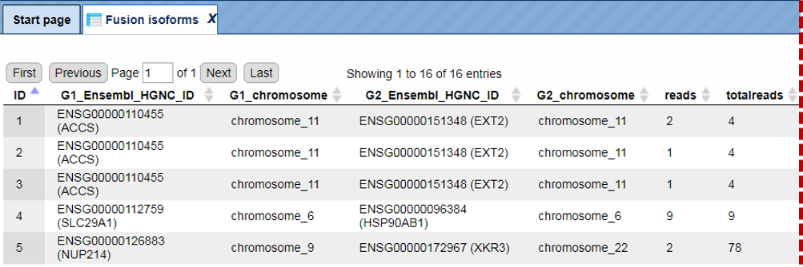
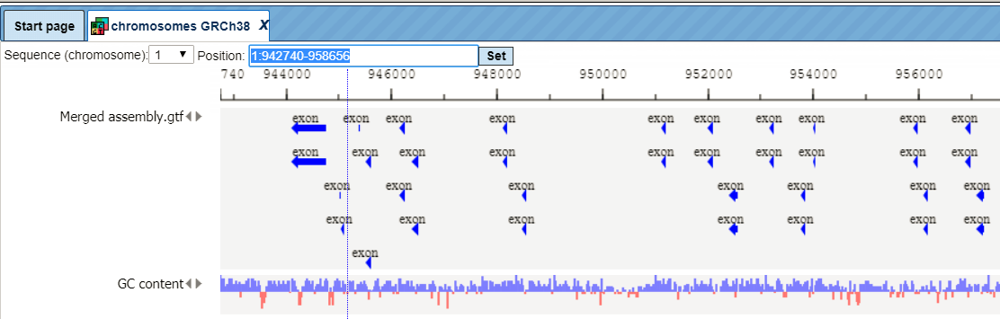
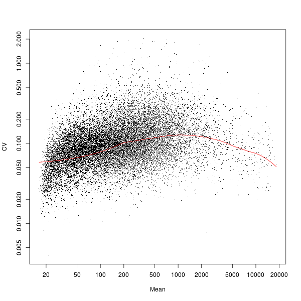

# RNA-seq

When you click on the tiled button “RNA-seq” in the Work Space of the on the
start page, the following listing will appear:

## RNA-seq preprocessing

### SRA to FASTQ

This workflow can be used to convert SRA data files (e. g. from NGS/RNA-seq
experiments) into FASTQ files. The FASTQ format is widely used by a number of
tools and the geneXplain platform is among them; on the other hand, NGS data are
often collected in SRA format, thus the conversion of SRA format into FASTQ
format is an important function. An example of public data stored in SRA format
can be found here (<https://www.ncbi.nlm.nih.gov/sra?term=SRP051443>) and can be
uploaded directly via FTP import into the geneXplain platform. The workflow “SRA
to FASTQ” can be found on the Start page, under the NGS/RNA-seq button.

To launch the workflow, follow these steps:

**Step1.** Open the workflow input form from the Start page. It looks as shown
below:

**Step 2.** Specify the folder with the SRA files in the field **Input folder**.
You can drag it from your project within the tree area and drop it in the box
beside the folder pictogram. Alternatively, you may click on the field *(select
element)* and a new window will be opened, where you can select the input
folder.

##### Example of an input folder:
data/Examples/RNA-Seq analysis of human esophageal squamous cell carcinoma
(ESCC), GSE32424, FASTQ files/Data/SRA files

It contains 12 files in SRA format as shown below. Please note, this folder
occupies **1.5 GB** work space.

The output folder name and folder path is automatically created, but can be
changed in a user-specific way.

Press [Run workflow] and wait till the workflow is completed.

##### Example of an output folder:

data/Examples/RNA-Seq analysis of human esophageal squamous cell carcinoma (ESCC)%2C GSE32424%2C FASTQ files/Data/Fastq%2files

The output folder contains 12 files with the same names and now with the
extension *fastq*. Please note, the size of the output folder is **16.6 GB**.

**Note***.* Working with NGS data in SRA and FASTQ formats requires substantial
work space available in your user account. Feel free to contact us
(<info@genexplain.com>) to upgrade your account with additional disk space.

## Convert genome coordinates with Lift-Over

While working with NGS data, quite often it might quite often be required to
convert positions from one genome assembly to another one, and The Lift-Over
program is widely can be applied for this task. Within the geneXplain platform,
you can find it on the Start page under the NGS button, as highlighted below.

This tool is based on the LiftOver utility and Chain track from the [UC Santa
Cruz Genome Browser](http://genome.ucsc.edu/).

It converts coordinates and annotations between assemblies and genomes. The
input is a track with genomic positions according to a particular genome
assembly, and the output is a track with positions according to another genome
assembly.

To launch the workflow, follow these steps:

**Step1.** Open the input form from Start page. It looks as shown below:

**Step 2.** Specify the input track in the field **Convert coordinates of**. You
can drag it from your project within the tree area and drop it in the box of the
field.

The further steps of the workflow are demonstrated by means of the tables in one
of the pre-prepared examples. You can find these tables in the *Examples*
folder, under

data/Examples/RNA-Seq analysis of human esophageal squamous cell carcinoma (ESCC)%2C GSE32424%2C FASTQ files/Data/Lift_over 

**Step 3.** Specify the **Mapping** of the input track by selecting the desired
genome conversion from the drop-down menu.

In the majority of cases not everything can be re-mapped to another assembly.
The minimum ratio of bases that must be re-mapped is by default 0.95, you can
change this by typing in this field.

**Step 4. Allow multiple output regions: choose** Yes or No.

**Step 5.** Define where the output tracks should be located in the tree. The
method produces two output tracks, one containing all the mapped coordinates and
the other containing the unmapped coordinates (if existing).

After filling out all input fields press [Run] and wait till the method is
completed.

The output is a folder with two tracks as shown below:

### Alignment of FASTQ with Bowtie

**Bowtie** is a short-read aligner designed to be ultrafast and memory-efficient.
It was developed by Ben Langmead and Cole Trapnell (Langmead B, Trapnell C, Pop
M, Salzberg SL. Ultrafast and memory-efficient alignment of short DNA sequences
to the human genome. Genome Biology 10:R25). The Bowtie method can be found in
the Galaxy section of the platform
(analyses/Galaxy/solexa_tools/bowtie_wrapper).

**Input format:** Bowtie accepts files in Sanger FASTQ format. Often, the
sequence files are represented in SRA format (Sequence Read Archives). This
format is used to deposit sequences at the Sequence Read Archives at NCBI, EBI,
and DDBJ. Please consider, converting the SRA files into FASTQ files before
starting Bowtie. You can use the conversion tool *Convert Files in SRA format to
FASTQ* or *Convert Files in SRA format to paired FASTQ* in the Galaxy section of
the platform (analyses/Galaxy/sra_toolkit/fastq-dump).

To launch the Bowtie tool, follow these steps:

**Step1.** Open the Bowtie input form from the Start page by clicking on
*Alignment of FASTQ with Bowtie* option in the *RNA-seq preprocessing*
subsection. It will open in the main Work Space and looks as shown below:

**Step 2.** Specify the reference genome.

The field **Will you select a reference genome from your history or use a
built-in index?** defines the reference genome. If you keep the default *“Use a
built-in index”* the program makes an alignment to the reference genome which is
provided as part of the platform (the genome builds for human, mouse and rat are
provided). Depending on the species used, please specify hg19 for human, mm9 for
mouse and rn4 for rat in the next field **Select a reference genome**.

If you select the *“Use one from the history” option* in the 1st field, two new
fields will appear in the form: **Select the reference genome** and **Choose
whether to use Default options for building indices or to Set your own**, as
shown in the screenshot below, highlighted by the red ovals. In this case you
should provide a preloaded reference genome (preloaded in Fasta, EMBL or
GeneBank formats) and choose the way how to build sequence indices which will be
used by the alignment algorithm of Bowtie.

**Step 3.** The field **Is this library mate-paired?** defines the type of the
sequence library which was used in NGS sequencing. The default is *Single-end*,
the alternative is *Paired-end*. You should know this detail about your library
of short reads.

**Step 4.** Specify the input file in the field **FASTQ file**. You can either
drag-and-drop or select the file name from the Tree area. Here, as an example,
we use data from a published RNA-seq experiment analyzing the human esophageal
squamous cell carcinoma (ESCC), GSE32424. FASTQ files can be found in the
following *Examples* folder:

data/Examples/RNA-Seq analysis of human esophageal squamous cell carcinoma
(ESCC), GSE32424, FASTQ files

This example contains results of an RNA-seq Illumina NGS sequencing of twelve
clinical samples from human esophageal squamous cell carcinoma (ESCC) (seven
tumors and five non-tumors). The authors provided sequences as so-called
*non-aligned* BAM files. We loaded these BAM files directly from GEO as one
archive using the ftp uploading function of the geneXplain platform. After that,
we converted the non-aligned BAM files into FASTQ files using the tool: *SAM to
FASTQ* from the *NGS: Picard (beta)* subsection of the Galaxy section of the
platform (*analyses/Galaxy/picard_beta/picard_SamToFastq*).

**Step 5.** The field **Bowtie settings to use** is set by default to *Commonly
used*. If you change it to the *Full parameter list* from the drop-down menu, a
full list of parameters of the alignment algorithm is enabled for editing. The
full description of all these parameters is given in the original paper of
Langmead et al. mentioned above which describes the algorithm of Bowtie.

**Step 6.** Please keep the box **Suppress the header in the output SAM file**
unchecked (as it is by default) to generate SAM/BAM output files suitable for
further use by Cufflinks tool.

**Step 7.** Set the output file name (for the output BAM file) in the field
**Map with Bowtie for Illumina…** and press the button [Run].

Tip It is recommended to save the output file into a separate folder containing
all BAM output files from one particular experiment. This will allow you to run
the next workflow for the quantification of all SAM/BAM files from this defined
folder.

## Results

The result of this method is one BAM file which is generated by the Bowtie
program as the result of the alignment of the sequence reads from the input
FASTQ file to the reference genome.

At the end of the Bowtie run, the platform requests to specify the genome build
again in order to link the output BAM file to the respective genome files in the
Ensembl database installed in the platform. When you get such a pop-up form,
choose the sequence score from the drop-down menu and specify the genome ID.

This enables a visualization of the BAM file information in the genome browser.
Generated BAM file is a track and has the () icon in the tree. As usual for all tracks, it with a double click opens in the Work Space. You can see the positions of each aligned read in the genome and
upon zooming-in you get all detailed information about each read complete with
sequence, length, and quality.

In the info box you can see information about the output BAM file. The number of
aligned and not aligned reads and overall file size is shown.

**Note***.* The input FASTQ and output BAM files of the Bowtie tool require a
considerable amount of working space. One FASTQ file can occupy several GB of
space. If you need more space for storage and work with your FASTQ and BAM
files, please feel free to ask for details (info\@genexplain.com).

### Quantification of RNA-seq with Cufflinks for multiple BAM files

This workflow is designed to estimate abundances of transcripts in several
RNA-Seq samples using the Cufflinks method (published in *Trapnell C, Williams
BA, Pertea G, Mortazavi AM, Kwan G, van Baren MJ, Salzberg SL, Wold B, Pachter
L. Transcript assembly and abundance estimation from RNA-Seq reveals thousands
of new transcripts and switching among isoforms. Nature Biotechnology
doi:10.1038/nbt.1621*).

The Cufflinks method accepts aligned RNA-Seq reads (in "aligned" BAM files) and
assembles the alignments into a set of transcripts using a reference annotation
of transcripts and genes. Cufflinks then estimates the relative abundances of
these transcripts and genes based on how many reads support each one.

In the first part of the workflow, the Cufflinks program is called from the
Galaxy section of the geneXplain platform
(*analyses/Galaxy/ngs-rna-tools/cufflinks.*

To launch the workflow, follow these steps:

**Step1.** Open the workflow input form from the Start page. It will open in the
main Work Space and looks as shown below:

**Step 2.** Input a folder containing BAM file(s) from the tree. You can either
drag-and-drop or select the folder name from the Tree area. Here, as an example,
we use data from a published RNA-seq experiment on Colon cancer retrieved from
GEO, accession number GSE29155. The following folder from the *Examples* folder
is used:

data/Examples/RNA-Seq analysis of human prostate cancer cell line, GSE29155, BAM
files/Data/

The input folder in this example contains 11 BAM files of RNA-Seq reads obtained
from 7 colon cancer samples and 4 normal samples using the Illumina NGS
sequencer. The reads were aligned by the authors of the data to the human genome
build hg18. We loaded these BAM files directly from GEO as once archive using
the ftp uploading function of geneXplain platform.

**Step 3.** Choose an appropriate sequence source from the drop-down menu:

The drop-down menu presents in each line: Species, Ensembl build number, Genome
build code (e.g. GRCh37_hg19) and the corresponding version of the Gene code
derived gene annotation. Select an option which corresponds to the RNA-seq data
analyzed and stored in the input BAM files.

The Genome build code refers to the genome build which was used for the
alignment of RNA-Seq data when producing the BAM files. You can check the genome
build information by clicking on the individual BAM file in the tree area and
getting the information in the Info box. For example:

This BAM file was produced by alignment of RNA-Seq data to the NCBI36_hg18
genome build (in the "Sequence collection" field you can see the "chromosomes
NCBI36")

The choice of the Gene code version depends on the particular needs of the user.
The higher version of Gene code corresponds to the most up-to-date gene
annotation, whereas the earlier Gene code version may correspond to the gene
annotation used in other types of data in the same study, and may therefore be
chosen for consistency with other data. (e.g. genecode.v10 corresponds to the
most recent annotation done in the ENCODE project)

**Step 4.** Specify the output folder names. The *Result folder* and
*CountsFolder* are created temporarily for storing Cufflinks outputs and
intermediate quantification outputs. **The FPKMfolder** defines the folder for
the final output of the workflow. The abbreviation FPKM stays for **F**ragments
**P**er **K**ilobase of transcript per **M**illion mapped reads, and is a
commonly accepted standard measure for this kind of data.

**Step 5.** Press [Run workflow] and wait till the workflow is completed.

#### Results: 

The results folder consists of several tables of Ensembl type containing the
results of quantification of every BAM file from the input folder:

By double-clicking on each table you can see the result of the quantification.

For each Ensembl gene out of 51,520 Genecode annotated genes the FPKM value was
computed. The FPKM value corresponds to the expression value of this gene. For
RNA-Seq data, the relative expression of a transcript is proportional to the
number of cDNA fragments that originated from it.

**Note***.* This workflow may take several hours to complete. You can start this
workflow and even switch off your computer, e.g. overnight, while the
computation will be running on the server. After several hours you can check the
results. In case of any questions, please feel free to ask for details
(info\@genexplain.com).

### Find gene fusions from RNA-seq

Recently, next-generation sequencing techniques at the transcriptome level
(RNA-Seq) have been used to verify known and discover novel transcribed gene
fusions. This workflow offers the ability to discover gene fusions from RNA-seq
data (single-end (SE) or paired-end (PE) RNA-Seq read data) based on the fast
FusionFinder program published in 2012 (Francis et al., PLoS ONE 7:e39987, 2012)
. It accepts raw RNA-seq reads (fastq format) and produces a table with found
gene fusions. The workflow can be found under the section “RNA-seq
preprocessing”.

To launch the workflow, follow these steps:

**Step 1.** Open the workflow input form from the Start page. It will open in
the main Work Space and looks as shown below:

**Step 2.** Specify the input file in FASTQ format in the field **Input fastq**.  
It contains data from your RNA-seq study. To specify the input fastq file, you
can drag & drop it from your project within the tree area. Alternatively, you
may click on the pink field “select element” and a new window will open, where
you select the input file. After having selected the file, press the [Ok]
button.

**Step 3**. Specify the **Ensembl version** from the drop-down menu. By default,
the most recent, human_65, is selected.

**Step 4.** Define where the folder with the results should be located in your
project tree. You can do so by clicking on the pink field “select element” in
the field **Output folder**, and a new window will be opened, where you can
select the location of the results folder and define its name.

**Step 5.** Press the [Run workflow] button.

Wait until the workflow is completed.

The **Output folder** contains the two tables, *Fusion summary* and *Fusion
isoforms*; for this example, let’s consider the results folder located under
Examples: 
[data/Examples/Detection of novel fusion transcripts from RNA-seq data, 76mer
fastq reads/Data/BI.081030_SL-XBF_0001_FC30CB2AAXX.7.fq (Gene fusions from
RNA-seq)]. 

It is highlighted in blue in the figure below:

The FusionFinder program analyses FASTQ read data (reads must be of at least 50
nucleotides long; see [input example](http://genomebiology.com/2009/10/10/R115/additional)) to identify gene
fusion candidates. This is achieved by performing an integrated analysis, which
is illustrated in the original paper of Francis et al.

The first step is to align the full length reads against a normal coding
reference transcriptome. After creation of pseudo paired-end reads (PE), these
PE reads are aligned against the coding reference transcriptome. A further step
is to analyze the results and filter false-positives. The last step consists of
a block filtering and identification of fused exons and isoforms from candidate
fusion transcripts.

The output table **Fusion summary** is a ranked list of fusion candidates based
on their evidence strength (total number of sequence reads = **total reads**).
The file provides the Ensembl and HUGO (Human Genome Organization) Gene
Nomenclature Committee (HGNC) common name identifiers for G1 and G2
(**G1_Ensembl_HGNC_ID** and **G2_Ensembl_HGNC_ID**).

The file provides also the number of blocks on each gene (**G1_blocks** and
**G2_blocks**), an indication of how many **isoforms** exist for each G1:G2 pair
and the **category** of fusion indicated by the pair.

The output table **Fusion isoforms** gives the full details for each isoform of
G1 and G2 and includes the genomic coordinates of the alignment blocks on G1 and
G2, and their respective corresponding Ensembl exon IDs.

### Find genome variations and indels from RNA-seq

The challenge of obtaining accurate variant calls from RNA-seq data is
substantial. The workflow is based on a framework to discover genotype
variations published by De Pristo et al., [Nature
Genetics](http://www.ncbi.nlm.nih.gov/pmc/articles/PMC3083463/) 43:491-498,
2011. The process applied includes initial read mapping, local realignment
around indels, base quality score recalibration, SNP discovery and genotyping to
find all potential variants.

The workflow can be found in the section “RNA-seq Preprocessing”.

**Step 1.** Open the workflow input form from the Start page. It will open in
the main Work Space and looks as shown below:

**Step 2**. Specify the input file in FASTQ format in the field **Input fastq
file**.  
To specify the fastq file, you can drag & drop it from your project within the
tree area. Alternatively, you may click on the pink field “select element” and a
new window will open, where you select the input track. After having selected
the track, press the [Ok] button.

**Step 3**. Specify the **Minimum read segment length**. By default a minimum
length as 25 is given.

**Step 4.** Define where the folder with the results should be located in your
project tree. You can do so by clicking on the pink field “select element” in
the field **OutputFolder**, and a new window will be opened, where you can
select the location of the results folder and define its name.

Start the workflow by pressing the [Run workflow] button.

In the following example we took as input the fastq file
[SRR349741.fastq](https://platform.genexplain.com/bioumlweb/#de=data/Examples/RNA-Seq%20analysis%20of%20human%20esophageal%20squamous%20cell%20carcinoma%20%28ESCC%29,%20GSE32424,%20FASTQ%20files/Data/Fastq%20files/SRR349741.fastq)
(data/Examples/RNA-Seq analysis of human esophageal squamous cell carcinoma
(ESCC), GSE32424, FASTQ files/Data/Fastq files/SRR349741.fastq).

Below you can see the location of the result folder:

(data/Examples/RNA-Seq analysis of human esophageal squamous cell carcinoma
(ESCC), GSE32424, FASTQ files/Data/SRR349741.fastq (Genome variants and indels
from RNA-seq)) for this fastq file. 

The output folder contains several files and sub-folders with all results of the analysis.

The first step of the workflow is an alignment of all reads of fastq file using
the [TopHat2](https://www.ncbi.nlm.nih.gov/pmc/articles/PMC4053844/) tool. In
the result folder one can see a sub-folder “tmp” which contains all found
Deletions, Insertions, Splice junctions and Alignments. They are stored as
tracks and can be opened in the genome browser by double-click on each of the
tracks. Each short line (arrow in the higher zoom) represents an aligned “read”
from the fastq file.

After zooming into each individual aligned read the insertions and deletions in
the respective tracks of the browser become visible.

The *Tophat summary* file shows the total numbers of input reads, mapped reads,
reads with multiple alignments and the overall read alignment rate.

The initial alignments are sorted and reordered to prepare the next quality
checking steps. The results of these two steps are stored in the folder tmp as
the two files *reorder.bam* and *sorted.bam*.

The next step removes duplicates. The purpose is to mitigate the effects of PCR
amplification bias introduced during library construction. Two read pairs are
considered duplicate if they align to the same genomic position. The resulting
*MarkDuplikates1.log* file is stored in the log folder and the
*MarkDuplikates1.stat* file is stored in the stat folder.

The next step is a local realignment. Read mapping algorithms operate on each
read independently, locally realign reads such that the number of mismatching
bases is minimized across all the reads. Output files are *Realigner.log* and
*TargetCreator.log* in the log folder, *ddup1.bam*, *Realigned.bam* and
*realigner.intervals* in the tmp folder.

The realigned BAM file is used again to remove duplicates (output
*MarkDuplicates2.log* and *MarkDuplicates2.stat*), because realignment may
change genomic positions of read pairs. After this step additional duplicates
can be identified. The next step is a recalibration of base quality values. For
each base in each read various covariates (such as reported quality score,
position in read, dinucleotide, read GC-content) are calculated. Using these
values the algorithm builds the model that predicts sequencing errors. Then it
applies this model to calculate an empirical base quality score and overwrites
the phred quality score currently in the read. Output is a new BAM file
(*Good.bam*).

This file is used for the unified GATK (Genome Analysis Toolkit) [genotyper
method](https://platform.genexplain.com/bioumlweb/#de=analyses/Galaxy/gatk/gatk_unified_genotyper)
to detect the *SNP-indels* (table in VCF format) which the user can visualize by
double click.

After Zooming in information of variation on nucleotide basis is shown.

In the next step each identified variation (SNP_indels) is analysed with the
help of the “variant_effect_predictor” algorithm
(https://platform.genexplain.com/bioumlweb/\#de=analyses/Galaxy/ensembl/variant_effect_predictor).
As a result it creates a final table that gives detailed information about each variation. 

https://platform.genexplain.com/bioumlweb/#de=data/Examples/RNA-Seq%20analysis%20of%20human%20esophageal%20squamous%20cell%20carcinoma%20%28ESCC%29%2C%20GSE32424%2C%20FASTQ%20files/Data/SRR349741.fastq%20%28Genome%20variants%20and%20indels%20from%20RNA-seq%29/variant%20effects

### Quantification of RNA-seq with Cufflinks (no de-novo assembly) for FASTQ files

This workflow offers a possibility to discover new genes and transcripts (splice
variants) and measure transcript expression in a single assay from RNA-seq data.
This workflow is described in “Differential gene and transcript expression
analysis of RNA-seq experiments with TopHat and Cufflinks”, Nat. Protoc.
7:562-578, 2012.

**Step 1.** Open the workflow input form from the Start page. It will open in
the main Work Space and looks as shown below:

**Step 2**. Specify the **Experiment fastq files** and the **Control fastq
files**.  
To specify the input files in Sanger FASTQ format, you can drag & drop it from
your project within the tree area.

**Step 3.** Define where the folder with the results should be located in your
project tree. You can do so by clicking on the pink field “select element” in
the field **Output folder**, and a new window will be opened, where you can
select the location of the results folder and define its name.

Start the workflow by pressing the [Run workflow] button.

All results are saved in the result folder:

data/Examples/RNA-Seq analysis of human esophageal squamous cell carcinoma
(ESCC), GSE32424, FASTQ files/Data/Fastq files (Quantification of RNA-seq (no
de-novo assembly)

### Read alignment with TopHat

The first step of the workflow is alignment of sequence reads with TopHat
(<http://tophat.cbcb.umd.edu/>). TopHat aligns reads to the genome and discovers
transcript splice sites. TopHat uses Bowtie
(http://bowtie-bio.sourceforge.net/index.shtml) as an alignment ‘engine’ and
breaks up reads that Bowtie cannot align on its own into smaller pieces called
segments.

Output files are tables and tracks with insertions, deletions, splice junctions
and the alignments.

Example output can be found here: 
[data/Examples/RNA-Seq%20analysis%20of%20human%20esophageal%20squamous%20cell%20carcinoma%20(ESCC)%2C%20GSE32424%2C%20FASTQ%20files/Data/Fastq%20files%20(Quantification%20of%20RNA-seq%20(with%20de%20novo%20assembly))/SRR349741.fastq%20experiment/Splice%]

opened as track:

Mismatches, insertions and deletions in the alignments can identify
polymorphisms between the sequenced sample and the reference genome, or even
pinpoint gene fusion events in tumor samples. Reads that align outside annotated
genes are often strong evidence of new protein-coding genes and noncoding RNAs.
RNA-seq read alignments can reveal new alternative splicing events and isoforms.
Alignments can also be used to accurately quantify gene and transcript
expression, because the number of reads produced by a transcript is proportional
to its abundance.

### Differential analysis with Cuffdiff

The second step of the workflow is performed by Cuffdiff, part of the [Cufflinks
package](http://cole-trapnell-lab.github.io/cufflinks/), which calculates
expression in two or more samples and tests the statistical significance of each
observed change in expression between them. Cuffdiff allows for supplying
multiple technical or biological replicate sequencing libraries per condition.
With multiple replicates, Cuffdiff learns how read counts vary for each gene
across the replicates and uses these variance estimates to calculate the
significance of observed changes in expression.

Cuffdiff reports 15 output files:

The last step of the workflow comprises several conversions and filtering steps
of some Cuffdiff output files. The final table and tracks are in the result
folder:

The table **Differentially expressed Ensembl genes** contains all identified
differentially expressed genes (Ensembl IDs) (also converted into a table of
transcripts and a table of TRANSPATH® proteins).

The **Regulated promoters** are extracted from the table Differentially
expressed Ensembl transcripts. Transcripts with the same transcription start
site (TSS) are merged into the single ‘TSS group’ and **Differentially expressed
TSS groups** are also identified. **Regulated promoters from TSS groups** are
identified using those TSS groups. Similarly, **Differentially expressed CDS
groups** are identified (CDS group is the group of transcripts with the same
coding sequence; they produce exactly the same protein). And CDS group table is
used to find **Differentially expressed TRANSPATH proteins from CDS groups**.

### Quantification of RNA-seq with Cufflinks (with de-novo assembly) for FASTQ files

This workflow offers the ability to discover new genes and transcripts (splice
variants) and measure transcript expression in a single assay from RNA-seq data.
This workflow is described in “Differential gene and transcript expression
analysis of RNA-seq experiments with TopHat and Cufflinks”, Nat. Protoc.
7:562-578, 2012.

**Step 1.** Open the workflow input form from the Start page. It will open in
the main Work Space and looks as shown below:

**Step 2**. Specify the **Experiment fastq files** and the **Control fastq
files**.  
To specify the input files in Sanger FASTQ format, you can drag & drop it from
your project within the tree area.

Step 3. Specify the **Reference annotation**.

Step 4. Specify the **Reference sequence**.

**Step 5.** Define where the folder with the results should be located in your
project tree. You can do so by clicking on the pink field “select element” in
the field **Output folder**, and a new window will be opened, where you can
select the location of the results folder and define its name.

Start the workflow by pressing the [Run workflow] button.

All results are saved in the result folder:

[data/Examples/RNA-Seq analysis of human esophageal squamous cell carcinoma
(ESCC), GSE32424, FASTQ files/Data/Fastq files (Quantification of RNA-seq (with
de novo
assembly))](http://platform.genexplain.com/bioumlweb/#de=data/Examples/RNA-Seq
analysis of human esophageal squamous cell carcinoma (ESCC)%2C GSE32424%2C FASTQ
files/Data/Fastq files (Quantification of RNA-seq (with de novo assembly))/)

### Read alignment with TopHat

The first step of the workflow is a read alignment with TopHat
(<http://tophat.cbcb.umd.edu/>). TopHat aligns reads to the genome and discovers
transcript splice sites. TopHat uses Bowtie
(http://bowtie-bio.sourceforge.net/index.shtml) as an alignment ‘engine’ and
breaks up reads that Bowtie cannot align on its own into smaller pieces called
segments.

Output files are tables and tracks with insertions, deletions, splice junctions
and the alignments.

Example output of [splice junctions]
data/Examples/RNA-Seq%20analysis%20of%20human%20esophageal%20squamous%20cell%20carcinoma%20(ESCC)%2C%20GSE32424%2C%20FASTQ%20files/Data/Fastq%20files%20(Quantification%20of%20RNA-seq%20(no%20de-novo%20assembly))/SRR349741.fastq%20experiment/Splice%20juopened as track:

Mismatches, insertions and deletions in the alignments can identify
polymorphisms between the sequenced sample and the reference genome, or even
pinpoint gene fusion events in tumor samples. Reads that align outside annotated
genes are often strong evidence of new protein-coding genes and noncoding RNAs.
RNA-seq read alignments can reveal new alternative splicing events and isoforms.
Alignments can also be used to accurately quantify gene and transcript
expression, because the number of reads produced by a transcript is proportional
to its abundance.

### Transcript assembly with Cufflinks

[Cufflinks](http://cole-trapnell-lab.github.io/cufflinks/) uses the alignments
to map reads against the genome and to assemble the reads into transcripts.
Cufflinks assembles individual transcripts from RNA-seq reads that have been
aligned to the genome. Because a sample may contain reads from multiple splice
variants for a given gene, Cufflinks must be able to infer the splicing
structure of each gene. Thus, Cufflinks reports a parsimonious transcriptome
assembly of the data. The algorithm reports as few full-length transcript
fragments or ‘transfrags’ as are needed to ‘explain’ all the splicing event
outcomes in the input data. Output tracks of Cufflinks is the **Assembled
transcripts** track, output tables of Cufflinks are **Gene expression** and
**Transcript expression** tables.

This step distinguishes this workflow from the workflow called “**Quantification
of RNA-seq with Cufflinks (no de-novo assembly) for FASTQ files”.** In the
current workflow the transcripts are assembled “de-novo”, whereas in that other
workflow the transcripts are taken from the reference Ensembl transcript
annotation. Since here it is a “de-novo” reconstruction of exon-intron
structure, no known gene or transcript names are given. All transcripts are
defined by the tracking_id, like Cuff.1.1 and so on. This allows us to find new
transcripts that were not yet discovered and annotated in the reference genome.

### Assembled transcripts merging with Cuffmerge

When you are working with several RNA-seq samples, it becomes necessary to pool
the data and assemble them into a comprehensive set of transcripts before
proceeding to differential analysis. Cuffmerge, part of the Cufflinks package
(<https://cufflinks.cbcb.umd.edu/>) is essentially a ‘meta-assembler’ — it
treats the assembled transfrags the way Cufflinks treats reads, merging them
together parsimoniously. Output is a **Merged assembly** track.

### Differential analysis with Cuffdiff

The next step of the workflow is performed by Cuffdiff, part of the Cufflinks
package (<https://cufflinks.cbcb.umd.edu/>), which calculates expression in two
or more samples and tests the statistical significance of each observed change
in expression between them. Cuffdiff allows supplying multiple technical or
biological replicate sequencing libraries per condition. With multiple
replicates, Cuffdiff learns how read counts vary for each gene across the
replicates and uses these variance estimates to calculate the significance of
observed changes in expression.

Cuffdiff reports the following 11 output files:

## Detect differentially expressed gene (DEG)

In order to perform further analyses of the results of the workflow
**Quantification of RNA-seq with Cufflinks for FASTQ files** it is recommended
to join all resulting gene tables into one table using the function “Join
several tables” of the platform. The joint table can be used for detection of
differentially expressed genes using the Limma or EBarrays functions.

It should be noted here that to perform a Limma or EBarray analysis of the
RNA-Seq data you should select the option *Unnormalized counts* in the input
field **Input log-base** for either of these two methods, as shown below for
Limma.

### Estimate differential expression using Linear Models for MicroArrays (LIMMA)

Limma estimates differential expression between specified conditions / groups.

This tool provides an interface for the popular and comprehensive Limma package.
The platform tool computes differential expression between up to five conditions
/ groups. The groups consist of columns of a data table that contains normalized
measurement values, e.g. from a normalized microarray experiment. Furthermore,
one can estimate differential expression for normalized or un-normalized count
data as derived from RNA-seq experiments.

All possible contrasts between groups are considered and their output is stored
in a common folder. Conditions are compared in the specified order from first to
fifth. E.g. given conditions named A, B and C, the output will contain the
contrasts AvsB, AvsC and BvsC.

It is necessary to provide a unique name for each group. Also, at least two data
columns are required per group.

The input parameters for Limma are described in the following.

**Input table**: This table contains the columns to analyze.

**Input log-base**: Here you can specify the scale of the input data. If the
log-base is log2, the tool will use the data values as is. If your data are from
RNA-seq, you can select *Normalized counts* or *Unnormalized counts*.

**1-5. Condition / group name**: One can specify up to five groups of columns.
Please note that unnamed groups are not considered; a name is not assigned
automatically.

**1-5. Columns**: These fields contain the selected columns. Please note that
column selections are not considered without a corresponding name. Columns can
only be specified once and there need to be two columns per group.

**Output folder**: The output folder will contain one output files for each pair
of conditions.

An example output table is shown at the end of this section. Its columns are
explained in the following. Those highlighted in bold are shown in the default
view. The other columns can be included on demand via the Columns tab of the
lower right panel (available with opened output table).

**logFC**: Fold change (log)

**CI.025**: Fold change (Lower confidence interval)

**CI.975**: Fold change (Upper confidence interval)

**AveExpr**: Average log2-expression for the probe over all arrays

**t**: Moderated T-statistic

**P.Value**: P-value Differential expression

**adj.P.Val**: Adjusted P-value (Benjamini-Hochberg)

**B**: Log-odds that the gene / probe presents differential expression

*Reference:*  
Smyth, G. K. (2005). Limma: linear models for microarray data. In:
Bioinformatics and Computational Biology Solutions using R and Bioconductor. R.
Gentleman, V. Carey, S. Dudoit, R. Irizarry, W. Huber (eds), Springer, New York,
2005.

### Estimate differential expression by the gene expression mixture model of EBarrays

EBarrays estimates differential expression between specified conditions /
groups.

This tool provides for differential expression analysis using the EBarrays
package. The platform tool can compare up to five conditions / groups. The
groups consist of columns of a data table that contains normalized measurement
values, e.g. from a normalized microarry experiment.

EBarrays sets up a mixture model matching the specified groups. Differential
expression is identified when components for a pattern describe the distribution
of measurement values well. Then probe / gene values in the corresponding group
were significantly different from their values in the other groups. This is
reflected by high posterior probabilities in the column named after that group.

The package estimates a critical posterior probability cutoff for the given FDR
level on the basis of the fitted mixture model. Probes / genes exceeding this
cutoff in some condition / group are indicated by a value of 1 (instead of -1)
in the output column named "*condition name* Sig". Hence, to isolate the targets
differentially expressed in a condition of interest, e.g. condition named
"treatment", filter the table for all rows with a value of 1 in the column
"treatment Sig". The direction of differential expression can be derived from
the fold change column "condition name FC", which contains the log2-fold
changes.

The input parameters for EBarrays are described in the following.

**Input table**: This table contains the columns to analyze.

**Input log-base**: Here you can specify the scale of the input data. If the
log-base is *none*, the tool will use the data values as is. If your data are
from RNA-seq, you can select *Normalized counts* or *Unnormalized counts*.

**1-5. Condition / group name**: One can specify up to five groups of columns.
Please note that unnamed groups are not considered; a name is not assigned
automatically. Fields for the first two groups need to be set.

**1-5. Columns**: These fields contain the selected columns. Please note that
column selections are not considered without a corresponding name. Columns can
only be specified once and there need to be two columns per group. Fields for
the first two groups need to be set.

**1-5. Is control**: Use this field to mark the control column group. One such
group is required.

**Output folder**: The output folder will contain one output files for each pair
of conditions.

It is necessary to provide a unique name for each group. Also, at least two data
columns are required per group and one group needs to be marked as control
group.

Besides the main output table containing differential expression estimates for
each probe / gene, EBarrays provides two diagnostic plots named EBarrays CCV and
EBarrays Marginal fit. These plots enable a judgment about whether assumptions
of the approach hold and how well the fitted model represents the data (please
refer to the documentation of the EBarrays Bioconductor package for further
details). Examples of an output table, a CCV plot and a Marginal fit plot are
shown at the end of this section.

*Reference:*  
Kendziorski, C.M., Newton, M.A., Lan, H., Gould, M.N. (2003). On parametric
empirical Bayes methods for comparing multiple groups using replicated gene
expression profiles. Statistics in Medicine 22:3899-3914.

