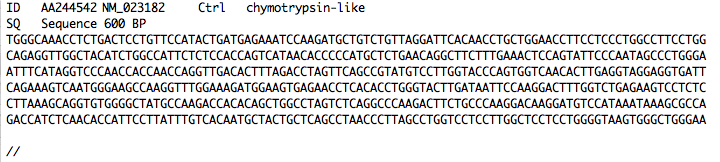
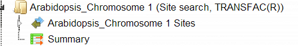

# Sequence analysis

## Analyze any DNA sequence

### Search for TF binding sites

#### Search for TF binding sites with TRANSFAC®

This workflow is designed to search for putative transcription factor binding
sites, TFBS, in any input DNA sequence in EMBL, Fasta or Genbank formats. Using
this workflow you can analyze DNA sequences of any species and of any genomic
regions.

The steps to launch the workflow are as follows.

**Step 1.** Open the workflow input form from the Start page, it will open in
the main work area and looks as it is shown below:

**Step 2.** Specify an input file in the field **Input sequence set.** The input
sequence set can be any sequence file having an EMBL, Genbank, or Fasta file
extension. Sample EMBL, FASTA and Genbank sequences are as shown below:

Sample EMBL file:

Sample Fasta file:

Sample Genbank file:

After loading into the platform, the sequences in these formats are shown in the
tree area with the icon ().

In this example, sample sequences of *Arabidopsis thaliana* are used, which were
downloaded from the TAIR database in FASTA format
(http://www.arabidopsis.org/tools/bulk/sequences/index.jsp). The example input
sequence set contains a set of ten promoter sequences 500 bp upstream of the
TSS, located on chromosome 1.

**Step3.** Select the TRANSFAC® profile from the available profiles. The default
profile is *vertebrate_non_redundant_minSUM*. In this example we use the profile
called *Plants*. It can be found here:

<http://platform.genexplain.com/bioumlweb/#de=databases/TRANSFAC(R)%202018.2/Data/profiles/plants>

**Step 4.** Specify the result folder location and name in your *Project* area.
Then press the button [Run workflow]. Wait till the workflow is completed.

### Results

The results folder consists of a summary table and a track with sites as shown
below:

*Input sequence Sites:* This track () shows TFBSs that are found in the input sequences. As the input sequence set in this example is called *Arabidopsis_Chromosome 1*, the resulting track is
called *Arabidopsis_Chromosome 1 Sites.* When opened as a table, this track
looks like:

Each row corresponds to one resulting TFBS and includes sequence names, site
positions (the columns **From** and **To**), site **Length** and **Strand**,
**score** calculated by the algorithm and a site model (here, TRANSFAC® matrix).
This table can be exported as a track in several different formats including
intervals, bed, wig and more. DNA sequences can be exported in multi-FASTA
format.

The same track, when opened in the genome browser, looks as shown below:

In the field *Sequence (chromosome)* you can find a dropdown menu, highlighted
by the red oval. This feature helps to easily switch between visualizations of
the sequences in the input set. In this particular example the input sequence
set comprises ten individual promoter sequences, and each individual promoter
can be visualized in the genome browser.

*The table Summary* (

) gives the site density per thousand bp for each matrix in the input sequence.
When opened in the work space looks as shown below:

Each row summarizes the information for one site model (PWM, matrix).

For each row, the column **Site density per 1000bp** shows the number of matches
normalized per 1000 bp length for the sequences in the input set.

TFBSs can be further visualized in the input sequences. For this, having the
Summary table opened, select one or several rows, and then click the report on
selected matrices button (

) on the control panel. In this example, all matrices with a site density \<5
were selected. The visualization results are shown below:

There are ten rows corresponding to the individual sequences in the input set.
The column Sites view schematically represents the sequence length with mapped
TFBSs. Matches for different matrices are shown in different colors. You can
select individual matches by mouse click and get additional information in the
Info box.

**Note***.* This workflow is available together with a valid TRANSFAC® license.  
Please, feel free to ask for details (info\@genexplain.com).

#### Search for TF binding sites with GTRD

This workflow is similar to the one described above. The difference is in the
default profile applied for the TFBS search; in this workflow it is the profile
from the GTRD database called *moderate threshold*. It can be found under the
tab *Databases*, in the folder GTRD/Data/profiles/

Correspondingly, the site search results from these two workflows are different.

### Analyze any DNA sequence for site enrichment

#### Analyze any DNA sequence for site enrichment with TRANSFAC®

This workflow is designed to search for enriched transcription factor binding
sites, TFBSs, in any input DNA sequence as compared to a background DNA
sequence. The central part of this workflow is performed by two individual
methods, *Site search on track* (

), and *Site search result optimization* (

). Both individual methods can be found under the tab *Analyses* in the folder
Methods/Site analysis/.

With this workflow you can analyze sequences of any species and any genomic
region.

The few steps to launch the workflow are as follows.

**Step 1.** Open the workflow input form from the Start page, it will be opened
in the main Work Space and looks as it is shown below:

**Step 2.** Specify the input Yes and No sequence sets. The Yes and No sequence
sets can be in EMBL, FASTA or GenBank format. After loading into the platform,
these sequences are shown in the tree area with the icon (

).

To specify the Input sequence sets, you can drag & drop it from your project
within the tree area. Alternatively, you may click on the pink field “select
element” and a new window will open, where you can select the input sequence.

In this example, the sample sequences of *Arabidopsis thaliana* are used, which
were downloaded from TAIR database
<http://www.arabidopsis.org/tools/bulk/sequences/index.jsp>.

Here, the Yes sequence collection contains a set of four promoter sequences 1000
bp upstream of TSS. These genes play an important role in auxin biosynthesis.
The No sequence collection contains a set of four promoter sequences 1000 bp
upstream of TSS. These genes are involved in different functions.

**Step3.** Select the TRANSFAC® profile from the available profiles. The default
profile is *vertebrate_non_redundant_minSUM*. In this example we use the profile
called *Plants*. It can be found here:

<http://platform.genexplain.com/bioumlweb/#de=databases/TRANSFAC(R)%202014.4/Data/profiles/plants>

**Step 4**. Specify the result folder location and name in your *Project* area.
Then press the button [Run workflow]. Wait till the workflow is completed.

#### Results

The results folder consists of several tables and tracks as shown below:

*The table Summary* (

) gives the TFBSs enriched in the Yes set as compared with the No set. It looks
as shown below:

Each row summarizes the information for one site model (PWM, matrix).

For each row, the columns **Yes density per 1000bp** and **No density per
1000bp** show the number of matches normalized per 1000 bp length for the
sequences in the input Yes set and input No set, respectively. The Column
**Yes-No ratio** is the ratio of the first two columns. The higher the Yes-No
ratio, the higher is the enrichment of matches for the respective matrix in the
Yes set. The matrix cutoff values as they are calculated by the program at the
optimization step are shown in the column **Model cutoff**, and the last column
shows the p-value of the corresponding event.

TFBSs can be further visualized in the Yes sequences. For this, having the
Summary table opened, select one or several rows, and then click the report on
selected matrices button (

) on the control panel.

In this example, all matrices having a Yes-No ratio\>3 were selected. The
visualization results are shown below:

There are four rows corresponding to the individual sequences in the input Yes
set. The column Sites view schematically represents the sequence length with
mapped TFBSs. Matches for different matrices are shown in different colors. You
can select individual matches by mouse click and get additional information in
the Info box.

*Yes (No) sites optimized tracks.* These optimized tracks (

) present those TFBSs that are over-represented in the Yes sequences versus the
No sequences. Scores of the putative sites are optimized by the algorithm. As
the Yes set in this example is called *Auxin biosynthesis*, the resulting track
is called *Auxin biosynthesis sites optimized.* When opened as a table, this
track looks like:

Each row corresponds to one resulting TFBS, and includes its position in the Yes
sequences (the columns **From** and **To**), length and strand, as well as a
score calculated by the algorithm and a site model (matrix). This table can be
exported as a track, in several different formats including intervals, bed, wig
and more. DNA sequences can be exported in multi-FASTA format.

The same track, when opened in the genome browser, looks as shown below:

In the field *Sequence (chromosome)* you can find a drop down menu, highlighted
by the red oval. This feature helps to easily switch visualization between the
sequences in the input set. In this particular example the Yes sequence set
comprises four individual promoter sequences, and each individual promoter can
be visualized in the genome browser.

The tables *Transcription factors Ensembl* (

) and *Transcription factors Entrez* (

) aim at showing transcription factors linked to the identified site models
(matrices). These are potential candidate regulators of genes in the input Yes
set. They are supposed to regulate transcription of Yes-genes via the identified
enriched TFBSs.

Currently this feature is available for human, mouse and rat. For all other
species, this table will be empty, as in this example for *Arabidopsis*
sequences.

**Note***.* This workflow is available together with a valid TRANSFAC® license.  
Please, feel free to ask for details (info\@genexplain.com).

#### Analyze any DNA sequence for site enrichment (GTRD)

This workflow is similar to the one described above. The difference is in the
default profile applied for the TFBS search; in this workflow it is the profile
from the GTRD database called *moderate threshold*. It can be found under the
tab *Databases*, in the folder GTRD/Data/profiles/

Correspondingly, the enriched motifs resulting from these two workflows are
different.
