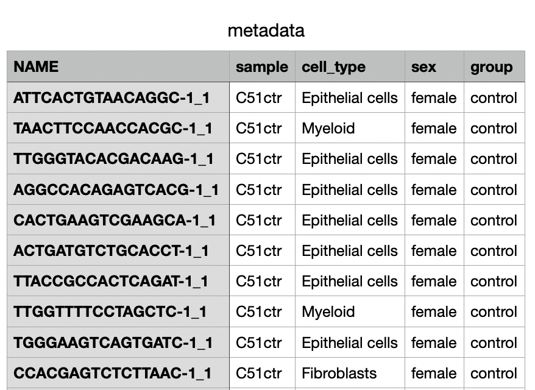
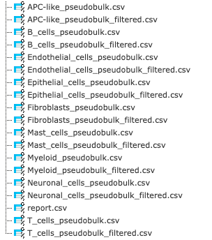

# Single-cell analysis (v0.0.1)

## Overview 🎯

This tool identifies **differentially expressed genes (DEGs)** in single-cell RNA-seq data by comparing experimental conditions. It uses robust **pseudobulk analysis** and **Wilcoxon test**  methods to accurately detect DEGs across different cell types, ensuring reliable biological insights.

---

## Inputs 📥

As input for this method a metadata file and a folder with single-cell count data should be provided. A cell-typing model is mandatory if cell types are not provided in the metadata file. **All files should be uploaded as generic files.** 

* **Metadata File (CSV)**
    Sample metadata should be provided in the format of a CSV file. The **obligatory columns** include:
    * **Sample identifiers**.
    * An experimental group column named `group` or `condition` with the values **'control'** or **'experiment'**.
    * An optional `cell_type` column for annotations. If missing, the tool will perform automatic cell typing.

* **Folder with Single-cell RNA Sequencing Data**
    The tool accepts two formats:
    * **10X Genomics MTX Format**: Requires three files per sample, sharing a common prefix.
        > `barcodes.tsv.gz`
        > `features.tsv.gz`
        > `matrix.mtx.gz`
    * **CSV Format**: A matrix with genes as rows and cells as columns (or vice-versa). The first row/column must contain identifiers.

* **Thresholds for up/down regulated genes**
    A floating pointer number which is used for filtering up and down regulated genes

* **Model for Cell-Typing**
    This is a required input **only if** your metadata file lacks a `cell_type` column. Select a pre-trained **CellTypist** model to automatically annotate cell types.

---

## Workflow ⚙️

The tool follows a sequential workflow from data loading to analysis.

* **Data Loading**: Reads the input single-cell data (MTX or CSV) and metadata file.
* **Data Preparation**: A quality control pipeline filters low-quality genes and cells, calculates QC metrics (mitochondrial/ribosomal percentages), performs doublet detection with **Scrublet**, normalizes counts, and log-transforms the data.
* **Cell Typing (Optional)**: If the `cell_type` column is missing, the tool uses the selected **CellTypist** model to predict cell types.
* **Pseudobulk Aggregation**: Gene counts are aggregated for all cells belonging to the same sample and cell type, creating **pseudobulk profiles**.
* **Differential Expression**: For each cell type, the tool performs DEG analysis.
    * **Primary Method**: Uses **PyDESeq2** on pseudobulk profiles to compare 'experiment' vs 'control'.
    * **Fallback Method**: If `PyDESeq2` fails (e.g., due to low sample counts), it defaults to **Scanpy's `rank_genes_groups`** (Wilcoxon test) on the original single-cell data.
* **Output Generation**: The final DEG results are saved into separate CSV files for each cell type. The tool also generates a filtered csv file and a **report.csv** file which contains found cell types, number of cells corresponding to each type, and the type of analysis which was used.

---

## Outputs 📤

The tool returns a single **folder** containing the analysis results.

Inside the zip file there is one **CSV file per cell type**. The filenames indicate the cell type and the analysis method used (e.g., `T_cells_pseudobulk.csv` or `B_cells_rank_groups.csv`). The tool also generates a filtered csv file and a **report.csv** file which contains found cell types, number of cells corresponding to each type, and the type of analysis which was used.

Each CSV file includes:
* Gene names
* Log2 fold changes
* P-values
* Adjusted p-values
