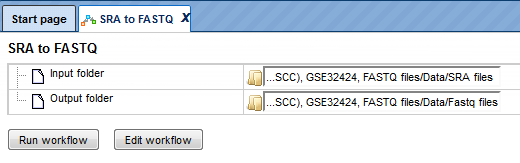

# Workflows

## Common

``` important:: Its a note! in markdown!
```

### Analyze any DNA sequence, EMBL
### Analyze any DNA sequence, Fasta
### Analyze any DNA sequence, GeneBank
### Analyze multiple BAM files to detect DEGs

This workflow is designed to analyze a biological experiment with two conditions (for example patients with a disease and healty patients). The workflow will use BAM tracks to assigning the sequence reads to genomic features, in this case genes. Finally using statistics to determine differentially expressed genes between the two input conditions.

✨ [Open][workflow] the workflow in the user interface.✨

[workflow]: https://platform.genexplain.com/bioumlweb/#de=analyses/Workflows/Common/Analyze%20multiple%20BAM%20files%20to%20detect%20DEGs

The following list gives an overview of all input parameters used in this workflow:

==================== =========================
Parameter Description
==================== =========================
Experiment BAM files Two or several BAM files
Control BAM files Two or several BAM files
ReferenceEnsembl Select your reference genome
Results folder Name and location of outputs
==================== =========================

```eval_rst
.. autoclass:: recommonmark.transform.AutoStructify
    :show-inheritance:
    
+------------------------+------------+----------+----------+
| Header row, column 1   | Header 2   | Header 3 | Header 4 |
| (header rows optional) |            |          |          |
+========================+============+==========+==========+
| body row 1, column 1   | column 2   | column 3 | column 4 |
+------------------------+------------+----------+----------+
| body row 2             | ...        | ...      |          |
+------------------------+------------+----------+----------+
```

```eval_rst
.. autoclass:: recommonmark.transform.AutoStructify
    :show-inheritance:

| Parameter | Description |
|------|------|
| Input track | ChIP-Seq track |
| Species | Specifiy the species of your data |
| AnnotationSource | Ensembl annotation source file |
| Results folder | Name and location of outputs |

```


Two or several BAM files can be submitted in the input field **Experiment BAM files** as one condition in your experiment like _disease_. An example BAM file can be found here: 

data/Examples/User Guide/Data/Input for examples/workflows/B\_1\_Experiment.fastq_alignments

Two or several single-end FASTQ files can be submitted in the input field **Control BAM files** as a second condition in your experiment like _healty_. An example FASTQ file can be found here:

data/Examples/User Guide/Data/Input for examples/workflows/A\_1\_Control.fastq_alignments

You can drag and drop the input BAM files from your data project within the tree area or you may click into the input field [0] and a new window will be opened, where you can select your input BAM files. You may also select several FASTQ files at once with using the _Control button_ of your computer.

As reference genome the most recent Ensembl human genome (Ensembl GRCh38; hg38) is used and set as default for the workflow run. You can select the reference genome of your paired library from the drop-down list **ReferenceEnsembl** to your needs.

The outputs of counting genes are saved in two tables: one file contains the counts ([result example][read counts]) and the other a count summary of the counting procedure ([result example][count summary]).

[read counts]: https://platform.genexplain.com/bioumlweb/#de=data/Examples/User%Guide/Data/Examples%of%workflows/Common/BAM%20files%20to%20DEGs/B_1_Experiment.fastq_alignments%20experiment/B_1_Experiment.fastq_alignments_counts

[count summary]: https://platform.genexplain.com/bioumlweb/#de=data/Examples/User%Guide/Data/Examples%of%workflows/Common/BAM%20files%20to%20DEGs/B_1_Experiment.fastq_alignments%20experiment/B_1_Experiment.fastq_alignments_count_summary

The last step of the workflow performs a differential expression analysis on raw counts with limma-voom:

- voom: 
Prepares RNA-Seq data for linear modelling by transforming count data to log2-counts per million (logCPM), estimating the mean-variance relationship and computing appropriate observation-level weights.

- lmFit:
Fits a linear model using weighted least squares for each gene.

- eBayes:
Assesses differential expression using moderated t statistic.

A normalization of the data is done by limma-voom method, which applies calcNormFactors from edgeR package and calculates normalization factors to scale the raw library sizes. TMM normalization method is is used - the weighted trimmed mean of M-values (to the reference) proposed by Robinson and Oshlack (2010), where the weights are from the delta method on Binomial data.

A result folder of the limma-voom analysis is generated and contains several tables. All raw counts from all conditions are fully joined in a common table ([result example][joined counts]), further filtering to exclude low expressed genes (less than 10 counts) generates another table ([result example][filtered counts]). 

[joined counts]: https://platform.genexplain.com/bioumlweb/#de=data/Examples/User%Guide/Data/Examples%of%workflows/Common/BAM%20files%20to%20DEGs/limma_results/joined_counts

[filtered counts]: https://platform.genexplain.com/bioumlweb/#de=data/Examples/User%Guide/Data/Examples%of%workflows/Common/BAM%20files%20to%20DEGs/limma_results/filtered_counts

After normalization the prepared table ([result example][norm counts]) is used to determine DEGs as a final table ([result example][DEGs]) with two filtered tables of up-regulated ([result example][DEGs up]) and down-regulated genes ([result example][DEGs down]) as well as non-regulated genes ([result example][DEGs non]). A plot is generated, which compares unnormalized and normalzed data ([result example][norm plot]).

Following filter conditions are used:

```sh
Up-regulated genes: logFC > 0.5 && P-value < 0.05
Down-regulated genes: logFC < -0.5 && P-value < 0.05
Non-regulated genes: select middle percentage of DEGs (min 100 & max 1000)
```

[norm counts]: https://platform.genexplain.com/bioumlweb/#de=data/Examples/User%Guide/Data/Examples%of%workflows/Common/BAM%20files%20to%20DEGs/limma_results/normalised_counts

[DEGs]: https://platform.genexplain.com/bioumlweb/#de=data/Examples/User%Guide/Data/Examples%of%workflows/Common/BAM%20files%20to%20DEGs/limma_results/DEGs

[DEGs up]: https://platform.genexplain.com/bioumlweb/#de=data/Examples/User%Guide/Data/Examples%of%workflows/Common/BAM%20files%20to%20DEGs/limma_results/DEGs_filtered_upregulated

[DEGs down]: https://platform.genexplain.com/bioumlweb/#de=data/Examples/User%Guide/Data/Examples%of%workflows/Common/BAM%20files%20to%20DEGs/limma_results/DEGs_filtered_downregulated

[DEGs non]: https://platform.genexplain.com/bioumlweb/#de=data/Examples/User%Guide/Data/Examples%of%workflows/Common/BAM%20files%20to%20DEGs/limma_results/DEGs_non_regulated

[norm plot]: https://platform.genexplain.com/bioumlweb/#de=data/Examples/User%Guide/Data/Examples%of%workflows/Common/BAM%20files%20to%20DEGs/limma_results/plots.pdf

All output results can be exported to your local computer.

### ChIP-Seq - Identify and classify target genes

This workflow is designed to identify target genes of ChIP-seq peaks and perform functional classification of these targets with mapping to different ontologies: Gene Ontology biological processes, Gene Ontology cellular components, Gene Ontology molecular function, Transcription factor classification ([TFclass][TF class link]), Reactome pathways, and HumanCyc pathways. In parallel, the target gene list is subjected to a cluster analysis and clusters are visualized based on the GeneWays protein interaction network database.

[TF class link]: https://genexplain.com/tf_class/

✨ [Open][ChIP-Seq workflow] the workflow in the user interface.✨

[ChIP-Seq workflow]: https://platform.genexplain.com/bioumlweb/#de=analyses/Workflows/Common/ChIP-Seq%20-%20Identify%20and%20classify%20target%20genes

The following list gives an overview of all input parameters used in this workflow:

.. tabularcolumns:: column spec

|Parameter|Description|
|Input track|ChIP-Seq track|
|Species|Specifiy the species of your data|
|AnnotationSource|Ensembl annotation source file|
|Results folder|Name and location of outputs|

Normalized data with Affymetrix probeset IDs can be submitted in the input fields **Input track** ([input example][ChIP-seq track]).

[ChIP-seq track]: https://platform.genexplain.com/bioumlweb/#de=data/Examples/User%20Guide/Data/Input%20for%20examples/GSM558469_E2F1_hg19

You can drag and drop the ChIP-seq track from your data project within the tree area or you may click into the input field (select element) and a new window will be opened, where you can select your ChIP-seq track.

You need  to select the biological species of your data in the field **Species** by choosing the required one from the drop-down menu.

For gene annotation the most recent Ensembl database is used and set as default for the workflow run. You can adapt the database version in the field **AnnotationSource** to your needs.

In the first part of the workflow the ChIP-seq track is mapped and converted to the target gene fragments with a 5' region and 3' region size of 1000bp. The resulting Ensembl gene list is annotated with additional gene information (gene descriptions, gene symbols, and species) via the Annotate table method. Another Entrez gene table is generated with the Convert table method, which is further needed for the cluster analysis as input.

The method Cluster by shortest path created networks based on the protein reactions annotated in the GeneWays database. The algorithm included as many target genes as possible from the previously created Entrez gene list. The proteins that result from the respective genes, were allowed to be a maximum of two reactions apart. The resulting networks out of the clusters are visualized and given in the output.

In the second part of the workflow the list of Ensembl target genes is mapped to the following functional classifications:

- Gene Ontology (biological process)
- Gene Ontology (cellular component)
- Gene Ontology (molecular function)
- HumanCyc pathways
- Reactome pathways
- Transcription factor classification ([TFclass][TF class link])

At least two target genes must be mapped into one group (e.g. one GO term, one pathway) and a P-value threshold lower 0.05 is given for each group.

A result folder ([result example][ChIP-seq result]) is generated and contains the two resulting target gene lists (Ensembl ID format ([result example][Ensembl result]) and Entrez ID format ([result example][Entrez result])), all resulting tables of the functional classification mapping ([result example][Mapping result]), and a subfolder with the clustering output[result example][Cluster result]. All output results can be exported to your local computer.

[ChIP-seq result]: https://platform.genexplain.com/bioumlweb/#de=data/Examples/User%20Guide/Data/Examples%20of%20workflows/Common/GSM558469_E2F1_hg19%20(From%20tracks%20to%20target%20genes)/

[Ensembl result]: https://platform.genexplain.com/bioumlweb/#de=data/Examples/User%20Guide/Data/Examples%20of%20workflows/Common/GSM558469_E2F1_hg19%20(From%20tracks%20to%20target%20genes)/Genes%20Ensembl

[Entrez result]: https://platform.genexplain.com/bioumlweb/#de=data/Examples/User%20Guide/Data/Examples%20of%20workflows/Common/GSM558469_E2F1_hg19%20(From%20tracks%20to%20target%20genes)/Genes%20Entrez

[Cluster result]:

### Compute differentially expressed genes (Affymetrix probes)

This workflow is designed to identify differentially expressed genes from an experiment data set compared to a control data set. 

✨  [Open ][Affy workflow] the workflow in the user interface.✨  

[Affy workflow]: https://platform.genexplain.com/bioumlweb/#de=analyses/Workflows/Common/Compute%20differentially%20expressed%20genes%20(Affymetrix%20probes)

The following list gives an overview of all input parameters used in this workflow:

|Parameter|Description|
|------|------|
|Experiment normalized|Table with normalized Affymetrix data|
|Control normalized|Table with normalized Affymetrix data|
|Probe type|Specifiy the Affymetrix Chip type|
|Species|Specifiy the species of your data|
|AnnotationSource|Ensembl annotation source file|
|Results folder|Name and location of outputs|

Normalized data with Affymetrix probeset IDs can be submitted in the input fields **Experiment normalized** ([input example][Affy normalized]) and **Control normalized** ([input example][Affy con normalized]). Such normalized files are the output of the method [Normalize Affymetrix experiment and control][link nomalize Affy].

[link nomalize Affy]: link internal !!
[Affy normalized]: https://platform.genexplain.com/bioumlweb/#de=data/Examples/User%20Guide/Data/Examples%20of%20methods/Data%20normalization/Experiment%20normalized%20(RMA)
[Affy con normalized]: https://platform.genexplain.com/bioumlweb/#de=data/Examples/User%20Guide/Data/Examples%20of%20methods/Data%20normalization/Control%20normalized%20(RMA)

You can drag and drop nomalized data from your data project within the tree area or you may click into the input field (select element) and a new window will be opened, where you can select your normalized data.

Please select the Affymetrix Chip you have used in your experiment or your data corresponds to in the field **Probe type** by selecting the correct one from the drop-down menu. Support for the following probe types from Affymetrix Chips are given:

- Affymetrix
- Affymetrix ST
- Affymetrix HG-U133+ PM
- Affymetrix HuGene-2_1-st
- Affymetrix HuGene-2_0-st
- Affymetrix RaGene-2_0-st
- Affymetrix miRNA-1_0
- Affymetrix miRNA-2_0
- Affymetrix miRNA-3_0
- Affymetrix miRNA-4_0

You need  to select the biological species of your data in the field **Species** by choosing the required one from the drop-down menu.

For gene annotation the most recent Ensembl database is used and set as default for the workflow run. You can adapt the database version in the field **AnnotationSource** to your needs.

In the first step the up- and down-regulated probes are identified and log fold change values are calculated for all probe IDs. This method applies Student’s T-test and calculates p-values, thus the number of data points should be at least three for each experiment data set and control data set. A histogram with the log fold change distribution from the whole experiment is drawn and given in an output image file.

In addition the results are filtered by different conditions in parallel applying the Filter table method, to identify up-regulated, down-regulated, and non-changed Affymetrix probeset IDs. The filtering criteria are set as follows:

```sh
For up-regulated probes: LogFoldChange > 0.5 and -log(P-value) > 3
For down- regulated probes: LogFoldChange < -0.5 and -log(P-value) < -3
For non-changed genes : LogFoldChange < 0.002 and LogFoldChange > -0.002
```

The resulting tables of up-regulated, down-regulated, and non-changed Affymetrix probeset IDs are converted into Ensembl gene tablse with the Convert table method and annotated with additional gene information (gene descriptions, gene symbols, and species) via the Annotate table method.

A result folder ([result example][Affy result]) is generated and contains all tables, the histogramm and a summary HTML report ([report example][Affy report]). All output results can be exported to your local computer.

[Affy result]: https://platform.genexplain.com/bioumlweb/#de=data/Examples/User%20Guide/Data/Examples%20of%20workflows/Common/Experiment%20normalized%20(RMA)%20(Differentially%20expressed%20genes%20Affy)/

[Affy report]: https://platform.genexplain.com/bioumlweb/#de=data/Examples/User%20Guide/Data/Examples%20of%20workflows/Common/Experiment%20normalized%20(RMA)%20(Differentially%20expressed%20genes%20Affy)/Report

### Compute differentially expressed genes (Agilent Tox probes)

This workflow is designed to identify differentially expressed genes from an experiment data set compared to a control data set.

[Open][Agil tox workflow] the workflow in the user interface.

[Agil tox workflow]: https://platform.genexplain.com/bioumlweb/#de=analyses/Workflows/Common/Compute%20differentially%20expressed%20genes%20(Affymetrix%20probes)

The following list gives an overview of all input parameters used in this workflow:

| Parameter | Description |
| ------ | ------ |
| Experiment normalized | Table with normalized Agilent tox data |
| Control normalized | Table with normalized Agilent tox data |
| Species | Specifiy the species of your data |
| AnnotationSource | Ensembl annotation source file |
| Results folder | Name and location of outputs |

Normalized data with Affymetrix probeset IDs can be submitted in the input fields **Experiment normalized** ([input example][Agil tox normalized]) and **Control normalized** ([input example][Agil tox con normalized]). Such normalized files are the output of the method [Normalize Affymetrix experiment and control][link nomalize Affy].
[link nomalize Affy]: internal link to method!!!

[Agil tox normalized]: 
[Agil tox con normalized]: 

You can drag and drop nomalized data from your data project within the tree area or you may click into the input field (select element) and a new window will be opened, where you can select your normalized data.

You need  to select the biological species of your data in the field **Species** by choosing the required one from the drop-down menu.

For gene annotation the most recent Ensembl database is used and set as default for the workflow run. You can adapt the database version in the field **AnnotationSource** to your needs.

In the first step the up- and down-regulated probes are identified and log fold change values are calculated for all probe IDs. This method applies Student’s T-test and calculates p-values, thus the number of data points should be at least three for each experiment data set and control data set. A histogram with the log fold change distribution from the whole experiment is drawn and given in an output image file.

In addition the results are filtered by different conditions in parallel applying the Filter table method, to identify up-regulated, down-regulated, and non-changed Agilent tox probeset IDs. The filtering criteria are set as follows:

```sh
For up-regulated probes: LogFoldChange > 0.5 and -log(P-value) > 3
For down- regulated probes: LogFoldChange < -0.5 and -log(P-value) < -3
For non-changed genes : LogFoldChange < 0.002 and LogFoldChange > -0.002
```

The resulting tables of up-regulated, down-regulated, and non-changed Agilent tox probeset IDs are converted into Ensembl gene tablse with the Convert table method and annotated with additional gene information (gene descriptions, gene symbols, and species) via the Annotate table method.

A result folder ([result example][Agil tox result]) is generated and contains all tables, the histogramm and a summary HTML report ([report example][Agil tox report]). All output results can be exported to your local computer.

[Agil result]: 

[Agil report]: 

### Compute differentially expressed genes (Agilent probes)

This workflow is designed to identify differentially expressed genes from an experiment data set compared to a control data set. 

[Open][Agil workflow] the workflow in the user interface.

[Agil workflow]: https://platform.genexplain.com/bioumlweb/#de=analyses/Workflows/Common/Compute%20differentially%20expressed%20genes%20(Agilent%20probes)

The following list gives an overview of all input parameters used in this workflow:

| Parameter | Description |
| ------ | ------ |
| Experiment normalized | Table with normalized Agilent data |
| Control normalized | Table with normalized Agilent data |
| Species | Specifiy the species of your data |
| AnnotationSource | Ensembl annotation source file |
| Results folder | Name and location of outputs |

Normalized data with Agilent probeset IDs can be submitted in the input fields **Experiment normalized** ([input example][Agil normalized]) and **Control normalized** ([input example][Agil con normalized]). Such normalized files are the output of the method [Normalize Affymetrix experiment and control][link nomalize Affy].

[link nomalize Affy]: https://platform.genexplain.com/bioumlweb/#de=analyses/Methods/Data%20normalization/Normalize%20Affymetrix%20experiment%20and%20control
[Agil normalized]: https://platform.genexplain.com/bioumlweb/#de=data/Examples/User%20Guide/Data/Examples%20of%20methods/Data%20normalization/Experiment%20normalized_Agilent
[Agil con normalized]: https://platform.genexplain.com/bioumlweb/#de=data/Examples/User%20Guide/Data/Examples%20of%20methods/Data%20normalization/Control%20normalized_Agilent

You can drag and drop nomalized data from your data project within the tree area or you may click into the input field (select element) and a new window will be opened, where you can select your normalized data.

You need  to select the biological species of your data in the field **Species** by choosing the required one from the drop-down menu.

For gene annotation the most recent Ensembl database is used and set as default for the workflow run. You can adapt the database version in the field **AnnotationSource** to your needs.

In the first step the up- and down-regulated probes are identified and log fold change values are calculated for all probe IDs. This method applies Student’s T-test and calculates p-values, thus the number of data points should be at least three for each experiment data set and control data set. A histogram with the log fold change distribution from the whole experiment is drawn and given in an output image file.

In addition the results are filtered by different conditions in parallel applying the Filter table method, to identify up-regulated, down-regulated, and non-changed Affymetrix probeset IDs. The filtering criteria are set as follows:

```sh
For up-regulated probes: LogFoldChange > 0.5 and -log(P-value) > 3
For down- regulated probes: LogFoldChange < -0.5 and -log(P-value) < -3
For non-changed genes : LogFoldChange < 0.002 and LogFoldChange > -0.002
```

The resulting tables of up-regulated, down-regulated, and non-changed Agilent probeset IDs are converted into Ensembl gene tablse with the Convert table method and annotated with additional gene information (gene descriptions, gene symbols, and species) via the Annotate table method.

A result folder ([result example][Agil result]) is generated and contains all tables, the histogramm and a summary HTML report ([report example][Agil report]). All output results can be exported to your local computer.

[Agil result]: https://platform.genexplain.com/bioumlweb/#de=data/Examples/User%20Guide/Data/Examples%20of%20workflows/Common/Experiment%20normalized_Agilent%20(Differentially%20expressed%20genes%20Agil)/

[Agil report]: https://platform.genexplain.com/bioumlweb/#de=data/Examples/User%20Guide/Data/Examples%20of%20workflows/Common/Experiment%20normalized_Agilent%20(Differentially%20expressed%20genes%20Agil)/Report

### Compute differentially expressed genes (Illumina probes)

This workflow is designed to identify differentially expressed genes from an experiment data set compared to a control data set.

✨[Open][Illumina workflow] the workflow in the user interface.✨

[Illumina workflow]: https://platform.genexplain.com/bioumlweb/#de=analyses/Workflows/Common/Compute%20differentially%20expressed%20genes%20(Agilent%20probes)

The following list gives an overview of all input parameters used in this workflow:

| Parameter | Description |
| ------ | ------ |
| Experiment normalized | Table with normalized Illumina data |
| Control normalized | Table with normalized Illumina data |
| Species | Specifiy the species of your data |
| AnnotationSource | Ensembl annotation source file |
| Results folder | Name and location of outputs |

Normalized data with Illumina probeset IDs can be submitted in the input fields **Experiment normalized** ([input example][Illumina normalized]) and **Control normalized** ([input example][Illumina con normalized]). Such normalized files are the output of the method [Normalize Affymetrix experiment and control][link nomalize Illumina].

[link nomalize Illumina]: link to method internal !!!
[Illumina normalized]: 
[Illumina con normalized]: 

You can drag and drop nomalized data from your data project within the tree area or you may click into the input field (select element) and a new window will be opened, where you can select your normalized data.

You need  to select the biological species of your data in the field **Species** by choosing the required one from the drop-down menu.

For gene annotation the most recent Ensembl database is used and set as default for the workflow run. You can adapt the database version in the field **AnnotationSource** to your needs.

In the first step the up- and down-regulated probes are identified and log fold change values are calculated for all probe IDs. This method applies Student’s T-test and calculates p-values, thus the number of data points should be at least three for each experiment data set and control data set. A histogram with the log fold change distribution from the whole experiment is drawn and given in an output image file.

In addition the results are filtered by different conditions in parallel applying the Filter table method, to identify up-regulated, down-regulated, and non-changed Illumina probeset IDs. The filtering criteria are set as follows:

```sh
For up-regulated probes: LogFoldChange > 0.5 and -log(P-value) > 3
For down- regulated probes: LogFoldChange < -0.5 and -log(P-value) < -3
For non-changed genes : LogFoldChange < 0.002 and LogFoldChange > -0.002
```

The resulting tables of up-regulated, down-regulated, and non-changed Illumina probeset IDs are converted into Ensembl gene tablse with the Convert table method and annotated with additional gene information (gene descriptions, gene symbols, and species) via the Annotate table method.

A result folder ([result example][Illumina result]) is generated and contains all tables, the histogramm and a summary HTML report ([report example][Illumina report]). All output results can be exported to your local computer.

[Illumina result]: 

[Illumina report]: 

### Compute differentially expressed genes using EBarrays

This workflow is designed to estimate differentially expressed genes with EBarrays between specified conditions / groups.

[Open][Ebay workflow] the workflow in the user interface.

[Ebay workflow]: https://platform.genexplain.com/bioumlweb/#de=analyses/Workflows/Common/Compute%20differentially%20expressed%20genes%20using%20EBarrays

The following list gives an overview of all input parameters used in this workflow:

| Parameter | Description |
| ------ | ------ |
| Input table | Table with normalized data |
| Probe type | Specifiy the microarray chip type |
| Species | Specifiy the species of your data |
| AnnotationSource | Ensembl annotation source file |
| Control_group | Enter control group name without spaces |
| Columns_control | Select columns of control samples |
| Condition\_1_group | Enter Condition 1 group name without spaces |
| Columns\_condition_1 | Select columns of condition 1 samples |
| Condition\_2_group | Enter Condition 2 group name without spaces |
| Columns\_condition_2 | Select columns of condition 2 samples |
| Condition\_3_group | Enter Condition 3 group name without spaces |
| Columns\_condition_3 | Select columns of condition 3 samples |
| Condition\_4_group | Enter Condition 4 group name without spaces |
| Columns\_condition_4 | Select columns of condition 4 samples |
| Results folder | name and location of outputs |

Normalized data from microarray experiment can be submitted in the input field **Input table** ([input example][Ebay normalized]). Such a normalized file is the output of the method [Affymetrix normalization][link normalize Affy2].

[link normalize Affy2]: link to method internal !!!
[Ebay normalized]: https://platform.genexplain.com/bioumlweb/#de=data/Examples/User%20Guide/Data/Input%20for%20examples/Normalized%20(RMA)_5_conditions_mouse

You can drag and drop nomalized data from your data project within the tree area or you may click into the input field (select element) and a new window will be opened, where you can select your normalized data.

You need  to select the biological species of your data in the field **Species** by choosing the required one from the drop-down menu.

For gene annotation the most recent Ensembl database is used and set as default for the workflow run. You can adapt the database version in the field **AnnotationSource** to your needs.

The workflow compares up to five conditions / groups. It is necessary to provide a unique name for each group. Also, at least two data columns are required per group and the first group is marked as control group.

Besides the main output tables containing differential expression estimates for each gene, EBarrays provides two diagnostic plots named EBarrays CCV and EBarrays Marginal fit. These plots enable a judgment about whether assumptions of the approach hold and how well the fitted model represents the data.EBarrays estimates a critical posterior probability cut-off for the given FDR level on the basis of the fitted mixture model. Probes / genes exceeding this cut-off in some condition / group are indicated by a value of 1 (instead of -1) in the output column named "condition name Sig". The resulting tables with up- and down-regulated genes are filtered with the following conditions:

```sh
For up-regulated genes: log2-fold changes > 0.5 and cut-off FDR level < 0.05
For down-regulated genes: log2-fold changes < -0.5 and cut-off FDR level < 0.05
```

A result folder ([result example][Ebay wf result]) is generated and contains one folder with unfiltered EBarrays results ([result example][Ebay wf result2]), one folder with the diagnostic plots ([result example][Ebay wf result3]) and all filtered gene tables with significant differentially expressed genes for all condition groups compared to the control group. All output results can be exported to your local computer.

[Ebay wf result]: https://platform.genexplain.com/bioumlweb/#de=data/Examples/User%20Guide/Data/Examples%20of%20workflows/Common/Normalized%20(RMA)%20DEGs%20with%20EBarrays/Output%20EBarrays/
[Ebay wf result2]: https://platform.genexplain.com/bioumlweb/#de=data/Examples/User%20Guide/Data/Examples%20of%20workflows/Common/Normalized%20(RMA)%20DEGs%20with%20EBarrays/Output%20EBarrays/EBarrays%20result
[Ebay wf result3]: https://platform.genexplain.com/bioumlweb/#de=data/Examples/User%20Guide/Data/Examples%20of%20workflows/Common/Normalized%20(RMA)%20DEGs%20with%20EBarrays/Output%20EBarrays/EBarrays%20Marginal%20fit

### Compute differentially expressed genes using Hypergeometric test (Affymetrix probes)

This workflow is designed to identify differentially expressed genes from an experiment data set compared to a control data set. 

[Open][Affy hyper workflow] the workflow in the user interface.

[Affy hyper workflow]: https://platform.genexplain.com/bioumlweb/#de=analyses/Workflows/Common/Compute%20differentially%20expressed%20genes%20using%20Hypergeometric%20test%20(Affymetrix%20probes)

The following list gives an overview of all input parameters used in this workflow:

| Parameter | Description |
| ------ | ------ |
| Experiment normalized | Table with normalized Affymetrix data |
| Control normalized | Table with normalized Affymetrix data |
| Probe type | Specifiy the Affymetrix Chip type |
| Species | Specifiy the species of your data |
| AnnotationSource | Ensembl annotation source file |
| Results folder | Name and location of outputs |

Normalized data with Affymetrix probeset IDs can be submitted in the input fields **Experiment normalized** ([input example][Affy normalized]) and **Control normalized** ([input example][Affy con normalized]). Such normalized files are the output of the method [Normalize Affymetrix experiment and control][link nomalize Affy].

[link nomalize Affy]: link to method !!

[Affy normalized]: https://platform.genexplain.com/bioumlweb/#de=data/Examples/User%20Guide/Data/Examples%20of%20methods/Data%20normalization/Experiment%20normalized%20(RMA)
[Affy con normalized]: https://platform.genexplain.com/bioumlweb/#de=data/Examples/User%20Guide/Data/Examples%20of%20methods/Data%20normalization/Control%20normalized%20(RMA)

You can drag and drop nomalized data from your data project within the tree area or you may click into the input field (select element) and a new window will be opened, where you can select your normalized data.

Please select the Affymetrix Chip you have used in your experiment or your data corresponds to in the field **Probe type** by selecting the correct one from the drop-down menu. Support for the following probe types from Affymetrix Chips are given:

- Affymetrix
- Affymetrix ST
- Affymetrix HG-U133+ PM
- Affymetrix HuGene-2_1-st
- Affymetrix HuGene-2_0-st
- Affymetrix RaGene-2_0-st
- Affymetrix miRNA-1_0
- Affymetrix miRNA-2_0
- Affymetrix miRNA-3_0
- Affymetrix miRNA-4_0

You need  to select the biological species of your data in the field **Species** by choosing the required one from the drop-down menu.

For gene annotation the most recent Ensembl database is used and set as default for the workflow run. You can adapt the database version in the field **AnnotationSource** to your needs.

In the first step the up- and down-regulated probes are identified and log fold change values are calculated for all probe IDs. The p-value is calculated by hypergeometric analysis (Y.V.Kondrakhin, R.N.Sharipov, A.E.Kel, F.A.Kolpakov. (2008) Identification of Differentially Expressed Genes by Meta-Analysis of Microarray Data on Breast Cancer, In Silico Biology, 8: 383-411). A histogram with the log fold change distribution from the whole experiment is drawn and given in an output image file ([output example][Affy hyper result2]). If you have just two or even one sample for your experiment and for your control (e.g. one CEL file in experiment and one CEL file in control), you can apply hypergeometric analysis to calculate DEGs. In contrast to the t-test which requires at least three sample replicates, hypergeometric analysis can make calculations for two and even one sample.

[Affy hyper result2]: https://platform.genexplain.com/bioumlweb/#de=data/Examples/User%20Guide/Data/Examples%20of%20workflows/Common/Experiment%20normalized%20(RMA)%20(Differentially%20expressed%20genes%20hypergeom%20Affy)/Histogram

In addition the results are filtered by different conditions in parallel to identify up-regulated, down-regulated, and non-changed Affymetrix probeset IDs. The filtering criteria are set as follows:

```sh
For up-regulated probes: LogFoldChange > 0.5 and -log(P-value) > 3
For down- regulated probes: LogFoldChange < -0.5 and -log(P-value) < -3
For non-changed genes : LogFoldChange < 0.002 and LogFoldChange > -0.002
```

The resulting tables of up-regulated, down-regulated, and non-changed Affymetrix probeset IDs are converted into Ensembl gene tablse with the Convert table method and annotated with additional gene information (gene descriptions, gene symbols, and species) via the Annotate table method ([output example][Affy hyper output]).

[Affy hyper output]: https://platform.genexplain.com/bioumlweb/#de=data/Examples/User%20Guide/Data/Examples%20of%20workflows/Common/Experiment%20normalized%20(RMA)%20(Differentially%20expressed%20genes%20hypergeom%20Affy)/UpDownReg%20Ensembl%20genes

A result folder ([result example][Affy hyper result]) is generated and contains all tables, the histogramm and a summary HTML report ([report example][Affy hyper report]). All output results can be exported to your local computer.

[Affy hyper result]: https://platform.genexplain.com/bioumlweb/#de=data/Examples/User%20Guide/Data/Examples%20of%20workflows/Common/Experiment%20normalized%20(RMA)%20(Differentially%20expressed%20genes%20hypergeom%20Affy)/

[Affy hyper report]: https://platform.genexplain.com/bioumlweb/#de=data/Examples/User%20Guide/Data/Examples%20of%20workflows/Common/Experiment%20normalized%20(RMA)%20(Differentially%20expressed%20genes%20hypergeom%20Affy)/Report

### Compute differentially expressed genes using Hypergeometric test (Agilent probes)

This workflow is designed to identify differentially expressed genes from an experiment data set compared to a control data set. 

[Open][Agil hyper workflow] the workflow in the user interface.

[Agil hyper workflow]: https://platform.genexplain.com/bioumlweb/#de=analyses/Workflows/Common/Compute%20differentially%20expressed%20genes%20using%20Hypergeometric%20test%20(Agilent%20probes)

The following list gives an overview of all input parameters used in this workflow:

| Parameter | Description |
| ------ | ------ |
| Experiment normalized | Table with normalized Agilent data |
| Control normalized | Table with normalized Agilent data |
| Species | Specifiy the species of your data |
| AnnotationSource | Ensembl annotation source file |
| Results folder | Name and location of outputs |

Normalized data with Agilent probeset IDs can be submitted in the input fields **Experiment normalized** ([input example][Agil normalized]) and **Control normalized** ([input example][Agil con normalized]). Such normalized files are the output of the method [Normalize Affymetrix experiment and control][link nomalize Agil].

[link nomalize Agil]: link internal!

[Agil normalized]: https://platform.genexplain.com/bioumlweb/#de=data/Examples/User%20Guide/Data/Examples%20of%20methods/Data%20normalization/Experiment%20normalized_Agilent

[Agil con normalized]: https://platform.genexplain.com/bioumlweb/#de=data/Examples/User%20Guide/Data/Examples%20of%20methods/Data%20normalization/Control%20normalized_Agilent

You can drag and drop nomalized data from your data project within the tree area or you may click into the input field (select element) and a new window will be opened, where you can select your normalized data.

You need  to select the biological species of your data in the field **Species** by choosing the required one from the drop-down menu.

For gene annotation the most recent Ensembl database is used and set as default for the workflow run. You can adapt the database version in the field **AnnotationSource** to your needs.

In the first step the up- and down-regulated probes are identified and log fold change values are calculated for all probe IDs. The p-value is calculated by hypergeometric analysis.

> Y.V.Kondrakhin, R.N.Sharipov, A.E.Kel, F.A.Kolpakov. (2008) Identification of Differentially Expressed Genes by 
> Meta-Analysis of Microarray Data on Breast Cancer, In Silico Biology, 8: 383-411. [paper link][paper hyper] 

[paper hyper]: https://pubmed.ncbi.nlm.nih.gov/19374127/

A histogram with the log fold change distribution from the whole experiment is drawn and given in an output image file ([output example][Agil hyper result2]). If you have just two or even one sample for your experiment and for your control (e.g. one CEL file in experiment and one CEL file in control), you can apply hypergeometric analysis to calculate DEGs. In contrast to the t-test which requires at least three sample replicates, hypergeometric analysis can make calculations for two and even one sample.


[Agil hyper result2]: 

In addition the results are filtered by different conditions in parallel applying the Filter table method, to identify up-regulated, down-regulated, and non-changed Agilent probeset IDs. The filtering criteria are set as follows:

```sh
For up-regulated probes: LogFoldChange > 0.5 and -log(P-value) > 3
For down- regulated probes: LogFoldChange < -0.5 and -log(P-value) < -3
For non-changed genes : LogFoldChange < 0.002 and LogFoldChange > -0.002
```

The resulting tables of up-regulated, down-regulated, and non-changed Agilent probeset IDs are converted into Ensembl gene tablse with the Convert table method and annotated with additional gene information (gene descriptions, gene symbols, and species) via the Annotate table method([output example][Agil hyper output]).

[Agil hyper output]: https://platform.genexplain.com/bioumlweb/#de=data/Examples/User%20Guide/Data/Examples%20of%20workflows/Common/Experiment%20normalized_Agilent%20(Differentially%20expressed%20genes%20hypergeom%20Agil)/UpDown%20Ensembl%20genes

A result folder ([result example][Agil hyper result]) is generated and contains all tables, the histogramm and a summary HTML report ([report example][Agil report]). All output results can be exported to your local computer.

[Agil hyper result]: https://platform.genexplain.com/bioumlweb/#de=data/Examples/User%20Guide/Data/Examples%20of%20workflows/Common/Experiment%20normalized_Agilent%20(Differentially%20expressed%20genes%20hypergeom%20Agil)/

[Agil hyper report]: https://platform.genexplain.com/bioumlweb/#de=data/Examples/User%20Guide/Data/Examples%20of%20workflows/Common/Experiment%20normalized_Agilent%20(Differentially%20expressed%20genes%20hypergeom%20Agil)/Report

### Compute differentially expressed genes using Hypergeometric test (Illumina probes)

This workflow is designed to identify differentially expressed genes from an experiment data set compared to a control data set. 

[Open][Illumina hyper workflow] the workflow in the user interface.

[Illumina hyper workflow]: https://platform.genexplain.com/bioumlweb/#de=analyses/Workflows/Common/Compute%20differentially%20expressed%20genes%20using%20Hypergeometric%20test%20(Illumina%20probes)

The following list gives an overview of all input parameters used in this workflow:

| Parameter | Description |
| ------ | ------ |
| Experiment normalized | Table with normalized Illumina data |
| Control normalized | Table with normalized Illumina data |
| Species | Specifiy the species of your data |
| AnnotationSource | Ensembl annotation source file |
| Results folder | Name and location of outputs |

Normalized data with Agilent probeset IDs can be submitted in the input fields **Experiment normalized** ([input example][Illumina normalized]) and **Control normalized** ([input example][Illumina con normalized]). Such normalized files are the output of the method [Normalize Affymetrix experiment and control][link nomalize Illumina].

[link nomalize Agil]: link internal!

[Illumina normalized]: 

[Illumina con normalized]: 

You can drag and drop nomalized data from your data project within the tree area or you may click into the input field (select element) and a new window will be opened, where you can select your normalized data.

You need  to select the biological species of your data in the field **Species** by choosing the required one from the drop-down menu.

For gene annotation the most recent Ensembl database is used and set as default for the workflow run. You can adapt the database version in the field **AnnotationSource** to your needs.

In the first step the up- and down-regulated probes are identified and log fold change values are calculated for all probe IDs. The p-value is calculated by hypergeometric analysis.

> Y.V.Kondrakhin, R.N.Sharipov, A.E.Kel, F.A.Kolpakov. (2008) Identification of Differentially Expressed Genes by 
> Meta-Analysis of Microarray Data on Breast Cancer, In Silico Biology, 8: 383-411. [paper link][paper hyper] 
[Agil hyper result2]: 

In addition the results are filtered by different conditions in parallel applying the Filter table method, to identify up-regulated, down-regulated, and non-changed Illumina probeset IDs. The filtering criteria are set as follows:

```sh
For up-regulated probes: LogFoldChange > 0.5 and -log(P-value) > 3
For down- regulated probes: LogFoldChange < -0.5 and -log(P-value) < -3
For non-changed genes : LogFoldChange < 0.002 and LogFoldChange > -0.002
```

The resulting tables of up-regulated, down-regulated, and non-changed Illumina probeset IDs are converted into Ensembl gene tablse with the Convert table method and annotated with additional gene information (gene descriptions, gene symbols, and species) via the Annotate table method([output example][Illumina hyper output]).

[Illumina hyper output]: 

[paper hyper]: https://pubmed.ncbi.nlm.nih.gov/19374127/

A histogram with the log fold change distribution from the whole experiment is drawn and given in an output image file ([output example][Agil hyper result2]). If you have just two or even one sample for your experiment and for your control (e.g. one Illumina file in experiment and one Illumina file in control), you can apply hypergeometric analysis to calculate DEGs. In contrast to the t-test which requires at least three sample replicates, hypergeometric analysis can make calculations for two and even one sample.

A result folder ([result example][Illumina hyper result]) is generated and contains all tables, the histogramm and a summary HTML report ([report example][Illumina hyper report]). All output results can be exported to your local computer.

[Illumina hyper result]: 

[Illumina hyper report]: 

### Compute differentially expressed genes using Limma

This workflow is designed to estimate differentially expressed genes with limma between specified conditions / groups.

[Open][Limma workflow] the workflow in the user interface.

[Limma workflow]: https://platform.genexplain.com/bioumlweb/#de=analyses/Workflows/Common/Compute%20differentially%20expressed%20genes%20using%20Limma

The following list gives an overview of all input parameters used in this workflow:

| Parameter | Description |
| ------ | ------ |
| Input table | Table with normalized data |
| Probe type| Please specifiy the microarray chip type or select Illumina gene count table |
| Species | Specifiy the species of your data |
| AnnotationSource | Ensembl annotation source file |
| Condition_1 | Enter control group name without spaces |
| 1_Columns | Select columns of control samples |
| Condition_2 | Enter Condition 1 group name without spaces |
| 2_Columns | Select columns of condition 1 samples |
| Condition_3 | Enter Condition 2 group name without spaces |
| 3_Columns | Select columns of condition 2 samples |
| Condition_4 | Enter Condition 3 group name without spaces |
| 4_Columns | Select columns of condition 3 samples |
| Condition_5 | Enter Condition 4 group name without spaces |
| 5_Columns | Select columns of condition 4 samples |
| Results folder | name and location of outputs |

Normalized data from microarray experiment can be submitted in the input field **Input table** ([input example][limma normalized]). Such a normalized file is the output of the method [Affymetrix normalization][link normalize Affy2]. This workflow is designed for different microarray platforms and normalized data can be used as input from Affymetrix, Agilent or Illumina microarray data. Also a raw count table with Ilumina genes derived from RNA-seq experiment can be used as input ([input example][limma normalized2])for this workflow.

[link normalize Affy2]: link internal

[limma normalized]: https://platform.genexplain.com/bioumlweb/#de=data/Examples/User%20Guide/Data/Examples%20of%20methods/Data%20normalization/Agilent%20normalized%20for%20limma

[limma normalized2]: 

You can drag and drop nomalized data from your data project within the tree area or you may click into the input field (select element) and a new window will be opened, where you can select your normalized data.

Please select the microarray chip you have used in your experiment or your data corresponds to in the field **Probe type** by selecting the correct one from the drop-down menu. Please select _Genes: Illumina_ if you start from raw RNA-seq counts.

- Probes: Affymetrix
- Probes: Affymetrix ST
- Probes: Affymetrix HG-U133+ PM
- Probes: Affymetrix HuGene-2_1-st
- Probes: Affymetrix HuGene-2_0-st
- Probes: Affymetrix RaGene-2_0-st
- Probes: Affymetrix miRNA-1_0
- Probes: Affymetrix miRNA-2_0
- Probes: Affymetrix miRNA-3_0
- Probes: Affymetrix miRNA-4_0
- Probes: Agilent
- Probes: Agilent Tox Array
- Probes: Illumina
- Genes: Illumina

You need  to select the biological species of your data in the field **Species** by choosing the required one from the drop-down menu.

For gene annotation the most recent Ensembl database is used and set as default for the workflow run. You can adapt the database version in the field **AnnotationSource** to your needs.

The workflow estimates differentially expressed genes from several experimental conditions applying limma statistics. 

> Smyth, G. K. (2005). Limma: linear models for microarray data. In: Bioinformatics and 68 RNA-seq Computational Biology 
> Solutions using R and Bioconductor. R. Gentleman, V. Carey, S. Dudoit, R. Irizarry, W. Huber (eds), Springer, New York. 
> [paper link][paper limma] 

[paper limma]: https://link.springer.com/chapter/10.1007/0-387-29362-0_23

The workflow compares up to five conditions / groups in one run. Each group corresponds to one experimental condition (time point, treatment, cell type, etc.) or control. All possible comparisons between the input conditions are calculated in one workflow run. You can specify two up to five conditions. As the primary result all possible contrasts between the defined groups are calculated and stored in a result folder (). In addition the results are filtered by different criteria in parallel to identify up-regulated, down-regulated, and non-changed genes.

The filtering criteria are set as follows:

```sh
Upregulated: logFC > 0.5 && adjusted p-value < 0.05
Down regulated: logFC < -0.5 && adjusted p-value < 0.05
Non-changed genes logFC < 0.002 && logFC > -0.002
```

A result folder is generated and contains one folder with unfiltered EBarrays results ([result example][Limma wf result]) and seperate folders for each contrast between the defined groups with all filtered gene tables with significant differentially expressed genes ([result example][Limma wf result2]). All output results can be exported to your local computer.

[Limma wf result]:https://platform.genexplain.com/bioumlweb/#de=data/Examples/User%20Guide/Data/Examples%20of%20workflows/Common/Agilent%20normalized%20for%20limma%20(DEGs%20with%20limma)/

[Limma wf result2]:https://platform.genexplain.com/bioumlweb/#de=data/Examples/User%20Guide/Data/Examples%20of%20workflows/Common/Agilent%20normalized%20for%20limma%20(DEGs%20with%20limma)/shCDK6%20pool_0h%20arrested_G1-S%20vs.%20Control/

### Compute differentially expressed genes using Limma and Metadata

This workflow performs a linear model analysis to identify differentially expressed genes from transcriptomics data and design contrasts between different samples with using limma statistics and an sample table (meta data). The workflow takes an table with expression values and is guided by selected experimental factors defined in a sample table with sample annotation details. The analysis aims at finding significant differences between pairs of samples (conditions) of a main factor (e.g. treatment). Furthermore, an ANOVA is carried out for all contrasts together. The primary result of the linear model analysis is further filtered to identify significant up- and down-regulated genes for each contrast.

[Open][Limma workflow] the workflow in the user interface.

[Limma workflow]: https://platform.genexplain.com/bioumlweb/#de=analyses/Workflows/Common/Compute%20differentially%20expressed%20genes%20using%20Limma

The following list gives an overview of all input parameters used in this workflow:

| Parameter | Description |
| ------ | ------ |
| Input table | Table with normalized data |
| Probe type| Please specifiy the microarray chip type or select Illumina gene count table |
| Type of input table | Please specifiy the values of your data |
| Normalization method to use | Please select the normalization method or define already normalized |
| Species | Specifiy the species of your data |
| AnnotationSource | Ensembl annotation source file |
| Sample table | Please select your sample annotation file (meta data) |
| Sample ID column | Please select the column name of your sample table that breaks down your sample IDs |
| Main | Main factor to define comparisons e.g. sample treatment |
| Reference level | Reference level is an optinal value from the Main factor to form contrasts |
| Compare to reference only | Include in contrasts only comparisons to the reference level |
| Results folder | Name and location of outputs |

Normalized data from microarray experiment can be submitted in the input field **Input table** ([input example][limma normalized]). Such a normalized file is the output of the method [Affymetrix normalization][link normalize Affy2]. This workflow is designed for different microarray platforms and normalized data can be used as input from Affymetrix, Agilent or Illumina microarray data. Also a raw count table with Ilumina genes derived from RNA-seq experiment can be used as input ([input example][limma normalized2])for this workflow.

[link normalize Affy2]: link internal

[limma normalized]: https://platform.genexplain.com/bioumlweb/#de=data/Examples/User%20Guide/Data/Examples%20of%20methods/Data%20normalization/Agilent%20normalized%20for%20limma

[limma normalized2]: 

You can drag and drop nomalized data from your data project within the tree area or you may click into the input field (select element) and a new window will be opened, where you can select your normalized data.

Please select the microarray chip you have used in your experiment or your data corresponds to in the field **Probe type** by selecting the correct one from the drop-down menu. Please select _Genes: Illumina_ if you start from raw RNA-seq counts.

- Probes: Affymetrix
- Probes: Affymetrix ST
- Probes: Affymetrix HG-U133+ PM
- Probes: Affymetrix HuGene-2_1-st
- Probes: Affymetrix HuGene-2_0-st
- Probes: Affymetrix RaGene-2_0-st
- Probes: Affymetrix miRNA-1_0
- Probes: Affymetrix miRNA-2_0
- Probes: Affymetrix miRNA-3_0
- Probes: Affymetrix miRNA-4_0
- Probes: Agilent
- Probes: Agilent Tox Array
- Probes: Illumina
- Genes: Illumina


Please specifiy the values of your data and select in the field **Type of input table** by choosing the specification from drop-down menu.

- Normalized expression values
- Transformed counts
- Raw counts

If you start with raw counts you need to select one normalization method in the field *Normalization method to use*. Please select _none_ if your data values are already normalized.

You need  to select the biological species of your data in the field **Species** by choosing the required one from the drop-down menu.

For gene annotation the most recent Ensembl database is used and set as default for the workflow run. You can adapt the database version in the field **AnnotationSource** to your needs.

You can drag and drop your sample annotation file (meta data) ([input example][sample table]) into the field **Sample table** from your data project within the tree area or you may click into the input field (select element) and a new window will be opened, where you can select your sample annotation file (meta data).

[sample table]: https://platform.genexplain.com/bioumlweb/#de=data/Examples/User%20Guide/Data/Input%20for%20examples/workflows/Sample_metadata

Please select the column name of your sample table that breaks down your sample IDs in the field **Sample ID column** by choosing the correct one from the drop-down menu.

Please type into the field **Main** in the column name of your main factor to define comparisons from your sample table e.g. _treatment_.

Please type into the field *Reference level* optional one value from the Main factor (treatment), which will be used as reference/base level. This level will be subtracted from other levels to form contrasts. The reference level can be like _no treatment-, _healty_, _zero hours infected_, _buffer_, _reference_ or similar ones.

To include in contrasts only comparisons to the selected reference level you need to activate the checkbox *Compare to reference only*.

The workflow estimates differentially expressed genes from several experimental conditions applying limma statistics. 

> Smyth, G. K. (2005). Limma: linear models for microarray data. In: Bioinformatics and 68 RNA-seq Computational Biology 
> Solutions using R and Bioconductor. R. Gentleman, V. Carey, S. Dudoit, R. Irizarry, W. Huber (eds), Springer, New York. 
> [paper link][paper limma] 

[paper limma]: https://link.springer.com/chapter/10.1007/0-387-29362-0_23

The outputs are stored in the specified folder ([result example][Limma guide wf result]) and contains one result table for each contrast ([result example][Contrast table]), one ANOVA table ([result example][Anova table])for all coefficients as well as the resulting design matrix ([result example][Design matrix])that shows the assignment of input sample columns to factor levels. If the main factor has only two levels the ANOVA table is equivalent to the single contrast result table that is produced by this workflow. In an ANOVA table for more than two main factor levels, the first columns are the contrasts deduced from the main factor. Further information is provided by the Limma userguide ([guide link][limma guide]).

[Limma guide wf result]:https://platform.genexplain.com/bioumlweb/#de=data/Examples/User%20Guide/Data/Examples%20of%20workflows/Common/Normalized%20(RMA)%20DEGs%20with%20guided%20limma/

[Contrast table]:https://platform.genexplain.com/bioumlweb/#de=data/Examples/User%20Guide/Data/Examples%20of%20workflows/Common/Normalized%20(RMA)%20DEGs%20with%20guided%20limma/limma_results/TNF%20vs%20None%20result

[Anova table]:https://platform.genexplain.com/bioumlweb/#de=data/Examples/User%20Guide/Data/Examples%20of%20workflows/Common/Normalized%20(RMA)%20DEGs%20with%20guided%20limma/Anova%20result

[Design matrix]: https://platform.genexplain.com/bioumlweb/#de=data/Examples/User%20Guide/Data/Examples%20of%20workflows/Common/Normalized%20(RMA)%20DEGs%20with%20guided%20limma/Design%20matrix

[limma guide]:https://www.bioconductor.org/packages/devel/bioc/vignettes/limma/inst/doc/usersguide.pdf

In addition the resulting tables for each contrast are filtered by different criteria in parallel to identify up-regulated, down-regulated, and non-changed genes ([result example][Limma filtered]).

[Limma filtered]:

The filtering criteria are set as follows:

```sh
Upregulated: logFC > 0.5 && adjusted p-value < 0.05
Down regulated: logFC < -0.5 && adjusted p-value < 0.05
Non-changed genes logFC < 0.002 && logFC > -0.002
```

All output results can be exported to your local computer.

### Convert identifiers for multiple gene sets
### Explain my genes
### Find common effectors for multiple gene sets (GeneWays)
### Find common effectors in networks (GeneWays)
### Find genome variants and indels from RNA-seq_hg19 (paired-end)
ERROR!!!

This workflow is based on a framework (De Pristo et al.) to discover genotype variations in full-genome RNA-seq data (single-end library). The process includes initial read mapping to the reference GRCh37 Homo sapiens assembly (hg19), local realignment around indels, base quality score recalibration, SNP discovery and genotyping to find all potential variants.

>DePristo, M. A., Banks, E., Poplin, R., Garimella, K. V., Maguire, J. R., Hartl, C., Philippakis, A. A., del Angel, G., >Rivas, M. A., Hanna, M., McKenna, A., Fennell, T. J., Kernytsky, A. M., Sivachenko, A. Y., Cibulskis, K., Gabriel, S. B., >Altshuler, D., & Daly, M. J. (2011). A framework for variation discovery and genotyping using next-generation DNA sequencing >data. Nature genetics, 43(5), 491–498. https://doi.org/10.1038/ng.806 [paper link][paper hyper] 

[paper de Pristo]: https://www.ncbi.nlm.nih.gov/pmc/articles/PMC3083463/pdf/nihms281651.pdf

✨ [Open][workflow] the workflow in the user interface.✨

[workflow]: https://platform.genexplain.com/bioumlweb/#de=analyses/Workflows/Common/Find%20genome%20variants%20and%20indels%20from%20RNA-seq_hg19%20(paired-end)

The following list gives an overview of all input parameters used in this workflow:

| Parameter | Description |
| ------ | ------ |
| Forward fastq | Paired forward FASTQ file |
| Reverse fastq | Paired reverse FASTQ file |
| OutputFolder | Name and location of outputs |

One paired-end forward FASTQ file can be submitted in the input field **Forward fastq**. An example FASTQ file can be found here: 
data/Examples/User Guide/Data/Input for examples/workflows/SRR11940548_1.fastq

One paired-end reverse FASTQ file can be submitted in the input field **Reverse fastq**. An example FASTQ file can be found here: 
data/Examples/User Guide/Data/Input for examples/workflows/SRR11940548_2.fastq

You can drag and drop the input FASTQ files from your data project within the tree area or you may click into the input field (select element) and a new window will be opened, where you can select your input FASTQ file.

In the first part of the workflow the paired input Illumina FASTQ files are mapped to the human genome (hg19) using the Galaxy tool HISAT2 ([open tool][tool link]. HISAT2 enables an extremely fast and sensitive alignment of reads.

[tool link]: https://platform.genexplain.com/bioumlweb/#de=analyses/Galaxy/solexa_tools/bwa_wrapper

The second part of the workflow includes a local realignment around indels, a base quality score recalibration and a SNP discovery and genotyping to find all potential variants. After the identification of duplicates and covariates, the workflow creates as first output a new BAM file ([result example][BAM result]). Then the recalibrated BAM file is used as an input for SNP discovery and genotyping to find all potential variants with the GATK (Genome Analysis Toolkit) Unified Genotyper ([open tool][tool link]. The result with identified variations is a vcf file ([result example][vcf result]), which can beopened in the genome browser. Further result is a table with the variant effects ([result example][variant effects]) ot of the Variant Effect Predictor tool ([open tool][tool2 link].

[BAM result]: 

[tool link]: https://platform.genexplain.com/bioumlweb/#de=analyses/Galaxy/gatk/gatk_unified_genotyper

[vcf result]:

[variant effects]: 

[tool2 link]: https://platform.genexplain.com/bioumlweb/#de=analyses/Galaxy/ensembl/variant_effect_predictor

### Find genome variants and indels from RNA-seq_hg19 (single-end)

This workflow is based on a framework (De Pristo et al.) to discover genotype variations in full-genome RNA-seq data (single-end library). The process includes initial read mapping to the reference GRCh37 Homo sapiens assembly (hg19), local realignment around indels, base quality score recalibration, SNP discovery and genotyping to find all potential variants.

>DePristo, M. A., Banks, E., Poplin, R., Garimella, K. V., Maguire, J. R., Hartl, C., Philippakis, A. A., del Angel, G., >Rivas, M. A., Hanna, M., McKenna, A., Fennell, T. J., Kernytsky, A. M., Sivachenko, A. Y., Cibulskis, K., Gabriel, S. B., >Altshuler, D., & Daly, M. J. (2011). A framework for variation discovery and genotyping using next-generation DNA sequencing >data. Nature genetics, 43(5), 491–498. https://doi.org/10.1038/ng.806 [paper link][paper hyper] 

[paper de Pristo]: https://www.ncbi.nlm.nih.gov/pmc/articles/PMC3083463/pdf/nihms281651.pdf

✨ [Open][workflow] the workflow in the user interface.✨

[workflow]: https://platform.genexplain.com/bioumlweb/#de=analyses/Workflows/Common/Find%20genome%20variants%20and%20indels%20from%20RNA-seq_hg19%20(single-end)

The following list gives an overview of all input parameters used in this workflow:

| Parameter | Description |
| ------ | ------ |
| Input fastq file | FASTQ file |
| OutputFolder | Name and location of outputs |

One single-end FASTQ file can be submitted in the input field **Input fastq file**. An example FASTQ file can be found here:

data/Examples/User Guide/Data/Input for examples/workflows/SRR349741.fastq

You can drag and drop the input FASTQ file (single-end) from your data project within the tree area or you may click into the input field (select element) and a new window will be opened, where you can select your input FASTQ file.

In the first part of the workflow the paired input Illumina FASTQ files are mapped to the human genome (hg38) using the Galaxy tool HISAT2 ([open tool][tool link]. HISAT2 enables an extremely fast and sensitive alignment of reads.

[tool link]: https://platform.genexplain.com/bioumlweb/#de=analyses/Galaxy/solexa_tools/bwa_wrapper

The second part of the workflow includes a local realignment around indels, a base quality score recalibration and a SNP discovery and genotyping to find all potential variants. After the identification of duplicates and covariates, the workflow creates as first output a new BAM file ([result example][BAM result]). Then the recalibrated BAM file is used as an input for SNP discovery and genotyping to find all potential variants with the GATK (Genome Analysis Toolkit) Unified Genotyper ([open tool][tool link]. The result with identified variations is a vcf file ([result example][vcf result]), which can beopened in the genome browser. Further result is a table with the variant effects ([result example][variant effects]) ot of the Variant Effect Predictor tool ([open tool][tool2 link].

[BAM result]: 

[tool link]: https://platform.genexplain.com/bioumlweb/#de=analyses/Galaxy/gatk/gatk_unified_genotyper

[vcf result]:

[variant effects]: 

[tool2 link]: https://platform.genexplain.com/bioumlweb/#de=analyses/Galaxy/ensembl/variant_effect_predictor

### Find genome variants and indels from RNA-seq_hg38 (paired-end)
ERROR !!!
This workflow is based on a framework (De Pristo et al.) to discover genotype variations in full-genome RNA-seq data (single-end library). The process includes initial read mapping to the reference GRCh38 Homo sapiens assembly (hg38), local realignment around indels, base quality score recalibration, SNP discovery and genotyping to find all potential variants.

>DePristo, M. A., Banks, E., Poplin, R., Garimella, K. V., Maguire, J. R., Hartl, C., Philippakis, A. A., del Angel, G., >Rivas, M. A., Hanna, M., McKenna, A., Fennell, T. J., Kernytsky, A. M., Sivachenko, A. Y., Cibulskis, K., Gabriel, S. B., >Altshuler, D., & Daly, M. J. (2011). A framework for variation discovery and genotyping using next-generation DNA sequencing >data. Nature genetics, 43(5), 491–498. https://doi.org/10.1038/ng.806 [paper link][paper hyper] 

[paper de Pristo]: https://www.ncbi.nlm.nih.gov/pmc/articles/PMC3083463/pdf/nihms281651.pdf

✨ [Open][workflow] the workflow in the user interface.✨

[workflow]: https://platform.genexplain.com/bioumlweb/#de=analyses/Workflows/Common/Find%20genome%20variants%20and%20indels%20from%20RNA-seq_hg38%20(paired-end)

The following list gives an overview of all input parameters used in this workflow:

| Parameter | Description |
| ------ | ------ |
| Forward fastq | Paired forward FASTQ file |
| Reverse fastq | Paired reverse FASTQ file |
| OutputFolder | Name and location of outputs |

One paired-end forward FASTQ file can be submitted in the input field **Forward fastq**. An example FASTQ file can be found here: 


One paired-end reverse FASTQ file can be submitted in the input field **Reverse fastq**. An example FASTQ file can be found here: 


You can drag and drop the input FASTQ files from your data project within the tree area or you may click into the input field (select element) and a new window will be opened, where you can select your input FASTQ file.

In the first part of the workflow the paired input Illumina FASTQ files are mapped to the human genome (hg38) using the Galaxy tool HISAT2 ([open tool][tool link]. HISAT2 enables an extremely fast and sensitive alignment of reads.

[tool link]: https://platform.genexplain.com/bioumlweb/#de=analyses/Galaxy/solexa_tools/bwa_wrapper

The second part of the workflow includes a local realignment around indels, a base quality score recalibration and a SNP discovery and genotyping to find all potential variants. After the identification of duplicates and covariates, the workflow creates as first output a new BAM file ([result example][BAM result]). Then the recalibrated BAM file is used as an input for SNP discovery and genotyping to find all potential variants with the GATK (Genome Analysis Toolkit) Unified Genotyper ([open tool][tool link]. The result with identified variations is a vcf file ([result example][vcf result]), which can beopened in the genome browser. Further result is a table with the variant effects ([result example][variant effects]) ot of the Variant Effect Predictor tool ([open tool][tool2 link].

[BAM result]: 

[tool link]: https://platform.genexplain.com/bioumlweb/#de=analyses/Galaxy/gatk/gatk_unified_genotyper

[vcf result]:

[variant effects]: 

[tool2 link]: https://platform.genexplain.com/bioumlweb/#de=analyses/Galaxy/ensembl/variant_effect_predictor

### Find genome variants and indels from RNA-seq_hg38 (single-end)

This workflow is based on a framework (De Pristo et al.) to discover genotype variations in full-genome RNA-seq data (single-end library). The process includes initial read mapping to the reference GRCh38 Homo sapiens assembly (hg38), local realignment around indels, base quality score recalibration, SNP discovery and genotyping to find all potential variants.

>DePristo, M. A., Banks, E., Poplin, R., Garimella, K. V., Maguire, J. R., Hartl, C., Philippakis, A. A., del Angel, G., >Rivas, M. A., Hanna, M., McKenna, A., Fennell, T. J., Kernytsky, A. M., Sivachenko, A. Y., Cibulskis, K., Gabriel, S. B., >Altshuler, D., & Daly, M. J. (2011). A framework for variation discovery and genotyping using next-generation DNA sequencing >data. Nature genetics, 43(5), 491–498. https://doi.org/10.1038/ng.806 [paper link][paper hyper] 

[paper de Pristo]: https://www.ncbi.nlm.nih.gov/pmc/articles/PMC3083463/pdf/nihms281651.pdf

✨ [Open][workflow] the workflow in the user interface.✨

[workflow]: https://platform.genexplain.com/bioumlweb/#de=analyses/Workflows/Common/Find%20genome%20variants%20and%20indels%20from%20RNA-seq_hg38%20(single-end)

The following list gives an overview of all input parameters used in this workflow:

| Parameter | Description |
| ------ | ------ |
| Input fastq file | FASTQ file |
| OutputFolder | Name and location of outputs |

One single-end FASTQ file can be submitted in the input field **Input fastq file**. An example FASTQ file can be found here:


You can drag and drop the input FASTQ file (single-end) from your data project within the tree area or you may click into the input field (select element) and a new window will be opened, where you can select your input FASTQ file.

In the first part of the workflow the paired input Illumina FASTQ files are mapped to the human genome (hg38) using the Galaxy tool HISAT2 ([open tool][tool link]. HISAT2 enables an extremely fast and sensitive alignment of reads.

[tool link]: https://platform.genexplain.com/bioumlweb/#de=analyses/Galaxy/solexa_tools/bwa_wrapper

The second part of the workflow includes a local realignment around indels, a base quality score recalibration and a SNP discovery and genotyping to find all potential variants. After the identification of duplicates and covariates, the workflow creates as first output a new BAM file ([result example][BAM result]). Then the recalibrated BAM file is used as an input for SNP discovery and genotyping to find all potential variants with the GATK (Genome Analysis Toolkit) Unified Genotyper ([open tool][tool link]. The result with identified variations is a vcf file ([result example][vcf result]), which can beopened in the genome browser. Further result is a table with the variant effects ([result example][variant effects]) ot of the Variant Effect Predictor tool ([open tool][tool2 link].

[BAM result]: 

[tool link]: https://platform.genexplain.com/bioumlweb/#de=analyses/Galaxy/gatk/gatk_unified_genotyper

[vcf result]:

[variant effects]: 

[tool2 link]: https://platform.genexplain.com/bioumlweb/#de=analyses/Galaxy/ensembl/variant_effect_predictor

### Find genome variants and indels from full-genome NGS_hg19

This workflow is based on a framework (De Pristo et al.) to discover genotype variations in full-genome NGS data. The process includes initial read mapping to the reference GRCh37 Homo sapiens assembly (hg19), local realignment around indels, base quality score recalibration, SNP discovery and genotyping to find all potential variants.

>DePristo, M. A., Banks, E., Poplin, R., Garimella, K. V., Maguire, J. R., Hartl, C., Philippakis, A. A., del Angel, G., >Rivas, M. A., Hanna, M., McKenna, A., Fennell, T. J., Kernytsky, A. M., Sivachenko, A. Y., Cibulskis, K., Gabriel, S. B., >Altshuler, D., & Daly, M. J. (2011). A framework for variation discovery and genotyping using next-generation DNA sequencing >data. Nature genetics, 43(5), 491–498. https://doi.org/10.1038/ng.806 [paper link][paper hyper] 

[paper de Pristo]: https://www.ncbi.nlm.nih.gov/pmc/articles/PMC3083463/pdf/nihms281651.pdf

✨ [Open][workflow] the workflow in the user interface.✨

[workflow]: https://platform.genexplain.com/bioumlweb/#de=analyses/Workflows/Common/Find%20genome%20variants%20and%20indels%20from%20full-genome%20NGS_hg19

The following list gives an overview of all input parameters used in this workflow:

| Parameter | Description |
| ------ | ------ |
| Forward fastq | Paired forward FASTQ file |
| Reverse fastq | Paired reverse FASTQ file |
| OutputFolder | Name and location of outputs |

One paired-end forward FASTQ file can be submitted in the input field **Forward fastq**. An example FASTQ file can be found here: 


One paired-end reverse FASTQ file can be submitted in the input field **Reverse fastq**. An example FASTQ file can be found here: 


You can drag and drop the input FASTQ files from your data project within the tree area or you may click into the input field (select element) and a new window will be opened, where you can select your input FASTQ file.

In the first part of the workflow the paired input Illumina FASTQ files are mapped to the human genome (hg19) using the Galaxy BWA tool ([open tool][tool link] (Burrows-Wheeler Alignment). BWA is a fast light-weighted tool that aligns relatively short sequences (queries) to a sequence database (large), such as the human reference genome.

[tool link]: https://platform.genexplain.com/bioumlweb/#de=analyses/Galaxy/solexa_tools/bwa_wrapper

The second part of the workflow includes a local realignment around indels, a base quality score recalibration and a SNP discovery and genotyping to find all potential variants. After the identification of duplicates and covariates, the workflow creates as first output a new BAM file ([result example][BAM result]). Then the recalibrated BAM file is used as an input for SNP discovery and genotyping to find all potential variants with the GATK (Genome Analysis Toolkit) Unified Genotyper ([open tool][tool link]. The result with identified variations is a vcf file ([result example][vcf result]), which can beopened in the genome browser.

[BAM result]: 

[tool link]: https://platform.genexplain.com/bioumlweb/#de=analyses/Galaxy/gatk/gatk_unified_genotyper

[vcf result]:

### Find genome variants and indels from full-genome NGS_hg38

This workflow is based on a framework (De Pristo et al.) to discover genotype variations in full-genome NGS data. The process includes initial read mapping to the reference GRCh38 Homo sapiens assembly (hg38), local realignment around indels, base quality score recalibration, SNP discovery and genotyping to find all potential variants.

>DePristo, M. A., Banks, E., Poplin, R., Garimella, K. V., Maguire, J. R., Hartl, C., Philippakis, A. A., del Angel, G., >Rivas, M. A., Hanna, M., McKenna, A., Fennell, T. J., Kernytsky, A. M., Sivachenko, A. Y., Cibulskis, K., Gabriel, S. B., >Altshuler, D., & Daly, M. J. (2011). A framework for variation discovery and genotyping using next-generation DNA sequencing >data. Nature genetics, 43(5), 491–498. https://doi.org/10.1038/ng.806 [paper link][paper hyper] 

[paper de Pristo]: https://www.ncbi.nlm.nih.gov/pmc/articles/PMC3083463/pdf/nihms281651.pdf

✨ [Open][workflow] the workflow in the user interface.✨

[workflow]: https://paired.genexplain.com/bioumlweb/#de=analyses/Workflows/Common/Find%20genome%20variants%20and%20indels%20from%20full-genome%20NGS_hg38

The following list gives an overview of all input parameters used in this workflow:

| Parameter | Description |
| ------ | ------ |
| Forward fastq | Paired forward FASTQ file |
| Reverse fastq | Paired reverse FASTQ file |
| OutputFolder | Name and location of outputs |

One paired-end forward FASTQ file can be submitted in the input field **Forward fastq**. An example FASTQ file can be found here: 
data/Examples/User Guide/Data/Input for examples/workflows/SRR944150 forward.fastq

One paired-end reverse FASTQ file can be submitted in the input field **Reverse fastq**. An example FASTQ file can be found here: 
data/Examples/User Guide/Data/Input for examples/workflows/SRR944150 reverse.fastq

You can drag and drop the input FASTQ files from your data project within the tree area or you may click into the input field (select element) and a new window will be opened, where you can select your input FASTQ file.

In the first part of the workflow the paired input Illumina FASTQ files are mapped to the human genome (hg38) using the Galaxy BWA tool ([open tool][tool link] (Burrows-Wheeler Alignment). BWA is a fast light-weighted tool that aligns relatively short sequences (queries) to a sequence database (large), such as the human reference genome.

[tool link]: https://platform.genexplain.com/bioumlweb/#de=analyses/Galaxy/solexa_tools/bwa_wrapper

The second part of the workflow includes a local realignment around indels, a base quality score recalibration and a SNP discovery and genotyping to find all potential variants. After the identification of duplicates and covariates, the workflow creates as first output a new BAM file ([result example][BAM result]). Then the recalibrated BAM file is used as an input for SNP discovery and genotyping to find all potential variants with the GATK (Genome Analysis Toolkit) Unified Genotyper ([open tool][tool link]). The result with identified variations is a vcf file ([result example][vcf result]), which can beopened in the genome browser.

[BAM result]: https://platform.genexplain.com/bioumlweb/#de=data/Examples/Chronic%20Myeloid%20Leukemia%20Patient%20Genotyping/Data/genotyping%20results/Good.bam

[tool link]: https://platform.genexplain.com/bioumlweb/#de=analyses/Galaxy/gatk/gatk_unified_genotyper

[vcf result]:

### Find master regulators for multiple gene sets (GeneWays)
### Find master regulators in networks (GeneWays)
### From multiple BAM files to gene counts
useful????

### Full RNAseq analysis with HISAT2, featureCounts and limma (paired-end)

This workflow is designed to analyze a biological experiment with two conditions (for example patients with a disease and healty patients). The workflow aligns raw FASTQ files from paired-end library with a specified reference genome and outputs the aligned reads in BAM tracks, which can be visualized in the genome browser. A quality accessment report is given for each FASTQ file. The BAM tracks are further used to assign the sequence reads to genomic features, in this case genes. Finally, statistics are performed to determine differentially expressed genes between the two input conditions.

✨ [Open][workflow] the workflow in the user interface.✨

[workflow]: https://platform.genexplain.com/bioumlweb/#de=analyses/Workflows/Common/Full%20RNAseq%20analysis%20with%20HISAT2%2C%20featureCounts%20and%20limma%20(paired-end)

The following list gives an overview of all input parameters used in this workflow:

| Parameter | Description |
| ------ | ------ |
| FASTQ_Files | One or several FASTQ files |
| ConFASTQ_Files | One or several FASTQ files |
| ReferenceEnsembl | Select your reference genome |
| ReferenceAnnotation | Select pre-build reference annotation |
| Results folder | Name and location of outputs |

Two or several paired-end FASTQ files, which are stored in one common folder can be submitted in the input field **FASTQ_Files** as one condition in your experiment like _disease_. An example folder with paired-end FASTQ files can be found here: 

data/Examples/User Guide/Data/Input for examples/workflows/ExpFASTQ_Files

Two or several paired-end FASTQ files, which are stored in one common folder can be submitted in the input field **FASTQ_Files** as a second condition in your experiment like _healthy_. An example folder with paired-end FASTQ files can be found here:

data/Examples/User Guide/Data/Input for examples/workflows/ConFASTQ_Files

You can drag and drop the input folder from your data project within the tree area or you may click into the input field (select element) and a new window will be opened, where you can select your input folder.

As reference genome the most recent Ensembl human genome (Ensembl GRCh38; hg38) is used and set as default for the workflow run. You can select the reference genome of your paired-end library from the drop-down list **ReferenceEnsembl** to your needs.

The following Ensembl reference genomes are available:

* Ensembl GRCh38
* Ensembl GRCh37
* Ensembl NCBI36
* Ensembl NCBIM39
* Ensembl NCBIM38
* Ensembl NCBIM38_nc
* Ensembl NCBIM37
* Ensembl RGSC6.0
* Ensembl TAIR10
* Ensembl GRCz11

Please select the same pre-build Ensembl reference from the drop-down list **Reference annotation** for gene counting and gene identification. Both read alignment and read counting should use the same reference genome. For the read alignement the corresponding input field is **ReferenceEnsembl**, whereas for the read counting it is the input field **Reference annotation**. 

In the first part of the workflow the single-end Illumina FASTQ files are mapped to the human genome (hg38) using the Galaxy tool HISAT2 ([HISAT2 tool][open tool]). HISAT2 enables an extremely fast and sensitive alignment of reads. The minimum mapping quality is set default to 0 counts per gene. A quality accessment of the aligned reads is done with the galaxy tool htseq-qa.

[open tool]: https://platform.genexplain.com/bioumlweb/#de=analyses/Galaxy/ngs-rna-tools/hisat2

In the second part of the workflow the method featureCounts counting te aligned reads in BAM format to genomic features, in this case as genes.

For each FASTQ file aligment an output subfolder is generated and contains a track file with the alignment ([result example][align track]) and the alignment summary ([result example][align summary]) as well as a quality plot ([result example][align plot]).

The outputs of counting genes are saved in two tables: one file contains the read counts ([result example][read counts]) and the other a count summary of the counting procedure ([result example][count summary]).

[align track]: https://platform.genexplain.com/bioumlweb/#de=data/Examples/User%20Guide/Data/Examples%20of%20workflows/Common/ExpFASTQ_Files%20Full_RNAseq_with_HISAT2_featureCounts_limma%20(paired-end)/SRR11940548%20experiment/SRR11940548_aligned_reads

[align summary]: https://platform.genexplain.com/bioumlweb/#de=data/Examples/User%20Guide/Data/Examples%20of%20workflows/Common/ExpFASTQ_Files%20Full_RNAseq_with_HISAT2_featureCounts_limma%20(paired-end)/SRR11940548%20experiment/alignment_summary

[align plot]: https://platform.genexplain.com/bioumlweb/#de=data/Examples/User%20Guide/Data/Examples%20of%20workflows/Common/ExpFASTQ_Files%20Full_RNAseq_with_HISAT2_featureCounts_limma%20(paired-end)/SRR11940548%20experiment/QualityPlot.pdf

[read counts]: https://platform.genexplain.com/bioumlweb/#de=data/Examples/User%20Guide/Data/Examples%20of%20workflows/Common/ExpFASTQ_Files%20Full_RNAseq_with_HISAT2_featureCounts_limma%20(paired-end)/SRR11940548%20experiment/SRR11940548_counts

[count summary]: https://platform.genexplain.com/bioumlweb/#de=data/Examples/User%20Guide/Data/Examples%20of%20workflows/Common/ExpFASTQ_Files%20Full_RNAseq_with_HISAT2_featureCounts_limma%20(paired-end)/SRR11940548%20experiment/count_summary

The last step of the workflow performs a differential expression analysis on raw counts with limma-voom:

- voom: 
Prepares RNA-Seq data for linear modelling by transforming count data to log2-counts per million (logCPM), estimating the mean-variance relationship and computing appropriate observation-level weights.

- lmFit:
Fits a linear model using weighted least squares for each gene.

- eBayes:
Assesses differential expression using moderated t statistic.

A normalization of the data is done, which applies calcNormFactors from edgeR package and calculates normalization factors to scale the raw library sizes. TMM normalization method is is used - the weighted trimmed mean of M-values (to the reference) proposed by Robinson and Oshlack (2010), where the weights are from the delta method on Binomial data. Genes with a very low expression (less than 10 counts) were filtered out by further limma-voom method.

A result folder of the limma-voom analysis is generated and contains several tables. All raw counts from all conditions are fully joined in a common table ([result example][joined counts]), further filtering to exclude low expressed genes generates another table ([result example][filtered counts]). 

[joined counts]: https://platform.genexplain.com/bioumlweb/#de=data/Examples/User%20Guide/Data/Examples%20of%20workflows/Common/ExpFASTQ_Files%20Full_RNAseq_with_HISAT2_featureCounts_limma%20(paired-end)/limma_results/joined_counts

[filtered counts]: https://platform.genexplain.com/bioumlweb/#de=data/Examples/User%20Guide/Data/Examples%20of%20workflows/Common/ExpFASTQ_Files%20Full_RNAseq_with_HISAT2_featureCounts_limma%20(paired-end)/limma_results/filtered_counts

A pdf file contains several plots, like density plots for raw counts and filtered counts, box plots for unnormalised data and normalised data and dot plots about the Mean−variance trend and a sample clustering ([result example][plots]). 

[plots]: https://platform.genexplain.com/bioumlweb/#de=data/Examples/User%20Guide/Data/Examples%20of%20workflows/Common/ExpFASTQ_Files%20Full_RNAseq_with_HISAT2_featureCounts_limma%20(paired-end)/limma_results/plots.pdf

After normalization the prepared table ([result example][norm counts]) is used to determine DEGs as a final table ([result example][DEGs]) with two filtered tables of up-regulated ([result example][DEGs up]) and down-regulated genes ([result example][DEGs down]) as well as non-regulated genes ([result example][DEGs non]). A plot is generated, which compares unnormalized and normalzed data ([result example][norm plot]).

Following filter conditions are used:

```sh
Up-regulated genes: logFC > 0.5 && P-value < 0.05
Down-regulated genes: logFC < -0.5 && P-value < 0.05
Non-regulated genes: select middle percentage of DEGs (min 100 & max 1000)
```

[norm counts]: https://platform.genexplain.com/bioumlweb/#de=data/Examples/User%20Guide/Data/Examples%20of%20workflows/Common/ExpFASTQ_Files%20Full_RNAseq_with_HISAT2_featureCounts_limma%20(paired-end)/limma_results/normalised_counts

[DEGs]: https://platform.genexplain.com/bioumlweb/#de=data/Examples/User%20Guide/Data/Examples%20of%20workflows/Common/ExpFASTQ_Files%20Full_RNAseq_with_HISAT2_featureCounts_limma%20(paired-end)/limma_results/DEGs

[DEGs up]: https://platform.genexplain.com/bioumlweb/#de=data/Examples/User%20Guide/Data/Examples%20of%20workflows/Common/ExpFASTQ_Files%20Full_RNAseq_with_HISAT2_featureCounts_limma%20(paired-end)/limma_results/DEGs_filtered_upregulated

[DEGs down]: https://platform.genexplain.com/bioumlweb/#de=data/Examples/User%20Guide/Data/Examples%20of%20workflows/Common/ExpFASTQ_Files%20Full_RNAseq_with_HISAT2_featureCounts_limma%20(paired-end)/limma_results/DEGs_filtered_downregulated

[DEGs non]: https://platform.genexplain.com/bioumlweb/#de=data/Examples/User%20Guide/Data/Examples%20of%20workflows/Common/ExpFASTQ_Files%20Full_RNAseq_with_HISAT2_featureCounts_limma%20(paired-end)/limma_results/DEGs_non_regulated

All output results can be exported to your local computer.

### Full RNAseq analysis with HISAT2, featureCounts and limma (single-end)

This workflow is designed to analyze a biological experiment with two conditions (for example patients with a disease and healty patients). The workflow aligns raw FASTQ files from single-end library with a specified reference genome and outputs the aligned reads in BAM tracks, which can be visualized in the genome browser. A quality accessment report is given for each FASTQ file. The BAM tracks are further used to assign the sequence reads to genomic features, in this case genes. Finally, statistics are performed to determine differentially expressed genes between the two input conditions.

✨ [Open][workflow] the workflow in the user interface.✨

[workflow]: https://platform.genexplain.com/bioumlweb/#de=analyses/Workflows/Common/Full%20RNAseq%20analysis%20with%20HISAT2%2C%20featureCounts%20and%20limma%20(single-end)

The following list gives an overview of all input parameters used in this workflow:

| Parameter | Description |
| ------ | ------ |
| Experiment FASTQ files | Two or several FASTQ files |
| Control FASTQ files | Two or several FASTQ files |
| ReferenceEnsembl | Select your reference genome |
| ReferenceAnnotation | Select pre-build reference annotation |
| Results folder | Name and location of outputs |

Two or several single-end FASTQ files can be submitted in the input field **Experiment FASTQ files** as one condition in your experiment like _disease_. An example FASTQ file can be found here: 

data/Examples/User Guide/Data/Input for examples/workflows/B\_1\_Experiment.fastq

Two or several single-end FASTQ files can be submitted in the input field **Control FASTQ files** as a second condition in your experiment like _healty_. An example FASTQ file can be found here:

data/Examples/User Guide/Data/Input for examples/workflows/A\_1\_Control.fastq_alignments

You can drag and drop the input FASTQ files from your data project within the tree area or you may click into the input field [0] and a new window will be opened, where you can select your input FASTQ files. You may also select several FASTQ files at once with using the _Control button_ of your computer.

As reference genome the most recent Ensembl human genome (Ensembl GRCh38; hg38) is used and set as default for the workflow run. You can select the reference genome of your single-end library from the drop-down list **ReferenceEnsembl** to your needs.

The following Ensembl reference genomes are available:

* Ensembl GRCh38
* Ensembl GRCh37
* Ensembl NCBI36
* Ensembl NCBIM39
* Ensembl NCBIM38
* Ensembl NCBIM38_nc
* Ensembl NCBIM37
* Ensembl RGSC6.0
* Ensembl TAIR10
* Ensembl GRCz11

Please select the same pre-build Ensembl reference from the drop-down list **Reference annotation** for gene counting and gene identification. Both read alignment and read counting should use the same reference genome. For the read alignement the corresponding input field is **ReferenceEnsembl**, whereas for the read counting it is the input field **Reference annotation**. 

In the first part of the workflow the single-end Illumina FASTQ files are mapped to the human genome (hg38) using the Galaxy tool HISAT2 ([HISAT2 tool][open tool]). HISAT2 enables an extremely fast and sensitive alignment of reads. The minimum mapping quality is set default to 0 counts per gene. 

[open tool]: https://platform.genexplain.com/bioumlweb/#de=analyses/Galaxy/ngs-rna-tools/hisat2

In the second part of the workflow the method featureCounts counting te aligned reads in BAM format to genomic features, in this case as genes.

For each FASTQ file aligment an output subfolder is generated and contains a track file with the alignment ([result example][align track]) and the alignment summary ([result example][align summary]).  

[align track]: https://platform.genexplain.com/bioumlweb/#de=data/Examples/User%20Guide/Data/Examples%20of%20workflows/Common/FASTQ_files%20Full_RNAseq_with_HISAT2_featureCounts_limma%(single-end)/B_1_Experiment.fastq%20experiment

[align summary]: https://platform.genexplain.com/bioumlweb/#de=data/Examples/User%20Guide/Data/Examples%20of%20workflows/Common/FASTQ_files%20Full_RNAseq_with_HISAT2_featureCounts_limma%(single-end)/B_1_Experiment.fastq%20experiment/alignment%20summary

The outputs of counting genes are saved in two tables: one file contains the read counts ([result example][read counts]) and the other a count summary of the counting procedure ([result example][count summary]).

[read counts]: https://platform.genexplain.com/bioumlweb/#de=data/Examples/User%20Guide/Data/Examples%20of%20workflows/Common/FASTQ_files%20Full_RNAseq_with_HISAT2_featureCounts_limma%(single-end)/B_1_Experiment.fastq%20experiment/count_summary

[count summary]: https://platform.genexplain.com/bioumlweb/#de=data/Examples/User%20Guide/Data/Examples%20of%20workflows/Common/FASTQ_files%20Full_RNAseq_with_HISAT2_featureCounts_limma%(single-end)/B_1_Experiment.fastq%20experiment/count_summary

The last step of the workflow performs a differential expression analysis on raw counts with limma-voom:

- voom: 
Prepares RNA-Seq data for linear modelling by transforming count data to log2-counts per million (logCPM), estimating the mean-variance relationship and computing appropriate observation-level weights.

- lmFit:
Fits a linear model using weighted least squares for each gene.

- eBayes:
Assesses differential expression using moderated t statistic.

A normalization of the data is done, which applies calcNormFactors from edgeR package and calculates normalization factors to scale the raw library sizes. TMM normalization method is is used - the weighted trimmed mean of M-values (to the reference) proposed by Robinson and Oshlack (2010), where the weights are from the delta method on Binomial data. Genes with a very low expression (less than 10 counts) were filtered out by further limma-voom method.

A result folder of the limma-voom analysis is generated and contains several tables. All raw counts from all conditions are fully joined in a common table ([result example][joined counts]), further filtering to exclude low expressed genes generates another table ([result example][filtered counts]). 

[joined counts]: https://platform.genexplain.com/bioumlweb/#de=data/Examples/User%20Guide/Data/Examples%20of%20workflows/Common/FASTQ_files%20Full_RNAseq_with_HISAT2_featureCounts_limma%(single-end)/limma_results/joined_counts

[filtered counts]: https://platform.genexplain.com/bioumlweb/#de=data/Examples/User%20Guide/Data/Examples%20of%20workflows/Common/FASTQ_files%20Full_RNAseq_with_HISAT2_featureCounts_limma%(single-end)/limma_results/filtered_counts

A pdf file contains several plots, like density plots for raw counts and filtered counts, box plots for unnormalised data and normalised data and dot plots about the Mean−variance trend and a sample clustering ([result example][plots]). 

[plots]: https://platform.genexplain.com/bioumlweb/#de=data/Examples/User%20Guide/Data/Examples%20of%20workflows/Common/FASTQ_files%20Full_RNAseq_with_HISAT2_featureCounts_limma%20(single-end)/limma_results/plots.pdf

After normalization the prepared table ([result example][norm counts]) is used to determine DEGs as a final table ([result example][DEGs]) with two filtered tables of up-regulated ([result example][DEGs up]) and down-regulated genes ([result example][DEGs down]) as well as non-regulated genes ([result example][DEGs non]).

Following filter conditions are used:

```sh
Up-regulated genes: logFC > 0.5 && P-value < 0.05
Down-regulated genes: logFC < -0.5 && P-value < 0.05
Non-regulated genes: select middle percentage of DEGs (min 100 & max 1000)
```

[norm counts]: https://platform.genexplain.com/bioumlweb/#de=data/Examples/User%20Guide/Data/Examples%20of%20workflows/Common/FASTQ_files%20Full_RNAseq_with_HISAT2_featureCounts_limma/limma_results/normalised_counts

[DEGs]: https://platform.genexplain.com/bioumlweb/#de=data/Examples/User%20Guide/Data/Examples%20of%20workflows/Common/FASTQ_files%20Full_RNAseq_with_HISAT2_featureCounts_limma%(single-end)/limma_results/DEGs

[DEGs up]: https://platform.genexplain.com/bioumlweb/#de=data/Examples/User%20Guide/Data/Examples%20of%20workflows/Common/FASTQ_files%20Full_RNAseq_with_HISAT2_featureCounts_limma%20(single-end)/limma_results/DEGs_filtered_upregulated

[DEGs down]: https://platform.genexplain.com/bioumlweb/#de=data/Examples/User%20Guide/Data/Examples%20of%20workflows/Common/FASTQ_files%20Full_RNAseq_with_HISAT2_featureCounts_limma%20(single-end)/limma_results/DEGs_filtered_downregulated

[DEGs non]: https://platform.genexplain.com/bioumlweb/#de=data/Examples/User%20Guide/Data/Examples%20of%20workflows/Common/FASTQ_files%20Full_RNAseq_with_HISAT2_featureCounts_limma%20(single-end)/limma_results/DEGs_non_regulated

All output results can be exported to your local computer.

### Full RNAseq analysis with HISAT2, htseq-counts and limma (paired-end)

This workflow is designed to analyze a biological experiment with two conditions (for example patients with a disease and healty patients). The workflow aligns raw FASTQ files from paired-end library with a specified reference genome and outputs the aligned reads in BAM tracks, which can be visualized in the genome browser. A quality accessment report is given for each FASTQ file. The BAM tracks are further used to assign the sequence reads to genomic features, in this case genes. Finally, statistics are performed to determine differentially expressed genes between the two input conditions.

✨ [Open][workflow] the workflow in the user interface.✨

[workflow]: https://platform.genexplain.com/bioumlweb/#de=analyses/Workflows/Common/Full%20RNAseq%20analysis%20with%20HISAT2%2C%20htseq-counts%20and%20limma%20(paired-end)

The following list gives an overview of all input parameters used in this workflow:

| Parameter | Description |
| ------ | ------ |
| FASTQ_Files | One or several FASTQ files |
| ConFASTQ_Files | One or several FASTQ files |
| ReferenceEnsembl | Select your reference genome |
| ReferenceAnnotation | Select pre-build reference annotation |
| Results folder | Name and location of outputs |

Two or several paired-end FASTQ files, which are stored in one common folder can be submitted in the input field **FASTQ_Files** as one condition in your experiment like _disease_. An example folder with paired-end FASTQ files can be found here: 

data/Examples/User Guide/Data/Input for examples/workflows/ExpFASTQ_Files

Two or several paired-end FASTQ files, which are stored in one common folder can be submitted in the input field **FASTQ_Files** as a second condition in your experiment like _healthy_. An example folder with paired-end FASTQ files can be found here:

data/Examples/User Guide/Data/Input for examples/workflows/ConFASTQ_Files

You can drag and drop the input folder from your data project within the tree area or you may click into the input field (select element) and a new window will be opened, where you can select your input folder.

As reference genome the most recent Ensembl human genome (Ensembl GRCh38; hg38) is used and set as default for the workflow run. You can select the reference genome of your single-end library from the drop-down list **ReferenceEnsembl** to your needs.

The following Ensembl reference genomes are available:

* Ensembl GRCh38
* Ensembl GRCh37
* Ensembl NCBI36
* Ensembl NCBIM39
* Ensembl NCBIM38
* Ensembl NCBIM38_nc
* Ensembl NCBIM37
* Ensembl RGSC6.0
* Ensembl TAIR10
* Ensembl GRCz11

Please select the same pre-build Ensembl reference from the drop-down list **Reference annotation** for gene counting and gene identification. Both read alignment and read counting should use the same reference genome. For the read alignement the corresponding input field is **ReferenceEnsembl**, whereas for the read counting it is the input field **Reference annotation**. 

In the first part of the workflow the paired input Illumina FASTQ files are mapped to the human genome (hg38) using the Galaxy tool HISAT2 ([HISAT2 tool][open tool]). HISAT2 enables an extremely fast and sensitive alignment of reads.

[open tool]: https://platform.genexplain.com/bioumlweb/#de=analyses/Galaxy/ngs-rna-tools/hisat2

The following parameters are set as default within the HISAT2 aligner:

```sh
Specify strand information : Unstranded
```

A quality accessment of the aligned reads is done with the galaxy tool htseq-qa.

In the second part of the workflow the Galaxy tool htseq-count is counting the aligned reads in BAM format to genomic features, in our case as genes.

The output data are saved in two tab-delimited files: one file contains the read counts ([result example][read counts]) and the other file includes summary of counting results ([result example][count summary]).

[read counts]: https://platform.genexplain.com/bioumlweb/#de=data/Examples/User%20Guide/Data/Examples%20of%20workflows/Common/ExpFASTQ_Files%20Full_RNAseq_with_HISAT2_htseq-count_limma%20(paired-end)/SRR11940548%20experiment/SRR11940548_counts

[count summary]: https://platform.genexplain.com/bioumlweb/#de=data/Examples/User%20Guide/Data/Examples%20of%20workflows/Common/ExpFASTQ_Files%20Full_RNAseq_with_HISAT2_htseq-count_limma%20(paired-end)/SRR11940548%20experiment/alignment%20summary

The last step of the workflow performs a differential expression analysis on raw counts with limma-voom:

- voom: 
Prepares RNA-Seq data for linear modelling by transforming count data to log2-counts per million (logCPM), estimating the mean-variance relationship and computing appropriate observation-level weights.

- lmFit:
Fits a linear model using weighted least squares for each gene.

- eBayes:
Assesses differential expression using moderated t statistic.

A normalization of the data is done, which applies calcNormFactors from edgeR package and calculates normalization factors to scale the raw library sizes. TMM normalization method is is used - the weighted trimmed mean of M-values (to the reference) proposed by Robinson and Oshlack (2010), where the weights are from the delta method on Binomial data. Genes with a very low expression (less than 10 counts) were filtered out by further limma-voom method.

A result folder of the limma-voom analysis is generated and contains several tables. All raw counts from all conditions are fully joined in a common table ([result example][joined counts]), further filtering to exclude low expressed genes generates another table ([result example][filtered counts]). 

[joined counts]: https://platform.genexplain.com/bioumlweb/#de=data/Examples/User%20Guide/Data/Examples%20of%20workflows/Common/ExpFASTQ_Files%20Full_RNAseq_with_HISAT2_htseq-count_limma%20(paired-end)/limma_results/joined_counts

[filtered counts]: https://platform.genexplain.com/bioumlweb/#de=data/Examples/User%20Guide/Data/Examples%20of%20workflows/Common/ExpFASTQ_Files%20Full_RNAseq_with_HISAT2_htseq-count_limma%20(paired-end)/limma_results/filtered_counts

A pdf file contains several plots, like density plots for raw counts and filtered counts, box plots for unnormalised data and normalised data and dot plots about the Mean−variance trend and a sample clustering ([result example][plots]). 

[plots]: https://platform.genexplain.com/bioumlweb/#de=data/Examples/User%20Guide/Data/Examples%20of%20workflows/Common/ExpFASTQ_Files%20Full_RNAseq_with_HISAT2_htseq-count_limma%20(paired-end)/limma_results/plots.pdf

After normalization the prepared table ([result example][norm counts]) is used to determine DEGs as a final table ([result example][DEGs]) with two subtables of up-regulated ([result example][DEGs up]) and down-regulated genes ([result example][DEGs down]) as well as non-regulated genes ([result example][DEGs non]).

Following filter conditions are used:

```sh
Up-regulated genes: logFC > 0.5 && P-value < 0.05
Down-regulated genes: logFC < -0.5 && P-value < 0.05
Non-regulated genes: select middle percentage of DEGs (min 100 & max 1000)
```

[norm counts]: https://platform.genexplain.com/bioumlweb/#de=data/Examples/User%20Guide/Data/Examples%20of%20workflows/Common/ExpFASTQ_Files%20Full_RNAseq_with_HISAT2_htseq-count_limma%20(paired-end)/limma_results/normalised_counts

[DEGs]: https://platform.genexplain.com/bioumlweb/#de=data/Examples/User%20Guide/Data/Examples%20of%20workflows/Common/ExpFASTQ_Files%20Full_RNAseq_with_HISAT2_htseq-count_limma%20(paired-end)/limma_results/DEGs

[DEGs up]: https://platform.genexplain.com/bioumlweb/#de=data/Examples/User%20Guide/Data/Examples%20of%20workflows/Common/ExpFASTQ_Files%20Full_RNAseq_with_HISAT2_htseq-count_limma%20(paired-end)/limma_results/DEGs_filtered_upregulated

[DEGs down]: https://platform.genexplain.com/bioumlweb/#de=data/Examples/User%20Guide/Data/Examples%20of%20workflows/Common/ExpFASTQ_Files%20Full_RNAseq_with_HISAT2_htseq-count_limma%20(paired-end)/limma_results/DEGs_filtered_downregulated

[DEGs non]: https://platform.genexplain.com/bioumlweb/#de=data/Examples/User%20Guide/Data/Examples%20of%20workflows/Common/ExpFASTQ_Files%20Full_RNAseq_with_HISAT2_htseq-count_limma%20(paired-end)/limma_results/DEGs_non_regulated

All output results can be exported to your local computer.

### Full RNAseq analysis with HISAT2, htseq-counts and limma (single-end)

This workflow is designed to analyze a biological experiment with two conditions (for example patients with a disease and healty patients). The workflow aligns raw FASTQ files from single-end library with a specified reference genome and outputs the aligned reads in BAM tracks, which can be visualized in the genome browser. A quality accessment report is given for each FASTQ file. The BAM tracks are further used to assign the sequence reads to genomic features, in this case genes. Finally, statistics are performed to determine differentially expressed genes between the two input conditions.

✨ [Open][workflow] the workflow in the user interface.✨

[workflow]: https://platform.genexplain.com/bioumlweb/#de=analyses/Workflows/Common/Full%20RNAseq%20analysis%20with%20HISAT2%2C%20htseq-counts%20and%20limma%20(single-end)

The following list gives an overview of all input parameters used in this workflow:

| Parameter | Description |
| ------ | ------ |
| Experiment FASTQ files | One or several FASTQ files |
| Control FASTQ files | One or several FASTQ files |
| ReferenceEnsembl | Select your reference genome |
| ReferenceAnnotation | Select pre-build reference annotation |
| Results folder | Name and location of outputs |

Two or several single-end FASTQ files can be submitted in the input field **Experiment FASTQ files** as one condition in your experiment like _disease_. An example FASTQ file can be found here: 

data/Examples/User Guide/Data/Input for examples/workflows/B\_1\_Experiment.fastq

Two or several single-end FASTQ files can be submitted in the input field **Control FASTQ files** as a second condition in your experiment like _healthy_. An example FASTQ file can be found here: 

data/Examples/User Guide/Data/Input for examples/workflows/A\_1\_Control.fastq_alignments

You can drag and drop the input FASTQ files from your data project within the tree area or you may click into the input field [0] and a new window will be opened, where you can select your input FASTQ files. You may also select several FASTQ files at once with using the _Control button_ of your computer.

As reference genome the most recent Ensembl human genome (Ensembl GRCh38; hg38) is used and set as default for the workflow run. You can select the reference genome of your single-end library from the drop-down list **ReferenceEnsembl** to your needs.

The following Ensembl reference genomes are available:

* Ensembl GRCh38
* Ensembl GRCh37
* Ensembl NCBI36
* Ensembl NCBIM39
* Ensembl NCBIM38
* Ensembl NCBIM38_nc
* Ensembl NCBIM37
* Ensembl RGSC6.0
* Ensembl TAIR10
* Ensembl GRCz11

Please select the same pre-build Ensembl reference from the drop-down list **Reference annotation** for gene counting and gene identification. Both read alignment and read counting should use the same reference genome. For the read alignement the corresponding input field is **ReferenceEnsembl**, whereas for the read counting it is the input field **Reference annotation**. 

In the first part of the workflow the paired input Illumina FASTQ files are mapped to the human genome (hg38) using the Galaxy tool HISAT2 ([HISAT2 tool][open tool]). HISAT2 enables an extremely fast and sensitive alignment of reads.

[open tool]: https://platform.genexplain.com/bioumlweb/#de=analyses/Galaxy/ngs-rna-tools/hisat2

The following parameters are set as default within the HISAT2 aligner:

```sh
Specify strand information : Unstranded
```

A quality accessment of the aligned reads is done with the galaxy tool htseq-qa.

In the second part of the workflow the Galaxy tool htseq-count is counting the aligned reads in BAM format to genomic features, in our case as genes.

The output data are saved in two tab-delimited files: one file contains the read counts ([result example][read counts]) and the other file includes summary of counting results ([result example][count summary]).

[read counts]: https://platform.genexplain.com/bioumlweb/#de=data/Examples/User%20Guide/Data/Examples%20of%20workflows/Common/FASTQ_files%20Full_RNAseq_with_HISAT2_htseq-count_limma%20(single-end)/B_1_Experiment.fastq%20experiment/B_1_Experiment.fastq_counts

[count summary]: https://platform.genexplain.com/bioumlweb/#de=data/Examples/User%20Guide/Data/Examples%20of%20workflows/Common/FASTQ_files%20Full_RNAseq_with_HISAT2_htseq-count_limma%20(single-end)/B_1_Experiment.fastq%20experiment/alignment%20summary

The last step of the workflow performs a differential expression analysis on raw counts with limma-voom:

- voom: 
Prepares RNA-Seq data for linear modelling by transforming count data to log2-counts per million (logCPM), estimating the mean-variance relationship and computing appropriate observation-level weights.

- lmFit:
Fits a linear model using weighted least squares for each gene.

- eBayes:
Assesses differential expression using moderated t statistic.

A normalization of the data is done, which applies calcNormFactors from edgeR package and calculates normalization factors to scale the raw library sizes. TMM normalization method is is used - the weighted trimmed mean of M-values (to the reference) proposed by Robinson and Oshlack (2010), where the weights are from the delta method on Binomial data. Genes with a very low expression (less than 10 counts) were filtered out by further limma-voom method.

A result folder of the limma-voom analysis is generated and contains several tables. All raw counts from all conditions are fully joined in a common table ([result example][joined counts]), further filtering to exclude low expressed genes generates another table ([result example][filtered counts]). 

[joined counts]: https://platform.genexplain.com/bioumlweb/#de=data/Examples/User%20Guide/Data/Examples%20of%20workflows/Common/FASTQ_files%20Full_RNAseq_with_HISAT2_htseq-count_limma%20(single-end)/limma_results/joined_counts

[filtered counts]: https://platform.genexplain.com/bioumlweb/#de=data/Examples/User%20Guide/Data/Examples%20of%20workflows/Common/FASTQ_files%20Full_RNAseq_with_HISAT2_htseq-count_limma%20(single-end)/limma_results/filtered_counts

A pdf file contains several plots, like density plots for raw counts and filtered counts, box plots for unnormalised data and normalised data and dot plots about the Mean−variance trend and a sample clustering ([result example][plots]). 

[plots]: https://platform.genexplain.com/bioumlweb/#de=data/Examples/User%20Guide/Data/Examples%20of%20workflows/Common/FASTQ_files%20Full_RNAseq_with_HISAT2_htseq-count_limma%20(single-end)/limma_results/plots.pdf

After normalization the prepared table ([result example][norm counts]) is used to determine DEGs as a final table ([result example][DEGs]) with two subtables of up-regulated ([result example][DEGs up]) and down-regulated genes ([result example][DEGs down]) as well as non-regulated genes ([result example][DEGs non]).

Following filter conditions are used:

```sh
Up-regulated genes: logFC > 0.5 && P-value < 0.05
Down-regulated genes: logFC < -0.5 && P-value < 0.05
Non-regulated genes: select middle percentage of DEGs (min 100 & max 1000)
```

[norm counts]: https://platform.genexplain.com/bioumlweb/#de=data/Examples/User%20Guide/Data/Examples%20of%20workflows/Common/FASTQ_files%20Full_RNAseq_with_HISAT2_htseq-count_limma%20(single-end)/limma_results/normalised_counts

[DEGs]: https://platform.genexplain.com/bioumlweb/#de=data/Examples/User%20Guide/Data/Examples%20of%20workflows/Common/FASTQ_files%20Full_RNAseq_with_HISAT2_htseq-count_limma%20(single-end)/limma_results/DEGs

[DEGs up]: https://platform.genexplain.com/bioumlweb/#de=data/Examples/User%20Guide/Data/Examples%20of%20workflows/Common/FASTQ_files%20Full_RNAseq_with_HISAT2_htseq-count_limma%20(single-end)/limma_results/DEGs_filtered_upregulated

[DEGs down]: https://platform.genexplain.com/bioumlweb/#de=data/Examples/User%20Guide/Data/Examples%20of%20workflows/Common/FASTQ_files%20Full_RNAseq_with_HISAT2_htseq-count_limma%20(single-end)/limma_results/DEGs_filtered_downregulated

[DEGs non]: https://platform.genexplain.com/bioumlweb/#de=data/Examples/User%20Guide/Data/Examples%20of%20workflows/Common/FASTQ_files%20Full_RNAseq_with_HISAT2_htseq-count_limma%20(single-end)/limma_results/DEGs_non_regulated


All output results can be exported to your local computer.

### Full RNAseq analysis with subread, featureCounts and limma (paired-end)

This workflow is designed to analyze a biological experiment with two conditions (for example patients with a disease and healty patients). The workflow aligns raw FASTQ files from paired-end library with a specified reference genome and outputs the aligned reads in BAM tracks, which can be visualized in the genome browser. A quality accessment report is given for each FASTQ file. The BAM tracks are further used to assign the sequence reads to genomic features, in this case genes. Finally, statistics are performed to determine differentially expressed genes between the two input conditions.

✨ [Open][workflow] the workflow in the user interface.✨

[workflow]: https://platform.genexplain.com/bioumlweb/#de=analyses/Workflows/Common/Full%20RNAseq%20analysis%20with%20HISAT2%2C%20htseq-counts%20and%20limma%20(paired-end)

The following list gives an overview of all input parameters used in this workflow:

| Parameter | Description |
| ------ | ------ |
| FASTQ_Files | One or several FASTQ files |
| ConFASTQ_Files | One or several FASTQ files |
| ReferenceEnsembl | Select your reference genome |
| ReferenceAnnotation | Select pre-build reference annotation |
| Results folder | Name and location of outputs |

Two or several paired-end FASTQ files, which are stored in one common folder can be submitted in the input field **FASTQ_Files** as one condition in your experiment like _disease_. An example folder with paired-end FASTQ files can be found here: 

data/Examples/User Guide/Data/Input for examples/workflows/ExpFASTQ_Files

Two or several paired-end FASTQ files, which are stored in one common folder can be submitted in the input field **FASTQ_Files** as a second condition in your experiment like _healthy_. An example folder with paired-end FASTQ files can be found here:

data/Examples/User Guide/Data/Input for examples/workflows/ConFASTQ_Files

You can drag and drop the input folder from your data project within the tree area or you may click into the input field (select element) and a new window will be opened, where you can select your input folder.

As reference genome the most recent Ensembl human genome (Ensembl GRCh38; hg38) is used and set as default for the workflow run. You can select the reference genome of your single-end library from the drop-down list **ReferenceEnsembl** to your needs.

The following Ensembl reference genomes are available:

* Ensembl GRCh38
* Ensembl GRCh37
* Ensembl NCBI36
* Ensembl NCBIM39
* Ensembl NCBIM38
* Ensembl NCBIM38_nc
* Ensembl NCBIM37
* Ensembl RGSC6.0
* Ensembl TAIR10
* Ensembl GRCz11

Please select the same pre-build Ensembl reference from the drop-down list **Reference annotation** for gene counting and gene identification. Both read alignment and read counting should use the same reference genome. For the read alignement the corresponding input field is **ReferenceEnsembl**, whereas for the read counting it is the input field **Reference annotation**. 

In the first part of the workflow the paired input Illumina FASTQ files are mapped to the human genome (hg38) using the Galaxy tool subread-align ([subread tool][open tool]). Subread is a general-purpose read aligner and uses the the “seed-and-vote” paradigm for read mapping and reports the largest mappable region for each read. It can also be used to discover genomic mutations including short indels.

> Liao Y, Smyth GK and Shi W (2013). The Subread aligner: fast, accurate and scalable read mapping by 
> seed-and-vote. Nucleic Acids Research, 41(10):e108 http://subread.sourceforge.net/

[open tool]: https://platform.genexplain.com/bioumlweb/#de=analyses/Galaxy/subread/subread-align

The following parameters are set as default within the subread aligner:

```sh
Number of subreads per read : 10
Consensus threshold: 3
Max number of mismatches: 3
Max number of best locations: 1
Allowed INDEL n-bases: 5
Detect complex indels: false
Trim n-bases from 5': 0
Trim n-bases from 3': 0
Phred format: +33
```

For each submitted FASTQ file a result folder ([result example][subread result]) is generated and contains the alignment result as a BAM file ([result example][BAM result]), a VCF track with identified indels ([result example][indels result]), a log file as a summary ([result example][log result]) of the alignment and a quality report ([result example][quality result]) as a plot of non-aligned and aligned reads. 

[subread result]: https://platform.genexplain.com/bioumlweb/#de=data/Examples/User%20Guide/Data/Examples%20of%20workflows/Common/ExpFASTQ_Files%20Full_RNAseq_with_subread_featureCounts_limma%20(paired-end)/SRR11940548%20experiment/

[BAM result]:https://platform.genexplain.com/bioumlweb/#de=data/Examples/User%20Guide/Data/Examples%20of%20workflows/Common/ExpFASTQ_Files%20Full_RNAseq_with_subread_featureCounts_limma%20(paired-end)/SRR11940548%20experiment/SRR11940548_aligned_reads

[indels result]: https://platform.genexplain.com/bioumlweb/#de=data/Examples/User%20Guide/Data/Examples%20of%20workflows/Common/ExpFASTQ_Files%20Full_RNAseq_with_subread_featureCounts_limma%20(paired-end)/SRR11940548%20experiment/indels

[log result]: https://platform.genexplain.com/bioumlweb/#de=data/Examples/User%20Guide/Data/Examples%20of%20workflows/Common/ExpFASTQ_Files%20Full_RNAseq_with_subread_featureCounts_limma%20(paired-end)/SRR11940548%20experiment/alignment_summary

[quality result]: https://platform.genexplain.com/bioumlweb/#de=data/Examples/User%20Guide/Data/Examples%20of%20workflows/Common/ExpFASTQ_Files%20Full_RNAseq_with_subread_featureCounts_limma%20(paired-end)/SRR11940548%20experiment/QualityPlot.pdf

A quality accessment of the aligned reads is done with the galaxy tool htseq-qa.

In the second part of the workflow the Galaxy tool featureCounts ([featureCounts tool][open tool]) is counting the aligned reads in BAM format to genomic features, in our case as genes.

[open tool]: https://platform.genexplain.com/bioumlweb/#de=analyses/Galaxy/subread/featureCounts

The output data are saved in two tab-delimited files: one file contains the read counts ([result example][read counts]) and the other file includes summary of counting results ([result example][count summary]).

[read counts]: https://platform.genexplain.com/bioumlweb/#de=data/Examples/User%20Guide/Data/Examples%20of%20workflows/Common/ExpFASTQ_Files%20Full_RNAseq_with_subread_featureCounts_limma%20(paired-end)/SRR11940548%20experiment/SRR11940548_counts

[count summary]: https://platform.genexplain.com/bioumlweb/#de=data/Examples/User%20Guide/Data/Examples%20of%20workflows/Common/ExpFASTQ_Files%20Full_RNAseq_with_subread_featureCounts_limma%20(paired-end)/SRR11940548%20experiment/count_summary

The last step of the workflow performs a differential expression analysis on raw counts with limma-voom:

- voom: 
Prepares RNA-Seq data for linear modelling by transforming count data to log2-counts per million (logCPM), estimating the mean-variance relationship and computing appropriate observation-level weights.

- lmFit:
Fits a linear model using weighted least squares for each gene.

- eBayes:
Assesses differential expression using moderated t statistic.

A normalization of the data is done, which applies calcNormFactors from edgeR package and calculates normalization factors to scale the raw library sizes. TMM normalization method is is used - the weighted trimmed mean of M-values (to the reference) proposed by Robinson and Oshlack (2010), where the weights are from the delta method on Binomial data. Genes with a very low expression (less than 10 counts) were filtered out by further limma-voom method.

A result folder of the limma-voom analysis is generated and contains several tables. All raw counts from all conditions are fully joined in a common table ([result example][joined counts]), further filtering to exclude low expressed genes generates another table ([result example][filtered counts]). 

[joined counts]: https://platform.genexplain.com/bioumlweb/#de=data/Examples/User%20Guide/Data/Examples%20of%20workflows/Common/ExpFASTQ_Files%20Full_RNAseq_with_subread_featureCounts_limma%20(paired-end)/limma_results/joined_counts

[filtered counts]: https://platform.genexplain.com/bioumlweb/#de=data/Examples/User%20Guide/Data/Examples%20of%20workflows/Common/ExpFASTQ_Files%20Full_RNAseq_with_subread_featureCounts_limma%20(paired-end)/limma_results/filtered_counts

A pdf file contains several plots, like density plots for raw counts and filtered counts, box plots for unnormalised data and normalised data and dot plots about the Mean−variance trend and a sample clustering ([result example][plots]). 

[plots]: https://platform.genexplain.com/bioumlweb/#de=data/Examples/User%20Guide/Data/Examples%20of%20workflows/Common/ExpFASTQ_Files%20Full_RNAseq_with_subread_featureCounts_limma%20(paired-end)/limma_results/plots.pdf

After normalization the prepared table ([result example][norm counts]) is used to determine DEGs as a final table ([result example][DEGs]) with two subtables of up-regulated ([result example][DEGs up]) and down-regulated genes ([result example][DEGs down]) as well as non-regulated genes ([result example][DEGs non]). A plot is generated, which compares unnormalized and normalzed data ([result example][norm plot]).

Following filter conditions are used:

```sh
Up-regulated genes: logFC > 0.5 && P-value < 0.05
Down-regulated genes: logFC < -0.5 && P-value < 0.05
Non-regulated genes: select middle percentage of DEGs (min 100 & max 1000)
```

[norm counts]: https://platform.genexplain.com/bioumlweb/#de=data/Examples/User%20Guide/Data/Examples%20of%20workflows/Common/ExpFASTQ_Files%20Full_RNAseq_with_subread_featureCounts_limma%20(paired-end)/limma_results/normalised_counts

[DEGs]: https://platform.genexplain.com/bioumlweb/#de=data/Examples/User%20Guide/Data/Examples%20of%20workflows/Common/ExpFASTQ_Files%20Full_RNAseq_with_subread_featureCounts_limma%20(paired-end)/limma_results/DEGs

[DEGs up]: https://platform.genexplain.com/bioumlweb/#de=data/Examples/User%20Guide/Data/Examples%20of%20workflows/Common/ExpFASTQ_Files%20Full_RNAseq_with_subread_featureCounts_limma%20(paired-end)/limma_results/DEGs_filtered_upregulated

[DEGs down]: https://platform.genexplain.com/bioumlweb/#de=data/Examples/User%20Guide/Data/Examples%20of%20workflows/Common/ExpFASTQ_Files%20Full_RNAseq_with_subread_featureCounts_limma%20(paired-end)/limma_results/DEGs_filtered_downregulated

[DEGs non]: https://platform.genexplain.com/bioumlweb/#de=data/Examples/User%20Guide/Data/Examples%20of%20workflows/Common/ExpFASTQ_Files%20Full_RNAseq_with_subread_featureCounts_limma%20(paired-end)/limma_results/DEGs_non_regulated

All output results can be exported to your local computer.

### Full RNAseq analysis with subread, featureCounts and limma (single-end)

This workflow is designed to analyze a biological experiment with two conditions (for example patients with a disease and healty patients). The workflow aligns raw FASTQ files from single-end library with a specified reference genome and outputs the aligned reads in BAM tracks, which can be visualized in the genome browser. A quality accessment report is given for each FASTQ file. The BAM tracks are further used to assign the sequence reads to genomic features, in this case genes. Finally, statistics are performed to determine differentially expressed genes between the two input conditions.

✨ [Open][workflow] the workflow in the user interface.✨

[workflow]: https://platform.genexplain.com/bioumlweb/#de=analyses/Workflows/Common/Full%20RNAseq%20analysis%20with%20subread%2C%20featureCounts%20and%20limma%20(single-end)

The following list gives an overview of all input parameters used in this workflow:

| Parameter | Description |
| ------ | ------ |
| Experiment FASTQ files | One or several FASTQ files (single-end) |
| Control FASTQ files | One or several FASTQ files (single-end)  |
| ReferenceEnsembl | Please select the reference genome of your library |
| Reference annotation | Please select a pre-build reference annotation |
| Results folder | Name and location of outputs |

Two or several single-end FASTQ files can be submitted in the input field **Experiment FASTQ files** as one condition in your experiment like _disease_. An example FASTQ file can be found here: 

data/Examples/User Guide/Data/Input for examples/workflows/B\_1\_Experiment.fastq

Two or several single-end FASTQ files can be submitted in the input field **Control FASTQ files** as a second condition in your experiment like _healthy_. An example FASTQ file can be found here: 

data/Examples/User Guide/Data/Input for examples/workflows/A\_1\_Control.fastq_alignments

You can drag and drop the input FASTQ files from your data project within the tree area or you may click into the input field [0] and a new window will be opened, where you can select your input FASTQ files. You may also select several FASTQ files at once with using the _Control button_ of your computer.

As reference genome the most recent Ensembl human genome (Ensembl GRCh38; hg38) is used and set as default for the workflow run. You can select the reference genome of your single-end library from the drop-down list **ReferenceEnsembl** to your needs.

The following Ensembl reference genomes are available:

* Ensembl GRCh38
* Ensembl GRCh37
* Ensembl NCBI36
* Ensembl NCBIM39
* Ensembl NCBIM38
* Ensembl NCBIM38_nc
* Ensembl NCBIM37
* Ensembl RGSC6.0
* Ensembl TAIR10
* Ensembl GRCz11

Please select the same pre-build Ensembl reference from the drop-down list **Reference annotation** for gene counting and gene identification. Both read alignment and read counting should use the same reference genome. For the read alignement the corresponding input field is **ReferenceEnsembl**, whereas for the read counting it is the input field **Reference annotation**. 

In the first part of the workflow the paired input Illumina FASTQ files are mapped to the human genome (hg38) using the Galaxy tool subread-align ([subread tool][open tool]). Subread is a general-purpose read aligner and uses the the “seed-and-vote” paradigm for read mapping and reports the largest mappable region for each read. It can also be used to discover genomic mutations including short indels.

> Liao Y, Smyth GK and Shi W (2013). The Subread aligner: fast, accurate and scalable read mapping by 
> seed-and-vote. Nucleic Acids Research, 41(10):e108 http://subread.sourceforge.net/

[open tool]: https://platform.genexplain.com/bioumlweb/#de=analyses/Galaxy/subread/subread-align

The following parameters are set as default within the subread aligner:

```sh
Number of subreads per read : 10
Consensus threshold: 3
Max number of mismatches: 3
Max number of best locations: 1
Allowed INDEL n-bases: 5
Detect complex indels: false
Trim n-bases from 5': 0
Trim n-bases from 3': 0
Phred format: +33
```

A quality accessment of the aligned reads is done with the galaxy tool htseq-qa.

For each submitted FASTQ file a result folder ([result example][subread result]) is generated and contains the alignment result as a BAM file ([result example][BAM result]), a VCF track with identified indels ([result example][indels result]), a log file as a summary ([result example][log result]) of the alignment and a quality report ([result example][quality result]) as a plot of non-aligned and aligned reads. 

[subread result]: https://platform.genexplain.com/bioumlweb/#de=data/Examples/User%20Guide/Data/Examples%20of%20workflows/Common/FASTQ_files%20Full_RNAseq_with_subread_featureCounts_limma%20(single-end)/

[BAM result]: https://platform.genexplain.com/bioumlweb/#de=data/Examples/User%20Guide/Data/Examples%20of%20workflows/Common/FASTQ_files%20Full_RNAseq_with_subread_featureCounts_limma%20(single-end)/B_1_Experiment.fastq%20experiment/B_1_Experiment.fastq_alignments

[indels result]: https://platform.genexplain.com/bioumlweb/#de=data/Examples/User%20Guide/Data/Examples%20of%20workflows/Common/FASTQ_files%20Full_RNAseq_with_subread_featureCounts_limma%20(single-end)/B_1_Experiment.fastq%20experiment/indels

[log result]: https://platform.genexplain.com/bioumlweb/#de=data/Examples/User%20Guide/Data/Examples%20of%20workflows/Common/FASTQ_files%20Full_RNAseq_with_subread_featureCounts_limma%20(single-end)/B_1_Experiment.fastq%20experiment/alignments_log

[quality result]: https://platform.genexplain.com/bioumlweb/#de=data/Examples/User%20Guide/Data/Examples%20of%20workflows/Common/FASTQ_files%20Full_RNAseq_with_subread_featureCounts_limma%20(single-end)/B_1_Experiment.fastq%20experiment/B_1_Experiment.fastq_quality_assess.pdf

In the second part of the workflow the Galaxy tool featureCounts ([featureCounts tool][open tool]) is counting the aligned reads in BAM format to genomic features, in our case as genes.

[open tool]: https://platform.genexplain.com/bioumlweb/#de=analyses/Galaxy/subread/featureCounts

The output data are saved in two tab-delimited files: one file contains the read counts ([result example][read counts]) and the other file includes summary of counting results ([result example][count summary]).

[read counts]: https://platform.genexplain.com/bioumlweb/#de=data/Examples/User%20Guide/Data/Examples%20of%20workflows/Common/FASTQ_files%20Full_RNAseq_with_subread_featureCounts_limma%20(single-end)/B_1_Experiment.fastq%20experiment/B_1_Experiment.fastq_counts

[count summary]: https://platform.genexplain.com/bioumlweb/#de=data/Examples/User%20Guide/Data/Examples%20of%20workflows/Common/FASTQ_files%20Full_RNAseq_with_subread_featureCounts_limma%20(single-end)/B_1_Experiment.fastq%20experiment/B_1_Experiment.fastq_count_summary

The last step of the workflow performs a differential expression analysis on raw counts with limma-voom:

- voom: 
Prepares RNA-Seq data for linear modelling by transforming count data to log2-counts per million (logCPM), estimating the mean-variance relationship and computing appropriate observation-level weights.

- lmFit:
Fits a linear model using weighted least squares for each gene.

- eBayes:
Assesses differential expression using moderated t statistic.

A normalization of the data is done, which applies calcNormFactors from edgeR package and calculates normalization factors to scale the raw library sizes. TMM normalization method is is used - the weighted trimmed mean of M-values (to the reference) proposed by Robinson and Oshlack (2010), where the weights are from the delta method on Binomial data. Genes with a very low expression (less than 10 counts) were filtered out by further limma-voom method.

A result folder of the limma-voom analysis is generated and contains several tables. All raw counts from all conditions are fully joined in a common table ([result example][joined counts]), further filtering to exclude low expressed genes generates another table ([result example][filtered counts]). 

[joined counts]: https://platform.genexplain.com/bioumlweb/#de=data/Examples/User%20Guide/Data/Examples%20of%20workflows/Common/FASTQ_files%20Full_RNAseq_with_subread_featureCounts_limma%20(single-end)/limma_results/joined_counts

[filtered counts]: https://platform.genexplain.com/bioumlweb/#de=data/Examples/User%20Guide/Data/Examples%20of%20workflows/Common/FASTQ_files%20Full_RNAseq_with_subread_featureCounts_limma%20(single-end)/limma_results/filtered_counts

A pdf file contains several plots, like density plots for raw counts and filtered counts, box plots for unnormalised data and normalised data and dot plots about the Mean−variance trend and a sample clustering ([result example][plots]). 

[plots]: https://platform.genexplain.com/bioumlweb/#de=data/Examples/User%20Guide/Data/Examples%20of%20workflows/Common/FASTQ_files%20Full_RNAseq_with_subread_featureCounts_limma%20(single-end)/limma_results/plots.pdf

After normalization the prepared table ([result example][norm counts]) is used to determine DEGs as a final table ([result example][DEGs]) with two subtables of up-regulated ([result example][DEGs up]) and down-regulated genes ([result example][DEGs down]) as well as non-regulated genes ([result example][DEGs non]).

Following filter conditions are used:

```sh
Up-regulated genes: logFC > 0.5 && P-value < 0.05
Down-regulated genes: logFC < -0.5 && P-value < 0.05
Non-regulated genes: select middle percentage of DEGs (min 100 & max 1000)
```

[norm counts]: https://platform.genexplain.com/bioumlweb/#de=data/Examples/User%20Guide/Data/Examples%20of%20workflows/Common/FASTQ_files%20Full_RNAseq_with_subread_featureCounts_limma%20(single-end)/limma_results/normalised_counts

[DEGs]: https://platform.genexplain.com/bioumlweb/#de=data/Examples/User%20Guide/Data/Examples%20of%20workflows/Common/FASTQ_files%20Full_RNAseq_with_subread_featureCounts_limma%20(single-end)/limma_results/DEGs

[DEGs up]: https://platform.genexplain.com/bioumlweb/#de=data/Examples/User%20Guide/Data/Examples%20of%20workflows/Common/FASTQ_files%20Full_RNAseq_with_subread_featureCounts_limma%20(single-end)/limma_results/DEGs_filtered_upregulated

[DEGs down]: https://platform.genexplain.com/bioumlweb/#de=data/Examples/User%20Guide/Data/Examples%20of%20workflows/Common/FASTQ_files%20Full_RNAseq_with_subread_featureCounts_limma%20(single-end)/limma_results/DEGs_filtered_downregulated

[DEGs non]: https://platform.genexplain.com/bioumlweb/#de=data/Examples/User%20Guide/Data/Examples%20of%20workflows/Common/FASTQ_files%20Full_RNAseq_with_subread_featureCounts_limma%20(single-end)/limma_results/DEGs_non_regulated

All output results can be exported to your local computer.

### Gene set enrichment analysis (Affymetrix probes)
### Gene set enrichment analysis (Agilent probes)
### Gene set enrichment analysis (Gene table)
### Gene set enrichment analysis (Illumina probes)
### Gene set enrichment analysis - select a classification (Gene table)
### Hypergeometric analysis for multiple inputs
### Mapping to GO ontologies and comparison for two gene sets

This workflow is designed to perform a functional classification of two input gene or protein tables with mapping to different Gene Ontologies categories: Gene Ontology biological processes, Gene Ontology cellular components, Gene Ontology molecular function and identify GO terms, which are overrepresented in the corresponding input table. Afterwards a comparison analysis is performed and outputs most different GO terms and visualize results with a plot.

[Open][Map genes workflow2] the workflow in the user interface.

[Map genes workflow2]: https://platform.genexplain.com/bioumlweb/#de=analyses/Workflows/Common/Mapping%20to%20GO%20ontologies%20and%20comparison%20for%20two%20gene%20sets

The following list gives an overview of all input parameters used in this workflow:

| Parameter | Description |
| ------ | ------ |
| InputTable1 | Gene or protein table |
| InputTable2 | Gene or protein table |
| Species | Specifiy the species of your data |
| Results folder | Name and location of outputs |

Two different gene or protein tables can be submitted in the input fields **InputTable1** ([input example][gene table1]) and **InputTable2** ([input example][gene table2]) .

[gene table1]: https://platform.genexplain.com/bioumlweb/#de=data/Examples/User%20Guide/Data/Input%20for%20examples/Upregulated_top100

[gene table2]: https://platform.genexplain.com/bioumlweb/#de=data/Examples/User%20Guide/Data/Input%20for%20examples/Downregulated_top100

You can drag and drop the input tables from your data project within the tree area or you may click into the input field (select element) and a new window will be opened, where you can select your input tables.

You need  to select the biological species of your data in the field **Species** by choosing the required one from the drop-down menu.

The workflow convert the input gene or protein lists into two new lists with Ensembl gene IDS and both are mapped seperatly to the following functional classifications:

- Gene Ontology (biological process)
- Gene Ontology (cellular component)
- Gene Ontology (molecular function)

The method Compare analysis result reveals GO terms that show statistical significant difference across the two input tables.

A result folder ([result example][Map genes result]) is generated and contains the converted gene or protein lists in Ensembl ID format ([result example][Ensembl result]), all resulting tables of the functional classification mapping ([result example][Mapping result]) are in category specific subfolders, which contain as well the comparison result [result example][Comparison result]. All output results can be exported to your local computer.

[Map genes result]: https://platform.genexplain.com/bioumlweb/#de=data/Examples/User%20Guide/Data/Examples%20of%20workflows/Common/Upregulated_top100_Downregulated_top100%20(Mapping%20to%20ontologies%20and%20compare)/

[Ensembl result]: https://platform.genexplain.com/bioumlweb/#de=data/Examples/User%20Guide/Data/Examples%20of%20workflows/Common/Upregulated_top100_Downregulated_top100%20(Mapping%20to%20ontologies%20and%20compare)/Upregulated_top100_Ensembl

[Mapping result]: https://platform.genexplain.com/bioumlweb/#de=data/Examples/User%20Guide/Data/Examples%20of%20workflows/Common/Upregulated_top100_Downregulated_top100%20(Mapping%20to%20ontologies%20and%20compare)/GO%20(biological%20process)/Mapping%20to%20GO%20(biological%20process)table1

[Comparison result]: https://platform.genexplain.com/bioumlweb/#de=data/Examples/User%20Guide/Data/Examples%20of%20workflows/Common/Upregulated_top100_Downregulated_top100%20(Mapping%20to%20ontologies%20and%20compare)/GO%20(biological%20process)/Analysis%20comparison


### Mapping to ontologies (Gene table)

This workflow is designed to perform a functional classification of an input gene or protein table with mapping to different ontologies: Gene Ontology biological processes, Gene Ontology cellular components, Gene Ontology molecular function, Transcription factor classification ([TFclass][TF class link]), Reactome pathways, and HumanCyc pathways and identify GO terms or pathway hits, which are overrepresented in the input table.

[TF class link]: https://genexplain.com/tf_class/

[Open][Map genes workflow] the workflow in the user interface.

[Map genes workflow]: https://platform.genexplain.com/bioumlweb/#de=analyses/Workflows/Common/Mapping%20to%20ontologies%20(Gene%20table)

The following list gives an overview of all input parameters used in this workflow:

| Parameter | Description |
| ------ | ------ |
| Input table | Gene or protein table |
| Species | Specifiy the species of your data |
| Results folder | Name and location of outputs |

A gene or protein table can be submitted in the input field **Input table** ([input example][gene table]).

[gene table]: https://platform.genexplain.com/bioumlweb/#de=data/Examples/User%20Guide/Data/Input%20for%20examples/Upregulated%20Ensembl%20genes%20filtered%20(logFC%3E1)

You can drag and drop the input table from your data project within the tree area or you may click into the input field (select element) and a new window will be opened, where you can select your input table.

You need  to select the biological species of your data in the field **Species** by choosing the required one from the drop-down menu.

The workflow convert the input gene or protein list into a list with Ensembl gene IDS and is mapped to the following functional classifications with the method Functional classification:

- Gene Ontology (biological process)
- Gene Ontology (cellular component)
- Gene Ontology (molecular function)
- HumanCyc pathways
- Reactome pathways
- Transcription factor classification ([TFclass][TF class link])

At least two genes or proteins must be mapped into one group (e.g. one GO term, one pathway) and a P-value threshold lower 0.05 is given for each group.

Each row in the functional classification resulting tables presents details about one ontological term. The column _ID_ comprises the identifiers of the ontological term like GO:0009888 (tissue development) in the Gene Ontology category of biological process terms. These identifiers are hyperlinked to the page [QuickGO][Quick GO link]), where you can get further information about this ontological term.

[Quick GO link]: https://www.ebi.ac.uk/QuickGO/

The column _Title_ and _Group size_ contain further details about the ontological terms, its title and the number of genes linked to this term in the corresponding database. The column _Expected hits_ shows the number of genes expected to fall into this specific ontological term based on the size of the input set and the number of genes known from database to match this term. The column _Number of hits_ shows how many genes from the input table exactly match with one specific ontological term. The _P-value_ and the _adjusted P-value_ are calculated for the difference between expected and matched numbers of hits. The gene names mapped into each specific ontological term are listed in the column _Hit names_. As the lists can get quite long, only a few gene names are shown by defaul. To get the full list, press [more].

A result folder ([result example][Map genes result]) is generated and contains the converted gene list in Ensembl ID format ([result example][Ensembl result]), all resulting tables of the functional classification mapping ([result example][Mapping result]), and a subfolder with the clustering output[result example][Cluster result]. All output results can be exported to your local computer.

[Map genes result]: https://platform.genexplain.com/bioumlweb/#de=data/Examples/User%20Guide/Data/Examples%20of%20workflows/Common/Upregulated%20Ensembl%20genes%20filtered%20(logFC%3E1)%20(Mapping%20to%20ontologies)/

[Ensembl result]: https://platform.genexplain.com/bioumlweb/#de=data/Examples/User%20Guide/Data/Examples%20of%20workflows/Common/Upregulated%20Ensembl%20genes%20filtered%20(logFC%3E1)%20(Mapping%20to%20ontologies)/Ensembl%20genes

[Mapping result]: https://platform.genexplain.com/bioumlweb/#de=data/Examples/User%20Guide/Data/Examples%20of%20workflows/Common/Upregulated%20Ensembl%20genes%20filtered%20(logFC%3E1)%20(Mapping%20to%20ontologies)/GO%20(molecular%20function)

### Mapping to ontologies for multiple gene sets

This workflow is designed to perform a functional classification with a set of tables given ina common folder with mapping to different ontologies: Gene Ontology biological processes, Gene Ontology cellular components, Gene Ontology molecular function, Transcription factor classification ([TFclass][TF class link]), Reactome pathways, and HumanCyc pathways and identify GO terms or pathway hits, which are overrepresented in the input table.

[TF class link]: https://genexplain.com/tf_class/

[Open][Map gene tables workflow] the workflow in the user interface.

[Map gene tables workflow]: https://platform.genexplain.com/bioumlweb/#de=analyses/Workflows/Common/Mapping%20to%20ontologies%20for%20multiple%20gene%20sets

The following list gives an overview of all input parameters used in this workflow:

| Parameter | Description |
| ------ | ------ |
| Input folder | Folder with gene or protein tables |
| Species | Specifiy the species of your data |
| Results folder | Name and location of outputs |

A folder with gene or protein tables can be submitted in the input field **Input folder** ([input example][gene tables]).

[gene tables]: https://platform.genexplain.com/bioumlweb/#de=data/Examples/User%20Guide/Data/Input%20for%20examples/workflows/Multiple_gene_sets/

You can drag and drop the input folder from your data project within the tree area or you may click into the input field (select element) and a new window will be opened, where you can select your input folder.

You need  to select the biological species of your data in the field **Species** by choosing the required one from the drop-down menu.

The workflow convert the input gene or protein lists into lists with Ensembl gene IDS and they are mapped to the following functional classifications with the method Functional classification:

- Gene Ontology (biological process)
- Gene Ontology (cellular component)
- Gene Ontology (molecular function)
- HumanCyc pathways
- Reactome pathways
- Transcription factor classification ([TFclass][TF class link])

Per analysis run at least two genes or proteins out of the full list must be mapped into one group (e.g. one GO term, one pathway) and a P-value threshold lower 0.05 is given for each group.

Each row in the functional classification resulting tables presents details about one ontological term. The column _ID_ comprises the identifiers of the ontological term like GO:0009888 (tissue development) in the Gene Ontology category of biological process terms. These identifiers are hyperlinked to the page [QuickGO][Quick GO link]), where you can get further information about this ontological term.

[Quick GO link]: https://www.ebi.ac.uk/QuickGO/

The column _Title_ and _Group size_ contain further details about the ontological terms, its title and the number of genes linked to this term in the corresponding database. The column _Expected hits_ shows the number of genes expected to fall into this specific ontological term based on the size of the input set and the number of genes known from database to match this term. The column _Number of hits_ shows how many genes from the input table exactly match with one specific ontological term. The _P-value_ and the _adjusted P-value_ are calculated for the difference between expected and matched numbers of hits. The gene names mapped into each specific ontological term are listed in the column _Hit names_. As the lists can get quite long, only a few gene names are shown by defaul. To get the full list, press [more].

A result folder ([result example][Map multiple genes result]) is generated for each input list of genes or proteins and contains the converted list in Ensembl ID format ([result example][Ensembl result]) and all resulting tables of the functional classification mapping ([result example][Mapping result]). All output results can be exported to your local computer.

[Map multiple genes result]: https://platform.genexplain.com/bioumlweb/#de=data/Examples/User%20Guide/Data/Examples%20of%20workflows/Common/Multiple_gene_sets%20(Mapping%20to%20ontologies)/gene_table_1/

[Ensembl result]: https://platform.genexplain.com/bioumlweb/#de=data/Examples/User%20Guide/Data/Examples%20of%20workflows/Common/Multiple_gene_sets%20(Mapping%20to%20ontologies)/gene_table_1/Genes%20Ensembl

[Mapping result]: https://platform.genexplain.com/bioumlweb/#de=data/Examples/User%20Guide/Data/Examples%20of%20workflows/Common/Multiple_gene_sets%20(Mapping%20to%20ontologies)/gene_table_1/GO%20biological%20process


### Mapping to ontology - select a classification (2 Gene tables)
ERROR

This workflow is designed to perform a functional classification of two input gene or protein tables with mapping of one selected Ontology category and identify GO terms or pathway hits, which are overrepresented in the input table. Afterwards a comparison analysis is performed and outputs the most different ontology terms and visualize results with a plot.


[Open][Map genes workflow2] the workflow in the user interface.

[Map genes workflow2]: https://platform.genexplain.com/bioumlweb/#de=analyses/Workflows/Common/Mapping%20to%20ontology%20-%20select%20a%20classification%20(2%20Gene%20tables)

You can select one of the following functional classifications:

- Gene Ontology (biological process)
- Gene Ontology (cellular component)
- Gene Ontology (molecular function)
- HumanCyc pathways
- Reactome pathways
- Transcription factor classification ([TFclass][TF class link])

[TF class link]: https://genexplain.com/tf_class/

The following list gives an overview of all input parameters used in this workflow:

| Parameter | Description |
| ------ | ------ |
| Input table 1 | Gene or protein table |
| Input table 2 | Gene or protein table |
| classification | Select ontology category |
| Species | Specifiy the species of your data |
| AnnotationSource | Ensembl annotation source file |
| Results folder | Name and location of outputs |

Two different gene or protein tables can be submitted in the input fields **Input table 1** ([input example][gene table1]) and **Input table 2** ([input example][gene table2]) .

[gene table1]: https://platform.genexplain.com/bioumlweb/#de=data/Examples/User%20Guide/Data/Input%20for%20examples/Upregulated_top100

[gene table2]: https://platform.genexplain.com/bioumlweb/#de=data/Examples/User%20Guide/Data/Input%20for%20examples/Downregulated_top100

You can drag and drop the input tables from your data project within the tree area or you may click into the input field (select element) and a new window will be opened, where you can select your input tables.

You need  to select the biological species of your data in the field **Species** by choosing the required one from the drop-down menu.

The workflow convert the input gene or protein lists into two new lists with Ensembl gene IDS and both are mapped seperatly to the following functional classifications:

- Gene Ontology (biological process)
- Gene Ontology (cellular component)
- Gene Ontology (molecular function)

The method Compare analysis result reveals GO terms that show statistical significant difference across the two input tables.

A result folder ([result example][Map genes result]) is generated and contains the converted gene or protein lists in Ensembl ID format ([result example][Ensembl result]), all resulting tables of the functional classification mapping ([result example][Mapping result]) are in category specific subfolders, which contain as well the comparison result [result example][Comparison result]. All output results can be exported to your local computer.

[Map genes result]: https://platform.genexplain.com/bioumlweb/#de=data/Examples/User%20Guide/Data/Examples%20of%20workflows/Common/Upregulated_top100_Downregulated_top100%20(Mapping%20to%20ontologies%20and%20compare)/

[Ensembl result]: https://platform.genexplain.com/bioumlweb/#de=data/Examples/User%20Guide/Data/Examples%20of%20workflows/Common/Upregulated_top100_Downregulated_top100%20(Mapping%20to%20ontologies%20and%20compare)/Upregulated_top100_Ensembl

[Mapping result]: https://platform.genexplain.com/bioumlweb/#de=data/Examples/User%20Guide/Data/Examples%20of%20workflows/Common/Upregulated_top100_Downregulated_top100%20(Mapping%20to%20ontologies%20and%20compare)/GO%20(biological%20process)/Mapping%20to%20GO%20(biological%20process)table1

[Comparison result]: https://platform.genexplain.com/bioumlweb/#de=data/Examples/User%20Guide/Data/Examples%20of%20workflows/Common/Upregulated_top100_Downregulated_top100%20(Mapping%20to%20ontologies%20and%20compare)/GO%20(biological%20process)/Analysis%20comparison

### Mapping to ontology - select a classification (Gene table)

This workflow is designed to perform a functional classification of an input gene or protein table with mapping of one selected Ontology category and identify GO terms or pathway hits, which are overrepresented in the input table.

[Open][Map genes workflow] the workflow in the user interface.

[Map genes workflow]: https://platform.genexplain.com/bioumlweb/#de=analyses/Workflows/Common/Mapping%20to%20ontology%20-%20select%20a%20classification%20(Gene%20table)

You can select one of the following functional classifications:

- Gene Ontology (biological process)
- Gene Ontology (cellular component)
- Gene Ontology (molecular function)
- HumanCyc pathways
- Reactome pathways
- Transcription factor classification ([TFclass][TF class link])

[TF class link]: https://genexplain.com/tf_class/

The following list gives an overview of all input parameters used in this workflow:

| Parameter | Description |
| ------ | ------ |
| Input table | Gene or protein table |
| Species | Specifiy the species of your data |
| classification | Select ontology category |
| Results folder | Name and location of outputs |

A gene or protein table can be submitted in the input field **Input table** ([input example][gene table]).

[gene table]: https://platform.genexplain.com/bioumlweb/#de=data/Examples/User%20Guide/Data/Input%20for%20examples/workflows/Upregulated_top100

You can drag and drop the input table from your data project within the tree area or you may click into the input field (select element) and a new window will be opened, where you can select your input table.

You need  to select the biological species of your data in the field **Species** by choosing the required one from the drop-down menu.

The workflow convert the input gene or protein list into a list with Ensembl gene IDS and is mapped to the selected functional classifications with the method Functional classification.

You can select one of the following functional classifications:

- Gene Ontology (biological process)
- Gene Ontology (cellular component)
- Gene Ontology (molecular function)
- HumanCyc pathways
- Reactome pathways
- Transcription factor classification ([TFclass][TF class link])

[TF class link]: https://genexplain.com/tf_class/

At least two genes or proteins must be mapped into one group (e.g. one GO term, one pathway) and a P-value threshold lower 0.05 is given for each group.

Each row in the functional classification resulting tables presents details about one ontological term. The column _ID_ comprises the identifiers of the ontological term like GO:0009888 (tissue development) in the Gene Ontology category of biological process terms. These identifiers are hyperlinked to the page [QuickGO][Quick GO link]), where you can get further information about this ontological term.

[Quick GO link]: https://www.ebi.ac.uk/QuickGO/

The column _Title_ and _Group size_ contain further details about the ontological terms, its title and the number of genes linked to this term in the corresponding database. The column _Expected hits_ shows the number of genes expected to fall into this specific ontological term based on the size of the input set and the number of genes known from database to match this term. The column _Number of hits_ shows how many genes from the input table exactly match with one specific ontological term. The _P-value_ and the _adjusted P-value_ are calculated for the difference between expected and matched numbers of hits. The gene names mapped into each specific ontological term are listed in the column _Hit names_. As the lists can get quite long, only a few gene names are shown by defaul. To get the full list, press [more].

A result folder ([result example][Map genes result]) is generated and contains the converted gene list in Ensembl ID format ([result example][Ensembl result]), and the resulting table of the functional classification mapping ([result example][Mapping result]). All output results can be exported to your local computer.

[Map genes result]: https://platform.genexplain.com/bioumlweb/#de=data/Examples/User%20Guide/Data/Examples%20of%20workflows/Common/Upregulated_top100%20(GO%20(molecular%20function))/

[Ensembl result]: https://platform.genexplain.com/bioumlweb/#de=data/Examples/User%20Guide/Data/Examples%20of%20workflows/Common/Upregulated_top100%20(GO%20(molecular%20function))/Upregulated_top100_Ensembl

[Mapping result]: https://platform.genexplain.com/bioumlweb/#de=data/Examples/User%20Guide/Data/Examples%20of%20workflows/Common/Upregulated_top100%20(GO%20(molecular%20function))/Upregulated_top100%20mapped%20GO%20(molecular%20function)

### Mapping to ontology - select a classification (Multiple Gene tables)

This workflow is designed to perform a functional classification of an set of gene or protein tables in an input folder of one selected Ontology category and identify GO terms or pathway hits, which are overrepresented in the input tables.

[Open][Map genes workflow] the workflow in the user interface.

[Map genes workflow]: https://platform.genexplain.com/bioumlweb/#de=analyses/Workflows/Common/Mapping%20to%20ontology%20-%20select%20a%20classification%20(Multiple%20Gene%20tables)

The following list gives an overview of all input parameters used in this workflow:

| Parameter | Description |
| ------ | ------ |
| Input folder | Folder with gene or protein tables |
| Species | Specifiy the species of your data |
| classification | Select ontology category |
| Results folder | Name and location of outputs |

A folder with gene or protein tables can be submitted in the input field **Input folder** ([input example][folder tables]).

[folder tables]: https://platform.genexplain.com/bioumlweb/#de=data%2FExamples%2FUser+Guide%2FData%2FInput+for+examples%2Fworkflows%2FMultiple_gene_sets

You can drag and drop the input folder from your data project within the tree area or you may click into the input field (select element) and a new window will be opened, where you can select your input folder.

You need  to select the biological species of your data in the field **Species** by choosing the required one from the drop-down menu.

The workflow convert the input gene or protein lists into a list with Ensembl gene IDS and is mapped to the following functional classifications with the method Functional classification:

- Gene Ontology (biological process)
- Gene Ontology (cellular component)
- Gene Ontology (molecular function)
- HumanCyc pathways
- Reactome pathways
- Transcription factor classification ([TFclass][TF class link])

At least two genes or proteins must be mapped into one group (e.g. one GO term, one pathway) and a P-value threshold lower 0.05 is given for each group.

Each row in the functional classification resulting tables presents details about one ontological term. The column _ID_ comprises the identifiers of the ontological term like GO:0009888 (tissue development) in the Gene Ontology category of biological process terms. These identifiers are hyperlinked to the page [QuickGO][Quick GO link]), where you can get further information about this ontological term.

[Quick GO link]: https://www.ebi.ac.uk/QuickGO/

The column _Title_ and _Group size_ contain further details about the ontological terms, its title and the number of genes linked to this term in the corresponding database. The column _Expected hits_ shows the number of genes expected to fall into this specific ontological term based on the size of the input set and the number of genes known from database to match this term. The column _Number of hits_ shows how many genes from the input table exactly match with one specific ontological term. The _P-value_ and the _adjusted P-value_ are calculated for the difference between expected and matched numbers of hits. The gene names mapped into each specific ontological term are listed in the column _Hit names_. As the lists can get quite long, only a few gene names are shown by defaul. To get the full list, press [more].

A result folder ([result example][Map genes result]) for each input table is generated and contains the converted gene list in Ensembl ID format ([result example][Ensembl result]) and the resulting table of the functional classification mapping ([result example][Mapping result]). All output results can be exported to your local computer.

[Map genes result]: https://platform.genexplain.com/bioumlweb/#de=data/Examples/User%20Guide/Data/Examples%20of%20workflows/Common/Multiple_gene_sets%20(Mapping%20to%20GO%20(biological%20process))/

[Ensembl result]: https://platform.genexplain.com/bioumlweb/#de=data/Examples/User%20Guide/Data/Examples%20of%20workflows/Common/Multiple_gene_sets%20(Mapping%20to%20GO%20(biological%20process))/gene_table_1%20Genes%20Ensembl

[Mapping result]: https://platform.genexplain.com/bioumlweb/#de=data/Examples/User%20Guide/Data/Examples%20of%20workflows/Common/Multiple_gene_sets%20(Mapping%20to%20GO%20(biological%20process))/gene_table_1%20mapped%20GO%20(biological%20process)

### Prediction of miRNA binding sites
### Quantification of RNA-seq in BAM format for mouse mm9 single end
### Quantification of RNA-seq in FASTQ format for mouse mm9 single end
### Quantification of RNA-seq with Cufflinks (no de-novo assembly) for FASTQ files
### Quantification of RNA-seq with Cufflinks (with de-novo assembly) for FASTQ files

### RNAseq analysis with HISAT2 (paired-end)

The workflow aligns raw FASTQ files from paired-end library with a specified reference genome and outputs the aligned reads in BAM tracks, which can be visualized in the genome browser. A quality accessment report is given for each FASTQ file. The BAM tracks are further used to assign the sequence reads to genomic features, in this case genes.

✨ [Open][workflow] the workflow in the user interface.✨

[workflow]: https://platform.genexplain.com/bioumlweb/#de=data/Projects/Netti/Data/workflows_6_6/more2/RNAseq%20analysis%20with%20HISAT2%20(paired-end)

The following list gives an overview of all input parameters used in this workflow:

| Parameter | Description |
| ------ | ------ |
| FASTQ_Files | One or several FASTQ files |
| ReferenceEnsembl | Select your reference genome |
| ReferenceAnnotation | Select pre-build reference annotation |
| Results folder | Name and location of outputs |

One or several paired-end FASTQ files, which are stored in one common folder can be submitted in the input field **FASTQ_Files** as one condition in your experiment like _disease_. An example folder with paired-end FASTQ files can be found here: 

data/Examples/User Guide/Data/Input for examples/workflows/ExpFASTQ_Files

You can drag and drop the input folder from your data project within the tree area or you may click into the input field (select element) and a new window will be opened, where you can select your input folder.

As reference genome the most recent Ensembl human genome (Ensembl GRCh38; hg38) is used and set as default for the workflow run. You can select the reference genome of your paired-end library from the drop-down list **ReferenceEnsembl** to your needs.

The following Ensembl reference genomes are available:

* Ensembl GRCh38
* Ensembl GRCh37
* Ensembl NCBI36
* Ensembl NCBIM39
* Ensembl NCBIM38
* Ensembl NCBIM38_nc
* Ensembl NCBIM37
* Ensembl RGSC6.0
* Ensembl TAIR10
* Ensembl GRCz11

Please select the same pre-build Ensembl reference from the drop-down list **Reference annotation** for gene counting and gene identification. Both read alignment and read counting should use the same reference genome. For the read alignement the corresponding input field is **ReferenceEnsembl**, whereas for the read counting it is the input field **Reference annotation**. 

In the first part of the workflow the single-end Illumina FASTQ files are mapped to the human genome (hg38) using the Galaxy tool HISAT2 ([HISAT2 tool][open tool]). HISAT2 enables an extremely fast and sensitive alignment of reads. The minimum mapping quality is set default to 0 counts per gene. A quality accessment of the aligned reads is done with the galaxy tool htseq-qa.

[open tool]: https://platform.genexplain.com/bioumlweb/#de=analyses/Galaxy/ngs-rna-tools/hisat2

In the second part of the workflow the method featureCounts counting te aligned reads in BAM format to genomic features, in this case as genes.

For each FASTQ file aligment an output subfolder is generated and contains a track file with the alignment ([result example][align track]) and the alignment summary ([result example][align summary]) as well as a quality plot ([result example][align plot]).

The outputs of counting genes are saved in two tables: one file contains the read counts ([result example][read counts]) and the other a count summary of the counting procedure ([result example][count summary]).

[align track]: 

[align summary]: 

[align plot]: 

[read counts]: 

[count summary]: 

All output results can be exported to your local computer.

### RNAseq analysis with HISAT2 (single-end)

The workflow aligns raw FASTQ files from single-end library with a specified reference genome and outputs the aligned reads in BAM tracks, which can be visualized in the genome browser. A quality accessment report is given for each FASTQ file. The BAM tracks are further used to assign the sequence reads to genomic features, in this case genes.

✨ [Open][workflow] the workflow in the user interface.✨

[workflow]: https://platform.genexplain.com/bioumlweb/#de=data/Projects/Netti/Data/workflows_6_6/more2/RNAseq%20analysis%20with%20HISAT2%20(single-end)

The following list gives an overview of all input parameters used in this workflow:

| Parameter | Description |
| ------ | ------ |
| Experiment FASTQ files | Two or several FASTQ files |
| ReferenceEnsembl | Select your reference genome |
| ReferenceAnnotation | Select pre-build reference annotation |
| Results folder | Name and location of outputs |

One or several single-end FASTQ files can be submitted in the input field **Experiment FASTQ files** as one condition in your experiment like _disease_. An example FASTQ file can be found here: 

data/Examples/User Guide/Data/Input for examples/workflows/B\_1\_Experiment.fastq

You can drag and drop the input FASTQ files from your data project within the tree area or you may click into the input field [0] and a new window will be opened, where you can select your input FASTQ files. You may also select several FASTQ files at once with using the _Control button_ of your computer.

As reference genome the most recent Ensembl human genome (Ensembl GRCh38; hg38) is used and set as default for the workflow run. You can select the reference genome of your single-end library from the drop-down list **ReferenceEnsembl** to your needs.

The following Ensembl reference genomes are available:

* Ensembl GRCh38
* Ensembl GRCh37
* Ensembl NCBI36
* Ensembl NCBIM39
* Ensembl NCBIM38
* Ensembl NCBIM38_nc
* Ensembl NCBIM37
* Ensembl RGSC6.0
* Ensembl TAIR10
* Ensembl GRCz11

Please select the same pre-build Ensembl reference from the drop-down list **Reference annotation** for gene counting and gene identification. Both read alignment and read counting should use the same reference genome. For the read alignement the corresponding input field is **ReferenceEnsembl**, whereas for the read counting it is the input field **Reference annotation**. 

In the first part of the workflow the single-end Illumina FASTQ files are mapped to the human genome (hg38) using the Galaxy tool HISAT2 ([HISAT2 tool][open tool]). HISAT2 enables an extremely fast and sensitive alignment of reads. The minimum mapping quality is set default to 0 counts per gene. 

[open tool]: https://platform.genexplain.com/bioumlweb/#de=analyses/Galaxy/ngs-rna-tools/hisat2

In the second part of the workflow the method featureCounts counting te aligned reads in BAM format to genomic features, in this case as genes.

For each FASTQ file aligment an output subfolder is generated and contains a track file with the alignment ([result example][align track]) and the alignment summary ([result example][align summary]).  

[align track]: 

[align summary]: 

The outputs of counting genes are saved in two tables: one file contains the read counts ([result example][read counts]) and the other a count summary of the counting procedure ([result example][count summary]).

[read counts]: 

[count summary]: 

All output results can be exported to your local computer.

### RNAseq analysis with Subread (paired-end)

The workflow aligns raw FASTQ files from paired-end library with a specified reference genome and outputs the aligned reads in BAM tracks, which can be visualized in the genome browser. A quality accessment report is given for each FASTQ file. The BAM tracks are further used to assign the sequence reads to genomic features, in this case genes.

✨ [Open][workflow] the workflow in the user interface.✨

[workflow]: https://platform.genexplain.com/bioumlweb/#de=data/Projects/Netti/Data/workflows_6_6/more2/RNAseq%20analysis%20with%20Subread%20(paired-end)

The following list gives an overview of all input parameters used in this workflow:

| Parameter | Description |
| ------ | ------ |
| FASTQ_Files | One or several FASTQ files |
| ReferenceEnsembl | Select your reference genome |
| ReferenceAnnotation | Select pre-build reference annotation |
| Results folder | Name and location of outputs |

One or several paired-end FASTQ files, which are stored in one common folder can be submitted in the input field **FASTQ_Files** as one condition in your experiment like _disease_. An example folder with paired-end FASTQ files can be found here: 

data/Examples/User Guide/Data/Input for examples/workflows/ExpFASTQ_Files

You can drag and drop the input folder from your data project within the tree area or you may click into the input field (select element) and a new window will be opened, where you can select your input folder.

As reference genome the most recent Ensembl human genome (Ensembl GRCh38; hg38) is used and set as default for the workflow run. You can select the reference genome of your single-end library from the drop-down list **ReferenceEnsembl** to your needs.

The following Ensembl reference genomes are available:

* Ensembl GRCh38
* Ensembl GRCh37
* Ensembl NCBI36
* Ensembl NCBIM39
* Ensembl NCBIM38
* Ensembl NCBIM38_nc
* Ensembl NCBIM37
* Ensembl RGSC6.0
* Ensembl TAIR10
* Ensembl GRCz11

Please select the same pre-build Ensembl reference from the drop-down list **Reference annotation** for gene counting and gene identification. Both read alignment and read counting should use the same reference genome. For the read alignement the corresponding input field is **ReferenceEnsembl**, whereas for the read counting it is the input field **Reference annotation**. 

In the first part of the workflow the paired input Illumina FASTQ files are mapped to the human genome (hg38) using the Galaxy tool subread-align ([subread tool][open tool]). Subread is a general-purpose read aligner and uses the the “seed-and-vote” paradigm for read mapping and reports the largest mappable region for each read. It can also be used to discover genomic mutations including short indels.

> Liao Y, Smyth GK and Shi W (2013). The Subread aligner: fast, accurate and scalable read mapping by 
> seed-and-vote. Nucleic Acids Research, 41(10):e108 http://subread.sourceforge.net/

[open tool]: https://platform.genexplain.com/bioumlweb/#de=analyses/Galaxy/subread/subread-align

The following parameters are set as default within the subread aligner:

```sh
Number of subreads per read : 10
Consensus threshold: 3
Max number of mismatches: 3
Max number of best locations: 1
Allowed INDEL n-bases: 5
Detect complex indels: false
Trim n-bases from 5': 0
Trim n-bases from 3': 0
Phred format: +33
```

For each submitted FASTQ file a result folder ([result example][subread result]) is generated and contains the alignment result as a BAM file ([result example][BAM result]), a VCF track with identified indels ([result example][indels result]), a log file as a summary ([result example][log result]) of the alignment and a quality report ([result example][quality result]) as a plot of non-aligned and aligned reads. 

[subread result]: 

[BAM result]:

[indels result]: 

[log result]: 

[quality result]: 

A quality accessment of the aligned reads is done with the galaxy tool htseq-qa.

In the second part of the workflow the Galaxy tool featureCounts ([featureCounts tool][open tool]) is counting the aligned reads in BAM format to genomic features, in our case as genes.

[open tool]: https://platform.genexplain.com/bioumlweb/#de=analyses/Galaxy/subread/featureCounts

The output data are saved in two tab-delimited files: one file contains the read counts ([result example][read counts]) and the other file includes summary of counting results ([result example][count summary]).

[read counts]: 

[count summary]: 

All output results can be exported to your local computer.

### RNAseq analysis with Subread (single-end)

The workflow aligns raw FASTQ files from single-end library with a specified reference genome and outputs the aligned reads in BAM tracks, which can be visualized in the genome browser. A quality accessment report is given for each FASTQ file. The BAM tracks are further used to assign the sequence reads to genomic features, in this case genes.

✨ [Open][workflow] the workflow in the user interface.✨

[workflow]: https://platform.genexplain.com/bioumlweb/#de=analyses/Workflows/Common/RNAseq%20analysis%20with%20Subread%20(single-end)

The following list gives an overview of all input parameters used in this workflow:

| Parameter | Description |
| ------ | ------ |
| Experiment FASTQ files | One or several FASTQ files (single-end) |
| ReferenceEnsembl | Please select the reference genome of your library |
| Reference annotation | Please select a pre-build reference annotation |
| Results folder | Name and location of outputs |

One or several single-end FASTQ files can be submitted in the input field **Experiment FASTQ files** as one condition in your experiment like _disease_. An example FASTQ file can be found here: 

data/Examples/User Guide/Data/Input for examples/workflows/B\_1\_Experiment.fastq

You can drag and drop the input FASTQ files from your data project within the tree area or you may click into the input field [0] and a new window will be opened, where you can select your input FASTQ files. You may also select several FASTQ files at once with using the _Control button_ of your computer.

As reference genome the most recent Ensembl human genome (Ensembl GRCh38; hg38) is used and set as default for the workflow run. You can select the reference genome of your single-end library from the drop-down list **ReferenceEnsembl** to your needs.

The following Ensembl reference genomes are available:

* Ensembl GRCh38
* Ensembl GRCh37
* Ensembl NCBI36
* Ensembl NCBIM39
* Ensembl NCBIM38
* Ensembl NCBIM38_nc
* Ensembl NCBIM37
* Ensembl RGSC6.0
* Ensembl TAIR10
* Ensembl GRCz11

Please select the same pre-build Ensembl reference from the drop-down list **Reference annotation** for gene counting and gene identification. Both read alignment and read counting should use the same reference genome. For the read alignement the corresponding input field is **ReferenceEnsembl**, whereas for the read counting it is the input field **Reference annotation**. 

In the first part of the workflow the paired input Illumina FASTQ files are mapped to the human genome (hg38) using the Galaxy tool subread-align ([subread tool][open tool]). Subread is a general-purpose read aligner and uses the the “seed-and-vote” paradigm for read mapping and reports the largest mappable region for each read. It can also be used to discover genomic mutations including short indels.

> Liao Y, Smyth GK and Shi W (2013). The Subread aligner: fast, accurate and scalable read mapping by 
> seed-and-vote. Nucleic Acids Research, 41(10):e108 http://subread.sourceforge.net/

[open tool]: https://platform.genexplain.com/bioumlweb/#de=analyses/Galaxy/subread/subread-align

The following parameters are set as default within the subread aligner:

```sh
Number of subreads per read : 10
Consensus threshold: 3
Max number of mismatches: 3
Max number of best locations: 1
Allowed INDEL n-bases: 5
Detect complex indels: false
Trim n-bases from 5': 0
Trim n-bases from 3': 0
Phred format: +33
```

A quality accessment of the aligned reads is done with the galaxy tool htseq-qa.

For each submitted FASTQ file a result folder ([result example][subread result]) is generated and contains the alignment result as a BAM file ([result example][BAM result]), a VCF track with identified indels ([result example][indels result]), a log file as a summary ([result example][log result]) of the alignment and a quality report ([result example][quality result]) as a plot of non-aligned and aligned reads. 

[subread result]: 

[BAM result]: 

[indels result]: 

[log result]: 

[quality result]: 

In the second part of the workflow the Galaxy tool featureCounts ([featureCounts tool][open tool]) is counting the aligned reads in BAM format to genomic features, in our case as genes.

[open tool]: https://platform.genexplain.com/bioumlweb/#de=analyses/Galaxy/subread/featureCounts

The output data are saved in two tab-delimited files: one file contains the read counts ([result example][read counts]) and the other file includes summary of counting results ([result example][count summary]).

[read counts]: 

[count summary]: 

All output results can be exported to your local computer.

### SRA to FASTQ

This workflow can be used to convert SRA data files (e. g. from NGS/RNA-seq
experiments) into FASTQ files. The FASTQ format is widely used by a number of
tools and the geneXplain platform is among them; on the other hand, NGS data are
often collected in SRA format, thus the conversion of SRA format into FASTQ
format is an important function. An example of public data stored in SRA format
can be found here (<https://www.ncbi.nlm.nih.gov/sra?term=SRP051443>) and can be
uploaded directly via FTP import into the geneXplain platform. The workflow “SRA
to FASTQ” can be found on the Start page, under the NGS/RNA-seq button.


To launch the workflow, follow these steps:

**Step1.** Open the workflow input form from the Start page. It looks as shown
below:



**Step 2.** Specify the folder with the SRA files in the field **Input folder**.
You can drag it from your project within the tree area and drop it in the box
beside the folder pictogram. Alternatively, you may click on the field *(select
element)* and a new window will be opened, where you can select the input
folder.

**Example of an input folder:**

<https://platform.genexplain.com/bioumlweb/#de=data/Examples/RNA-Seq%20analysis%20of%20human%20esophageal%20squamous%20cell%20carcinoma%20(ESCC),%20GSE32424,%20FASTQ%20files/Data/SRA%20files>

It contains 12 files in SRA format as shown below. Please note, this folder
occupies **1.5 GB** work space.


> If you have a valid TRANSPATH database license, you can select one further functional classifications:

- TRANSPATH Pathways


> If you have a valid HumanPSD database license, you can select one from further functional classifications:

- HumanPSD(TM) GO (biological process)
- HumanPSD(TM) GO (cellular component)
- HumanPSD(TM) GO (full classification)
- HumanPSD(TM) GO (molecular function)
- HumanPSD(TM) disease
- TRANSPATH Pathways


