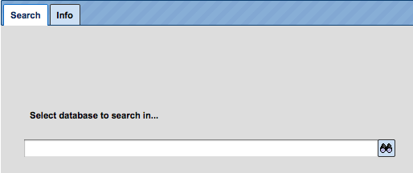
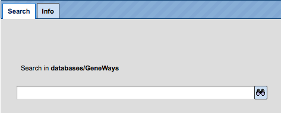
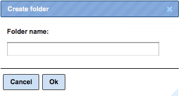
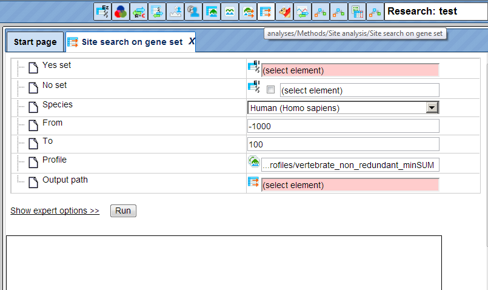
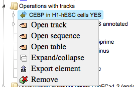
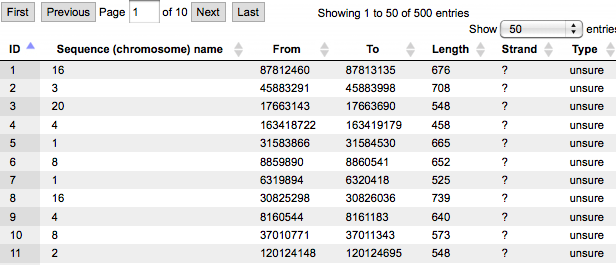
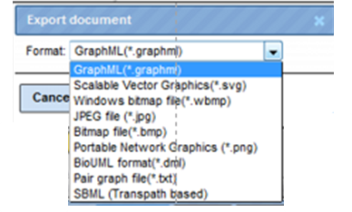
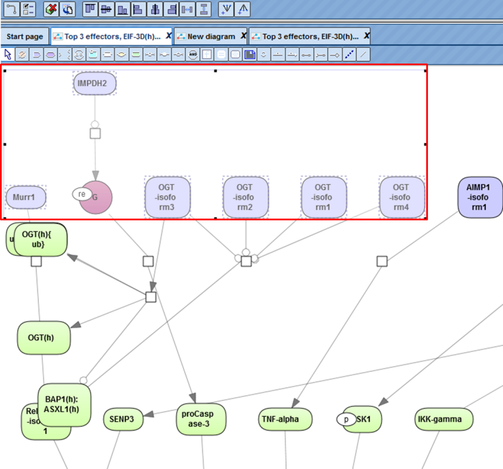
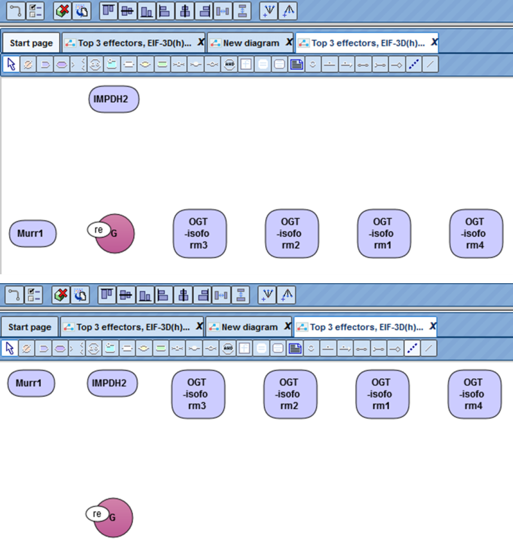

# Organization of the geneXplain platform

## The User Interface

When you open the geneXplain platform for the first time, a window opens that
contains the following areas:

**A** The Work Space, which is the main part of the window.

**B** The Tree Area (to the left of the Work Space), where you find the
collection of Databases, the uploaded Data files and the available Analyses
methods under the corresponding tabs, organized in a hierarchical tree
structure.

**C** The Info Box (in the left lower part), where you can select the data
resource to search in, or where you will get Information about the data file or
analysis method that you select with a single click in the Tree Area.

**D** The Operations Field (right lower part), providing a number of options
under the different tabs in a context-dependent manner.

**E** The general Control Panel, on top of the different areas, showing a
context-dependent set of icons for the available operations.

### Work Space

When you open the platform, the Work Space will show you all those research
areas that are supported by a number of bioinformatic workflows each. Clicking
on one of these tiled buttons will open a detailed listing of functions and
pre-composed workflows, which you can launch by directly activating the given
hyperlinks.

The listings of each Area introduce each Chapter of this User Guide that
explains the functionality provided:

| Area              | Chapter | Area                             | Chapter |
|-------------------|---------|----------------------------------|---------|
| RNA-seq           | 4       | Pathways                         | 12      |
| Proteomics        | 5       | NGS                              | 13      |
| Epigenomics       | 6       | Genomic variants                 | 14      |
| ChIP-seq          | 7       | Metabolism                       | 15      |
| Sequence analysis | 8       | Popular functions                | 16      |
| miRNA             | 9       | Gene or protein list             | 17      |
| Microarrays       | 10      | Complete list of workflows       | 18      |
| Drug targets      | 11      | Working with different databases | 19      |

The first workflow in nearly any Area is Load data, which is separately
described in **Chapter-3**, before the individual Areas are being depicted.

Also in the Work Space, all major input requirements will have to be done, the
progress of a workflow and the results output will appear here as well.

### Tree Area

In the Tree Area (**B** in the figure of Section 2.1), you find three tabs:
**Databases**, **Data**, and **Analyses**. Under each of these tabs, you find a
tree-structured listing of contents: the available databases, the data files to
work with, and the analysis methods you can apply. You can open any subdirectory
by a single mouse click on the respective item and using the button

, or by a double-click on the name of the folder to be opened.

#### Databases

Under this tab, you find all databases that are at your disposal: a number of
public databases (yellow symbols) as well as commercial ones that you have a
valid license for (green symbols). Write access may be additionally indicated by
a black “W” within the symbol, which may be red in case that write access,
although principally possible for this database, has not been activated in your
case.

Select one of the databases in the Tree Area by a single click with the left
mouse button; double click will open the subdirectory. For instance, when you
wish to go to GeneWays, you have to click once on the little white triangle next
to the term GeneWays, or double-click on the term itself to open the directory
underneath; either operation, or already a single click onto the name of the
database, suffice to indicate this data resource in the Info Box, along with a
short description.

Presently, by default, you should see the following listing of available
databases:

How you can work with the different databases will be explained in
**Chapter19**.

#### Data

On the tab Data, you will find your own datasets as well as predefined ones in
the directories **Examples**, **Projects**, and **Public**.

In the directory **Examples**, we provide you with a number of sample data you
may use for getting familiar with the system. Presently, these are some
optimization examples as well as one application example on expression data of
Psoriasis patient samples.

The optimization example refers to the CD95L pathway (*Reactome entry
REACT_900*), shown as diagram *CD95 signaling pathway* under Diagrams. Under
Plots, you find an example for a successful parameter optimization
(*C3C8_plot*), with the dots giving the experimental values for four different
molecules, and the straight lines showing the simulation results.

Under the heading **Projects**, you should initially find only one directory
with your username, with the two subfolders **Data** and **Journal**. **Data**
will be the place where all your own data will be deposited. Here, you can
define own subdirectories by opening a context menu with the right mouse button
and selecting the option New folder:

Each option in this menu can also be selected by the corresponding icon on top
of the tabs.

The sub-directory **Journal** stores a history of your activities. Opening it in
the Work Space shows you a list of all methods that you have previously
launched, including time stamp.

The root directory **Public** is presently not used yet; it is planned to
provide a platform for sharing own results with a wider community at a later
stage.

#### Analyses

On this tab, you find all methods you may apply using the geneXplain platform,
including the pre-defined workflows:

In the directory **JavaScript**, a collection of scripts have been gathered that
all can be called by your own scripts. The geneXplain platform provides you with
the possibility to create your own scripts on the Script tab in the Operations
Field. For instance, enter there the command “help (boxPlot);” (boxPlot is the
first JavaScript in the subdirectory **Functions**) and press Execute (or just
Enter): Some help text about boxPlot will be printed to the Work Space:

Under **Functions**, a number of standard JavaScript functions are listed,
whereas in the subdirectory **Host object**, a collection of scripts have been
put together that were specifically developed for the gXp platform.

The directory **Methods** contains all individual tools, or Bricks, that perform
specific tasks in one of the listed areas. Each method can be launched either by
double-clicking on the respective item, which will open the corresponding input
mask in the Work Space, or through the context menu that you can open with a
right-button mouse click on the method of interest.

In the directory **Workflows**, you find basically the same functional groups of
pre-defined workflows that are also listed on the Start page of the platform
(Work Space). Please note that the first two items on the Start page are
important preparatory tasks, but not workflows according to the definition of
the geneXplain platform. Please, refer to the following Chapters for operating
the pre-defined workflows and to **Chapter22** for creating your own
workflows.

### The Info Box

The Info Box shows two tabs, **Info** and **Search**.

#### Info tab

Under the Info tab, you will find short descriptions about the database, data
file or analysis method that you have clicked in the Tree Area. In many cases,
you will just see the name of the directory or file as **ID**, or the complete
path displayed in the field **Complete name**, and the number of subdirectories
and files right under the activated node as **Size**.

The information shown on the Info tab can be viewed in a separate window by
clicking the button

.

In case the activated file is a table (icon

or derived images; see 25.2.3), the number of rows in the table will be
indicated as Size. Optionally, a **Description** is shown as well, depending on
whether it has been entered when the file was generated. By clicking on the icon

, you may edit some of the information in a newly opened window. Depending on
the file type, the edit window may look like this:

Gray fields cannot be edited, contents of fields with white background can be
changed manually, additional information can be entered in the pink fields which
will then appear on the Info tab, if the changes made are saved afterwards with
the [Save] button of the Edit window.

Depending on the type of directory or file that you have activated in the Tree
Area, different types of information can be selected for the display on the Info
tab. This can be done by the selection box right to the tabs in the Info Box,
initially always showing “Default”:

Please, feel encouraged to find out the effects of the different views offered
here.

When you have a network diagram opened in the Work Space (**A** in the figure of
chapter 2) and you select a molecule or reaction with one click, you find
information about the selected element in the Info box.

#### Search

As long as you are under the tabs Data or Analyses in the Tree Area, you see
here only the message “Select database to search in …, maybe along with fields
and data from an earlier search.

This field gets activated as soon as you go to the tab Databases in the Tree
Area, and then click on one of the databases listed there. For instance, when
you wish to go to GeneWays, you have to click once on the little white triangle
next to the term GeneWays, or double-click on the term itself to open the
directory underneath; either operation, or already a single click onto the name
of the database, suffices to indicate this data resource in the Info Box:

You can insert your search term (e.g., a gene symbol) into the field underneath.
Clicking on the icon

launches the search. The search routine scans for exact matches, but use of
wildcards is possible. Thus, searching for elk* returns results for elk1,
elk2p1, elk3, and elk4.

The results will be shown in the Operations Field, under the tab Search result.
For instance, when searching in GeneWays for JAG1, the following result table
will be displayed:

The search term is highlighted in bold.

In some cases, the search results can be narrowed down by further specifying the
search space in the Info Box.

More about how to operate the individual databases will be explained in
**Chapter19**.

### The Operations Field

In the **Operations Field** (**D** in the figure of the Section introduction
2.1) a number of essential functions to operate the geneXplain platform are
provided on a number of tabs. How many and which tabs are shown depends very
much on the context.

Please note that not all tabs are always visible due to space constraints. In
these cases, double arrowheads left and right of the tabs indicate that there
are additional ones, reachable by clicking on these double arrowheads.

The function of the individual tabs will be explained in more detail in those
sections where their effect is part of a certain operation. In general, the icon

initiates the corresponding activity within the Operations Field, whereas

applies to the results generated in the Operations Field of the Work Space.

The full range of functions that you can make use of in the Operations Field is
explained in greater detail in Chapter 21.

## How to organize the user work space

### Changing user password and personal data

Your first password for the geneXplain platform is automatically generated and
sent to you by e-mail. Once you enter the platform you can change your password
and also have an option to edit your personal information.

To change password and edit the personal data, select the *Account info* button
(

) on the top menu control panel:

Your account information will be displayed in the work space as shown below:

The option to change the password is highlighted by the red oval. Once you press
[Change], you get an option to enter the new password:

To change the account details, press the button [Edit account info] in the form
above, highlighted by the green oval. The edit form looks like this:

Fill-in your details and press [Save]. Before saving, the system verifies your
password to enable the changes made in the form. After entering the password the
changes are saved.

### User Project, Data folder, creating new folders

When you enter your account for the first time, you can see the following three
folders in the Tree Area under the *Data* tab (red oval on the picture below):
Examples, Projects and Public. Each of these folders can be expanded by clicking
on the small triangle on the left side of the folder name (green oval on the
picture below).

The folder Projects is your folder in the tree where you are going to make all
the analyses.

If you expand the Project folder, you can see the project that was created upon
registration of your account (

), and if you expand it further, you can see the folder Data. This location,
*data/Projects/User project/Data/* is exactly the location where you can upload
your data and save all the analysis results.

Upon one mouse click on the folder Data, as in the picture above, you can apply
the button

from the top control menu to create a new folder within the selected one.

In this way, you can define the hierarchical organization of your folders and
sub-folders within your project, for example as shown below.

Every time when you run a workflow, you need to specify a location of the
results folder, and you can specify any particular location within your project
area.

There are two other folders available for you initially, Examples and Public.
The folder Examples contains pre-analyzed publicly available data sets, which
you are welcome to have a look through our examples. You can copy tables or
tracks from these two folders into your project area and use them, for example,
for test runs.

The Public folder contains publicly available data sets which might be useful to
apply for various analysis purposes.

All users have read access to the folders Examples and Public, but no write
access. You cannot save any files directly in the Examples or Public folder.
However, you can copy tables and tracks from these two folders into your project
area and then modify and work with them as you like.

### How to check information about the available work space

To check your totally available work space, go with mouse over to the project
name, so that it is highlighted in blue as shown below. In the Info Box you can
see information about this project including disk quota. This is the space
available for you. If you plan to upload large files, please make sure you have
enough work space available.

To check how much space out of your quota is already occupied, go with mouse
over to the *Data* folder within your project, so that it is highlighted in blue
as shown below. In the Info Box you can see information about this folder
including its size on the disk.

In the same way, you can check the size for every individual folder in your
project.

**Note***.* If additional work space or storage space is required, especially if
you plan to upload and analyze large data files, please feel free to ask for
details (info@genexplain.com).

### User toolbar

In the Control Panel (see E in the figure of Section 2.1), the set of icons on
the left side is fixed by default, whereas the right side is customizable. Here,
you can create a user-specific toolbar with your most frequently used analysis
methods, workflows and datasets. To create your own toolbar you can drag and
drop your favorite workflows and files for which you often need a quick access
into the Control Panel. The User tool bar will then be located at the top right
top corner, highlighted by a red oval in the screenshot below.

To add any analysis method/workflow/gene set, open the respective method in the
Tree Area or in the Work Space and drag & drop it onto the user toolbar as shown
below.

You can quickly open your favorite items from this icon menu. To open any
method, place the cursor on the symbol and you get the complete name of the
method which can be clicked to open in the workspace as shown below:

In the above screenshot, the method ‘Site search on gene set’ has been opened
through the user toolbar. If you want to remove any method from the user
toolbar, right click the symbol and you will get an option ‘REMOVE’.

### Project properties, or how to fix the releases of the databases to be
applied in user’s projects

The geneXplain platform provides access to several versions of the databases
installed.

You can select your desired version of the database and fix it for your project
using the *Project properties* feature. By default the latest version of all
databases are applied. Project Properties form can be opened via the button

in the control panel:

The form opens as shown below:

For each database shown in the form, the available versions can be selected
using the drop down menu. As shown below, TRANSPATH® 2016.3 database version is
selected. After selection press [Save] and the selected version of the database
will be used in this project for all the analyses.

Important to note, this change is applied for one selected project, the project
name is shown on the top of the form, highlighted by the red oval on the picture
above. If you have several projects, you can fix database versions for each
project individually.

## How to handle tables, tracks, diagrams: basics

### File handling

#### File selection

All analysis tools, and likewise all prepared workflows, require input data from
a file in the Tree Area. The respective file can be loaded into an analysis
toolby

-   simple dragging-and-dropping of the file from the Tree Area into the
    corresponding field in the Work Space, or

-   by clicking into this field and making the selection from the directory
    which opens.

Multiple selections can be done only in the second way.

#### File handling in the Tree Area

On mouse-over, the file name will gain a faint-bluish background. Upon a single
click on a file name, its background will turn into a persistent light blue, and
information about this file will be displayed in the Info Box. Double-clicking
on a file will open it under a new tab in the Work Space, and the file name will
be additionally emphasized by bold lettering as long as the corresponding tab is
in the Work Space’s foreground. Only files with an icon attached can be opened
this way.

Files can also be opened by right-clicking on them and selecting the “Open
table” option. You can also delete files (“Remove”; default value is “No”)this
way. Both functions are also available through the corresponding icons (

and

, resp.) in the Control Panel on top of the different frames.

While opening and deleting files works for nearly any file, the third option is
different among distinct file types:

-   Tables (

    

    >   and derivatives) can be exported. When activating this function, a
    >   selection of different formats is provided for the file to be generated.
    >   It is also available through the icon

    

    >   export.gif

    >   on top of the Tree Area.

-   Diagrams (

    

    >   ) can be expanded/collapsed to show/hide their components (nodes and
    >   edges); this function can also be accessed by clicking on the white
    >   arrowhead next to the diagram icon.

Plots (

) can be edited. Only under this option, their complete deletion is possible as
well.

### Tables

Any table may be opened by double-clicking the corresponding name in the Tree
Area. It will open under a new tab in the Work Space.

The contents of the table are sorted according to the values in one of its
columns. Being opened for the first time, a default column is defined for
sorting, usually the ID column. This default column is indicated by a blue
arrowhead. If this arrowhead points upwards, the table rows are sorted in
ascending order of this column’s values. Clicking on this arrowhead will change
it into a downwards pointing one, while the values are sorted in descending
order. Correspondingly, you may sort the table according to the values of any
other column in ascending or descending order by clicking on the up- or
downwards pointing gray arrowhead on top of this column, respectively.

On top of the table, you can navigate between the individual pages of the table;
it is also shown on which page out of how many pages in total you are, and in
the right top corner, the page size in terms of number of entries (rows) is
shown and can be adjusted.

You can edit the contents of a table by pressing the [Edit] button in the right
upper corner. Now, you can manually edit the contents of each cell in the table.
With the [Apply] option, you will save this change, while [Cancel] quits it.

Even without activating the Edit function, you can select

-   individual rows with a left-mouse click,

-   several ones by keeping the Ctrl key pressed,

-   a range of rows with the Shift key pressed when clicking on the last row of
    the range to be selected, or

-   [Select all] by clicking on the corresponding button.

The selected rows can be saved as a separate file, which by default is given the
name *<original file name> subset*, but you can change this name.

### Basic operations with tracks

View track in genome browser

Upon double-clicking on a track name in the tree area the track will be opened
in the work space in the genome browser.

In the pop-up window *Add tracks to genome browser* you can select which tracks,
among those available in Ensembl, should be opened together with your track.
Here, three tracks are selected, *GC-content*, *Genes*, and *Variations*. When
the selection is ready, push the [Ok] to get the following view with your track
on top:

On the tab name you can see genome, species and build information for this
track, highlighted by the red oval.

The small triangles on the right side of the track name can be used to jump to
the next or previous site of this track:

Use the buttons

in the top control menu to zoom in and out.

The buttons

help to shift the visible part to the left or to the right.

The same effect can be also achieved by dragging the picture with the mouse.

You can also jump between different chromosomes by selecting the chromosome
number in the field *Sequence (chromosome)*.

As the next step to enrich the visualization, and to gather more information
about your track of interest, you can add the additional pre-existing tracks
from the folder *Examples* . The pre-exisiting tracks can be visualized using
the
URL:<https://platform.genexplain.com/bioumlweb/#de=data/Examples/RNA-Seq%20analysis%20of%20human%20esophageal%20squamous%20cell%20carcinoma%20(ESCC)%2C%20GSE32424%2C%20FASTQ%20files/Data/Fastq%20analysis/SRR349741.fastq%20(Genome%20variants%20and%20indels%20from%20RNA-seq)/SNP_indels.vcf_site_loss>.

Open track as a table

To open a track as a table, use a right mouse click on the track name in the
tree area or [Ctrl + mouse click] for Mac users.

Using the same menu, you can apply other functions to the selected track, e.g.
export it in available formats or delete it.

A tabular view for the same track is shown below. Each row corresponds to one
fragment. For each fragment, you can see the column **ID** with the fragment
number, **Chromosome**, positions in the respective columns **From** and **To**,
and several additional columns, three in this case.

Filter track by condition*.*

When any track is opened as a table, it can be filtered by any condition in the
specified columns. Filter options are available under the tab Filters in the
operations field.

Here, the filter is applied to select the fragments located on chromosome 1.

## Diagram handling

Diagrams are provided by a number of databases and tools in the platform. The
general schema of their use is that an overview of the corresponding graph is
shown in the Operation Field, under the tab Overview, while a full-sized picture
is shown in the Work Space, where usually only a part of the whole diagram fits
on the screen. The diagrams exhibit components as ovals, reactions as squares,
and links as lines or arrows.

The section displayed can be shifted either in the Work Space by moving the
mouse pointer (hand symbol) keeping the left mouse button pressed, or by
shifting the blue-dotted rectangle in the Operation Field (mouse over: pointer
symbol turns into a **four-arrow plus sign**, shifting can be performed while
keeping the left mouse button pressed).

To facilitate orientation in large diagrams, individual edges are highlighted
(turning from a thin, usually black arrow into a thick light-blue one).

Double-click on an individual node will show information about this component
under the Info tab of the Info Box (this works for BioModels).

Diagrams can be zoomed in and zoomed out, by click on the buttons

or

, correspondingly.

They can be exported in several formats by clicking the button

.

Diagrams can be zoomed in and zoomed out, by clicking on the buttons

or

, respectively.

Diagram nodes can be multi-selected via the [Ctrl] button (picture below).
Selected nodes can be used for *Alignments* or *Distribution* editing within the
diagram or can be saved as a subset.

Five alignment methods are available in the tool bar (see picture below) after
opening a diagram in the workspace.

After pushing one of the buttons in the toolbar, the selected nodes in the
diagram are aligned accordingly. The picture below shows an *Up alignment* of
all nodes.

Two distribution methods horizontally

and vertically

are available in the tool bar after opening a diagram in the workspace. After
pushing one of the buttons in the toolbar, the selected nodes in the diagram are
positioned accordingly. The picture below shows a *Vertically distribution* of
one node.

For edge editing you can use either the dialog box or a clickable connecting
line to add new edges to a diagram.
