# miRNA

When you open this Area, a list of workflows optimized for working with microRNA
data will show up, which looks as follows:

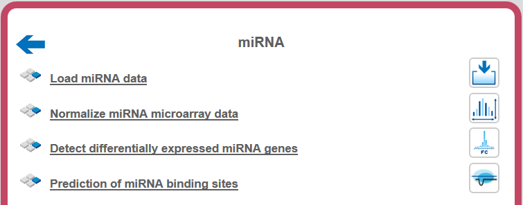

## Prediction of miRNA binding sites

MicroRNAs, or miRNAs, post-transcriptionally affect (mostly: repress) the
expression of protein-coding genes. The human genome encodes over 1000 miRNA
genes that collectively target the vast majority of messenger RNAs (mRNAs). This
workflow can help to predict miRNA binding sites. Starting from a gene list,
first a collection of 3’ untranslated regions (3’ UTRs) is created. This
collection is used to map against a miRmap library, which derived from the
[mirBase database](http://www.mirbase.org/index.shtml) (release 20;
http://www.mirbase.org). The last step of the workflow is based on the [miRmap
method](http://mirmap.ezlab.org/) (*analyses/Galaxy/microRNA/mirmap*;
http://mirmap.ezlab.org*)*, published by Vejnar & Zdobnov, [Nucleic Acids Res.
40:11673-11683, 2012](http://nar.oxfordjournals.org/content/40/22/11673.long).
The result of the workflow is a table with all predicted miRNA binding sites and a track for visualization in the created sequence collection. The workflow can
be found on the Start page via the miRNA button.

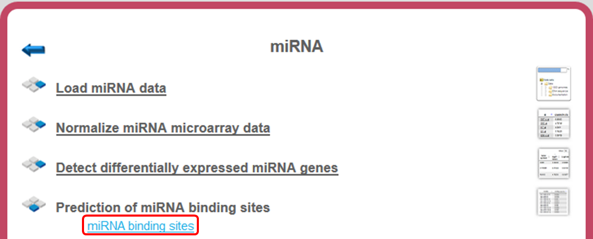

To launch the workflow, follow these steps:

**Step 1.** Open the workflow input form from the Start page. It looks as shown
below:

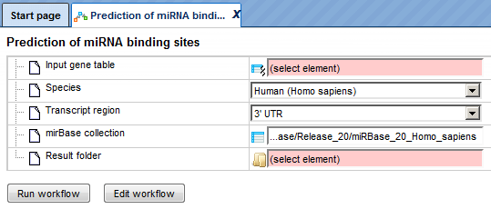

**Step 2.** Specify the input gene table. The input gene sets might be lists of
differentially regulated genes or any gene or protein list of interest. You can
drag them from your project within the tree area and drop them in the pink box
of the field **Input table**. Alternatively, you may click on the pink field
“select element” and a new window will be opened, where you can select the input
gene set as shown below.

The further steps of the workflow are demonstrated on the example file, which
can be found in the geneXplain platform under:

data/Examples/miRNA binding site prediction (miRNA-155 target
genes)/Data/hsa-miR-155-5p published target genes

This table contains four genes that are already published targets for one
particular miRNA, hsa-miR-155-5p, for which several target genes have been
published as well; we have derived this information from the TRANSFAC® database.

**Step 3.** Specify the biological species of the input set in the field
**Species** by selecting it from the drop-down menu.

**Step 4.** In the field **Transcript region**, choose the gene region from the
drop-down menu. Here, the 3’ UTR is selected as default with a fixed length of
300bp. The CDS information is ignored.

**Step 5.** Selection of **miRBASE collection**. By clicking in the this field,
six different miRBase collections from release 20 are available for *Homo
sapiens*, *Mus musculus*, *Rattus norvegicus*, *Drosophila melanogaster*, *Danio
rerio* and *Caenorhabditis elegans*.

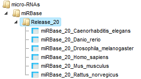

The miRBase library can be opened as a table as shown below.

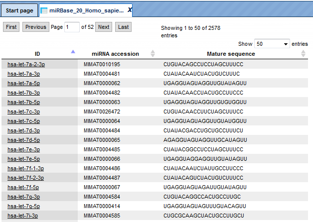

The miRBase library table has three columns for each miRNA. Identifiers in the
column ID are hyperlinked to miRBase (<http://www.mirbase.org/>). Two other
columns are the miRNA accession numbers and the mature sequence, which is used
for binding site identification.

You can use the whole library or you can create a subset of several or even just
one miRNA of interest to focus on predicting binding sites for this particular
miRNA.

In this example, let’s cerate a subset containing just one miRNA,
hsa-miR-155-5p, for which several target genes have been already published. To
create a subset from the table, apply Filter tab in the operations field. The
resulting customized miRBase contains just one row.

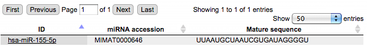

**Step 6.** Define where the folder with the results should be located in the
tree. You can do so by clicking on the pink field *select element* in the field
**Result folder**, and a new window will be opened, where you can select the
location of the result folder and define its name.

**Step 7.** Press the [Run workflow] button.

When the workflow is completed, the result folder is opened by default.

Let’s consider the results.

[data/Examples/miRNA binding site prediction (miRNA-155 target
genes)/Data/hsa-miR-155-5p published target genes (miRNA binding
sites)](http://platform.genexplain.com/bioumlweb/#de=data/Examples/miRNA binding
site prediction (miRNA-155 target genes)/Data/hsa-miR-155-5p published target
genes (miRNA binding sites)/)

The result folder contains the following tables: Ensembl transcript (),
Site output () with all predicted miRNA binding sites, 
Site output track () 
for visualization of predicted miRNA sites, Summary output () and 
Transcript region track 
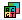

.

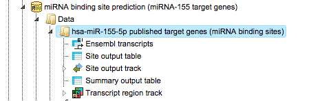

The table **Ensembl transcripts** corresponds to the input gene table converted
to the Ensembl transcript IDs (first column **ID**). The other columns of this
table are the same as they are in the input table. In this example, 4 Ensembl
genes are converted into 26 Ensembl transcripts.

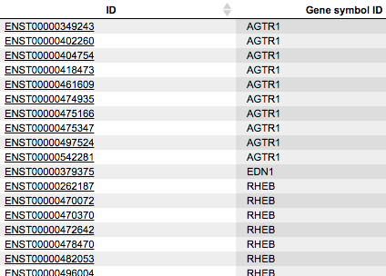

These Ensembl transcript IDs are needed to construct the **Transcript region
track, in this workflow especially containing** 3’ UTRs of genes given in the
input table. The workflow takes 300 bp regions as 3’ UTRs.

The **Site output table** contains all identified miRNA binding sites; each row
in this table corresponds to one identified miRNA binding site, and each
site/row has an ID assigned. The column **Sequence** corresponds to the 300 bp
3’ UTR of the indicated Ensembl transcript, where the search for miRNA sites has
been done. The column **miRNA** contains the name of **miRNA** binding to this
site, in this example hsa-miR-155-5p. The columns **Start** and **End** are
positions within the input sequence and the **column Binding site contains the
sequence of the site**.

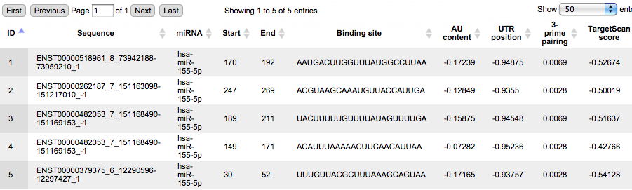

The **Site output track** enables the visualization of the predicted sites in
the 3’ UTRs of the input gene list. With a double-click on (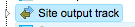) in the results folder, the dialog box *Configure genome for track* is opened.

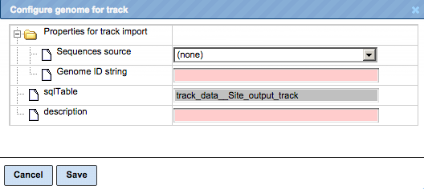

Within this dialog box, first set the field **Sequence source** to *Custom…*

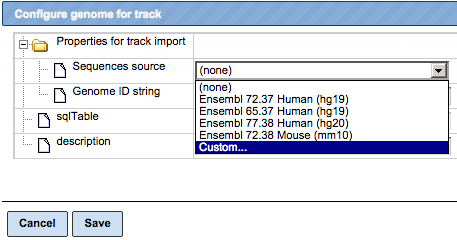

and [Save] it. The dialog box is automatically adjusted, and the field *Sequence collection* becomes available.

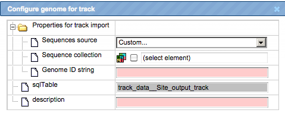

You can drag and drop the sequence collection Transcript region track from the
workflow results folder and [Save] it. The visualization is opened automatically
in the work area.

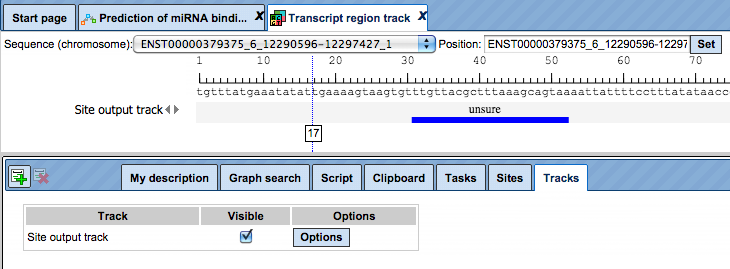

You can modify visualization settings by opening the tab *Tracks* in the
*Operations Field,* highlighted by the red boxes on the screenshot above, and
press the button [Options]. The dialog box *Site output track* will be opened.
You can modify different settings according to your preferences and [Save] them.
Here, the settings in the highlighted check-boxes were changed as shown below.

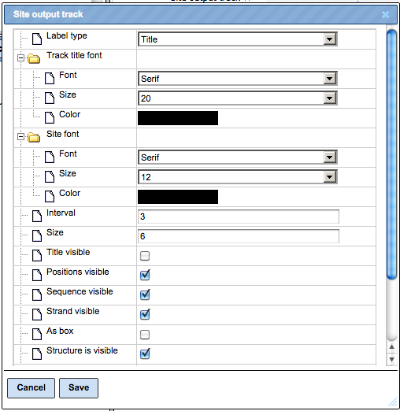

These changes resulted in the following visualization.

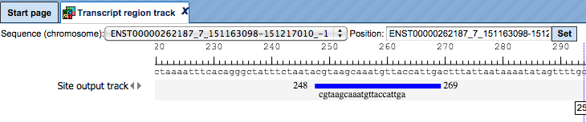

The **Summary output table** presents those transcripts where miRNA binding
sites are identified, in this example four transcripts.

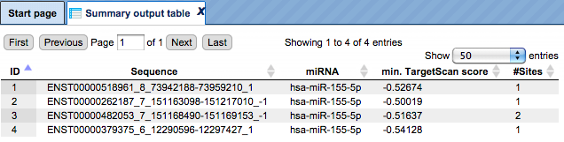

Each row corresponds to one transcript. The column **Sequence** contains the
titles of the Ensembl transcripts, and the column **miRNA** presents name of the
miRNA. The number of binding sites for a particular miRNA in each transcript is
shown in the column **\#Sites**.
